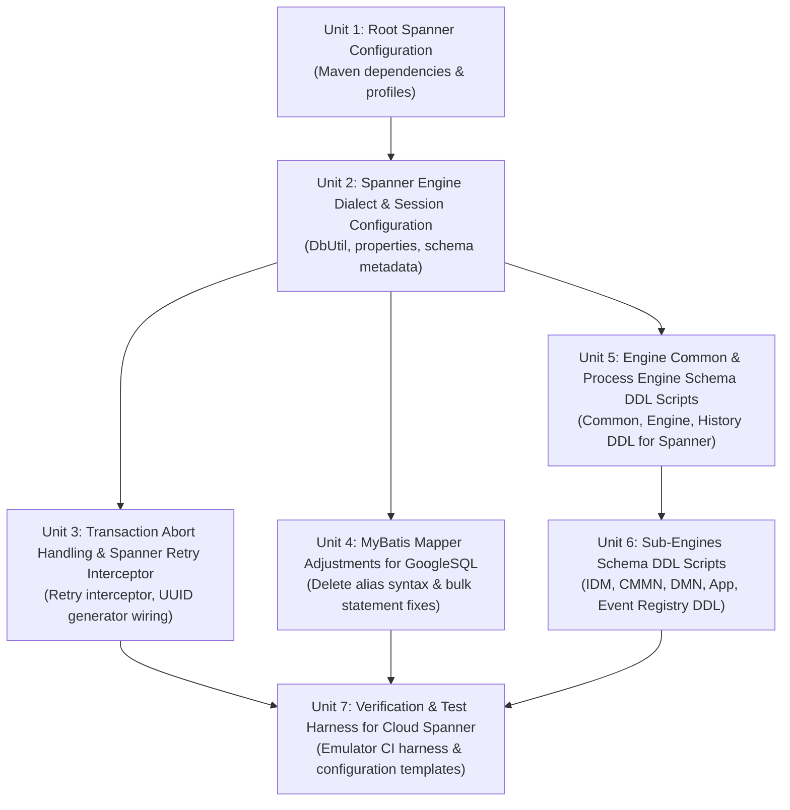

# Migration Plan: Flowable Engine to Cloud Spanner (GoogleSQL)

## Status: Approved by Developer (Plan Approval Gate Passed)

This migration plan defines the atomic, discrete work units required to enable Google Cloud Spanner support (GoogleSQL dialect) across Flowable Engine.

Flowable uses MyBatis for persistence across eight modular sub-engines (`flowable-engine-common`, `flowable-engine`, `flowable-cmmn-engine`, `flowable-dmn-engine`, `flowable-idm-engine`, `flowable-app-engine`, `flowable-event-registry`, and specialized service modules). The persistence model relies on parameterized SQL queries, table/session management (`DbSqlSession`), database dialect introspection (`DbUtil`), and schema management via SQL scripts (`AbstractSqlScriptBasedDbSchemaManager`).

The migration introduces Spanner capabilities alongside existing database support (`h2`, `mysql`, `postgresql`, `oracle`, `db2`, `mssql`), preserving 100% build compatibility and existing database profiles.

---

## Dependency Graph

---

## Confirmed Policies & Decisions (Developer Approved)

All 8 core architectural decisions have been reviewed and confirmed by the developer:

| # | Policy / Decision | Confirmed Selection | Technical Specification & Details |
| :--- | :--- | :--- | :--- |
| **1** | **Target SQL Dialect** ([`SPN-D1`](file:///usr/local/google/home/vaibhavch/.gemini/config/plugins/sam/skills/sam-knowledge/references/spanner/decisions.md#L13)) | **GoogleSQL** | Native Spanner GoogleSQL type system: `STRING(n)`, `STRING(MAX)`, `BYTES(MAX)`, `INT64`, `BOOL`, `TIMESTAMP`. |
| **2** | **Transaction Isolation Level** ([`SPN-D2`](file:///usr/local/google/home/vaibhavch/.gemini/config/plugins/sam/skills/sam-knowledge/references/spanner/decisions.md#L27), [`JDBC-C8`](file:///usr/local/google/home/vaibhavch/.gemini/config/plugins/sam/skills/sam-knowledge/references/spanner/access/spanner-jdbc/conversion.md#L132)) | **`SERIALIZABLE`** | Spanner's default external consistency model. Transaction aborts handled transparently via `SpannerRetryInterceptor`. |
| **3** | **Validation Target** ([`SPN-D3`](file:///usr/local/google/home/vaibhavch/.gemini/config/plugins/sam/skills/sam-knowledge/references/spanner/decisions.md#L41)) | **Cloud Spanner Emulator** | Integration testing and automated CI workflows execute against `gcr.io/cloud-spanner-emulator/emulator:latest` on ports 9010 (gRPC) / 9020 (REST). |
| **4** | **Table Interleaving Policy** ([`SPN-D4`](file:///usr/local/google/home/vaibhavch/.gemini/config/plugins/sam/skills/sam-knowledge/references/spanner/decisions.md#L55), [`GSQL-C10`](file:///usr/local/google/home/vaibhavch/.gemini/config/plugins/sam/skills/sam-knowledge/references/spanner/dialect/googlesql/conversion.md#L125)) | **Flat standalone tables** | Preserves Flowable's uniform single-column primary key structure (`ID_ VARCHAR(64)`) and secondary foreign-key indexes across all sub-engines. |
| **5** | **Primary Key Generation Policy** ([`SPN-D7`](file:///usr/local/google/home/vaibhavch/.gemini/config/plugins/sam/skills/sam-knowledge/references/spanner/decisions.md#L95)) | **`StrongUuidGenerator`** | Defaults to `StrongUuidGenerator` (UUID strings) when `databaseType=spanner` to prevent monotonically increasing sequential integer hotspotting on root splits. |
| **6** | **Entity Identifier Column Typing** ([`SPN-D8`](file:///usr/local/google/home/vaibhavch/.gemini/config/plugins/sam/skills/sam-knowledge/references/spanner/decisions.md#L115), [`GSQL-C4`](file:///usr/local/google/home/vaibhavch/.gemini/config/plugins/sam/skills/sam-knowledge/references/spanner/dialect/googlesql/conversion.md#L55)) | **`STRING(64)`** | Maps Flowable entity `ID_` fields to `STRING(64)` in GoogleSQL DDL, ensuring 100% compatibility with Java entity types and MyBatis mappers. |
| **7** | **Schema DDL Execution Strategy** ([`SPN-D5`](file:///usr/local/google/home/vaibhavch/.gemini/config/plugins/sam/skills/sam-knowledge/references/spanner/decisions.md#L70), [`SPN-C5`](file:///usr/local/google/home/vaibhavch/.gemini/config/plugins/sam/skills/sam-knowledge/references/spanner/conversion.md#L61)) | **Batch DDL** | DDL schema creation and teardown scripts run as single atomic batch operations (`START BATCH DDL ... RUN BATCH`) via Cloud Spanner JDBC driver. |
| **8** | **Transaction Abort Retry Policy** ([`SPN-C1`](file:///usr/local/google/home/vaibhavch/.gemini/config/plugins/sam/skills/sam-knowledge/references/spanner/conversion.md#L12), [`JDBC-C4`](file:///usr/local/google/home/vaibhavch/.gemini/config/plugins/sam/skills/sam-knowledge/references/spanner/access/spanner-jdbc/conversion.md#L63)) | **`SpannerRetryInterceptor`** | Transparent command retries on Spanner `ABORTED` / `AbortedDueToConcurrentModificationException` with exponential backoff and jitter. |

---

## Open Questions & Technical Assumptions

1. **BLOB Type Mapping:** `blobType` in `spanner.properties` is configured as `BLOB`. Cloud Spanner JDBC maps JDBC `Types.BLOB` and `Types.BINARY` to Spanner `BYTES(MAX)`.
2. **Timestamps:** Application-assigned timestamps (`CREATE_TIME_`, `START_TIME_`, `END_TIME_`) are mapped to Spanner `TIMESTAMP`. Native commit-timestamp (`allow_commit_timestamp=true`) is not enabled on entity tables to prevent in-transaction read restrictions (`PENDING_COMMIT_TIMESTAMP` cannot be read within the same transaction).
3. **Pagination Syntax:** GoogleSQL supports `LIMIT #{maxResults} OFFSET #{firstResult}`, configured in `spanner.properties`.
4. **Boolean Values:** Stored as native GoogleSQL `BOOL`, configured as `boolValue=TRUE` in `spanner.properties`.
5. **Null Ordering:** GoogleSQL natively supports `ORDER BY <column> [ASC|DESC] NULLS FIRST` and `NULLS LAST`.
6. **Schema Name:** In Cloud Spanner JDBC, default schema metadata is empty string `""` or `null`. Table data managers and schema managers will query with empty schema rather than assuming `public`.
7. **Secondary Indexes:** Unique indexes on nullable columns will use GoogleSQL `CREATE UNIQUE NULL_FILTERED INDEX` ([`GSQL-C5`](file:///usr/local/google/home/vaibhavch/.gemini/config/plugins/sam/skills/sam-knowledge/references/spanner/dialect/googlesql/conversion.md#L68)) to avoid treating multiple nulls as duplicate constraint violations.

---

## Detailed Work Units

### Unit 1: Root Spanner Configuration

- **One-line Summary:** Introduce the Cloud Spanner JDBC driver dependency and build profile alongside existing databases without altering default build behavior.
- **Target Files:**
  - [`modules/flowable-dependencies/pom.xml`](file:///usr/local/google/home/vaibhavch/sam-teamfood/flowable-engine/modules/flowable-dependencies/pom.xml)
  - [`modules/flowable-parent/pom.xml`](file:///usr/local/google/home/vaibhavch/sam-teamfood/flowable-engine/modules/flowable-parent/pom.xml)
- **Step-by-step Changes:**
  1. In `modules/flowable-dependencies/pom.xml`:
     - Add property `<google-cloud-spanner-jdbc.version>2.27.0</google-cloud-spanner-jdbc.version>` under `<!-- JDBC Driver dependencies -->`.
     - Add `com.google.cloud:google-cloud-spanner-jdbc` to `<dependencyManagement><dependencies>` section.
  2. In `modules/flowable-parent/pom.xml`:
     - Add a `<profile><id>spanner</id>` containing dependency `com.google.cloud:google-cloud-spanner-jdbc` alongside existing `postgresql`, `mysql`, `mssql`, `oracle`, `db2`, and `mariadb` profiles.
  3. Ensure existing database driver dependencies, versions, and build configurations remain completely intact as default.
- **Dependencies:** None (Root unit).
- **Sequencing Rationale:** Root unit. Establishes the required Spanner JDBC driver artifacts in the Maven dependency management tree so subsequent units can reference and compile against them without breaking standard builds.

---

### Unit 2: Spanner Engine Dialect & Session Configuration

- **One-line Summary:** Register Spanner database dialect resolution, dialect properties, metadata filtering, and null-ordering handling in `flowable-engine-common`.
- **Target Files:**
  - [`modules/flowable-engine-common/src/main/java/org/flowable/common/engine/impl/util/DbUtil.java`](file:///usr/local/google/home/vaibhavch/sam-teamfood/flowable-engine/modules/flowable-engine-common/src/main/java/org/flowable/common/engine/impl/util/DbUtil.java)
  - [`modules/flowable-engine-common/src/main/java/org/flowable/common/engine/impl/AbstractEngineConfiguration.java`](file:///usr/local/google/home/vaibhavch/sam-teamfood/flowable-engine/modules/flowable-engine-common/src/main/java/org/flowable/common/engine/impl/AbstractEngineConfiguration.java)
  - `modules/flowable-engine-common/src/main/resources/org/flowable/common/db/properties/spanner.properties` *(New File)*
  - [`modules/flowable-engine-common/src/main/java/org/flowable/common/engine/impl/db/ListQueryParameterObject.java`](file:///usr/local/google/home/vaibhavch/sam-teamfood/flowable-engine/modules/flowable-engine-common/src/main/java/org/flowable/common/engine/impl/db/ListQueryParameterObject.java)
  - [`modules/flowable-engine-common/src/main/java/org/flowable/common/engine/impl/persistence/entity/TableDataManagerImpl.java`](file:///usr/local/google/home/vaibhavch/sam-teamfood/flowable-engine/modules/flowable-engine-common/src/main/java/org/flowable/common/engine/impl/persistence/entity/TableDataManagerImpl.java)
  - [`modules/flowable-engine-common/src/main/java/org/flowable/common/engine/impl/db/AbstractSqlScriptBasedDbSchemaManager.java`](file:///usr/local/google/home/vaibhavch/sam-teamfood/flowable-engine/modules/flowable-engine-common/src/main/java/org/flowable/common/engine/impl/db/AbstractSqlScriptBasedDbSchemaManager.java)
- **Step-by-step Changes:**
  1. In `DbUtil.java`:
     - Add `public static final String DATABASE_TYPE_SPANNER = "spanner";`.
     - In `getDefaultDatabaseTypeMappings()`, map product name `"Google Cloud Spanner"` to `DATABASE_TYPE_SPANNER`.
     - In `determineDatabaseType()`, add fallback check for Spanner product name or `jdbc:cloudspanner:` URL prefix.
  2. In `AbstractEngineConfiguration.java`:
     - Add `public static final String DATABASE_TYPE_SPANNER = "spanner";`.
  3. Create `spanner.properties` under `modules/flowable-engine-common/src/main/resources/org/flowable/common/db/properties/`:
     - Define `limitAfter=LIMIT #{maxResults} OFFSET #{firstResult}`.
     - Define `blobType=BLOB`.
     - Define `boolValue=TRUE`.
  4. In `ListQueryParameterObject.java`:
     - Add `DATABASE_TYPE_SPANNER` check to the `NULLS FIRST` and `NULLS LAST` order-by branches.
  5. In `TableDataManagerImpl.java`:
     - In `getTableNameFilter()` and `getTableNames()`, handle Spanner metadata (uppercase matching, default schema `""`).
  6. In `AbstractSqlScriptBasedDbSchemaManager.java`:
     - In `isTablePresent()`, ensure schema defaults to empty or `null` when `databaseType` is `spanner`.
- **Dependencies:** Unit 1.
- **Sequencing Rationale:** Establishes core database type recognition and SQL syntax dialect parameters required before transaction interceptors, mappers, or schema scripts can execute.

---

### Unit 3: Transaction Abort Handling & Spanner Retry Interceptor

- **One-line Summary:** Introduce `SpannerRetryInterceptor` for automatic abort retries and configure `StrongUuidGenerator` to prevent primary key write hotspotting.
- **Target Files:**
  - `modules/flowable-engine-common/src/main/java/org/flowable/common/engine/impl/interceptor/SpannerRetryInterceptor.java` *(New File)*
  - [`modules/flowable-engine-common/src/main/java/org/flowable/common/engine/impl/AbstractEngineConfiguration.java`](file:///usr/local/google/home/vaibhavch/sam-teamfood/flowable-engine/modules/flowable-engine-common/src/main/java/org/flowable/common/engine/impl/AbstractEngineConfiguration.java)
  - [`modules/flowable-engine/src/main/java/org/flowable/engine/impl/cfg/ProcessEngineConfigurationImpl.java`](file:///usr/local/google/home/vaibhavch/sam-teamfood/flowable-engine/modules/flowable-engine/src/main/java/org/flowable/engine/impl/cfg/ProcessEngineConfigurationImpl.java)
- **Step-by-step Changes:**
  1. Author `SpannerRetryInterceptor.java` in `org.flowable.common.engine.impl.interceptor`:
     - Implement retry loop with configurable retry count (`nrRetries = 3`), base wait time (`waitTime = 50ms`), and exponential multiplier (`waitTimeIncrease = 2` or `5`).
     - In `isTransactionRetryException(Throwable exception)`, inspect exception type and cause chain for Spanner abort conditions: check for `AbortedException`, `AbortedDueToConcurrentModificationException`, gRPC status string `"ABORTED"`, or gRPC code 10. Avoid `SQLState` matching since Spanner `SQLState` is `null` ([`JDBC-C2`](file:///usr/local/google/home/vaibhavch/.gemini/config/plugins/sam/skills/sam-knowledge/references/spanner/access/spanner-jdbc/conversion.md#L36)).
  2. In `AbstractEngineConfiguration.java`:
     - In `getDefaultCommandInterceptors()`, instantiate and add `SpannerRetryInterceptor` to the interceptor chain when `DATABASE_TYPE_SPANNER.equals(databaseType)`.
  3. In `ProcessEngineConfigurationImpl.java`:
     - In `initIdGenerator()`, default to `idGenerator = new StrongUuidGenerator()` when `DATABASE_TYPE_SPANNER.equals(databaseType)`. This aligns `ProcessEngine` with the other Flowable sub-engines and prevents sequential PK hotspotting on Spanner root splits.
- **Dependencies:** Unit 2.
- **Sequencing Rationale:** Flowable executes workflow state transitions inside Command transactions. Equipping the command chain with abort retries and UUID primary keys ensures transaction reliability when DDL and queries are exercised in later units.

---

### Unit 4: MyBatis Mapper Adjustments for GoogleSQL Syntax Compatibility

- **One-line Summary:** Modify MyBatis XML mappers to eliminate unsupported table aliases in `DELETE` statements and ensure GoogleSQL compliance.
- **Target Files:**
  - [`modules/flowable-engine/src/main/resources/org/flowable/db/mapping/entity/HistoricDetail.xml`](file:///usr/local/google/home/vaibhavch/sam-teamfood/flowable-engine/modules/flowable-engine/src/main/resources/org/flowable/db/mapping/entity/HistoricDetail.xml)
  - [`modules/flowable-engine/src/main/resources/org/flowable/db/mapping/entity/HistoricActivityInstance.xml`](file:///usr/local/google/home/vaibhavch/sam-teamfood/flowable-engine/modules/flowable-engine/src/main/resources/org/flowable/db/mapping/entity/HistoricActivityInstance.xml)
  - [`modules/flowable-variable-service/src/main/resources/org/flowable/variable/service/db/mapping/entity/HistoricVariableInstance.xml`](file:///usr/local/google/home/vaibhavch/sam-teamfood/flowable-engine/modules/flowable-variable-service/src/main/resources/org/flowable/variable/service/db/mapping/entity/HistoricVariableInstance.xml)
  - [`modules/flowable-task-service/src/main/resources/org/flowable/task/service/db/mapping/entity/HistoricTaskLogEntry.xml`](file:///usr/local/google/home/vaibhavch/sam-teamfood/flowable-engine/modules/flowable-task-service/src/main/resources/org/flowable/task/service/db/mapping/entity/HistoricTaskLogEntry.xml)
  - [`modules/flowable-engine/src/main/resources/org/flowable/db/mapping/ChangeTenantBpmn.xml`](file:///usr/local/google/home/vaibhavch/sam-teamfood/flowable-engine/modules/flowable-engine/src/main/resources/org/flowable/db/mapping/ChangeTenantBpmn.xml)
- **Step-by-step Changes:**
  1. In `HistoricDetail.xml` (line 219):
     - Update `<if test="_databaseId != 'postgres' and _databaseId != 'cockroachdb' and _databaseId != 'db2'"> HIDETAIL </if>` to include `and _databaseId != 'spanner'`, ensuring GoogleSQL emits `delete from ACT_HI_DETAIL HIDETAIL ...`.
  2. In `HistoricActivityInstance.xml` (line 288):
     - Update `<if test="_databaseId != 'postgres' and _databaseId != 'cockroachdb' and _databaseId != 'db2'"> ACTINST </if>` to include `and _databaseId != 'spanner'`.
  3. In `HistoricVariableInstance.xml` (lines 291 and 327):
     - Update `<if test="_databaseId != 'postgres' and _databaseId != 'cockroachdb' and _databaseId != 'db2'"> VARINST </if>` to include `and _databaseId != 'spanner'`.
  4. In `HistoricTaskLogEntry.xml` (lines 223 and 238):
     - Update `<if test="_databaseId != 'postgres' and _databaseId != 'cockroachdb' and _databaseId != 'db2'"> TSKLOG </if>` to include `and _databaseId != 'spanner'`.
  5. In `ChangeTenantBpmn.xml`:
     - Verify tenant update statements compatibility with GoogleSQL `UPDATE table [alias] SET ... WHERE ...`.
- **Dependencies:** Unit 2.
- **Sequencing Rationale:** Resolves SQL dialect syntax differences in MyBatis mappers that would otherwise fail during execution of bulk delete and history cleanup routines on Spanner.

---

### Unit 5: Engine Common & Process Engine Schema DDL Scripts

- **One-line Summary:** Author Cloud Spanner GoogleSQL DDL scripts (create and drop) for Flowable Common, Process Engine Core, and History.
- **Target Files:**
  - `modules/flowable-engine-common/src/main/resources/org/flowable/common/db/create/flowable.spanner.create.common.sql` *(New File)*
  - `modules/flowable-engine-common/src/main/resources/org/flowable/common/db/drop/flowable.spanner.drop.common.sql` *(New File)*
  - `modules/flowable-engine/src/main/resources/org/flowable/db/create/flowable.spanner.create.engine.sql` *(New File)*
  - `modules/flowable-engine/src/main/resources/org/flowable/db/drop/flowable.spanner.drop.engine.sql` *(New File)*
  - `modules/flowable-engine/src/main/resources/org/flowable/db/create/flowable.spanner.create.history.sql` *(New File)*
  - `modules/flowable-engine/src/main/resources/org/flowable/db/drop/flowable.spanner.drop.history.sql` *(New File)*
- **Step-by-step Changes:**
  1. Author `flowable.spanner.create.common.sql`:
     - `ACT_GE_PROPERTY`: `NAME_ STRING(64)`, `VALUE_ STRING(300)`, `REV_ INT64`, `PRIMARY KEY (NAME_)`.
     - Seed property inserts: `('common.schema.version', '8.1.0.1', 1)` and `('next.dbid', '1', 1)`.
     - Batch tables: `FLW_RU_BATCH`, `FLW_RU_BATCH_PART` with `STRING`, `INT64`, `TIMESTAMP` data types.
     - Secondary index on `FLW_RU_BATCH_PART(BATCH_ID_)`.
  2. Author `flowable.spanner.drop.common.sql`:
     - Reverse order drop statements: `DROP TABLE IF EXISTS FLW_RU_BATCH_PART; DROP TABLE IF EXISTS FLW_RU_BATCH; DROP TABLE IF EXISTS ACT_GE_PROPERTY;`.
  3. Author `flowable.spanner.create.engine.sql`:
     - Deployments & definitions: `ACT_RE_DEPLOYMENT`, `ACT_RE_MODEL`, `ACT_RE_PROCDEF`, `ACT_PROCDEF_INFO`.
     - Runtime executions, tasks, variables, and jobs: `ACT_RU_EXECUTION`, `ACT_RU_TASK`, `ACT_RU_VARIABLE`, `ACT_RU_IDENTITYLINK`, `ACT_RU_EVENT_SUBSCR`, `ACT_RU_JOB`, `ACT_RU_TIMER_JOB`, `ACT_RU_SUSPENDED_JOB`, `ACT_RU_DEADLETTER_JOB`, `ACT_RU_HISTORY_JOB`, `ACT_RU_EXTERNAL_JOB`, `ACT_RU_ACTINST`, `ACT_RU_ENTITYLINK`, `ACT_GE_BYTEARRAY`.
     - Secondary indexes with `CREATE INDEX` and `CREATE UNIQUE NULL_FILTERED INDEX` for nullable uniqueness constraints.
     - Foreign key references declared inline or via `ALTER TABLE`.
  4. Author `flowable.spanner.drop.engine.sql`:
     - Drop statements in reverse dependency order for all runtime and repository tables.
  5. Author `flowable.spanner.create.history.sql`:
     - BPMN history tables: `ACT_HI_PROCINST`, `ACT_HI_ACTINST`, `ACT_HI_TASKINST`, `ACT_HI_VARINST`, `ACT_HI_DETAIL`, `ACT_HI_COMMENT`, `ACT_HI_ATTACHMENT`, `ACT_HI_IDENTITYLINK`, `ACT_HI_ENTITYLINK`, `ACT_HI_TSK_LOG`.
     - Associated secondary indexes on process instance, execution, and task foreign keys.
  6. Author `flowable.spanner.drop.history.sql`:
     - Drop statements for all `ACT_HI_*` tables.
- **Dependencies:** Unit 2.
- **Sequencing Rationale:** Common and Core BPMN tables form the foundation of Flowable's persistence schema. Sub-engines depend on `ACT_GE_PROPERTY` and `ACT_GE_BYTEARRAY`.

---

### Unit 6: Sub-Engines Schema DDL Scripts

- **One-line Summary:** Author Cloud Spanner GoogleSQL DDL scripts for IDM, CMMN, DMN, App, Event Registry, and the unified distribution script.
- **Target Files:**
  - `modules/flowable-idm-engine/src/main/resources/org/flowable/idm/db/create/flowable.spanner.create.identity.sql` *(New File)*
  - `modules/flowable-idm-engine/src/main/resources/org/flowable/idm/db/drop/flowable.spanner.drop.identity.sql` *(New File)*
  - `modules/flowable-cmmn-engine/src/main/resources/org/flowable/cmmn/db/create/flowable.spanner.create.cmmn.sql` *(New File)*
  - `modules/flowable-cmmn-engine/src/main/resources/org/flowable/cmmn/db/drop/flowable.spanner.drop.cmmn.sql` *(New File)*
  - `modules/flowable-dmn-engine/src/main/resources/org/flowable/dmn/db/create/flowable.spanner.create.dmn.sql` *(New File)*
  - `modules/flowable-dmn-engine/src/main/resources/org/flowable/dmn/db/drop/flowable.spanner.drop.dmn.sql` *(New File)*
  - `modules/flowable-app-engine/src/main/resources/org/flowable/app/db/create/flowable.spanner.create.app.sql` *(New File)*
  - `modules/flowable-app-engine/src/main/resources/org/flowable/app/db/drop/flowable.spanner.drop.app.sql` *(New File)*
  - `modules/flowable-event-registry/src/main/resources/org/flowable/eventregistry/db/create/flowable.spanner.create.eventregistry.sql` *(New File)*
  - `modules/flowable-event-registry/src/main/resources/org/flowable/eventregistry/db/drop/flowable.spanner.drop.eventregistry.sql` *(New File)*
  - `distro/sql/create/all/flowable.spanner.all.create.sql` *(New File)*
- **Step-by-step Changes:**
  1. Author `flowable.spanner.create.identity.sql` & drop script for IDM:
     - Tables: `ACT_ID_USER`, `ACT_ID_INFO`, `ACT_ID_GROUP`, `ACT_ID_MEMBERSHIP`, `ACT_ID_PRIV`, `ACT_ID_PRIV_MAPPING`, `ACT_ID_TOKEN`, `ACT_ID_BYTEARRAY`.
  2. Author `flowable.spanner.create.cmmn.sql` & drop script for CMMN:
     - Runtime and history tables: `ACT_CMMN_DEPLOYMENT`, `ACT_CMMN_DEPLOYMENT_RESOURCE`, `ACT_CMMN_CASEDEF`, `ACT_CMMN_RU_CASE_INST`, `ACT_CMMN_RU_PLAN_ITEM_INST`, `ACT_CMMN_RU_SENTRY_PART_INST`, `ACT_CMMN_RU_MIL_INST`, `ACT_CMMN_HI_CASE_INST`, `ACT_CMMN_HI_MIL_INST`, `ACT_CMMN_HI_PLAN_ITEM_INST`.
  3. Author `flowable.spanner.create.dmn.sql` & drop script for DMN:
     - Tables: `ACT_DMN_DEPLOYMENT`, `ACT_DMN_DEPLOYMENT_RESOURCE`, `ACT_DMN_DECISION_TABLE`, `ACT_DMN_HI_DECISION_EXECUTION`.
  4. Author `flowable.spanner.create.app.sql` & drop script for App Engine:
     - Tables: `ACT_APP_DEPLOYMENT`, `ACT_APP_DEPLOYMENT_RESOURCE`, `ACT_APP_APPDEF`.
  5. Author `flowable.spanner.create.eventregistry.sql` & drop script for Event Registry:
     - Tables: `FLW_EV_DEPLOYMENT`, `FLW_EV_DEPLOYMENT_RESOURCE`, `FLW_EVENT_DEFINITION`, `FLW_CHANNEL_DEFINITION`, `FLW_EVENT_RESOURCE`.
  6. Author `distro/sql/create/all/flowable.spanner.all.create.sql`:
     - Combine all create scripts in dependency order into an all-in-one distribution DDL script.
- **Dependencies:** Unit 5.
- **Sequencing Rationale:** Sub-engines can create and manage their schemas independently once the common property and bytearray schemas from Unit 5 are defined.

---

### Unit 7: Verification & Test Harness for Cloud Spanner

- **One-line Summary:** Establish Cloud Spanner test configuration templates and automated CI integration workflow with the Cloud Spanner Emulator.
- **Target Files:**
  - `modules/flowable-engine/src/test/resources/flowable.spanner.cfg.xml` *(New File)*
  - `.github/workflows/spanner.yml` *(New File)*
- **Step-by-step Changes:**
  1. Create `flowable.spanner.cfg.xml` in `modules/flowable-engine/src/test/resources/`:
     - Configure `ClosingDataSource` with HikariCP pointing to `jdbc:cloudspanner://localhost:9010/projects/test-project/instances/test-instance/databases/test-db;usePVGeneration=true;lenient=true;autoConfigEmulator=true`.
     - Configure `driverClassName=com.google.cloud.spanner.jdbc.JdbcDriver`.
     - Configure `databaseSchemaUpdate=drop-create`.
  2. Create GitHub Actions workflow `.github/workflows/spanner.yml`:
     - Set up service container `gcr.io/cloud-spanner-emulator/emulator:latest` exposing ports 9010 (gRPC) and 9020 (REST).
     - Run Maven verification: `mvn test -Pspanner -Djdbc.url=jdbc:cloudspanner://localhost:9010/projects/test-project/instances/test-instance/databases/test-db;usePVGeneration=true;autoConfigEmulator=true -Djdbc.driver=com.google.cloud.spanner.jdbc.JdbcDriver`.
  3. Validate end-to-end schema creation, deployment of BPMN sample processes, execution, and history persistence against Cloud Spanner.
- **Dependencies:** Unit 3, Unit 4, Unit 6.
- **Sequencing Rationale:** Final verification phase. Requires build dependencies (Unit 1), dialect configuration (Unit 2), retries & UUIDs (Unit 3), mappers (Unit 4), and all DDL scripts (Units 5 & 6) to be in place.
