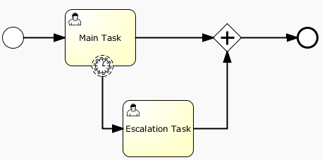
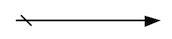
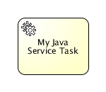
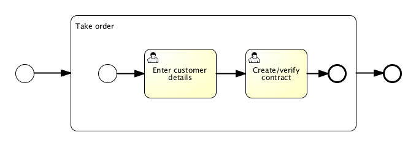
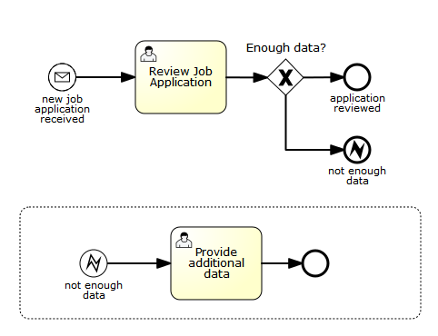
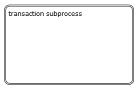
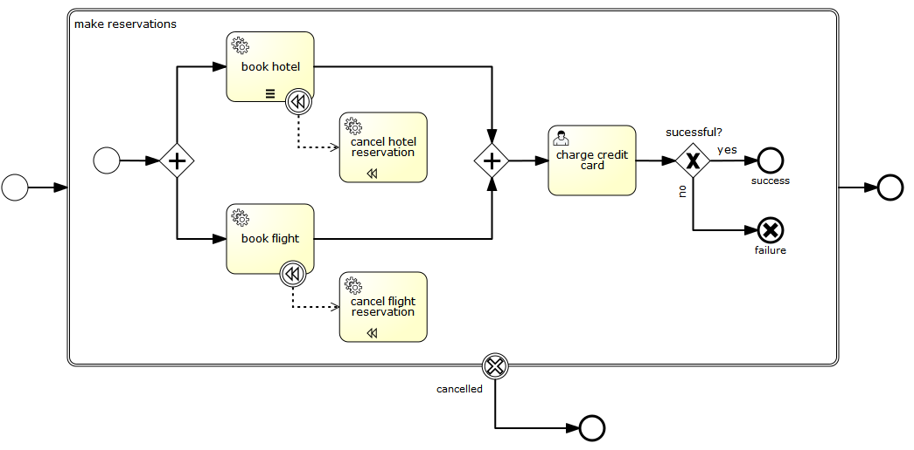
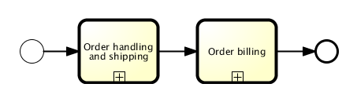
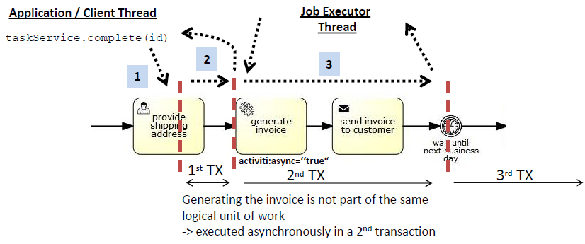

[[bpmnConstructs]]

== BPMN 2.0 Constructs

This chapter covers the BPMN 20 constructs supported by Flowable, as well as custom extensions to the BPMN standard.

[[bpmnCustomExtensions]]

=== Custom extensions

The BPMN 2.0 standard is a good thing for all parties involved. End-users don't suffer from vendor lock-in that comes from depending on a proprietary solution. Frameworks, and particularly open-source frameworks such as Flowable, can implement a solution that has the same (and often better implemented ;-) features as those of a big vendor.  Thanks to the BPMN 2.0 standard, the transition from such a big vendor solution towards Flowable can be an easy and smooth path.

The downside of a standard, however, is the fact that it is always the result of many discussions and compromises between different companies (and often visions). As a developer reading the BPMN 2.0 XML of a process definition, sometimes it feels like certain constructs or ways to do things are very cumbersome. As Flowable puts ease of development as a top-priority, we introduced something called the *'Flowable BPMN extensions'*. These 'extensions' are new constructs or ways to simplify certain constructs that are not part of the BPMN 2.0 specification.

Although the BPMN 2.0 specification clearly states that it was designed for custom extension, we make sure that:

* There *always* must be a simple transformation to the *standard way of doing things*, as a prerequisite of such a custom extension. So when you decide to use a custom extension, you don't have to be concerned that there is no way back.
* When using a custom extension, it is always clearly indicated by giving the new XML element, attribute, and so on, the *flowable:* namespace prefix. Note that the Flowable engine also supports the *activiti:* namespace prefix.

Whether you want to use a custom extension or not is completely up to you. Several factors will influence this decision (graphical editor usage, company policy, and so on). We only provide them as we believe that some points in the standard can be done in a simpler or more efficient way. Feel free to give us (positive or negative) feedback on our extensions, or to post new ideas for custom extensions. Who knows, some day your idea might pop up in the specification!

[[bpmnEvents]]

=== Events

Events are used to model something that happens during the lifetime of a process. Events are always visualized as a circle. In BPMN 2.0, there exist two main event categories: _catching_ and _throwing_ events.

* *Catching:* when process execution arrives at the event, it will wait for a trigger to happen. The type of trigger is defined by the inner icon or the type declaration in the XML. Catching events are visually differentiated from a throwing event by the inner icon that is not filled (it's just white).
* *Throwing:* when process execution arrives at the event, a trigger is fired. The type of trigger is defined by the inner icon or the type declaration in the XML. Throwing events are visually differentiated from a catching event by the inner icon that is filled with black.

[[eventDefinitions]]

==== Event Definitions

Event definitions define the semantics of an event. Without an event definition, an event "does nothing special". For instance, a start event without an event definition has nothing to specify what exactly starts the process. If we add an event definition to the start event (for example, a timer event definition), we declare what "type" of event starts the process (in the case of a timer event definition, the fact that a certain point in time is reached).

[[timerEventDefinitions]]

==== Timer Event Definitions

Timer events are events that are triggered by a defined timer. They can be used as <<bpmnTimerStartEvent,start event>>, <<bpmnIntermediateCatchingEvent,intermediate event>> or <<bpmnTimerBoundaryEvent,boundary event>>. The behavior of the time event depends on the business calendar used. Every timer event has a default business calendar, but the business calendar can also be given as part of the timer event definition.

[source,xml,linenums]
----
<timerEventDefinition flowable:businessCalendarName="custom">
    ...
</timerEventDefinition>
----
Where businessCalendarName points to a business calendar in the process engine configuration. When business calendar is omitted, default business calendars are used.

The timer definition must have exactly one element from the following:

* *timeDate*. This format specifies a fixed date in link:$$http://en.wikipedia.org/wiki/ISO_8601#Dates$$[ISO 8601] format, when trigger will be fired. For example:

[source,xml,linenums]
----
<timerEventDefinition>
    <timeDate>2011-03-11T12:13:14</timeDate>
</timerEventDefinition>
----

* *timeDuration*. To specify how long the timer should run before it is fired, a _timeDuration_ can be specified as a sub-element of _timerEventDefinition_. The format used is the link:$$http://en.wikipedia.org/wiki/ISO_8601#Durations$$[ISO 8601] format (as required by the BPMN 2.0 specification). For example (interval lasting 10 days):

[source,xml,linenums]
----
<timerEventDefinition>
    <timeDuration>P10D</timeDuration>
</timerEventDefinition>
----

* *timeCycle*. Specifies a repeating interval, which can be useful for starting process periodically, or for sending multiple reminders for overdue user task. A time cycle element can be in one of two formats. First, is the format of recurring time duration as specified by link:$$http://en.wikipedia.org/wiki/ISO_8601#Repeating_intervals$$[ISO 8601] standard. Example (3 repeating intervals, each lasting 10 hours):

It is also possible to specify the _endDate_ as an optional attribute on the _timeCycle_ or either in the end of the time expression as follows: +R3/PT10H/${EndDate}+.
When the endDate is reached, the application will stop creating other jobs for this task.
It accepts as a value either static values link:$$http://en.wikipedia.org/wiki/ISO_8601#Dates$$[ISO 8601] standard, for example, _"2015-02-25T16:42:11+00:00"_, or variables, for example, _${EndDate}_

[source,xml,linenums]
----
<timerEventDefinition>
    <timeCycle flowable:endDate="2015-02-25T16:42:11+00:00">R3/PT10H</timeCycle>
</timerEventDefinition>
----

[source,xml,linenums]
----
<timerEventDefinition>
    <timeCycle>R3/PT10H/${EndDate}</timeCycle>
</timerEventDefinition>
----

If both are specified, then the endDate specified as attribute will be used by the system.

Currently, only the _BoundaryTimerEvents_ and _CatchTimerEvent_ support _EndDate_ functionality.

Additionally, you can specify time cycle using cron expressions; the example below shows trigger firing every 5 minutes, starting at full hour:

----
0 0/5 * * * ?
----

Please see link:$$http://www.quartz-scheduler.org/documentation/quartz-2.x/tutorials/crontrigger.html$$[this tutorial] for using cron expressions.

*Note:* The first symbol denotes seconds, not minutes as in normal Unix cron.

The recurring time duration is better suited for handling relative timers, which are calculated with respect to some particular point in time (for example, the time when a user task was started), while cron expressions can handle absolute timers, which is particularly useful for <<timerStartEventDescription,timer start events>>.

You can use expressions for timer event definitions, and by doing so, you can influence the timer definition
based on process variables. The process variables must contain the ISO 8601 (or cron for cycle type) string for appropriate timer type.

[source,xml,linenums]
----
<boundaryEvent id="escalationTimer" cancelActivity="true" attachedToRef="firstLineSupport">
  <timerEventDefinition>
    <timeDuration>${duration}</timeDuration>
  </timerEventDefinition>
</boundaryEvent>
----

*Note:* timers are only fired when the async executor is enabled (_asyncExecutorActivate_ must be set to +true+ in the +flowable.cfg.xml+, because the async executor is disabled by default).

[[bpmnErrorEventDefinition]]

==== Error Event Definitions

*Important note:* a BPMN error is NOT the same as a Java exception. In fact, the two have nothing in common. BPMN error events are a way of modeling _business exceptions_. Java exceptions are handled in <<serviceTaskExceptionHandling,their own specific way>>.

[source,xml,linenums]
----
<endEvent id="myErrorEndEvent">
  <errorEventDefinition errorRef="myError" />
</endEvent>

----

[[bpmnSignalEventDefinition]]

==== Signal Event Definitions

Signal events are events that reference a named signal. A signal is an event of global scope (broadcast semantics) and is delivered to all active handlers (waiting process instances/catching signal events).

A signal event definition is declared using the +signalEventDefinition+ element. The attribute +signalRef+ references a +signal+ element declared as a child element of the +definitions+ root element. The following is an excerpt of a process where a signal event is thrown and caught by intermediate events.

[source,xml,linenums]
----
<definitions... >
    <!-- declaration of the signal -->
    <signal id="alertSignal" name="alert" />

    <process id="catchSignal">
        <intermediateThrowEvent id="throwSignalEvent" name="Alert">
            <!-- signal event definition -->
            <signalEventDefinition signalRef="alertSignal" />
        </intermediateThrowEvent>
        ...
        <intermediateCatchEvent id="catchSignalEvent" name="On Alert">
            <!-- signal event definition -->
            <signalEventDefinition signalRef="alertSignal" />
        </intermediateCatchEvent>
        ...
    </process>
</definitions>
----

The ++signalEventDefinition++s reference the same +signal+ element.

[[bpmnSignalEventDefinitionThrow]]

===== Throwing a Signal Event

A signal can either be thrown by a process instance using a BPMN construct or programmatically using java API. The following methods on the +org.flowable.engine.RuntimeService+ can be used to throw a signal programmatically:

[source,java,linenums]
----
RuntimeService.signalEventReceived(String signalName);
RuntimeService.signalEventReceived(String signalName, String executionId);
----

The difference between +signalEventReceived(String signalName)+ and +signalEventReceived(String signalName, String executionId)+ is that the first method throws the signal globally to all subscribed handlers (broadcast semantics) and the second method delivers the signal to a specific execution only.

[[bpmnSignalEventDefinitionCatch]]

===== Catching a Signal Event

A signal event can be caught by an intermediate catch signal event or a signal boundary event.

[[bpmnSignalEventDefinitionQuery]]

===== Querying for Signal Event subscriptions

It's possible to query for all executions that have subscribed to a specific signal event:

[source,java,linenums]
----
 List<Execution> executions = runtimeService.createExecutionQuery()
      .signalEventSubscriptionName("alert")
      .list();
----

We can then use the +signalEventReceived(String signalName, String executionId)+ method to deliver the signal to these executions.

[[bpmnSignalEventDefinitionScope]]

===== Signal event scope

By default, signals are _broadcast process engine wide_. This means that you can throw a signal event in a process instance, and other process instances with different process definitions can react on the occurrence of this event.

However, sometimes it is desirable to react to a signal event only within the _same process instance_. A use case, for example, is a synchronization mechanism in the process instance when two or more activities are mutually exclusive.

To restrict the _scope_ of the signal event, add the (non-BPMN 2.0 standard!) _scope attribute_ to the signal event definition:

[source,xml,linenums]
----
<signal id="alertSignal" name="alert" flowable:scope="processInstance"/>
----

The default value for this is attribute is _"global"_.

[[bpmnSignalEventDefinitionExample]]

===== Signal Event example(s)

The following is an example of two separate processes communicating using signals. The first process is started if an insurance policy is updated or changed. After the changes have been reviewed by a human participant, a signal event is thrown, signaling that a policy has changed:

image::images/bpmn.signal.event.throw.png[align="center"]

This event can now be caught by all process instances that are interested. The following is an example of a process subscribing to the event.

image::images/bpmn.signal.event.catch.png[align="center"]

*Note:* it's important to understand that a signal event is broadcast to *all* active handlers. This means, in the case of the example given above, that all instances of the process catching the signal will receive the event. In this scenario, this is what we want. However, there are also situations where the broadcast behavior is unintended. Consider the following process:

image::images/bpmn.signal.event.warning.1.png[align="center"]

The pattern described in the process above is not supported by BPMN. The idea is that the error thrown while performing the "do something" task is caught by the boundary error event, propagated to the parallel path of execution using the signal throw event and then interrupt the "do something in parallel" task. So far, Flowable would perform as expected. The signal would be propagated to the catching boundary event and interrupt the task. *However, due to the broadcast semantics of the signal, it would also be propagated to all other process instances that have subscribed to the signal event.* In this case, this might not be what we want.

*Note:* the signal event does not perform any kind of correlation to a specific process instance. On the contrary, it is broadcast to all process instances. If you need to deliver a signal to a specific process instance only, perform the correlation manually and use  +signalEventReceived(String signalName, String executionId)+ along with the appropriate <<bpmnSignalEventDefinitionQuery,query mechanisms>>.

Flowable does have a way to fix this by adding the _scope_ attribute to the signal event set to _processInstance_.

[[bpmnMessageEventDefinition]]

==== Message Event Definitions

Message events are events that reference a named message. A message has a name and a payload. Unlike a signal, a message event is always directed at a single receiver.

A message event definition is declared using the +messageEventDefinition+ element. The attribute +messageRef+ references a +message+ element declared as a child element of the +definitions+ root element. The following is an excerpt of a process where two message events is declared and referenced by a start event and an intermediate catching message event.

[source,xml,linenums]
----
<definitions id="definitions"
  xmlns="http://www.omg.org/spec/BPMN/20100524/MODEL"
  xmlns:flowable="http://flowable.org/bpmn"
  targetNamespace="Examples"
  xmlns:tns="Examples">

  <message id="newInvoice" name="newInvoiceMessage" />
  <message id="payment" name="paymentMessage" />

  <process id="invoiceProcess">

    <startEvent id="messageStart" >
    	<messageEventDefinition messageRef="newInvoice" />
    </startEvent>
    ...
    <intermediateCatchEvent id="paymentEvt" >
    	<messageEventDefinition messageRef="payment" />
    </intermediateCatchEvent>
    ...
  </process>

</definitions>
----

[[bpmnMessageEventDefinitionThrow]]

===== Throwing a Message Event

As an embeddable process engine, Flowable is not concerned with actually receiving a message. This would be environment dependent and entail platform-specific activities, such as connecting to a JMS (Java Messaging Service) Queue/Topic or processing a Webservice or REST request. The reception of messages is therefore something you have to implement as part of the application or infrastructure into which the process engine is embedded.

After you have received a message inside your application, you must decide what to do with it. If the message should trigger the start of a new process instance, choose between the following methods offered by the runtime service:

[source,java,linenums]
----
ProcessInstance startProcessInstanceByMessage(String messageName);
ProcessInstance startProcessInstanceByMessage(String messageName, Map<String, Object> processVariables);
ProcessInstance startProcessInstanceByMessage(String messageName, String businessKey,
    Map<String, Object> processVariables);
----

These methods start a process instance using the referenced message.

If the message needs to be received by an existing process instance, you first have to correlate the message to a specific process instance (see next section) and then trigger the continuation of the waiting execution. The runtime service offers the following methods for triggering an execution based on a message event subscription:

[source,java,linenums]
----
void messageEventReceived(String messageName, String executionId);
void messageEventReceived(String messageName, String executionId, HashMap<String, Object> processVariables);
----

[[bpmnMessageEventDefinitionQuery]]

===== Querying for Message Event subscriptions

* In the case of a message start event, the message event subscription is associated with a particular _process definition_. Such message subscriptions can be queried using a ++ProcessDefinitionQuery++:

[source,java,linenums]
----
ProcessDefinition processDefinition = repositoryService.createProcessDefinitionQuery()
      .messageEventSubscription("newCallCenterBooking")
      .singleResult();
----

Since there can only be one process definition for a specific message subscription, the query always returns zero or one result. If a process definition is updated,
only the newest version of the process definition has a subscription to the message event.

* In the case of an intermediate catch message event, the message event subscription is associated with a
particular _execution_. Such message event subscriptions can be queried using a ++ExecutionQuery++:

[source,java,linenums]
----
Execution execution = runtimeService.createExecutionQuery()
      .messageEventSubscriptionName("paymentReceived")
      .variableValueEquals("orderId", message.getOrderId())
      .singleResult();
----

Such queries are called correlation queries and usually require knowledge about the processes (in this case, that there will be at most one process instance for a given orderId).

[[bpmnMessageEventDefinitionExample]]

===== Message Event example(s)

The following is an example of a process that can be started using two different messages:

image::images/bpmn.start.message.event.example.1.png[align="center"]

This is useful if the process needs alternative ways to react to different start events, but eventually continues in a uniform way.

[[bpmnStartEvents]]

==== Start Events

A start event indicates where a process starts. The type of start event (process starts on arrival of message, on specific time intervals, and so on), defining _how_ the process is started, is shown as a small icon in the visual representation of the event. In the XML representation, the type is given by the declaration of a sub-element.

Start events *are always catching*: conceptually the event is (at any time) waiting until a certain trigger happens.

In a start event, the following Flowable-specific properties can be specified:

* *initiator*: identifies the variable name in which the authenticated user ID will be stored when the process is started.  For example:

[source,xml,linenums]
----
<startEvent id="request" flowable:initiator="initiator" />
----

The authenticated user must be set with the method +IdentityService.setAuthenticatedUserId(String)+ in a try-finally block, like this:

[source,java,linenums]
----
try {
  identityService.setAuthenticatedUserId("bono");
  runtimeService.startProcessInstanceByKey("someProcessKey");
} finally {
  identityService.setAuthenticatedUserId(null);
}

----

This code is baked into the Flowable application, so it works in combination with <<forms>>.

[[bpmnNoneStartEvent]]

==== None Start Event

[[noneStartEventDescription]]

===== Description

A 'none' start event technically means that the trigger for starting the process instance is unspecified. This means that the engine cannot anticipate when the process instance must be started. The none start event is used when the process instance is started through the API by calling one of the _startProcessInstanceByXXX_ methods.

[source,java,linenums]
----
ProcessInstance processInstance = runtimeService.startProcessInstanceByXXX();
----

_Note:_ a sub-process always has a none start event.

[[noneStartEventGraphicalNotation]]

===== Graphical notation

A none start event is visualized as a circle with no inner icon (in other words, no trigger type).

image::images/bpmn.none.start.event.png[align="center"]

[[noneStartEventXml]]

===== XML representation

The XML representation of a none start event is the normal start event declaration without any sub-element (other start event types all have a sub-element declaring the type).

[source,xml,linenums]
----
<startEvent id="start" name="my start event" />
----

[[noneStartEventCustomExtension]]

===== Custom extensions for the none start event

*formKey*: references a form definition that users have to fill in when starting a new process instance.  More information can be found in <<forms,the forms section>> Example:

[source,xml,linenums]
----
<startEvent id="request" flowable:formKey="request" />
----

[[bpmnTimerStartEvent]]

==== Timer Start Event

[[timerStartEventDescription]]

===== Description

A timer start event is used to create process instances at given time. It can be used both for processes that should start only once and for processes that should start in specific time intervals.

_Note:_ a sub-process cannot have a timer start event.

_Note:_ a start timer event is scheduled as soon as process is deployed. There is no need to call startProcessInstanceByXXX, although calling start process methods is not restricted and will cause one more starting of the process at the time of startProcessInstanceByXXX invocation.

_Note:_ when a new version of a process with a start timer event is deployed, the job corresponding with the previous timer will be removed. The reasoning is that normally it is not desirable to keep automatically starting new process instances of the old version of the process.

[[timerStartEventGraphicalNotation]]

===== Graphical notation

A timer start event is visualized as a circle with clock inner icon.

image::images/bpmn.clock.start.event.png[align="center"]

[[timerStartEventXml]]

===== XML representation

The XML representation of a timer start event is the normal start event declaration, with timer definition sub-element. Please refer to <<timerEventDefinitions,timer definitions>> for configuration details.

Example: process will start 4 times, in 5 minute intervals, starting on 11th march 2011, 12:13

[source,xml,linenums]
----
<startEvent id="theStart">
  <timerEventDefinition>
    <timeCycle>R4/2011-03-11T12:13/PT5M</timeCycle>
  </timerEventDefinition>
</startEvent>
----

Example: process will start once, on selected date

[source,xml,linenums]
----
<startEvent id="theStart">
  <timerEventDefinition>
    <timeDate>2011-03-11T12:13:14</timeDate>
  </timerEventDefinition>
</startEvent>
----

[[bpmnMessageStartEvent]]

==== Message Start Event

[[messageStartEventDescription]]

===== Description

A <<bpmnMessageEventDefinition,message>> start event can be used to start a process instance using a named message. This effectively allows us to _select_ the right start event from a set of alternative start events using the message name.

When *deploying* a process definition with one or more message start events, the following considerations apply:

* The name of the message start event must be unique across a given process definition. A process definition must not have multiple message start events with the same name. Flowable throws an exception upon deployment of a process definition containing two or more message start events referencing the same message, or if two or more message start events reference messages with the same message name.
* The name of the message start event must be unique across all deployed process definitions. Flowable throws an exception upon deployment of a process definition containing one or more message start events referencing a message with the same name as a message start event already deployed by a different process definition.
* Process versioning: Upon deployment of a new version of a process definition, the start message subscriptions of the previous version are removed.

When *starting* a process instance, a message start event can be triggered using the following methods on the ++RuntimeService++:

[source,java,linenums]
----
ProcessInstance startProcessInstanceByMessage(String messageName);
ProcessInstance startProcessInstanceByMessage(String messageName, Map<String, Object> processVariables);
ProcessInstance startProcessInstanceByMessage(String messageName, String businessKey,
    Map<String, Object< processVariables);
----

The +messageName+ is the name given in the +name+ attribute of the +message+ element referenced by the +messageRef+ attribute of the +messageEventDefinition+. The following considerations apply when *starting* a process instance:

* Message start events are only supported on top-level processes. Message start events are not supported on embedded sub processes.
* If a process definition has multiple message start events, +runtimeService.startProcessInstanceByMessage(...)+ allows to select the appropriate start event.
* If a process definition has multiple message start events and a single none start event, +runtimeService.startProcessInstanceByKey(...)+ and +runtimeService.startProcessInstanceById(...)+ starts a process instance using the none start event.
* If a process definition has multiple message start events and no none start event, +runtimeService.startProcessInstanceByKey(...)+ and +runtimeService.startProcessInstanceById(...)+ throw an exception.
* If a process definition has a single message start event, +runtimeService.startProcessInstanceByKey(...)+ and +runtimeService.startProcessInstanceById(...)+ start a new process instance using the message start event.
* If a process is started from a call activity, message start event(s) are only supported if
** in addition to the message start event(s), the process has a single none start event
** the process has a single message start event and no other start events.

[[messageStartEventGraphicalNotation]]

===== Graphical notation

A message start event is visualized as a circle with a message event symbol. The symbol is unfilled, to represent the catching (receiving) behavior.

image::images/bpmn.start.message.event.png[align="center"]

[[messageStartEventXml]]

===== XML representation

The XML representation of a message start event is the normal start event declaration with a messageEventDefinition child-element:

[source,xml,linenums]
----
<definitions id="definitions"
  xmlns="http://www.omg.org/spec/BPMN/20100524/MODEL"
  xmlns:flowable="http://flowable.org/bpmn"
  targetNamespace="Examples"
  xmlns:tns="Examples">

  <message id="newInvoice" name="newInvoiceMessage" />

  <process id="invoiceProcess">

    <startEvent id="messageStart" >
    	<messageEventDefinition messageRef="tns:newInvoice" />
    </startEvent>
    ...
  </process>

</definitions>
----

[[bpmnSignalStartEvent]]

==== Signal Start Event

[[bpmnSignalStartEventDescription]]

===== Description

A <<bpmnSignalEventDefinition,signal>> start event can be used to start a process instance using a named signal. The signal can be 'fired' from within a process instance using the intermediary signal throw event or through the API (__runtimeService.signalEventReceivedXXX__ methods). In both cases, all process definitions that have a signal start event with the same name will be started.

Note that in both cases, it is also possible to choose between a synchronous and asynchronous starting of the process instances.

The +signalName+ that must be passed in the API is the name given in the +name+ attribute of the +signal+ element referenced by the +signalRef+ attribute of the +signalEventDefinition+.

[[signalStartEventGraphicalNotation]]

===== Graphical notation

A signal start event is visualized as a circle with a signal event symbol. The symbol is unfilled, to represent the catching (receiving) behavior.

image::images/bpmn.start.signal.event.png[align="center"]

[[signalStartEventXml]]

===== XML representation

The XML representation of a signal start event is the normal start event declaration with a signalEventDefinition child-element:

[source,xml,linenums]
----
<signal id="theSignal" name="The Signal" />

<process id="processWithSignalStart1">
  <startEvent id="theStart">
    <signalEventDefinition id="theSignalEventDefinition" signalRef="theSignal"  />
  </startEvent>
  <sequenceFlow id="flow1" sourceRef="theStart" targetRef="theTask" />
  <userTask id="theTask" name="Task in process A" />
  <sequenceFlow id="flow2" sourceRef="theTask" targetRef="theEnd" />
  <endEvent id="theEnd" />
</process>
----

[[bpmnErrorStartEvent]]

==== Error Start Event

[[errorStartEventDescription]]

===== Description

An <<bpmnErrorEventDefinition,error>> start event can be used to trigger an Event Sub-Process. *An error start event cannot be used for starting a process instance*.

An error start event is always interrupting.

[[errorStartEventGraphicalNotation]]

===== Graphical notation

An error start event is visualized as a circle with an error event symbol. The symbol is unfilled, to represent the catching (receiving) behavior.

image::images/bpmn.start.error.event.png[align="center"]

[[errorStartEventXml]]

===== XML representation

The XML representation of an error start event is the normal start event declaration with an errorEventDefinition child-element:

[source,xml,linenums]
----
<startEvent id="messageStart" >
	<errorEventDefinition errorRef="someError" />
</startEvent>
----

[[bpmnEndEvent]]

==== End Events

An end event signifies the end of a path in a process or sub-process. An end event is *always throwing*. This means that when process execution arrives at an end event, a _result_ is thrown. The type of result is depicted by the inner black icon of the event. In the XML representation, the type is given by the declaration of a sub-element.

[[bpmnNoneEndEvent]]

==== None End Event

[[noneEndEventDescription]]

===== Description

A 'none' end event means that the _result_ thrown when the event is reached is unspecified. As such, the engine will not do anything extra besides ending the current path of execution.

[[bpmnNoneEndEventDescription]]

===== Graphical notation

A none end event is visualized as a circle with a thick border with no inner icon (no result type).

image::images/bpmn.none.end.event.png[align="center"]

[[bpmnNoneStartEventXml]]

===== XML representation

The XML representation of a none end event is the normal end event declaration, without any sub-element (other end event types all have a sub-element declaring the type).

[source,xml,linenums]
----
<endEvent id="end" name="my end event" />
----

[[bpmnErrorEndEvent]]

==== Error End Event

[[bpmnErrorEndEventDescription]]

===== Description

When process execution arrives at an *error end event*, the current path of execution ends and an error is thrown. This error can <<bpmnBoundaryErrorEvent,caught by a matching intermediate boundary error event>>. If no matching boundary error event is found, an exception will be thrown.

[[bpmnErrorEndEventGraphicalNotation]]

===== Graphical notation

An error end event is visualized as a typical end event (circle with thick border), with the error icon inside. The error icon is completely black, to indicate its throwing semantics.

image::images/bpmn.error.end.event.png[align="center"]

[[bpmnErrorEndEventXml]]

===== XML representation

An error end event is represented as an end event, with an _errorEventDefinition_ child element.

[source,xml,linenums]
----
<endEvent id="myErrorEndEvent">
  <errorEventDefinition errorRef="myError" />
</endEvent>

----

The _errorRef_ attribute can reference an _error_ element that is defined outside the process:

[source,xml,linenums]
----
<error id="myError" errorCode="123" />
...
<process id="myProcess">
...
----

The *errorCode* of the _error_ will be used to find the matching catching boundary error event. If the _errorRef_ doesn't match any defined _error_, then the _errorRef_ is used as a shortcut for the _errorCode_. This is a Flowable specific shortcut. More concretely, the following snippets are equivalent in functionality.

[source,xml,linenums]
----
<error id="myError" errorCode="error123" />
...
<process id="myProcess">
...
  <endEvent id="myErrorEndEvent">
    <errorEventDefinition errorRef="myError" />
  </endEvent>
...
----

is equivalent with

[source,xml,linenums]
----
<endEvent id="myErrorEndEvent">
  <errorEventDefinition errorRef="error123" />
</endEvent>
----

Note that the _errorRef_ must comply with the BPMN 2.0 schema, and must be a valid QName.

[[bpmnTerminateEndEvent]]

==== Terminate End Event

===== Description

When a _terminate end event_ is reached, the current process instance or sub-process will be terminated. Conceptually, when an execution arrives at a terminate end event, the first _scope_ (process or sub-process) will be determined and ended. Note that in BPMN 2.0, a sub-process can be an embedded sub-process, call activity, event sub-process or transaction sub-process. This rule applies in general: when, for example, there is a multi-instance call activity or embedded sub-process, only that instance will end, the other instances and the process instance are not affected.

There is an optional attribute _terminateAll_ that can be added. When _true_, regardless of the placement of the terminate end event in the process definition and regardless of being in a sub-process (even nested), the (root) process instance will be terminated.

===== Graphical notation

A cancel end event visualized as a typical end event (circle with thick outline), with a full black circle inside.

image::images/bpmn.terminate.end.event.png[align="center"]

===== XML representation

A terminate end event is represented as an end event, with a _terminateEventDefinition_ child element.

Note that the _terminateAll_ attribute is optional (and _false_ by default).

[source,xml,linenums]
----
<endEvent id="myEndEvent >
  <terminateEventDefinition flowable:terminateAll="true"></terminateEventDefinition>
</endEvent>
----

[[bpmnCancelEndEvent]]

==== Cancel End Event

[[bpmnCancelEndEventDescription]]

===== Description

The cancel end event can only be used in combination with a BPMN transaction sub-process. When the cancel end event is reached, a cancel event is thrown which must be caught by a cancel boundary event. The cancel boundary event then cancels the transaction and triggers compensation.

[[bpmnCancelEndEventGraphicalNotation]]

===== Graphical notation

A cancel end event is visualized as a typical end event (circle with thick outline), with the cancel icon inside. The cancel icon is completely black, to indicate its throwing semantics.

image::images/bpmn.cancel.end.event.png[align="center"]

[[bpmnCancelEndEventXml]]

===== XML representation

A cancel end event is represented as an end event, with a _cancelEventDefinition_ child element.

[source,xml,linenums]
----
<endEvent id="myCancelEndEvent">
  <cancelEventDefinition />
</endEvent>
----

[[bpmnBoundaryEvent]]

==== Boundary Events

Boundary events are _catching_ events that are attached to an activity (a boundary event can never be throwing). This means that while the activity is running, the event is _listening_ for a certain type of trigger. When the event is _caught_, the activity is interrupted and the sequence flow going out of the event is followed.

All boundary events are defined in the same way:

[source,xml,linenums]
----
<boundaryEvent id="myBoundaryEvent" attachedToRef="theActivity">
      <XXXEventDefinition/>
</boundaryEvent>
----

A boundary event is defined with

* A unique identifier (process-wide)
* A reference to the activity to which the event is attached through the *attachedToRef* attribute.
 Note that a boundary event is defined on the same level as the activities to which they are attached (in other words, no inclusion of the boundary event inside the activity).
* An XML sub-element of the form _XXXEventDefinition_ (for example, _TimerEventDefinition_, _ErrorEventDefinition_, and so on) defining the type of the boundary event. See the specific boundary event types for more details.

[[bpmnTimerBoundaryEvent]]

==== Timer Boundary Event

[[timerBoundaryEventDescription]]

===== Description

A timer boundary event acts as a stopwatch and alarm clock. When an execution arrives at the activity where the boundary event is attached, a timer is started. When the timer fires (for example, after a specified interval), the activity is interrupted and the sequence flow going out of the boundary event is followed.

[[bpmnTimerBoundaryEventGraphicalNotation]]

===== Graphical Notation

A timer boundary event is visualized as a typical boundary event (circle on the border), with the timer icon on the inside.

image::images/bpmn.boundary.timer.event.png[align="center"]

[[bpmnTimerBoundaryEventXml]]

===== XML Representation

A timer boundary event is defined as a <<bpmnBoundaryEvent,regular boundary event>>. The specific type sub-element in this case is a *timerEventDefinition* element.

[source,xml,linenums]
----
<boundaryEvent id="escalationTimer" cancelActivity="true" attachedToRef="firstLineSupport">
  <timerEventDefinition>
    <timeDuration>PT4H</timeDuration>
  </timerEventDefinition>
</boundaryEvent>
----

Please refer to <<timerEventDefinitions,timer event definition>> for details on timer configuration.

In the graphical representation, the line of the circle is dotted as you can see in the example above:

A typical use case is sending an escalation email after a period of time, but without affecting the normal process flow.

There is a key difference between the interrupting and non interrupting timer event. Non-interrupting means the original activity is *not* interrupted but stays as it was. The interrupting behavior is the default. In the XML representation, the _cancelActivity_ attribute is set to false:

[source,xml,linenums]
----
<boundaryEvent id="escalationTimer" cancelActivity="false" attachedToRef="firstLineSupport"/>
----

*Note:* boundary timer events are only fired when the async executor is enabled (_asyncExecutorActivate_ needs to be set to +true+ in the +flowable.cfg.xml+, since the async executor is disabled by default).

[[bpmnKnownIssueBoundaryEvent]]

===== Known issue with boundary events

There is a known issue regarding concurrency when using boundary events of any type. Currently, it is not possible to have multiple outgoing sequence flows attached to a boundary event. A solution to this problem is to use one outgoing sequence flow that goes to a parallel gateway.

image::images/bpmn.known.issue.boundary.event.png[align="center"]

[[bpmnBoundaryErrorEvent]]

==== Error Boundary Event

[[bpmnBoundaryErrorEventDescription]]

===== Description

An intermediate _catching_ error on the boundary of an activity, or *boundary error event* for short, catches errors that are thrown within the scope of the activity on which it is defined.

Defining a boundary error event makes most sense on an <<bpmnSubProcess,embedded sub-process>>, or a <<bpmnCallActivity,call activity>>, as a sub-process creates a scope for all activities inside the sub-process. Errors are thrown by <<bpmnErrorEndEvent,error end events>>. Such an error will propagate its parent scopes upwards until a scope is found on which a boundary error event is defined that matches the error event definition.

When an error event is caught, the activity on which the boundary event is defined is destroyed, also destroying all current executions within (concurrent activities, nested sub-processes, and so on). Process execution continues following the outgoing sequence flow of the boundary event.

[[bpmnBoundaryErrorEventgraphicalNotation]]

===== Graphical notation

A boundary error event is visualized as a typical intermediate event (circle with smaller circle inside) on the boundary, with the error icon inside. The error icon is white, to indicate its _catch_ semantics.

image::images/bpmn.boundary.error.event.png[align="center"]

[[bpmnBoundaryErrorEventXml]]

===== XML representation

A boundary error event is defined as a typical <<bpmnBoundaryEvent,boundary event>>:

[source,xml,linenums]
----
<boundaryEvent id="catchError" attachedToRef="mySubProcess">
  <errorEventDefinition errorRef="myError"/>
</boundaryEvent>
----

As with the <<bpmnErrorEndEvent,error end event>>, the _errorRef_ references an error defined outside the process element:

[source,xml,linenums]
----
<error id="myError" errorCode="123" />
...
<process id="myProcess">
...

----

The *errorCode* is used to match the errors that are caught:

* If _errorRef_ is omitted, the boundary error event will catch *any error event*, regardless of the errorCode of the _error_.
* If an _errorRef_ is provided and it references an existing _error_, the boundary event will *only catch errors with the same error code*.
* If an _errorRef_ is provided, but no _error_ is defined in the BPMN 2.0 file, then the *errorRef is used as errorCode* (similar for with error end events).

[[bpmnBoundaryErrorEventExample]]

===== Example

The following example process shows how an error end event can be used. When the _'Review profitability'_ user task is completed by saying that not enough information is provided, an error is thrown. When this error is caught on the boundary of the sub-process, all active activities within the _'Review sales lead'_ sub-process are destroyed (even if _'Review customer rating'_ had not yet been completed), and the _'Provide additional details'_ user task is created.

image::images/bpmn.boundary.error.example.png[align="center"]

This process is shipped as example in the demo setup. The process XML and unit test can be found in the _org.flowable.examples.bpmn.event.error_ package.

[[bpmnBoundarySignalEvent]]

==== Signal Boundary Event

[[bpmnBoundarySignalEventDescription]]

===== Description

An attached intermediate _catching_ <<bpmnSignalEventDefinition,signal>> on the boundary of an activity, or *boundary signal event* for short, catches signals with the same signal name as the referenced signal definition.

*Note:* contrary to other events, such as the boundary error event, a boundary signal event doesn't only catch signal events thrown from the scope to which it is attached. On the contrary, a signal event has global scope (broadcast semantics), meaning that the signal can be thrown from any place, even from a different process instance.

*Note:* contrary to other events, such as the error event, a signal is not consumed if it is caught. If you have two active signal boundary events catching the same signal event, both boundary events are triggered, even if they are part of different process instances.

[[bpmnBoundarySignalEventGraphicalNotation]]

===== Graphical notation

A boundary signal event is visualized as a typical intermediate event (circle with smaller circle inside) on the boundary, with the signal icon inside. The signal icon is white (unfilled), to indicate its _catch_ semantics.

image::images/bpmn.boundary.signal.event.png[align="center"]

[[bpmnBoundarySignalEventXml]]

===== XML representation

A boundary signal event is defined as a typical <<bpmnBoundaryEvent,boundary event>>:

[source,xml,linenums]
----
<boundaryEvent id="boundary" attachedToRef="task" cancelActivity="true">
    <signalEventDefinition signalRef="alertSignal"/>
</boundaryEvent>
----

[[bpmnBoundarySignalEventExample]]

===== Example

See the section on <<bpmnSignalEventDefinition,signal event definitions>>.

[[bpmnBoundaryMessageEvent]]

==== Message Boundary Event

[[bpmnBoundaryMessageEventDescription]]

===== Description

An attached intermediate _catching_ <<bpmnMessageEventDefinition,message>> on the boundary of an activity, or *boundary message event* for short, catches messages with the same message name as the referenced message definition.

[[bpmnBoundaryMessageEventGraphicalNotation]]

===== Graphical notation

A boundary message event is visualized as a typical intermediate event (circle with smaller circle inside) on the boundary, with the message icon inside. The message icon is white (unfilled), to indicate its _catch_ semantics.

image::images/bpmn.boundary.message.event.png[align="center"]

Note that boundary message event can be both interrupting (right-hand side) and non-interrupting (left-hand side).

[[bpmnBoundaryMessageEventXml]]

===== XML representation

A boundary message event is defined as a typical <<bpmnBoundaryEvent,boundary event>>:

[source,xml,linenums]
----
<boundaryEvent id="boundary" attachedToRef="task" cancelActivity="true">
    <messageEventDefinition messageRef="newCustomerMessage"/>
</boundaryEvent>
----

[[bpmnBoundaryMessageEventExample]]

===== Example

See the section on <<bpmnMessageEventDefinition,message event definitions>>.

[[bpmnBoundaryCancelEvent]]

==== Cancel Boundary Event

[[bpmnBoundaryCancelEventDescription]]

===== Description

An attached intermediate _catching_ cancel event on the boundary of a transaction sub-process, or *boundary cancel event* for short, is triggered when a transaction is canceled. When the cancel boundary event is triggered, it first interrupts all active executions in the current scope. Next, it starts compensation for all active compensation boundary events in the scope of the transaction. Compensation is performed synchronously, in other words, the boundary event waits before compensation is completed before leaving the transaction. When compensation is completed, the transaction sub-process is left using any sequence flows running out of the cancel boundary event.

*Note:* Only a single cancel boundary event is allowed for a transaction sub-process.

*Note:* If the transaction sub-process hosts nested sub-processes, compensation is only triggered for sub-processes that have completed successfully.

*Note:* If a cancel boundary event is placed on a transaction sub-process with multi instance characteristics, if one instance triggers cancellation, the boundary event cancels all instances.

[[bpmnBoundaryCancelEventGraphicalNotation]]

===== Graphical notation

A cancel boundary event is visualized as a typical intermediate event (circle with smaller circle inside) on the boundary, with the cancel icon inside. The cancel icon is white (unfilled), to indicate its _catching_ semantics.

image::images/bpmn.boundary.cancel.event.png[align="center"]

[[bpmnBoundarySignalEventXml]]

===== XML representation

A cancel boundary event is defined as a typical <<bpmnBoundaryEvent,boundary event>>:

[source,xml,linenums]
----
<boundaryEvent id="boundary" attachedToRef="transaction" >
          <cancelEventDefinition />
</boundaryEvent>
----

As the cancel boundary event is always interrupting, the +cancelActivity+ attribute is not required.

[[bpmnBoundaryCompensationEvent]]

==== Compensation Boundary Event

[[bpmnBoundaryCompensationEventDescription]]

===== Description

An attached intermediate _catching_ compensation on the boundary of an activity or *compensation boundary event* for short, can be used to attach a compensation handler to an activity.

The compensation boundary event must reference a single compensation handler using a directed association.

A compensation boundary event has a different activation policy from other boundary events. Other boundary events, such as the signal boundary event, are activated when the activity they are attached to is started. When the activity is finished, they are deactivated and the corresponding event subscription is canceled. The compensation boundary event is different. The compensation boundary event is activated when the activity it is attached to *completes successfully*. At this point, the corresponding subscription to the compensation events is created. The subscription is removed either when a compensation event is triggered or when the corresponding process instance ends. From this, it follows:

* When compensation is triggered, the compensation handler associated with the compensation boundary event is invoked the same number of times the activity it is attached to completed successfully.
* If a compensation boundary event is attached to an activity with multiple instance characteristics, a compensation event subscription is created for each instance.
*	If a compensation boundary event is attached to an activity that is contained inside a loop, a compensation event subscription is created each time the activity is executed.
* If the process instance ends, the subscriptions to compensation events are canceled.

*Note:* the compensation boundary event is not supported on embedded sub-processes.

[[bpmnBoundaryCompensationEventGraphicalNotation]]

===== Graphical notation

A compensation boundary event is visualized as a typical intermediate event (circle with smaller circle inside) on the boundary, with the compensation icon inside. The compensation icon is white (unfilled), to indicate its _catching_ semantics. In addition to a compensation boundary event, the following figure shows a compensation handler associated with the boundary event using a unidirectional association:

image::images/bpmn.boundary.compensation.event.png[align="center"]

[[bpmnBoundaryCompensationEventXml]]

===== XML representation

A compensation boundary event is defined as a typical <<bpmnBoundaryEvent,boundary event>>:

[source,xml,linenums]
----
<boundaryEvent id="compensateBookHotelEvt" attachedToRef="bookHotel" >
    <compensateEventDefinition />
</boundaryEvent>

<association associationDirection="One" id="a1"
    sourceRef="compensateBookHotelEvt" targetRef="undoBookHotel" />

<serviceTask id="undoBookHotel" isForCompensation="true" flowable:class="..." />
----

As the compensation boundary event is activated after the activity has completed successfully, the +cancelActivity+ attribute is not supported.

[[bpmnIntermediateCatchingEvent]]

==== Intermediate Catching Events

All intermediate catching events are defined in the same way:

[source,xml,linenums]
----
<intermediateCatchEvent id="myIntermediateCatchEvent" >
    <XXXEventDefinition/>
</intermediateCatchEvent>
----

An intermediate catching event is defined with:

* A unique identifier (process-wide)
* An XML sub-element of the form _XXXEventDefinition_ (for example, _TimerEventDefinition_) defining the type of the intermediate catching event. See the specific catching event types for more details.

[[bpmnTimerIntermediateEvent]]

==== Timer Intermediate Catching Event

[[bpmnTimerIntermediateEventDescription]]

===== Description

A timer intermediate event acts as a stopwatch. When an execution arrives at a catching event activity, a timer is started. When the timer fires (for example, after a specified interval), the sequence flow going out of the timer intermediate event is followed.

[[bpmnTimerIntermediateEventGraphicalNotation]]

===== Graphical Notation

A timer intermediate event is visualized as an intermediate catching event, with the timer icon on the inside.

image::images/bpmn.intermediate.timer.event.png[align="center"]

[[bpmnTimerIntermediateEventXml]]

===== XML Representation

A timer intermediate event is defined as an <<bpmnIntermediateCatchingEvent,intermediate catching event>>. The specific type sub-element is, in this case, a *timerEventDefinition* element.

[source,xml,linenums]
----
<intermediateCatchEvent id="timer">
  <timerEventDefinition>
    <timeDuration>PT5M</timeDuration>
  </timerEventDefinition>
</intermediateCatchEvent>
----

See <<timerEventDefinitions,timer event definitions>> for configuration details.

[[bpmnIntermediateSignalEvent]]

==== Signal Intermediate Catching Event

[[bpmnIntermediateSignalEventDescription]]

===== Description

An intermediate _catching_ <<bpmnSignalEventDefinition,signal>> event catches signals with the same signal name as the referenced signal definition.

*Note:* contrary to other events, such as an error event, a signal is not consumed if it is caught. If you have two active signal boundary events catching the same signal event, both boundary events are triggered, even if they are part of different process instances.

[[bpmnIntermediateSignalEventGraphicalNotation]]

===== Graphical notation

An intermediate signal catch event is visualized as a typical intermediate event (circle with smaller circle inside), with the signal icon inside. The signal icon is white (unfilled), to indicate its _catch_ semantics.

image::images/bpmn.intermediate.signal.catch.event.png[align="center"]

[[bpmnIntermediateSignalEventXml]]

===== XML representation

A signal intermediate event is defined as an <<bpmnIntermediateCatchingEvent,intermediate catching event>>. The specific type sub-element is in this case a *signalEventDefinition* element.

[source,xml,linenums]
----
<intermediateCatchEvent id="signal">
  <signalEventDefinition signalRef="newCustomerSignal" />
</intermediateCatchEvent>
----

[[bpmnIntermediateSignalEventExample]]

===== Example

See the section on <<bpmnSignalEventDefinition,signal event definitions>>.

[[bpmnIntermediateMessageEvent]]

==== Message Intermediate Catching Event

[[bpmnIntermediateMessageEventDescription]]

===== Description

An intermediate _catching_ <<bpmnMessageEventDefinition,message>> event catches messages with a specified name.

[[bpmnIntermediateMessageEventGraphicalNotation]]

===== Graphical notation

An intermediate catching message event is visualized as a typical intermediate event (circle with smaller circle inside), with the message icon inside. The message icon is white (unfilled), to indicate its _catch_ semantics.

image::images/bpmn.intermediate.message.catch.event.png[align="center"]

[[bpmnIntermediateSignalEventXml]]

===== XML representation

A message intermediate event is defined as an <<bpmnIntermediateCatchingEvent,intermediate catching event>>. The specific type sub-element is in this case a *messageEventDefinition* element.

[source,xml,linenums]
----
<intermediateCatchEvent id="message">
  <messageEventDefinition signalRef="newCustomerMessage" />
</intermediateCatchEvent>
----

[[bpmnIntermediateMessageEventExample]]

===== Example

See the section on <<bpmnMessageEventDefinition,message event definitions>>.

[[bpmnIntermediateThrowEvent]]

==== Intermediate Throwing Event

All intermediate throwing events are defined in the same way:

[source,xml,linenums]
----
<intermediateThrowEvent id="myIntermediateThrowEvent" >
      <XXXEventDefinition/>
</intermediateThrowEvent>
----

An intermediate throwing event is defined with:

* A unique identifier (process-wide)
* An XML sub-element of the form _XXXEventDefinition_ (for example, _signalEventDefinition_) defining the type of the intermediate throwing event. See the specific throwing event types for more details.

[[bpmnIntermediateThrowNoneEvent]]

==== Intermediate Throwing None Event

The following process diagram shows a simple example of an intermediate none event, which is often used to indicate some state achieved in the process.

image::images/bpmn.intermediate.none.event.png[align="center"]

This can be a good hook to monitor some KPIs, by adding an <<executionListeners,execution listener>>.

[source,xml,linenums]
----
<intermediateThrowEvent id="noneEvent">
  <extensionElements>
    <flowable:executionListener class="org.flowable.engine.test.bpmn.event.IntermediateNoneEventTest$MyExecutionListener" event="start" />
  </extensionElements>
</intermediateThrowEvent>

----

Here you can add some of your own code to maybe send some event to your BAM tool or DWH. The engine itself doesn't do anything in that case, it just passes through.

[[bpmnIntermediateThrowSignalEvent]]

==== Signal Intermediate Throwing Event

[[bpmnIntermediateThrowSignalEventDescription]]

===== Description

An intermediate _throwing_ <<bpmnSignalEventDefinition,signal>> event throws a signal event for a defined signal.

In Flowable, the signal is broadcast to all active handlers (in other words, all catching signal events). Signals can be published synchronously or asynchronously.

* In the default configuration, the signal is delivered *synchronously*. This means that the throwing process instance waits until the signal is delivered to all catching process instances. The catching process instances are also notified in the same transaction as the throwing process instance, which means that if one of the notified instances produces a technical error (throws an exception), all involved instances fail.
* A signal can also be delivered *asynchronously*. In this case it is determined which handlers are active at the time the throwing signal event is reached. For each active handler, an asynchronous notification message (Job) is stored and delivered by the JobExecutor.

[[bpmnIntermediateThrowSignalEventGraphicalNotation]]

===== Graphical notation

An intermediate signal throw event is visualized as a typical intermediate event (circle with smaller circle inside), with the signal icon inside. The signal icon is black (filled), to indicate its _throw_ semantics.

image::images/bpmn.intermediate.signal.throw.event.png[align="center"]

[[bpmnIntermediateThrowSignalEventXml]]

===== XML representation

A signal intermediate event is defined as an <<bpmnIntermediateThrowEvent,intermediate throwing event>>. The specific type sub-element is in this case a *signalEventDefinition* element.

[source,xml,linenums]
----
<intermediateThrowEvent id="signal">
  <signalEventDefinition signalRef="newCustomerSignal" />
</intermediateThrowEvent>
----

An asynchronous signal event would look like this:

[source,xml,linenums]
----
<intermediateThrowEvent id="signal">
  <signalEventDefinition signalRef="newCustomerSignal" flowable:async="true" />
</intermediateThrowEvent>
----

[[bpmnIntermediateSignalEventExample]]

===== Example

See the section on <<bpmnSignalEventDefinition,signal event definitions>>.

[[bpmnIntermediateThrowCompensationEvent]]

==== Compensation Intermediate Throwing Event

[[bpmnIntermediateThrowCompensationEventDescription]]

===== Description

An intermediate _throwing_ compensation event can be used to trigger compensation.

*Triggering compensation:* Compensation can either be triggered for a designated activity or for the scope that hosts the compensation event. Compensation is performed through execution of the compensation handler associated with an activity.

* When compensation is thrown for an activity, the associated compensation handler is executed the same number of times the activity completed successfully.
* If compensation is thrown for the current scope, all activities within the current scope are compensated, which includes activities on concurrent branches.
* Compensation is triggered hierarchically: if the activity to be compensated is a sub-process, compensation is triggered for all activities contained in the sub-process. If the sub-process has nested activities, compensation is thrown recursively. However, compensation is not propagated to the "upper levels" of the process: if compensation is triggered within a sub-process, it is not propagated to activities outside of the sub-process scope. The BPMN specification states that compensation is triggered for activities at "the same level of sub-process".
* In Flowable, compensation is performed in reverse order of execution. This means that whichever activity completed last is compensated first, and so on.
* The intermediate throwing compensation event can be used to compensate transaction sub-processes that competed successfully.

*Note:* If compensation is thrown within a scope that contains a sub-process, and the sub-process contains activities with compensation handlers, compensation is only propagated to the sub-process if it has completed successfully when compensation is thrown. If some of the activities nested inside the sub-process have completed and have attached compensation handlers, the compensation handlers are not executed if the sub-process containing these activities is not completed yet. Consider the following example:

image::images/bpmn.throw.compensation.example1.png[align="center"]

In this process we have two concurrent executions: one executing the embedded sub-process and one executing the "charge credit card" activity. Let's assume both executions are started and the first concurrent execution is waiting for a user to complete the "review bookings" task. The second execution performs the "charge credit card" activity and an error is thrown, which causes the "cancel reservations" event to trigger compensation. At this point the parallel sub-process is not yet completed which means that the compensation event is not propagated to the sub-process and consequently the "cancel hotel reservation" compensation handler is not executed. If the user task (and therefore the embedded sub-process) completes before the "cancel reservations" is performed, compensation is propagated to the embedded sub-process.

*Process variables:* When compensating an embedded sub-process, the execution used for executing the compensation handlers has access to the local process variables of the sub-process in the state they were in when the sub-process completed execution. To achieve this, a snapshot of the process variables associated with the scope execution (execution created for executing the sub-process) is taken. From this, a couple of implications follow:

* The compensation handler does not have access to variables added to concurrent executions created inside the sub-process scope.
* Process variables associated with executions higher up in the hierarchy (for instance, process variables associated with the process instance execution) are not contained in the snapshot: the compensation handler has access to these process variables in the state they are in when compensation is thrown.
* A variable snapshot is only taken for embedded sub-processes, not for other activities.

*Current limitations:*

* +waitForCompletion="false"+ is currently unsupported. When compensation is triggered using the intermediate throwing compensation event, the event is only left after compensation completed successfully.
* Compensation itself is currently performed by concurrent executions. The concurrent executions are started in reverse order to which the compensated activities completed.
* Compensation is not propagated to sub-process instances spawned by call activities.

[[bpmnIntermediateThrowCompensationEventGraphicalNotation]]

===== Graphical notation

An intermediate compensation throw event is visualized as a typical intermediate event (circle with smaller circle inside), with the compensation icon inside. The compensation icon is black (filled), to indicate its _throw_ semantics.

image::images/bpmn.intermediate.compensation.throw.event.png[align="center"]

[[bpmnIntermediateThrowSignalEventXml]]

===== XML representation

A compensation intermediate event is defined as an <<bpmnIntermediateThrowEvent,intermediate throwing event>>. The specific type sub-element is in this case a *compensateEventDefinition* element.

[source,xml,linenums]
----
<intermediateThrowEvent id="throwCompensation">
    <compensateEventDefinition />
</intermediateThrowEvent>
----

In addition, the optional argument +activityRef+ can be used to trigger compensation of a specific scope or activity:

[source,xml,linenums]
----
<intermediateThrowEvent id="throwCompensation">
    <compensateEventDefinition activityRef="bookHotel" />
</intermediateThrowEvent>
----

[[bpmnSequenceFlow]]

=== Sequence Flow

[[sequenceFlowDescription]]

==== Description

A sequence flow is the connector between two elements of a process. After an element is visited during process execution, all outgoing sequence flows will be followed. This means that the default nature of BPMN 2.0 is to be parallel: two outgoing sequence flows will create two separate, parallel paths of execution.

[[sequenceFlowGraphicalNotation]]

==== Graphical notation

A sequence flow is visualized as an arrow going from the source element towards the target element. The arrow always points towards the target.

image::images/bpmn.sequence.flow.png[align="center"]

[[sequenceFlowXml]]

==== XML representation

Sequence flows need to have a process-unique *id* and references to an existing *source* and *target* element.

[source,xml,linenums]
----
<sequenceFlow id="flow1" sourceRef="theStart" targetRef="theTask" />
----

[[bpmnConditionalSequenceFlow]]

==== Conditional sequence flow

[[condSeqFlowDescription]]

===== Description

A sequence flow can have a condition defined on it. When a BPMN 2.0 activity is left, the default behavior is to evaluate the conditions on the outgoing sequence flows. When a condition evaluates to _true_, that outgoing sequence flow is selected. When multiple sequence flows are selected that way, multiple _executions_ will be generated and the process will be continued in a parallel way.

*Note:* the above holds for BPMN 2.0 activities (and events), but not for gateways. Gateways will handle sequence flows with conditions in specific ways, depending on the gateway type.

[[conditionalSequenceFlowGraphicalNotation]]

===== Graphical notation

A conditional sequence flow is visualized as a regular sequence flow, with a small diamond at the beginning. The condition expression is shown next to the sequence flow.

image::images/bpmn.conditional.sequence.flow.png[align="center"]

[[conditionalSequenceFlowXml]]

===== XML representation

A conditional sequence flow is represented in XML as a regular sequence flow, containing a *conditionExpression* sub-element. Note that currently only _tFormalExpressions_ are supported, Omitting the _xsi:type=""_ definition will simply default to the only supported type of expressions.

[source,xml,linenums]
----
<sequenceFlow id="flow" sourceRef="theStart" targetRef="theTask">
  <conditionExpression xsi:type="tFormalExpression">
    <![CDATA[${order.price > 100 && order.price < 250}]]>
  </conditionExpression>
</sequenceFlow>
----

Currently, conditionalExpressions can *only be used with UEL*. Detailed information about these can be found in the section on <<apiExpressions,Expressions>>. The expression used should resolve to a boolean value, otherwise an exception is thrown while evaluating the condition.

* The example below references the data of a process variable, in the typical JavaBean style through getters.

[source,xml,linenums]
----
<conditionExpression xsi:type="tFormalExpression">
  <![CDATA[${order.price > 100 && order.price < 250}]]>
</conditionExpression>
----

* This example invokes a method that resolves to a boolean value.

[source,xml,linenums]
----
<conditionExpression xsi:type="tFormalExpression">
  <![CDATA[${order.isStandardOrder()}]]>
</conditionExpression>
----

The Flowable distribution contains the following example process using value and method expressions (see __org.flowable.examples.bpmn.expression)__:

image::images/bpmn.uel-expression.on.seq.flow.png[align="center"]

[[bpmnDefaultSequenceFlow]]

==== Default sequence flow

[[bpmnDefaultSequenceFlowDescription]]

===== Description

All BPMN 2.0 tasks and gateways can have a *default sequence flow*. This sequence flow is only selected as the outgoing sequence flow for that activity if and only if none of the other sequence flows could be selected. Conditions on a default sequence flow are always ignored.

[[bpmnDefaultSequenceFlowGraphicalNotation]]

===== Graphical notation

A default sequence flow is visualized as a regular sequence flow, with a 'slash' marker at the beginning.

[[bpmnDefaultSequenceFlowXmlRepresentation]]

===== XML representation

A default sequence flow for a certain activity is defined by the *default attribute* on that activity. The following XML snippet shows an example of an exclusive gateway that has as default sequence flow, _flow 2_. Only when _conditionA_ and _conditionB_ both evaluate to false, will it be chosen as the outgoing sequence flow for the gateway.

[source,xml,linenums]
----
<exclusiveGateway id="exclusiveGw" name="Exclusive Gateway" default="flow2" />

<sequenceFlow id="flow1" sourceRef="exclusiveGw" targetRef="task1">
    <conditionExpression xsi:type="tFormalExpression">${conditionA}</conditionExpression>
</sequenceFlow>

<sequenceFlow id="flow2" sourceRef="exclusiveGw" targetRef="task2"/>

<sequenceFlow id="flow3" sourceRef="exclusiveGw" targetRef="task3">
    <conditionExpression xsi:type="tFormalExpression">${conditionB}</conditionExpression>
</sequenceFlow>
----

Which corresponds with the following graphical representation:

[[bpmnGateways]]

=== Gateways

A gateway is used to control the flow of execution (or as the BPMN 2.0 describes, the _tokens_ of execution). A gateway is capable of _consuming_ or _generating_ tokens.

A gateway is graphically visualized as a diamond shape, with an icon inside. The icon shows the type of gateway.

image::images/bpmn.gateway.png[align="center"]

[[bpmnExclusiveGateway]]

==== Exclusive Gateway

[[exclusiveGatewayDescription]]

===== Description

An exclusive gateway (also called the _XOR gateway_ or more technical the __exclusive data-based gateway__), is used to model a *decision* in the process. When the execution arrives at this gateway, all outgoing sequence flows are evaluated in the order in which they are defined. The first sequence flow whose condition evaluates to true (or doesn't have a condition set, conceptually having a _'true'_ defined on the sequence flow) is selected for continuing the process.

*Note that the semantics of the outgoing sequence flow is different in this case to that of the general case in BPMN 2.0. While, in general, all sequence flows whose condition evaluates to true are selected to continue in a parallel way, only one sequence flow is selected when using the exclusive gateway. If multiple sequence flows have a condition that evaluates to true, the first one defined in the XML (and only that one!) is selected for continuing the process. If no sequence flow can be selected, an exception will be thrown.*

[[exclusiveGatewayGraphNotation]]

===== Graphical notation

An exclusive gateway is visualized as a typical gateway (a diamond shape) with an 'X' icon inside, referring to the _XOR_ semantics. Note that a gateway without an icon inside defaults to an exclusive gateway. The BPMN 2.0 specification does not permit use of both the diamond with and without an X in the same process definition.

image::images/bpmn.exclusive.gateway.notation.png[align="center"]

[[exclusiveGatewayXML]]

===== XML representation

The XML representation of an exclusive gateway is straight-forward: one line defining the gateway and condition expressions defined on the outgoing sequence flows. See the section on <<bpmnConditionalSequenceFlow,conditional sequence flow>> to see which options are available for such expressions.

Take, for example, the following model:

image::images/bpmn.exclusive.gateway.png[align="center"]

Which is represented in XML as follows:

[source,xml,linenums]
----
<exclusiveGateway id="exclusiveGw" name="Exclusive Gateway" />

<sequenceFlow id="flow2" sourceRef="exclusiveGw" targetRef="theTask1">
  <conditionExpression xsi:type="tFormalExpression">${input == 1}</conditionExpression>
</sequenceFlow>

<sequenceFlow id="flow3" sourceRef="exclusiveGw" targetRef="theTask2">
  <conditionExpression xsi:type="tFormalExpression">${input == 2}</conditionExpression>
</sequenceFlow>

<sequenceFlow id="flow4" sourceRef="exclusiveGw" targetRef="theTask3">
  <conditionExpression xsi:type="tFormalExpression">${input == 3}</conditionExpression>
</sequenceFlow>
----

[[bpmnParallelGateway]]

==== Parallel Gateway

[[bpmnParallelGatewayDescription]]

===== Description

Gateways can also be used to model concurrency in a process. The most straightforward gateway to introduce concurrency in a process model, is the *Parallel Gateway*, which allows you to _fork_ into multiple paths of execution or _join_ multiple incoming paths of execution.

The functionality of the parallel gateway is based on the incoming and outgoing sequence flow:

* *fork:* all outgoing sequence flows are followed in parallel, creating one concurrent execution for each sequence flow.
* *join:* all concurrent executions arriving at the parallel gateway wait in the gateway until an execution has arrived for each of the incoming sequence flows. Then the process continues past the joining gateway.

Note that a parallel gateway can have *both fork and join behavior*, if there are multiple incoming and outgoing sequence flows for the same parallel gateway. In this case, the gateway will first join all incoming sequence flows before splitting into multiple concurrent paths of executions.

*An important difference with other gateway types is that the parallel gateway does not evaluate conditions. If conditions are defined on the sequence flows connected with the parallel gateway, they are simply ignored.*

[[bpmnParallelGatewayGraphicalNotation]]

===== Graphical Notation

A parallel gateway is visualized as a gateway (diamond shape) with the 'plus' symbol inside, referring to the 'AND' semantics.

image::images/bpmn.parallel.gateway.png[align="center"]

[[bpmnParallelGatewayXML]]

===== XML representation

Defining a parallel gateway needs one line of XML:

[source,xml,linenums]
----
<parallelGateway id="myParallelGateway" />
----

The actual behavior (fork, join or both), is defined by the sequence flow connected to the parallel gateway.

For example, the model above comes down to the following XML:

[source,xml,linenums]
----
<startEvent id="theStart" />
<sequenceFlow id="flow1" sourceRef="theStart" targetRef="fork" />

<parallelGateway id="fork" />
<sequenceFlow sourceRef="fork" targetRef="receivePayment" />
<sequenceFlow sourceRef="fork" targetRef="shipOrder" />

<userTask id="receivePayment" name="Receive Payment" />
<sequenceFlow sourceRef="receivePayment" targetRef="join" />

<userTask id="shipOrder" name="Ship Order" />
<sequenceFlow sourceRef="shipOrder" targetRef="join" />

<parallelGateway id="join" />
<sequenceFlow sourceRef="join" targetRef="archiveOrder" />

<userTask id="archiveOrder" name="Archive Order" />
<sequenceFlow sourceRef="archiveOrder" targetRef="theEnd" />

<endEvent id="theEnd" />
----

In the example above, after the process is started, two tasks will be created:

[source,java,linenums]
----
ProcessInstance pi = runtimeService.startProcessInstanceByKey("forkJoin");
TaskQuery query = taskService.createTaskQuery()
    .processInstanceId(pi.getId())
    .orderByTaskName()
    .asc();

List<Task> tasks = query.list();
assertEquals(2, tasks.size());

Task task1 = tasks.get(0);
assertEquals("Receive Payment", task1.getName());
Task task2 = tasks.get(1);
assertEquals("Ship Order", task2.getName());
----

When these two tasks are completed, the second parallel gateway will join the two executions and since there is only one outgoing sequence flow, no concurrent paths of execution will be created, and only the _Archive Order_ task will be active.

Note that a parallel gateway does not need to be 'balanced' (a matching number of incoming/outgoing sequence flow for corresponding parallel gateways). A parallel gateway will simply wait for all incoming sequence flows and create a concurrent path of execution for each outgoing sequence flow, not influenced by other constructs in the process model. So, the following process is legal in BPMN 2.0:

image::images/bpmn.unbalanced.parallel.gateway.png[align="center"]

[[bpmnInclusiveGateway]]

==== Inclusive Gateway

[[bpmnInclusiveGatewayDescription]]

===== Description

The *Inclusive Gateway* can be seen as a combination of an exclusive and a parallel gateway. Like an exclusive gateway you can define conditions on outgoing sequence flows and the inclusive gateway will evaluate them. But the main difference is that the inclusive gateway can take more than one sequence flow, like the parallel gateway.

The functionality of the inclusive gateway is based on the incoming and outgoing sequence flows:

* *fork:* all outgoing sequence flow conditions are evaluated and for the sequence flow conditions that evaluate to true the flows are followed in parallel, creating one concurrent execution for each sequence flow.
* *join:* all concurrent executions arriving at the inclusive gateway wait at the gateway until an execution has arrived for each of the incoming sequence flows that have a process token. This is an important difference with the parallel gateway. So, in other words, the inclusive gateway will only wait for the incoming sequence flows that will be executed. After the join, the process continues past the joining inclusive gateway.

Note that an inclusive gateway can have *both fork and join behavior*, if there are multiple incoming and outgoing sequence flows for the same inclusive gateway. In this case, the gateway will first join all incoming sequence flows that have a process token, before splitting into multiple concurrent paths of executions for the outgoing sequence flows that have a condition that evaluates to true.

[[bpmnInclusiveGatewayGraphicalNotation]]

===== Graphical Notation

An inclusive gateway is visualized as a gateway (diamond shape) with the 'circle' symbol inside.

image::images/bpmn.inclusive.gateway.png[align="center"]

[[bpmnInclusiveGatewayXML]]

===== XML representation

Defining an inclusive gateway needs one line of XML:

[source,xml,linenums]
----
<inclusiveGateway id="myInclusiveGateway" />
----

The actual behavior (fork, join or both), is defined by the sequence flows connected to the inclusive gateway.

For example, the model above comes down to the following XML:

[source,xml,linenums]
----
<startEvent id="theStart" />
<sequenceFlow id="flow1" sourceRef="theStart" targetRef="fork" />

<inclusiveGateway id="fork" />
<sequenceFlow sourceRef="fork" targetRef="receivePayment" >
  <conditionExpression xsi:type="tFormalExpression">${paymentReceived == false}</conditionExpression>
</sequenceFlow>
<sequenceFlow sourceRef="fork" targetRef="shipOrder" >
  <conditionExpression xsi:type="tFormalExpression">${shipOrder == true}</conditionExpression>
</sequenceFlow>

<userTask id="receivePayment" name="Receive Payment" />
<sequenceFlow sourceRef="receivePayment" targetRef="join" />

<userTask id="shipOrder" name="Ship Order" />
<sequenceFlow sourceRef="shipOrder" targetRef="join" />

<inclusiveGateway id="join" />
<sequenceFlow sourceRef="join" targetRef="archiveOrder" />

<userTask id="archiveOrder" name="Archive Order" />
<sequenceFlow sourceRef="archiveOrder" targetRef="theEnd" />

<endEvent id="theEnd" />
----

In the example above, after the process is started, two tasks will be created if the process variables paymentReceived == false and shipOrder == true. If only one of these process variables equals true, only one task will be created. If no condition evaluates to true an exception is thrown. This can be prevented by specifying a default outgoing sequence flow. In the following example one task will be created, the ship order task:

[source,java,linenums]
----
HashMap<String, Object> variableMap = new HashMap<String, Object>();
variableMap.put("receivedPayment", true);
variableMap.put("shipOrder", true);

ProcessInstance pi = runtimeService.startProcessInstanceByKey("forkJoin");

TaskQuery query = taskService.createTaskQuery()
    .processInstanceId(pi.getId())
    .orderByTaskName()
    .asc();

List<Task> tasks = query.list();
assertEquals(1, tasks.size());

Task task = tasks.get(0);
assertEquals("Ship Order", task.getName());
----

When this task is completed, the second inclusive gateway will join the two executions and as there is only one outgoing sequence flow, no concurrent paths of execution will be created, and only the _Archive Order_ task will be active.

Note that an inclusive gateway does not need to be 'balanced' (a matching number of incoming/outgoing sequence flow for corresponding inclusive gateways). An inclusive gateway will simply wait for all incoming sequence flow and create a concurrent path of execution for each outgoing sequence flow, not influenced by other constructs in the process model.

[[bpmnEventbasedGateway]]

==== Event-based Gateway

[[eventBasedGatewayDescription]]

===== Description

The Event-based Gateway provides a way to take a decision based on events. Each outgoing sequence flow of the gateway needs to be connected to an intermediate catching event. When process execution reaches an Event-based Gateway, the gateway acts like a wait state: execution is suspended. In addition, for each outgoing sequence flow, an event subscription is created.

Note the sequence flows running out of an Event-based Gateway are different from ordinary sequence flows. These sequence flows are never actually "executed". On the contrary, they allow the process engine to determine which events an execution arriving at an Event-based Gateway needs to subscribe to. The following restrictions apply:

* An Event-based Gateway must have two or more outgoing sequence flows.
* An Event-based Gateway must only be connected to elements of type +intermediateCatchEvent+ (Receive Tasks after an Event-based Gateway are not supported by Flowable).
* An +intermediateCatchEvent+ connected to an Event-based Gateway must have a single incoming sequence flow.

[[eventBasedGatewayGraphNotation]]

===== Graphical notation

An Event-based Gateway is visualized as a diamond shape like other BPMN gateways with a special icon inside.

image::images/bpmn.event.based.gateway.notation.png[align="center"]

[[eventBasedGatewayXML]]

===== XML representation

The XML element used to define an Event-based Gateway is +eventBasedGateway+.

[[eventBasedGatewayExample]]

===== Example(s)

The following process is an example of a process with an Event-based Gateway. When the execution arrives at the Event-based Gateway, process execution is suspended. In addition, the process instance subscribes to the alert signal event and creates a timer that fires after 10 minutes. This effectively causes the process engine to wait for ten minutes for a signal event. If the signal occurs within 10 minutes, the timer is cancelled and execution continues after the signal. If the signal is not fired, execution continues after the timer and the signal subscription is canceled.

image::images/bpmn.event.based.gateway.example.png[align="center"]

[source,xml,linenums]
----
<definitions id="definitions"
	xmlns="http://www.omg.org/spec/BPMN/20100524/MODEL"
	xmlns:flowable="http://flowable.org/bpmn"
	targetNamespace="Examples">

    <signal id="alertSignal" name="alert" />

    <process id="catchSignal">

        <startEvent id="start" />

        <sequenceFlow sourceRef="start" targetRef="gw1" />

        <eventBasedGateway id="gw1" />

        <sequenceFlow sourceRef="gw1" targetRef="signalEvent" />
        <sequenceFlow sourceRef="gw1" targetRef="timerEvent" />

        <intermediateCatchEvent id="signalEvent" name="Alert">
            <signalEventDefinition signalRef="alertSignal" />
        </intermediateCatchEvent>

        <intermediateCatchEvent id="timerEvent" name="Alert">
            <timerEventDefinition>
                <timeDuration>PT10M</timeDuration>
            </timerEventDefinition>
        </intermediateCatchEvent>

        <sequenceFlow sourceRef="timerEvent" targetRef="exGw1" />
        <sequenceFlow sourceRef="signalEvent" targetRef="task" />

        <userTask id="task" name="Handle alert"/>

        <exclusiveGateway id="exGw1" />

        <sequenceFlow sourceRef="task" targetRef="exGw1" />
        <sequenceFlow sourceRef="exGw1" targetRef="end" />

        <endEvent id="end" />
    </process>
</definitions>
----

[[bpmnTask]]

=== Tasks

[[bpmnUserTask]]

==== User Task

[[bpmnUserTaskDescription]]

===== Description

A 'user task' is used to model work that needs to be done by a human. When the process execution arrives at such a user task, a new task is created in the task list of any users or groups assigned to that task.

[[bpmnUserTaskGraphicalNotation]]

===== Graphical notation

A user task is visualized as a typical task (rounded rectangle), with a small user icon in the left upper corner.

image::images/bpmn.user.task.png[align="center"]

[[bpmnUserTaskXml]]

===== XML representation

A user task is defined in XML as follows. The _id_ attribute is required, the _name_ attribute is optional.

[source,xml,linenums]
----
<userTask id="theTask" name="Important task" />
----

A user task can also have a description. In fact, any BPMN 2.0 element can have a description. A description is defined by adding the *documentation* element.

[source,xml,linenums]
----

<userTask id="theTask" name="Schedule meeting" >
  <documentation>
      Schedule an engineering meeting for next week with the new hire.
  </documentation>
----

The description text can be retrieved from the task in the standard Java way:

[source,java,linenums]
----
task.getDescription()
----

[[bpmnUserTaskDueDate]]

===== Due Date

Each task has a field indicating the due date of that task. The Query API can be used to query for tasks that are due on, before or after a given date.

There is an activity extension that allows you to specify an expression in your task-definition to set the initial due date of a task when it is created. The expression *should always resolve to a +java.util.Date+, +java.util.String (ISO8601 formatted)+, ISO8601 time-duration (for example, PT50M) or +null+*. For example, you could use a date that was entered in a previous form in the process or calculated in a previous Service Task. If a time-duration is used, the due-date is calculated based on the current time and incremented by the given period. For example, when "PT30M" is used as dueDate, the task is due in thirty minutes from now.

[source,xml,linenums]
----
<userTask id="theTask" name="Important task" flowable:dueDate="${dateVariable}"/>
----

The due date of a task can also be altered using the +TaskService+ or in ++TaskListener++s using the passed +DelegateTask+.

[[bpmnUserTaskAssignment]]

===== User assignment

A user task can be directly assigned to a user. This is done by defining a *humanPerformer* sub element. Such a _humanPerformer_ definition needs a *resourceAssignmentExpression* that actually defines the user. Currently, only *formalExpressions* are supported.

[source,xml,linenums]
----
<process >

  ...

  <userTask id='theTask' name='important task' >
    <humanPerformer>
      <resourceAssignmentExpression>
        <formalExpression>kermit</formalExpression>
      </resourceAssignmentExpression>
    </humanPerformer>
  </userTask>
----

*Only one* user can be assigned as the human performer for the task. In Flowable terminology, this user is called the *assignee*. Tasks that have an assignee are not visible in the task lists of other people and can be found in the *personal task list* of the assignee instead.

Tasks directly assigned to users can be retrieved through the TaskService as follows:

[source,java,linenums]
----
List<Task> tasks = taskService.createTaskQuery().taskAssignee("kermit").list();
----

Tasks can also be put in the *candidate task list* of people. In this case, the *potentialOwner* construct must be used. The usage is similar to the _humanPerformer_ construct. Do note that it is necessary to specify if it is a user or a group defined for each element in the formal expression (the engine cannot guess this).

[source,xml,linenums]
----
<process >

  ...

  <userTask id='theTask' name='important task' >
    <potentialOwner>
      <resourceAssignmentExpression>
        <formalExpression>user(kermit), group(management)</formalExpression>
      </resourceAssignmentExpression>
    </potentialOwner>
  </userTask>
----

Tasks defined with the _potential owner_ construct can be retrieved as follows (or a similar _TaskQuery_ usage as for the tasks with an assignee):

[source,java,linenums]
----
 List<Task> tasks = taskService.createTaskQuery().taskCandidateUser("kermit");
----

This will retrieve all tasks where kermit is a *candidate user*, in other words, the formal expression contains _user(kermit)_. This will also retrieve all tasks that are *assigned to a group of which kermit is a member* (for example, _group(management)_, if kermit is a member of that group and the Flowable identity component is used). The user's groups are resolved at runtime and these can be managed through the <<apiEngine,IdentityService>>.

If no specifics are given as to whether the given text string is a user or group, the engine defaults to group. The following would be the same as when _group(accountancy) was declared_.

[source,xml,linenums]
----
<formalExpression>accountancy</formalExpression>
----

[[bpmnUserTaskUserAssignmentExtension]]

===== Flowable extensions for task assignment

It is clear that user and group assignments are quite cumbersome for use cases where the assignment is not complex. To avoid these complexities, <<bpmnCustomExtensions,custom extensions>> on the user task are possible.

* *assignee attribute*: this custom extension allows direct assignment of a given user to a task.

[source,xml,linenums]
----
<userTask id="theTask" name="my task" flowable:assignee="kermit" />
----

This is exactly the same as using a *humanPerformer* construct as defined <<bpmnUserTaskAssignment,above>>.

* *candidateUsers attribute*: this custom extension makes a given user a candidate for a task.

[source,xml,linenums]
----
<userTask id="theTask" name="my task" flowable:candidateUsers="kermit, gonzo" />
----

This is exactly the same as using the *potentialOwner* construct as defined <<bpmnUserTaskAssignment,above>>. Note that it is not necessary to use the _user(kermit)_ declaration, as with the case of the _potential owner_ construct, since the attribute can only be used for users.

* *candidateGroups attribute*: this custom extension makes a given group a candidate for a task.

[source,xml,linenums]
----
<userTask id="theTask" name="my task" flowable:candidateGroups="management, accountancy" />
----

This is exactly the same as using a *potentialOwner* construct as defined <<bpmnUserTaskAssignment,above>>. Note that it is not necessary to use the _group(management)_ declaration, as with the case of the _potential owner_ construct, since the attribute can only be used for groups.

* _candidateUsers_ and _candidateGroups_ can both be defined on the same user task.

Note: Although Flowable provides an identity management component, which is exposed through the <<apiEngine,IdentityService>>, no check is made whether a provided user is known by the identity component. This is to allow Flowable to integrate with existing identity management solutions when it is embedded in an application.

[[bpmnUserTaskUserCustomIdentityLinkAssignmentExtension]]

===== Custom identity link types

The BPMN standard supports a single assigned user or *humanPerformer* or a set of users that form a potential pool of *potentialOwners*, as defined in <<bpmnUserTaskAssignment,User assignment>>. In addition, Flowable defines <<bpmnUserTaskUserAssignmentExtension,extension attribute elements>> for the User Task that can represent the task *assignee* or *candidate owner*.

The supported Flowable identity link types are:

[source,java,linenums]
----
public class IdentityLinkType {
  /* Flowable native roles */
  public static final String ASSIGNEE = "assignee";
  public static final String CANDIDATE = "candidate";
  public static final String OWNER = "owner";
  public static final String STARTER = "starter";
  public static final String PARTICIPANT = "participant";
}
----

The BPMN standard and Flowable example authorization identities are *user* and *group*. As mentioned in the previous section, the Flowable identity management implementation is not intended for production use, but should be extended depending on the supported authorization scheme.

If additional link types are required, custom resources can be defined as extension elements with the following syntax:

[source,xml,linenums]
----
<userTask id="theTask" name="make profit">
  <extensionElements>
    <flowable:customResource flowable:name="businessAdministrator">
      <resourceAssignmentExpression>
        <formalExpression>user(kermit), group(management)</formalExpression>
      </resourceAssignmentExpression>
    </flowable:customResource>
  </extensionElements>
</userTask>
----

The custom link expressions are added to the _TaskDefinition_ class:

[source,java,linenums]
----

protected Map<String, Set<Expression>> customUserIdentityLinkExpressions =
    new HashMap<String, Set<Expression>>();
protected Map<String, Set<Expression>> customGroupIdentityLinkExpressions =
    new HashMap<String, Set<Expression>>();

public Map<String, Set<Expression>> getCustomUserIdentityLinkExpressions() {
    return customUserIdentityLinkExpressions;
}

public void addCustomUserIdentityLinkExpression(
        String identityLinkType, Set<Expression> idList) {

    customUserIdentityLinkExpressions.put(identityLinkType, idList);
}

public Map<String, Set<Expression>> getCustomGroupIdentityLinkExpressions() {
    return customGroupIdentityLinkExpressions;
}

public void addCustomGroupIdentityLinkExpression(
        String identityLinkType, Set<Expression> idList) {

    customGroupIdentityLinkExpressions.put(identityLinkType, idList);
}
----

These are populated at runtime by the _UserTaskActivityBehavior handleAssignments_ method.

Finally, the _IdentityLinkType_ class must be extended to support the custom identity link types:

[source,java,linenums]
----
package com.yourco.engine.task;

public class IdentityLinkType extends org.flowable.engine.task.IdentityLinkType {

    public static final String ADMINISTRATOR = "administrator";

    public static final String EXCLUDED_OWNER = "excludedOwner";
}
----

[[bpmnUserTaskUserCustomAssignmentTaskListeners]]

===== Custom Assignment via task listeners

If the previous approaches are not sufficient, it is possible to delegate to custom assignment logic using a <<taskListeners,task listener>> on the create event:

[source,xml,linenums]
----
<userTask id="task1" name="My task" >
  <extensionElements>
    <flowable:taskListener event="create" class="org.flowable.MyAssignmentHandler" />
  </extensionElements>
</userTask>
----

The +DelegateTask+ that is passed to the +TaskListener+ implementation can set the assignee and candidate-users/groups:

[source,java,linenums]
----
public class MyAssignmentHandler implements TaskListener {

  public void notify(DelegateTask delegateTask) {
    // Execute custom identity lookups here

    // and then for example call following methods:
    delegateTask.setAssignee("kermit");
    delegateTask.addCandidateUser("fozzie");
    delegateTask.addCandidateGroup("management");
    ...
  }

}
----

When using Spring, it is possible to use the custom assignment attributes as described in the section above, and delegate to a Spring bean using a <<taskListeners,task listener>> with an <<springExpressions,expression>> that listens to task _create_ events. In the following example, the assignee will be set by calling the +findManagerOfEmployee+ on the +ldapService+ Spring bean. The _emp_ parameter that is passed, is a process variable>.

[source,xml,linenums]
----
<userTask id="task" name="My Task" flowable:assignee="${ldapService.findManagerForEmployee(emp)}"/>
----

This also works similarly for candidate users and groups:

[source,xml,linenums]
----
<userTask id="task" name="My Task" flowable:candidateUsers="${ldapService.findAllSales()}"/>
----

Note that this will only work if the return type of the invoked method is +String+ or +Collection<String>+ (for candidate users and groups):

[source,java,linenums]
----
public class FakeLdapService {

  public String findManagerForEmployee(String employee) {
    return "Kermit The Frog";
  }

  public List<String> findAllSales() {
    return Arrays.asList("kermit", "gonzo", "fozzie");
  }

}
----

[[bpmnScriptTask]]

==== Script Task

[[bpmnScriptTaskDescription]]

===== Description

A script task is an automatic activity. When a process execution arrives at the script task, the corresponding script is executed.

[[bpmnScriptTaskGraphicalNotation]]

===== Graphical Notation

A script task is visualized as a typical BPMN 2.0 task (rounded rectangle), with a small 'script' icon in the top-left corner of the rectangle.

image::images/bpmn.scripttask.png[align="center"]

[[bpmnScriptTaskXml]]

===== XML representation

A script task is defined by specifying the *script* and the *scriptFormat*.

[source,xml,linenums]
----
<scriptTask id="theScriptTask" name="Execute script" scriptFormat="groovy">
  
</scriptTask>
----

The value of the *scriptFormat* attribute must be a name that is compatible with the link:$$http://jcp.org/en/jsr/detail?id=223$$[JSR-223] (scripting for the Java platform). By default, JavaScript is included in every JDK and as such doesn't need any additional JAR files. If you want to use another (JSR-223 compatible) scripting engine, it is sufficient to add the corresponding JAR to the classpath and use the appropriate name. For example, the Flowable unit tests often use Groovy because the syntax is similar to that of Java.

Do note that the Groovy scripting engine is bundled with the groovy-all jar. Before Groovy version 2.0, the scripting engine was part of the regular Groovy JAR. As such, one must now add following dependency:

[source,xml,linenums]
----
<dependency>
    <groupId>org.codehaus.groovy</groupId>
    <artifactId>groovy-all</artifactId>
    <version>2.x.x<version>
</dependency>
----

[[bpmnScriptTaskVariables]]

===== Variables in scripts

All process variables that are accessible through the execution that arrives in the script task can be used within the script. In the example, the script variable _'inputArray'_ is in fact a process variable (an array of integers).

[source,xml,linenums]
----

----

It's also possible to set process variables in a script, simply by calling _execution.setVariable("variableName", variableValue)_. By default, no variables are stored automatically (*Note: in some older releases this was the case!*). It's possible to automatically store any variable defined in the script (for example, __sum__ in the example above) by setting the property ++autoStoreVariables++ on the ++scriptTask++ to ++true++. However, *the best practice is not to do this and use an explicit execution.setVariable() call*, as with some recent versions of the JDK, auto storing of variables does not work for some scripting languages. See link:$$http://www.jorambarrez.be/blog/2013/03/25/bug-on-jdk-1-7-0_17-when-using-scripttask-in-activiti/$$[this link] for more details.

[source,xml,linenums]
----
<scriptTask id="script" scriptFormat="JavaScript" flowable:autoStoreVariables="false">
----

The default for this parameter is +false+, meaning that if the parameter is omitted from the script task definition, all the declared variables will only exist during the duration of the script.

Here's an example of how to set a variable in a script:

[source,xml,linenums]
----

----

Note: the following names are reserved and *cannot be used* as variable names: *out, out:print, lang:import, context, elcontext*.

[[bpmnScriptTaskResultValue]]

===== Script results

The return value of a script task can be assigned to an already existing, or to a new process variable, by specifying the process variable name as a literal value for the _'flowable:resultVariable'_ attribute of a script task definition. Any existing value for a specific process variable will be overwritten by the result value of the script execution. When a result variable name is not specified, the script result value gets ignored.

[source,xml,linenums]
----
<scriptTask id="theScriptTask" name="Execute script" scriptFormat="juel" flowable:resultVariable="myVar">
  
</scriptTask>
----

In the above example, the result of the script execution (the value of the resolved expression __'#{echo}'__) is set to the process variable named __'myVar'__ after the script completes.

===== Security

It is also possible when using _javascript_ as the scripting language to use '_secure scripting_'. See the <<advancedSecureScripting, secure scripting section>>.

[[bpmnJavaServiceTask]]

==== Java Service Task

[[bpmnJavaServiceTaskDescription]]

===== Description

A Java service task is used to invoke an external Java class.

[[bpmnJavaServiceTaskGraphicalNotation]]

===== Graphical Notation

A service task is visualized as a rounded rectangle with a small gear icon in the top-left corner.

[[bpmnJavaServiceTaskXML]]

===== XML representation

There are four ways of declaring how to invoke Java logic:

* Specifying a class that implements JavaDelegate or ActivityBehavior
* Evaluating an expression that resolves to a delegation object
* Invoking a method expression
* Evaluating a value expression

To specify a class that is called during process execution, the fully qualified classname needs to be provided by the *'flowable:class'* attribute.

[source,xml,linenums]
----
<serviceTask id="javaService"
             name="My Java Service Task"
             flowable:class="org.flowable.MyJavaDelegate" />
----

See <<bpmnJavaServiceTaskImplementation,the implementation section>> for more details on how to use such a class.

It's also possible to use an expression that resolves to an object. This object must follow the same rules as objects that are created when the +flowable:class+ attribute is used (see <<bpmnJavaServiceTaskImplementation,further>>).

[source,xml,linenums]
----
<serviceTask id="serviceTask" flowable:delegateExpression="${delegateExpressionBean}" />
----

Here, the +delegateExpressionBean+ is a bean that implements the +JavaDelegate+ interface, defined in, for example, the Spring container.

To specify a UEL method expression that should be evaluated, use the attribute *flowable:expression*.

[source,xml,linenums]
----
<serviceTask id="javaService"
             name="My Java Service Task"
             flowable:expression="#{printer.printMessage()}" />
----

Method ++printMessage++ (without parameters) will be called on the named object named ++printer++.

It's also possible to pass parameters with a method used in the expression.

[source,xml,linenums]
----
<serviceTask id="javaService"
             name="My Java Service Task"
             flowable:expression="#{printer.printMessage(execution, myVar)}" />
----

Method +printMessage+ will be called on the object named +printer+. The first parameter passed is the +DelegateExecution+, which is available in the expression context, by default, available as +execution+. The second parameter passed is the value of the variable with name +myVar+ in the current execution.

To specify a UEL value expression that should be evaluated, use the attribute *flowable:expression*.

[source,xml,linenums]
----
<serviceTask id="javaService"
             name="My Java Service Task"
             flowable:expression="#{split.ready}" />
----

The getter method of property ++ready++, ++getReady++ (without parameters), will be called on the named bean called ++split++. The named objects are resolved in the execution's process variables and (if applicable) in the Spring context.

[[bpmnJavaServiceTaskImplementation]]

===== Implementation

To implement a class that can be called during process execution, the class needs to implement the _org.flowable.engine.delegate.JavaDelegate_ interface and provide the required logic in the _execute_ method. When process execution arrives at this particular step, it will execute the logic defined in that method and leave the activity in the default BPMN 2.0 way.

Let's create, for example, a Java class that can be used to change a process variable String to uppercase. This class needs to implement the _org.flowable.engine.delegate.JavaDelegate_ interface, which requires us to implement the _execute(DelegateExecution)_ method. It's this operation that will be called by the engine and which needs to contain the business logic. Process instance information, such as process variables, can be accessed and manipulated through the link:$$http://www.flowable.org/javadocs/org/flowable/engine/delegate/DelegateExecution.html$$[DelegateExecution] interface (click on the link for a detailed Javadoc of its operations).

[source,java,linenums]
----
public class ToUppercase implements JavaDelegate {

  public void execute(DelegateExecution execution) {
    String var = (String) execution.getVariable("input");
    var = var.toUpperCase();
    execution.setVariable("input", var);
  }

}
----

Note: there will be *only one instance of the Java class created for the serviceTask on which it is defined*. All process instances share the same class instance that will be used to call _execute(DelegateExecution)_. This means that the class must not use any member variables and must be thread-safe, as it can be executed simultaneously from different threads. This also influences the way <<serviceTaskFieldInjection,Field injection>> is handled.

The classes that are referenced in the process definition (by using ++flowable:class++) are *NOT instantiated during deployment*. Only when a process execution arrives for the first time at the point in the process where the class is used, an instance of that class will be created. If the class cannot be found, an +FlowableException+ will be thrown. The reasoning for this is that the environment (and more specifically, the __classpath__) when you are deploying is often different from the actual runtime environment. For example, when using _ant_ or the business archive upload in the Flowable app to deploy processes, the classpath will not automatically contain the referenced classes.

<<internal,[INTERNAL: non-public implementation classes]>> It is also possible to provide a class that implements the _org.flowable.engine.impl.delegate.ActivityBehavior_ interface. Implementations then have access to more powerful engine functionality, for example, to influence the control flow of the process. Note however that this is not a very good practice and should be avoided as much as possible. So, it is advisable to use the _ActivityBehavior_ interface only for advanced use cases and if you know exactly what you're doing.

[[serviceTaskFieldInjection]]

===== Field Injection

It's possible to inject values into the fields of the delegated classes. The following types of injection are supported:

* Fixed string values
* Expressions

If available, the value is injected through a public setter method on your delegated class, following the Java Bean naming conventions (for example, field +firstName+ has setter ++setFirstName(...)++). If no setter is available for that field, the value of the private member will be set on the delegate. SecurityManagers in some environments don't allow modification of private fields, so it's safer to expose a public setter-method for the fields you want to have injected.

*Regardless of the type of value declared in the process-definition, the type of the setter/private field on the injection target should always be +org.flowable.engine.delegate.Expression+. When the expression is resolved, it can be cast to the appropriate type.*

Field injection is supported when using the _'flowable:class'_ attribute. Field injection is also possible when using the _flowable:delegateExpression_ attribute, however special rules with regards to thread-safety apply (see next section).

The following code snippet shows how to inject a constant value into a field declared on the class. Note that we need to *declare an 'extensionElements' XML element before the actual field injection declarations*, which is a requirement of the BPMN 2.0 XML Schema.

[source,xml,linenums]
----
<serviceTask id="javaService"
    name="Java service invocation"
    flowable:class="org.flowable.examples.bpmn.servicetask.ToUpperCaseFieldInjected">
    <extensionElements>
      <flowable:field name="text" stringValue="Hello World" />
  </extensionElements>
</serviceTask>
----

The class +ToUpperCaseFieldInjected+ has a field +text+ that is of type +org.flowable.engine.delegate.Expression+. When calling +text.getValue(execution)+, the configured string value +Hello World+ will be returned:

[source,java,linenums]
----
public class ToUpperCaseFieldInjected implements JavaDelegate {

  private Expression text;

  public void execute(DelegateExecution execution) {
    execution.setVariable("var", ((String)text.getValue(execution)).toUpperCase());
  }

}
----

Alternatively, for long texts (for example, an inline e-mail) the _'flowable:string'_ sub element can be used:

[source,xml,linenums]
----
<serviceTask id="javaService"
    name="Java service invocation"
    flowable:class="org.flowable.examples.bpmn.servicetask.ToUpperCaseFieldInjected">
  <extensionElements>
    <flowable:field name="text">
        <flowable:string>
          This is a long string with a lot of words and potentially way longer even!
      </flowable:string>
    </flowable:field>
  </extensionElements>
</serviceTask>
----

To inject values that are dynamically resolved at runtime, expressions can be used. Those expressions can use process variables or Spring defined beans (if Spring is used). As noted in <<bpmnJavaServiceTaskImplementation,Service Task Implementation>>, an instance of the Java class is shared among all process-instances in a service task when using the _flowable:class_ attribute. To have dynamic injection of values in fields, you can inject value and method expressions in a +org.flowable.engine.delegate.Expression+ that can be evaluated/invoked using the +DelegateExecution+ passed in the +execute+ method.

The example class below uses the injected expressions and resolves them using the current +DelegateExecution+. A _genderBean_ method call is used while passing the _gender_ variable. Full code and test can be found in +org.flowable.examples.bpmn.servicetask.JavaServiceTaskTest.testExpressionFieldInjection+

[source,xml,linenums]
----
<serviceTask id="javaService" name="Java service invocation"
  flowable:class="org.flowable.examples.bpmn.servicetask.ReverseStringsFieldInjected">

  <extensionElements>
    <flowable:field name="text1">
      <flowable:expression>${genderBean.getGenderString(gender)}</flowable:expression>
    </flowable:field>
    <flowable:field name="text2">
       <flowable:expression>Hello ${gender == 'male' ? 'Mr.' : 'Mrs.'} ${name}</flowable:expression>
    </flowable:field>
  </ extensionElements>
</ serviceTask>
----

[source,java,linenums]
----
public class ReverseStringsFieldInjected implements JavaDelegate {

  private Expression text1;
  private Expression text2;

  public void execute(DelegateExecution execution) {
    String value1 = (String) text1.getValue(execution);
    execution.setVariable("var1", new StringBuffer(value1).reverse().toString());

    String value2 = (String) text2.getValue(execution);
    execution.setVariable("var2", new StringBuffer(value2).reverse().toString());
  }
}
----

Alternatively, you can also set the expressions as an attribute instead of a child-element, to make the XML less verbose.

[source,xml,linenums]
----
<flowable:field name="text1" expression="${genderBean.getGenderString(gender)}" />
<flowable:field name="text1" expression="Hello ${gender == 'male' ? 'Mr.' : 'Mrs.'} ${name}" />
----

[[serviceTaskFieldInjectionThreadSafety]]

===== Field injection and thread safety

In general, using service tasks with Java delegates and field injections are thread-safe. However, there are a few situations where thread-safety is not guaranteed, depending on the setup or environment Flowable is running in.

With the _flowable:class_ attribute, using field injection is always thread safe. For each service task that references a certain class, a new instance will be instantiated and fields will be injected once when the instance is created. Reusing the same class multiple times in different tasks or process definitions is no problem.

When using the _flowable:expression_ attribute, use of field injection is not possible. Parameters are passed via method calls and these are always thread-safe.

When using the _flowable:delegateExpression_ attribute, the thread-safety of the delegate instance will depend on how the expression is resolved. If the delegate expression is reused in various tasks or process definitions, and the expression always returns the same instance, using field injection *is not thread-safe*. Let's look at a few examples to clarify.

Suppose the expression is _${factory.createDelegate(someVariable)}_, where factory is a Java bean known to the engine (for example, a Spring bean when using the Spring integration) that creates a new instance each time the expression is resolved. When using field injection in this case, there is no problem with regards to thread-safety: each time the expression is resolved, the fields are injected in this new instance.

However, suppose the expression is _${someJavaDelegateBean}_ that resolves to an implementation of the JavaDelegate class and we're running in an environment that creates singleton instances of each bean (such as Spring, but many others too). When using this expression in different tasks or process definitions, the expression will always be resolved to the same instance. In this case, using field injection is not thread-safe. For example:

[source,xml,linenums]
----
<serviceTask id="serviceTask1" flowable:delegateExpression="${someJavaDelegateBean}">
    <extensionElements>
        <flowable:field name="someField" expression="${input * 2}"/>
    </extensionElements>
</serviceTask>

<!-- other process definition elements -->

<serviceTask id="serviceTask2" flowable:delegateExpression="${someJavaDelegateBean}">
    <extensionElements>
        <flowable:field name="someField" expression="${input * 2000}"/>
    </extensionElements>
</serviceTask>
----

This example snippet has two service tasks that use the same delegate expression, but inject different values for the _Expression_ field. *If the expression resolves to the same instance, there can be race conditions in concurrent scenarios* when it comes to injecting the field _someField_ when the processes are executed.

The easiest solution to solve this is to either:

* rewrite the Java delegate to use an expression and passing the required data to the delegate via a method arguments.
* return a new instance of the delegate class each time the delegate expression is resolved. For example, when using Spring, this means that the scope of the bean must be set to *prototype* (such as by adding the @Scope(SCOPE_PROTOTYPE) annotation to the delegate class).

As of Flowable v5.22, the process engine configuration can be set in a way to disable the use of field injection on delegate expressions, by setting the value of the _delegateExpressionFieldInjectionMode_ property (which takes one of the values in the _org.flowable.engine.imp.cfg.DelegateExpressionFieldInjectionMode_ enum).

Following settings are possible:

* *DISABLED* : fully disables field injection when using delegate expressions. No field injection will be attempted. This is the safest mode when it comes to thread-safety.
* *COMPATIBILITY*: in this mode, the behavior will be exactly as it was before v5.21: field injection is possible when using delegate expressions and an exception will be thrown when the fields are not defined on the delegate class. This is, of course, the least safe mode with regards to thread-safety, but it can be necessary for backwards compatibility or can be used safely when the delegate expression is used only on one task in a set of process definitions (and thus no concurrent race conditions can happen).
* *MIXED*: Allows injection when using delegateExpressions, but will not throw an exception when the fields are not defined on the delegate. This allows for mixed behaviors, where some delegates have injection (for example, because they are not singletons) and some don't.

* *The default mode for Flowable version 5.x is COMPATIBILITY.*
* *The default mode for Flowable version 6.x is MIXED.*

As an example, suppose that we're using _MIXED_ mode and we're using Spring integration. Suppose that we have the following beans in the Spring configuration:

[source,xml,linenums]
----
<bean id="singletonDelegateExpressionBean"
  class="org.flowable.spring.test.fieldinjection.SingletonDelegateExpressionBean" />

<bean id="prototypeDelegateExpressionBean"
  class="org.flowable.spring.test.fieldinjection.PrototypeDelegateExpressionBean"
  scope="prototype" />
----

The first bean is a regular Spring bean and thus a singleton. The second one has _prototype_ as scope, and the Spring container will return a new instance every time the bean is requested.

Given the following process definition:

[source,xml,linenums]
----
<serviceTask id="serviceTask1" flowable:delegateExpression="${prototypeDelegateExpressionBean}">
  <extensionElements>
    <flowable:field name="fieldA" expression="${input * 2}"/>
    <flowable:field name="fieldB" expression="${1 + 1}"/>
    <flowable:field name="resultVariableName" stringValue="resultServiceTask1"/>
  </extensionElements>
</serviceTask>

<serviceTask id="serviceTask2" flowable:delegateExpression="${prototypeDelegateExpressionBean}">
  <extensionElements>
    <flowable:field name="fieldA" expression="${123}"/>
    <flowable:field name="fieldB" expression="${456}"/>
    <flowable:field name="resultVariableName" stringValue="resultServiceTask2"/>
  </extensionElements>
</serviceTask>

<serviceTask id="serviceTask3" flowable:delegateExpression="${singletonDelegateExpressionBean}">
  <extensionElements>
    <flowable:field name="fieldA" expression="${input * 2}"/>
    <flowable:field name="fieldB" expression="${1 + 1}"/>
    <flowable:field name="resultVariableName" stringValue="resultServiceTask1"/>
  </extensionElements>
</serviceTask>

<serviceTask id="serviceTask4" flowable:delegateExpression="${singletonDelegateExpressionBean}">
  <extensionElements>
    <flowable:field name="fieldA" expression="${123}"/>
    <flowable:field name="fieldB" expression="${456}"/>
    <flowable:field name="resultVariableName" stringValue="resultServiceTask2"/>
  </extensionElements>
</serviceTask>
----

We've got four service tasks, where the first and the second use the _${prototypeDelegateExpressionBean}_ delegate expression and the third and fourth use the _${singletonDelegateExpressionBean}_ delegate expression.

Let's look at the prototype bean first:

[source,java,linenums]
----
public class PrototypeDelegateExpressionBean implements JavaDelegate {

  public static AtomicInteger INSTANCE_COUNT = new AtomicInteger(0);

  private Expression fieldA;
  private Expression fieldB;
  private Expression resultVariableName;

  public PrototypeDelegateExpressionBean() {
    INSTANCE_COUNT.incrementAndGet();
  }

  @Override
  public void execute(DelegateExecution execution) {

    Number fieldAValue = (Number) fieldA.getValue(execution);
    Number fieldValueB = (Number) fieldB.getValue(execution);

    int result = fieldAValue.intValue() + fieldValueB.intValue();
    execution.setVariable(resultVariableName.getValue(execution).toString(), result);
  }

}
----

When we check the _INSTANCE_COUNT_ after running a process instance of the process definition above, we'll get _two_ back, as a new instance is created every time _${prototypeDelegateExpressionBean}_ is resolved. Fields can be injected without any problem here and we can see the three _Expression_ member fields here.

The singleton bean, however, looks slightly different:

[source,java,linenums]
----
public class SingletonDelegateExpressionBean implements JavaDelegate {

  public static AtomicInteger INSTANCE_COUNT = new AtomicInteger(0);

  public SingletonDelegateExpressionBean() {
    INSTANCE_COUNT.incrementAndGet();
  }

  @Override
  public void execute(DelegateExecution execution) {

    Expression fieldAExpression = DelegateHelper.getFieldExpression(execution, "fieldA");
    Number fieldA = (Number) fieldAExpression.getValue(execution);

    Expression fieldBExpression = DelegateHelper.getFieldExpression(execution, "fieldB");
    Number fieldB = (Number) fieldBExpression.getValue(execution);

    int result = fieldA.intValue() + fieldB.intValue();

    String resultVariableName = DelegateHelper.getFieldExpression(execution,
        "resultVariableName").getValue(execution).toString();
    execution.setVariable(resultVariableName, result);
  }

}
----

The _INSTANCE_COUNT_ will always be _one_ here, as it is a singleton. In this delegate, there are no _Expression_ member fields. This is possible as we're running in _MIXED_ mode. In _COMPATIBILITY_ mode, this would throw an exception as it expects the member fields to be there. _DISABLED_ mode would also work for this bean, but it would disallow the use the prototype bean above that does use field injection.

In this delegate code, the *org.flowable.engine.delegate.DelegateHelper* class is used, which has some useful utility methods to execute the same logic, but in a thread-safe way when the delegate is a singleton. Instead of injecting the _Expression_, it is fetched via the _getFieldExpression_ method. This means that when it comes to the service task XML, the fields are defined exactly the same as for the singleton bean. If you look at the XML snippet above, you can see they are equal in definition and only the implementation logic differs.

Technical note: the _getFieldExpression_ will introspect the BpmnModel and create the Expression on the fly when the method is executed, making it thread-safe.

* For Flowable v5.x, the DelegateHelper cannot be used for an _ExecutionListener_ or _TaskListener_ (due to an architectural flaw). To make thread-safe instances of those listeners, use either an expression or make sure a new instance is created every time the delegate expression is resolved.
* For Flowable V6.x the DelegateHelper does work in _ExecutionListener_ and _TaskListener_ implementations. For example, in V6.x, the following code can be written, using the *DelegateHelper*:

[source,xml,linenums]
----
<extensionElements>
  <flowable:executionListener
      delegateExpression="${testExecutionListener}" event="start">
    <flowable:field name="input" expression="${startValue}" />
    <flowable:field name="resultVar" stringValue="processStartValue" />
  </flowable:executionListener>
</extensionElements>
----

Where _testExecutionListener_ resolves to an instance implementing the ExecutionListener interface:

[source,java,linenums]
----
@Component("testExecutionListener")
public class TestExecutionListener implements ExecutionListener {

  @Override
  public void notify(DelegateExecution execution) {
    Expression inputExpression = DelegateHelper.getFieldExpression(execution, "input");
    Number input = (Number) inputExpression.getValue(execution);

    int result = input.intValue() * 100;

    Expression resultVarExpression = DelegateHelper.getFieldExpression(execution, "resultVar");
    execution.setVariable(resultVarExpression.getValue(execution).toString(), result);
  }

}
----

[[serviceTaskResultValue]]

===== Service task results

The return value of a service execution (for service task using expression only) can be assigned to an existing or to a new process variable by specifying the process variable name as a literal value for the _'flowable:resultVariable'_ attribute of a service task definition.
Any existing value for a specific process variable will be overwritten by the result value of the service execution.
If _`flowable:useLocalScopeForResultVariable'_ is used, then the variable will be assigned to a local variable.
When a result variable name is not specified, the service execution result value gets ignored.

[source,xml,linenums]
----
<serviceTask id="aMethodExpressionServiceTask"
    flowable:expression="#{myService.doSomething()}"
    flowable:resultVariable="myVar" />
----

In the example above, the result of the service execution (the return value of the __'doSomething()'__ method invocation on an object is made available under the name __'myService'__, either in the process variables or as a Spring bean) is set to the process variable named __'myVar'__ after the service execution completes.

[[serviceTaskExceptionHandling]]

===== Handling exceptions

When custom logic is executed, it is often necessary to catch certain business exceptions and handle them inside the surrounding process. Flowable provides different options to do that.

[[serviceTaskBpmnErrors]]

====== Throwing BPMN Errors

It is possible to throw BPMN Errors from user code inside Service Tasks or Script Tasks. In order to do this, a special FlowableException called _BpmnError_ can be thrown in JavaDelegates, scripts, expressions and delegate expressions. The engine will catch this exception and forward it to an appropriate error handler, for example, a Boundary Error Event or an Error Event Sub-Process.

[source,java,linenums]
----
public class ThrowBpmnErrorDelegate implements JavaDelegate {

  public void execute(DelegateExecution execution) throws Exception {
    try {
      executeBusinessLogic();
    } catch (BusinessException e) {
      throw new BpmnError("BusinessExceptionOccurred");
    }
  }

}
----

The constructor argument is an error code, which will be used to determine the error handler that is responsible for the error. See <<bpmnBoundaryErrorEvent,Boundary Error Event>> for information on how to catch a BPMN Error.

This mechanism should be used *only for business faults* that will be handled by a Boundary Error Event or Error Event Sub-Process modeled in the process definition. Technical errors should be represented by other exception types and are not usually handled inside a process.

[[exceptionMapping]]

====== Exception mapping

It's also possible to directly map a Java exception to business exception by using the +mapException+ extension. Single mapping is the simplest form:

[source,xml,linenums]
----
<serviceTask id="servicetask1" name="Service Task" flowable:class="...">
  <extensionElements>
    <flowable:mapException
          errorCode="myErrorCode1">org.flowable.SomeException</flowable:mapException>
  </extensionElements>
</serviceTask>

----
In above code, if an instance of +org.flowable.SomeException+ is thrown in the service task, it will be caught and converted to a BPMN exception with the given errorCode. From this point on, it will be handled exactly like a normal BPMN exception.
Any other exception will be treated as if there is no mapping in place. It will be propagated to the API caller.

One can map all the child exceptions of a certain exception in a single line by using +includeChildExceptions+ attribute.

[source,xml,linenums]
----
<serviceTask id="servicetask1" name="Service Task" flowable:class="...">
  <extensionElements>
    <flowable:mapException errorCode="myErrorCode1"
           includeChildExceptions="true">org.flowable.SomeException</flowable:mapException>
  </extensionElements>
</serviceTask>

----
The above code will cause Flowable to convert any direct or indirect descendent of +SomeException+ to a BPMN error with the given error code.
+includeChildExceptions+ will be considered "false" when not given.

The most generic mapping is a default map, which is a map with no class. It will match any Java exception:

[source,xml,linenums]
----
<serviceTask id="servicetask1" name="Service Task" flowable:class="...">
  <extensionElements>
    <flowable:mapException errorCode="myErrorCode1"/>
  </extensionElements>
</serviceTask>
----

The mappings are checked in order, from top to bottom, and the first match found will be followed, except for the default map. The default map is selected only after all maps have been checked unsuccessfully.
Only the first map with no class will be considered as a default map. +includeChildExceptions+ is ignored with a default map.

[[serviceTaskExceptionSequenceFlow]]

====== Exception Sequence Flow

<<internal, [INTERNAL: non-public implementation classes]>>

Another option is to route process execution through a different path when some exception occurs. The following example shows how this is done.

[source,xml,linenums]
----
<serviceTask id="javaService"
  name="Java service invocation"
  flowable:class="org.flowable.ThrowsExceptionBehavior">
</serviceTask>

<sequenceFlow id="no-exception" sourceRef="javaService" targetRef="theEnd" />
<sequenceFlow id="exception" sourceRef="javaService" targetRef="fixException" />
----

Here, the service task has two outgoing sequence flows, named +exception+ and +no-exception+. The sequence flow ID will be used to direct process flow if there's an exception:

[source,java,linenums]
----
public class ThrowsExceptionBehavior implements ActivityBehavior {

  public void execute(DelegateExecution execution) {
    String var = (String) execution.getVariable("var");

    String sequenceFlowToTake = null;
    try {
      executeLogic(var);
      sequenceFlowToTake = "no-exception";
    } catch (Exception e) {
      sequenceFlowToTake = "exception";
    }
    DelegateHelper.leaveDelegate(execution, sequenceFlowToTake);
  }

}
----

[[serviceTaskCallActivitiService]]

===== Using a Flowable service from within a JavaDelegate

For some use cases, it might be necessary to use the Flowable services from within a Java service task (for example, starting a process instance through the RuntimeService, if the callActivity doesn't suit your needs).

[source,java,linenums]
----
public class StartProcessInstanceTestDelegate implements JavaDelegate {

  public void execute(DelegateExecution execution) throws Exception {
    RuntimeService runtimeService = Context.getProcessEngineConfiguration().getRuntimeService();
    runtimeService.startProcessInstanceByKey("myProcess");
  }

}
----

All of the Flowable service APIs are available through this interface.

All data changes that occur as an effect of using these API calls will be part of the current transaction. This also works in environments with dependency injection, such as Spring and CDI with or without a JTA enabled datasource. For example, the following snippet of code will do the same as the snippet above, but now the RuntimeService is injected rather than being fetched through the _org.flowable.engine.EngineServices_ interface.

[source,java,linenums]
----
@Component("startProcessInstanceDelegate")
public class StartProcessInstanceTestDelegateWithInjection {

    @Autowired
    private RuntimeService runtimeService;

    public void startProcess() {
      runtimeService.startProcessInstanceByKey("oneTaskProcess");
    }

}
----

*Important technical note:* because the service call is being done as part of the current transaction, any data that was produced or altered _before_ the service task is executed is not yet flushed to the database. All API calls work on the database data, which means that these uncommitted changes are not 'visible' within the API call of the service task.

[[bpmnWebserviceTask]]

==== Web Service Task

[[bpmnWebserviceTaskDescription]]

===== Description

A Web Service task is used to synchronously invoke an external Web service.

[[bpmnWebserviceTaskGraphicalNotation]]

===== Graphical Notation

A Web Service task is visualized in the same way as a Java service task.

image::images/bpmn.web.service.task.png[align="center"]

[[bpmnWebserviceTaskXML]]

===== XML representation

To use a Web service we need to import its operations and complex types. This can be done automatically by using the import tag pointing to the WSDL of the Web service:

[source,xml,linenums]
----
<import importType="http://schemas.xmlsoap.org/wsdl/"
	location="http://localhost:63081/counter?wsdl"
	namespace="http://webservice.flowable.org/" />
----

The previous declaration tells Flowable to import the definitions, but it doesn't create the item definitions and messages for you. Let's suppose we want to invoke a specific method called 'prettyPrint', therefore we will need to create the corresponding message and item definitions for the request and response messages:

[source,xml,linenums]
----
<message id="prettyPrintCountRequestMessage" itemRef="tns:prettyPrintCountRequestItem" />
<message id="prettyPrintCountResponseMessage" itemRef="tns:prettyPrintCountResponseItem" />

<itemDefinition id="prettyPrintCountRequestItem" structureRef="counter:prettyPrintCount" />
<itemDefinition id="prettyPrintCountResponseItem" structureRef="counter:prettyPrintCountResponse" />
----

Before declaring the service task, we have to define the BPMN interfaces and operations that actually reference the Web service ones. Basically, we define and 'interface' and the required 'operations'. For each operation we reuse the previous defined message for 'in' and 'out'. For example, the following declaration defines the 'counter' interface and the 'prettyPrintCountOperation' operation:

[source,xml,linenums]
----
<interface name="Counter Interface" implementationRef="counter:Counter">
	<operation id="prettyPrintCountOperation" name="prettyPrintCount Operation"
			implementationRef="counter:prettyPrintCount">
		<inMessageRef>tns:prettyPrintCountRequestMessage</inMessageRef>
		<outMessageRef>tns:prettyPrintCountResponseMessage</outMessageRef>
	</operation>
</interface>
----

Then we can declare a Web Service Task by using the ##WebService implementation and a reference to the Web service operation.

[source,xml,linenums]
----
<serviceTask id="webService"
	name="Web service invocation"
	implementation="##WebService"
	operationRef="tns:prettyPrintCountOperation">
----

[[bpmnWebserviceTaskIOSpecification]]

===== Web Service Task IO Specification

Unless we are using the simplistic approach for data input and output associations (see below), each Web Service Task needs to declare an IO Specification that specifies the inputs and outputs of the task. The approach is pretty straightforward and BPMN 2.0 complaint, for our prettyPrint example we define the input and output sets according to the previously declared item definitions:

[source,xml,linenums]
----
<ioSpecification>
    <dataInput itemSubjectRef="tns:prettyPrintCountRequestItem" id="dataInputOfServiceTask" />
    <dataOutput itemSubjectRef="tns:prettyPrintCountResponseItem" id="dataOutputOfServiceTask" />
    <inputSet>
        <dataInputRefs>dataInputOfServiceTask</dataInputRefs>
    </inputSet>
    <outputSet>
        <dataOutputRefs>dataOutputOfServiceTask</dataOutputRefs>
    </outputSet>
</ioSpecification>
----

[[bpmnWebserviceTaskDataInputAssociation]]

===== Web Service Task data input associations

There are 2 ways of specifying data input associations:

* Using expressions
* Using the simplistic approach

To specify the data input association using expressions, we need to define the source and target items and specify the corresponding assignments between the fields of each item. In the following example we assign prefix and suffix fields for the items:

[source,xml,linenums]
----
<dataInputAssociation>
    <sourceRef>dataInputOfProcess</sourceRef>
    <targetRef>dataInputOfServiceTask</targetRef>
    <assignment>
        <from>${dataInputOfProcess.prefix}</from>
        <to>${dataInputOfServiceTask.prefix}</to>
    </assignment>
    <assignment>
        <from>${dataInputOfProcess.suffix}</from>
        <to>${dataInputOfServiceTask.suffix}</to>
    </assignment>
</dataInputAssociation>
----

On the other hand, we can use the simplistic approach, which is much more straightforward. The 'sourceRef' element is a Flowable variable name and the 'targetRef' element is a property of the item definition. In the following example, we assign the 'prefix' field the value of the variable 'PrefixVariable', and the 'suffix' field the value of the variable 'SuffixVariable'.

[source,xml,linenums]
----
<dataInputAssociation>
    <sourceRef>PrefixVariable</sourceRef>
    <targetRef>prefix</targetRef>
</dataInputAssociation>
<dataInputAssociation>
    <sourceRef>SuffixVariable</sourceRef>
    <targetRef>suffix</targetRef>
</dataInputAssociation>
----

[[bpmnWebserviceTaskDataOutputAssociation]]

===== Web Service Task data output associations

There are 2 ways of specifying data out associations:

* Using expressions
* Using the simplistic approach

To specify the data out association using expressions we need to define the target variable and the source expression. The approach is pretty straightforward and similar to data input associations:

[source,xml,linenums]
----
<dataOutputAssociation>
    <targetRef>dataOutputOfProcess</targetRef>
    <transformation>${dataOutputOfServiceTask.prettyPrint}</transformation>
</dataOutputAssociation>
----

Alternatively, we can use the simplistic approach that is much more straightforward. The 'sourceRef' element is a property of the item definition and the 'targetRef' element is a Flowable variable name. The approach is pretty simple and similar to data input associations:

[source,xml,linenums]
----
<dataOutputAssociation>
    <sourceRef>prettyPrint</sourceRef>
    <targetRef>OutputVariable</targetRef>
</dataOutputAssociation>
----

[[bpmnBusinessRuleTask]]

==== Business Rule Task

[[bpmnBusinessRuleTaskDescription]]

===== Description

A Business Rule task is used to synchronously execute one or more rules. Flowable uses Drools Expert, the Drools rule engine to execute business rules. Currently, the .drl files containing the business rules have to be deployed together with the process definition that defines a business rule task to execute those rules. This means that all .drl files that are used in a process have to be packaged in the process BAR file, as for task forms and so on. For more information about creating business rules for Drools Expert, please refer to the Drools documentation at link:$$http://www.jboss.org/drools/documentation$$[JBoss Drools]

If you want to plug in your own implementation of the rule task, for example, because you want to use Drools differently or you want to use a completely different rule engine, then you can use the class or expression attribute on the BusinessRuleTask and it will behave exactly like a link:$$#bpmnJavaServiceTask$$[ServiceTask]

[[bpmnBusinessRuleTaskGraphicalNotation]]

===== Graphical Notation

A Business Rule task is visualized the with a table icon.

image::images/bpmn.business.rule.task.png[align="center"]

[[bpmnBusinessRuleTaskXML]]

===== XML representation

To execute one or more business rules that are deployed in the same BAR file as the process definition, we need to define the input and result variables. For the input variable definition, a list of process variables can be defined separated by a comma. The output variable definition can only contain one variable name that will be used to store the output objects of the executed business rules in a process variable. Note that the result variable will contain a List of objects. If no result variable name is specified by default, org.flowable.engine.rules.OUTPUT is used.

The following business rule task executes all business rules deployed with the process definition:

[source,xml,linenums]
----
<process id="simpleBusinessRuleProcess">

  <startEvent id="theStart" />
  <sequenceFlow sourceRef="theStart" targetRef="businessRuleTask" />

  <businessRuleTask id="businessRuleTask" flowable:ruleVariablesInput="${order}"
      flowable:resultVariable="rulesOutput" />

  <sequenceFlow sourceRef="businessRuleTask" targetRef="theEnd" />

  <endEvent id="theEnd" />

</process>
----

The business rule task can also be configured to execute only a defined set of rules from the deployed .drl files. A list of rule names separated by a comma must be specified for this.

[source,xml,linenums]
----
<businessRuleTask id="businessRuleTask" flowable:ruleVariablesInput="${order}"
      flowable:rules="rule1, rule2" />
----

In this case only rule1 and rule2 are executed.

You can also define a list of rules that should be excluded from execution.

[source,xml,linenums]
----
<businessRuleTask id="businessRuleTask" flowable:ruleVariablesInput="${order}"
      flowable:rules="rule1, rule2" exclude="true" />
----

In this case all rules deployed in the same BAR file as the process definition will be executed, except for rule1 and rule2.

As mentioned earlier another option is to hook in the implementation of the BusinessRuleTask yourself:

[source,xml,linenums]
----
<businessRuleTask id="businessRuleTask" flowable:class="${MyRuleServiceDelegate}" />
----

Now the BusinessRuleTask behaves exactly like a ServiceTask, but still keeps the BusinessRuleTask icon to visualize that we are doing business rule processing here.

[[bpmnEmailTask]]

==== Email Task

Flowable allows you to enhance business processes with automatic mail service tasks that send e-mails to one or more recipients, including support for cc, bcc, HTML content, and so on. Note that the mail task is *not* an 'official' task of the BPMN 2.0 spec (and doesn't have a dedicated icon as a consequence). Hence, in Flowable the mail task is implemented as a dedicated service task.

[[bpmnEmailTaskServerConfiguration]]

===== Mail server configuration

The Flowable engine sends e-mails trough an external mail server with SMTP capabilities. To actually send e-mails, the engine needs to know how to reach the mail server. The following properties can be set in the _flowable.cfg.xml_ configuration file:

[options="header"]
|===============
|Property|Required?|Description
|mailServerHost|no|The hostname of your mail server (for example, mail.mycorp.com). Default is +localhost+
|mailServerPort|yes, if not on the default port|The port for SMTP traffic on the mail server. The default is _25_
|mailServerDefaultFrom|no|The default e-mail address of the sender of e-mails, when none is provided by the user. By default this is _flowable@flowable.org_
|mailServerUsername|if applicable for your server|Some mail servers require credentials for sending e-mail. By default not set.
|mailServerPassword|if applicable for your server|Some mail servers require credentials for sending e-mail. By default not set.
|mailServerUseSSL|if applicable for your server|Some mail servers require ssl communication. By default set to false.
|mailServerUseTLS|if applicable for your server|Some mail servers (for instance gmail) require TLS communication. By default set to false.

|===============

[[bpmnEmailTaskUsage]]

===== Defining an Email Task

The Email task is implemented as a dedicated <<bpmnJavaServiceTask,Service Task>> and is defined by setting _'mail'_ for the _type_ of the service task.

[source,xml,linenums]
----
<serviceTask id="sendMail" flowable:type="mail">
----

The Email task is configured by <<serviceTaskFieldInjection,field injection>>. All the values for these properties can contain EL expression, which are resolved at runtime during process execution. The following properties can be set:

[options="header"]
|===============
|Property|Required?|Description
|to|yes|The recipients of the e-mail. Multiple recipients are defined in a comma-separated list
|from|no|The sender e-mail address. If not provided, the <<bpmnEmailTaskServerConfiguration,default configured>> from address is used.
|subject|no|The subject of the e-mail.
|cc|no|The cc's of the e-mail. Multiple recipients are defined in a comma-separated list
|bcc|no|The bcc's of the e-mail. Multiple recipients are defined in a comma-separated list
|charset|no|Allows specification of the charset of the email, which is necessary for many
                 non-English languages.

|html|no|A piece of HTML that is the content of the e-mail.
|text|no|The content of the e-mail, in case one needs to send plain, non-rich e-mails.
                   Can be used in combination with _html_, for e-mail clients
                   that don't support rich content. The email client can then fall back to this text-only alternative.

|htmlVar|no|The name of a process variable that holds the HTML that is the content of the e-mail. The key difference between this and _html_ is that this content will have expressions replaced before being sent by the mail task.
|textVar|no|The name of a process variable that holds the plain text content of the e-mail. The key difference between this and _text_ is that this content will have expressions replaced before being sent by the mail task.
|ignoreException|no|Whether a failure when handling the e-mail is ignored rather than throw a FlowableException. By default this is set to false.
|exceptionVariableName|no|When email handling does not throw an exception because _ignoreException = true_, a variable with the given name is used to hold a failure message

|===============

[[bpmnEmailTaskExampleUsage]]

===== Example usage

The following XML snippet shows an example of using the Email Task.

[source,xml,linenums]
----
<serviceTask id="sendMail" flowable:type="mail">
  <extensionElements>
    <flowable:field name="from" stringValue="order-shipping@thecompany.com" />
    <flowable:field name="to" expression="${recipient}" />
    <flowable:field name="subject" expression="Your order ${orderId} has been shipped" />
    <flowable:field name="html">
      <flowable:expression>
        <![CDATA[
          <html>
            <body>
              Hello ${male ? 'Mr.' : 'Mrs.' } ${recipientName},  

              As of ${now}, your order has been <b>processed and shipped</b>.  

              Kind regards, 

              TheCompany.
            </body>
          </html>
        ]]>
      </flowable:expression>
    </flowable:field>
  </extensionElements>
</serviceTask>

----

[[bpmnHttpTask]]

==== Http Task

Http task allows you to make HTTP requests, enhancing the integration features of Flowable. Note that Http task is *not* an 'official' task of the BPMN 2.0 spec (and doesn't have a dedicated icon as a consequence). Hence, in Flowable, Http task is implemented as a dedicated service task.

[[bpmnHttpTaskClientConfiguration]]

===== Http Client configuration

The Flowable engine makes Http requests through a configurable Http Client. The following properties can be set in the _flowable.cfg.xml_ configuration file:

[source,xml,linenums]
----
  <bean id="processEngineConfiguration"
        class="org.flowable.engine.impl.cfg.StandaloneProcessEngineConfiguration">
    <!-- http client configurations -->
    <property name="httpClientConfig" ref="httpClientConfig"/>
  </bean>

  <bean id="httpClientConfig" class="org.flowable.engine.cfg.HttpClientConfig">
    <property name="connectTimeout" value="5000"/>
    <property name="socketTimeout" value="5000"/>
    <property name="connectionRequestTimeout" value="5000"/>
    <property name="requestRetryLimit" value="5"/>
  </bean>
----

[options="header"]
|===============
|Property|Required?|Description
|connectTimeout|no|Connection timeout in milliseconds. +
By default set to 5000.
|socketTimeout|no|Socket timeout in milliseconds. +
By default set to 5000.
|connectionRequestTimeout|no|Connection request timeout in milliseconds. +
By default set to 5000.
|requestRetryLimit|no|Request retry limit ('0' means do not retry). +
By default set to 3.
|disableCertVerify|no|Flag to disable SSL certificate verification. +
By default set to false.

|===============

[[bpmnHttpTaskUsage]]

===== Defining Http Task

Http task is implemented as a dedicated <<bpmnJavaServiceTask,Service Task>> and is defined by setting _'http'_ for the _type_ of the service task.

[source,xml,linenums]
----
<serviceTask id="httpGet" flowable:type="http">
----
Also its possible to override default Http Task behavior by providing a custom implementation.
Custom implementations should extend org.flowable.http.HttpActivityBehavior and override the perform() method.
Field 'httpActivityBehaviorClass' should be set in the task definition.
Default value for this field is 'org.flowable.http.impl.HttpActivityBehaviorImpl'.
Currently 'HttpActivityBehaviorImpl' is based on Apache Http Client. As Apache Http Client can be customized in many ways, all possible options are not used in Http Client config.
To create a custom client refer to link:$$http://hc.apache.org/httpcomponents-client-ga/httpclient/apidocs/org/apache/http/impl/client/HttpClientBuilder.html$$[Http Client builder]

----
<serviceTask id="httpGet" flowable:type="http">
  <extensionElements>
    <flowable:field name="httpActivityBehaviorClass">
        <flowable:string>
          <![CDATA[org.example.flowable.HttpActivityBehaviorCustomImpl]]>
        </flowable:string>
    </flowable:field>
  </extensionElements>
</sericeTask>
----

[[bpmnHttpTaskConfiguration]]

=====  Http Task configuration
Http task is configured by <<serviceTaskFieldInjection,field injection>>. All the values for these properties can contain EL expression, which are resolved at runtime during process execution. The following properties can be set:

[options="header"]
|===============
|Property|Required?|Description
|requestMethod|yes|Request method +
(GET,POST,PUT,DELETE).
|requestUrl|yes|Request URL +
(Example - http://flowable.org).
|requestHeaders|no|Line separated Http request headers. +
Example - +
Content-Type: application/json +
Authorization: Basic aGFRlc3Q=
|requestBody|no|Request body +
Example - ${sampleBody}
|requestTimeout|no|Timeout in milliseconds for the request +
(Example - 5000). +
Default is '0', meaning no timeout. +
Please refer <<bpmnHttpTaskClientConfiguration>> for connection related timeouts.
|disallowRedirects|no|Flag to disallow Http redirects. +
Default is false. +
(Example - true).
|failStatusCodes|no|Comma separated list of Http response status codes to fail the request and error thrown as FlowableException. +
Example: 400, 404, 500, 503 +
Example: 400, 5XX
|handleStatusCodes|no|Comma separated list of status codes for which the task will throw BpmnError. +
The error code of the BpmnError is 'HTTP<statuscode>'. +
For example, 404 status code is set with error code 'HTTP404'. +
3XX status codes are thrown only if 'disallowRedirects' field is also set. +
Status codes in 'handleStatusCodes' override those in 'failStatusCodes' when they are set in both. +
Example: 400, 404, 500, 503 +
Example: 3XX, 4XX, 5XX +
|ignoreException|no|Flag for ignoring the exceptions, catch and save the exception message as '<taskId>.errorMessage'.
|saveRequestVariables|no|Flag to save request variables. +
By default, only response related variables are saved in execution.
|saveResponseParameters|no|Flag to save all response variables including HTTP status, headers etc. +
By default, only response body is saved in execution.
|resultVariablePrefix|no|Prefix for the execution variable names. +
If prefix is not set, variables will be saved with name as '<taskId>'.'fieldName'. +
For example, requestUrl is saved as 'task7.requestUrl' for task with id 'task7'.
|httpActivityBehaviorClass|no|Full class name of custom extension of org.flowable.http.HttpActivityBehavior.
|===============

In addition to the provided fields, following will be set as variables on successful execution, based on 'saveResponseParameters' flag.

[options="header"]
|===============
|Variable|Optional?|Description
|responseProtocol|Yes|Http version
|responseReason|Yes|Http response reason phrase.
|responseStatusCode|Yes|Http response status code (Example - 200).
|responseHeaders|Yes|Line separated Http response headers. +
Example - +
Content-Type: application/json +
Content-Length: 777
|responseBody|Yes|Response body as string, if any.
|errorMessage|Yes|Ignored error message, if any.
|===============

===== Result variables

Remember all the above execution variable names are prefixed by evaluated value of 'resultVariablePrefix'.
For example response status code can be accessed in another activity as 'task7.responseStatusCode'.
Here 'task7' is the 'id' of the service task. To override this behavior, set 'resultVariablePrefix' as required.

[[bpmnHttpTaskExampleUsage]]

===== Example usage

The following XML snippet shows an example of using the Http Task.

[source,xml,linenums]
----
<serviceTask id="httpGet" flowable:type="http">
  <extensionElements>
    <flowable:field name="requestMethod" stringValue="GET" />
    <flowable:field name="requestUrl" stringValue="http://flowable.org" />
    <flowable:field name="requestHeaders">
      <flowable:expression>
        <![CDATA[
          Accept: text/html
          Cache-Control: no-cache
        ]]>
      </flowable:expression>
    </flowable:field>
    <flowable:field name="requestTimeout">
      <flowable:expression>
        <![CDATA[
          ${requestTimeout}
        ]]>
      </flowable:expression>
    </flowable:field>
    <flowable:field name="resultVariablePrefix">
      <flowable:string>task7</flowable:string>
    </flowable:field>
  </extensionElements>
</serviceTask>
----

[[bpmnHttpTaskErrorHandling]]

===== Error handling

By default Http Task throws FlowableException when Connection, IO or any unhandled exceptions occur.
But by default it does not handle any redirect/client/server error http status codes.
We can configure the task to handle the exceptions and http status by setting 'failStatusCodes' and/or 'handleStatusCodes' fields. Refer <<bpmnHttpTaskConfiguration>>.
BpmnError thrown by 'handleStatusCodes' should be handled exactly like a normal BPMN exception, by having a corresponding boundary error handler.
Below are few examples for exception handling and retry for http task.

====== Fail on '400' and 5XX, async http task and retry with failedJobRetryTimeCycle
[source,xml,linenums]
----
<serviceTask id="failGet" name="Fail test" flowable:async="true" flowable:type="http">
  <extensionElements>
    <flowable:field name="requestMethod">
      <flowable:string><![CDATA[GET]]></flowable:string>
    </flowable:field>
    <flowable:field name="requestUrl">
      <flowable:string><![CDATA[http://localhost:9798/api/fail]]></flowable:string>
    </flowable:field>
    <flowable:field name="failStatusCodes">
      <flowable:string><![CDATA[400, 5XX]]></flowable:string>
    </flowable:field>
    <flowable:failedJobRetryTimeCycle>R3/PT5S</flowable:failedJobRetryTimeCycle>
  </extensionElements>
</serviceTask>
----

====== Handle '400' as BmpnError
[source,xml,linenums]
----
<serviceTask id="handleGet" name="HTTP Task" flowable:type="http">
  <extensionElements>
    <flowable:field name="requestMethod">
      <flowable:string><![CDATA[GET]]></flowable:string>
    </flowable:field>
    <flowable:field name="requestUrl">
      <flowable:string><![CDATA[http://localhost:9798/api/fail]]></flowable:string>
    </flowable:field>
    <flowable:field name="handleStatusCodes">
      <flowable:string><![CDATA[4XX]]></flowable:string>
    </flowable:field>
  </extensionElements>
</serviceTask>
<boundaryEvent id="catch400" attachedToRef="handleGet">
  <errorEventDefinition errorRef="HTTP400"></errorEventDefinition>
</boundaryEvent>
----

====== Ignore exceptions.
[source,xml,linenums]
----
<serviceTask id="ignoreTask" name="Fail test" flowable:type="http">
  <extensionElements>
    <flowable:field name="requestMethod">
      <flowable:string><![CDATA[GET]]></flowable:string>
    </flowable:field>
    <flowable:field name="requestUrl">
      <flowable:string><![CDATA[http://nohost:9798/api]]></flowable:string>
    </flowable:field>
    <flowable:field name="ignoreException">
      <flowable:string><![CDATA[true]]></flowable:string>
    </flowable:field>
  </extensionElements>
</serviceTask>
----

====== Exception mapping
Refer <<exceptionMapping, Exception mapping>>

[[bpmnMuleTask]]

==== Mule Task

The mule task allows you to send messages to Mule, enhancing the integration features of Flowable. Note that the Mule task is *not* an 'official' task of the BPMN 2.0 spec (and doesn't have a dedicated icon as a consequence). Hence, in Flowable the mule task is implemented as a dedicated service task.

[[bpmnMuleTaskUsage]]

===== Defining an Mule Task

The Mule task is implemented as a dedicated <<bpmnJavaServiceTask,Service Task>> and is defined by setting _'mule'_ for the _type_ of the service task.

[source,xml,linenums]
----
<serviceTask id="sendMule" flowable:type="mule">
----

The Mule task is configured by <<serviceTaskFieldInjection,field injection>>. All the values for these properties can contain EL expression, which are resolved at runtime during process execution. Following properties can be set:

[options="header"]
|===============
|Property|Required?|Description
|endpointUrl|yes|The Mule endpoint you want to invoke.
|language|yes|The language you want to use to evaluate the payloadExpression field.
|payloadExpression|yes|An expression that will be the message's payload.
|resultVariable|no|The name of the variable which will store the result of the invocation.

|===============

[[bpmnMuleTaskExampleUsage]]

===== Example usage

The following XML snippet shows an example of using the Mule Task.

[source,xml,linenums]
----
<extensionElements>
  <flowable:field name="endpointUrl">
    <flowable:string>vm://in</flowable:string>
  </flowable:field>
  <flowable:field name="language">
    <flowable:string>juel</flowable:string>
  </flowable:field>
  <flowable:field name="payloadExpression">
    <flowable:string>"hi"</flowable:string>
  </flowable:field>
  <flowable:field name="resultVariable">
    <flowable:string>theVariable</flowable:string>
  </flowable:field>
</extensionElements>
----

[[bpmnCamelTask]]

==== Camel Task

The Camel task allows you to send messages to and receive messages from Camel, and thereby enhances the integration features of Flowable. Note that the Camel task is *not* an 'official' task of the BPMN 2.0 spec (and doesn't have a dedicated icon as a consequence). Hence, in Flowable the Camel task is implemented as a dedicated service task. Also note that you must include the Flowable Camel module in your project to use the Camel task functionality.

[[bpmnCamelTaskUsage]]

===== Defining a Camel Task

The Camel task is implemented as a dedicated <<bpmnJavaServiceTask,Service Task>> and is defined by setting _'camel'_ for the _type_ of the service task.

[source,xml,linenums]
----
<serviceTask id="sendCamel" flowable:type="camel">
----

The process definition itself needs nothing other than the camel type definition on a service task. The integration logic is all delegated to the Camel container. By default, the Flowable engine looks for a camelContext bean in the Spring container. The camelContext bean defines the Camel routes that will be loaded by the Camel container. In the following example, the routes are loaded from a specific Java package, but you can also define routes directly in the Spring configuration itself.

[source,xml,linenums]
----
<camelContext id="camelContext" xmlns="http://camel.apache.org/schema/spring">
  <packageScan>
    <package>org.flowable.camel.route</package>
  </packageScan>
</camelContext>
----

For more documentation about Camel routes you can look on the link:$$http://camel.apache.org/$$[Camel website]. The basic concepts are demonstrated through a few small samples below. In the first sample, we will do the simplest form of Camel call from a Flowable workflow. Let's call it SimpleCamelCall.

If you want to define multiple Camel context beans or want to use a different bean name, this can be overridden in the Camel task definition like this:

[source,xml,linenums]
----
<serviceTask id="serviceTask1" flowable:type="camel">
  <extensionElements>
    <flowable:field name="camelContext" stringValue="customCamelContext" />
  </extensionElements>
</serviceTask>
----

[[bpmnCamelTaskSimpleCamelCall]]

===== Simple Camel Call example

All the files related to this example can be found in the org.flowable.camel.examples.simpleCamelCall package of flowable-camel module. The target simply activates a specific Camel route. First of all, we need a Spring context that contains the introduction to the routes as mentioned previously. The following serves this purpose:

[source,xml,linenums]
----
<camelContext id="camelContext" xmlns="http://camel.apache.org/schema/spring">
  <packageScan>
    <package>org.flowable.camel.examples.simpleCamelCall</package>
  </packageScan>
</camelContext>
----

[source,java,linenums]
----
public class SimpleCamelCallRoute extends RouteBuilder {

  @Override
  public void configure() throws Exception {
    from("flowable:SimpleCamelCallProcess:simpleCall").to("log:org.flowable.camel.examples.SimpleCamelCall");
  }
}
----

The route just logs the message body and nothing more. Notice the format of the from endpoint. It consists of three parts:

[options="header"]
|===============
|Endpoint URL Part|Description
|flowable|refers to the engine endpoint
|SimpleCamelCallProcess|name of the process
|simpleCall|name of the Camel service in the process

|===============

OK, our route is now properly configured and accessible to Camel. Now comes the workflow part. The workflow looks like:

[source,xml,linenums]
----
<process id="SimpleCamelCallProcess">
  <startEvent id="start"/>
  <sequenceFlow id="flow1" sourceRef="start" targetRef="simpleCall"/>

  <serviceTask id="simpleCall" flowable:type="camel"/>

  <sequenceFlow id="flow2" sourceRef="simpleCall" targetRef="end"/>
  <endEvent id="end"/>
</process>
----

[[bpmnCamelTaskPingPong]]

===== Ping Pong example

Our example worked, but nothing is really transferred between Camel and Flowable so there is not much merit in it. In this example, we try to send and receive data to and from Camel. We send a string, Camel concatenates something to it and returns back the result. The sender part is trivial, we send our message in the form of a variable to Camel Task. Here is our caller code:

[source,java,linenums]
----
@Deployment
public void testPingPong() {
  Map<String, Object> variables = new HashMap<String, Object>();

  variables.put("input", "Hello");
  Map<String, String> outputMap = new HashMap<String, String>();
  variables.put("outputMap", outputMap);

  runtimeService.startProcessInstanceByKey("PingPongProcess", variables);
  assertEquals(1, outputMap.size());
  assertNotNull(outputMap.get("outputValue"));
  assertEquals("Hello World", outputMap.get("outputValue"));
}
----

The variable "input" is actually the input for the Camel route, and outputMap is there to capture the result back from Camel. The process could be something like this:

[source,xml,linenums]
----
<process id="PingPongProcess">
  <startEvent id="start"/>
  <sequenceFlow id="flow1" sourceRef="start" targetRef="ping"/>
  <serviceTask id="ping" flowable:type="camel"/>
  <sequenceFlow id="flow2" sourceRef="ping" targetRef="saveOutput"/>
  <serviceTask id="saveOutput" flowable:class="org.flowable.camel.examples.pingPong.SaveOutput" />
  <sequenceFlow id="flow3" sourceRef="saveOutput" targetRef="end"/>
  <endEvent id="end"/>
</process>

----

Note that SaveOutput Service task stores the value of "Output" variable from the context to the previously mentioned OutputMap. Now we have to know how the variables are sent to Camel and returned back. Here comes the notion of Camel behavior into play. The way variables are communicated to Camel is configurable via CamelBehavior. Here we use the default one in our sample, a short description of the other ones comes afterwards. With similar code you can configure the desired Camel behavior:

[source,xml,linenums]
----
<serviceTask id="serviceTask1" flowable:type="camel">
  <extensionElements>
    <flowable:field name="camelBehaviorClass" stringValue="org.flowable.camel.impl.CamelBehaviorCamelBodyImpl" />
  </extensionElements>
</serviceTask>
----

If you do not give a specific behavior, then org.flowable.camel.impl.CamelBehaviorDefaultImpl will be set. This behavior copies the variables to Camel properties of the same name. In return, regardless of selected behavior, if the Camel message body is a map, then each of its elements is copied as a variable, else the whole object is copied into a specific variable with the name of "camelBody". Knowing this, this Camel route concludes our second example:

[source,java,linenums]
----
@Override
public void configure() throws Exception {
  from("flowable:PingPongProcess:ping").transform().simple("${property.input} World");
}
----

In this route, the string "world" is concatenated to the end of the property named "input" and the result will be set in the message body. It's accessible by checking the "camelBody" variable in the Java service task and copied to "outputMap". Now that the example with its default behavior works, let's see what the other possibilities are. In starting every Camel route, the Process Instance ID will be copied into a Camel property with the specific name of "PROCESS_ID_PROPERTY". It's later used for correlating the process instance and Camel route. Also, it can be exploited in the Camel route.

There are three different behaviors already available out of the box in Flowable. The behavior can be overwritten by a specific phrase in the route URL. Here's an example of overriding the already defined behavior in the URL:

[source,java,linenums]
----
from("flowable:asyncCamelProcess:serviceTaskAsync2?copyVariablesToProperties=true").

----

The following table provides an overview of three available Camel behaviors:

[options="header"]
|===============
|Behavior|In URL|Description
|CamelBehaviorDefaultImpl|copyVariablesToProperties|Copy Flowable variables as Camel properties
|CamelBehaviorCamelBodyImpl|copyCamelBodyToBody|Copy only the Flowable variable named "camelBody" as the Camel message body
|CamelBehaviorBodyAsMapImpl|copyVariablesToBodyAsMap|Copy all the Flowable variables in a map as the Camel message body

|===============

The above table describes how Flowable variables are going to be transferred to Camel. The following table describes how the Camel variables are returned back to Flowable. This can only be configured in route URLs.

[options="header"]
|===============
|URL|Description
|Default|If Camel body is a map, copy each element as a Flowable variable, otherwise copy the whole Camel body as a "camelBody" Flowable variable
|copyVariablesFromProperties|Copy Camel properties as Flowable variables of the same name
|copyCamelBodyToBodyAsString|As for default, but if camelBody is not a map, first convert it to String and then copy it into "camelBody"
|copyVariablesFromHeader|Additionally copy Camel headers to Flowable variables of the same names

|===============

===== Returning back the variables
What is mentioned above about passing variables only holds for the initiating side of the variable transfer, whether you're coming from from Camel to Flowable or from Flowable to Camel. +
It is important to note that because of the special non-blocking behavior of Flowable, variables are not automatically returned back from Flowable to Camel.
For that to happen, a special syntax is available. There can be one or more parameters in a Camel route URL with the format of +var.return.someVariableName+.
All variables having a name equal to one of these parameters (without +var.return+ part) will be considered as output variables and will be copied back as Camel properties with the same names. +
For example in a route like:
----
from("direct:start").to("flowable:process?var.return.exampleVar").to("mock:result");
----

A Flowable variable with the name of +exampleVar+ will be considered as an output variable and will be copied back as a property in Camel with the same name.

[[bpmnCamelTaskAsyncPingPong]]

===== Asynchronous Ping Pong example

All the previous examples were synchronous. The process instance waits until the Camel route is concluded and returned. In some cases, we might need the Flowable process instance to continue. For such purposes, the asynchronous capability of the Camel service task is useful. You can make use of this feature by setting the _async_ property of the Camel service task to true.

[source,xml,linenums]
----
<serviceTask id="serviceAsyncPing" flowable:type="camel" flowable:async="true"/>
----

By setting this feature, the specified Camel route is activated asynchronously by the Flowable job executor. When you define a queue in the Camel route, the Flowable process instance will continue with the activities defined after the Camel service task in the process definition. The Camel route will be executed fully asynchronously from the process execution. If you want to wait for a response of the Camel service task somewhere in your process definition, you can use a receive task.

[source,xml,linenums]
----
<receiveTask id="receiveAsyncPing" name="Wait State" />
----

The process instance will wait until a signal is received, for example from Camel. In Camel you can send a signal to the process instance by sending a message to the proper Flowable endpoint.

[source,java,linenums]
----
 from("flowable:asyncPingProcess:serviceAsyncPing").to("flowable:asyncPingProcess:receiveAsyncPing");
----

* constant string "flowable"
* process name
* receive task name

[[bpmnCamelTaskAsyncPingPong]]

===== Instantiate workflow from Camel route

In all the previous examples, the Flowable process instance is started first and the Camel route was started from the process instance. It is also possible to do things the other way around, with a process instance being started or invoked from an already started Camel route. It's very similar to signalling a receive task. Here's a sample route:

[source,java,linenums]
----
from("direct:start").to("flowable:camelProcess");
----

As you can see, the URL has two parts: the first is the constant string "flowable" and the second is the name of the process definition. Obviously, the process definition should already be deployed to the Flowable engine.

It is also possible to set the initiator of the process instance to some authenticated user ID that is provided in a Camel header. To achieve this, first of all, an initiator variable must be specified in the process definition:

[source,xml,linenums]
----
<startEvent id="start" flowable:initiator="initiator" />
----

Then given that the user ID is contained in a Camel header named _CamelProcessInitiatorHeader_, the Camel route could be defined as follows:

[source,java,linenums]
----
from("direct:startWithInitiatorHeader")
    .setHeader("CamelProcessInitiatorHeader", constant("kermit"))
    .to("flowable:InitiatorCamelCallProcess?processInitiatorHeaderName=CamelProcessInitiatorHeader");
----

[[bpmnManualTask]]

==== Manual Task

[[bpmnManualTaskDescription]]

===== Description

A _Manual Task_ defines a task that is external to the BPM engine. It's used to model work that is done by somebody, which the engine does not need to know of, nor is there a system or user interface. For the engine, a manual task is handled as a *pass-through activity*, automatically continuing the process from the moment process execution arrives into it.

[[bpmnManualTaskGraphicalNotation]]

===== Graphical Notation

A manual task is visualized as a rounded rectangle, with a little 'hand' icon in the upper left corner

image::images/bpmn.manual.task.png[align="center"]

[[bpmnManualTaskXml]]

===== XML representation

[source,xml,linenums]
----
<manualTask id="myManualTask" name="Call client for more information" />
----

[[bpmnReceiveTask]]

==== Java Receive Task

[[bpmnReceiveTaskDescription]]

===== Description

A Receive Task is a simple task that waits for the arrival of a certain message. Currently, we have only implemented Java semantics for this task. When process execution arrives at a Receive Task, the process state is committed to the persistence store. This means that the process will stay in this wait state until a specific message is received by the engine, which triggers the continuation of the process past the Receive Task.

===== Graphical notation

A Receive Task is visualized as a task (rounded rectangle) with a message icon in the top left corner. The message is white (a black message icon would have send semantics)

image::images/bpmn.receive.task.png[align="center"]

===== XML representation

[source,xml,linenums]
----
<receiveTask id="waitState" name="wait" />
----

To continue a process instance that is currently waiting at such a Receive Task, the _runtimeService.trigger(executionId)_ must be called using the ID of the execution that arrived in the Receive Task. The following code snippet shows how this works in practice:

[source,java,linenums]
----
ProcessInstance pi = runtimeService.startProcessInstanceByKey("receiveTask");
Execution execution = runtimeService.createExecutionQuery()
  .processInstanceId(pi.getId())
  .activityId("waitState")
  .singleResult();
assertNotNull(execution);

runtimeService.trigger(execution.getId());
----

[[bpmnShellTask]]

==== Shell Task

[[bpmnShellTaskDescription]]

===== Description

The Shell task allows you to run shell scripts and commands. Note that the Shell task is *not* an 'official' task of BPMN 2.0 spec (and doesn't have a dedicated icon as a consequence).

[[bpmnShellTaskUsage]]

===== Defining a Shell task

The Shell task is implemented as a dedicated <<bpmnJavaServiceTask,Service Task>> and is defined by setting _'shell'_ for the _type_ of the service task.

[source,xml,linenums]
----
<serviceTask id="shellEcho" flowable:type="shell">
----

The Shell task is configured by <<serviceTaskFieldInjection,field injection>>. All the values for these properties can contain EL expression, which are resolved at runtime during process execution. The following properties can be set:

[options="header"]
|===============
|Property|Required?|Type|Description|Default
|command|yes|String|Shell command to execute.|
|arg0-5|no|String|Parameter 0 to Parameter 5|
|wait|no|true/false|Wait if necessary, until the shell process has terminated.|true
|redirectError|no|true/false|Merge standard error with the standard output.|false
|cleanEnv|no|true/false|Shell process does not inherit current environment.|false
|outputVariable|no|String|Name of variable to hold the output|Output is not recorded.
|errorCodeVariable|no|String|Name of variable to hold any result error code|Error level is not registered.
|directory|no|String|Default directory of the shell process|Current directory

|===============

[[bpmnShellTaskExampleUsage]]

===== Example usage

The following XML snippet shows an example of using the Shell Task. It runs the shell script "cmd /c echo EchoTest", waits for it to be terminated and puts the result in _resultVar_:

[source,xml,linenums]
----
<serviceTask id="shellEcho" flowable:type="shell" >
  <extensionElements>
    <flowable:field name="command" stringValue="cmd" />
    <flowable:field name="arg1" stringValue="/c" />
    <flowable:field name="arg2" stringValue="echo" />
    <flowable:field name="arg3" stringValue="EchoTest" />
    <flowable:field name="wait" stringValue="true" />
    <flowable:field name="outputVariable" stringValue="resultVar" />
  </extensionElements>
</serviceTask>

----

[[executionListeners]]

==== Execution listener

Execution listeners allow you to execute external Java code or evaluate an expression when certain events occur during process execution. The events that can be captured are:

* Starting and ending a process instance.
* Taking a transition.
* Starting and ending an activity.
* Starting and ending a gateway.
* Starting and ending an intermediate event.
* Ending a start event and starting an end event.

The following process definition contains 3 execution listeners:

[source,xml,linenums]
----
<process id="executionListenersProcess">

  <extensionElements>
    <flowable:executionListener
      class="org.flowable.examples.bpmn.executionlistener.ExampleExecutionListenerOne"
      event="start" />
  </extensionElements>

  <startEvent id="theStart" />
  <sequenceFlow sourceRef="theStart" targetRef="firstTask" />

  <userTask id="firstTask" />
  <sequenceFlow sourceRef="firstTask" targetRef="secondTask">
    <extensionElements>
      <flowable:executionListener
        class="org.flowable.examples.bpmn.executionListener.ExampleExecutionListenerTwo" />
    </extensionElements>
  </sequenceFlow>

  <userTask id="secondTask" >
    <extensionElements>
      <flowable:executionListener
        expression="${myPojo.myMethod(execution.event)}"
        event="end" />
    </extensionElements>
  </userTask>
  <sequenceFlow sourceRef="secondTask" targetRef="thirdTask" />

  <userTask id="thirdTask" />
  <sequenceFlow sourceRef="thirdTask" targetRef="theEnd" />

  <endEvent id="theEnd" />

</process>
----

The first execution listener is notified when the process starts. The listener is an external Java-class (++ExampleExecutionListenerOne++) and should implement an +org.flowable.engine.delegate.ExecutionListener+ interface. When the event occurs (in this case +end+ event), the method +notify(ExecutionListenerExecution execution)+ is called.

[source,java,linenums]
----
public class ExampleExecutionListenerOne implements ExecutionListener {

  public void notify(ExecutionListenerExecution execution) throws Exception {
    execution.setVariable("variableSetInExecutionListener", "firstValue");
    execution.setVariable("eventReceived", execution.getEventName());
  }
}
----

It is also possible to use a delegation class that implements the +org.flowable.engine.delegate.JavaDelegate+ interface. These delegation classes can then be reused in other constructs, such as a delegation for a serviceTask.

The second execution listener is called when the transition is taken. Note that the +listener+ element doesn't define an +event+, since only +take+ events are fired on transitions. *Values in the +event+ attribute are ignored when a listener is defined on a transition.*

The last execution listener is called when the activity +secondTask+ ends. Instead of using the +class+ on the listener declaration, a +expression+ is defined instead, which is evaluated/invoked when the event is fired.

[source,xml,linenums]
----
<flowable:executionListener expression="${myPojo.myMethod(execution.eventName)}" event="end" />
----

As with other expressions, execution variables are resolved and can be used. Because the execution implementation object has a property that exposes the event name, it's possible to pass the event-name to your methods using +execution.eventName+.

Execution listeners also support using a +delegateExpression+, <<bpmnJavaServiceTaskXML,similar to a service task>>.

[source,xml,linenums]
----
<flowable:executionListener event="start" delegateExpression="${myExecutionListenerBean}" />
----

A while back, we also introduced a new type of execution listener, the org.flowable.engine.impl.bpmn.listener.ScriptExecutionListener. This script execution listener allows you to execute a piece of script logic for an execution listener event.

[source,xml,linenums]
----
<flowable:executionListener event="start"
    class="org.flowable.engine.impl.bpmn.listener.ScriptExecutionListener">

  <flowable:field name="script">
    <flowable:string>
      def bar = "BAR";  // local variable
      foo = "FOO"; // pushes variable to execution context
      execution.setVariable("var1", "test"); // test access to execution instance
      bar // implicit return value
    </flowable:string>
  </flowable:field>
  <flowable:field name="language" stringValue="groovy" />
  <flowable:field name="resultVariable" stringValue="myVar" />

</flowable:executionListener>
----

[[executionListenerFieldInjection]]

===== Field injection on execution listeners

When using an execution listener that is configured with the +class+ attribute, field injection can be applied. This is exactly the same mechanism as used in <<serviceTaskFieldInjection,Service task field injection>>, which contains an overview of the possibilities provided by field injection.

The fragment below shows a simple example process with an execution listener with fields injected.

[source,xml,linenums]
----
<process id="executionListenersProcess">
  <extensionElements>
    <flowable:executionListener
        class="org.flowable.examples.bpmn.executionListener.ExampleFieldInjectedExecutionListener"
        event="start">

      <flowable:field name="fixedValue" stringValue="Yes, I am " />
      <flowable:field name="dynamicValue" expression="${myVar}" />

    </flowable:executionListener>
  </extensionElements>

  <startEvent id="theStart" />
  <sequenceFlow sourceRef="theStart" targetRef="firstTask" />

  <userTask id="firstTask" />
  <sequenceFlow sourceRef="firstTask" targetRef="theEnd" />

  <endEvent id="theEnd" />
</process>
----

[source,java,linenums]
----
public class ExampleFieldInjectedExecutionListener implements ExecutionListener {

  private Expression fixedValue;

  private Expression dynamicValue;

  public void notify(ExecutionListenerExecution execution) throws Exception {
    execution.setVariable("var", fixedValue.getValue(execution).toString() +
        dynamicValue.getValue(execution).toString());
  }
}
----

The class +ExampleFieldInjectedExecutionListener+ concatenates the two injected fields (one fixed an the other dynamic) and stores this in the process variable '++var++'.

[source,java,linenums]
----
@Deployment(resources = {
  "org/flowable/examples/bpmn/executionListener/ExecutionListenersFieldInjectionProcess.bpmn20.xml"})
public void testExecutionListenerFieldInjection() {
  Map<String, Object> variables = new HashMap<String, Object>();
  variables.put("myVar", "listening!");

  ProcessInstance processInstance = runtimeService.startProcessInstanceByKey(
      "executionListenersProcess", variables);

  Object varSetByListener = runtimeService.getVariable(processInstance.getId(), "var");
  assertNotNull(varSetByListener);
  assertTrue(varSetByListener instanceof String);

  // Result is a concatenation of fixed injected field and injected expression
  assertEquals("Yes, I am listening!", varSetByListener);
}
----

Note that the same rules with regards to thread-safety apply to service tasks. Please read the <<serviceTaskFieldInjectionThreadSafety, relevant section>> for more information.

[[taskListeners]]

==== Task listener

A _task listener_ is used to execute custom Java logic or an expression on the occurrence of a certain task-related event.

A task listener can only be added in the process definition as a child element of a <<bpmnUserTask,user task>>. Note that this also must happen as a child of the _BPMN 2.0 extensionElements_ and in the _flowable_ namespace, since a task listener is a Flowable-specific construct.

[source,xml,linenums]
----
<userTask id="myTask" name="My Task" >
  <extensionElements>
    <flowable:taskListener event="create" class="org.flowable.MyTaskCreateListener" />
  </extensionElements>
</userTask>
----

A _task listener_ supports the following attributes:

* *event* (required): the type of task event on which the task listener will be invoked. Possible events are
** *create*: occurs when the task has been created and *all task properties are set*.
** *assignment*: occurs when the task is assigned to somebody. Note: when process execution arrives in a userTask, first an _assignment_ event will be fired, *before* the _create_ event is fired. This might seem an unnatural order, but the reason is pragmatic: when receiving the _create_ event, we usually want to inspect all properties of the task including the assignee.
** *complete*: occurs when the task is completed and just before the task is deleted from the runtime data.
** *delete*: occurs just before the task is going to be deleted. Notice that it will also be executed when task is normally finished via completeTask.
* *class*: the delegation class that must be called. This class must implement the +org.flowable.engine.delegate.TaskListener+ interface.

[source,java,linenums]
----
public class MyTaskCreateListener implements TaskListener {

  public void notify(DelegateTask delegateTask) {
    // Custom logic goes here
  }
}
----

It is also possible to use <<serviceTaskFieldInjection,field injection>> to pass process variables or the execution to the delegation class. Note that an instance of the delegation class is created on process deployment (as is the case with any class delegation in Flowable), which means that the instance is shared between all process instance executions.

* *expression*: (cannot be used together with the _class_ attribute): specifies an expression that will be executed when the event happens. It is possible to pass the +DelegateTask+ object and the name of the event (using ++task.eventName++) as parameter to the called object.

[source,java,linenums]
----
<flowable:taskListener event="create" expression="${myObject.callMethod(task, task.eventName)}" />
----

* *delegateExpression* allows you to specify an expression that resolves to an object implementing the +TaskListener+ interface, <<bpmnJavaServiceTaskXML, similar to a service task>>.

[source,xml,linenums]
----
<flowable:taskListener event="create" delegateExpression="${myTaskListenerBean}" />
----

* A while back, we also introduced a new type of task listener, the org.flowable.engine.impl.bpmn.listener.ScriptTaskListener. This script task listener allows you to execute a piece of script logic for a task listener event.

[source,xml,linenums]
----
<flowable:taskListener event="complete" class="org.flowable.engine.impl.bpmn.listener.ScriptTaskListener" >
  <flowable:field name="script">
    <flowable:string>
      def bar = "BAR";  // local variable
      foo = "FOO"; // pushes variable to execution context
      task.setOwner("kermit"); // test access to task instance
      bar // implicit return value
    </flowable:string>
  </flowable:field>
  <flowable:field name="language" stringValue="groovy" />
  <flowable:field name="resultVariable" stringValue="myVar" />
</flowable:taskListener>
----

[[bpmnMultiInstance]]

==== Multi-instance (for each)

[[bpmnMultiInstanceDescription]]

===== Description

A _multi-instance activity_ is a way of defining repetition for a certain step in a business process. In programming concepts, a multi-instance is equivalent to the *for each* construct: it allows you to execute a certain step, or even a complete sub-process, for each item in a given collection, *sequentially or in parallel*.

A _multi-instance_ is a regular activity that has extra properties defined (named _'multi-instance_ characteristics'_) that will cause the activity to be executed multiple times at runtime. The following activities can become a _multi-instance activity:_

* <<bpmnUserTask,User Task>>
* <<bpmnScriptTask,Script Task>>
* <<bpmnJavaServiceTask,Java Service Task>>
* <<bpmnWebserviceTask,Web Service Task>>
* <<bpmnBusinessRuleTask,Business Rule Task>>
* <<bpmnEmailTask,Email Task>>
* <<bpmnManualTask,Manual Task>>
* <<bpmnReceiveTask,Receive Task>>
* <<bpmnSubProcess,(Embedded) Sub-Process>>
* <<bpmnCallActivity,Call Activity>>

A <<bpmnGateways,Gateway>> or <<bpmnEvents,Event>> *cannot* become multi-instance.

As required by the BPMN 2.0 specification, each parent execution of the created executions for each instance will have following variables:

* *nrOfInstances*: the total number of instances
* *nrOfActiveInstances*: the number of currently active (not yet finished) instances. For a sequential multi-instance, this will always be 1.
* *nrOfCompletedInstances*: the number of already completed instances.

These values can be retrieved by calling the +execution.getVariable(x)+ method.

Additionally, each of the created executions will have an execution-local variable (not visible for the other executions, and not stored on process instance level):

* *loopCounter*: indicates the _index in the for-each loop_ of that particular instance. The loopCounter variable can be renamed using a Flowable *elementIndexVariable* attribute.

[[bpmnMultiInstanceGraphicalNotation]]

===== Graphical notation

If an activity is multi-instance, this is indicated by three short lines at the bottom of the activity. Three _vertical_ lines indicates that the instances will be executed in parallel, while three _horizontal_ lines indicate sequential execution.

image::images/bpmn.multi.instance.png[align="center"]

[[bpmnMultiInstanceXml]]

===== XML representation

To make an activity multi-instance, the activity XML element must have a +multiInstanceLoopCharacteristics+ child element.

[source,xml,linenums]
----
<multiInstanceLoopCharacteristics isSequential="false|true">
 ...
</multiInstanceLoopCharacteristics>
----

The *isSequential* attribute indicates if the instances of that activity are executed sequentially or in parallel.

The number of instances are *calculated once when entering the activity*. There are a few ways of configuring this. One way is directly specifying a number using the *loopCardinality* child element.

[source,xml,linenums]
----
<multiInstanceLoopCharacteristics isSequential="false|true">
  <loopCardinality>5</loopCardinality>
</multiInstanceLoopCharacteristics>
----

Expressions that resolve to a positive number are also allowed:

[source,xml,linenums]
----
<multiInstanceLoopCharacteristics isSequential="false|true">
  <loopCardinality>${nrOfOrders-nrOfCancellations}</loopCardinality>
</multiInstanceLoopCharacteristics>
----

Another way to define the number of instances is to specify the name of a process variable that is a collection using the +loopDataInputRef+ child element. For each item in the collection, an instance will be created. Optionally, it is possible to set that specific item of the collection for the instance using the +inputDataItem+ child element. This is shown in the following XML example:

[source,xml,linenums]
----
<userTask id="miTasks" name="My Task ${loopCounter}" flowable:assignee="${assignee}">
  <multiInstanceLoopCharacteristics isSequential="false">
    <loopDataInputRef>assigneeList</loopDataInputRef>
    <inputDataItem name="assignee" />
  </multiInstanceLoopCharacteristics>
</userTask>
----

Suppose the variable +assigneeList+ contains the values +\[kermit, gonzo, fozzie\]+. In the snippet above, three user tasks will be created in parallel. Each of the executions will have a process variable named +assignee+ containing one value of the collection, which is used to assign the user task in this example.

The downside of the +loopDataInputRef+ and +inputDataItem+ is that the names are pretty hard to remember, and due to the BPMN 2.0 schema restrictions, they can't contain expressions. Flowable solves this by offering the *collection* and *elementVariable* attributes on the ++multiInstanceCharacteristics++:

[source,xml,linenums]
----
<userTask id="miTasks" name="My Task" flowable:assignee="${assignee}">
  <multiInstanceLoopCharacteristics isSequential="true"
     flowable:collection="${myService.resolveUsersForTask()}" flowable:elementVariable="assignee" >
  </multiInstanceLoopCharacteristics>
</userTask>
----

Note that the +collection+ attribute will be resolved as an expression. When the expression resolves to a String instead of a collection, either because it is a static string value or the expression itself resolves to a String, the resulting value will be used as the variable name for fetching the collection process variable.

For example, in the following snippet the collection is assumed to be stored in the +assigneeList+ process variable:

[source,xml,linenums]
----
<userTask id="miTasks" name="My Task" flowable:assignee="${assignee}">
  <multiInstanceLoopCharacteristics isSequential="true"
     flowable:collection="assigneeList" flowable:elementVariable="assignee" >
  </multiInstanceLoopCharacteristics>
</userTask>
----

For example, assuming the +myService.getCollectionVariableName()+ returns a String value, that value will be used as variable name to fetch the collection stored as a process variable.

[source,xml,linenums]
----
<userTask id="miTasks" name="My Task" flowable:assignee="${assignee}">
  <multiInstanceLoopCharacteristics isSequential="true"
     flowable:collection="${myService.getCollectionVariableName()}" flowable:elementVariable="assignee" >
  </multiInstanceLoopCharacteristics>
</userTask>
----

A multi-instance activity ends when all instances are finished. However, it is possible to specify an expression that is evaluated every time an instance ends. When this expression evaluates to true, all remaining instances are destroyed and the multi-instance activity ends, continuing the process. Such an expression must be defined in the *completionCondition* child element.

[source,xml,linenums]
----
<userTask id="miTasks" name="My Task" flowable:assignee="${assignee}">
  <multiInstanceLoopCharacteristics isSequential="false"
     flowable:collection="assigneeList" flowable:elementVariable="assignee" >
    <completionCondition>${nrOfCompletedInstances/nrOfInstances >= 0.6 }</completionCondition>
  </multiInstanceLoopCharacteristics>
</userTask>
----

In this example, there will be parallel instances created for each element of the +assigneeList+ collection. However, when 60% of the tasks are completed, the other tasks are deleted and the process continues.

[[bpmnMultiInstanceBoundaryEvent]]

===== Boundary events and multi-instance

Since a multi-instance is a regular activity, it is possible to define a <<bpmnBoundaryEvent,boundary event>> on its boundary. In the case of an interrupting boundary event, when the event is caught, *all instances* that are still active will be destroyed. Take, for example, the following multi-instance sub-process:

image::images/bpmn.multi.instance.boundary.event.png[align="center"]

Here, all instances of the sub-process will be destroyed when the timer fires, regardless of how many instances there are or which inner activities haven't yet completed.

[[bpmnCompensationHandlers]]

===== Multi instance and execution listeners

There is a caveat when using execution listeners in combination with multi instance. Take, for example, the following snippet of BPMN 2.0 XML, which is defined at the same level as the _multiInstanceLoopCharacteristics_ XML element is set:

[source,xml,linenums]
----
<extensionElements>
    <flowable:executionListener event="start" class="org.flowable.MyStartListener"/>
    <flowable:executionListener event="end" class="org.flowable.MyEndListener"/>
</extensionElements>
----

For a normal BPMN activity, there will be an invocation of these listeners when the activity is started and ended.

However, when the activity is multi-instance, the behavior is different:

* When the multi-instance activity is entered, before any of the _inner_ activities is executed, a start event is thrown. The _loopCounter_ variable is not yet set (it is null).
* For each of the actual activities visited, a start event is thrown. The _loopCounter_ variable is set.

The same logic applies for the end event:

* After leaving the actual activity, an end even is thrown. The _loopCounter_ variable is set.
* When the multi-instance activity has finished as a whole, an end event is thrown. The _loopCounter_ variable is not set.

For example:

[source,xml,linenums]
----
<subProcess id="subprocess1" name="Sub Process">
  <extensionElements>
    <flowable:executionListener event="start" class="org.flowable.MyStartListener"/>
    <flowable:executionListener event="end" class="org.flowable.MyEndListener"/>
  </extensionElements>
  <multiInstanceLoopCharacteristics isSequential="false">
    <loopDataInputRef>assignees</loopDataInputRef>
    <inputDataItem name="assignee"></inputDataItem>
  </multiInstanceLoopCharacteristics>
  <startEvent id="startevent2" name="Start"></startEvent>
  <endEvent id="endevent2" name="End"></endEvent>
  <sequenceFlow id="flow3" name="" sourceRef="startevent2" targetRef="endevent2"></sequenceFlow>
</subProcess>
----

In this example, suppose the _assignees_ list has three items. The following happens at runtime:

* A start event is thrown for the multi-instance as a whole. The _start_ execution listener is invoked. The _loopCounter_ and the _assignee_ variables will not be set (they will be null).
* A start event is thrown for each activity instance. The _start_ execution listener is invoked three times. The _loopCounter_ and the _assignee_ variables will be set (not null).
* So, in total, the start execution listener is invoked four times.

Note that the same applies when the _multiInstanceLoopCharacteristics_ are defined on something other than a sub-process too. For example, if the example above was a simple userTask, the same reasoning still applies.

==== Compensation Handlers

[[bpmnCompensationHandlerDescription]]

===== Description

If an activity is used for compensating the effects of another activity, it can be declared to be a _compensation handler_. Compensation handlers do not exist in normal flows and are only executed when a compensation event is thrown.

Compensation handlers must not have incoming or outgoing sequence flows.

A compensation handler must be associated with a compensation boundary event using a directed association.

[[bpmnCompensationHandlerGraphicalNotation]]

===== Graphical notation

If an activity is a compensation handler, the compensation event icon is displayed in the center bottom area. The following excerpt from a process diagram shows a service task with an attached compensation boundary event, which is associated to a compensation handler. Notice the compensation handler icon in the bottom canter area of the "cancel hotel reservation" service task.

image::images/bpmn.boundary.compensation.event.png[align="center"]

[[bpmnCompensationHandlerXml]]

===== XML representation

In order to declare an activity to be a compensation handler, we need to set the attribute +isForCompensation+ to true:

[source,xml,linenums]
----
<serviceTask id="undoBookHotel" isForCompensation="true" flowable:class="...">
</serviceTask>
----

[[bpmnSubprocessAndCallActivity]]

=== Sub-Processes and Call Activities

[[bpmnSubProcess]]

==== Sub-Process

[[bpmnSubProcessDescription]]

===== Description

A _Sub-Process_ is an activity that contains other activities, gateways, events, and so on, which in itself forms a process that is part of the bigger process. A _Sub-Process_ is completely defined inside a parent process (that's why it's often called an _embedded_ Sub-Process).

Sub-Processes have two major use cases:

* Sub-Processes allow *hierarchical modeling*. Many modeling tools allow Sub-Processes to be _collapsed_, hiding all the details of the Sub-Process, resulting in a high-level, end-to-end overview of the business process.
* A Sub-Process creates a new *scope for events*. Events that are thrown during execution of the Sub-Process can be caught by <<bpmnBoundaryEvent,a boundary event>> on the boundary of the Sub-Process, creating a scope for that event limited to the Sub-Process.

Using a Sub-Process does impose some constraints:

* A Sub-Process can only have *one 'none start event'*, no other start event types are allowed. A Sub-Process must *at least have one 'end event'*. Note that the BPMN 2.0 specification allows the omission of the start and end events in a Sub-Process, but the current Flowable implementation does not support this.
* *Sequence flows cannot cross Sub-Process boundaries.*

[[bpmnSubProcessGraphicalNotation]]

===== Graphical Notation

A Sub-Process is visualized as a typical activity (a rounded rectangle). If the Sub-Process is _collapsed_, only the name and a plus-sign are displayed, giving a high-level overview of the process:

image::images/bpmn.collapsed.subprocess.png[align="center"]

If the Sub-Process is _expanded_, the steps of the Sub-Process are displayed within the Sub-Process boundaries:

One of the main reasons to use a Sub-Process is to define a scope for a certain event. The following process model shows this: both the _investigate software/investigate hardware_ tasks need to be done in parallel, but both tasks need to be done within a certain time, before _Level 2 support_ is consulted. Here, the scope of the timer (in which activities must be done in time) is constrained by the Sub-Process.

image::images/bpmn.subprocess.with.boundary.timer.png[align="center"]

[[bpmnSubProcessXML]]

===== XML representation

A Sub-Process is defined by the _subProcess_ element. All activities, gateways, events, and son on, that are part of the Sub-Process, need to be enclosed within this element.

[source,xml,linenums]
----
<subProcess id="subProcess">

  <startEvent id="subProcessStart" />

  ... other Sub-Process elements ...

  <endEvent id="subProcessEnd" />

 </subProcess>
----

[[bpmnEventSubprocess]]

==== Event Sub-Process

[[bpmnEventSubprocessDescription]]

===== Description

The Event Sub-Process is new in BPMN 2.0. An Event Sub-Process is a sub-process that is triggered by an event. An Event Sub-Process can be added at the process level or at any sub-process level. The event used to trigger an event sub-process is configured using a start event. From this, it follows that 'none start events' are not supported for Event Sub-Processes. An Event Sub-Process might be triggered using events, such as message events, error events, signal events, timer events, or compensation events. The subscription to the start event is created when the scope (process instance or sub-process) hosting the Event Sub-Process is created. The subscription is removed when the scope is destroyed.

An Event Sub-Process may be interrupting or non-interrupting. An interrupting sub-process cancels any executions in the current scope. A non-interrupting Event Sub-Process spawns a new concurrent execution. While an interrupting Event Sub-Process can only be triggered once for each activation of the scope hosting it, a non-interrupting Event Sub-Process can be triggered multiple times. The fact of whether a sub-process is interrupting is configured using the start event triggering the Event Sub-Process.

An Event Sub-Process must not have any incoming or outgoing sequence flows. As an Event Sub-Process is triggered by an event, an incoming sequence flow makes no sense. When an Event Sub-Process is ended, either the current scope is ended (if an interrupting Event Sub-Process), or the concurrent execution spawned for the non-interrupting sub-process is ended.

*Current limitations:*

* Flowable supports Event Sub-Process triggered using an Error, Timer, Signal and Message Start Events.

[[bpmnEventSubprocessGraphicalNotation]]

===== Graphical Notation

An Event Sub-Process can be visualized as an <<bpmnSubProcessGraphicalNotation,embedded sub-process>> with a dotted outline.

image::images/bpmn.subprocess.eventSubprocess.png[align="center"]

[[bpmnEventSubprocessXMLRepresentation]]

===== XML representation

An Event Sub-Process is represented using XML in the same way as an embedded sub-process. In addition the attribute +triggeredByEvent+ must have the value ++true++:

[source,xml,linenums]
----
<subProcess id="eventSubProcess" triggeredByEvent="true">
	...
</subProcess>
----

[[bpmnEventSubprocessExample]]

===== Example

The following is an example of an Event Sub-Process triggered using an Error Start Event. The Event Sub-Process is located at the "process level", in other words, is scoped to the process instance:

This is how the Event Sub-Process would look in XML:

[source,xml,linenums]
----
<subProcess id="eventSubProcess" triggeredByEvent="true">
    <startEvent id="catchError">
        <errorEventDefinition errorRef="error" />
    </startEvent>
    <sequenceFlow id="flow2" sourceRef="catchError" targetRef="taskAfterErrorCatch" />
    <userTask id="taskAfterErrorCatch" name="Provide additional data" />
</subProcess>
----

As already stated, an Event Sub-Process can also be added to an embedded sub-process. If it's added to an embedded sub-process, it becomes an alternative to a boundary event. Consider the two following process diagrams. In both cases the embedded sub-process throws an error event. Both times the error is caught and handled using a user task.

image::images/bpmn.subprocess.eventSubprocess.example.2a.png[align="center"]

As opposed to:

image::images/bpmn.subprocess.eventSubprocess.example.2b.png[align="center"]

In both cases the same tasks are executed. However, there are differences between both modeling alternatives:

* The embedded sub-process is executed using the same execution that executed the scope it is hosted in. This means that an embedded sub-process has access to the variables local to its scope. When using a boundary event, the execution created for executing the embedded sub-process is deleted by the sequence flow leaving the boundary event. This means that the variables created by the embedded sub-process are not available anymore.
* When using an Event Sub-Process, the event is completely handled by the sub-process it is added to. When using a boundary event, the event is handled by the parent process.

These two differences can help you decide whether a boundary event or an embedded sub-process is better suited for solving a particular process modeling or implementation problem.

[[bpmnTransactionSubprocess]]

==== Transaction sub-process

===== Description

A transaction sub-process is an embedded sub-process that can be used to group multiple activities to a transaction. A transaction is a logical unit of work that allows to group a set of individual activities, such that they either succeed or fail collectively.

*Possible outcomes of a transaction:* A transaction can have three different outcomes:

* A transaction is _successful_ if it isn't either cancelled or terminated by a hazard. If a transaction sub-process is successful, it is left using the outgoing sequence flows. A successful transaction might be compensated if a compensation event is thrown later in the process. _Note:_ just as with "ordinary" embedded sub-processes, a transaction may be compensated after successful completion using an intermediary throwing compensation event.
* A transaction is _canceled_ if an execution reaches the cancel end event. In this case, all executions are terminated and removed. A single remaining execution is then set to the cancel boundary event, which triggers compensation. After compensation has completed, the transaction sub-process is left using the outgoing sequence flows of the cancel boundary event.
* A transaction is ended by a _hazard_ if an error event is thrown that is not caught within the scope of the transaction sub-process. This also applies if the error is caught on the boundary of the transaction sub-process. In these cases, compensation is not performed.

The following diagram illustrates the three different outcomes:

image::images/bpmn.transaction.subprocess.example.1.png[align="center"]

*Relation to ACID transactions:* it is important not to confuse the BPMN transaction sub-process with technical (ACID) transactions. The BPMN transaction sub-process is not a way to scope technical transactions. In order to understand transaction management in Flowable, read the section on <<bpmnConcurrencyAndTransactions,concurrency and transactions>>. A BPMN transaction is different from a technical transaction in the following ways:

* While an ACID transaction is typically short-lived, a BPMN transaction may take hours, days or even months to complete. Consider the case where one of the activities grouped by a transaction is a user task: typically people have longer response times than applications. Or, in another situation, a BPMN transaction might wait for some business event to occur, like the fact that a particular order has been fulfilled. Such operations usually take considerably longer to complete than updating a record in a database, or storing a message using a transactional queue.
* Because it is impossible to scope a technical transaction to the duration of a business activity, a BPMN transaction typically spans multiple ACID transactions.
* As a BPMN transaction spans multiple ACID transactions, we loose ACID properties. For example, consider the example given above. Let's assume the "book hotel" and the "charge credit card" operations are performed in separate ACID transactions. Let's also assume that the "book hotel" activity is successful. Now we have an intermediary inconsistent state, because we have performed a hotel booking, but have not yet charged the credit card. Now, in an ACID transaction, we would also perform different operations sequentially and thus also have an intermediary inconsistent state. What is different here, is that the inconsistent state is visible outside of the scope of the transaction. For example, if the reservations are made using an external booking service, other parties using the same booking service might already see that the hotel is booked. This means that when implementing business transactions, we completely loose the isolation property (granted, we usually also relax isolation when working with ACID transactions to allow for higher levels of concurrency, but there we have fine grained control and intermediary inconsistencies are only present for very short periods of times).
* A BPMN business transaction can not be rolled back in the traditional sense. As it spans multiple ACID transactions, some of these ACID transactions might already be committed at the time the BPMN transaction is canceled. At this point, they cannot be rolled back anymore.

As BPMN transactions are long-running in nature, the lack of isolation and a rollback mechanism needs to be dealt with differently. In practice, there is usually no better solution than to deal with these problems in a domain-specific way:

* The rollback is performed using compensation. If a cancel event is thrown in the scope of a transaction, the effects of all activities that executed successfully and have a compensation handler are compensated.
* The lack of isolation is also often dealt with using domain-specific solutions. For instance, in the example above, a hotel room might appear to be booked to a second customer before we have actually made sure that the first customer can pay for it. As this might be undesirable from a business perspective, a booking service might choose to allow for a certain amount of overbooking.
* In addition, as the transaction can be aborted in the case of a hazard, the booking service has to deal with the situation where a hotel room is booked, but payment is never attempted (since the transaction was aborted). In this case, the booking service might choose a strategy where a hotel room is reserved for a maximum period of time and if payment is not received by then, the booking is canceled.

To sum it up: while ACID transactions offer a generic solution to such problems (rollback, isolation levels and heuristic outcomes), we need to find domain-specific solutions to these problems when implementing business transactions.

*Current limitations:*

* The BPMN specification requires that the process engine reacts to events issued by the underlying transaction protocol and, for instance, that a transaction is cancelled if a cancel event occurs in the underlying protocol. As an embeddable engine, Flowable does not currently support this. For some ramifications of this, see the paragraph on consistency below.

*Consistency on top of ACID transactions and optimistic concurrency:* A BPMN transaction guarantees consistency in the sense that either all activities compete successfully, or if some activity cannot be performed, the effects of all other successful activities are compensated. So, either way, we end up in a consistent state. However, it is important to recognize that in Flowable, the consistency model for BPMN transactions is superposed on top of the consistency model for process execution. Flowable executes processes in a transactional way. Concurrency is addressed using optimistic locking. In Flowable, BPMN error, cancel and compensation events are built on top of the same ACID transactions and optimistic locking. For example, a cancel end event can only trigger compensation if it is actually reached. It is not reached if some undeclared exception is thrown by a service task before. Or, the effects of a compensation handler cannot be committed if some other participant in the underlying ACID transaction sets the transaction to the state rollback-only. Or, when two concurrent executions reach a cancel end event, compensation might be triggered twice and fail with an optimistic locking exception. All of this is to say that when implementing BPMN transactions in Flowable, the same set of rules apply as when implementing "ordinary" processes and sub-processes. So, to effectively guarantee consistency, it is important to implement processes in a way that does take the optimistic, transactional execution model into consideration.

[[bpmnEventSubprocessGraphicalNotation]]

===== Graphical Notation

A transaction sub-process is visualized as a an <<bpmnSubProcessGraphicalNotation,embedded sub-process>> with a double outline.

[[bpmnEventSubprocessXMLRepresentation]]

===== XML representation

A transaction sub-process is represented in XML using the +transaction+ tag:

[source,xml,linenums]
----
<transaction id="myTransaction" >
	...
</transaction>
----

[[bpmnEventSubprocessExample]]

===== Example

The following is an example of a transaction sub-process:

[[bpmnCallActivity]]

==== Call activity (sub-process)

[[bpmnCallActivityDescription]]

===== Description

BPMN 2.0 makes a distinction between a regular _<<bpmnSubProcess,sub-process>>_, often also called _embedded sub-process_, and the call activity, which looks very similar. From a conceptual point of view, both will call a sub-process when the process execution arrives at the activity.

The difference is that the call activity references a process that is external to the process definition, whereas the _<<bpmnSubProcess,sub-process>>_ is embedded within the original process definition. The main use case for the call activity is to have a reusable process definition that can be called from multiple other process definitions.

When process execution arrives at the _call activity_, a new execution is created that is a sub-execution of the execution that arrived at the call activity. This sub-execution is then used to execute the sub-process, potentially creating parallel child executions, as within a regular process. The super-execution waits until the sub-process has completely ended, and continues with the original process afterwards.

[[bpmnCallActivityGraphicalNotation]]

===== Graphical Notation

A call activity is visualized in the same way as a <<bpmnSubProcessGraphicalNotation,sub-process>>, but with a thick border (collapsed and expanded). Depending on the modeling tool, a call activity can also be expanded, but the default visualization is the collapsed sub-process representation.

[[bpmnCallActivityXMLRepresentation]]

===== XML representation

A call activity is a regular activity, which requires a _calledElement_ that references a process definition by its *key*. In practice, this means that the *ID of the process* is used in the _calledElement_.

[source,xml,linenums]
----
<callActivity id="callCheckCreditProcess" name="Check credit" calledElement="checkCreditProcess" />
----

Note that the process definition of the sub-process is *resolved at runtime*. This means that the sub-process can be deployed independently from the calling process, if needed.

[[bpmnCallActivityPassVariables]]

===== Passing variables

You can pass process variables to the sub-process and vice versa. The data is copied into the sub-process when it is started and copied back into the main process when it ends.

[source,xml,linenums]
----
<callActivity id="callSubProcess" calledElement="checkCreditProcess">
    <extensionElements>
        <flowable:in source="someVariableInMainProcess"
            target="nameOfVariableInSubProcess" />
        <flowable:out source="someVariableInSubProcess"
            target="nameOfVariableInMainProcess" />
    </extensionElements>
</callActivity>
----

You can pass all process variables to the sub-process by setting the option +inheritVariables+ to true.

[source,xml,linenums]
----
<callActivity id="callSubProcess" calledElement="checkCreditProcess" flowable:inheritVariables="true"/>
----

We provide a Flowable Extension as a shortcut for the BPMN standard elements, named __dataInputAssociation__ and __dataOutputAssociation__, which only work if you declare process variables in the BPMN 2.0 standard way.

It is possible to use expressions here as well:

[source,xml,linenums]
----
<callActivity id="callSubProcess" calledElement="checkCreditProcess" >
    <extensionElements>
        <flowable:in sourceExpression="${x+5}" target="y" />
        <flowable:out source="${y+5}" target="z" />
    </extensionElements>
</callActivity>
----

So, in the end z = y+5 = x+5+5.

The callActivity element also supports setting the business key on the sub-process instance using a custom Flowable attribute extension. The 'businessKey' attribute can be used to set a custom business key value on the sub-process instance.
----
<callActivity id="callSubProcess" calledElement="checkCreditProcess" flowable:businessKey="${myVariable}">
...
</callActivity>
----

Defining the 'inheritBusinessKey' attribute with a value of +true+ will set the business key value on the sub-process to the value of the business key as defined in the calling process.

----
<callActivity id="callSubProcess" calledElement="checkCreditProcess" flowable:inheritBusinessKey="true">
...
</callActivity>
----

[[bpmnCallActivityExample]]

===== Reference the process from the same deployment

The default behavior is that the latest deployed process definition is taken to start the referenced process. There are use cases where
you would like to deploy the referenced process from the same deployment as the main process to use the same state of the referenced
process at the time of the deployment. This requires that you deploy the main and the referenced process within the same deployment unit, such
that the process definitions have the same reference to the deployment.

To use the referenced process from the same deployment you can set the `sameDeployment` attribute to `true` on the `callActivity` element
like in the following example:

----
<callActivity id="callSubProcess" calledElement="checkCreditProcess" flowable:sameDeployment="true">
...
</callActivity>
----

By default the `sameDeployment` attribute is set to false.

===== Example

The following process diagram shows a simple handling of an order. As the checking of the customer's credit could be common to many other processes, the _check credit step_ is modeled here as a call activity.

image::images/bpmn.call.activity.super.process.png[align="center"]

The process looks as follows:

[source,xml,linenums]
----
<startEvent id="theStart" />
<sequenceFlow id="flow1" sourceRef="theStart" targetRef="receiveOrder" />

<manualTask id="receiveOrder" name="Receive Order" />
<sequenceFlow id="flow2" sourceRef="receiveOrder" targetRef="callCheckCreditProcess" />

<callActivity id="callCheckCreditProcess" name="Check credit" calledElement="checkCreditProcess" />
<sequenceFlow id="flow3" sourceRef="callCheckCreditProcess" targetRef="prepareAndShipTask" />

<userTask id="prepareAndShipTask" name="Prepare and Ship" />
<sequenceFlow id="flow4" sourceRef="prepareAndShipTask" targetRef="end" />

<endEvent id="end" />
----

The sub-process looks as follows:

image::images/bpmn.call.activity.sub.process.png[align="center"]

There is nothing special about the process definition of the sub-process. It could as well be used without being called from another process.

[[bpmnConcurrencyAndTransactions]]

=== Transactions and Concurrency

[[asyncContinuations]]

==== Asynchronous Continuations

Flowable executes processes in a transactional way that can be configured to suite your needs. Let's start by looking at how Flowable scopes transactions normally. If you trigger Flowable (start a process, complete a task, signal an execution), Flowable is going to advance in the process until it reaches wait states on each active path of execution. More concretely speaking, it performs a depth-first search through the process graph and returns if it has reached wait states on every branch of execution. A wait state is a task that is performed "later", which means that Flowable persists the current execution and waits to be triggered again. The trigger can either come from an external source, for example, if we have a user task or a receive message task, or from Flowable itself if we have a timer event. This is illustrated in the following picture:

image::images/async.example.no.async.PNG[align="center"]

We see a segment of a BPMN process with a user task, a service task and a timer event. Completing the user task and validating the address is part of the same unit of work, so it should succeed or fail atomically. That means that if the service task throws an exception, we want to rollback the current transaction, such that the execution tracks back to the user task and the user task is still present in the database. This is also the default behavior of Flowable. In (1) an application or client thread completes the task. In that same thread, Flowable is now executing the service and advances until it reaches a wait state, in this case, the timer event (2). Then it returns the control to the caller (3), potentially committing the transaction (if it was started by Flowable).

In some cases this is not what we want. Sometimes we need custom control over transaction boundaries in a process, in order to be able to scope logical units of work. This is where asynchronous continuations come into play. Consider the following process (fragment):

This time we are completing the user task, generating an invoice and then sending that invoice to the customer. This time the generation of the invoice is not part of the same unit of work, so we do not want to rollback the completion of the user task if generating an invoice fails. What we want Flowable to do is complete the user task (1), commit the transaction and return the control to the calling application. Then we want to generate the invoice asynchronously, in a background thread. This background thread is the Flowable job executor (actually a thread pool) that periodically polls the database for jobs. Behind the scenes, when we reach the "generate invoice" task, we are creating a job "message" for Flowable to continue the process later and persisting it into the database. This job is then picked up by the job executor and executed. We are also giving the local job executor a little hint that there is a new job, to improve performance.

In order to use this feature, we can use the _flowable:async="true"_ extension. So, for example, the service task would look like this:

[source,xml,linenums]
----
<serviceTask id="service1" name="Generate Invoice"
    flowable:class="my.custom.Delegate"
    flowable:async="true" />
----

_flowable:async_ can be specified on the following BPMN task types: task, serviceTask, scriptTask, businessRuleTask, sendTask, receiveTask, userTask, subProcess, callActivity

On a userTask, receiveTask or other wait states, the async continuation allows us to execute the start execution listeners in a separate thread/transaction.

[[failRetry]]

==== Fail Retry

Flowable, in its default configuration, reruns a job three times if there's any exception in the execution of a job. This is also true for asynchronous jobs. In some cases more flexibility is required, and two additional parameters can be configured:

* Number of retries
* Delay between retries

These parameters can be configured by the +flowable:failedJobRetryTimeCycle+ element. Here is a sample usage:

[source,xml,linenums]
----
<serviceTask id="failingServiceTask" flowable:async="true"
    flowable:class="org.flowable.engine.test.jobexecutor.RetryFailingDelegate">

    <extensionElements>
        <flowable:failedJobRetryTimeCycle>R5/PT7M</flowable:failedJobRetryTimeCycle>
    </extensionElements>
</serviceTask>
----

Time cycle expression follows ISO 8601 standard, just like timer event expressions. The example above makes the job executor retry the job 5 times and wait 7 minutes between before each retry.

[[exclusiveJobs]]

==== Exclusive Jobs

In recent releases, the JobExecutor makes sure that jobs from a single process instance are never executed concurrently. Why is this?

===== Why exclusive Jobs?

Consider the following process definition:

image::images/bpmn.why.exclusive.jobs.png[align="center"]

We have a parallel gateway followed by three service tasks that all perform an asynchronous continuation. As a result of this, three jobs are added to the database. Once such a job is present in the database it can be processed by the JobExecutor. The JobExecutor acquires the jobs and delegates them to a thread pool of worker threads that actually process the jobs. This means that by using an asynchronous continuation, you can distribute the work to this thread pool (and in a clustered scenario even across multiple thread pools in the cluster). This is usually a good thing. However, it also has an inherent problem: consistency. Consider the parallel join after the service tasks. When execution of a service task is completed, we arrive at the parallel join and need to decide whether to wait for the other executions or whether we can move forward. That means, for each branch arriving at the parallel join, we need to take a decision whether we can continue or whether we need to wait for one or more other executions on the other branches.

Why is this a problem? As the service tasks are configured using an asynchronous continuation, it is possible that the corresponding jobs are all acquired at the same time and delegated to different worker threads by the JobExecutor. The consequence is that the transactions in which the services are executed and in which the three individual executions arrive at the parallel join can overlap. If they do so, each individual transaction will not "see", that another transaction is arriving at the same parallel join concurrently and therefore assume that it has to wait for the others. However, if each transaction assumes that it has to wait for the other ones, none will continue the process after the parallel join and the process instance will remain in that state forever.

How does Flowable address this problem? Flowable performs optimistic locking. Whenever we take a decision based on data that might not be current (because another transaction might modify it before we commit), we make sure to increment the version of the same database row in both transactions. This way, whichever transaction commits first wins and the other ones fail with an optimistic locking exception. This solves the problem in the case of the process discussed above: if multiple executions arrive at the parallel join concurrently, they all assume that they have to wait, increment the version of their parent execution (the process instance) and then try to commit. Whichever execution is first will be able to commit and the other ones will fail with an optimistic locking exception. As the executions are triggered by a job, Flowable will retry to perform the same job after waiting for a certain amount of time and hopefully this time pass the synchronizing gateway.

Is this a good solution? As we have seen, optimistic locking allows Flowable to prevent inconsistencies. It makes sure that we do not "stay stuck at the joining gateway", meaning: either all executions have passed the gateway, or there are jobs in the database making sure that we retry passing it. However, while this is a perfectly fine solution from the point of view of persistence and consistency, this might not always be desirable behavior at a higher level:

* Flowable will retry the same job for a fixed maximum number of times only ('3' in the default configuration). After that, the job will still be present in the database but will not be retried actively anymore. That means that an external operator would need to trigger the job manually.
* If a job has non-transactional side effects, these will not be rolled back by the failing transaction. For instance, if the "book concert tickets" service does not share the same transaction as Flowable, we might book multiple tickets if we retry the job.

===== What are exclusive jobs?

An exclusive job cannot be performed at the same time as another exclusive job from the same process instance. Consider the process shown above: if we declare the service tasks to be exclusive, the JobExecutor will make sure that the corresponding jobs are not executed concurrently. Instead, it will make sure that whenever it acquires an exclusive job from a certain process instance, it acquires all other exclusive jobs from the same process instance and delegate them to the same worker thread. This ensures sequential execution of the jobs.

How can I enable this feature? In recent releases, exclusive jobs are the default configuration. All asynchronous continuations and timer events are exclusive by default. In addition, if you want a job to be non-exclusive, you can configure it as such using +flowable:exclusive="false"+. For example, the following service task is asynchronous but non-exclusive.

[source,xml,linenums]
----
<serviceTask id="service" flowable:expression="${myService.performBooking(hotel, dates)}"
    flowable:async="true" flowable:exclusive="false" />
----

Is this a good solution? We've had some people asking whether this was a good solution. Their concern was that this would prevent you from "doing things" in parallel and would consequently be a performance problem. Again, two things have to be taken into consideration:

* It can be turned off if you're an expert and know what you are doing (and have understood the section on "Why exclusive Jobs?"). Other than that, it's more intuitive for most users if things such as asynchronous continuations and timers just work.
* It's not actually a performance issue. Performance is an issue under heavy load. Heavy load means that all worker threads of the job executor are busy all the time. With exclusive jobs, Flowable will simply distribute the load differently. Exclusive jobs means that jobs from a single process instance are performed by the same thread sequentially. But consider: you have more than one single process instance. Jobs from other process instances are delegated to other threads and executed concurrently. This means that with exclusive jobs, Flowable will not execute jobs from the same process instance concurrently, but it will still execute multiple instances concurrently. From an overall throughput perspective, this is desirable in most scenarios as it usually leads to individual instances being done more quickly. Furthermore, data that is required for executing subsequent jobs of the same process instance will already be in the cache of the executing cluster node. If the jobs do not have this node affinity, that data might need to be fetched from the database again.

[[security]]

=== Process Initiation Authorization

By default, everyone is allowed to start a new process instance of deployed process definitions. The process initiation authorization functionality allows you to define users and groups so that web clients can optionally restrict the users who can start a new process instance. NOTE that the authorization definition is NOT validated by the Flowable engine in any way. This functionality is only meant for developers to ease the implementation of authorization rules in a web client. The syntax is similar to the syntax of user assignment for a user task. A user or group can be assigned as the potential initiator of a process using <flowable:potentialStarter> tag. Here is an example:

[source,xml,linenums]
----
<process id="potentialStarter">
  <extensionElements>
    <flowable:potentialStarter>
       <resourceAssignmentExpression>
         <formalExpression>group2, group(group3), user(user3)</formalExpression>
       </resourceAssignmentExpression>
    </flowable:potentialStarter>
  </extensionElements>

  <startEvent id="theStart"/>
  ...
----

In the above XML excerpt, 'user(user3)' refers directly to the user 'user3', and 'group(group3)' to group 'group3'. No indicator will default to a group type. It is also possible to use attributes of the <process> tag, namely <flowable:candidateStarterUsers> and <flowable:candidateStarterGroups>. Here is an example:

[source,xml,linenums]
----
<process id="potentialStarter" flowable:candidateStarterUsers="user1, user2"
    flowable:candidateStarterGroups="group1">
    ...
----

It is possible to use both attributes simultaneously.

After the process initiation authorizations are defined, a developer can retrieve the authorization definition using the following methods.
This code retrieves the list of process definitions that can be initiated by the given user:

[source,java,linenums]
----
processDefinitions = repositoryService.createProcessDefinitionQuery().startableByUser("userxxx").list();
----

It's also possible to retrieve all identity links that are defined as potential initiators for a specific process definition

[source,java,linenums]
----
identityLinks = repositoryService.getIdentityLinksForProcessDefinition("processDefinitionId");
----

The following example shows how to get list of users who can initiate the given process:

[source,java,linenums]
----
List<User> authorizedUsers = identityService().createUserQuery()
    .potentialStarter("processDefinitionId")
    .list();
----

In exactly the same way, the list of groups that is configured as a potential starter to a given process definition can be retrieved:

[source,java,linenums]
----
List<Group> authorizedGroups = identityService().createGroupQuery()
    .potentialStarter("processDefinitionId")
    .list();
----

[[dataobjects]]

=== Data objects

BPMN provides the possibility to define data objects as part of a process or sub process element. According to the BPMN specification it's possible to include complex XML structures that might be imported from XSD definitions. As a first start to support data objects in Flowable the following XSD types are supported:

[source,xml,linenums]
----
<dataObject id="dObj1" name="StringTest" itemSubjectRef="xsd:string"/>
<dataObject id="dObj2" name="BooleanTest" itemSubjectRef="xsd:boolean"/>
<dataObject id="dObj3" name="DateTest" itemSubjectRef="xsd:datetime"/>
<dataObject id="dObj4" name="DoubleTest" itemSubjectRef="xsd:double"/>
<dataObject id="dObj5" name="IntegerTest" itemSubjectRef="xsd:int"/>
<dataObject id="dObj6" name="LongTest" itemSubjectRef="xsd:long"/>
----

The data object definitions will be automatically converted to process variables using the 'name' attribute value as the name for the new variable. In addition to the definition of the data object, Flowable also provides an extension element to assign a default value to the variable. The following BPMN snippet provides an example:

[source,xml,linenums]
----
<process id="dataObjectScope" name="Data Object Scope" isExecutable="true">
  <dataObject id="dObj123" name="StringTest123" itemSubjectRef="xsd:string">
    <extensionElements>
      <flowable:value>Testing123</flowable:value>
    </extensionElements>
  </dataObject>
  ...
----
