[[flowableUIApps]]

== Flowable UI applications

Flowable provides several web applications to demonstrate and leverage the functionality provided by the Flowable project:

* Flowable IDM: an Identity Management application that provides single sign-on authentication functionality for all the Flowable UI applications, and, for users with the IDM administrative privilege, it also provides functionality to manage users, groups and privileges.
* Flowable Modeler: an application that allows users with modeler privileges to model processes, forms, decision tables and application definitions.
* Flowable Task: a runtime task application that provides functionality to start process instances, edit task forms, complete tasks and query on tasks and process instances.
* Flowable Admin: an administrative application that allows users with admin privilege to query the BPMN, DMN, form and content engines and provides several options to change process instances, tasks, jobs and so on. The admin application connects to the engines through the REST API that is deployed together with the Flowable Task app and the Flowable REST app.

The Flowable IDM is required for all other apps to enable authentication. The WAR files for each app can be deployed to the same servlet container (such as Apache Tomcat), but can also be deployed on different servlet containers. Because the same cookie is used for authentication with each app, the apps need to run on the same domain.

[[uiAppInstallation]]

=== Installation

As mentioned before, all four UI apps can be deployed together on the same Tomcat server, and to get started this is probably the easiest approach. You can choose to only install the Modeler app, for example, but make sure the Flowable IDM app is always running/deployed as well. For this installation guide we'll describe the installation of all four apps to a Tomcat server.

1. Download a recent stable version of link:$$http://tomcat.apache.org$$[Apache Tomcat].
2. Download the latest stable link:$$http://www.flowable.org/downloads.html$$[Flowable 6 version].
3. Copy the flowable-admin.war, flowable-idm.war, flowable-modeler.war and flowable-task.war files from the Flowable distribution __wars__ folder to the Tomcat webapps folder.
4. Startup the Tomcat server by running the bin/startup.sh (Mac OS and Linux) or bin/startup.bat (Windows) script.
5. Open a web browser and go to link:$$http://localhost:8080/flowable-modeler$$[http://localhost:8080/flowable-modeler].

All Flowable UI apps should now be running with an H2 in-memory database and the following login screen should be shown in your web browser:

image::images/flowable_idm_login_screen.png[align="center"]

By default, the Flowable IDM application will create an admin user that has privileges to all the Flowable UI apps. You can login with admin/test and the browser should redirect to the Flowable Modeler application:

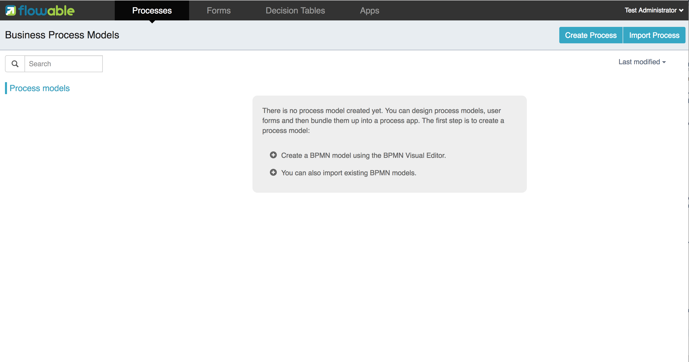

Usually, you will want to change the default H2 in-memory database configuration to a MySQL or Postgres (or other persistent database) configuration. You can do this per app by changing the flowable-app.properties file in the _WEB-INF/classes/META-INF/flowable-app_ directory of each app. But it's easier to copy the flowable-app.properties file from one of the apps or get it from link:$$https://github.com/flowable/flowable-engine/blob/master/modules/flowable-ui-task/flowable-ui-task-app/src/main/resources/META-INF/flowable-app/flowable-app.properties$$[Github], and put it on the classpath of all apps (for example in the Tomcat lib folder). The UI applications will first look at a flowable-app.properties file available on the classpath directly and this configuration will have precedence over the configuration file in the WAR. To change the default configuration to MySQL the following changes are needed to the properties file:

[source,linenums]
----
datasource.driver=com.mysql.jdbc.Driver
datasource.url=jdbc:mysql://127.0.0.1:3306/flowable?characterEncoding=UTF-8
datasource.username=flowable
datasource.password=flowable
----

This configuration will expect a flowable database to be present in the MySQL server and the UI apps will automatically generate the necessary database tables. For Postgres the following changes are necessary:

[source,linenums]
----
datasource.driver=org.postgresql.Driver
datasource.url=jdbc:postgresql://localhost:5432/flowable
datasource.username=flowable
datasource.password=flowable
----

In addition to changing the configuration, make sure the database driver is available on the classpath. Again, you could do this for every web application separately by adding the driver JAR file to the WEB-INF/lib folder, but you can also copy the JAR file once to the Tomcat lib folder. For MySQL and Postgres the database drivers can be downloaded from:

* MySQL: link:$$https://dev.mysql.com/downloads/connector/j$$[https://dev.mysql.com/downloads/connector/j]
* Postgres: link:$$https://jdbc.postgresql.org/$$[https://jdbc.postgresql.org/]

The additional configuration options are described in the table below:

[options="header"]
|===============
|Property name|Description
|security.rememberme.key|The hash key that is used by Spring Security to hash the password values in the applications. Make sure that you change the value of this property.
|security.passwordencoder|Define a password encoder for the IDM users. Use a value of spring_bcrypt to use the Spring password encoder. By default, the passwords will be saved in plain text.
|datasource.jndi.name|JNDI name of the data source, to be used when the datasource is configured in the servlet container instead of defining the datasource url and driver in this configuration file
|datasource.jndi.resourceRef|Set whether the lookup occurs in a J2EE container, i.e. if the prefix "java:comp/env/" needs to be added if the JNDI name doesn't already contain it. Default is "true".
|datasource.driver|The JDBC driver class name
|datasource.url|The JDBC driver url
|datasource.username|The username to be used for the JDBC connection
|datasource.password|The password to be used for the JDBC connection
|datasource.min-pool-size|The minimum datasource pool size
|datasource.max-pool-size|The maximum datasource pool size
|datasource.connection-timeout|The timeout, in milliseconds, that the connection pool will wait to acquire a connection
|datasource.test-query|Defines the query that will be executed for all connection tests
|datasource.max-idle-time|Seconds (not *not* milliseconds) a connection can remain pooled but unused before being discarded. Zero means idle connections never expire
|datasource.connection.max-lifetime|The time, in milliseconds, a connection will be kept in the connection pool (if set)
|email.host|Hostname of the email server for the Flowable Task application email service task
|email.port|Port of the email server
|email.useCredentials|Does the email server require authentication
|email.username|Username for the email server connection
|email.password|Password for the email server connection
|flowable.process-definitions.cache.max|Defines the maximum amount of process definitions available in the process definition cache
|admin.userid|Username of the default administrator user for the Flowable IDM application. Default is admin.
|admin.password|Password of the default administrator user for the Flowable IDM application. Default is test.
|admin.firstname|Firstname of the default administrator user for the Flowable IDM application. Default is Test.
|admin.lastname|Lastname of the default administrator user for the Flowable IDM application. Default is Administrator.
|admin.email|Email of the default administrator user for the Flowable IDM application. Default is admin@flowable.org.
|file.upload.max.size|Maximum size of file uploads, such as attachments and model files
|contentstorage.fs.rootFolder|Root folder location where content files will be stored, for example, task attachments or form file uploads
|contentstorage.fs.createRoot|If the root folder doesn't exist, should the Flowable Task application create it?
|idm.app.url|The URL to the IDM application, used for the login redirect when the cookie isn't set or is invalid, and for the user info and token info REST GET calls.
|idm.admin.user|The username used for executing the REST calls (with basic auth) to the IDM REST services. Default is admin.
|idm.admin.password|The password used for executing the REST calls (with basic auth) to the IDM REST services. Default is test.
|deployment.api.url|The root URI to th REST services of the Flowable engine, used by the Flowable Modeler application to deploy the application definition BAR file to the engine. Default url for the Flowable Task application is http://localhost:8080/flowable-task/process-api
|rest.task-app|idm-app|modeler-app.enabled|Enables the REST API (this is not the REST api used by the UI, but an api that's availble over basic auth authentication). Default is true.
|rest.authentication.mode|Sets the mode of verifying the user when accessing the REST API. By default this is 'verify-privilege', which means that the user passing the credentials with basic authentication needs to have the 'access-rest-api' privilege. Can be set to 'any-users', which means that any valid user/password pair passed as basic auth credentials can access the rest api (as it was in earlier versions of Flowable).
|===============

In addition to these properties that are used by multiple Flowable web applications, the Flowable admin application has a few more properties. The full
content of the properties file can be viewed on link:$$https://github.com/flowable/flowable-engine/blob/master/modules/flowable-ui-admin/flowable-ui-admin-app/src/main/resources/META-INF/flowable-app/flowable-app.properties$$[Github]. The additional properties are mainly used for defining the initial values for the REST endpoints for the different engines. The Admin application uses the initial values to make a connection to the Flowable engines, but the values can be overridden in the Admin application configuration view and these values are stored in the __ACT\_ADM\_SERVER\_CONFIG__ table. An example of the BPMN Engine REST properties is shown below:

[source,linenums]
----
rest.process.app.name=Flowable Process app
rest.process.app.description=Flowable Process REST config
rest.process.app.host=http://localhost
rest.process.app.port=8080
rest.process.app.contextroot=flowable-task
rest.process.app.restroot=process-api
rest.process.app.user=admin
rest.process.app.password=test
----

These values can be used when the Flowable Task app (with all the Flowable engines included) is managed by the Flowable Admin application.

[[flowableIDMApp]]

=== Flowable IDM application

The Flowable IDM application is used by all other three Flowable web applications for authentication and authorization and is therefore required to be available when you want to run the Modeler, Task or Admin application. The Flowable IDM application is a simple identity management application and is targeted at providing single sign-on capabilities to the Flowable web applications, including providing a central place to define users, groups and privileges.

The IDM application boots the IDM engine at startup and will create the identity tables as defined in the IDM engine in the datasource defined in the properties configuration.

When the Flowable IDM application is deployed and started, it will check if there's a user available in the ACT_ID_USER table, and if not it will use the admin.userid property to create a new default admin user in this table. It will also add all available privileges in the Flowable project to the newly created admin user:

* access-idm: provides the privilege to manage users, groups and privileges
* access-admin: allows the user to login to the Flowable Admin application and manage the Flowable engines
* access-modeler: enables access to the Flowable Modeler application
* access-task: provides the privilege to login to the Flowable Task application
* access-rest-api: allows the user to do call the REST API. Otherwise a 403 (forbidden) http status will be returned. Note that _rest.authentication.mode_ nees to be set to _verify-privilege_, which is the default.

When logging in to link:$$http://localhost:8080/flowable-idm$$[http://localhost:8080/flowable-idm] with admin/test for the first time the following user overview screen is shown:

image::images/flowable_idm_startup_screen.png[align="center"]

In this screen users can be added, removed and updated. The groups section can be used to create, delete and update groups. In the group details view you can also add and remove users to and from the group. The privilege screen allows you to add and remove privileges from users and groups:

image::images/flowable_idm_privilege_screen.png[align="center"]

There's no option to define new privileges yet, but you can add and remove users and groups for the existing four privileges.

In addition to the default identity tables, the IDM application can also be configured to use a LDAP server. To connect to a LDAP server, additional properties in the flowable-ui-app.properties file are needed:

[source,linenums]
----
#
# LDAP
#
ldap.enabled=true
ldap.server=ldap://localhost
ldap.port=10389
ldap.user=uid=admin, ou=system
ldap.password=secret
ldap.basedn=o=flowable
ldap.query.userbyid=(&(objectClass=inetOrgPerson)(uid={0}))
ldap.query.userbyname=(&(objectClass=inetOrgPerson)(|({0}=*{1}*)({2}=*{3}*)))
ldap.query.userall=(objectClass=inetOrgPerson)
ldap.query.groupsforuser=(&(objectClass=groupOfUniqueNames)(uniqueMember={0}))
ldap.query.groupall=(objectClass=groupOfUniqueNames)
ldap.attribute.userid=uid
ldap.attribute.firstname=cn
ldap.attribute.lastname=sn
ldap.attribute.groupid=cn
ldap.attribute.groupname=cn
ldap.cache.groupsize=10000
ldap.cache.groupexpiration=180000
----

When the ldap.enabled property is set to true, the IDM app will expect the other LDAP properties to have been filled-in. In this example configuration the server configuration + LDAP queries for the Apache Directory Server are provided. For other LDAP servers, like Active Directory, other configuration values are needed.

When LDAP is configured, authentication and group retrieval for a user will be done through the LDAP server. Only privileges will still be retrieved from the Flowable identity tables. So make sure each LDAP user has the correct privileges defined in the IDM application.

If the IDM application is booted with LDAP configuration the bootstrap logic will check if there are already privileges present in the Flowable identity tables. If there are no privileges (only when booting the first time), the 4 default privileges will be created and the admin.userid property value (from flowable-ui-app.properties) will be used as the user id to get all 4 privileges. So make sure that the admin.userid property value is set to a valid LDAP user, otherwise nobody will be able to login to any of the Flowable UI apps.

[[flowableModelerApp]]

=== Flowable Modeler application

The Flowable Modeler application can be used to model BPMN processes, DMN decision table, Form definitions and create app definitions. The BPMN modeler uses the same Oryx and Angular foundation as in Flowable 5, but the functionality has now been moved into a separate Modeler application. When using the Flowable Modeler application, make sure the Flowable IDM application is deployed and running as well (for authentication and authorization purposes).

When you login to the Modeler application (link:$$http://localhost:8080/flowable-modeler$$[http://localhost:8080/flowable-modeler]) with your user (or the default admin/test user), you will see the process overview screen. From here you can start creating new BPMN process models by clicking on the Create Process or Import Process button.

image::images/flowable_modeler_createmodel_popup.png[align="center", width="600"]

When creating a process model (but also any other model), it's important to think carefully about the model key value. The model key is a unique identifier for the model across the full model repository. If you choose a model key that already exists in the model repository, an error message is shown and the model is not saved.

After creating the model with the popup, the BPMN modeling canvas is shown. The BPMN editor is very similar to the Flowable 5 BPMN editor that was part of the Explorer application. All BPMN elements supported by the Flowable engine are available to be used in the design of a process model.

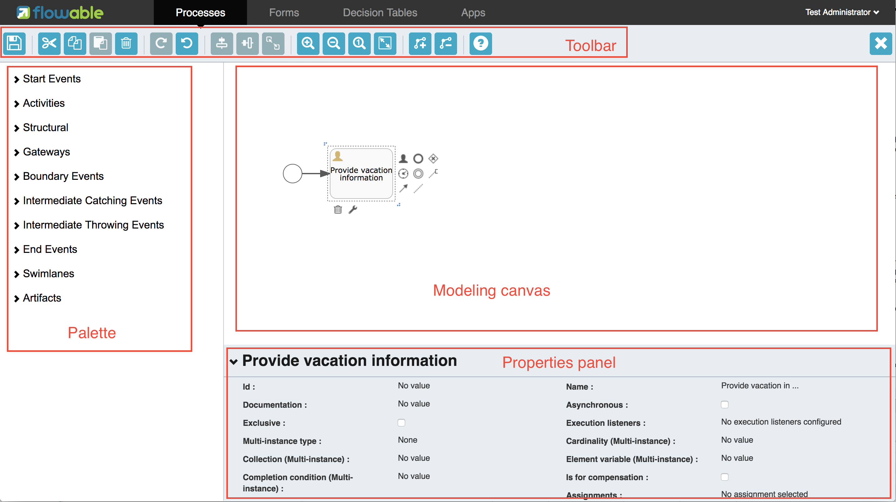

The BPMN editor is divided into 4 parts:

* Palette: the palette of BPMN elements available to design a process model
* Toolbar: actions to change the model canvas, such as zooming, layout and saving a model
* Model canvas: the modeling canvas on which to drag and drop BPMN elements and design the process model
* Properties panel: the properties for the main process model if no element is select and otherwise the properties of the selected BPMN element

For a User task element there's a _Referenced form_ property in the properties panel. If you select this property, a popup is opened where you can select a form definition from the repository or create a new form. When creating a new form, a similar create dialog to the process model create dialog is presented. After filling in the name and form model key, the form editor is opened.

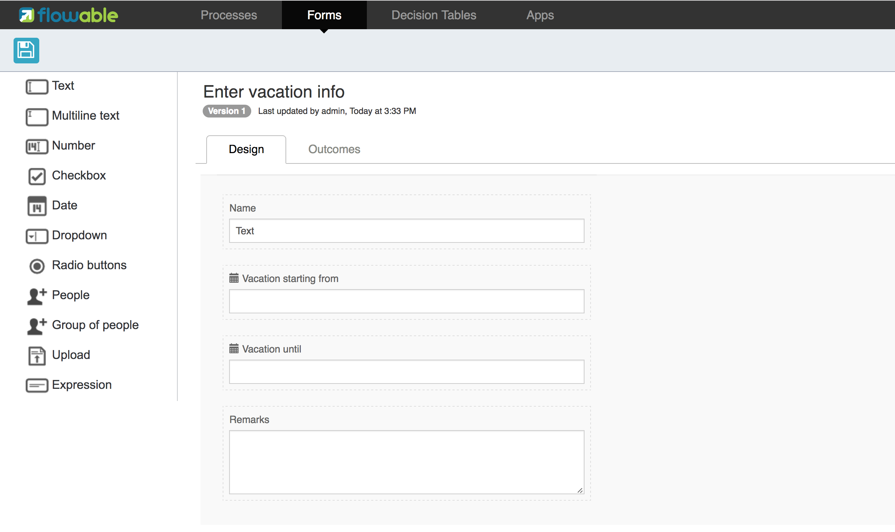

Form fields can be dragged from the form palette on to the form canvas. In this example, a name textfield, two date fields and a remarks multiline textfield are added to the form canvas. When editing a form field, the label, id, required status and placeholder can be filled in.

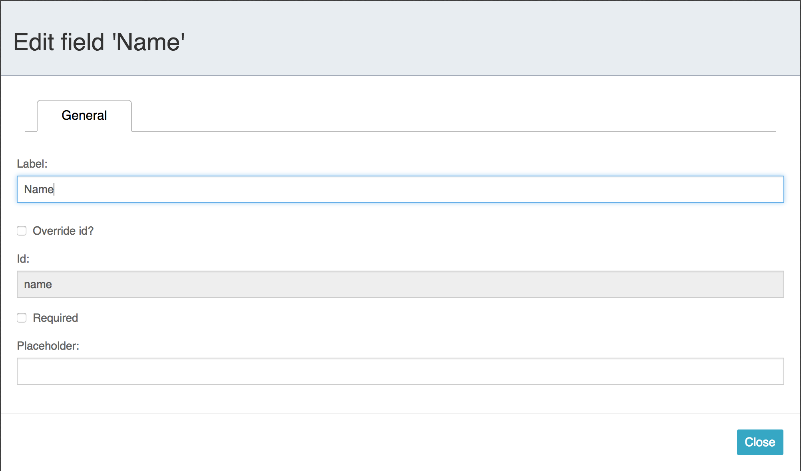

The id field is an important value, because a process variable will be created with the form field value using the id property value. When filling in the label property, the id property is automatically filled. If needed, you can also provide the id property value yourself by checking the override id checkbox.

After saving the form model and closing the form editor, you are automatically navigated back to the process model (when the form editor was opened via the BPMN editor). When selecting the User task element again and clicking on the _Referenced form_ property you will see that the newly created form definition is now attached to the User task. When clicking on the _Form_ tab in the header of the Modeler application, all form definitions available in the model repository are shown.

image::images/flowable_modeler_formoverview_screen.png[align="center"]

You can preview every form definition by opening the details view of a form definition. In the details view, the form name, key and description can be edited and the history of form models is available. You can also duplicate the form definition to create a new form definition with the same form fields. 

Now let's open the vacation request process model in the BPMN editor again and add a Script task to the process model, that will calculate the number of days between the vacation start and end dates. Click on the _Script format_ property and fill in a value of _groovy_ to instruct the Flowable engine to use the Groovy scripting engine. Now click on the _Script_ property and fill in the script that calculates the number of days.

image::images/flowable_modeler_script_popup.png[align="center", width="600"]

Now we have a _amountOfVacationDays_ process variable we can add a Decision task to the process model. A decision task can be used to execute a DMN decision table in the Flowable DMN engine. Through the _Decision table reference_ property, a new decision table model can be created and the DMN editor is opened.

image::images/flowable_modeler_dmneditor_screen.png[align="center"]

The DMN editor provides a table editor with input columns, where input conditions can be defined with the process variables available in the process context, and output columns, where output variable values can be defined. In this very simple example there's one input column using the _amountOfVacationDays_ variable that checks if it's less than 10 or higher or equal to 10. When the amount of days is less than 10, an output variable _managerApprovalNeeded_ is returned with value false, and otherwise a value of true is returned. You can define multiple input columns and have multiple input conditions per rule. It's also possible to leave an input column empty, which means that it's evaluated to true for that part of the rule. You can define one or multiple output variables.

Another important part of the DMN decision table definition is the hit policy. Currently, Flowable supports the First and Any hit policy. With the First hit policy, when the first rule is found that evaluates to true the DMN execution will stop and its output variables are returned. For the Any hit policy, all rules will be executed and the output variables for the last rule that evaluates to true are returned.

When the DMN editor is saved and closed, the Modeler application navigates back to the BPMN editor and the newly created DMN decision table is now attached to the Decision task. The decision task will be generated in the BPMN XML like;

[source,xml,linenums]
----
<serviceTask id="decisionTask" name="Is manager approval needed?" flowable:type="dmn">
    <extensionElements>
        <flowable:field name="decisionTableReferenceKey">
            <flowable:string><![CDATA[managerApprovalNeeded]]></flowable:string>
        </flowable:field>
    </extensionElements>
</serviceTask>
----

With the _managerApprovalNeeded_ variable available in the process instance context, we can now create an exclusive gateway with a sequence flow condition that evaluates the calculated value of the DMN Engine. 

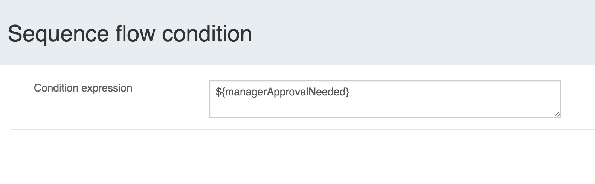

The full BPMN process model now looks like this:

image::images/flowable_modeler_vacationrequest_screen.png[align="center"]

With the process model completed, we can now create an app definition that combines one or more process models with all their associated models (for example, decision tables and form definitions) into a single artifact. An app definition can be exported as a BAR file (zip format) that can be deployed on the Flowable engine. When creating a vacation request app definition, the app editor will look something like the screen below.

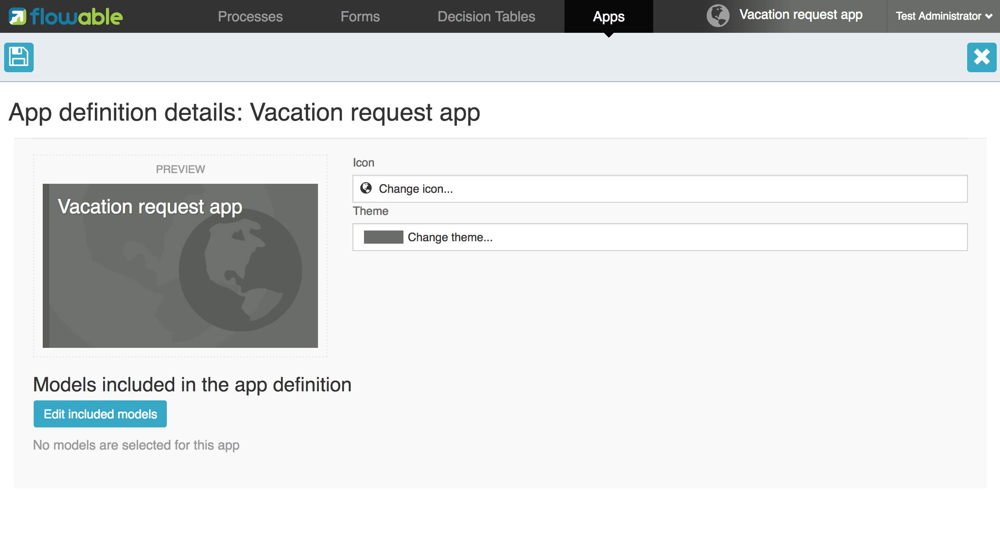

In the app editor, an icon and a theme color can be selected that will be used in the Flowable Task application to show the application in the dashboard. The important step is to add the vacation request process model, and by selecting the process model, automatically include any form definitions and DMN decision tables.

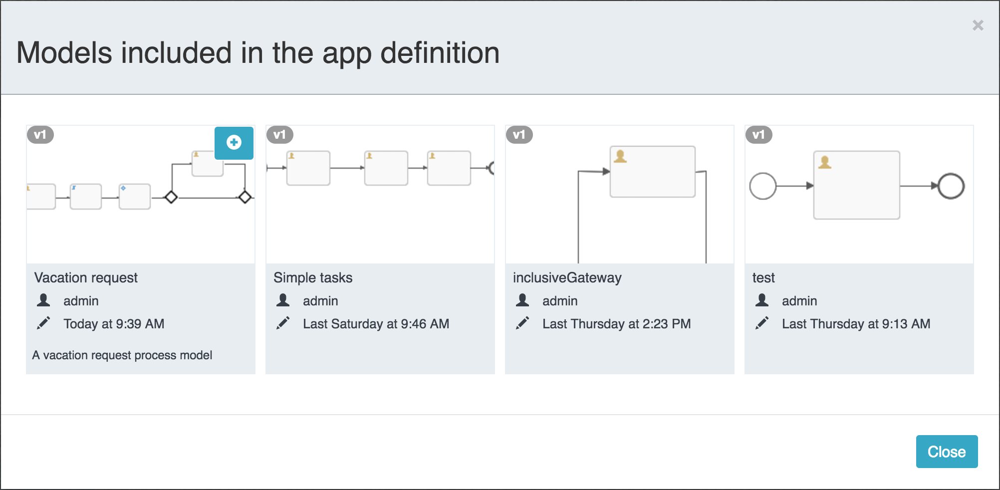

A process model can be selected by clicking on the model thumbnail. When one or more models are selected, you can close the popup, save the app definition and close it. When navigating to the details view of the newly created vacation request app definition, the following details screen is shown:

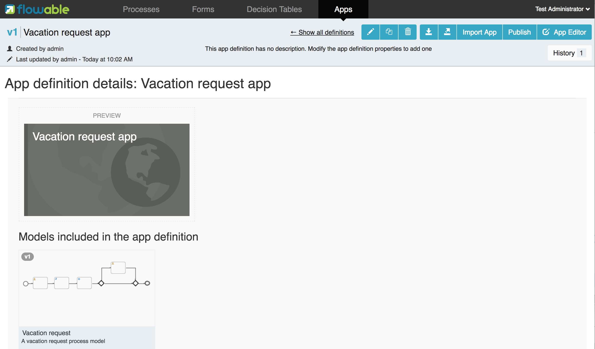

From this view, you can download the app definition in two different formats. The first download button (with the arrow pointing downwards) can be used to
download the app definition with the JSON model files for each included model. This makes it easy to share app definitions between different Flowable Modeler applications. The second download button (with the arrow point to upper right) will provide a BAR file of the app definition models, which can be deployed on the Flowable engine. In the BAR file, only the deployable artifacts are included, such as the BPMN 2.0 XML file and the DMN XML file, and not the JSON model files. All files in a BAR file deployed on a Flowable engine are stored in the database, so therefore only the deployable files are included.

From the app definition details view, you can also _Publish_ the app definition directly to the Flowable engine. The Flowable Modeler uses the URL defined in the flowable-ui-app.properties file with the _deployment.api.url_ property key. By default, the deployment URL is configured so the app definition will be deployed on the Flowable Task application when it's running. However, this can be changed to use the Flowable REST application, for example. Make sure the Flowable Task application is running and click on the _Publish_ button. The app definition is now deployed as a BAR file to the Flowable Task application.

[[flowableTaskApp]]

=== Flowable Task application

The Flowable Task application is the runtime application of the Flowable project and includes the Flowable BPMN, DMN, Form and Content engines by default. With the Flowable Task application, new process instances can be started, tasks can be completed, task forms can be rendered and so on. In the previous section, the vacation request app definition was deployed on the Flowable Task application REST API, and through that deployed on the Flowable engine. If you look in the Flowable database, you can see a new deployment entry has been added to the ACT_RE_DEPLOYMENT table for the BPMN Engine. Also, new entries haven been created in the ACT_DMN_DEPLOYMENT and ACT_FO_FORM_DEPLOYMENT tables for the DMN and Form engines. 

On the dashboard on link:$$http://localhost:8080/flowable-task$$[http://localhost:8080/flowable-task], you can see a vacation request app in addition to the default Task app, and any other apps that have been deployed to the Flowable engine already. 

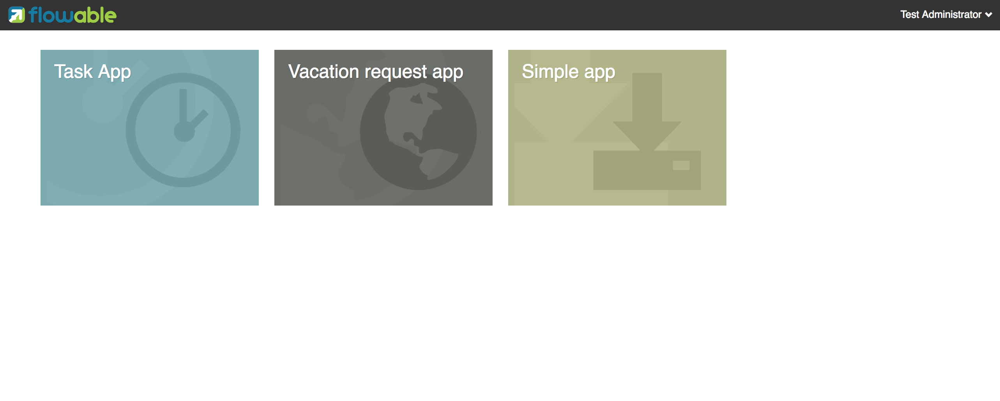

When clicking on the vacation request app, the task list for the logged-in user is shown (which is probably empty for now).

image::images/flowable_task_tasklist_screen.png[align="center"]

When clicking on the _Processes_ tab you can choose to start a new process instance by clicking on the _Start a process_ button. The list of available process definitions within the context of this app definition is now displayed. In the general Task app this works in a similar way, but in the Task app, all process definitions deployed on the Flowable engine are shown. After selecting the vacation request process definition, the _Start process_ button can be clicked to start a new vacation request process instance.

The Flowable Task application automatically navigates to the process instance details view. You can see the _Provide vacation information_ task is active and, for example, comments can be added and the process instance state can be shown diagrammatically using the _Show diagram_ button. 

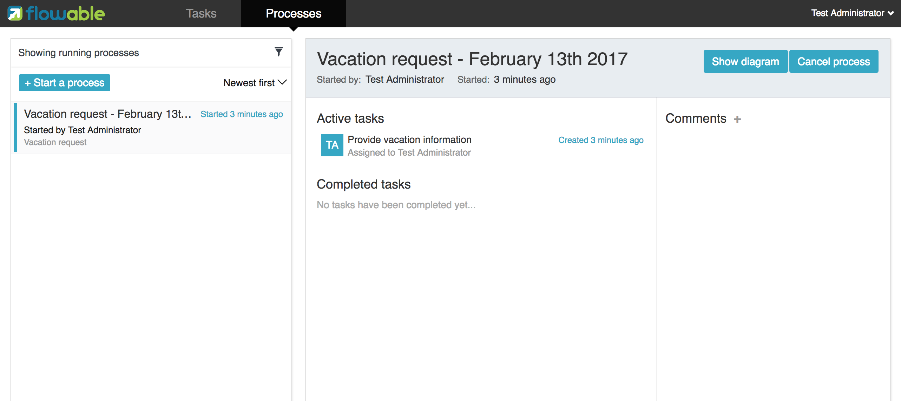

When navigating to the task list, you can also see the _Provide vacation information_ task listed there as well. The task details are shown in this view, with the vacation info form being rendered. You can also switch to the details view by clicking on the _Show details_ button. In the details view, comments can be added, users can involved in the task and attachments can be added to the task. You can also change the due date and the assignee of a task.

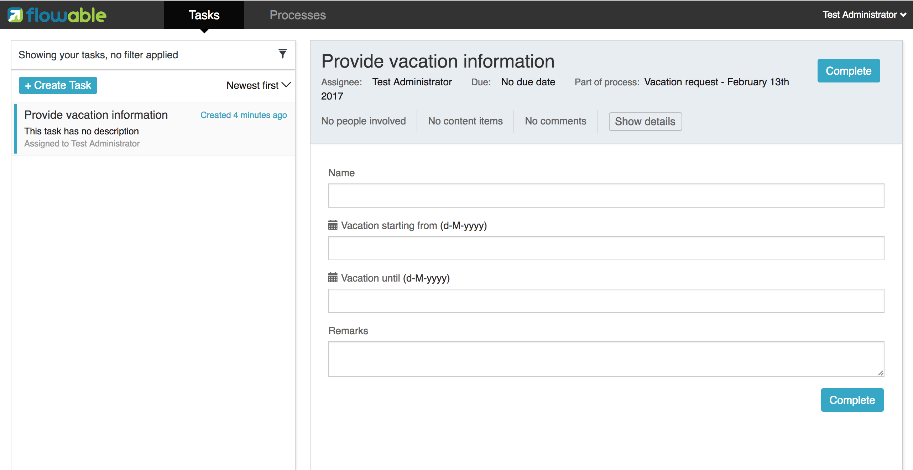

Let's fill in the form and complete the task. First, select a start date and end date that have more than 10 days in between, so we can validate that a
_Manager approval_ task is being generated. After filling in the vacation info form and clicking the _Complete_ button, the Flowable task app navigates directly to the _Manager approval_ task view. When you also complete this task (without a task form), the process instance is completed.

When navigating to the _Processes_ tab and clicking on the _Showing running processes_ section, you can select an option to show completed process instances. The list of completed process instances is now shown and when clicking on the just completed vacation request process you can see the two completed tasks.

image::images/flowable_task_processhistory_screen.png[align="center"]

The completed form of each task is stored in the ACT_FO_FORM_INSTANCE table of the Flowable Form engine. So it's possible to look at the values of each completed form when you navigate to the completed task.

image::images/flowable_task_completedform_screen.png[align="center"]

Make sure to switch back to showing running processes instead of the completed ones, otherwise you won't see newly started process instances. You can also filter tasks in the task list view. There are options to search on the name of a task, the task state, only tasks for a specific process definition and change the assignment filter.

image::images/flowable_task_taskfilter_screen.png[align="center", width="400"]

By default, the assignment filter is set to _Tasks where I am involved_. This doesn't show the tasks where you are a candidate, such as tasks that are available to a specific candidate group before they are assigned to a specific person. To show candidate tasks you can select the _Tasks where I am one of the candidates_ assignment filter option.

[[flowableAdminApp]]

=== Flowable Admin application

The fourth UI application the Flowable project provides is the Flowable Admin application. This application provides ways to, for example, query deployments in the BPMN, DMN and Form Engines, but also shows the active state of a process instance with its active tasks and process variables. It also provides actions to assign a task to a different assignee and to complete an active task. The Flowable Admin application uses the REST API to communicate with the Flowable engines. By default, it is configured to connect to the Flowable Task REST API, but you can easily change this to use the Flowable REST app REST API instead. When going to link:$$http://localhost:8080/flowable-admin$$[http://localhost:8080/flowable-admin], the configuration screen is shown (which is also available by clicking on the arrow at the top right near the Flowable logo). 

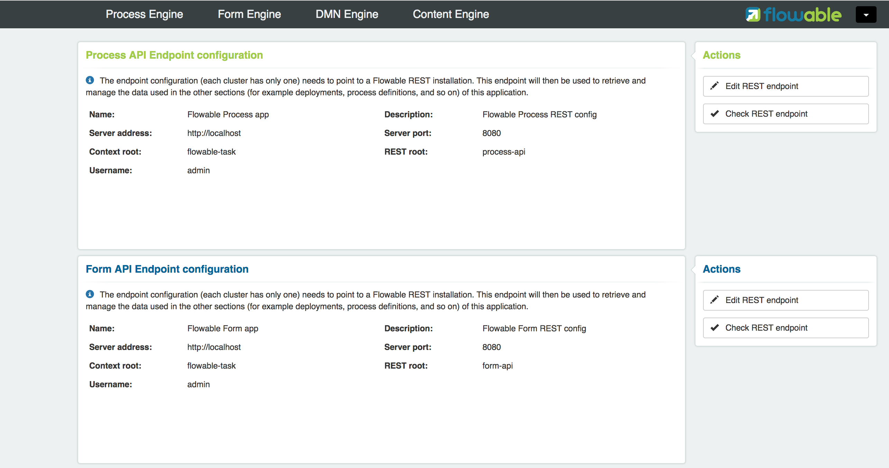

For each engine, the REST endpoint can be configured with the basic authentication values. The configuration is done per engine, because it's possible to, for example, deploy the DMN Engine on a separate server from the BPMN Engine. 

When the configuration is defined with the correct values, the _Process Engine_ can be selected to administer the Flowable BPMN engine. By default, the deployments of the Flowable BPMN engine are shown.

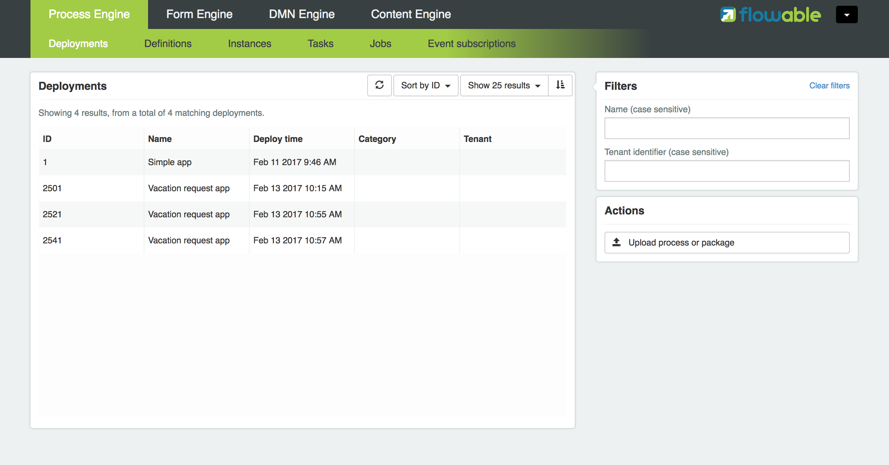

You can filter the deployments based on name and tenant identifier. In this view, it's also possible to deploy a new BPMN XML file or BAR file to the Flowable engine. When clicking on one of the deployments, the deployment details view is shown.

image::images/flowable_admin_deploymentdetails_screen.png[align="center"]

More details of a deployment are shown here and also the process definitions that are part of this deployment on which you click to get more details. It's also possible to delete a deployment here. When you want to delete a deployed app definition, this is also the way to delete the app definition from the Flowable Task app dashboard. When clicking on one of the process definitions, the process definition details view is shown.

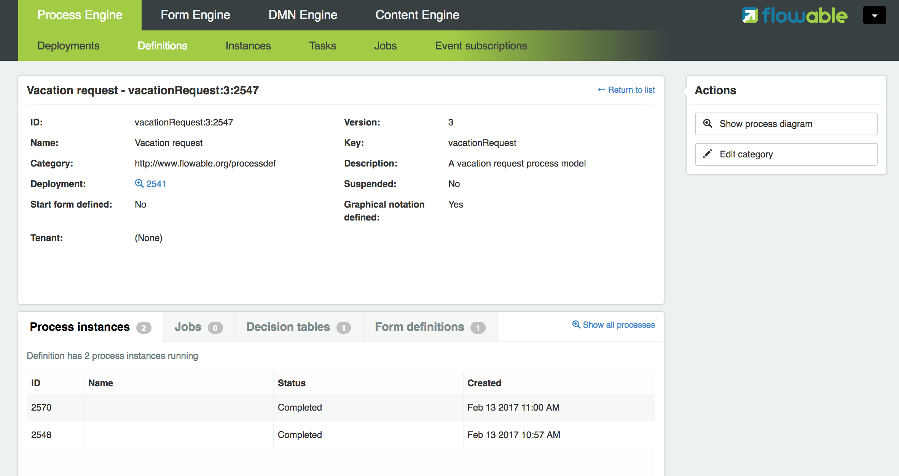

In the process definition details view, the first page of process instances is shown, together with optional decision table definitions and form definitions that are used in the process definition. For the vacation request process definition, there's one connected decision table and one connected form definition. Clicking on the decision table definition navigates the Flowable Admin application to the DMN engine. You can always navigate back to the Process engine by clicking on the _Parent Deployment ID_ link.

In addition to the deployments and definitions, you can also query on process instances, tasks, jobs and event subscriptions in the Process engine. The views all work in a similar way to what's already been described.

=== Internationalization

The Flowable UI apps support internationalization (i18n). The project maintains the English translations. It is however possible to provide your own translation files in order to support other languages.

The link:$$https://github.com/angular-translate/angular-translate[Angular Translate] library tries to load a specific translation file based on the browser's locale located in the _i18n_ folder (present in each UI module). When a matching translation file cannot be loaded the framework will fallback to the English translation.

Mapping multiple browser locale keys to specific translations additional configuration can be provided (located in the Angular app config);

[source,linenums]
----
// Initialize angular-translate
$translateProvider.useStaticFilesLoader({
    prefix: './i18n/',
    suffix: '.json'
})
/*
    This can be used to map multiple browser language keys to a
    angular translate language key.
*/
// .registerAvailableLanguageKeys(['en'], {
//     'en-*': 'en'
// })
.useCookieStorage()
.useSanitizeValueStrategy('sanitizeParameters')
.uniformLanguageTag('bcp47')
.determinePreferredLanguage();
----

For example; your browser is configured for English (United States) and provides the language key _en-US_. Without the mapping Angular Translate will try to fetch the corresponding translation file _en-US.json_. (If this is not available it will fallback to 'en' and load the _en.json_ translation file)

By uncommenting the _.registerAvailableLanguageKeys_ block you can map _en-US_ (and all other _en_ language keys) to the _en.json_ language file.
