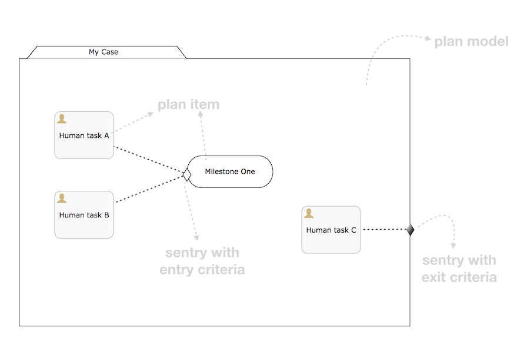
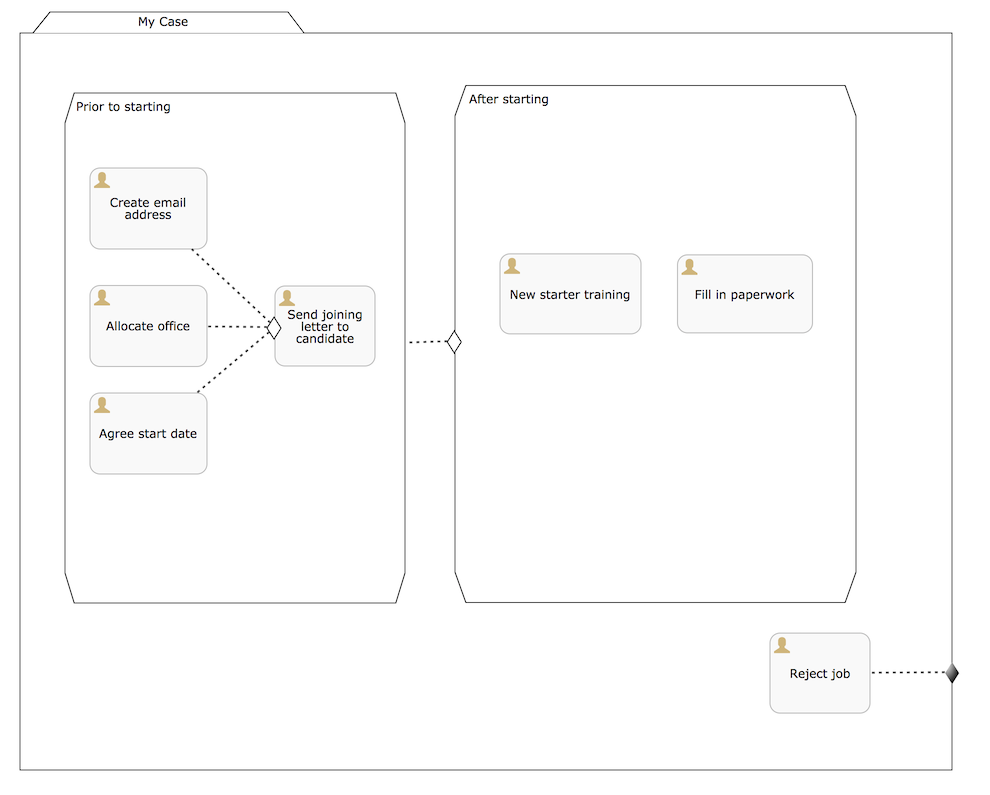
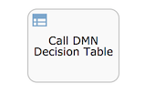
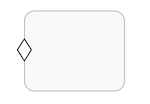
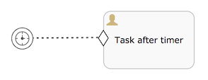
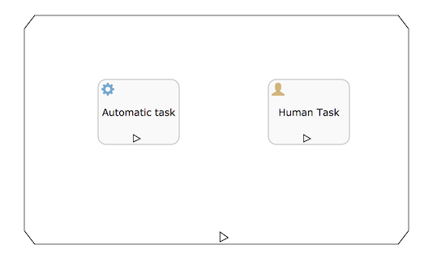
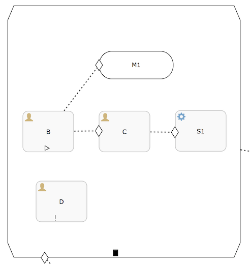

== CMMN 1.1

=== What is CMMN?

The Case Management Model and Notation (CMMN) is a standard notation and formal specification by the link:$$http://www.omg.org/spec/CMMN/$$[Object Management Group] for representing case models.

Flowable contains: 

* A CMMN 1.1 modeler to create CMMN 1.1 case models
* A Java engine that can import and execute CMMN 1.1 case models
* A demonstration UI that executes the case models, allowing users to see and complete human tasks (and their forms)

=== Basic concepts and terminology

The following figure shows a simple CMMN 1.1 diagram:

A *case model* is always visualized as some sort of _folder_ that contains all the case elements. Every case model contains a *plan model* onto which items will be _planned_. 

The elements of a plan model are called *plan items*. Each _plan item_ has a *plan item definition* that gives its type and possible configuration options at runtime. For example, in the figure above, there are three *human task* plan items and one *milestone*. Other examples of plan items are _process tasks, case tasks and stages_.

After having deployed a case model to the Flowable CMMN engine, it's possible to start *case instances* based on this case model. The plan items defined in the case model similarly have *plan item instance* runtime representations that are exposed by, and can be queried using, the Flowable API. Plan item instances have a state lifecycle that is defined in the CMMN 1.1 specification and is core to how the engine works. Please check out section 8.4.2 of the CMMN 1.1 specification for all the details.

Plan items can have _sentries_: a plan item is said to have _entry criteria_ when a sentry "guards" its activation. These criteria specify conditions that must be satisfied to _trigger the sentry_. For example, in the figure above, the "Milestone One" plan item is _available_ after a case instance is started, but it is _activated_ (in CMMN 1.1 specification terminology: it moves from the _available_ state to the _active_ state) when both human task A and B are completed. Note that sentries can have complex expression in their _if part_, which are not visualized, allowing for much more complex functionality. Also note that there can be multiple sentries, although only one needs to be satisfied to trigger a state transition.

Plan items and the plan model can also have sentries with _exit criteria_, which specify conditions that trigger an _exit_ from that particular plan item. In the figure above, the whole plan model is exited (as are all the child elements that are active at that moment), when human task C completes.

CMMN 1.1 defines a standard XML format in an XSD that is part of the specification. For information, the example in the figure above is represented in XML as shown below.

Some observations:

* The four plan items above are in the XML and they reference their definition with a _definitionRef_. The actual definitions are at the bottom of the _casePlanModel_ element
* The plan items have criteria (entry or exit) that reference a _sentry_ (not the other way around)
* The XML also contains information on how the diagram is visualized (x and y coordinates, widths and heights, and so on), which are omitted below. These elements are important when exchanging case models with other CMMN 1.1 modeling tools to preserve the correct visual representation

[source,xml,linenums]
----
<?xml version="1.0" encoding="UTF-8"?>
<definitions xmlns="http://www.omg.org/spec/CMMN/20151109/MODEL" 
             xmlns:xsi="http://www.w3.org/2001/XMLSchema-instance" 
             xmlns:flowable="http://flowable.org/cmmn" 
             xmlns:cmmndi="http://www.omg.org/spec/CMMN/20151109/CMMNDI" 
             xmlns:dc="http://www.omg.org/spec/CMMN/20151109/DC" 
             xmlns:di="http://www.omg.org/spec/CMMN/20151109/DI" 
             targetNamespace="http://www.flowable.org/casedef">
  <case id="simpleExample" name="Simple Example">
    <casePlanModel id="casePlanModel" name="My Case">
      <planItem id="planItem1" name="Human task A" 
            definitionRef="sid-88199E7C-7655-439C-810B-8849FC52D3EB"></planItem>
      <planItem id="planItem2" name="Milestone One" 
            definitionRef="sid-8BF8A774-A8A7-4F1A-95CF-1E0D61EE5A47">
        <entryCriterion id="sid-62CC4A6D-B29B-4129-93EA-460253C45CDF" 
            sentryRef="sentry1"></entryCriterion>
      </planItem>
      <planItem id="planItem3" name="Human task B" 
            definitionRef="sid-A1FB8733-0DBC-4B38-9830-CBC4D0C4B802"></planItem>
      <planItem id="planItem4" name="Human task C" 
            definitionRef="sid-D3970AFC-7391-4BA7-95BA-51C64D2F41E9"></planItem>
      <sentry id="sentry1">
        <planItemOnPart id="sentryOnPart1" sourceRef="planItem1">
          <standardEvent>complete</standardEvent>
        </planItemOnPart>
        <planItemOnPart id="sentryOnPart2" sourceRef="planItem3">
          <standardEvent>complete</standardEvent>
        </planItemOnPart>
      </sentry>
      <sentry id="sentry2">
        <planItemOnPart id="sentryOnPart3" sourceRef="planItem4">
          <standardEvent>complete</standardEvent>
        </planItemOnPart>
      </sentry>
      <humanTask id="sid-88199E7C-7655-439C-810B-8849FC52D3EB" 
        name="Human task A"></humanTask>
      <milestone id="sid-8BF8A774-A8A7-4F1A-95CF-1E0D61EE5A47" 
        name="Milestone One"></milestone>
      <humanTask id="sid-A1FB8733-0DBC-4B38-9830-CBC4D0C4B802" 
        name="Human task B"></humanTask>
      <humanTask id="sid-D3970AFC-7391-4BA7-95BA-51C64D2F41E9" 
        name="Human task C"></humanTask>
      <exitCriterion id="sid-422626DB-9B40-49D8-955E-641AB96A5BFA" 
        sentryRef="sentry2"></exitCriterion>
    </casePlanModel>
  </case>
  <cmmndi:CMMNDI>
    <cmmndi:CMMNDiagram id="CMMNDiagram_simpleExample">
        ...
    </cmmndi:CMMNDiagram>
  </cmmndi:CMMNDI>
</definitions>
----

=== Programmatic example

In this section we're going to build a simple case model and execute it programmatically through the Java APIs of the Flowable CMMN engine in a simple command line example.

The case model we'll build is a simplified _employee onboarding_ case with two stages: a phase before and phase after the potential employee has started. In the first stage, someone from the HR department will complete the tasks, while in the second stage it is the employee completing them. Also, at any point in time, the potential employee can reject the job and stop the whole case instance.

Note that only stages and human tasks are used. In a real case model, there will most likely other plan item types too, such as milestones, nested stages, automated tasks, and so on.

The XML for this case model is the following:

[source,xml,linenums]
----
<?xml version="1.0" encoding="UTF-8"?>
<definitions xmlns="http://www.omg.org/spec/CMMN/20151109/MODEL" 
             xmlns:xsi="http://www.w3.org/2001/XMLSchema-instance" 
             xmlns:flowable="http://flowable.org/cmmn" 
             xmlns:cmmndi="http://www.omg.org/spec/CMMN/20151109/CMMNDI" 
             xmlns:dc="http://www.omg.org/spec/CMMN/20151109/DC" 
             xmlns:di="http://www.omg.org/spec/CMMN/20151109/DI" 
             targetNamespace="http://www.flowable.org/casedef">
  <case id="employeeOnboarding" name="Simple Example">
    <casePlanModel id="casePlanModel" name="My Case">
      <planItem id="planItem5" name="Prior to starting" 
            definitionRef="sid-025D29E8-BA9B-403D-A684-8C5B52185642"></planItem>
      <planItem id="planItem8" name="After starting" 
            definitionRef="sid-8459EF32-4F4C-4E9B-A6E9-87FDC2299044">
        <entryCriterion id="sid-50B5F12D-FE75-4D05-9148-86574EE6C073" 
            sentryRef="sentry2"></entryCriterion>
      </planItem>
      <planItem id="planItem9" name="Reject job" 
            definitionRef="sid-134E885A-3D58-417E-81E2-66A3E12334F9"></planItem>
      <sentry id="sentry2">
        <planItemOnPart id="sentryOnPart4" sourceRef="planItem5">
          <standardEvent>complete</standardEvent>
        </planItemOnPart>
      </sentry>
      <sentry id="sentry3">
        <planItemOnPart id="sentryOnPart5" sourceRef="planItem9">
          <standardEvent>complete</standardEvent>
        </planItemOnPart>
      </sentry>
      <stage id="sid-025D29E8-BA9B-403D-A684-8C5B52185642" name="Prior to starting">
        <planItem id="planItem1" name="Create email address" 
                definitionRef="sid-EA434DDD-E1BE-4AC1-8520-B19ACE8782D2"></planItem>
        <planItem id="planItem2" name="Allocate office" 
                definitionRef="sid-505BA223-131A-4EF0-ABAD-485AEB0F2C96"></planItem>
        <planItem id="planItem3" name="Send joining letter to candidate" 
                definitionRef="sid-D28DBAD5-0F5F-45F4-8553-3381199AC45F">
          <entryCriterion id="sid-4D88C79D-8E31-4246-9541-A4F6A5720AC8" 
            sentryRef="sentry1"></entryCriterion>
        </planItem>
        <planItem id="planItem4" name="Agree start date" 
                definitionRef="sid-97A72C46-C0AD-477F-86DD-85EF643BB97D"></planItem>
        <sentry id="sentry1">
          <planItemOnPart id="sentryOnPart1" sourceRef="planItem1">
            <standardEvent>complete</standardEvent>
          </planItemOnPart>
          <planItemOnPart id="sentryOnPart2" sourceRef="planItem2">
            <standardEvent>complete</standardEvent>
          </planItemOnPart>
          <planItemOnPart id="sentryOnPart3" sourceRef="planItem4">
            <standardEvent>complete</standardEvent>
          </planItemOnPart>
        </sentry>
        <humanTask id="sid-EA434DDD-E1BE-4AC1-8520-B19ACE8782D2" 
            name="Create email address" 
            flowable:candidateGroups="hr"></humanTask>
        <humanTask id="sid-505BA223-131A-4EF0-ABAD-485AEB0F2C96" 
            name="Allocate office" 
            flowable:candidateGroups="hr"></humanTask>
        <humanTask id="sid-D28DBAD5-0F5F-45F4-8553-3381199AC45F" 
            name="Send joining letter to candidate" 
            flowable:candidateGroups="hr"></humanTask>
        <humanTask id="sid-97A72C46-C0AD-477F-86DD-85EF643BB97D" 
            name="Agree start date" 
            flowable:candidateGroups="hr"></humanTask>
      </stage>
      <stage id="sid-8459EF32-4F4C-4E9B-A6E9-87FDC2299044" 
        name="After starting">
        <planItem id="planItem6" name="New starter training" 
                definitionRef="sid-DF7B9582-11A6-40B4-B7E5-EC7AC6029387"></planItem>
        <planItem id="planItem7" name="Fill in paperwork" 
                definitionRef="sid-7BF2B421-7FA0-479D-A8BD-C22EBD09F599"></planItem>
        <humanTask id="sid-DF7B9582-11A6-40B4-B7E5-EC7AC6029387" 
            name="New starter training" 
            flowable:assignee="${potentialEmployee}"></humanTask>
        <humanTask id="sid-7BF2B421-7FA0-479D-A8BD-C22EBD09F599" 
            name="Fill in paperwork" 
            flowable:assignee="${potentialEmployee}"></humanTask>
      </stage>
      <humanTask id="sid-134E885A-3D58-417E-81E2-66A3E12334F9" name="Reject job" 
        flowable:assignee="${potentialEmployee}"></humanTask>
      <exitCriterion id="sid-18277F30-E146-4B3E-B3C9-3F1E187EC7A8" 
        sentryRef="sentry3"></exitCriterion>
    </casePlanModel>
  </case>
</definitions>
----

First of all, create a new project and add the _flowable-cmmn-engine_ dependency (here shown for Maven). The H2 dependency is also added, as H2 will be used as embedded database later on.

[source,xml,linenums]
----
<dependency>
    <groupId>org.flowable</groupId>
    <artifactId>flowable-cmmn-engine</artifactId>
    <version>${flowable.version}</version>
</dependency>
<dependency>
    <groupId>com.h2database</groupId>
    <artifactId>h2</artifactId>
    <version>${h2.version}</version>
</dependency>
----

The Flowable CMMN API is designed to be consistent with the other Flowable APIs and concepts. As such, people that know the BPMN or DMN APIs will have no problem finding their way around. As with the other engines, the first line of code is creating a CmmnEngine. Here, the default in-memory configuration is used, which uses H2 as the database:

[source,java,linenums]
----
public class Main {
  public static void main(String[] args) {
    CmmnEngine cmmnEngine 
        = new StandaloneInMemCmmnEngineConfiguration().buildCmmnEngine();
  }
}
----

Note that the _CmmnEngineConfiguration_ exposes many configuration options for tweaking various settings of the CMMN engine.

Put the XML from above in a file, for example _my-case.cmmn_ (or .cmmn.xml). For Maven, it should be placed in the _src/main/resources_ folder.

To make the engine aware of the case model, it first needs to be _deployed_. This is done through the _CmmnRepositoryService_:

[source,java,linenums]
----
CmmnRepositoryService cmmnRepositoryService = cmmnEngine.getCmmnRepositoryService();
CmmnDeployment cmmnDeployment = cmmnRepositoryService.createDeployment()
    .addClasspathResource("my-case.cmmn")
    .deploy();
----

Deploying the XML will return a *CmmnDeployment*. A deployment can contain many case models and artifacts. The specific case model definition above is stored as a *CaseDefinition*. This can be verified by doing a _CaseDefinitionQuery_:

[source,java,linenums]
----
List<CaseDefinition> caseDefinitions = cmmnRepositoryService.createCaseDefinitionQuery().list();
System.out.println("Found " + caseDefinitions.size() + " case definitions");
----

Having a *CaseDefinition* in the engine, it's now possible to start a *CaseInstance* for this case model definition. Either the result from the query is used and passed into the following snippet of code, or the _key_ of the case definition is used directly (as done below).

Note that we're also passing data, an identifier to the _potentialEmployee_ as a variable when starting the *CaseInstance*. This variable will later be used in the human tasks to assign the task to the correct person (see the _assignee="${potentialEmployee}"_ attribute on _human tasks_).

[source,java,linenums]
----
CmmnRuntimeService cmmnRuntimeService = cmmnEngine.getCmmnRuntimeService();
CaseInstance caseInstance = cmmnRuntimeService.createCaseInstanceBuilder()
    .caseDefinitionKey("employeeOnboarding")
    .variable("potentialEmployee", "johnDoe")
    .start();
----

After the *CaseInstance* is started, the engine will determine which of the plan items of the model should be activated:

* The first stage has no entry criteria, so it's activated
* The child human tasks of the first stage have no entry criteria, so three of them are expected to be active

The plan items are represented at runtime by *PlanItemInstances* and can be queried through the _CmmnRuntimeService_:

[source,java,linenums]
----
List<PlanItemInstance> planItemInstances = cmmnRuntimeService.createPlanItemInstanceQuery()
    .caseInstanceId(caseInstance.getId())
    .orderByName().asc()
    .list();

for (PlanItemInstance planItemInstance : planItemInstances) {
    System.out.println(planItemInstance.getName());
}
----

which prints out

----
After starting
Agree start date
Allocate office
Create email address
Prior to starting
Reject job
Send joining letter to candidate
----

Some things might be unexpected here:

* The stages are _also_ plan items and thus have a representation as *PlanItemInstance*. Note that that child plan item instances will have the stage as parent when calling _.getStageInstanceId()_.
* The _Send joining letter to candidate_ is returned in the result. The reason is that, in accordance with the CMMN 1.1 specification, this plan item instance is in the _available_ state, but not yet in the _active_ state.

Indeed, when the code above is changed to

[source,java,linenums]
----
for (PlanItemInstance planItemInstance : planItemInstances) {
    System.out.println(planItemInstance.getName() 
        + ", state=" + planItemInstance.getState() 
        + ", parent stage=" + planItemInstance.getStageInstanceId());
}
----

The output now becomes:

----
After starting, state=available, parent stage=null
Agree start date, state=active, parent stage=fe37ac97-b016-11e7-b3ad-acde48001122
Allocate office, state=active, parent stage=fe37ac97-b016-11e7-b3ad-acde48001122
Create email address, state=active, parent stage=fe37ac97-b016-11e7-b3ad-acde48001122
Prior to starting, state=active, parent stage=null
Reject job, state=active, parent stage=fe37ac97-b016-11e7-b3ad-acde48001122
Send joining letter to candidate, state=available, parent stage=fe37ac97-b016-11e7-b3ad-acde48001122
----

To only show the active plan item instances, the query can be adapted by adding _planItemInstanceStateActive()_:

[source,java,linenums]
----
 List<PlanItemInstance> planItemInstances = cmmnRuntimeService.createPlanItemInstanceQuery()
    .caseInstanceId(caseInstance.getId())
    .planItemInstanceStateActive()
    .orderByName().asc()
    .list();
----

The output is now

----
Agree start date
Allocate office
Create email address
Prior to starting
Reject job
----

Of course, the *PlanItemInstance* is the low level representation, but each plan item also has a _plan item definition_ that defines what type it is. In this case, we only have _human tasks_. It is possible to interact with the _CaseInstance_ via its _plan item instances_, for example by triggering them programmatically (for example, _CmmnRuntimeService.triggerPlanItemInstance(String planItemInstanceId)_). However, most likely the interaction will happen through the results of the actual plan item definition: here, the human tasks.

Querying for tasks is done in the exact same way as for the BPMN engine (in fact, the task service is a shared component and tasks created in BPMN or CMMN can be queried through both engines):

[source,java,linenums]
----
CmmnTaskService cmmnTaskService = cmmnEngine.getCmmnTaskService();
List<Task> hrTasks = cmmnTaskService.createTaskQuery()
    .taskCandidateGroup("hr")
    .caseInstanceId(caseInstance.getId())
    .orderByTaskName().asc()
    .list();
for (Task task : hrTasks) {
    System.out.println("Task for HR : " + task.getName());
}
        
List<Task> employeeTasks = cmmnTaskService.createTaskQuery()
    .taskAssignee("johndoe")
    .orderByTaskName().asc()
    .list();
for (Task task : employeeTasks) {
    System.out.println("Task for employee: " + task);
}
----

Which outputs:

----
Task for HR : Agree start date
Task for HR : Allocate office
Task for HR : Create email address

Task for employee: Reject job
----

When the three tasks of HR are completed, the 'Send joining letter to candidate' task should be available:

[source,java,linenums]
----
for (Task task : hrTasks) {
    cmmnTaskService.complete(task.getId());
}

hrTasks = cmmnTaskService.createTaskQuery()
    .taskCandidateGroup("hr")
    .caseInstanceId(caseInstance.getId())
    .orderByTaskName().asc()
    .list();

for (Task task : hrTasks) {
    System.out.println("Task for HR : " + task.getName());
}
----

And indeed, the expected task is now created:

----
Task for HR : Send joining letter to candidate
----

Completing this task will now move the case instance into the second stage, as the sentry for the first stage is satisfied. The 'Reject job' tasks is automatically completed by the system and the two tasks for the employee are created:

[source,java,linenums]
----
Task for employee: Fill in paperwork
Task for employee: New starter training
Task for employee: Reject job
----

Completing all the tasks will end the case instance:

----
List<Task> tasks = cmmnTaskService.createTaskQuery().caseInstanceId(caseInstance.getId()).listPage(0, 1);
while (!tasks.isEmpty()) {
    cmmnTaskService.complete(tasks.get(0).getId());
    tasks = cmmnTaskService.createTaskQuery()
        .caseInstanceId(caseInstance.getId())
        .listPage(0, 1);
}
----

While executing case instances, the engine also stores historic information, which can be queried via a query API:

[source,java,linenums]
----
CmmnHistoryService cmmnHistoryService = cmmnEngine.getCmmnHistoryService();
HistoricCaseInstance historicCaseInstance = cmmnHistoryService.createHistoricCaseInstanceQuery()
    .caseInstanceId(caseInstance.getId())
    .singleResult();

System.out.println("Case instance execution took " 
    + (historicCaseInstance.getEndTime().getTime() - historicCaseInstance.getStartTime().getTime()) + " ms");
        
List<HistoricTaskInstance> historicTaskInstances = cmmnHistoryService.createHistoricTaskInstanceQuery()
    .caseInstanceId(caseInstance.getId())
    .orderByTaskCreateTime().asc()
    .list();

for (HistoricTaskInstance historicTaskInstance : historicTaskInstances) {
    System.out.println("Task completed: " + historicTaskInstance.getName());
}
----

Which outputs:

----
Case instance execution took 149 ms
Task completed: Reject job
Task completed: Agree start date
Task completed: Allocate office
Task completed: Create email address
Task completed: Send joining letter to candidate
Task completed: New starter training
Task completed: Fill in paperwork
----

Historic data related to the case execution is collected for special constructs, such as Tasks (as seen above), milestones, cases, variables and plan items in general.
This data is persisted at the same time as the runtime data, but it is not deleted when case instances end.
Access to the historic data is provided as query APIs by the _CmmnHistoryService_

Of course, this is but a small part of the available APIs and constructs available in the Flowable CMMN Engine. Please check the other sections for more detailed information

=== CMMN 1.1 Constructs

This chapter covers the CMMN 1.1 constructs supported by Flowable, as well as extensions to the CMMN 1.1 standard.

The following constructs, with the exception of sentries and item control, as for the CMMN specification are considered plan items.
Historic data of their instances execution can be queried through the _CmmnHistoryService_ using _org.flowable.cmmn.api.history.HistoricPlanItemInstanceQuery_.

==== Stage

A stage is used to group plan items together. It is typically used to define "phases" in a case instance.

A stage is a plan item itself, and thus can have entry and exit criteria. Plan items contained within a stage are only available when the parent stage moves to the _active_ state. Stages can be nested in other stages. 

A stage is visualized as a rectangle with angled corners:

image::images/cmmn.stage.png[align="center"]

==== Task

A "manual" task, meaning the task will happen external to the engine.

Properties:

* *name*: expression that will be resolved at runtime as the name of the manual task 
* *blocking*: a boolean value determining whether the task blocks
* *blockingExpression*: an expression that evaluates to a boolean indicating whether the tasks blocks

If a task is non-blocking, the engine will simply complete it automatically when executing it. If a task is blocking, a _PlanItemInstance_ for this task will remain in the _active_ state until it is programmatically triggered by the _CmmnRuntimeService.triggerPlanItemInstance(String planItemInstanceId)_ method.

A task is visualized as a rounded rectangle:

image::images/cmmn.task.png[align="center"]

==== Human task

A human task is used to model work that needs to be done by a human, typically through a form. When the engine arrives at a human task, a new entry is created in the task list of any users or groups assigned to that task.

A human task is a plan item, which means that beyond a human task entry also a _PlanItemInstance_ is created and it can be queried via the _PlanItemInstanceQuery_.

Human tasks can be queried through the _org.flowable.task.api.TaskQuery_ API. Historic task data can be queried through the _org.flowable.task.api.history.HistoricTaskInstanceQuery_.

Properties:

* *name*: expression that will be resolved at runtime as the name of the human task
* *blocking*: a boolean value determining whether the task blocks
* *blockingExpression*: an expression that evaluates to a boolean indicating whether the tasks blocks
* *assignee* : an expression (can be a static text value) that is used to determine to whom the human task is assigned
* *owner* : an expression (can be a static text value) that is used to determine who is the owner of the human task
* *candidateUsers* : an expression (can be a static text value) that resolves to a comma-separated list of Strings that is used to determine which users are candidate for this human task
* *candidateGroups* : an expression (can be a static text value) that resolves to a comma-separated list of Strings that is used to determine to which groups the task is assigned
* *form key*: an expression that determines a key when using forms. Can be retrieved via the API afterwards
* *Due date* an expression that resolves to java.util.Date or a ISO-8601 date string
* *Priority*: an expression that resolves to an integer. Can be used in the TaskQuery API to filter tasks

A human task is visualized as a rounded rectangle with a user icon in the top left corner:

image::images/cmmn.humantask.png[align="center"]

==== Java Service task

A service task is used to execute custom logic. 

Custom logic is placed in a class that implements the _org.flowable.cmmn.api.delegate.PlanItemJavaDelegate_ interface.

[source,java,linenums]
----
public class MyJavaDelegate implements PlanItemJavaDelegate {
    
    public void execute(DelegatePlanItemInstance planItemInstance) {
        String value = (String) planItemInstance.getVariable("someVariable");
        ...
    }

}
----

For lower-level implementations that cannot be covered by using the _PlanItemJavaDelegate_ approach, the _CmmnActivityBehavior_ can be used (similar to _JavaDelegate_ vs _ActivityBehavior_ in the BPMN engine). 

Properties:

* *name*: name of the service task
* *class*: the Java class implementing the custom logic
* *class fields*: parameters to pass when calling the custom logic
* *Delegate expression*: an expression that resolves to a class implementing the _PlanItemJavaDelegate_ interface

A service task is visualized as a rounded rectangle with a cog icon in the top left corner:

image::images/cmmn.servicetask.png[align="center"]

==== Decision task

A _Decision task_ calls out to a DMN decision table and stores the resulting variable in the case instance.

Properties:

* *Decision table reference*: the referenced DMN decision table that needs to be invoked.

It is also possible to throw an error when no rule is hit during the evaluation of the DMN decision table by setting the '_Throw error if no rules were hit_' property. 

A decision task is visualized as a _task_ with a table icon in the top left corner:

==== Http Task

The Http task is an out-of-the-box implementation of a _service task_. It is used when a REST service needs to be called over HTTP.

The Http task has various options to customize the request and response. See the BPMN http task documentation for details on all the configuration options. 

A http task is visualized as a _task_ with a rocket icon in the top left corner:

image::images/cmmn.httptask.png[align="center"]

==== Script Task

A task of type "script", similar to its equivalent in BPMN, the Script Task executes a script when the plan item instance becomes active.

Properties:

* *name*: task attribute to indicate the name of the task
* *type*: task attribute whose value must be "script" to indicate the type of task
* *scriptFormat*: extended attribute that indicate the language of the script (for example, javascript, groovy)
* *script*: the script to execute, defined as a string in a extension field element named "script"
* *autoStoreVariables*: optional task attribute flag (default: false) that indicates whether or not variables defined in the script will be stored in the Plan Item Instance context (see note below)
* *resultVariableName*: optional task attribute that when present will store a variable with the specified name in the Plan Item instance context with the script evaluation result (see note below)

A script task is visualized as a _task_ with a script icon in the top left corner:

image::images/cmmn.scripttask.png[align="center"]

[source,xml,linenums]
----
<planItem id="scriptPlanItem" name="Script Plan Item" definitionRef="myScriptTask" />
<task name="My Script Task Item" flowable:type="script" flowable:scriptFormat="JavaScript">
    <documentation>Optional documentation</documentation>
    <extensionElements>
        <flowable:field name="script">
            <string>
                sum = 0;
                for ( i in inputArray ) {
                    sum += i;
                }
            </string>
        </flowable:field>
    </extensionElements>
</taks>
----

*Note*: The value of the *scriptFormat* attribute must be a name that is compatible with the link:$$http://jcp.org/en/jsr/detail?id=223$$[JSR-223] (scripting for the Java platform). By default, JavaScript is included in every JDK and as such doesn't need any additional JAR files. If you want to use another (JSR-223 compatible) scripting engine, it is sufficient to add the corresponding JAR to the classpath and use the appropriate name. For example, the Flowable unit tests often use Groovy because the syntax is similar to that of Java.

Do note that the Groovy scripting engine is bundled with the groovy-all JAR. Before Groovy version 2.0, the scripting engine was part of the regular Groovy JAR. As such, one must now add following dependency:

[source,xml,linenums]
----
<dependency>
    <groupId>org.codehaus.groovy</groupId>
    <artifactId>groovy-all</artifactId>
    <version>2.x.x<version>
</dependency>
----

All case variables that are accessible through the PlanItem instance that arrives in the script task can be used within the script. In the example below, the script variable _'inputArray'_ is in fact a case variable (an array of integers).

[source,xml,linenums]
----
<flowable:field name="script">
    <string>
    sum = 0
    for ( i in inputArray ) {
      sum += i
    }
    </string>
</flowable:field>
----

*Note*: It's also possible to set process variables in a script, simply by calling _planItemInstance.setVariable("variableName", variableValue)_. By default, no variables are stored automatically. It's possible to automatically store any variable defined in the script (for example, __sum__ in the example above) by setting the property ++autoStoreVariables++ on the ++scriptTask++ to ++true++. However, *the best practice is not to do this and use an explicit execution.setVariable() call*, as with some recent versions of the JDK, auto storing of variables does not work for some scripting languages. See link:$$http://www.jorambarrez.be/blog/2013/03/25/bug-on-jdk-1-7-0_17-when-using-scripttask-in-activiti/$$[this link] for more details.

[source,xml,linenums]
----
<task name="Script Task" flowable:type="script" flowable:scriptFormat="groovy" flowable:autoStoreVariables="false">
----

The default for this parameter is +false+, meaning that if the parameter is omitted from the script task definition, all the declared variables will only exist during the duration of the script.

Here's an example of how to set a variable in a script:

[source,xml,linenums]
----
<flowable:field name="script">
    <string>
    def scriptVar = "test123"
    planItemInstance.setVariable("myVar", scriptVar)
    </string>
</flowable:field>
----

The following names are reserved and *cannot be used* as variable names: *out, out:print, lang:import, context, elcontext*.

*Note* The return value of a script task can be assigned to an already existing or new process variable by specifying its name as a literal value for the _'flowable:resultVariable'_ attribute of a script task definition. Any existing value for a specific process variable will be overwritten by the result value of the script execution. When a result variable name is not specified, the script result value gets ignored.

[source,xml,linenums]
----
<task name="Script Task" flowable:type="script" flowable:scriptFormat="groovy" lowable:resultVariable="myVar">
    <flowable:field name="script">
        <string>#{echo}</string>
    </flowable:field>
</task>
----

In the above example, the result of the script execution (the value of the resolved expression __'#{echo}'__) is set to the process variable named __'myVar'__ after the script completes.

==== Milestone

A milestone is used to mark arriving at a certain point in the case instance. At runtime, they are represented as *MilestoneInstances* and they can be queried through the *MilestoneInstanceQuery* via the _CmmnRuntimeService_. There is also a historical counterpart via the _CmmnHistoryService_.

A milestone is a plan item, which means that as well as a milestone entry, a _PlanItemInstance_ is created also, which can be queried via the _PlanItemInstanceQuery_.

Properties:

* *name*: an expression or static text that determines the name of the milestone

A milestone is visualized as a rounded rectangle (more rounded than a task):

image::images/cmmn.milestone.png[align="center"]

==== Case task

A case task is used to start a child case within the context of another case. The _CaseInstanceQuery_ has _parent_ options to find these cases.

When the case task is blocking, the _PlanItemInstance_ will be _active_ until the child case has completely finished. If the case task is non-blocking, the child case is started and the plan item instance automatically completes. When the child case instance ends there is no impact on the parent case.

Properties:

* *name*: an expression or static text that determines the name
* *blocking*: a boolean value determining whether the task blocks
* *blockingExpression*: an expression that evaluates to a boolean indicating whether the tasks blocks
* *Case reference*: the key of the case definition that is used to start the child case instance. Can be an expression

A case task is visualized as a rounded rectangle with a case icon in the top left corner:

image::images/cmmn.casetask.png[align="center"]

==== Process task

A process task is used to start a process instance within the context of a case.

When the process task is blocking, the _PlanItemInstance_ will be _active_ until the process instance has completely finished. If the process task is non-blocking, the process instance is started and the plan item instance automatically completes. When the process instance ends there is no impact on the parent case.

Properties:

* *name*: an expression or static text that determines the name
* *blocking*: a boolean value determining whether the task blocks
* *blockingExpression*: an expression that evaluates to a boolean indicating whether the tasks blocks
* *Process reference*: the key of the process definition that is used to start the process instance. Can be an expression

A process task is visualized as a rounded rectangle with an arrow icon in the top left corner:

image::images/cmmn.processtask.png[align="center"]

==== Criteria

===== Entry criterion

Entry criteria form a sentry for a given plan item instance. They consist of two parts:

* One or more parts that depend on other plan items: these define dependencies on state transitions of other plan items. For example, one human task can depend on the state transition 'complete' of three other human tasks to become active itself
* One optional _if part_ or _condition_: this is an expression that allows the definition of a complex condition

A sentry is satisfied when all its criteria are resolved to _true_. When a criterion evaluates to true, this is stored and remembered for future evaluations. Note that entry criteria of all plan item instances in the _available_ state are evaluated whenever something changes in the case instance.

Multiple sentries are possible on a plan item. However, when one is satisfied, the plan item moves from state _available_ to _active_.

An entry criterion is visualized as a diamond shape (white color inside) on the border of a plan item:

===== Exit criterion

Exit criteria form a sentry for a given plan item instance. They consist of two parts:

* One or more parts that depend on other plan items: these define dependencies on state transitions of other plan items. For example, one human task can depend on reaching a certain milestone to be automatically terminated
* One optional _if part_ or _condition_: this is an expression that allows a complex condition to be defined

A sentry is satisfied when all its criteria are resolved to _true_. When a criterion evaluates to true, this is stored and remembered for future evaluations. Note that exit criteria of all plan item instances in the _active_ state are evaluated whenever something changes in the case instance.

Multiple sentries are possible on a plan item. However, when one is satisfied, the plan item moves from state _active_ to _exit_.

An exit criterion is visualized as a diamond shape (white color inside) on the border of a plan item:

image::images/cmmn.exitcriteria.png[align="center"]

==== Event Listeners

===== Timer Event Listener

A timer event listener is used when the passing of time needs to be captured in a case model.

A timer event listener is not a task and has a simpler plan item lifecycle compared to a _task_: the timer will simply move from _available_ to _completed_ when the event (in this case, the time passing) occurs.

Properties:

* *Timer expression*: an expression that defines when the timer should occur. The following options are possible:
** An expression resolving to a java.util.Date or org.joda.time.DateTime instance (for example, _${someBean.calculateNextDate(someCaseInstanceVariable)})
** An ISO8601 date 
** An ISO8601 duration String (for example, _PT5H_, indicating the timer should fire in 5 hours from instantiation)
** AN ISO8601 repetition String (for example, R5/PT2H, indicating the timer should fire 5 times, each time waiting 2 hours)  
** A String containing a cron expression
* *Start trigger plan item/event*: reference to a plan item in the case model that triggers the start of the timer event listener

Note that setting a _start trigger_ for the timer event listener does not have a visual indicator in the case model, unlike entry/exit criteria on sentries.

A timer event listener is visualized as circle with a clock icon inside:

===== User Event Listener

A user event listener can be used when needing to capture a user interaction that directly influences a case state,
instead of indirectly via impacting variables or information in the case. When the event is captured an Occur transition is triggered on the event listener.
Like timer event listeners, it has a much simpler lifecycle that a _task_.

image::images/cmmn.usereventlistener.png[align="center"]

User event listeners can be queried using the _org.flowable.cmmn.api.runtime.UserEventListenerInstanceQuery_. Such a query can be created by calling the _cmmnRuntimeService.createUserEventListenerInstanceQuery()_ method. Note that a user event listener is also a plan item instance, which means it can also be queried through the _org.flowable.cmmn.api.runtime.PlanItemInstanceQuery_ API.

A user event listener can be completed by calling the _cmmnRuntimeService.completeUserEventListenerInstance(id)_ method.

==== Item control: Repetition Rule

Plan items on the case model can have a _repetition rule_: an expression that can be used to indicate a certain plan item needs to be repeated.
When no expression is set, but the repetition is enabled (for example, the checkbox is checked in the Flowable Modeler) or the expression is empty, a _true_ value is assumed by default.

An optional _repetition counter variable_ can be set, which holds the index (one-based) of the instance. If not set, the default variable name is _repeitionCounter_.

If the plan item does not have any entry criteria, the repetition rule expression is evaluated when the plan item is completed or terminated. If the expression resolved to _true_, a new instance is created. For example, a human task with a repetition rule expression _${repetitionCounter < 3}_, will create three sequential human tasks.

If the plan item has entry criteria, the behavior is different. The repetition rule is not evaluated on completion or termination, but when a sentry of the plan item is satisfied. If both the sentry is satisfied and the repetition rule evaluates to true, a new instance is created. 

Take, for example, the following timer event listener followed by a human task. The sentry has one entry criterion for the _occur_ event of the timer event listener. Note that enabling and setting the repetition rule on the task has a visual indicator at the bottom of the rectangle.  

image::images/cmmn.repeatingtimereventlistener.png[align="center"]

If the timer event listener is repeating (for example, _R/PT1H_), the _occur_ event will be fired every hour. When the repetition rule expression of the human task evaluates to true, a new human task instance will be created each hour.

==== Item control: Manual Activation Rule

Plan items on the case model can have a _manual activation rule_: an expression that can be used to indicate a certain plan item needs to be _manually activated by an end-user_.
When no expression is set, but the manual activation is enabled (for example, the checkbox is checked in the Flowable Modeler) or the expression is empty, a _true_ value is assumed by default.

Stages and all task types can be marked for manual activation. Visually, the task or stage will get a 'play' icon (small triangle pointing to the right) to indicate an end-user will have to manually activate it: 

Normally, when a sentry for a plan item is satisfied (or the plan item doesn't have any sentries) the plan item instance is automatically moved to the _ACTIVE_ state. When a manual activation is set though, and it evaluates to true, the plan item instance now becomes _ENABLED_ instead of _ACTIVE_. As the name implies, the idea behind this is that end-users manually have to activate the plan item instance. A typical use case is showing a list of buttons of potential plan item instances that can currently be started by the end user.

To start an enabled plan item instance, the _startPlanItemInstance_ method of the _CmmnRuntimeService_ can be used:

[source,java,linenums]
----
List<PlanItemInstance> enabledPlanItemInstances = cmmnRuntimeService.createPlanItemInstanceQuery()
    .caseInstanceId(caseInstance.getId())
    .planItemInstanceStateEnabled()
    .list();
    
// ...
        
cmmnRuntimeService.startPlanItemInstance(planItemInstance.getId());
----

Note that the behavior of a task is only executed when the plan item instance moves into the _ACTIVE_ state. For example, for a human task, the user task will only be created after calling the _startPlanItemInstance_ method.

Plan item instances that are enabled can be moved into the _DISABLED_ state:

[source,java,linenums]
----
cmmnRuntimeService.disablePlanItemInstance(planItemInstance.getId());
----

Disabled plan item instances can be enabled again:
[source,java,linenums]
----
cmmnRuntimeService.enablePlanItemInstance(planItemInstance.getId());
----

Note that with regards to determining stage or case instance termination, the _DISABLED_ state is seen as a 'terminal' state. This means that the case instance will terminate when only disabled plan item instances would remain.

==== Item control: Required Rule

Plan items on the case model can have a _required rule_: an expression that can be used to indicate a certain plan item is _required by the enclosing stage (or plan model)_. This can be used to indicate which plan items of the case model are required to be executed and which are optional.

When no expression is set, but the required rule is enabled (for example, the checkbox is checked in the Flowable Modeler) or the expression is empty, a _true_ value is assumed by default.

The _required rule_ works in conjunction with the _autoComplete_ attribute on the parent stage:

* If _autoComplete_ resolves to _false_ for the stage, which is also the default when nothing is set, *all* child plan item instances must be in an end state (completed, terminated, and so on) for the stage plan item instance to be completed by the engine
* If _autoComplete_ resolves to _true_ for the stage, all child plan item instances for *which the required rule evaluates to true* need to be in an end state. If there are also no other active child plan item instances, the stage completes automatically

A _stage plan item instance_ has a *completeable* property that can be used to see whether or not the conditions for completion are satisfied.
Take, for example, the following simple stage and assume that the sentry for the _required task_ evaluates to true and the other one to false. This means that the left plan item instance will be active while the right one will be in the _available_ state.

image::images/cmmn.completeable-stage.png[align="center"]

Calling _cmmnRuntimeService.completeStagePlanItemInstance(String stagePlanItemInstanceId)_ will not be possible for the stage (an exception will be thrown) as it has one active child plan item instance. When this user task on the left is completed, the _completeStagePlanItemInstance_ can now be called, as no child plan item instances are currently active. However, by itself, the stage will not automatically complete as the right user task is in the available state.

If the previous stage is changed to be *autoCompleteable* (this is visualised by a black rectangle at the bottom of the stage) and the plan item on the left is changed to be required (this is visualised using an exclamation mark), the behavior will be different:

image::images/cmmn.completeable-stage02.png[align="center"]

* If the left plan item instance is active (sentry is true) and the right is not (sentry is false). In this case, when the left user task is completed, the stage instance will auto complete as it has no active child plan item instances and all required plan item instances are in an end state 
* If both the left and right user tasks are active (sentries are true)
** When the left user task is completed, the stage will not autocomplete as there is still a child plan item instance active
** When the right user task is completed, the stage will not autocomplete as the required left child plan item instance is not in an end state
* If the left plan item instance is not active and the right is active. In this case, when the right user task is completed the stage will not autocomplete, as the required left user task is not in an end state. It will need to become active and be completed to complete the stage.

Note that the manual activation rule works independently of the required rule. For example, given the following stage: 

Here, user task D is required and user task B is manually activated. 

* If D is completed, the stage will automatically complete, as B is not required and it is not active
* If B would be required too, it would need to be manually started (using _cmmnRuntimeService.startPlanItemInstance(String planItemInstanceId)_) before the stage would automatically complete, even if D would be completed before the manual start of B

==== Item control: Completion Neutral Rule

_Completion Neutral Rule_ is not a CMMN 1.1 Standard. The completion neutral rule impacts the interpretation of the *AVAILABLE* state of plan items that have it, when evaluating whether or not a Stage containing such plan items can complete.

Following the specification, a stage with a plan item in state *AVAILABLE* does not complete unless its _autoComplete_ attribute is set _true_.
But an _autoCompletable_ stage would _ignore_, for the purposes of completing, *all* plan items in _ENABLE_ and _AVAILABLE_ state that are _not required_ (*requiredRule* not present or evaluates to _false_).

_Completion Neutral_ offers the flexibility to mark only some containing plan items without setting the containing parent stage as _autoComplete_.

_Required Rule_ takes precedence when plan items with both rules both evaluate to _true_.

As a summary:

* a plan item configured to be _"completion neutral"_ will not prevent a stage from completing if it's in *AVAILABLE* state (in other words, waiting for an entry criterion sentry),
meaning that such a plan item is neutral with respect to its parent stage completion evaluation.

* a stage will remain *ACTIVE* on any of these conditions:
    1. It has at least one plan item in *ACTIVE* state
    2. It has at least one plan item with _requiredRule_ in *AVAILABLE* or *ENABLE* state
    3. It isn't _autoComplete_ and has at least one plan item in *ENABLED* state (irrespective of its _requiredRule_)
    4. It isn't _autoComplete_ and has at least one plan item in *AVAILABLE* state that is *not* _completionNeutral_

* a stage will *COMPLETE* if:
    1. It contains *no* plan items or all child plan items are in a _Terminal_ or _Semi-terminal_ state (CLOSED, COMPLETED, DISABLED, FAILED)
    2. It isn't _autoComplete_ and all remaining plan items (not _Terminal_ or _Semi-terminal_ state) are in *AVAILABLE* state and are _completionNeutral_ and not _required_
    3. It is _autoComplete_ and all remaining plan items (not _Terminal_ or _Semi-terminal) are _not required_ in *ENABLED* or *AVAILABLE* state (regardless of its completion neutrality)
