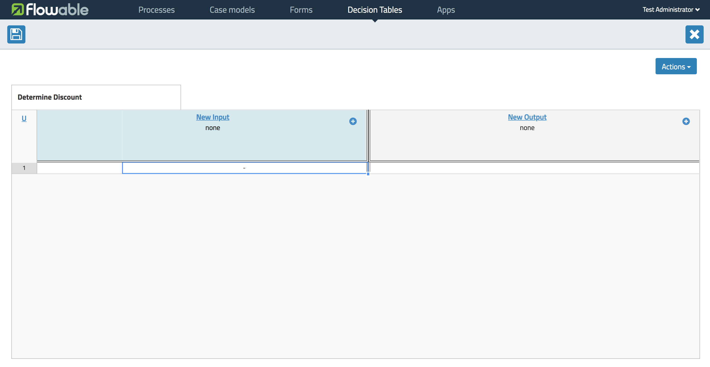
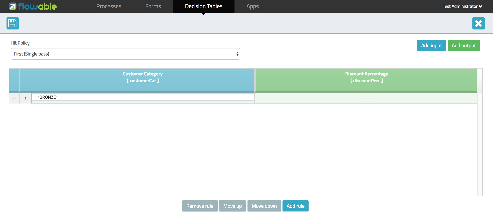
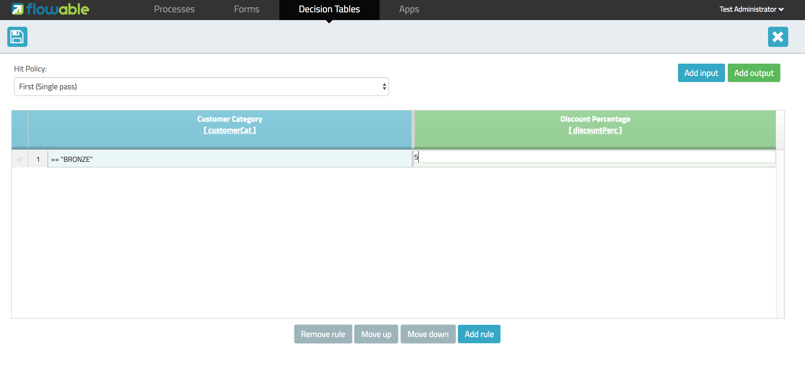
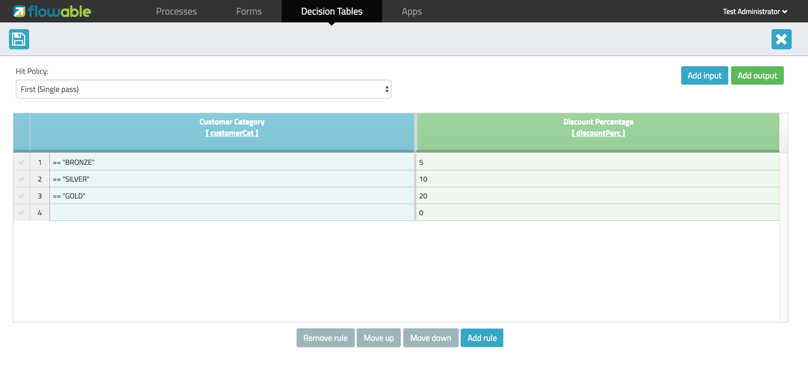

[[bpmn20]]

== DMN 1.1 Introduction

[[whatIsDmn]]

=== What is DMN?

Decision Model and Notation (DMN) is a standard published by the link:$$http://www.omg.org/spec/DMN/1.1$$[Object Management Group]. It's a standard approach for describing and modeling repeatable decisions within organizations to ensure that decision models are interchangeable across organizations.

[[dmnDefiningDecision]]

=== What is a DMN definition

The root element of the DMN 1.1 schema is a *definitions* element. Within this element multiple decision definitions can be defined (although we advise you to
have only one process definition in each file, as this simplifies maintenance later in the development process). Within each decision, one expression can be defined. There are several types of expressions. Within Flowable, currently, the expression type *decision table* is supported.

[source,xml,linenums]
----
<definitions xmlns="http://www.omg.org/spec/DMN/20151101"
  namespace="http://www.flowable.org/dmn"
  name="DetermineDiscount">

  <decision id="DET_DISC_1" name="DetermineDiscount">

    <decisionTable id="determineDiscountTable1" hitPolicy="FIRST">
      ..
    </decisionTable>

  </decision>

</definitions>
----

=== Creating a DMN definition

It's possible to create a DMN Definition with a plain text editor, but for this example we'll start by using the decision table editor included in the Flowable modeler.

We'll implement a very simple use case: determining the discount percentage based on a customer category.

Start by opening the decision tables section within the Flowable modeler.

image::images/decision_tables_1.png[align="center"]

And select *Create Decision Table*.

image::images/decision_tables_2.png[align="center"]

Provide a decision table name and a unique decision table key and select *Create new decision table*.

You're now ready to define your decision table. Let's describe what is presented within the editor.

==== Hit Policy

In the top left corner you can select a *hit policy*.

There are 7 hit policies available;

*single hit*

* **F**IRST: multiple (overlapping) rules can match, with different output entries. The first hit by rule order is returned (and evaluation can halt).

* **U**NIQUE: no overlap is possible and all rules are disjoint. Only a single rule can be matched.

* **A**NY: there may be overlap, but all of the matching rules show equal output entries for each output, so any match can be used. If the output entries are non-equal, the hit policy is incorrect and the result will be empty and marked as failed. When link:$$#strictMode$$[strict mode] is disabled the last valid rule be the result. (The violation will be present as a validation message)

* **P**RIORITY: multiple rules can match, with different output entries. This policy returns the matching rule with the highest output priority. Output priorities are specified in the ordered list of output values, in decreasing order of priority.
When link:$$#strictMode$$[strict mode] is disabled and there are no output values defined the first valid rule be the result. (The violation will be present as a validation message)

*multiple hit*

* **O**UTPUT ORDER: returns all hits in decreasing output priority order. Output priorities are specified in the ordered list of output values in decreasing order of priority.

* **R**ULE ORDER: returns all hits in rule order.

* **C**OLLECT: returns all hits in arbitrary order. An operator (‘+’, ‘<’, ‘>’, ‘#’) can be added to apply a simple function to the outputs. If no operator is present, the result is the list of all the output entries.

** + (sum): the result of the decision table is the sum of all the distinct outputs.
** < (min): the result of the decision table is the smallest value of all the outputs.
** > (max): the result of the decision table is the largest value of all the outputs.
** # (count): the result of the decision table is the number of distinct outputs.

==== Input and Output expressions

The header of the decision table itself is divided in two sections; blue and green. In the blue section are the *input expressions*; the green the *output expressions*.

image::images/decision_tables_4.png[align="center"]

Within an input expression, you can define the variable that will be used in the expression of the rule input entries (explained below). It's possible to define multiple input expressions by selecting *Add Input* (right click option menu or by clicking the plus icon).

image::images/decision_tables_5.png[align="center"]

Within an output expression, you can define what variable will be created to form the result of a decision table execution (the value of the variable will be determined by the output entry expression; explained below). It's possible to define multiple output expressions by selecting *Add Output* (right click option menu or by clicking the plus icon).

==== Rules

Each rule consists of one or more input entries and one or more output entries.
A input entry is an expression that will be evaluated against the input variable (of that 'column'). When all input entries are evaluated to be true the rule is considered true, and the output entry is evaluated.

[NOTE]
====
The DMN specification defines an expression language: (S)-FEEL. Currently, we do not supported this part of the specification. Within Flowable DMN, we use JUEL as the expression language.
====

To enter an expression, double-click on the corresponding cell. 
In this example, the expression _== BRONZE_ is entered. Combined with the variable defined in the corresponding input expression (column header), this will result at runtime in the full expression _customerCat == "BRONZE"_.

To enter an output expression, double-click the corresponding cell.
In this example the expression _5_ is entered. This is actually more like an implicit assignment. The value 5 will be assigned to the variable in the corresponding output entry (column) when all input entries of that rule are evaluated true.

We can then continue completing the decision table by adding more rules (by selecting Add Rule).

In our example, rule 4 has an empty input entry. Empty input entries will be evaluated by the engine as true. This means that if none of the other rules are valid, the outcome of rule 4 will be the output of this decision table. In this case, variable *discountPerc* will have value *0*.

image::images/decision_tables_9.png[align="center"]

The decision table can now be saved. Provide a unique Decision Table key.

=== Use in a BPMN2.0 process

The newly created decision table can be used in a BPMN2.0 process by including a *Decision task* and selecting the *Decision table reference*.

image::images/decision_tables_10.png[align="center"]

In the process above, the process has a start form that will provide the *customer category* to the process instance (and thus to the decision table).
The *Display Discount* user task displays the result of the decision table with an expression form field, using the expression; ${discountperc}.

=== DMN 1.1 XML

The full DMN 1.1 XML of the example above.

[source,xml,linenums]
----
<definitions xmlns="http://www.omg.org/spec/DMN/20151101" id="definition_78d09dd7-374c-11e8-b5d8-0242ac120005" name="Determine Discount" namespace="http://www.flowable.org/dmn">
  <decision id="DET_DISC_1" name="Determine Discount">
    <decisionTable id="decisionTable_78d09dd7-374c-11e8-b5d8-0242ac120005" hitPolicy="UNIQUE">
      <input label="Customer Category">
        <inputExpression id="inputExpression_1" typeRef="string">
          <text>customerCat</text>
        </inputExpression>
        <inputValues>
          <text>"BRONZE","SILVER","GOLD"</text>
        </inputValues>
      </input>
      <output id="outputExpression_2" label="Discount Percentage" name="discountPerc" typeRef="number">
        <outputValues>
          <text>"0","5","10","20"</text>
        </outputValues>
      </output>
      <rule>
        <inputEntry id="inputEntry_1_1">
          <text><![CDATA[== "BRONZE"]]></text>
        </inputEntry>
        <outputEntry id="outputEntry_2_1">
          <text><![CDATA[5]]></text>
        </outputEntry>
      </rule>
      <rule>
        <inputEntry id="inputEntry_1_2">
          <text><![CDATA[== "SILVER"]]></text>
        </inputEntry>
        <outputEntry id="outputEntry_2_2">
          <text><![CDATA[10]]></text>
        </outputEntry>
      </rule>
      <rule>
        <inputEntry id="inputEntry_1_3">
          <text><![CDATA[== "GOLD"]]></text>
        </inputEntry>
        <outputEntry id="outputEntry_2_3">
          <text><![CDATA[20]]></text>
        </outputEntry>
      </rule>
      <rule>
        <inputEntry id="inputEntry_1_4">
          <text><![CDATA[-]]></text>
        </inputEntry>
        <outputEntry id="outputEntry_2_4">
          <text><![CDATA[0]]></text>
        </outputEntry>
      </rule>
    </decisionTable>
  </decision>
</definitions>
----

* Important to note here, is that the decision table key used in Flowable is the decision ID in the DMN XML. *
