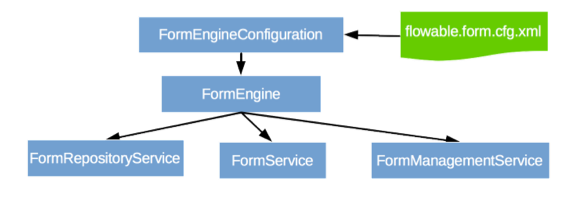

[[chapterApi]]

== The Flowable Form API

[[apiEngine]]

=== The Form Engine API and services

The Form engine API is the most common way of interacting with Flowable Form. The central starting point is the +FormEngine+, which can be created in several ways as described in the <<configuration,configuration section>>. From the FormEngine, you can obtain the various other services.
FormEngine and the services objects are thread safe, so you can keep a reference to one of those for a whole server.

[source,java,linenums]
----
FormEngine formEngine = FormEngines.getDefaultFormEngine();
FormRuleService formRuleService = formEngine.getFormRuleService();
FormRepositoryService formRepositoryService = formEngine.getFormRepositoryService();
FormService formService = formEngine.getFormService();
FormManagementService formManagementService = formEngine.getFormManagementService();
----

+FormEngines.getDefaultFormEngine()+ will initialize and build a Form engine the first time it is called and afterwards always return the same Form engine. Proper creation and closing of all Form engines can be done with +FormEngines.init()+  and +FormEngines.destroy()+.

The FormEngines class will scan for all +flowable.form.cfg.xml+ and +flowable-form-context.xml+ files. For all +flowable.form.cfg.xml+ files, the Form engine will be built in the typical Flowable way: +FormEngineConfiguration.createFormEngineConfigurationFromInputStream(inputStream).buildFormEngine()+. For all +flowable-form-context.xml+ files, the Form engine will be built in the Spring way: First the Spring application context is created and then the Form engine is obtained from that application context.

All services are stateless. This means that you can easily run Flowable Form on multiple nodes in a cluster, each going to the same database, without having to worry about which machine actually executed previous calls. Any call to any service is idempotent, regardless of where it is executed.

The *FormRepositoryService* is probably the first service needed when working with the Flowable Form engine. This service offers operations for managing and manipulating +deployments+ and +Form definitions+. A Form definition is the root concept of a Form model. (The main concepts of a form definition are explained in the <form-introduction, Form introduction section>). 
A +deployment+ is the unit of packaging within the Flowable Form engine. A deployment can contain multiple Form definition JSON files. Deploying a deployment means it is uploaded to the engine, where all Form definitions are inspected and parsed before being stored in the database. From that point on, the deployment is known to the system and any form included in the deployment can now be executed.

Furthermore, this service allows you to:

* Query deployments for Form definitions known to the engine.
* Retrieve a POJO version of the Form definition that can be used to introspect using Java rather than JSON.

The *FormService* provides methods for creating a form instance with the values that a user has filled in for a specific form definition. It can also be use to query form instances.

The *FormManagementService* is typically not needed when coding custom application using Flowable Form. It allows you to retrieve information about the engine version, database tables and table metadata.

=== Exception strategy

The base exception in Flowable is the +org.flowable.engine.FlowableException+, an unchecked exception. This exception can be thrown at all times by the API, but 'expected' exceptions that happen in specific methods are documented in the link:$$http://www.flowable.org/docs/javadocs/index.html$$[ the javadocs]. For example, an extract from ++FormRuleService++:

Even though we want to avoid a big exception hierarchy, the following subclasses are thrown in specific cases. All other errors that occur during process-execution or API-invocation that don't fit into the possible exceptions below, are thrown as regular ++FlowableExceptions++s.

* ++FlowableOptimisticLockingException++: Thrown when an optimistic lock occurs in the data store caused by concurrent access of the same data entry.
* ++FlowableClassLoadingException++: Thrown when a class requested to load was not found or when an error occurred while loading it.
* ++FlowableObjectNotFoundException++: Thrown when an object that is requested or acted on does not exist.
* ++FlowableIllegalArgumentException++: An exception indicating that an illegal argument has been supplied in a Flowable Form API-call, an illegal value was configured in the engine's configuration or an illegal value has been supplied.

[[queryAPI]]

=== Query API

There are two ways of querying data from the engine: The query API and native queries. The Query API allows you to program completely typesafe queries with a fluent API. You can add various conditions to your queries (all of which are applied together as a logical AND) and precisely one ordering. The following code shows an example:

[source,java,linenums]
----
List<FormDeployment> formDeployments = formRepositoryService.createDeploymentQuery()
    .deploymentNameLike("deployment%")
    .orderByDeployTime()
    .list();
----

Sometimes you need more powerful queries, for example, queries using an OR operator or restrictions you cannot express using the Query API. For these cases, we introduced native queries, which allow you to write your own SQL queries. The return type is defined by the Query object you use and the data is mapped into the correct objects, such as Deployment, FormInstance, and so on. As the query will be fired at the database, you have to use table and column names as they are defined in the database; this requires some knowledge about the internal data structure and it is recommended that native queries are used with care. The table names can be retrieved through the API to keep the dependency as small as possible.

[source,java,linenums]
----

long count = formRepositoryService.createNativeDeploymentQuery()
    .sql("SELECT count(*) FROM " + formManagementService.getTableName(FormDeploymentEntity.class) + " D1, "
        + formManagementService.getTableName(FormDefinitionEntity.class) + " D2 "
        + "WHERE D1.ID_ = D2.DEPLOYMENT_ID_ "
        + "AND D1.ID_ = #{deploymentId}")
    .parameter("deploymentId", deployment.getId())
    .count();
----

[[apiUnitTesting]]

=== Unit testing

As Flowable Form is an embeddable Java engine, writing unit tests for Form definitions is as simple as writing regular unit tests.

Flowable supports JUnit version 4 styles of unit testing. When writing JUnit 4 unit tests, the +org.flowable.form.engine.test.FlowableFormRule+ Rule can be used. Through this rule, the Form engine and services are available through getters. Including this +Rule+ will enable the use of the +org.flowable.form.engine.test.FormDeploymentAnnotation+ annotation (see above for an explanation of its use and configuration) and it will look for the default configuration file on the classpath. Form engines are statically cached over multiple unit tests when using the same configuration resource.
It's also possible to provide a custom engine configuration to the rule.

The following code snippet shows an example of using the JUnit 4 style of testing and the usage of the +FlowableFormRule+ (and passing an optional custom configuration)

[source,java,linenums]
----
public class MyFormDefinitionTest {

  @Rule
  public FlowableFormRule flowableFormRule = new FlowableFormRule("custom1.flowable.form.cfg.xml");

  @Test
  @FormDeploymentAnnotation
  public void formUsageExample() {
    FormEngine formEngine = flowableFormRule.getFormEngine();
    FormService formService = dmnEngine.getFormService();

    FormInstance result = formService.getFormInstanceModelById(
        "f7689f79-f1cc-11e6-8549-acde48001122", null);

    Assert.assertNotNull(result));
  }
}
----

[[apiFormEngineInWebApp]]

=== The Form engine in a web application

The +FormEngine+ is a thread-safe class and can easily be shared among multiple threads. In a web application, this means it is possible to create the Form engine once when the container boots, and shut down the engine when the container goes down.

The following code snippet shows how you can write a simple +ServletContextListener+ to initialize and destroy form engines in a plain Servlet environment:

[source,java,linenums]
----
public class FormEnginesServletContextListener implements ServletContextListener {

  public void contextInitialized(ServletContextEvent servletContextEvent) {
    FormEngines.init();
  }

  public void contextDestroyed(ServletContextEvent servletContextEvent) {
    FormEngines.destroy();
  }

}
----

The +contextInitialized+ method will delegate to +FormEngines.init()+. This will look for +flowable.form.cfg.xml+ resource files on the classpath, and create a +FormEngine+ for the given configurations (for example, multiple JARs with a configuration file). If you have multiple such resource files on the classpath, make sure they all have different names. When the Form engine is needed, it can be fetched using:

[source,java,linenums]
----
FormEngines.getDefaultFormEngine()
----

or

[source,java,linenums]
----
FormEngines.getFormEngine("myName");
----

Of course, it's also possible to use any of the variants of creating a Form engine,
as described in the <<configuration,configuration section>>.

The +contextDestroyed+ method of the context-listener delegates to +FormEngines.destroy()+. This will properly close all initialized Form engines.
