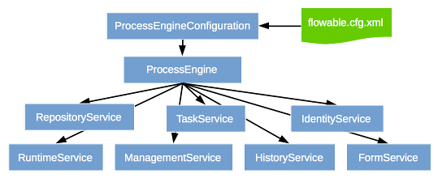
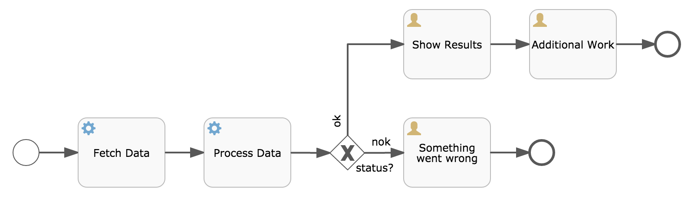
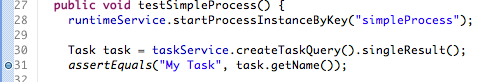
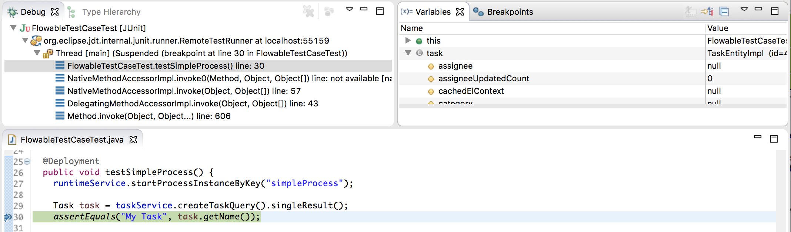
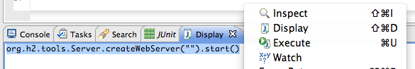
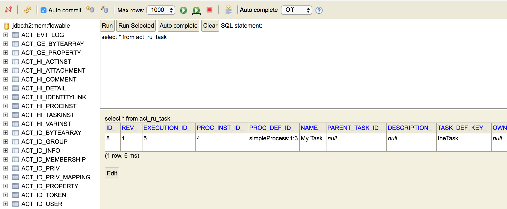

[[chapterApi]]

== Flowable API

[[apiEngine]]

=== 流程引擎API与服务

引擎API是与Flowable交互的最常用手段。总入口点是++ProcessEngine++。像<<configuration, 配置>>章节中介绍的一样，ProcessEngine可以使用多种方式创建。使用ProcessEngine，可以获得各种提供工作流/BPM方法的服务。ProcessEngine与服务对象都是线程安全的，因此可以在服务器中保存并共用同一个引用。

[source,java,linenums]
----
ProcessEngine processEngine = ProcessEngines.getDefaultProcessEngine();

RuntimeService runtimeService = processEngine.getRuntimeService();
RepositoryService repositoryService = processEngine.getRepositoryService();
TaskService taskService = processEngine.getTaskService();
ManagementService managementService = processEngine.getManagementService();
IdentityService identityService = processEngine.getIdentityService();
HistoryService historyService = processEngine.getHistoryService();
FormService formService = processEngine.getFormService();
DynamicBpmnService dynamicBpmnService = processEngine.getDynamicBpmnService();
----

在++ProcessEngines.getDefaultProcessEngine()++第一次被调用时，将初始化并构建流程引擎，之后的重复调用都会返回同一个流程引擎。可以通过++ProcessEngines.init()++创建流程引擎，并由++ProcessEngines.destroy()++关闭流程引擎。

ProcessEngines会扫描++flowable.cfg.xml++与++flowable-context.xml++文件。对于++flowable.cfg.xml++文件，流程引擎会以标准Flowable方式构建引擎：++ProcessEngineConfiguration.createProcessEngineConfigurationFromInputStream(inputStream).buildProcessEngine()++。对于++flowable-context.xml++文件，流程引擎会以Spring的方式构建：首先构建Spring应用上下文，然后从该上下文中获取流程引擎。

所有的服务都是无状态的。这意味着你可以很容易的在集群环境的多个节点上运行Flowable，使用同一个数据库，而不用担心上一次调用实际在哪台机器上执行。不论在哪个节点执行，对任何服务的任何调用都是幂等（idempotent）的。

**RepositoryService**很可能是使用Flowable引擎要用的第一个服务。这个服务提供了管理与控制++部署(deployments)++与++流程定义(process definitions)++的操作。在这里简单说明一下，流程定义是BPMN 2.0流程对应的Java对象，体现流程中每一步的结构与行为。++部署++是Flowable引擎中的包装单元，一个部署中可以包含多个BPMN 2.0 XML文件及其他资源。开发者可以决定在一个部署中包含的内容，可以是单个流程的BPMN 2.0 XML文件，也可以包含多个流程及其相关资源（如'hr-processes'部署可以包含所有与人力资源流程相关的的东西）。++RepositoryService++可用于++部署++这样的包。部署意味着将它上传至引擎，引擎将在储存至数据库之前检查与分析所有的流程。在部署操作后，可以在系统中使用这个部署包，部署包中的所有流程都可以启动。

此外，这个服务还可以：

* 查询引擎现有的部署与流程定义。
* 暂停或激活部署中的某些流程，或整个部署。暂停意味着不能再对它进行操作，激活刚好相反，重新使它可以操作。
* 获取各种资源，比如部署中保存的文件，或者引擎自动生成的流程图。
* 获取POJO版本的流程定义。它可以用Java而不是XML的方式查看流程。

与提供静态信息（也就是不会改变，至少不会经常改变的信息）的++RepositoryService++相反，**RuntimeService**用于启动流程定义的新流程实例。前面介绍过，++流程定义++中定义了流程中不同步骤的结构与行为。流程实例则是流程定义的实际执行过程。同一时刻，一个流程定义通常有多个运行中的实例。++RuntimeService++也用于读取与存储++流程变量++。流程变量是流程实例中的数据，可以在流程的许多地方使用（例如排他网关经常使用流程变量判断流程下一步要走的路径）。++RuntimeService++还可以用于查询流程实例与执行(Execution)。执行也就是BPMN 2.0中 +$$'token'$$+ 的概念。通常执行是指向流程实例当前位置的指针。最后，还可以在流程实例等待外部触发时使用++RuntimeService++，使流程可以继续运行。流程有许多++等待状态(wait states)++，++RuntimeService++服务提供了许多操作用于“通知”流程实例：已经接收到外部触发，流程实例可以继续运行。

对于像Flowable这样的BPM引擎来说，核心是需要人类用户操作的任务。所有任务相关的东西都组织在**TaskService**中，例如：

* 查询分派给用户或组的任务
* 创建__独立运行(standalone)__任务。这是一种没有关联到流程实例的任务。
* 决定任务的执行用户(assignee)，或者将用户通过某种方式与任务关联。
* 认领(claim)与完成(complete)任务。认领是指某人决定成为任务的执行用户，也即他将会完成这个任务。完成任务是指“做这个任务要求的工作”，通常是填写某个表单。

**IdentityService**很简单。它用于管理（创建，更新，删除，查询……）组与用户。请注意，Flowable实际上在运行时并不做任何用户检查。例如任务可以分派给任何用户，而引擎并不会验证系统中是否存在该用户。这是因为Flowable有时要与LDAP、Active Directory等服务结合使用。

**FormService**是可选服务。也就是说Flowable没有它也能很好地运行，而不必牺牲任何功能。这个服务引入了__开始表单(start form)__与__任务表单(task form)__的概念。 __开始表单__是在流程实例启动前显示的表单，而__任务表单__是用户完成任务时显示的表单。Flowable可以在BPMN 2.0流程定义中定义这些表单。表单服务通过简单的方式暴露这些数据。再次重申，表单不一定要嵌入流程定义，因此这个服务是可选的。

**HistoryService**暴露Flowable引擎收集的所有历史数据。当执行流程时，引擎会保存许多数据（可配置），例如流程实例启动时间、谁在执行哪个任务、完成任务花费的事件、每个流程实例的执行路径，等等。这个服务主要提供查询这些数据的能力。

**ManagementService**通常在用Flowable编写用户应用时不需要使用。它可以读取数据库表与表原始数据的信息，也提供了对作业(job)的查询与管理操作。Flowable中很多地方都使用作业，例如定时器(timer)，异步操作(asynchronous continuation)，延时暂停/激活(delayed suspension/activation)等等。后续会详细介绍这些内容。

**DynamicBpmnService**可用于修改流程定义中的部分内容，而不需要重新部署它。例如可以修改流程定义中一个用户任务的办理人设置，或者修改一个服务任务中的类名。

参考link:$$http://www.flowable.org/docs/javadocs/index.html$$[javadocs]了解服务操作与引擎API的更多信息。

[[_exception_strategy]]
=== 异常策略

Flowable的异常基类是++org.flowable.engine.FlowableException++，这是一个非受检异常(unchecked exception)。在任何API操作时都可能会抛出这个异常，link:$$http://www.flowable.org/docs/javadocs/index.html$$[javadoc]提供了每个方法可能抛出的异常。例如，从++TaskService++中摘录：

[source,java,linenums]
----
/**
 * 当任务成功执行时调用。
 * @param taskId 需要完成的任务id，不能为null。
 * @throws FlowableObjectNotFoundException 若给定id找不到任务。
 */
 void complete(String taskId);
----

在上例中，如果所用的id找不到任务，就会抛出异常。并且，由于javadoc中**明确要求taskId不能为null，因此如果传递了++null++值，会抛出++FlowableIllegalArgumentException++异常**。

尽管我们想避免过大的异常层次结构，但在特定情况下仍然会抛出下述异常子类。所有流程执行与API调用中发生的错误，如果不符合下面列出的异常，会统一抛出++FlowableExceptions++。

* ++FlowableWrongDbException++: 当Flowable引擎检测到数据库表结构版本与引擎版本不匹配时抛出。
* ++FlowableOptimisticLockingException++: 当对同一数据实体的并发访问导致数据存储发生乐观锁异常时抛出。
* ++FlowableClassLoadingException++: 当需要载入的类（如JavaDelegate, TaskListener, ...）无法找到，或载入发生错误时抛出。
* ++FlowableObjectNotFoundException++: 当请求或要操作的对象不存在时抛出。
* ++FlowableIllegalArgumentException++: 当调用Flowable API时使用了不合法的参数时抛出。可能是引擎配置中的不合法值，或者是API调用传递的不合法参数，也可能是流程定义中的不合法值。
* ++FlowableTaskAlreadyClaimedException++: 当对已被认领的任务调用++taskService.claim(...)++时抛出。

[[queryAPI]]

=== 查询API

从引擎中查询数据有两种方式：查询API与原生(native)查询。查询API可以使用链式API，通过编程方式进行类型安全的查询。你可以在查询中增加各种条件（所有条件都用做AND逻辑），也可以明确指定排序方式。下面是示例代码：

[source,java,linenums]
----
List<Task> tasks = taskService.createTaskQuery()
    .taskAssignee("kermit")
    .processVariableValueEquals("orderId", "0815")
    .orderByDueDate().asc()
    .list();
----

有时需要更复杂的查询，例如使用OR操作符查询，或者使用查询API不能满足查询条件要求。我们为这种需求提供了可以自己写SQL查询的原生查询。返回类型由使用的查询对象决定，数据会映射到正确的对象中（Task、ProcessInstance、Execution，等等）。查询在数据库中进行，因此需要使用数据库中定义的表名与列名。这需要了解内部数据结构，因此建议小心使用原生查询。数据库表名可以通过API读取，这样可以将依赖关系减到最小。

[source,java,linenums]
----
List<Task> tasks = taskService.createNativeTaskQuery()
  .sql("SELECT count(*) FROM " + managementService.getTableName(Task.class) +
      " T WHERE T.NAME_ = #{taskName}")
  .parameter("taskName", "gonzoTask")
  .list();

long count = taskService.createNativeTaskQuery()
  .sql("SELECT count(*) FROM " + managementService.getTableName(Task.class) + " T1, " +
      managementService.getTableName(VariableInstanceEntity.class) + " V1 WHERE V1.TASK_ID_ = T1.ID_")
  .count();
----

[[apiVariables]]

=== 变量

流程实例按步骤执行时，需要使用一些数据。在Flowable中，这些数据称作__变量(variable)__，并会存储在数据库中。变量可以用在表达式中（例如在排他网关中用于选择正确的出口路径），也可以在Java服务任务(service task)中用于调用外部服务（例如为服务调用提供输入或结果存储），等等。

流程实例可以持有变量（称作__流程变量 process variables__）；用户任务以及__执行(executions)__——流程当前活动节点的指针——也可以持有变量。流程实例可以持有任意数量的变量，每个变量存储为__ACT_RU_VARIABLE__数据库表的一行。

所有的__startProcessInstanceXXX__方法都有一个可选参数，用于在流程实例创建及启动时设置变量。例如，在__RuntimeService__中：

[source,java,linenums]
----
ProcessInstance startProcessInstanceByKey(String processDefinitionKey, Map<String, Object> variables);
----

也可以在流程执行中加入变量。例如，(_RuntimeService_):

[source,java,linenums]
----
void setVariable(String executionId, String variableName, Object value);
void setVariableLocal(String executionId, String variableName, Object value);
void setVariables(String executionId, Map<String, ? extends Object> variables);
void setVariablesLocal(String executionId, Map<String, ? extends Object> variables);
----

请注意可以为给定执行（请记住，流程实例由一颗执行的树(tree of executions)组成）设置__局部(local)__变量。局部变量将只在该执行中可见，对执行树的上层则不可见。这可以用于 数据不应该暴露给流程实例的其他执行，或者变量在流程实例的不同路径中有不同的值（例如使用并行路径时）的情况。

可以用下列方法读取变量。请注意__TaskService__中有类似的方法。这意味着任务与执行一样，可以持有局部变量，其生存期为任务持续的时间。

[source,java,linenums]
----
Map<String, Object> getVariables(String executionId);
Map<String, Object> getVariablesLocal(String executionId);
Map<String, Object> getVariables(String executionId, Collection<String> variableNames);
Map<String, Object> getVariablesLocal(String executionId, Collection<String> variableNames);
Object getVariable(String executionId, String variableName);
<T> T getVariable(String executionId, String variableName, Class<T> variableClass);
----

变量通常用于<<bpmnJavaServiceTask, Java代理（Java delegates）>>、<<apiExpressions, 表达式（expressions）>>、执行（execution）、任务监听器（tasklisteners）、脚本（scripts）等等。在这些结构中，提供了当前的__execution__或__task__对象，可用于变量的设置、读取。简单示例如下：

[source,java,linenums]
----
execution.getVariables();
execution.getVariables(Collection<String> variableNames);
execution.getVariable(String variableName);

execution.setVariables(Map<String, object> variables);
execution.setVariable(String variableName, Object value);
----

请注意也可以使用上例中方法的__局部变量__版本。

由于历史（与向后兼容）原因，当调用上述任何方法时，引擎会从数据库中取出**所有**变量。也就是说，如果你有10个变量，使用__getVariable("myVariable")__获取其中的一个，实际上其他9个变量也会从数据库取出并缓存。这并不坏，因为后续的调用可以不必再读取数据库。比如，如果流程定义包含三个连续的服务任务（因此它们在同一个数据库事务里），在第一个服务任务里通过一次调用获取全部变量，也许比在每个服务任务里分别获取需要的变量要好。请注意对读取与设置变量**都是这样**。

当然，如果使用大量变量，或者你希望精细控制数据库查询与流量，上述的做法就不合适了。我们引入了可以更精细控制的方法。这个方法有一个可选的参数，告诉引擎是否需要读取并缓存所有变量：

[source,java,linenums]
----
Map<String, Object> getVariables(Collection<String> variableNames, boolean fetchAllVariables);
Object getVariable(String variableName, boolean fetchAllVariables);
void setVariable(String variableName, Object value, boolean fetchAllVariables);
----

当__fetchAllVariables__参数为__true__时，行为与上面描述的完全一样：读取或设置一个变量时，所有的变量都将被读取并缓存。

而当参数值为__false__时，会使用明确的查询，其他变量不会被读取或缓存。只有指定的变量的值会被缓存并用于后续使用。

[[apiTransientVariables]]

=== 瞬时变量

瞬时变量(Transient variable)类似普通变量，只是不会被持久化。通常来说，瞬时变量用于高级使用场景。如果不明确，还是使用普通流程变量为好。

瞬时变量具有下列特性：

* 瞬时变量完全不存储历史。
* 与__普通__变量类似，设置瞬时变量时会存入__最上层父__中。这意味着在一个执行中设置一个变量时，瞬时变量实际上会存储在流程实例执行中。与普通变量类似，可以使用__局部(local)__的对应方法，将变量设置为某个执行或任务的局部变量。
* 瞬时变量只能在下一个“等待状态”之前访问。之后该变量即消失。等待状态意味着流程实例会持久化至数据存储中。请注意在这个定义中，__异步__活动也是“等待状态”！
* 只能使用__setTransientVariable(name, value)__设置瞬时变量，但是调用__getVariable(name)__也会返回瞬时变量（也有__getTransientVariable(name)__方法，它只会返回瞬时变量）。这是为了简化表达式的撰写，并保证已有逻辑可以使用这两种类型的变量。
* 瞬时变量__屏蔽(shadow)__同名的持久化变量。也就是说当一个流程实例中设置了同名的持久化变量与瞬时变量时，__getVariable("someVariable")__会返回瞬时变量的值。

在大多数可以使用普通变量的地方，都可以获取、设置瞬时变量：

* 在__JavaDelegate__实现中的__DelegateExecution__内
* 在__ExecutionListener__实现中的__DelegateExecution__内，以及在__TaskListener__实现中的__DelegateTask__内
* 通过__execution__对象在脚本任务内
* 通过RuntimeService启动流程实例时
* 完成任务时
* 调用__runtimeService.trigger__方法时

瞬时变量相关的方法遵循普通流程变量方法的命名约定：

[source,java,linenums]
----
void setTransientVariable(String variableName, Object variableValue);
void setTransientVariableLocal(String variableName, Object variableValue);
void setTransientVariables(Map<String, Object> transientVariables);
void setTransientVariablesLocal(Map<String, Object> transientVariables);

Object getTransientVariable(String variableName);
Object getTransientVariableLocal(String variableName);

Map<String, Object> getTransientVariables();
Map<String, Object> getTransientVariablesLocal();

void removeTransientVariable(String variableName);
void removeTransientVariableLocal(String variableName);
----

下面的BPMN流程图展示了一个典型例子：

假设'Fetch Data(获取数据)'服务任务调用某个远程服务（例如使用REST）。也假设需要其需要一些配置参数，并需要在启动流程实例时提供。同时，这些配置参数对于历史审计并不重要，因此我们将它们作为瞬时变量传递：

[source,java,linenums]
----
ProcessInstance processInstance = runtimeService.createProcessInstanceBuilder()
       .processDefinitionKey("someKey")
       .transientVariable("configParam01", "A")
       .transientVariable("configParam02", "B")
       .transientVariable("configParam03", "C")
       .start();
----

请注意在到达用户任务并持久化之前，都可以使用这些瞬时变量。例如，在'Additional Work(额外工作)'用户任务中它们就不再可用。也请注意如果'Fetch Data'是异步的，则瞬时变量在该步骤之后也不再可用。

'Fetch Data'（的简化版本）可以像是：

[source,java,linenums]
----
public static class FetchDataServiceTask implements JavaDelegate {
  public void execute(DelegateExecution execution) {
    String configParam01 = (String) execution.getVariable(configParam01);
    // ...

    RestResponse restResponse = executeRestCall();
    execution.setTransientVariable("response", restResponse.getBody());
    execution.setTransientVariable("status", restResponse.getStatus());
  }
}
----

'Process Data（处理数据）'可以获取response瞬时变量，解析并将其相关数据存储在实际流程变量中，因为之后还需要使用它们。

离开排他网关的顺序流上的条件表达式，不关注使用的是持久化还是瞬时变量（在这个例子中__status__是瞬时变量）：

[source,xml,linenums]
----
<conditionExpression xsi:type="tFormalExpression">${status == 200}</conditionExpression>
----

[[apiExpressions]]

=== 表达式

Flowable使用UEL进行表达式解析。UEL代表__Unified Expression Language__，是EE6规范的一部分（查看link:$$http://docs.oracle.com/javaee/6/tutorial/doc/gjddd.html$$[EE6规范]了解更多信息）。

表达式可以用于<<bpmnJavaServiceTaskXML,Java服务任务(Java Service task)>>、<<executionListeners, 执行监听器(Execution Listener)>>、<<taskListeners, 任务监听器(Task Listener)>> 与 <<conditionalSequenceFlowXml, 条件顺序流(Conditional sequence flow)>>等。尽管有值表达式与方法表达式这两种不同的表达式，Flowable通过抽象，使它们都可以在需要++表达式++的地方使用。

* **值表达式 Value expression**: 解析为一个值。默认情况下，所有流程变量都可以使用。（若使用Spring）所有的Spring bean也可以用在表达式里。例如：

----
${myVar}
${myBean.myProperty}
----

* **方法表达式 Method expression**: 调用一个方法，可以带或不带参数。**当调用不带参数的方法时，要确保在方法名后添加空括号（以避免与值表达式混淆）。**传递的参数可以是字面值(literal value)，也可以是表达式，它们会被自动解析。例如：

----
${printer.print()}
${myBean.addNewOrder('orderName')}
${myBean.doSomething(myVar, execution)}
----

请注意，表达式支持解析（及比较）原始类型(primitive)、bean、list、array与map。
Note that these expressions support resolving primitives (including comparing them), beans, lists, arrays and maps.

除了所有流程变量外，还有一些默认对象可在表达式中使用：

* ++execution++: +DelegateExecution++，持有正在运行的执行的额外信息。
* ++task++: ++DelegateTask++持有当前任务的额外信息。**请注意：只在任务监听器的表达式中可用。**
* ++authenticatedUserId++: 当前已验证的用户id。如果没有已验证的用户，该变量不可用。

更多实际使用例子，请查看<<springExpressions,Spring中的表达式>>、<<bpmnJavaServiceTaskXML,Java服务任务>>、<<executionListeners,执行监听器>>、<<taskListeners,任务监听器>>或者<<conditionalSequenceFlowXml,条件顺序流>>等章节。

[[apiUnitTesting]]

=== 单元测试

业务流程是软件项目的必要组成部分，也需要使用测试一般应用逻辑的方法——单元测试——测试它们。Flowable是嵌入式的Java引擎，因此为业务流程编写单元测试就同编写一般的单元测试一样简单。

Flowable支持JUnit 3及4的单元测试风格。按照JUnit 3的风格，必须扩展(extended)++org.flowable.engine.test.FlowableTestCase++。它通过保护(protected)成员变量提供对ProcessEngine与服务的访问。在测试的++setup()++中，processEngine会默认使用classpath中的++flowable.cfg.xml++资源初始化。如果要指定不同的配置文件，请覆盖__getConfigurationResource()__方法。当使用相同的配置资源时，流程引擎会静态缓存，用于多个单元测试。

通过扩展++FlowableTestCase++，可以使用++org.flowable.engine.test.Deployment++注解测试方法。在测试运行前，会部署与测试类在同一个包下的格式为++testClassName.testMethod.bpmn20.xml++的资源文件。在测试结束时，会删除这个部署，包括所有相关的流程实例、任务，等等。也可以使用++Deployment++注解显式指定资源位置。查看该类以获得更多信息。

综上所述，JUnit 3风格的测试看起来类似：

[source,java,linenums]
----
public class MyBusinessProcessTest extends FlowableTestCase {

  @Deployment
  public void testSimpleProcess() {
    runtimeService.startProcessInstanceByKey("simpleProcess");

    Task task = taskService.createTaskQuery().singleResult();
    assertEquals("My Task", task.getName());

    taskService.complete(task.getId());
    assertEquals(0, runtimeService.createProcessInstanceQuery().count());
  }
}
----

要使用JUnit 4的风格书写单元测试并达成同样的功能，必须使用++org.flowable.engine.test.FlowableRule++ Rule。这样能够通过它的getter获得流程引擎与服务。对于++FlowableTestCase++（上例），包含++@Rule++就可以使用++org.flowable.engine.test.Deployment++注解（参见上例解释其用途及配置），并且会自动在classpath中寻找默认配置文件。当使用相同的配置资源时，流程引擎会静态缓存，以用于多个单元测试。

下面的代码片段展示了JUnit 4风格的测试与++FlowableRule++的用法。

[source,java,linenums]
----
public class MyBusinessProcessTest {

  @Rule
  public FlowableRule flowableRule = new FlowableRule();

  @Test
  @Deployment
  public void ruleUsageExample() {
    RuntimeService runtimeService = flowableRule.getRuntimeService();
    runtimeService.startProcessInstanceByKey("ruleUsage");

    TaskService taskService = flowableRule.getTaskService();
    Task task = taskService.createTaskQuery().singleResult();
    assertEquals("My Task", task.getName());

    taskService.complete(task.getId());
    assertEquals(0, runtimeService.createProcessInstanceQuery().count());
  }
}
----

[[apiDebuggingUnitTest]]

=== 调试单元测试

当使用H2内存数据库进行单元测试时，下面的方法可以让你在调试过程中方便地检查Flowable数据库中的数据。截图来自Eclipse，但其他IDE方式相似。

假设我们的单元测试的某处放置了__断点(breakpoint)__（在Eclipse里可以通过在代码左侧条上双击实现）：

如果我们在__debug__模式（在测试类中右键，选择“Run as”，然后选择“JUnit test”）下运行单元测试，测试进程会在断点处暂停，这样我们就可以在右上窗口中查看测试中的变量。

要检查Flowable的数据，打开__Display__窗口（如果没有找到这个窗口，打开 Window->Show View->Other，然后选择__Display__），并键入（可以使用代码补全）++org.h2.tools.Server.createWebServer("-web").start()++

image::images/api.test.debug.start.h2.server.png[align="center"]

选中刚键入的行并右键点击。然后选择'Display'（或者用快捷键执行）

现在打开浏览器并访问link:$$http://localhost:8082$$[http://localhost:8082]，填入内存数据库的JDBC URL（默认为++jdbc:h2:mem:flowable++），然后点击connect按钮。

image::images/api.test.debug.h2.login.png[align="center"]

这样就可以看到Flowable的数据。便于理解单元测试执行流程的方式。

[[apiProcessEngineInWebApp]]

=== Web应用中的流程引擎

++ProcessEngine++是线程安全的类，可以很容易地在多个线程间共享。在web应用中，这意味着可以在容器启动时创建引擎，并在容器关闭时关闭引擎。

下面的代码片段展示了如何在Servlet环境中，通过++ServletContextListener++初始化与销毁流程引擎。

[source,java,linenums]
----
public class ProcessEnginesServletContextListener implements ServletContextListener {

  public void contextInitialized(ServletContextEvent servletContextEvent) {
    ProcessEngines.init();
  }

  public void contextDestroyed(ServletContextEvent servletContextEvent) {
    ProcessEngines.destroy();
  }

}
----

++contextInitialized++方法会调用++ProcessEngines.init()++。它会在classpath中查找++flowable.cfg.xml++资源文件，并为每个文件分别创建++ProcessEngine++（如果多个JAR都包含配置文件）。如果在classpath中有多个这样的资源文件，请确保它们使用不同的引擎名。需要使用流程引擎时，可以这样获取：

[source,java,linenums]
----
ProcessEngines.getDefaultProcessEngine()
----

或者

[source,java,linenums]
----
ProcessEngines.getProcessEngine("myName");
----

当然，就像<<configuration, 配置>>章节中介绍的，还可以使用各种不同的方式创建流程引擎。

context-listener的++contextDestroyed++方法会调用++ProcessEngines.destroy()++。它会妥善关闭所有已初始化的流程引擎。
