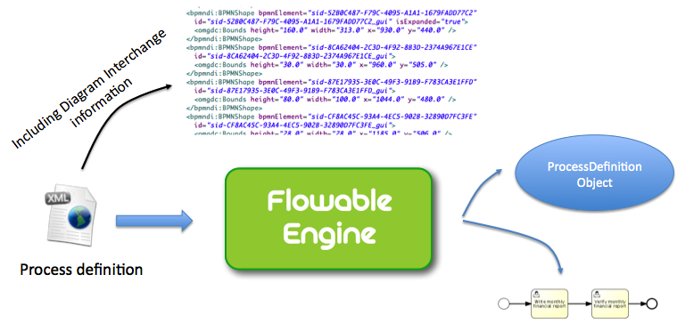

[[chDeployment]]

== 部署

[[_business_archives]]
=== 业务存档

要部署流程，需要将它们包装在业务存档(BAR, Business archive)里。业务存档是Flowable引擎的部署单元，也就是一个ZIP文件。可以包含BPMN 2.0流程、表单定义、DMN规则，与其他类型的文件。总的来说，业务存档包含一组具名资源。

当部署业务存档时，会扫描具有++.bpmn20.xml++或++.bpmn++扩展名的BPMN文件。每一个这种文件都会被处理，并可以包含多个流程定义。
当启用DMN引擎时，也会解析++.dmn++。当启用表单引擎时，会处理++.form++文件。

[NOTE]
====
业务存档中的Java类**不会添加至classpath**。业务存档中，所有流程定义使用的自定义类（例如Java服务任务或者事件监听器），都需要放在运行流程的flowable引擎的classpath内。
====

[[_deploying_programmatically]]
==== 编程方式部署

从ZIP文件部署业务存档，可以这样做：

[source,java,linenums]
----
String barFileName = "path/to/process-one.bar";
ZipInputStream inputStream = new ZipInputStream(new FileInputStream(barFileName));

repositoryService.createDeployment()
    .name("process-one.bar")
    .addZipInputStream(inputStream)
    .deploy();

----

也可以为单个资源构建部署。查看javadoc以获取更多信息。

[[_external_resources]]
=== 外部资源

流程定义保存在Flowable数据库中。这些流程定义在使用服务任务、执行监听器，或执行Flowable配置文件中定义的Spring bean时，可以引用委托类。这些类及Spring配置文件都需要在可能运行这个流程定义的流程引擎中可用。

[[_java_classes]]
==== Java类

在流程启动时，引擎的classpath中需要有所有流程中用到的自定义类（例如服务任务、事件监听器、任务监听器等中用到的JavaDelegate）。

但是在部署业务存档时，classpath中可以没有这些类。这意味着，比如使用Ant部署新业务存档时，代理类不必提前放在classpath中。

当使用演示配置且希望添加自定义类时，需要在flowable-task或flowable-rest的webapp lib中，添加包含有你的自定义类的JAR。别忘了也要添加你的自定义类的依赖（若有）。或者，也可以将你的依赖添加到Tomcat的库文件夹++${tomcat.home}/lib++中。

[[_using_spring_beans_from_a_process]]
==== 在流程中使用Spring bean

在表达式或脚本中使用Spring bean时，执行该流程定义的引擎需要可以使用这些bean。可以简单直接地自行构建web应用，并按照<<springintegration,集成Spring>>章节的介绍在上下文中配置流程引擎。但也请牢记在心，如果使用Flowable task和rest web应用，就需要更新它的上下文配置。

[[_creating_a_single_app]]
==== 创建单独应用

如果不想费心在所有流程引擎的classpath中都包含所有需要的代理类，及保证它们都使用了正确的Spring配置，也可以考虑将Flowable rest web应用嵌入你自己的web应用。也就是说只使用一个单独的++ProcessEngine++。

[[versioningOfProcessDefinitions]]

=== 流程定义的版本

BPMN并没有版本的概念。这其实很好，因为可执行的BPMN流程文件很可能已经作为开发项目的一部分，保存在版本管理系统仓库中了（例如Subversion，Git，或者Mercurial）。但是，作为部署过程的一部分，引擎会创建流程定义的版本。在部署时，Flowable会在保存至Flowable数据库前，为++ProcessDefinition++指定版本。

对于业务存档中的每个流程定义，为了初始化++key++、++version++、++name++与++id++参数，会执行下列步骤：

* XML文件中的流程定义++id++属性用作流程定义的++key++参数。
* XML文件中的流程定义++name++属性用作流程定义的++name++参数。如果未给定++name++属性，会使用id作为name。
* 当每个key的流程第一次部署时，指定版本为1。对其后所有使用相同key的流程定义，部署时版本会在该key当前已部署的最高版本号基础上加1。key参数用于区分流程定义。
* id参数设置为{processDefinitionKey}:{processDefinitionVersion}:{generated-id}，其中++generated-id++是一个唯一数字，用以保证在集群环境下，流程定义缓存中，流程id的唯一性。

以下面的流程为例

[source,xml,linenums]
----
<definitions id="myDefinitions" >
  <process id="myProcess" name="My important process" >
    ...
----

当部署这个流程定义时，数据库中的流程定义会是这个样子：

[options="header"]
|===============
|id|key|name|version
|myProcess:1:676|myProcess|My important process|1

|===============

如果我们现在部署同一个流程的更新版本（例如修改部分用户任务），且保持流程定义的++id++不变，那么流程定义表中会包含下面的记录：

[options="header"]
|===============
|id|key|name|version
|myProcess:1:676|myProcess|My important process|1
|myProcess:2:870|myProcess|My important process|2

|===============

当调用++runtimeService.startProcessInstanceByKey("myProcess")++时，会使用版本++2++的流程定义，因为这是这个流程定义的最新版本。

如果再创建第二个流程，如下定义并部署至Flowable，表中会增加第三行。

[source,xml,linenums]
----
<definitions id="myNewDefinitions" >
  <process id="myNewProcess" name="My important process" >
    ...
----

表数据类似：

[options="header"]
|===============
|id|key|name|version
|myProcess:1:676|myProcess|My important process|1
|myProcess:2:870|myProcess|My important process|2
|myNewProcess:1:1033|myNewProcess|My important process|1

|===============

请注意新流程的key与第一个流程的key不同。即使name是相同的（我们也可以修改它），Flowable也只用++id++属性来区分流程。因此新的流程部署时版本为1.

[[providingProcessDiagram]]

=== 提供流程图

可以在部署中添加流程图片。这个图片将存储在Flowable数据库中，并可以使用API访问。图片可以用在Flowable应用中，使流程可视化。

如果在classpath中，有一个++org/flowable/expenseProcess.bpmn20.xml++流程，key为'expense'。则流程图片会使用下列命名约定（按顺序）：

* 如果部署中有图片资源，并且文件名包含BPMN 2.0 XML流程定义文件名以及流程key，并具有图形格式，则使用这个图片。在我们的例子中，就是++org/flowable/expenseProcess.expense.png++（或者.jpg/gif）。使用key的原因是，一个BPMN 2.0 XML文件中可以有多个流程定义。因此使用流程key区分每一个流程图的文件。
* 如果没有这种图片，就会寻找部署中匹配BPMN 2.0 XML文件名的图片资源。在我们的例子中，就是++org/flowable/expenseProcess.png++。请注意，这意味着同一个BPMN 2.0文件中的**每一个流程定义**，都会使用同一个流程图图片。当然，如果每个BPMN 2.0 XML文件中都只有一个流程定义，就没有问题。

用编程方式部署的例子：

[source,java,linenums]
----

repositoryService.createDeployment()
  .name("expense-process.bar")
  .addClasspathResource("org/flowable/expenseProcess.bpmn20.xml")
  .addClasspathResource("org/flowable/expenseProcess.png")
  .deploy();
----

图片资源可用下面的API获取：

[source,java,linenums]
----
ProcessDefinition processDefinition = repositoryService.createProcessDefinitionQuery()
  .processDefinitionKey("expense")
  .singleResult();

String diagramResourceName = processDefinition.getDiagramResourceName();
InputStream imageStream = repositoryService.getResourceAsStream(
    processDefinition.getDeploymentId(), diagramResourceName);
----

[[generatingProcessDiagram]]

=== 生成流程图

如果部署时没有按<<providingProcessDiagram,上小节>>介绍的方式提供图片，且流程定义中包含必要的“图形交换(diagram interchange)”信息，Flowable引擎会生成流程图。

可以用与部署时<<providingProcessDiagram, 提供图片>>完全相同的方法获取图片资源。

如果不需要或不希望在部署时生成流程图，可以在流程引擎配置中设置++isCreateDiagramOnDeploy++参数：

[source,xml,linenums]
----
<property name="createDiagramOnDeploy" value="false" />
----

这样就不会生成流程图了。

[[deploymentCategory]]

=== 类别

部署与流程定义都可以自定义类别。流程定义的类别使用BPMN文件中targetNamespace的值设置：++<definitions ... targetNamespace="yourCategory" .../>++。

部署的类别也可用API如此设定：

[source,java,linenums]
----
repositoryService
    .createDeployment()
    .category("yourCategory")
    ...
    .deploy();
----
