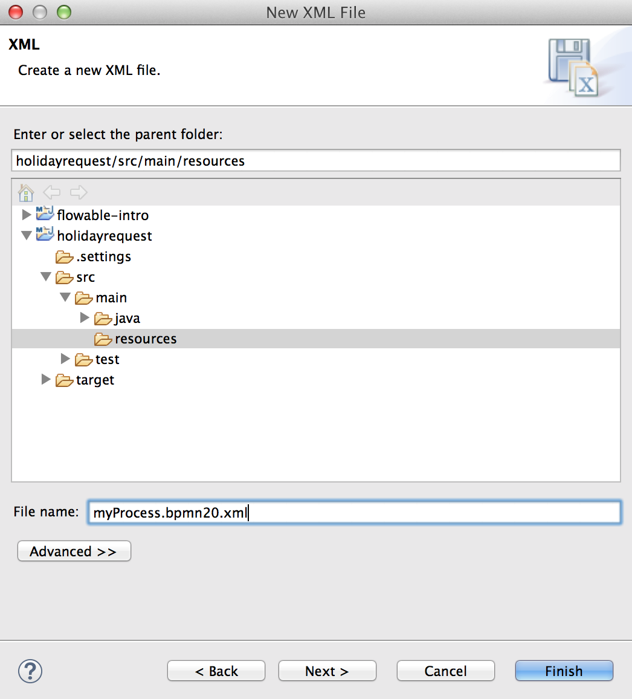
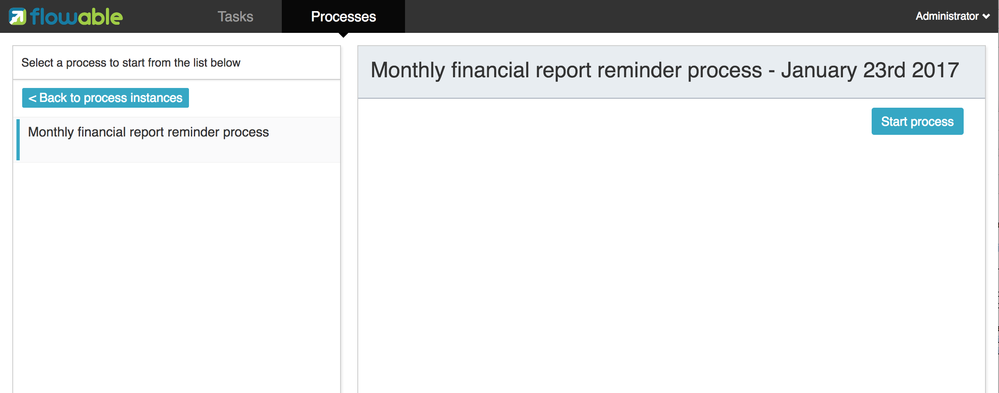
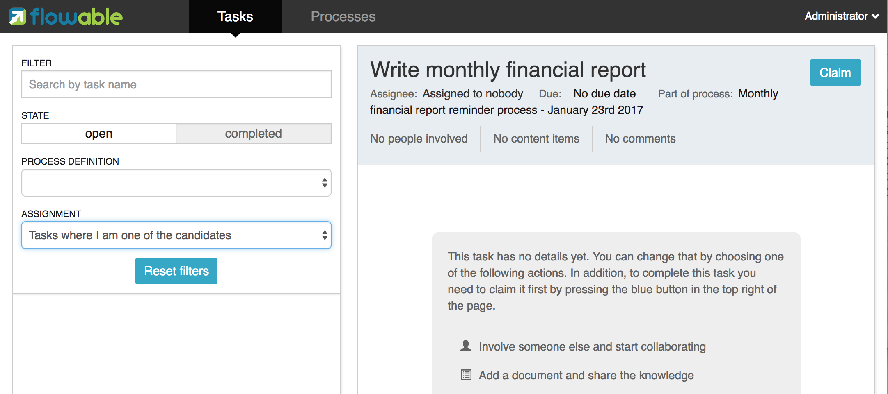
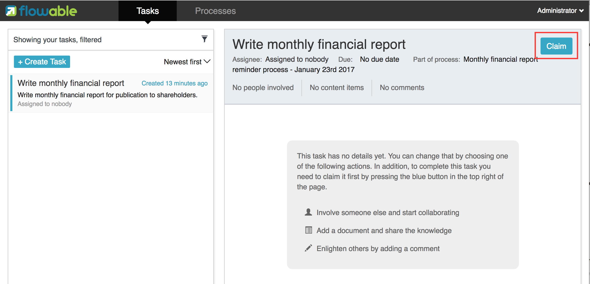

[[bpmn20]]

== BPMN 2.0介绍

[[whatIsBpmn]]

=== BPMN是什么？

BPMN是一个广泛接受与支持的，展现流程的注记方法。link:$$http://www.bpmn.org/$$[OMG BPMN标准].

[[bpmnDefiningProcess]]

=== 定义流程

[NOTE]
====
本篇文档假设你使用link:$$http://eclipse.org/$$[Eclipse IDE]创建与编辑文件。但其实文档中只有少数几处使用了Eclipse的特性。你可以使用喜欢的任何其他工具创建BPMN 2.0 XML文件。

====

创建一个新的XML文件（__在任意项目上右击，选择New->Other->XML-XML File__）并命名。确保该文件名**以.bpmn20.xml或.bpmn结尾**，否则引擎不会在部署时使用这个文件。

BPMN 2.0概要（schema）的根元素（root element）是++definitions++元素。在这个元素中，可以定义多个流程定义（然而我们建议在每个文件中，只有一个流程定义。这样可以简化之后的部署过程）。下面给出的是一个空流程定义。请注意++definitions++元素最少需要包含++xmlns++与++targetNamespace++声明。++targetNamespace++可以为空，它用于对流程定义进行分类。

[source,xml,linenums]
----
<definitions
  xmlns="http://www.omg.org/spec/BPMN/20100524/MODEL"
  xmlns:flowable="http://flowable.org/bpmn"
  targetNamespace="Examples">

  <process id="myProcess" name="My First Process">
    ..
  </process>

</definitions>
----

除了使用Eclipse中的XML分类选项，也可以使用在线概要作为BPMN 2.0 XML概要。

[source,xml,linenums]
----
xmlns:xsi="http://www.w3.org/2001/XMLSchema-instance"
xsi:schemaLocation="http://www.omg.org/spec/BPMN/20100524/MODEL
                    http://www.omg.org/spec/BPMN/2.0/20100501/BPMN20.xsd
----

++process++元素有两个属性：

*  *id*: **必填**属性，将映射为Flowable ++ProcessDefinition++对象的**key**参数。可以使用++RuntimeService++中的++startProcessInstanceByKey++方法，使用++id++来启动这个流程定义的新流程实例。这个方法总会使用流程定义的**最新部署版本**。

[source,java,linenums]
----
ProcessInstance processInstance = runtimeService.startProcessInstanceByKey("myProcess");
----

* 请注意这与调用++startProcessInstanceById++方法不同。++startProcessInstanceById++方法的参数为Flowable引擎在部署时生成的字符串ID(可以通过调用++processDefinition.getId()++方法获取)。生成ID的格式为**'key:version'**，长度**限制为64字符**。请注意限制流程__key__的长度，否则会抛出++FlowableException++异常，提示生成的ID过长。
* *name*: **可选**属性，将映射为++ProcessDefinition++的__name__参数。引擎本身不会使用这个参数。可以用于在用户界面上显示更友好的名字。

[[bpmn10minutetutorial]]

=== 开始：十分钟教程

这个章节包含了一个很简单的业务流程，用于介绍一些基本的Flowable概念以及Flowable API。

[[bpmn10MinuteTutorialPrerequisites]]

==== 必要条件

这个教程需要你已经<<demo.setup.one.minute.version,运行了Flowable演示配置>>，并使用独立的H2服务器。编辑++db.properties++并设置++jdbc.url=jdbc:h2:tcp://localhost/flowable++，然后按照link:$$http://www.h2database.com/html/tutorial.html#using_server$$[H2文档]的介绍运行独立服务器。

[[bpmn10MinuteTutorialGoal]]

==== 目标

这个教程的目标是学习Flowable以及BPMN 2.0的一些基础概念。最后成果是一个简单的Java SE程序，部署了一个流程定义，并可以通过Flowable引擎API与流程进行交互。当然，在这个教程里学到的东西，也可以按照你的业务流程用于构建你自己的web应用程序。

[[bpmnFirstExampleUseCase]]

==== 用例

用例很简单：有一个公司，叫做BPMCorp。在BPMCorp中，由会计部门负责，每月需要为投资人撰写一份报告。在报告完成后，需要高层经理中的一人进行审核，然后才能发给所有投资人。

[[bpmnFirstExampleDiagram]]

==== 流程图

上面描述的业务流程可以使用<<flowableDesigner,Flowable Designer>>直接画出。但是在这个教程里我们自己写XML，这样可以学习更多。这个流程的图形化BPMN 2.0注记像是这样：

image::images/financial.report.example.diagram.png[align="center"]

我们看到的是一个<<bpmnNoneStartEvent,空启动事件>>（左边的圆圈），接下来是两个<<bpmnUserTask,用户任务>>：__'Write monthly financial report（撰写月度财务报告）'__与__'Verify monthly financial report（审核月度财务报告）'__。最后是<<bpmnNoneEndEvent,空结束事件>>（右边的粗线条圆圈）。

[[bpmnFirstExampleXml]]

==== XML格式

这个业务流程的XML版本（__FinancialReportProcess.bpmn20.xml__）在下面展示。很容易认出流程的主要元素（点击链接可以跳转到BPMN 2.0结构的详细章节）：

* <<bpmnNoneStartEvent,(空)开始事件>>是流程的__入口点（entry point）__。
* <<bpmnUserTask,用户任务>>表示流程中的人工任务。请注意第一个任务分配给__accountancy__组，而第二个任务分配给__management__组。查看<<bpmnUserTaskAssignment,用户任务分配>>章节了解更多关于用户与组如何分配用户任务的信息。
* 流程在到达<<bpmnNoneEndEvent,空结束事件>>时结束。
* 各元素间通过<<bpmnSequenceFlow,顺序流>>链接。顺序流用++source++ 与++target++定义顺序流的__流向（direction）__。

[source,xml,linenums]
----
<definitions id="definitions"
  targetNamespace="http://flowable.org/bpmn20"
  xmlns:flowable="http://flowable.org/bpmn"
  xmlns="http://www.omg.org/spec/BPMN/20100524/MODEL">

    <process id="financialReport" name="Monthly financial report reminder process">

      <startEvent id="theStart" />

      <sequenceFlow id="flow1" sourceRef="theStart" targetRef="writeReportTask" />

      <userTask id="writeReportTask" name="Write monthly financial report" >
        <documentation>
          Write monthly financial report for publication to shareholders.
        </documentation>
        <potentialOwner>
          <resourceAssignmentExpression>
            <formalExpression>accountancy</formalExpression>
          </resourceAssignmentExpression>
        </potentialOwner>
      </userTask>

      <sequenceFlow id="flow2" sourceRef="writeReportTask" targetRef="verifyReportTask" />

      <userTask id="verifyReportTask" name="Verify monthly financial report" >
        <documentation>
          Verify monthly financial report composed by the accountancy department.
          This financial report is going to be sent to all the company shareholders.
        </documentation>
        <potentialOwner>
          <resourceAssignmentExpression>
            <formalExpression>management</formalExpression>
          </resourceAssignmentExpression>
        </potentialOwner>
      </userTask>

      <sequenceFlow id="flow3" sourceRef="verifyReportTask" targetRef="theEnd" />

      <endEvent id="theEnd" />

    </process>

</definitions>
----

[[bpmnFirstExamplStartProcess]]

==== 启动流程实例

现在我们已经创建了业务流程的**流程定义**。使用这样的流程定义，可以创建**流程实例**。在这个例子中，一个流程实例将对应某一月份的财经报告创建与审核工作。所有月份的流程实例共享相同的流程定义。

要用给定的流程定义创建流程实例，需要首先**部署（deploy）**流程定义。部署流程定义意味着两件事：

* 流程定义将会存储在Flowable引擎配置的持久化数据库中。因此部署业务流程保证了引擎在重启后也能找到流程定义。
* BPMN 2.0流程XML会解析为内存中的对象模型，供Flowable API使用。

更多关于部署的信息可以在<<chDeployment,部署>>章节中找到。

与该章节的描述一样，部署有很多种方式。其中一种是通过下面展示的API。请注意所有与Flowable引擎的交互都要通过它的__服务（services）__进行。

[source,java,linenums]
----
Deployment deployment = repositoryService.createDeployment()
  .addClasspathResource("FinancialReportProcess.bpmn20.xml")
  .deploy();
----

现在可以使用在流程定义中定义的++id++（参见XML中的process元素）启动新流程实例。请注意这个++id++在Flowable术语中被称作**key**。

[source,java,linenums]
----
ProcessInstance processInstance = runtimeService.startProcessInstanceByKey("financialReport");
----

这会创建流程实例，并首先通过开始事件。在开始事件后，会沿着所有出口顺序流（在这个例子中只有一个）继续执行，并到达第一个任务（'write monthly financial report 撰写月度财务报告'）。这时，Flowable引擎会在持久化数据库中存储一个任务。同时也会解析并保存这个任务附加的分配用户或组。请注意，Flowable引擎会持续执行流程，直到到达__等待状态（wait state）__，例如用户任务。在等待状态，流程实例的当前状态会存储在数据库中并保持，直到用户决定完成任务。这时，引擎会继续执行，直到遇到新的等待状态，或者流程结束。如果在这期间引擎重启或崩溃，流程的状态也仍在数据库中安全的保存。

用户任务活动是一个__等待状态__，因此++startProcessInstanceByKey++方法会在任务创建后返回。在这个例子里，这个任务分配给一个组。这意味着这个组的每一个成员都是处理这个任务的**候选人（candidate）**。

现在可以将前面这些东西整合起来，构造一个简单的Java程序。创建一个新的Eclipse项目，在它的classpath中添加Flowable JAR与依赖（可以在Flowable发行版的__libs__目录下找到）。在调用Flowable服务前，需要首先构建++ProcessEngine++，用于访问服务。这里我们使用__'独立(standalone)'__配置，这个配置会构建++ProcessEngine++，并使用与演示配置中相同的数据库。

可以从link:$$images/FinancialReportProcess.bpmn20.xml$$[这里]下载流程定义XML。这个文件包含了上面展示的XML，同时包含了必要的BPMN<<generatingProcessDiagram,图形交互信息>>，用于在Flowable的工具中可视化地展示流程。

[source,java,linenums]
----
public static void main(String[] args) {

  // 创建Flowable流程引擎
  ProcessEngine processEngine = ProcessEngineConfiguration
    .createStandaloneProcessEngineConfiguration()
    .buildProcessEngine();

  // 获取Flowable服务
  RepositoryService repositoryService = processEngine.getRepositoryService();
  RuntimeService runtimeService = processEngine.getRuntimeService();

  // 部署流程定义
  repositoryService.createDeployment()
    .addClasspathResource("FinancialReportProcess.bpmn20.xml")
    .deploy();

  // 启动流程实例
  runtimeService.startProcessInstanceByKey("financialReport");
}
----

[[bpmnFirstExampleCandidateList]]

==== 任务列表

现在可以通过如下代码获取这个任务：

[source,java,linenums]
----
List<Task> tasks = taskService.createTaskQuery().taskCandidateUser("kermit").list();
----

请注意传递给这个操作的用户需要是__accountancy__组的成员，因为在流程定义中是这么声明的：

[source,xml,linenums]
----
<potentialOwner>
  <resourceAssignmentExpression>
    <formalExpression>accountancy</formalExpression>
  </resourceAssignmentExpression>
</potentialOwner>
----

也可以使用任务查询API，用组名查得相同结果。可以在代码中添加下列逻辑：

[source,java,linenums]
----
TaskService taskService = processEngine.getTaskService();
List<Task> tasks = taskService.createTaskQuery().taskCandidateGroup("accountancy").list();
----

因为我们使用与演示配置中相同的数据库配置++ProcessEngine++，因此可以直接登录link:$$http://localhost:8080/flowable-idm/$$[Flowable IDM]。使用admin/test登录，创建两个新用户__kermit__与__fozzie__，并将__Access the workflow application(访问工作流应用)__权限授予他们。然后创建两个组，命名为__accountancy__与__management__，并将fozzie添加至accountancy组，将kermit添加至management组。
然后以fozzie登录link:$$http://localhost:8080/flowable-task/$$[Flowable task]应用。选择Task应用，再选择其__Processes__页面，选择__'Monthly financial report （月度财务报告）'__，这样就可以启动我们的业务流程。

前面已经解释过，流程会执行直到第一个用户任务。因为登录为fozzie，所以可以看到在启动流程实例后，他有一个新的候选任务（candidate task）。选择__Task__页面来查看这个新任务。请注意即使流程是由其他人启动的，accountancy组中的每一个人仍然都能看到这个候选任务。

[[bpmnFirstExampleClaimTask]]

==== 申领任务

会计师（accountancy组的成员）现在需要**申领任务（claim）**。申领任务后，这个用户会成为任务的**执行人（assignee）**，这个任务也会从accountancy组的其他成员的任务列表中消失。可以通过如下代码实现申领任务：

[source,java,linenums]
----
taskService.claim(task.getId(), "fozzie");
----

这个任务现在在**申领任务者的个人任务列表中**。

[source,java,linenums]
----
List<Task> tasks = taskService.createTaskQuery().taskAssignee("fozzie").list();
----

在Flowable Task应用中，点击__claim__按钮会执行相同操作。这个任务会转移到登录用户的个人任务列表中。也可以看到任务执行人变更为当前登录用户。

[[bpmnFirstExampleCompleteTask]]

==== 完成任务

会计师（accountancy组的成员）现在需要开始撰写财务报告了。完成报告后，他就可以**完成任务（complete）**，代表任务的所有工作都已完成。

[source,java,linenums]
----
taskService.complete(task.getId());
----

对于Flowable引擎来说，这是个外部信号，指示流程实例可以继续执行。Flowable会从运行时数据中移除任务，并沿着这个任务唯一的出口转移线（outgoing transition），将执行移至第二个任务（__'verification of the report 审核报告'__）。为第二个任务分配执行人的机制，与上面介绍的第一个任务使用的机制相同。唯一的区别是这个任务会分配给__management__组。

在演示设置中，完成任务可以通过点击任务列表中的__complete__按钮。因为Fozzie不是经理，我们需要登出Flowable Task应用，并用__kermit__（他是经理）登录。这样就可以在未分配任务列表中看到第二个任务。

[[bpmnFirstExampleEndingProcess]]

==== 结束流程

可以使用与之前完全相同的方式获取并申领审核任务。完成这个第二个任务会将流程执行移至结束事件，并结束流程实例。这个流程实例，及所有相关的运行时执行数据都会从数据库中移除。

也可以通过编程方式，使用++historyService++验证流程已经结束

[source,java,linenums]
----
HistoryService historyService = processEngine.getHistoryService();
HistoricProcessInstance historicProcessInstance =
historyService.createHistoricProcessInstanceQuery().processInstanceId(procId).singleResult();
System.out.println("Process instance end time: " + historicProcessInstance.getEndTime());
----

[[bpmnFirstExampleCode]]

==== 代码总结

将之前章节的所有代码片段整合起来，会得到类似这样的代码。这段代码考虑到了你可能已经使用Flowable UI应用启动了一些流程实例。代码中总是获取任务列表而不是一个任务，因此可以正确执行：

[source,java,linenums]
----
public class TenMinuteTutorial {

  public static void main(String[] args) {

    // 创建Flowable流程引擎 
    ProcessEngine processEngine = ProcessEngineConfiguration
      .createStandaloneProcessEngineConfiguration()
      .buildProcessEngine();

    // 获取Flowable服务
    RepositoryService repositoryService = processEngine.getRepositoryService();
    RuntimeService runtimeService = processEngine.getRuntimeService();

    // 部署流程定义
    repositoryService.createDeployment()
      .addClasspathResource("FinancialReportProcess.bpmn20.xml")
      .deploy();

    // 启动流程实例
    String procId = runtimeService.startProcessInstanceByKey("financialReport").getId();

    // 获取第一个任务
    TaskService taskService = processEngine.getTaskService();
    List<Task> tasks = taskService.createTaskQuery().taskCandidateGroup("accountancy").list();
    for (Task task : tasks) {
      System.out.println("Following task is available for accountancy group: " + task.getName());

      // 申领任务
      taskService.claim(task.getId(), "fozzie");
    }

    // 验证Fozzie获取了任务
    tasks = taskService.createTaskQuery().taskAssignee("fozzie").list();
    for (Task task : tasks) {
      System.out.println("Task for fozzie: " + task.getName());

      // 完成任务
      taskService.complete(task.getId());
    }

    System.out.println("Number of tasks for fozzie: "
            + taskService.createTaskQuery().taskAssignee("fozzie").count());

    // 获取并申领第二个任务
    tasks = taskService.createTaskQuery().taskCandidateGroup("management").list();
    for (Task task : tasks) {
      System.out.println("Following task is available for management group: " + task.getName());
      taskService.claim(task.getId(), "kermit");
    }

    // 完成第二个任务并结束流程
    for (Task task : tasks) {
      taskService.complete(task.getId());
    }

    // 验证流程已经结束
    HistoryService historyService = processEngine.getHistoryService();
    HistoricProcessInstance historicProcessInstance =
      historyService.createHistoricProcessInstanceQuery().processInstanceId(procId).singleResult();
    System.out.println("Process instance end time: " + historicProcessInstance.getEndTime());
  }

}
----

[[bpmnFirstExampleFutureEnhancements]]

==== 后续增强

可以看出这个业务流程太简单了，不能实际使用。但只要继续学习Flowable中可用的BPMN 2.0结构，就可以通过以下元素增强业务流程：

* 定义**网关（gateway）**使经理可以选择：驳回财务报告，并重新为会计师创建任务；或者接受报告。
* 定义并使用**变量（variables）**存储或引用报告，并可以在表单中显示它。
* 在流程结束处定义**服务任务（service task）**，将报告发送给每一个投资人。
* 等等。
