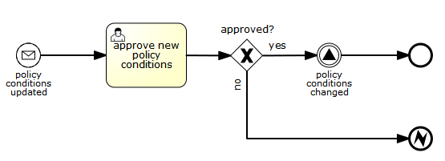
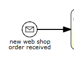
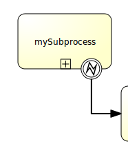
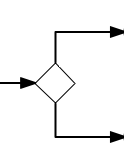

[[bpmnConstructs]]

== BPMN 2.0结构

本章节介绍Flowable支持的BPMN 2.0结构，以及Flowable对BPMN标准的自定义扩展。

[[bpmnCustomExtensions]]

=== 自定义扩展

BPMN 2.0标准对流程的所有的参与者都很有用。最终用户不会因为依赖专有解决方案，而被供应商“绑架”。Flowable之类的开源框架，也可以提供与大型供应商的解决方案相同（经常是更好;-）的实现。有了BPMN 2.0标准，从大型供应商解决方案向Flowable的迁移，可以十分简单平滑。

缺点则是标准通常是不同公司（不同观点）大量讨论与妥协的结果。作为阅读BPMN 2.0 XML流程定义的开发者，有时会觉得某些结构或方法十分笨重。Flowable将开发者的感受放在最高优先，因此引入了一些**'Flowable BPMN扩展（extensions）'**。这些“扩展”并不在BPMN 2.0规格中，有些是新结构，有些是对特定结构的简化。

尽管BPMN 2.0规格明确指出可以支持自定义扩展，我们仍做了如下保证：

* 自定义扩展**保证是**在**标准方式**的基础上进行简化。因此当你决定使用自定义扩展时，不用担心无路可退（仍然可以用标准方式）。
* 使用自定义扩展时，总是通过**flowable:**命名空间前缀，明确标识出XML元素、属性等。请注意Flowable引擎也支持**activiti:**命名空间前缀。

因此是否使用自定义扩展，完全取决于你自己。有些其他因素会影响选择（图形化编辑器的使用，公司策略，等等）。我们提供扩展，只是因为相信标准中的某些地方可以用更简单或效率更高的方式处理。请不要吝啬给我们反馈你对扩展的评价（正面的或负面的），也可以给我们提供关于自定义扩展的新想法。说不定某一天，你的想法会成为标准的一部分！

[[bpmnEvents]]

=== 事件

事件（event）通常用于为流程生命周期中发生的事情建模。事件总是图形化为圆圈。在BPMN 2.0中，有两种主要的事件分类：__捕获（catching）__与__抛出（throwing）__事件。

* **捕获:** 当流程执行到达这个事件时，会等待直到触发器动作。触发器的类型由其中的图标，或者说XML中的类型声明而定义。捕获事件与抛出事件显示上的区别，是其内部的图标没有填充（即是白色的）。
* **抛出:** 当流程执行到达这个事件时，会触发一个触发器。触发器的类型，由其中的图标，或者说XML中的类型声明而定义。抛出事件与捕获事件显示上的区别，是其内部的图标填充为黑色。

[[eventDefinitions]]

==== 事件定义

事件定义（event definition），用于定义事件的语义。没有事件定义的话，事件就“不做什么特别的事情”。例如，一个没有事件定义的开始事件，并不限定具体是什么启动了流程。如果为这个开始事件添加事件定义（例如定时器事件定义），就声明了启动流程的“类型”（例如对于定时器事件定义，就是到达了特定的时间点）。

[[timerEventDefinitions]]

==== 定时器事件定义

定时器事件（timer event definition），是由定时器所触发的事件。可以用于<<bpmnTimerStartEvent,开始事件>>，<<bpmnIntermediateCatchingEvent,中间事件>>，或<<bpmnTimerBoundaryEvent,边界事件>>。定时器事件的行为取决于所使用的业务日历（business calendar）。定时器事件有默认的业务日历，但也可以为每个定时器事件定义，单独定义业务日历。

[source,xml,linenums]
----
<timerEventDefinition flowable:businessCalendarName="custom">
    ...
</timerEventDefinition>
----

其中businessCalendarName指向流程引擎配置中的业务日历。如果省略业务日历定义，则使用默认业务日历。

定时器定义必须且只能包含下列的一种元素：

* **timeDate**。这个元素指定了link:$$http://en.wikipedia.org/wiki/ISO_8601#Dates$$[ISO 8601]格式的固定时间。在这个时间就会触发触发器。例如：

[source,xml,linenums]
----
<timerEventDefinition>
    <timeDate>2011-03-11T12:13:14</timeDate>
</timerEventDefinition>
----

* **timeDuration**。要定义定时器需要等待多长时间再触发，可以用__timerEventDefinition__的子元素__timeDuration__。使用link:$$http://en.wikipedia.org/wiki/ISO_8601#Durations$$[ISO 8601]格式（BPMN 2.0规范要求）。例如（等待10天）：

[source,xml,linenums]
----
<timerEventDefinition>
    <timeDuration>P10D</timeDuration>
</timerEventDefinition>
----

* **timeCycle**。指定重复周期，可用于周期性启动流程，或者为超期用户任务多次发送提醒。这个元素可以使用两种格式。第一种是按照link:$$http://en.wikipedia.org/wiki/ISO_8601#Repeating_intervals$$[ISO 8601]标准定义的循环时间周期。例如（三次重复间隔，每次间隔为10小时）：

* 也可以使用__timeCycle__的可选属性__endDate__，或者像这样直接写在时间表达式的结尾：++R3/PT10H/${EndDate}++。
当到达endDate时，应用会停止，并为该任务创建其他作业。
可以使用link:$$http://en.wikipedia.org/wiki/ISO_8601#Dates$$[ISO 8601]标准的常量，如__"2015-02-25T16:42:11+00:00"__。也可以使用变量，如__${EndDate}__

[source,xml,linenums]
----
<timerEventDefinition>
    <timeCycle flowable:endDate="2015-02-25T16:42:11+00:00">R3/PT10H</timeCycle>
</timerEventDefinition>
----

[source,xml,linenums]
----
<timerEventDefinition>
    <timeCycle>R3/PT10H/${EndDate}</timeCycle>
</timerEventDefinition>
----

如果同时使用了两种格式，则系统会使用以属性方式定义的endDate。

目前只有__BoundaryTimerEvents__与__CatchTimerEvent__可以使用__EndDate__。

另外，也可以使用cron表达式指定定时周期。下面的例子展示了一个整点启动，每5分钟触发的触发器：

----
0 0/5 * * * ?
----

请参考link:$$http://www.quartz-scheduler.org/documentation/quartz-2.3.0/tutorials/crontrigger.html$$[这个教程]了解如何使用cron表达式。

**请注意:** 与普通的Unix cron不同，第一个符号代表的是秒，而不是分钟。

重复时间周期更适合使用相对时间，也就是从某个特定时间点开始计算（比如用户任务开始的时间）。而cron表达式可以使用绝对时间，因此更适合用于<<timerStartEventDescription,定时启动事件>>。

可以在定时事件定义中使用表达式，也就是使用流程变量控制定时。这个流程变量必须是包含合适时间格式的字符串，ISO 8601（或者对于循环类型，cron）。

[source,xml,linenums]
----
<boundaryEvent id="escalationTimer" cancelActivity="true" attachedToRef="firstLineSupport">
  <timerEventDefinition>
    <timeDuration>${duration}</timeDuration>
  </timerEventDefinition>
</boundaryEvent>
----

**请注意：**定时器只有在异步执行器启用时才能触发（需要在++flowable.cfg.xml++中，将__asyncExecutorActivate__设置为++true++。因为默认情况下异步执行器都是禁用的）。

[[bpmnErrorEventDefinition]]

==== 错误事件定义

（error event definition）

**重要提示：** BPMN错误与Java异常**不**是一回事。事实上，这两者毫无共同点。BPMN错误事件是建模__业务异常（business exceptions）__的方式。而Java异常会按<<serviceTaskExceptionHandling,它们自己的方式>>处理。

[source,xml,linenums]
----
<endEvent id="myErrorEndEvent">
  <errorEventDefinition errorRef="myError" />
</endEvent>

----

[[bpmnSignalEventDefinition]]

==== 信号事件定义

信号事件（signal event），是引用具名信号的事件。信号是全局范围（广播）的事件，并会被传递给所有激活的处理器（等待中的流程实例/捕获信号事件 catching signal events）。

使用++signalEventDefinition++元素声明信号事件定义。其++signalRef++属性引用一个++signal++元素，该++signal++元素需要声明为++definitions++根元素的子元素。下面摘录一个流程，使用中间事件（intermediate event）抛出与捕获信号事件。

[source,xml,linenums]
----
<definitions... >
    <!-- 声明信号 -->
    <signal id="alertSignal" name="alert" />

    <process id="catchSignal">
        <intermediateThrowEvent id="throwSignalEvent" name="Alert">
            <!-- 信号事件定义 -->
            <signalEventDefinition signalRef="alertSignal" />
        </intermediateThrowEvent>
        ...
        <intermediateCatchEvent id="catchSignalEvent" name="On Alert">
            <!-- 信号事件定义 -->
            <signalEventDefinition signalRef="alertSignal" />
        </intermediateCatchEvent>
        ...
    </process>
</definitions>
----

两个++signalEventDefinition++引用同一个++signal++元素。

[[bpmnSignalEventDefinitionThrow]]

===== 抛出信号事件

信号可以由流程实例使用BPMN结构抛出（throw），也可以通过编程方式使用Java API抛出。下面++org.flowable.engine.RuntimeService++中的方法可以用编程方式抛出信号：

[source,java,linenums]
----
RuntimeService.signalEventReceived(String signalName);
RuntimeService.signalEventReceived(String signalName, String executionId);
----

++signalEventReceived(String signalName)++与++signalEventReceived(String signalName, String executionId)++的区别，是前者在全局范围为所有已订阅处理器抛出信号（广播），而后者只为指定的执行传递信号。

[[bpmnSignalEventDefinitionCatch]]

===== 捕获信号事件

可以使用信号捕获中间事件（intermediate catch signal event）或者信号边界事件（signal boundary event）捕获信号事件。

[[bpmnSignalEventDefinitionQuery]]

===== 查询信号事件订阅

可以查询订阅了某一信号事件的所有执行：

[source,java,linenums]
----
 List<Execution> executions = runtimeService.createExecutionQuery()
      .signalEventSubscriptionName("alert")
      .list();
----

可以使用++signalEventReceived(String signalName, String executionId)++方法为这些执行传递这个信号。

[[bpmnSignalEventDefinitionScope]]

===== 信号事件的范围

默认情况下，信号事件在__流程引擎全局广播__。这意味着你可以在一个流程实例中抛出一个信号事件，而不同流程定义的不同流程实例都会响应这个事件。

但有时也会希望只在__同一个流程实例__中响应信号事件。例如，在流程实例中使用异步机制，而两个或多个活动彼此互斥的时候。

要限制信号事件的__范围（scope）__，在信号事件定义中添加（非BPMN 2.0标准！）__scope属性__：

[source,xml,linenums]
----
<signal id="alertSignal" name="alert" flowable:scope="processInstance"/>
----

这个属性的默认值为__"global（全局）"__。

[[bpmnSignalEventDefinitionExample]]

===== 信号事件示例

下面是一个不同流程通过信号通信的例子。第一个流程在保险政策更新或变更时启动。在变更由人工审核之后，会抛出信号事件，指出政策已经发生了变更：

这个事件可以被所有感兴趣的流程实例捕获。下面是一个订阅这个事件的流程的例子。

image::images/bpmn.signal.event.catch.png[align="center"]

**请注意：**要理解信号事件会广播给**所有**激活的处理器，这很重要。这意味着在上面的例子中，所有订阅这个信号的流程实例都会接收这个信号。在这个例子中这就是我们期望的。然而，有的情况下，不希望使用广播方式。考虑下面的流程：

image::images/bpmn.signal.event.warning.1.png[align="center"]

Flowable不支持上面流程中描述的模式。我们的想法是，在执行"do something"任务时抛出的错误，由错误边界事件捕获，并通过信号抛出事件传播至执行的并行分支，最终中断"do something in parallel"任务。到目前为止Flowable会按照预期效果执行。**然而，由于信号的广播效应，它也会被传播至所有其他订阅了这个信号事件的流程实例。**这可能并非我们希望的效果。

**请注意：**信号事件与特定的流程实例无关，而是会广播给所有流程实例。如果你需要只为某一特定的流程实例传递信号，则需要使用++signalEventReceived(String signalName, String executionId)++手动建立关联，并使用适当的的<<bpmnSignalEventDefinitionQuery,查询机制>>。

Flowable提供了解决的方法。可以在信号事件上添加__scope__属性，并将其设置为__processInstance__。

[[bpmnMessageEventDefinition]]

==== 消息事件定义

消息事件（message event），是指引用具名消息的事件。消息具有名字与载荷。与信号不同，消息事件只有一个接收者。

消息事件定义使用++messageEventDefinition++元素声明。其++messageRef++属性引用一个++message++元素，该++message++元素需要声明为++definitions++根元素的子元素。下面摘录一个流程，声明了两个消息事件，并由开始事件与消息捕获中间事件（intermediate catching message event）引用。

[source,xml,linenums]
----
<definitions id="definitions"
  xmlns="http://www.omg.org/spec/BPMN/20100524/MODEL"
  xmlns:flowable="http://flowable.org/bpmn"
  targetNamespace="Examples"
  xmlns:tns="Examples">

  <message id="newInvoice" name="newInvoiceMessage" />
  <message id="payment" name="paymentMessage" />

  <process id="invoiceProcess">

    <startEvent id="messageStart" >
    	<messageEventDefinition messageRef="newInvoice" />
    </startEvent>
    ...
    <intermediateCatchEvent id="paymentEvt" >
    	<messageEventDefinition messageRef="payment" />
    </intermediateCatchEvent>
    ...
  </process>

</definitions>
----

[[bpmnMessageEventDefinitionThrow]]

===== 抛出消息事件

作为嵌入式的流程引擎，Flowable并不关心实际如何接收消息。因为这可能与环境相关，或需要进行平台定义的操作。例如连接至JMS（Java Messaging Service，Java消息服务）队列（Queue）/主题（Topic），或者处理Webservice或者REST请求。因此接收消息需要作为应用的一部分，或者是流程引擎所嵌入的基础框架中的一部分，由你自行实现。

在应用中接收到消息后，需要决定如何处理它。如果这个消息需要启动新的流程实例，可以选择一种由runtime服务提供的方法：

[source,java,linenums]
----
ProcessInstance startProcessInstanceByMessage(String messageName);
ProcessInstance startProcessInstanceByMessage(String messageName, Map<String, Object> processVariables);
ProcessInstance startProcessInstanceByMessage(String messageName, String businessKey,
    Map<String, Object> processVariables);
----

这些方法使用消息启动流程实例。

如果需要由已有的流程实例接收消息，需要首先将消息与特定的流程实例关联（查看后续章节），然后触发等待中的执行，让流程继续进行。runtime服务提供了下列方法，可以触发订阅了消息事件的执行：

[source,java,linenums]
----
void messageEventReceived(String messageName, String executionId);
void messageEventReceived(String messageName, String executionId, HashMap<String, Object> processVariables);
----

[[bpmnMessageEventDefinitionQuery]]

===== 查询消息事件订阅

* 对于消息启动事件（message start event），消息事件的订阅与的__流程定义__相关。可以使用++ProcessDefinitionQuery++查询这种类型的消息订阅：

[source,java,linenums]
----
ProcessDefinition processDefinition = repositoryService.createProcessDefinitionQuery()
      .messageEventSubscription("newCallCenterBooking")
      .singleResult();
----

因为一个消息只能被一个流程定义订阅，因此这个查询总是返回0或1个结果。如果流程定义更新了，只有该流程定义的最新版本会订阅这个消息事件。

* 对于消息捕获中间事件（intermediate catch message event），消息事件的订阅与__执行__相关。可以使用++ExecutionQuery++查询这种类型的消息订阅：

[source,java,linenums]
----
Execution execution = runtimeService.createExecutionQuery()
      .messageEventSubscriptionName("paymentReceived")
      .variableValueEquals("orderId", message.getOrderId())
      .singleResult();
----

这种查询通常都会有关联查询，并且通常需要了解流程的情况（在这个例子里，对于给定的orderId，至多只有一个流程实例）。

[[bpmnMessageEventDefinitionExample]]

===== 消息事件示例

下面是一个流程的例子，可以使用两种不同的消息启动：

image::images/bpmn.start.message.event.example.1.png[align="center"]

在流程需要通过不同的方式启动，但是后续使用统一的方式处理时，就可以使用这种方法。

[[bpmnStartEvents]]

==== 启动事件

启动事件（start event）是流程的起点。启动事件的类型（流程在消息到达时启动，在指定的时间间隔后启动，等等），定义了流程__如何__启动，并显示为启动事件中的小图标。在XML中，类型由子元素声明来定义。

启动事件**随时捕获**：启动事件（保持）等候，直到特定的触发器被触发。

在启动事件中，可以使用下列Flowable自定义参数：

* *initiator*: 指明保存认证用户（authenticated user）ID用的变量名。在流程启动时，操作用户的ID会保存在这个变量中。例如：

[source,xml,linenums]
----
<startEvent id="request" flowable:initiator="initiator" />
----

认证用户必须在try-finally块中调用++IdentityService.setAuthenticatedUserId(String)++方法进行设置。像这样：

[source,java,linenums]
----
try {
  identityService.setAuthenticatedUserId("bono");
  runtimeService.startProcessInstanceByKey("someProcessKey");
} finally {
  identityService.setAuthenticatedUserId(null);
}

----

这段代码已经集成在Flowable应用中，可以在<<forms,表单>>中使用。

[[bpmnNoneStartEvent]]

==== 空启动事件

[[noneStartEventDescription]]

===== 描述

“空”启动事件（none Start Event），指的是未指定启动流程实例触发器的启动事件。引擎将无法预知何时启动流程实例。空启动事件用于流程实例通过调用下列__startProcessInstanceByXXX__ API方法启动的情况。

[source,java,linenums]
----
ProcessInstance processInstance = runtimeService.startProcessInstanceByXXX();
----

__请注意：__子流程（sub-process）必须有空启动事件。

[[noneStartEventGraphicalNotation]]

===== 图示

空启动事件用空心圆圈表示，中间没有图标（也就是说，没有触发器）。

image::images/bpmn.none.start.event.png[align="center"]

[[noneStartEventXml]]

===== XML表示

空启动事件的XML表示格式，就是普通的启动事件声明，而没有任何子元素（其他种类的启动事件都有用于声明其类型的子元素）。

[source,xml,linenums]
----
<startEvent id="start" name="my start event" />
----

[[noneStartEventCustomExtension]]

===== 空启动事件的自定义扩展

*formKey*: 引用表单定义，用户需要在启动新流程实例时填写该表单。可以在<<forms,表单章节>>找到更多信息。例如：

[source,xml,linenums]
----
<startEvent id="request" flowable:formKey="request" />
----

[[bpmnTimerStartEvent]]

==== 定时器启动事件

[[timerStartEventDescription]]

===== 描述

定时器启动事件（timer start event）在指定时间创建流程实例。在流程只需要启动一次，或者流程需要在特定的时间间隔重复启动时，都可以使用。

__请注意：__子流程不能有定时器启动事件。

__请注意：__定时器启动事件，在流程部署的同时就开始计时。不需要调用startProcessInstanceByXXX就会在时间启动。调用startProcessInstanceByXXX时会在定时启动之外额外启动一个流程。

__请注意：__当部署带有定时器启动事件的流程的更新版本时，上一版本的定时器作业会被移除。这是因为通常并不希望旧版本的流程仍然自动启动新的流程实例。

[[timerStartEventGraphicalNotation]]

===== 图示

定时器启动事件，用其中有一个钟表图标的圆圈来表示。

image::images/bpmn.clock.start.event.png[align="center"]

[[timerStartEventXml]]

===== XML表示

定时器启动事件的XML表示格式，是普通的启动事件声明加上定时器定义子元素。请参考<<timerEventDefinitions,定时器定义>>了解详细配置方法。

示例：流程会启动4次，间隔5分钟，从2011年3月11日，12:13开始

[source,xml,linenums]
----
<startEvent id="theStart">
  <timerEventDefinition>
    <timeCycle>R4/2011-03-11T12:13/PT5M</timeCycle>
  </timerEventDefinition>
</startEvent>
----

示例：流程会在设定的时间启动一次

[source,xml,linenums]
----
<startEvent id="theStart">
  <timerEventDefinition>
    <timeDate>2011-03-11T12:13:14</timeDate>
  </timerEventDefinition>
</startEvent>
----

[[bpmnMessageStartEvent]]

==== 消息启动事件

[[messageStartEventDescription]]

===== 描述

<<bpmnMessageEventDefinition,消息>>启动事件（message start event）使用具名消息启动流程实例。消息名用于__选择__正确的启动事件。

当**部署**具有一个或多个消息启动事件的流程定义时，会做如下判断：

* 给定流程定义中，消息启动事件的名字必须是唯一的。一个流程定义不得包含多个同名的消息启动事件。如果流程定义中有两个或多个消息启动事件引用同一个消息，或者两个或多个消息启动事件引用了具有相同消息名字的消息，则Flowable会在部署这个流程定义时抛出异常。
* 在所有已部署的流程定义中，消息启动事件的名字必须是唯一的。如果在流程定义中，一个或多个消息启动事件引用了已经部署的另一流程定义中消息启动事件的消息名，则Flowable会在部署这个流程定义时抛出异常。
* 流程版本：在部署流程定义的新版本时，会取消上一版本的消息订阅，即使新版本中并没有这个消息事件）。

在**启动**流程实例时，可以使用下列++RuntimeService++中的方法，触发消息启动事件：

[source,java,linenums]
----
ProcessInstance startProcessInstanceByMessage(String messageName);
ProcessInstance startProcessInstanceByMessage(String messageName, Map<String, Object> processVariables);
ProcessInstance startProcessInstanceByMessage(String messageName, String businessKey,
    Map<String, Object< processVariables);
----

++messageName++是由++message++元素的++name++属性给定的名字。++messageEventDefinition++的++messageRef++属性会引用++message++元素。当**启动**流程实例时，会做如下判断：

* 只有顶层流程（top-level process）才支持消息启动事件。嵌入式子流程不支持消息启动事件。
* 如果一个流程定义中有多个消息启动事件，可以使用++runtimeService.startProcessInstanceByMessage(...)++选择合适的启动事件。
* 如果一个流程定义中有多个消息启动事件与一个空启动事件，则++runtimeService.startProcessInstanceByKey(...)++与++runtimeService.startProcessInstanceById(...)++会使用空启动事件启动流程实例。
* 如果一个流程定义中有多个消息启动事件而没有空启动事件，则++runtimeService.startProcessInstanceByKey(...)++与++runtimeService.startProcessInstanceById(...)++会抛出异常。
* 如果一个流程定义中只有一个消息启动事件，则++runtimeService.startProcessInstanceByKey(...)++与++runtimeService.startProcessInstanceById(...)++会使用这个消息启动事件启动新流程实例。
* 如果流程由调用活动（call activity）启动，则只有在下列情况下才支持消息启动事件
** 除了消息启动事件之外，流程还有唯一的空启动事件
** 或者流程只有唯一的消息启动事件，而没有其他启动事件。

[[messageStartEventGraphicalNotation]]

===== 图示

消息启动事件用其中有一个消息事件标志的圆圈表示。这个标志并未填充，用以表示捕获（接收）行为。

[[messageStartEventXml]]

===== XML表示

消息启动事件的XML表示格式，为普通启动事件声明加上messageEventDefinition子元素：

[source,xml,linenums]
----
<definitions id="definitions"
  xmlns="http://www.omg.org/spec/BPMN/20100524/MODEL"
  xmlns:flowable="http://flowable.org/bpmn"
  targetNamespace="Examples"
  xmlns:tns="Examples">

  <message id="newInvoice" name="newInvoiceMessage" />

  <process id="invoiceProcess">

    <startEvent id="messageStart" >
    	<messageEventDefinition messageRef="tns:newInvoice" />
    </startEvent>
    ...
  </process>

</definitions>
----

[[bpmnSignalStartEvent]]

==== 信号启动事件

[[bpmnSignalStartEventDescription]]

===== 描述

<<bpmnSignalEventDefinition,信号>>启动事件（signal start event），使用具名信号启动流程实例。这个信号可以由流程实例中的信号抛出中间事件（intermediary signal throw event），或者API（__runtimeService.signalEventReceivedXXX__方法）触发。两种方式都会启动所有拥有相同名字信号启动事件的流程定义。

请注意可以选择异步还是同步启动流程实例。

需要为API传递的++signalName++，是由++signal++元素的++name++属性决定的名字。++signal++元素由++signalEventDefinition++的++signalRef++属性引用。

[[signalStartEventGraphicalNotation]]

===== 图示

信号启动事件用其中有一个信号事件标志的圆圈表示。这个标志并未填充，用以表示捕获（接收）行为。

image::images/bpmn.start.signal.event.png[align="center"]

[[signalStartEventXml]]

===== XML表示

信号启动事件的XML表示格式，为普通启动事件声明，加上signalEventDefinition子元素：

[source,xml,linenums]
----
<signal id="theSignal" name="The Signal" />

<process id="processWithSignalStart1">
  <startEvent id="theStart">
    <signalEventDefinition id="theSignalEventDefinition" signalRef="theSignal"  />
  </startEvent>
  <sequenceFlow id="flow1" sourceRef="theStart" targetRef="theTask" />
  <userTask id="theTask" name="Task in process A" />
  <sequenceFlow id="flow2" sourceRef="theTask" targetRef="theEnd" />
  <endEvent id="theEnd" />
</process>
----

[[bpmnErrorStartEvent]]

==== 错误启动事件

[[errorStartEventDescription]]

===== 描述

<<bpmnErrorEventDefinition,错误>>启动事件（error start event），可用于触发事件子流程（Event Sub-Process）。**错误启动事件不能用于启动流程实例**。

错误启动事件总是中断。

[[errorStartEventGraphicalNotation]]

===== 图示

错误启动事件用其中有一个错误事件标志的圆圈表示。这个标志并未填充，用以表示捕获（接收）行为。

image::images/bpmn.start.error.event.png[align="center"]

[[errorStartEventXml]]

===== XML表示

错误启动事件的XML表示格式，为普通启动事件声明加上errorEventDefinition子元素：

[source,xml,linenums]
----
<startEvent id="messageStart" >
	<errorEventDefinition errorRef="someError" />
</startEvent>
----

[[bpmnEndEvent]]

==== 结束事件

结束事件（end event）标志着流程或子流程中一个分支的结束。结束事件**总是抛出（型）事件**。这意味着当流程执行到达结束事件时，会抛出一个__结果__。结果的类型由事件内部的黑色图标表示。在XML表示中，类型由子元素声明给出。

[[bpmnNoneEndEvent]]

==== 空结束事件

[[noneEndEventDescription]]

===== 描述

“空”结束事件(none end event)，意味着当到达这个事件时，没有特别指定抛出的__结果__。因此，引擎除了结束当前执行分支之外，不会多做任何事情。

[[bpmnNoneEndEventDescription]]

===== 图示

空结束事件，用其中没有图标（没有结果类型）的粗圆圈表示。

image::images/bpmn.none.end.event.png[align="center"]

[[bpmnNoneStartEventXml]]

===== XML表示

空事件的XML表示格式为普通结束事件声明，没有任何子元素（其它种类的结束事件都有子元素，用于声明其类型）。

[source,xml,linenums]
----
<endEvent id="end" name="my end event" />
----

[[bpmnErrorEndEvent]]

==== 错误结束事件

[[bpmnErrorEndEventDescription]]

===== 描述

当流程执行到达**错误结束事件（error end event）**时，结束执行的当前分支，并抛出错误。这个错误可以<<bpmnBoundaryErrorEvent, 由匹配的错误边界中间事件捕获>>。如果找不到匹配的错误边界事件，将会抛出异常。

[[bpmnErrorEndEventGraphicalNotation]]

===== 图示

错误结束事件事件用内部有一个错误图标的标准结束事件（粗圆圈）表示。错误图标是全黑的，代表抛出的含义。

image::images/bpmn.error.end.event.png[align="center"]

[[bpmnErrorEndEventXml]]

===== XML表示

错误结束事件表示为结束事件，加上__errorEventDefinition__子元素：

[source,xml,linenums]
----
<endEvent id="myErrorEndEvent">
  <errorEventDefinition errorRef="myError" />
</endEvent>

----

__errorRef__属性可以引用在流程外定义的__error__元素：

[source,xml,linenums]
----
<error id="myError" errorCode="123" />
...
<process id="myProcess">
...
----

__error__的**errorCode**用于查找匹配的错误捕获边界事件。如果__errorRef__不匹配任何已定义的__error__，则该__errorRef__会用做__errorCode__的快捷方式。这个快捷方式是Flowable特有的。下面的代码片段在功能上是相同的。

[source,xml,linenums]
----
<error id="myError" errorCode="error123" />
...
<process id="myProcess">
...
  <endEvent id="myErrorEndEvent">
    <errorEventDefinition errorRef="myError" />
  </endEvent>
...
----

与下面的代码功能相同

[source,xml,linenums]
----
<endEvent id="myErrorEndEvent">
  <errorEventDefinition errorRef="error123" />
</endEvent>
----

请注意__errorRef__必须遵从BPMN 2.0概要（schema），且必须是合法的QName。

[[bpmnTerminateEndEvent]]

==== 终止结束事件

===== 描述

当到达__终止结束事件（terminate end event）__时，当前的流程实例或子流程会被终止。也就是说，当执行到达终止结束事件时，会判断第一个__范围 scope__（流程或子流程）并终止它。请注意在BPMN 2.0中，子流程可以是嵌入式子流程，调用活动，事件子流程，或事务子流程。有一条通用规则：当存在多实例的调用过程或嵌入式子流程时，只会终止一个实例，其他的实例与流程实例不会受影响。

可以添加一个可选属性__terminateAll__。当其为__true__时，无论该终止结束事件在流程定义中的位置，也无论它是否在子流程（甚至是嵌套子流程）中，都会终止（根）流程实例。

===== 图示

终止结束事件用内部有一个全黑圆的标准结束事件（粗圆圈）表示。

image::images/bpmn.terminate.end.event.png[align="center"]

===== XML表示

终止结束事件，表示为结束事件，加上__terminateEventDefinition__子元素。

请注意__terminateAll__属性是可选的（默认为__false__）。

[source,xml,linenums]
----
<endEvent id="myEndEvent >
  <terminateEventDefinition flowable:terminateAll="true"></terminateEventDefinition>
</endEvent>
----

[[bpmnCancelEndEvent]]

==== 取消结束事件

[[bpmnCancelEndEventDescription]]

===== 描述

取消结束事件（cancel end event）只能与BPMN事务子流程（BPMN transaction subprocess）一起使用。当到达取消结束事件时，会抛出取消事件，且必须由取消边界事件（cancel boundary event）捕获。取消边界事件将取消事务，并触发补偿（compensation）。

[[bpmnCancelEndEventGraphicalNotation]]

===== 图示

取消结束事件用内部有一个取消图标的标准结束事件（粗圆圈）表示。取消图标是全黑的，代表抛出的含义。

image::images/bpmn.cancel.end.event.png[align="center"]

[[bpmnCancelEndEventXml]]

===== XML表示

取消结束事件，表示为结束事件，加上__cancelEventDefinition__子元素。

[source,xml,linenums]
----
<endEvent id="myCancelEndEvent">
  <cancelEventDefinition />
</endEvent>
----

[[bpmnBoundaryEvent]]

==== 边界事件

边界事件（boundary event）是__捕获型__事件，依附在活动（activity）上。边界事件永远不会抛出。这意味着当活动运行时，事件将__监听__特定类型的触发器。当__捕获__到事件时，会终止活动，并沿该事件的出口顺序流继续。

所有的边界事件都用相同的方式定义：

[source,xml,linenums]
----
<boundaryEvent id="myBoundaryEvent" attachedToRef="theActivity">
      <XXXEventDefinition/>
</boundaryEvent>
----

边界事件由下列元素定义：

* （流程范围内）唯一的标识符
* 由**attachedToRef**属性定义的，对该事件所依附的活动的引用。请注意边界事件及其所依附的活动，应定义在相同级别（也就是说，边界事件并不包含在活动内）。
* 定义了边界事件的类型的，形如__XXXEventDefinition__的XML子元素（例如__TimerEventDefinition__，__ErrorEventDefinition__，等等）。查阅特定的边界事件类型，以了解更多细节。

[[bpmnTimerBoundaryEvent]]

==== 定时器边界事件

[[timerBoundaryEventDescription]]

===== 描述

定时器边界事件（timer boundary event）的行为像是跑表与闹钟。当执行到达边界事件所依附的活动时，将启动定时器。当定时器触发时（例如在特定时间间隔后），可以中断活动，并沿着边界事件的出口顺序流继续执行。

[[bpmnTimerBoundaryEventGraphicalNotation]]

===== 图示

定时器边界事件用内部有一个定时器图标的标准边界事件（圆圈）表示。

image::images/bpmn.boundary.timer.event.png[align="center"]

[[bpmnTimerBoundaryEventXml]]

===== XML表示

定时器边界事件与<<bpmnBoundaryEvent,一般边界事件>>一样定义。其中类型子元素为**timerEventDefinition**元素。

[source,xml,linenums]
----
<boundaryEvent id="escalationTimer" cancelActivity="true" attachedToRef="firstLineSupport">
  <timerEventDefinition>
    <timeDuration>PT4H</timeDuration>
  </timerEventDefinition>
</boundaryEvent>
----

请参考<<timerEventDefinitions, 定时器事件定义>>了解定时器配置的细节。

在图示中圆圈画为虚线，如下：

image::images/bpmn.non.interrupting.boundary.timer.event.png[align="center"]

中断与非中断定时器事件是不同的。非中断意味着最初的活动**不会**被中断，而会保持原样。默认为中断行为。在XML表示中，__cancelActivity__属性设置为false。

一个典型使用场景，是在一段时间之后发送提醒邮件，但不影响正常的流程流向。

[source,xml,linenums]
----
<boundaryEvent id="escalationTimer" cancelActivity="false" attachedToRef="firstLineSupport"/>
----

**请注意：**定时器边界事件只有在异步执行器（async executor）启用时才能触发（也就是说，需要在++flowable.cfg.xml++中，将__asyncExecutorActivate__设置为++true++。因为异步执行器默认情况下是禁用的。）

[[bpmnKnownIssueBoundaryEvent]]

===== 边界事件的已知问题

所有类型的边界事件，都有一个关于并发的已知问题：不能在边界事件上附加多个出口顺序流。这个问题的解决方案，是使用一条出口顺序流，指向并行网关。

image::images/bpmn.known.issue.boundary.event.png[align="center"]

[[bpmnBoundaryErrorEvent]]

==== 错误边界事件

[[bpmnBoundaryErrorEventDescription]]

===== 描述

在活动边界上的错误__捕获__中间（事件），或简称**错误边界事件（error boundary event）**，捕获其所依附的活动范围内抛出的错误。

在<<bpmnSubProcess,嵌入式子流程>>或者<<bpmnCallActivity,调用活动>>上定义错误边界事件最有意义，因为子流程的范围会包括其中的所有活动。错误可以由<<bpmnErrorEndEvent,错误结束事件>>抛出。这样的错误会逐层向其上级父范围传播，直到在范围内找到一个匹配错误事件定义的错误边界事件。

当捕获错误事件时，会销毁边界事件定义所在的活动，同时销毁其中所有的当前执行（例如，并行活动，嵌套子流程，等等）。流程执行将沿着边界事件的出口顺序流继续。

[[bpmnBoundaryErrorEventgraphicalNotation]]

===== 图示

错误边界事件用内部有一个错误图标的标准中间事件（两层圆圈）表示。错误图标是白色的，代表__捕获__的含义。

[[bpmnBoundaryErrorEventXml]]

===== XML表示

错误边界事件与标准<<bpmnBoundaryEvent, 边界事件>>一样定义：

[source,xml,linenums]
----
<boundaryEvent id="catchError" attachedToRef="mySubProcess">
  <errorEventDefinition errorRef="myError"/>
</boundaryEvent>
----

在<<bpmnBoundaryEvent,边界事件>>中，__errorRef__引用一个流程元素外定义的错误：

[source,xml,linenums]
----
<error id="myError" errorCode="123" />
...
<process id="myProcess">
...

----

**errorCode**用于匹配捕获的错误：

* 如果省略了__errorRef__，错误边界事件会捕获**所有错误事件**，无论__error__的errorCode是什么。
* 如果提供了__errorRef__，并且其引用了存在的__error__，则边界事件**只会捕获相同错误代码的错误**。
* 如果提供了__errorRef__，但BPMN 2.0文件中没有定义__error__，则**errorRef会用作errorCode**（与错误结束事件类似）。

[[bpmnBoundaryErrorEventExample]]

===== 示例

下面的示例流程展示了如何使用错误结束事件。当__'Review profitability (审核盈利能力)'__用户任务完成，并指出提供的信息不足时，会抛出错误。当这个错误被子流程边界捕获时，__'Review sales lead (审核销售线索)'__子流程中的所有运行中活动都会被销毁（即使__'Review customer rating 审核客户等级'__还没有完成），并会创建__'Provide additional details (提供更多信息)'__用户任务。

image::images/bpmn.boundary.error.example.png[align="center"]

这个流程作为演示配置的示例提供。可以在__org.flowable.examples.bpmn.event.error__包中找到流程XML与单元测试。

[[bpmnBoundarySignalEvent]]

==== 信号边界事件

[[bpmnBoundarySignalEventDescription]]

===== 描述

依附在活动边界上的<<bpmnSignalEventDefinition,信号>>捕获中间（事件），或简称**信号边界事件（signal boundary event）**，捕获与其信号定义具有相同名称的信号。

**请注意：**与其他事件例如错误边界事件不同的是，信号边界事件不只是捕获其所依附范围抛出的信号。信号边界事件为全局范围（广播）的，意味着信号可以从任何地方抛出，甚至可以是不同的流程实例。

**请注意：**与其他事件（如错误事件）不同，信号在被捕获后不会被消耗。如果有两个激活的信号边界事件，捕获相同的信号事件，则两个边界事件都会被触发，哪怕它们不在同一个流程实例里。

[[bpmnBoundarySignalEventGraphicalNotation]]

===== 图示

信号边界事件，用内部有一个信号图标的标准中间事件（两层圆圈）表示。信号图标是白色的，代表__捕获__的含义。

image::images/bpmn.boundary.signal.event.png[align="center"]

[[bpmnBoundarySignalEventXml]]

===== XML表示

信号边界事件与标准<<bpmnBoundaryEvent,边界事件>>一样定义：

[source,xml,linenums]
----
<boundaryEvent id="boundary" attachedToRef="task" cancelActivity="true">
    <signalEventDefinition signalRef="alertSignal"/>
</boundaryEvent>
----

[[bpmnBoundarySignalEventExample]]

===== 示例

参见<<bpmnSignalEventDefinition,信号事件定义>>章节。

[[bpmnBoundaryMessageEvent]]

==== 消息边界事件

[[bpmnBoundaryMessageEventDescription]]

===== 描述

在活动边界上的<<bpmnMessageEventDefinition,消息>>__捕获__中间（事件），或简称**消息边界事件（message boundary event）**，捕获与其消息定义具有相同消息名的消息。

[[bpmnBoundaryMessageEventGraphicalNotation]]

===== 图示

消息边界事件，用内部有一个消息图标的标准中间事件（两层圆圈）表示。信号图标是白色的，代表__捕获__的含义。

image::images/bpmn.boundary.message.event.png[align="center"]

请注意消息边界事件既可以是中断型的（右图），也可以是非中断型的（左图）。

[[bpmnBoundaryMessageEventXml]]

===== XML表示

消息边界事件与标准<<bpmnBoundaryEvent,边界事件>>一样定义：

[source,xml,linenums]
----
<boundaryEvent id="boundary" attachedToRef="task" cancelActivity="true">
    <messageEventDefinition messageRef="newCustomerMessage"/>
</boundaryEvent>
----

[[bpmnBoundaryMessageEventExample]]

===== 示例

参见<<bpmnMessageEventDefinition,消息事件定义>>章节。

[[bpmnBoundaryCancelEvent]]

==== 取消边界事件

[[bpmnBoundaryCancelEventDescription]]

===== 描述

依附在事务子流程边界上的取消__捕获__中间事件，或简称**取消边界事件（cancel boundary event）**，在事务取消时触发。当取消边界事件触发时，首先会中断当前范围的所有活动执行。接下来，启动事务范围内所有有效的的补偿边界事件（compensation boundary event）。补偿会同步执行，也就是说在离开事务前，边界事件会等待补偿完成。当补偿完成时，沿取消边界事件的任何出口顺序流离开事务子流程。

**请注意：**一个事务子流程只允许使用一个取消边界事件。

**请注意：**如果事务子流程中有嵌套的子流程，只会对成功完成的子流程触发补偿。

**请注意：**如果取消边界事件放置在具有多实例特性的事务子流程上，如果一个实例触发了取消，则边界事件将取消所有实例。

[[bpmnBoundaryCancelEventGraphicalNotation]]

===== 图示

取消边界事件，用内部有一个取消图标的标准中间事件（两层圆圈）表示。取消图标是白色的（未填充），代表__捕获__的含义。

image::images/bpmn.boundary.cancel.event.png[align="center"]

[[bpmnBoundaryCancelEventXml]]

===== XML表示

取消边界事件与标准<<bpmnBoundaryEvent,边界事件>>一样定义：

[source,xml,linenums]
----
<boundaryEvent id="boundary" attachedToRef="transaction" >
    <cancelEventDefinition />
</boundaryEvent>
----

因为取消边界事件总是中断型的，因此没有++cancelActivity++属性。

[[bpmnBoundaryCompensationEvent]]

==== 补偿边界事件

[[bpmnBoundaryCompensationEventDescription]]

===== 描述

依附在活动边界上的补偿__捕获__中间（事件），或简称**补偿边界事件（compensation boundary event）**，可以为活动附加补偿处理器。

补偿边界事件必须使用直接关联的方式引用单个的补偿处理器。

补偿边界事件与其它边界事件的活动策略不同。其它边界事件，例如信号边界事件，在其依附的活动启动时激活；当该活动结束时会被解除，并取消相应的事件订阅。而补偿边界事件不是这样。补偿边界事件在其依附的活动**成功完成**时激活，同时创建补偿事件的相应订阅。当补偿事件被触发，或者相应的流程实例结束时，才会移除订阅。请考虑下列因素：

* 当补偿被触发时，会调用补偿边界事件关联的补偿处理器。调用次数与其依附的活动成功完成的次数相同。
* 如果补偿边界事件依附在具有多实例特性的活动上，则会为每一个实例创建补偿事件订阅。
* 如果补偿边界事件依附在位于循环内部的活动上，则每次该活动执行时，都会创建一个补偿事件订阅。
* 如果流程实例结束，则取消补偿事件的订阅。

**请注意：**嵌入式子流程不支持补偿边界事件。

[[bpmnBoundaryCompensationEventGraphicalNotation]]

===== 图示

补偿边界事件，用内部有一个补偿图标的标准中间事件（两层圆圈）表示。补偿图标是白色的（未填充），代表__捕获__的含义。另外，补偿边界事件使用单向连接关联补偿处理器，如下图所示：

image::images/bpmn.boundary.compensation.event.png[align="center"]

[[bpmnBoundaryCompensationEventXml]]

===== XML表示

补偿边界事件与标准<<bpmnBoundaryEvent,边界事件>>一样定义：

[source,xml,linenums]
----
<boundaryEvent id="compensateBookHotelEvt" attachedToRef="bookHotel" >
    <compensateEventDefinition />
</boundaryEvent>

<association associationDirection="One" id="a1"
    sourceRef="compensateBookHotelEvt" targetRef="undoBookHotel" />

<serviceTask id="undoBookHotel" isForCompensation="true" flowable:class="..." />
----

补偿边界事件在活动完成后才激活，因此不支持++cancelActivity++属性。

[[bpmnIntermediateCatchingEvent]]

==== 捕获中间事件

所有的捕获中间事件（intermediate catching events）都使用相同方式定义：

[source,xml,linenums]
----
<intermediateCatchEvent id="myIntermediateCatchEvent" >
    <XXXEventDefinition/>
</intermediateCatchEvent>
----

捕获中间事件由下列元素定义:

* （流程范围内）唯一的标识符
* 定义了捕获中间事件类型的，形如__XXXEventDefinition__的XML子元素（例如__TimerEventDefinition__等）。查阅特定中间捕获事件类型，以了解更多细节。

[[bpmnTimerIntermediateEvent]]

==== 定时器捕获中间事件

[[bpmnTimerIntermediateEventDescription]]

===== 描述

定时器捕获中间事件（timer intermediate catching event）的行为像是跑表。当执行到达捕获事件时，启动定时器；当定时器触发时（例如在一段时间间隔后），沿定时器中间事件的出口顺序流继续执行。

[[bpmnTimerIntermediateEventGraphicalNotation]]

===== 图示

定时器中间事件用内部有定时器图标的中间捕获事件表示。

image::images/bpmn.intermediate.timer.event.png[align="center"]

[[bpmnTimerIntermediateEventXml]]

===== XML表示

定时器中间事件与<<bpmnIntermediateCatchingEvent, 捕获中间事件>>一样定义。子元素为**timerEventDefinition**。

[source,xml,linenums]
----
<intermediateCatchEvent id="timer">
  <timerEventDefinition>
    <timeDuration>PT5M</timeDuration>
  </timerEventDefinition>
</intermediateCatchEvent>
----

查看<<timerEventDefinitions,定时器事件定义>>了解详细配置。

[[bpmnIntermediateSignalEvent]]

==== 信号捕获中间事件

[[bpmnIntermediateSignalEventDescription]]

===== 描述

<<bpmnSignalEventDefinition,信号>>__捕获__中间事件（signal intermediate catching event），捕获与其引用的信号定义具有相同信号名称的信号。

**请注意：**与其他事件如错误事件不同，信号在被捕获后不会被消耗。如果有两个激活的信号中间事件，捕获相同的信号事件，则两个中间事件都会被触发，哪怕它们不在同一个流程实例里。

[[bpmnIntermediateSignalEventGraphicalNotation]]

===== 图示

信号捕获中间事件用内部有信号图标的标准中间事件（两层圆圈）表示。信号图标是白色的（未填充），代表__捕获__的含义。

image::images/bpmn.intermediate.signal.catch.event.png[align="center"]

[[bpmnIntermediateSignalEventXml]]

===== XML表示

信号中间事件与<<bpmnIntermediateCatchingEvent,捕获中间事件>>一样定义。子元素为**signalEventDefinition**。

[source,xml,linenums]
----
<intermediateCatchEvent id="signal">
  <signalEventDefinition signalRef="newCustomerSignal" />
</intermediateCatchEvent>
----

[[bpmnIntermediateSignalEventExample]]

===== 示例

参阅<<bpmnSignalEventDefinition,信号事件定义>>章节。

[[bpmnIntermediateMessageEvent]]

==== 消息捕获中间事件

[[bpmnIntermediateMessageEventDescription]]

===== 描述

<<bpmnMessageEventDefinition,消息>>__捕获__中间事件（message intermediate catching event），捕获特定名字的消息。

[[bpmnIntermediateMessageEventGraphicalNotation]]

===== 图示

消息捕获中间事件用内部有消息图标的标准中间事件（两层圆圈）表示。消息图标是白色的（未填充），代表__捕获__的含义。

image::images/bpmn.intermediate.message.catch.event.png[align="center"]

[[bpmnIntermediateMessageEventXml]]

===== XML表示

消息中间事件与<<bpmnIntermediateCatchingEvent,捕获中间事件>>一样定义。子元素为**messageEventDefinition**。

[source,xml,linenums]
----
<intermediateCatchEvent id="message">
  <messageEventDefinition signalRef="newCustomerMessage" />
</intermediateCatchEvent>
----

[[bpmnIntermediateMessageEventExample]]

===== 示例

参阅<<bpmnMessageEventDefinition,消息事件定义>>章节。

[[bpmnIntermediateThrowEvent]]

==== 抛出中间事件

所有的抛出中间事件（intermediate throwing evnet）都使用相同方式定义：

[source,xml,linenums]
----
<intermediateThrowEvent id="myIntermediateThrowEvent" >
      <XXXEventDefinition/>
</intermediateThrowEvent>
----

抛出中间事件由下列元素定义:

* （流程范围内）唯一的标识符
* 定义了抛出中间事件类型的，形如__XXXEventDefinition__的XML子元素（例如__signalEventDefinition__等）。查阅特定中间抛出事件类型，以了解更多细节。

[[bpmnIntermediateThrowNoneEvent]]

==== 空抛出中间事件

下面的流程图展示了空抛出中间事件（intermediate throwing none event）的简单例子。其用于指示流程已经到达了某种状态。

image::images/bpmn.intermediate.none.event.png[align="center"]

添加一个<<executionListeners,执行监听器>>后，空中间事件就可以成为很好的监视某些KPI（Key Performance Indicators 关键绩效指标）的钩子。

[source,xml,linenums]
----
<intermediateThrowEvent id="noneEvent">
  <extensionElements>
    <flowable:executionListener class="org.flowable.engine.test.bpmn.event.IntermediateNoneEventTest$MyExecutionListener" event="start" />
  </extensionElements>
</intermediateThrowEvent>

----

你也可以添加一些自己的代码，将部分事件发送给你的BAM（Business Activity Monitoring 业务活动监控）工具，或者DWH（Data Warehouse 数据仓库）。在这种情况下，引擎本身不会做任何事情，只是从中穿过。

[[bpmnIntermediateThrowSignalEvent]]

==== 信号抛出中间事件

[[bpmnIntermediateThrowSignalEventDescription]]

===== 描述

<<bpmnSignalEventDefinition,信号>>__抛出__中间事件（signal intermediate throwing event），抛出所定义信号的信号事件。

在Flowable中，信号会广播至所有的激活的处理器（也就是说，所有的信号捕获事件）。可以同步或异步地发布信号。

* 在默认配置中，信号**同步**地传递。这意味着抛出信号的流程实例会等待，直到信号传递至所有的捕获信号的流程实例。所有的捕获流程实例也会在与抛出流程实例相同的事务中，也就是说如果收到通知的流程实例中，有一个实例产生了技术错误（抛出异常），则所有相关的实例都会失败。
* 信号也可以**异步**地传递。这是由到达抛出信号事件时的发送处理器来决定的。对于每个激活的处理器，JobExecutor会为其存储并传递一个异步通知消息(asynchronous notification message),即作业（Job）。

[[bpmnIntermediateThrowSignalEventGraphicalNotation]]

===== 图示

消息抛出中间事件用内部有信号图标的标准中间事件（两层圆圈）表示。信号图标是黑色的（已填充），代表__抛出__的含义。

image::images/bpmn.intermediate.signal.throw.event.png[align="center"]

[[bpmnIntermediateThrowSignalEventXml]]

===== XML表示

信号中间事件与<<bpmnIntermediateThrowEvent,抛出中间事件>>一样定义。子元素为**signalEventDefinition**。

[source,xml,linenums]
----
<intermediateThrowEvent id="signal">
  <signalEventDefinition signalRef="newCustomerSignal" />
</intermediateThrowEvent>
----

异步信号事件这样定义：

[source,xml,linenums]
----
<intermediateThrowEvent id="signal">
  <signalEventDefinition signalRef="newCustomerSignal" flowable:async="true" />
</intermediateThrowEvent>
----

[[bpmnIntermediateThrowSignalEventExample]]

===== 示例

参阅<<bpmnSignalEventDefinition,信号事件定义>>章节。

[[bpmnIntermediateThrowCompensationEvent]]

==== 补偿抛出中间事件

[[bpmnIntermediateThrowCompensationEventDescription]]

===== 描述

补偿__抛出__中间事件（compensation intermediate throwing event）用于触发补偿。

**触发补偿：**既可以为设计的活动触发补偿，也可以为补偿事件所在的范围触发补偿。补偿由活动所关联的补偿处理器执行。

* 活动抛出补偿时，活动关联的补偿处理器将执行的次数，为活动成功完成的次数。
* 抛出补偿时，当前范围中所有的活动，包括并行分支上的活动都会被补偿。
* 补偿分层触发：如果将要被补偿的活动是一个子流程，则该子流程中所有的活动都会触发补偿。如果该子流程有嵌套的活动，则会递归地抛出补偿。然而，补偿不会传播至流程的**上层**：如果子流程中触发了补偿，该补偿不会传播至子流程范围外的活动。BPMN规范指出，对“与子流程在相同级别”的活动触发补偿。
* 在Flowable中，补偿按照执行的相反顺序运行。这意味着最后完成的活动会第一个补偿。
* 可以使用补偿抛出中间事件补偿已经成功完成的事务子流程。

**请注意：**如果抛出补偿的范围中有一个子流程，而该子流程包含有关联了补偿处理器的活动，则当抛出补偿时，只有该子流程成功完成时，补偿才会传播至该子流程。如果子流程内嵌套的部分活动已经完成，并附加了补偿处理器，但包含这些活动的子流程还没有完成，则这些补偿处理器仍不会执行。参考下面的例子：

image::images/bpmn.throw.compensation.example1.png[align="center"]

在这个流程中，有两个并行的执行：一个执行嵌入子流程，另一个执行“charge credit card（信用卡付款）”活动。假定两个执行都已开始，且第一个执行正等待用户完成“review bookings（检查预定）”任务。第二个执行进行了“charge credit card（信用卡付款）”活动的操作，抛出了错误，导致“cancel reservations（取消预订）”事件触发补偿。这时并行子流程还未完成，意味着补偿不会传播至该子流程，因此不会执行“cancel hotel reservation（取消酒店预订）”补偿处理器。而如果“cancel reservations（取消预订）”运行前，这个用户任务（因此该嵌入式子流程也）已经完成，则补偿会传播至该嵌入式子流程。

**流程变量：**当补偿嵌入式子流程时，用于执行补偿处理器的执行，可以访问子流程的局部流程变量在子流程完成时的值。为此，会对范围执行（为执行子流程所创建的执行）所关联的流程变量进行快照。意味着：

* 补偿执行器无法访问子流程范围内并行执行所添加的变量。
* 上层执行所关联的流程变量（例如流程实例关联的流程变量）不在该快照中。因为补偿处理器可以直接访问这些流程变量在抛出补偿时的值。
* 只会为嵌入式子流程进行变量快照。其他活动不会进行变量快照。

**目前的限制：**

* 目前不支持++waitForCompletion="false"++。当补偿抛出中间事件触发补偿时，只有在补偿成功完成时，才会离开该事件。
* 补偿由并行执行运行。并行执行会按照补偿活动完成的逆序启动。
* 补偿不会传播至调用活动（call activity）生成的子流程。

[[bpmnIntermediateThrowCompensationEventGraphicalNotation]]

===== 图示

补偿抛出中间事件用内部有补偿图标的标准中间事件（两层圆圈）表示。补偿图标是黑色的（已填充），代表__抛出__的含义。

image::images/bpmn.intermediate.compensation.throw.event.png[align="center"]

[[bpmnIntermediateThrowCompensationEventXml]]

===== XML表示

补偿中间事件与<<bpmnIntermediateThrowEvent,抛出中间事件>>一样定义。子元素为**compensateEventDefinition**。

[source,xml,linenums]
----
<intermediateThrowEvent id="throwCompensation">
    <compensateEventDefinition />
</intermediateThrowEvent>
----

另外，++activityRef++可选项用于为指定的范围或活动触发补偿：

[source,xml,linenums]
----
<intermediateThrowEvent id="throwCompensation">
    <compensateEventDefinition activityRef="bookHotel" />
</intermediateThrowEvent>
----

[[bpmnSequenceFlow]]

=== 顺序流

[[sequenceFlowDescription]]

==== 描述

顺序流（sequence flow）是流程中两个元素间的连接器。在流程执行过程中，一个元素被访问后，会沿着其所有出口顺序流继续执行。这意味着BPMN 2.0的默认是并行执行的：两个出口顺序流就会创建两个独立的、并行的执行路径。

[[sequenceFlowGraphicalNotation]]

==== 图示

顺序流，用从源元素指向目标元素的箭头表示。箭头总是指向目标元素。

image::images/bpmn.sequence.flow.png[align="center"]

[[sequenceFlowXml]]

==== XML表示

顺序流需要有流程唯一的**id**，并引用存在的**源**与**目标**元素。

[source,xml,linenums]
----
<sequenceFlow id="flow1" sourceRef="theStart" targetRef="theTask" />
----

[[bpmnConditionalSequenceFlow]]

==== 条件顺序流

[[condSeqFlowDescription]]

===== 描述

在顺序流上可以定义条件（conditional sequence flow）。当离开BPMN 2.0活动时，默认行为是计算其每个出口顺序流上的条件。当条件计算为__true__时，选择该出口顺序流。如果该方法选择了多条顺序流，则会生成多个__执行__，流程会以并行方式继续。

**请注意：**上面的介绍针对BPMN 2.0活动（与事件），但不适用于网关（gateway）。不同类型的网关，会用不同的方式处理带有条件的顺序流。

[[conditionalSequenceFlowGraphicalNotation]]

===== 图示

条件顺序流用起点带有小菱形的顺序流表示。在顺序流旁显示条件表达式。

image::images/bpmn.conditional.sequence.flow.png[align="center"]

[[conditionalSequenceFlowXml]]

===== XML表示

条件顺序流的XML表示格式为含有**conditionExpression（条件表达式）**子元素的普通顺序流。请注意目前只支持__tFormalExpressions__。可以省略__xsi:type=""__定义，默认为唯一支持的表达式类型。

[source,xml,linenums]
----
<sequenceFlow id="flow" sourceRef="theStart" targetRef="theTask">
  <conditionExpression xsi:type="tFormalExpression">
    <![CDATA[${order.price > 100 && order.price < 250}]]>
  </conditionExpression>
</sequenceFlow>
----

目前conditionalExpressions**只能使用UEL**。详细信息可以在<<apiExpressions,表达式>>章节找到。使用的表达式需要能解析为boolean值，否则当计算条件时会抛出异常。

* 下面的例子，通过典型的JavaBean的方式，使用getter引用流程变量的数据。

[source,xml,linenums]
----
<conditionExpression xsi:type="tFormalExpression">
  <![CDATA[${order.price > 100 && order.price < 250}]]>
</conditionExpression>
----

* 这个例子调用了一个解析为boolean值的方法。

[source,xml,linenums]
----
<conditionExpression xsi:type="tFormalExpression">
  <![CDATA[${order.isStandardOrder()}]]>
</conditionExpression>
----

Flowable发行版中包含了下列示例流程，用于展示值表达式与方法表达式的使用（参见__org.flowable.examples.bpmn.expression__）。

image::images/bpmn.uel-expression.on.seq.flow.png[align="center"]

[[bpmnDefaultSequenceFlow]]

==== 默认顺序流

[[bpmnDefaultSequenceFlowDescription]]

===== 描述

所有的BPMN 2.0任务与网关都可以使用**默认顺序流（default sequence flow）**。只有当没有其他顺序流可以选择时，才会选择默认顺序流作为活动的出口顺序流。流程会忽略默认顺序流上的条件。

[[bpmnDefaultSequenceFlowGraphicalNotation]]

===== 图示

默认顺序流用起点带有“斜线”标记的一般顺序流表示。

image::images/bpmn.default.sequence.flow.png[align="center"]

[[bpmnDefaultSequenceFlowXmlRepresentation]]

===== XML表示

活动的默认顺序流由该活动的**default属性**定义。下面的XML片段展示了一个排他网关（exclusive gateway），带有默认顺序流__flow 2__。只有当__conditionA__与__conditionB__都计算为false时，才会选择默认顺序流作为网关的出口顺序流。

[source,xml,linenums]
----
<exclusiveGateway id="exclusiveGw" name="Exclusive Gateway" default="flow2" />

<sequenceFlow id="flow1" sourceRef="exclusiveGw" targetRef="task1">
    <conditionExpression xsi:type="tFormalExpression">${conditionA}</conditionExpression>
</sequenceFlow>

<sequenceFlow id="flow2" sourceRef="exclusiveGw" targetRef="task2"/>

<sequenceFlow id="flow3" sourceRef="exclusiveGw" targetRef="task3">
    <conditionExpression xsi:type="tFormalExpression">${conditionB}</conditionExpression>
</sequenceFlow>
----

对应下面的图示：

image::images/bpmn.default.sequence.flow.example.png[align="center"]

[[bpmnGateways]]

=== 网关

网关（gateway）用于控制执行的流向（或者按BPMN 2.0的用词：执行的__“标志（token）”__）。网关可以__消费（consuming）__与__生成（generating）__标志。

网关用其中带有图标的菱形表示。该图标显示了网关的类型。

[[bpmnExclusiveGateway]]

==== 排他网关

[[exclusiveGatewayDescription]]

===== 描述

排他网关（exclusive gateway）（也叫__异或网关 XOR gateway__，或者更专业的，__基于数据的排他网关 exclusive data-based gateway__），用于对流程中的**决策**建模。当执行到达这个网关时，会按照所有出口顺序流定义的顺序对它们进行计算。选择第一个条件计算为true的顺序流（当没有设置条件时，认为顺序流为__true__）继续流程。

**请注意这里出口顺序流的含义与BPMN 2.0中的一般情况不一样。一般情况下，会选择所有条件计算为true的顺序流，并行执行。而使用排他网关时，只会选择一条顺序流。当多条顺序流的条件都计算为true时，会且仅会选择在XML中最先定义的顺序流继续流程。如果没有可选的顺序流，会抛出异常。**

[[exclusiveGatewayGraphNotation]]

===== 图示

排他网关用内部带有'X'图标的标准网关（菱形）表示，'X'图标代表__异或__的含义。请注意内部没有图标的网关默认为排他网关。BPMN 2.0规范不允许在同一个流程中混合使用有及没有X的菱形标志。

image::images/bpmn.exclusive.gateway.notation.png[align="center"]

[[exclusiveGatewayXML]]

===== XML表示

排他网关的XML表示格式很简洁：一行定义网关的XML。条件表达式定义在其出口顺序流上。查看<<bpmnConditionalSequenceFlow,条件顺序流>>章节了解这种表达式的可用选项。

以下面的模型为例：

其XML表示如下：

[source,xml,linenums]
----
<exclusiveGateway id="exclusiveGw" name="Exclusive Gateway" />

<sequenceFlow id="flow2" sourceRef="exclusiveGw" targetRef="theTask1">
  <conditionExpression xsi:type="tFormalExpression">${input == 1}</conditionExpression>
</sequenceFlow>

<sequenceFlow id="flow3" sourceRef="exclusiveGw" targetRef="theTask2">
  <conditionExpression xsi:type="tFormalExpression">${input == 2}</conditionExpression>
</sequenceFlow>

<sequenceFlow id="flow4" sourceRef="exclusiveGw" targetRef="theTask3">
  <conditionExpression xsi:type="tFormalExpression">${input == 3}</conditionExpression>
</sequenceFlow>
----

[[bpmnParallelGateway]]

==== 并行网关

[[bpmnParallelGatewayDescription]]

===== 描述

网关也可以建模流程中的并行执行。在流程模型中引入并行的最简单的网关，就是**并行网关（parallel gateway）**。它可以将执行__分支（fork）__为多条路径，也可以__合并（join）__多条入口路径的执行。

并行网关的功能取决于其入口与出口顺序流：

* **分支：**所有的出口顺序流都并行执行，为每一条顺序流创建一个并行执行。
* **合并：**所有到达并行网关的并行执行都会在网关处等待，直到每一条入口顺序流都到达了有个执行。然后流程经过该合并网关继续。

请注意，如果并行网关同时具有多条入口与出口顺序流，可以**同时具有分支与合并的行为**。在这种情况下，网关首先合并所有入口顺序流，然后分裂为多条并行执行路径。

**与其他网关类型有一个重要区别：并行网关不计算条件。如果连接到并行网关的顺序流上定义了条件，会直接忽略该条件。**

[[bpmnParallelGatewayGraphicalNotation]]

===== 图示

并行网关，用内部带有'加号'图标的网关（菱形）表示，代表__与（AND）__的含义。

image::images/bpmn.parallel.gateway.png[align="center"]

[[bpmnParallelGatewayXML]]

===== XML表示

定义并行网关只需要一行XML：

[source,xml,linenums]
----
<parallelGateway id="myParallelGateway" />
----

实际行为（分支，合并或两者皆有），由连接到该并行网关的顺序流定义。

例如，上面的模型表示为下面的XML：

[source,xml,linenums]
----
<startEvent id="theStart" />
<sequenceFlow id="flow1" sourceRef="theStart" targetRef="fork" />

<parallelGateway id="fork" />
<sequenceFlow sourceRef="fork" targetRef="receivePayment" />
<sequenceFlow sourceRef="fork" targetRef="shipOrder" />

<userTask id="receivePayment" name="Receive Payment" />
<sequenceFlow sourceRef="receivePayment" targetRef="join" />

<userTask id="shipOrder" name="Ship Order" />
<sequenceFlow sourceRef="shipOrder" targetRef="join" />

<parallelGateway id="join" />
<sequenceFlow sourceRef="join" targetRef="archiveOrder" />

<userTask id="archiveOrder" name="Archive Order" />
<sequenceFlow sourceRef="archiveOrder" targetRef="theEnd" />

<endEvent id="theEnd" />
----

在上面的例子中，当流程启动后会创建两个任务：

[source,java,linenums]
----
ProcessInstance pi = runtimeService.startProcessInstanceByKey("forkJoin");
TaskQuery query = taskService.createTaskQuery()
    .processInstanceId(pi.getId())
    .orderByTaskName()
    .asc();

List<Task> tasks = query.list();
assertEquals(2, tasks.size());

Task task1 = tasks.get(0);
assertEquals("Receive Payment", task1.getName());
Task task2 = tasks.get(1);
assertEquals("Ship Order", task2.getName());
----

当这两个任务完成后，第二个并行网关会合并这两个执行。由于它只有一条出口顺序流，因此就不会再创建并行执行路径，而只是激活__Archive Order(存档订单)__任务。

请注意并行网关不需要“平衡”（也就是说，前后对应的两个并行网关，其入口/出口顺序流的数量不需要一致）。每个并行网关都会简单地等待所有入口顺序流，并为每一条出口顺序流创建并行执行，而不受流程模型中的其他结构影响。因此，下面的流程在BPMN 2.0中是合法的：

image::images/bpmn.unbalanced.parallel.gateway.png[align="center"]

[[bpmnInclusiveGateway]]

==== 包容网关

[[bpmnInclusiveGatewayDescription]]

===== 描述

可以把**包容网关（inclusive gateway）**看做排他网关与并行网关的组合。与排他网关一样，可以在包容网关的出口顺序流上定义条件，包容网关会计算条件。然而主要的区别是，包容网关与并行网关一样，可以同时选择多于一条出口顺序流。

包容网关的功能取决于其入口与出口顺序流：

* **分支：**流程会计算所有出口顺序流的条件。对于每一条计算为true的顺序流，流程都会创建一个并行执行。
* **合并：**所有到达包容网关的并行执行，都会在网关处等待。直到每一条具有流程标志（process token）的入口顺序流，都有一个执行到达。这是与并行网关的重要区别。换句话说，包容网关只会等待可以被执行的入口顺序流。在合并后，流程穿过合并并行网关继续。

请注意，如果包容网关同时具有多条入口与出口顺序流，可以**同时具有分支与合并的行为**。在这种情况下，网关首先合并所有具有流程标志的入口顺序流，然后为每一个条件计算为true的出口顺序流分裂出并行执行路径。

[quote, 译者附（翻译自alfresco文档 http://docs.alfresco.com/process-services1.6/topics/inclusive_gateway.html）]
____
包容网关的汇聚行为比并行网关更复杂。所有到达包容网关的并行执行，都会在网关等待，直到所有“可以到达”包容网关的执行都“到达”包容网关。
判断方法为：计算当前流程实例中的所有执行，检查从其位置是否有一条到达包容网关的路径（忽略顺序流上的任何条件）。如果存在这样的执行（可到达但尚未到达），则不会触发包容网关的汇聚行为。
____

[[bpmnInclusiveGatewayGraphicalNotation]]

===== 图示

包容网关，用内部带有'圆圈'图标的网关（菱形）表示。

image::images/bpmn.inclusive.gateway.png[align="center"]

[[bpmnInclusiveGatewayXML]]

===== XML表示

定义包容网关需要一行XML：

[source,xml,linenums]
----
<inclusiveGateway id="myInclusiveGateway" />
----

实际行为（分支，合并或两者皆有），由连接到该包容网关的顺序流定义。

例如，上面的模型表现为下面的XML：

[source,xml,linenums]
----
<startEvent id="theStart" />
<sequenceFlow id="flow1" sourceRef="theStart" targetRef="fork" />

<inclusiveGateway id="fork" />
<sequenceFlow sourceRef="fork" targetRef="receivePayment" >
  <conditionExpression xsi:type="tFormalExpression">${paymentReceived == false}</conditionExpression>
</sequenceFlow>
<sequenceFlow sourceRef="fork" targetRef="shipOrder" >
  <conditionExpression xsi:type="tFormalExpression">${shipOrder == true}</conditionExpression>
</sequenceFlow>

<userTask id="receivePayment" name="Receive Payment" />
<sequenceFlow sourceRef="receivePayment" targetRef="join" />

<userTask id="shipOrder" name="Ship Order" />
<sequenceFlow sourceRef="shipOrder" targetRef="join" />

<inclusiveGateway id="join" />
<sequenceFlow sourceRef="join" targetRef="archiveOrder" />

<userTask id="archiveOrder" name="Archive Order" />
<sequenceFlow sourceRef="archiveOrder" targetRef="theEnd" />

<endEvent id="theEnd" />
----

在上面的例子中，当流程启动后，如果流程变量paymentReceived == false且shipOrder == true，会创建两个任务。如果只有一个流程变量等于true，则只会创建一个任务。如果没有条件计算为true，会抛出异常（可通过指定默出口顺序流避免）。在下面的例子中，只会创建ship order（传递订单）一个任务：

[source,java,linenums]
----
HashMap<String, Object> variableMap = new HashMap<String, Object>();
variableMap.put("receivedPayment", true);
variableMap.put("shipOrder", true);

ProcessInstance pi = runtimeService.startProcessInstanceByKey("forkJoin");

TaskQuery query = taskService.createTaskQuery()
    .processInstanceId(pi.getId())
    .orderByTaskName()
    .asc();

List<Task> tasks = query.list();
assertEquals(1, tasks.size());

Task task = tasks.get(0);
assertEquals("Ship Order", task.getName());
----

当这个任务完成后，第二个包容网关会合并这两个执行。并且由于它只有一条出口顺序流，所有不会再创建并行执行路径，而只会激活__Archive Order(存档订单)__任务。

请注意包容网关不需要“平衡”（也就是说，对应的包容网关，其入口/出口顺序流的数量不需要匹配）。包容网关会简单地等待所有入口顺序流，并为每一条出口顺序流创建并行执行，不受流程模型中的其他结构影响。

请注意包容网关不需要“平衡”（也就是说，前后对应的两个包容网关，其入口/出口顺序流的数量不需要一致）。每个包容网关都会简单地等待所有入口顺序流，并为每一条出口顺序流创建并行执行，不受流程模型中的其他结构影响。

[[bpmnEventbasedGateway]]

==== 基于事件的网关

[[eventBasedGatewayDescription]]

===== 描述

基于事件的网关（event-based gateway）提供了根据事件做选择的方式。网关的每一条出口顺序流都需要连接至一个捕获中间事件。当流程执行到达基于事件的网关时，与等待状态类似，网关会暂停执行，并且为每一条出口顺序流创建一个事件订阅。

请注意：基于事件的网关的出口顺序流与一般的顺序流不同。这些顺序流从不实际**执行**。相反，它们用于告知流程引擎：当执行到达一个基于事件的网关时，需要订阅什么事件。有以下限制：

* 一个基于事件的网关，必须有两条或更多的出口顺序流。
* 基于事件的网关，只能连接至++intermediateCatchEvent（捕获中间事件）++类型的元素（Flowable不支持在基于事件的网关之后连接“接收任务 Receive Task”）。
* 连接至基于事件的网关的++intermediateCatchEvent++，必须只有一个入口顺序流。

[[eventBasedGatewayGraphNotation]]

===== 图示

基于事件的网关，用内部带有特殊图标的网关（菱形）表示。

image::images/bpmn.event.based.gateway.notation.png[align="center"]

[[eventBasedGatewayXML]]

===== XML表示

用于定义基于事件的网关的XML元素为++eventBasedGateway++。

[[eventBasedGatewayExample]]

===== 示例

下面是一个带有基于事件的网关的示例流程。当执行到达基于事件的网关时，流程执行暂停。流程实例订阅alert信号事件，并创建一个10分钟后触发的定时器。流程引擎会等待10分钟，并同时等待信号事件。如果信号在10分钟内触发，则会取消定时器，流程沿着信号继续执行，激活Handle alert用户任务。如果10分钟内没有触发信号，则会继续执行，并取消信号订阅。

image::images/bpmn.event.based.gateway.example.png[align="center"]

[source,xml,linenums]
----
<definitions id="definitions"
	xmlns="http://www.omg.org/spec/BPMN/20100524/MODEL"
	xmlns:flowable="http://flowable.org/bpmn"
	targetNamespace="Examples">

    <signal id="alertSignal" name="alert" />

    <process id="catchSignal">

        <startEvent id="start" />

        <sequenceFlow sourceRef="start" targetRef="gw1" />

        <eventBasedGateway id="gw1" />

        <sequenceFlow sourceRef="gw1" targetRef="signalEvent" />
        <sequenceFlow sourceRef="gw1" targetRef="timerEvent" />

        <intermediateCatchEvent id="signalEvent" name="Alert">
            <signalEventDefinition signalRef="alertSignal" />
        </intermediateCatchEvent>

        <intermediateCatchEvent id="timerEvent" name="Alert">
            <timerEventDefinition>
                <timeDuration>PT10M</timeDuration>
            </timerEventDefinition>
        </intermediateCatchEvent>

        <sequenceFlow sourceRef="timerEvent" targetRef="exGw1" />
        <sequenceFlow sourceRef="signalEvent" targetRef="task" />

        <userTask id="task" name="Handle alert"/>

        <exclusiveGateway id="exGw1" />

        <sequenceFlow sourceRef="task" targetRef="exGw1" />
        <sequenceFlow sourceRef="exGw1" targetRef="end" />

        <endEvent id="end" />
    </process>
</definitions>
----

[[bpmnTask]]

=== 任务

[[bpmnUserTask]]

==== 用户任务

[[bpmnUserTaskDescription]]

===== 描述

“用户任务（user task）”用于对需要人工执行的任务进行建模。当流程执行到达用户任务时，会为指派至该任务的用户或组的任务列表创建一个新任务。

[[bpmnUserTaskGraphicalNotation]]

===== 图示

用户任务用左上角有一个小用户图标的标准任务（圆角矩形）表示。

image::images/bpmn.user.task.png[align="center"]

[[bpmnUserTaskXml]]

===== XML表示

用户任务在XML中如下定义。其中__id__是必须属性，__name__是可选属性。

[source,xml,linenums]
----
<userTask id="theTask" name="Important task" />
----

也可以为用户任务添加描述（description）。事实上任何BPMN 2.0元素都可以有描述。描述由**documentation**元素定义。

[source,xml,linenums]
----

<userTask id="theTask" name="Schedule meeting" >
  <documentation>
      Schedule an engineering meeting for next week with the new hire.
  </documentation>
----

可以使用标准Java方式获取描述文本：

[source,java,linenums]
----
task.getDescription()
----

[[bpmnUserTaskDueDate]]

===== 到期日期

每个任务都可以使用一个字段标志该任务的到期日期（due date）。可以使用查询API，查询在给定日期前或后到期的任务。

可以在任务定义中使用扩展指定表达式，以在任务创建时设定到期日期。该表达式**必须解析为++java.util.Date++，++java.util.String (ISO8601格式)++，ISO8601时间长度（例如PT50M），或者++null++**。例如，可以使用在流程里前一个表单中输入的日期，或者由前一个服务任务计算出的日期。如果使用的是时间长度，则到期日期基于当前时间加上给定长度计算。例如当dueDate使用“PT30M”时，任务在从现在起30分钟后到期。

[source,xml,linenums]
----
<userTask id="theTask" name="Important task" flowable:dueDate="${dateVariable}"/>
----

任务的到期日期也可以使用++TaskService++，或者在++TaskListener++中使用传递的++DelegateTask++修改。

[[bpmnUserTaskAssignment]]

===== 用户指派

用户任务可以直接指派（assign）给用户。可以定义**humanPerformer**子元素来实现。__humanPerformer__需要**resourceAssignmentExpression**来实际定义用户。目前，只支持**formalExpressions**。

[source,xml,linenums]
----
<process >

  ...

  <userTask id='theTask' name='important task' >
    <humanPerformer>
      <resourceAssignmentExpression>
        <formalExpression>kermit</formalExpression>
      </resourceAssignmentExpression>
    </humanPerformer>
  </userTask>
----

**只能指定一个**用户作为任务的__humanPerformer__。在Flowable术语中，这个用户被称作**办理人（assignee）**。拥有办理人的任务，在其他人的任务列表中不可见，而只能在该办理人的**个人任务列表**中看到。

可以通过TaskService获取特定用户办理的任务：

[source,java,linenums]
----
List<Task> tasks = taskService.createTaskQuery().taskAssignee("kermit").list();
----

任务也可以放在用户的**候选任务列表**中。在这个情况下，需要使用**potentialOwner（潜在用户）**结构。用法与__humanPerformer__结构类似。请注意需要指定表达式中的每一个元素为用户还是组（引擎无法自行判断）。

[source,xml,linenums]
----
<process >

  ...

  <userTask id='theTask' name='important task' >
    <potentialOwner>
      <resourceAssignmentExpression>
        <formalExpression>user(kermit), group(management)</formalExpression>
      </resourceAssignmentExpression>
    </potentialOwner>
  </userTask>
----

可用如下方法获取定义了__potentialOwner__结构的任务：

[source,java,linenums]
----
 List<Task> tasks = taskService.createTaskQuery().taskCandidateUser("kermit");
----

将获取所有kermit作为**候选用户**的任务，也就是说，表达式含有__user(kermit)__的任务。同时也将获取所有**指派给kermit为其成员的组**的任务（例如，kermit时__management__组的成员，且任务指派给__management__组）。组在运行时解析，并可通过<<apiEngine,身份服务>>管理。

如果并未指定给定字符串是用户还是组，引擎默认其为组。下列代码与__声明group(accountancy)__效果一样。

[source,xml,linenums]
----
<formalExpression>accountancy</formalExpression>
----

[[bpmnUserTaskUserAssignmentExtension]]

===== 用于任务指派的Flowable扩展

很明显，当指派关系不复杂时，这种用户与组的指派方式十分笨重。为避免这种复杂性，可以在用户任务上使用<<bpmnCustomExtensions,自定义扩展>>。

* **assignee（办理人）属性**：这个自定义扩展用于直接将用户指派至用户任务。

[source,xml,linenums]
----
<userTask id="theTask" name="my task" flowable:assignee="kermit" />
----

与<<bpmnUserTaskAssignment,上面>>定义的**humanPerformer**结构效果完全相同。

* **candidateUsers（候选用户）属性**：这个自定义扩展用于为任务指定候选用户。

[source,xml,linenums]
----
<userTask id="theTask" name="my task" flowable:candidateUsers="kermit, gonzo" />
----

与使用<<bpmnUserTaskAssignment,上面>>定义的**potentialOwner**结构效果完全相同。请注意不需要像在__potentialOwner__中一样，使用__user(kermit)__的声明，因为这个属性只能用于用户。

* **candidateGroups（候选组）attribute**：这个自定义扩展用于为任务指定候选组。

[source,xml,linenums]
----
<userTask id="theTask" name="my task" flowable:candidateGroups="management, accountancy" />
----

与使用<<bpmnUserTaskAssignment,上面>>定义的**potentialOwner**结构效果完全相同。请注意不需要像在__potentialOwner__中一样，使用__group(management)__的声明，因为这个属性只能用于组。

* 可以定义在一个用户任务上同时定义__candidateUsers__与__candidateGroups__。

请注意：尽管Flowable提供了<<apiEngine,IdentityService>>身份管理组件，但并不会检查给定的用户是否实际存在。这是为了便于将Flowable嵌入应用时，与已有的身份管理解决方案进行集成。

[[bpmnUserTaskUserCustomIdentityLinkAssignmentExtension]]

===== 自定义身份关联类型

在<<bpmnUserTaskAssignment,用户指派>>中已经介绍过，BPMN标准支持单个指派用户即**humanPerformer**，或者由一组用户构成**potentialOwners**潜在用户池。另外，Flowable为用户任务定义了<<bpmnUserTaskUserAssignmentExtension,扩展属性元素>>，用于代表任务的**办理人**或者**候选用户**。

Flowable支持的身份关联（identity link）类型有：

[source,java,linenums]
----
public class IdentityLinkType {
  /* Flowable内置角色 */
  public static final String ASSIGNEE = "assignee";
  public static final String CANDIDATE = "candidate";
  public static final String OWNER = "owner";
  public static final String STARTER = "starter";
  public static final String PARTICIPANT = "participant";
}
----

BPMN标准及Flowable示例中，身份认证是**用户**与**组**。在前一章节提到过，Flowable的身份管理实现并不适用于生产环境，而需要在支持的认证概要下自行扩展。

如果需要添加额外的关联类型，可按照下列语法，使用自定义资源作为扩展元素：

[source,xml,linenums]
----
<userTask id="theTask" name="make profit">
  <extensionElements>
    <flowable:customResource flowable:name="businessAdministrator">
      <resourceAssignmentExpression>
        <formalExpression>user(kermit), group(management)</formalExpression>
      </resourceAssignmentExpression>
    </flowable:customResource>
  </extensionElements>
</userTask>
----

自定义关联表达式添加至__TaskDefinition__类：

[source,java,linenums]
----

protected Map<String, Set<Expression>> customUserIdentityLinkExpressions =
    new HashMap<String, Set<Expression>>();
protected Map<String, Set<Expression>> customGroupIdentityLinkExpressions =
    new HashMap<String, Set<Expression>>();

public Map<String, Set<Expression>> getCustomUserIdentityLinkExpressions() {
    return customUserIdentityLinkExpressions;
}

public void addCustomUserIdentityLinkExpression(
        String identityLinkType, Set<Expression> idList) {

    customUserIdentityLinkExpressions.put(identityLinkType, idList);
}

public Map<String, Set<Expression>> getCustomGroupIdentityLinkExpressions() {
    return customGroupIdentityLinkExpressions;
}

public void addCustomGroupIdentityLinkExpression(
        String identityLinkType, Set<Expression> idList) {

    customGroupIdentityLinkExpressions.put(identityLinkType, idList);
}
----

这些方法将在运行时，由__UserTaskActivityBehavior__的__handleAssignments__方法调用。

最后，需要扩展__IdentityLinkType__类，以支持自定义身份关联类型：

[source,java,linenums]
----
package com.yourco.engine.task;

public class IdentityLinkType extends org.flowable.engine.task.IdentityLinkType {

    public static final String ADMINISTRATOR = "administrator";

    public static final String EXCLUDED_OWNER = "excludedOwner";
}
----

[[bpmnUserTaskUserCustomAssignmentTaskListeners]]

===== 通过任务监听器自定义指派

如果上面的方式仍不能满足要求，可以在创建事件（create event）上使用<<taskListeners,任务监听器>>，调用自定义指派逻辑：

[source,xml,linenums]
----
<userTask id="task1" name="My task" >
  <extensionElements>
    <flowable:taskListener event="create" class="org.flowable.MyAssignmentHandler" />
  </extensionElements>
</userTask>
----

传递至++TaskListener++的++DelegateTask++，可用于设置办理人与候选用户/组：

[source,java,linenums]
----
public class MyAssignmentHandler implements TaskListener {

  public void notify(DelegateTask delegateTask) {
    // 在这里执行自定义身份查询

    // 然后调用如下命令：
    delegateTask.setAssignee("kermit");
    delegateTask.addCandidateUser("fozzie");
    delegateTask.addCandidateGroup("management");
    ...
  }

}
----

当使用Spring时，可以按上面章节的介绍使用自定义指派属性，并交由使用<<taskListeners,任务监听器>>、带有<<springExpressions,表达式>>的Spring bean，监听任务__创建__事件。在下面的例子中，通过调用++ldapService++ Spring bean的++findManagerOfEmployee++方法设置办理人。传递的__emp__参数是一个流程变量。

[source,xml,linenums]
----
<userTask id="task" name="My Task" flowable:assignee="${ldapService.findManagerForEmployee(emp)}"/>
----

也可以用于候选用户与组：

[source,xml,linenums]
----
<userTask id="task" name="My Task" flowable:candidateUsers="${ldapService.findAllSales()}"/>
----

请注意调用方法的返回类型必须是++String++或++Collection<String>++（候选用户或组）：

[source,java,linenums]
----
public class FakeLdapService {

  public String findManagerForEmployee(String employee) {
    return "Kermit The Frog";
  }

  public List<String> findAllSales() {
    return Arrays.asList("kermit", "gonzo", "fozzie");
  }

}
----

[[bpmnScriptTask]]

==== 脚本任务

[[bpmnScriptTaskDescription]]

===== 描述

脚本任务（script task）是自动执行的活动。当流程执行到达脚本任务时，会执行相应的脚本。

[[bpmnScriptTaskGraphicalNotation]]

===== 图示

脚本任务用左上角有一个小“脚本”图标的标准BPMN 2.0任务（圆角矩形）表示。

image::images/bpmn.scripttask.png[align="center"]

[[bpmnScriptTaskXml]]

===== XML表示

脚本任务使用**script**与**scriptFormat**元素定义。

[source,xml,linenums]
----
<scriptTask id="theScriptTask" name="Execute script" scriptFormat="groovy">
  
</scriptTask>
----

**scriptFormat**属性的值，必须是兼容link:$$http://jcp.org/en/jsr/detail?id=223$$[JSR-223]（Java平台脚本）的名字。默认情况下，JavaScript包含在每一个JDK中，因此不需要添加任何JAR文件。如果想使用其它（兼容JSR-223的）脚本引擎，则需要在classpath中添加相应的jar，并使用适当的名字。例如，Flowable单元测试经常使用Groovy，因为其语法与Java十分相似。

请注意Groovy脚本引擎与groovy-jsr223 JAR捆绑在一起。在Groovy 3.0版本以前，脚本引擎是Groovy JAR的一部分。因此，必须添加如下依赖：

[source,xml,linenums]
----
<dependency>
    <groupId>org.codehaus.groovy</groupId>
    <artifactId>groovy-jsr223</artifactId>
    <version>3.x.x<version>
</dependency>
----

[[bpmnScriptTaskVariables]]

===== 脚本中的变量

到达脚本引擎的执行中，所有的流程变量都可以在脚本中使用。在这个例子里，脚本变量__'inputArray'__实际上就是一个流程变量（一个integer的数组）。

[source,xml,linenums]
----

----

也可以简单地调用__execution.setVariable("variableName", variableValue)__，在脚本中设置流程变量。默认情况下，变量不会自动储存（**请注意，在一些早期版本中是会储存的！**）。可以将++scriptTask++的++autoStoreVariables++参数设置为++true++，以自动保存任何在脚本中定义的变量（例如上例中的__sum__）。然而这并不是最佳实践。**最佳实践是显式调用execution.setVariable()**，因为在JDK近期的一些版本中，某些脚本语言不能自动保存变量。查看link:$$http://www.jorambarrez.be/blog/2013/03/25/bug-on-jdk-1-7-0_17-when-using-scripttask-in-activiti/$$[这个链接]了解更多信息。

[source,xml,linenums]
----
<scriptTask id="script" scriptFormat="JavaScript" flowable:autoStoreVariables="false">
----

这个参数的默认值为++false++。也就是说如果在脚本任务定义中忽略这个参数，则脚本声明的所有变量将只在脚本执行期间有效。

在脚本中设置变量的例子：

[source,xml,linenums]
----

----

请注意：下列名字是保留字，**不能用于**变量名：**out，out:print，lang:import，context，elcontext**。

[[bpmnScriptTaskResultValue]]

===== 脚本任务的结果

脚本任务的返回值，可以通过为脚本任务定义的__'flowable:resultVariable'__属性设置为流程变量。可以是已经存在的，或者新的流程变量。如果指定为已存在的流程变量，则流程变量的值会被脚本执行的结果值覆盖。如果不指定结果变量名，则脚本结果值将被忽略。

[source,xml,linenums]
----
<scriptTask id="theScriptTask" name="Execute script" scriptFormat="juel" flowable:resultVariable="myVar">
  
</scriptTask>
----

在上面的例子中，脚本执行的结果（解析表达式__'#{echo}'__的值），将在脚本完成后，设置为名为__'myVar'__的流程变量。

[[_security]]
===== 安全性

当使用__javascript__作为脚本语言时，可以使用__“安全脚本（secure scripting）”__。参见<<advancedSecureScripting, 安全脚本>>章节。

[[bpmnJavaServiceTask]]

==== Java服务任务

[[bpmnJavaServiceTaskDescription]]

===== 描述

Java服务任务（Java service task）用于调用Java类。

[[bpmnJavaServiceTaskGraphicalNotation]]

===== 图示

服务任务用左上角有一个小齿轮图标的圆角矩形表示。

image::images/bpmn.java.service.task.png[align="center"]

[[bpmnJavaServiceTaskXML]]

===== XML表示

有四种方法声明如何调用Java逻辑：

* 指定实现了JavaDelegate或ActivityBehavior的类
* 调用解析为委托对象（delegation object）的表达式
* 调用方法表达式（method expression）
* 对值表达式（value expression）求值

使用**'flowable:class'**属性提供全限定类名（fully qualified classname），指定流程执行时调用的类。

[source,xml,linenums]
----
<serviceTask id="javaService"
             name="My Java Service Task"
             flowable:class="org.flowable.MyJavaDelegate" />
----

查看<<bpmnJavaServiceTaskImplementation,实现>>章节，了解使用这种类的更多信息。

也可以使用解析为对象的表达式。该对象必须遵循的规则，与使用++flowable:class++创建的对象规则相同（查看<<bpmnJavaServiceTaskImplementation,更多>>）。

[source,xml,linenums]
----
<serviceTask id="serviceTask" flowable:delegateExpression="${delegateExpressionBean}" />
----

++delegateExpressionBean++是一个实现了++JavaDelegate++接口的bean，定义在Spring容器中。

使用**flowable:expression**属性指定需要计算的UEL方法表达式。

[source,xml,linenums]
----
<serviceTask id="javaService"
             name="My Java Service Task"
             flowable:expression="#{printer.printMessage()}" />
----

将在名为++printer++的对象上调用++printMessage++方法（不带参数）。

也可以为表达式中使用的方法传递变量。

[source,xml,linenums]
----
<serviceTask id="javaService"
             name="My Java Service Task"
             flowable:expression="#{printer.printMessage(execution, myVar)}" />
----

将在名为++printer++的对象上调用++printMessage++方法。传递的第一个参数为++DelegateExecution++，名为++execution++，在表达式上下文中默认可用。传递的第二个参数，是当前执行中，名为++myVar++变量的值。

可以使用**flowable:expression**属性指定需要计算的UEL值表达式。

[source,xml,linenums]
----
<serviceTask id="javaService"
             name="My Java Service Task"
             flowable:expression="#{split.ready}" />
----

会调用名为++split++的bean的++ready++参数的getter方法，++getReady++（不带参数）。该对象会被解析为执行的流程变量或（如果可用的话）Spring上下文中的bean。

[[bpmnJavaServiceTaskImplementation]]

===== 实现

要实现可以在流程执行中调用的类，需要实现__org.flowable.engine.delegate.JavaDelegate__接口，并在__execute__方法中提供所需逻辑。当流程执行到达该活动时，会执行方法中定义的逻辑，并按照BPMN 2.0的默认方法离开活动。

下面是一个Java类的示例，用于将流程变量String改为大写。这个类需要实现__org.flowable.engine.delegate.JavaDelegate__接口，因此需要实现__execute(DelegateExecution)__方法。这个方法就是引擎将调用的方法，需要实现业务逻辑。可以通过link:$$http://flowable.org/javadocs/org/flowable/engine/delegate/DelegateExecution.html$$[DelegateExecution]接口（点击链接获取该接口操作的详细Javadoc）访问流程实例信息，如流程变量等。

[source,java,linenums]
----
public class ToUppercase implements JavaDelegate {

  public void execute(DelegateExecution execution) {
    String var = (String) execution.getVariable("input");
    var = var.toUpperCase();
    execution.setVariable("input", var);
  }

}
----

请注意：**只会为serviceTask上定义的Java类创建一个实例**。所有流程实例共享同一个类实例，用于调用__execute(DelegateExecution)__。这意味着该类不能有任何成员变量，并需要是线程安全的，因为它可能会在不同线程中同时执行。这也影响了<<serviceTaskFieldInjection,字段注入>>的使用方法。（译者注：原文可能较老，不正确。5.21中，flowable:class指定的类，会在流程实例启动时，为每个活动分别进行实例化。不过，当该活动在流程中重复执行，或者为多实例时，使用的都会是同一个类实例。）

在流程定义中引用（如++flowable:class++）的类，**不会在部署时实例化**。只有当流程执行第一次到达该类使用的地方时，才会创建该类的实例。如果找不到这个类，会抛出++FlowableException++。这是因为部署时的环境（更准确的说__classpath__），与实际运行的环境经常不一样。例如当使用__ant__或者Flowable应用中业务存档上传的方式部署的流程，其classpath中不会自动包含流程引用的类。

<<internal,[内部：非公开实现类]>>也可以使用实现了__org.flowable.engine.impl.delegate.ActivityBehavior__接口的类。该实现可以访问更强大的引擎功能，例如，可以影响流程的控制流程。请注意这并不是很好的实践，需要避免这么使用。建议只有在高级使用场景下，并且你确知在做什么的时候，才使用__ActivityBehavior__接口。

[[serviceTaskFieldInjection]]

===== 字段注入

可以为委托类的字段注入值。支持下列注入方式：

* 字符串常量
* 表达式

如果可以的话，会按照Java Bean命名约定（例如，++firstName++成员使用setter ++setFirstName(...)++），通过委托类的公有setter方法，注入变量。如果该字段没有可用的setter，会直接设置该委托类的私有成员的值。有的环境中，SecurityManagers不允许修改私有字段，因此为想要注入的字段暴露一个公有setter方法，是更安全的做法。

**不论在流程定义中声明的是什么类型的值，注入对象的setter/私有字段的类型，总是++org.flowable.engine.delegate.Expression++。解析表达式后，可以被转型为合适的类型。**

__'flowable:class'__属性支持字段注入。也可以在使用__flowable:delegateExpression__属性时，进行字段注入。然而考虑到线程安全，需要遵循特殊的规则（参见下一章节）。

下面的代码片段展示了如何为类中声明的字段注入常量值。请注意按照BPMN 2.0 XML概要的要求，**在实际字段注入声明前，需要先声明'extensionElements'XML元素**。

[source,xml,linenums]
----
<serviceTask id="javaService"
    name="Java service invocation"
    flowable:class="org.flowable.examples.bpmn.servicetask.ToUpperCaseFieldInjected">
    <extensionElements>
      <flowable:field name="text" stringValue="Hello World" />
  </extensionElements>
</serviceTask>
----

++ToUpperCaseFieldInjected++类有一个字段++text++，为++org.flowable.engine.delegate.Expression++类型。当调用++text.getValue(execution)++时，会返回配置的字符串++Hello World++：

[source,java,linenums]
----
public class ToUpperCaseFieldInjected implements JavaDelegate {

  private Expression text;

  public void execute(DelegateExecution execution) {
    execution.setVariable("var", ((String)text.getValue(execution)).toUpperCase());
  }

}
----

另外，对于较长文本（例如邮件正文），可以使用__'flowable:string'__子元素：

[source,xml,linenums]
----
<serviceTask id="javaService"
    name="Java service invocation"
    flowable:class="org.flowable.examples.bpmn.servicetask.ToUpperCaseFieldInjected">
  <extensionElements>
    <flowable:field name="text">
        <flowable:string>
          This is a long string with a lot of words and potentially way longer even!
      </flowable:string>
    </flowable:field>
  </extensionElements>
</serviceTask>
----

可以使用表达式在运行时动态解析注入的值。这种表达式可以使用流程变量，或者（若使用Spring）Spring定义的Bean。在<<bpmnJavaServiceTaskImplementation,服务任务实现>>中提到过，当服务任务中使用__flowable:class__属性时，该Java类的实例在所有流程实例中共享。要动态地为字段注入值，可以在++org.flowable.engine.delegate.Expression++中注入值或方法表达式，它们会通过++execute++方法传递的++DelegateExecution++计算/调用。

下面的示例类使用了注入的表达式，并使用当前的++DelegateExecution++解析它们。调用__genderBean__方法时传递的是__gender__变量。完整的代码与测试可以在++org.flowable.examples.bpmn.servicetask.JavaServiceTaskTest.testExpressionFieldInjection++中找到

[source,xml,linenums]
----
<serviceTask id="javaService" name="Java service invocation"
  flowable:class="org.flowable.examples.bpmn.servicetask.ReverseStringsFieldInjected">

  <extensionElements>
    <flowable:field name="text1">
      <flowable:expression>${genderBean.getGenderString(gender)}</flowable:expression>
    </flowable:field>
    <flowable:field name="text2">
       <flowable:expression>Hello ${gender == 'male' ? 'Mr.' : 'Mrs.'} ${name}</flowable:expression>
    </flowable:field>
  </ extensionElements>
</ serviceTask>
----

[source,java,linenums]
----
public class ReverseStringsFieldInjected implements JavaDelegate {

  private Expression text1;
  private Expression text2;

  public void execute(DelegateExecution execution) {
    String value1 = (String) text1.getValue(execution);
    execution.setVariable("var1", new StringBuffer(value1).reverse().toString());

    String value2 = (String) text2.getValue(execution);
    execution.setVariable("var2", new StringBuffer(value2).reverse().toString());
  }
}
----

另外，为避免XML太过冗长，可以将表达式设置为属性，而不是子元素。

[source,xml,linenums]
----
<flowable:field name="text1" expression="${genderBean.getGenderString(gender)}" />
<flowable:field name="text1" expression="Hello ${gender == 'male' ? 'Mr.' : 'Mrs.'} ${name}" />
----

[[serviceTaskFieldInjectionThreadSafety]]

===== 字段注入与线程安全

通常情况下，在服务任务中使用Java委托与字段注入是线程安全的。然而，有些情况下不能保证线程安全。这取决于设置，或Flowable运行的环境。

当使用__flowable:class__属性时，使用字段注入总是线程安全的（译者注：仍不完全安全，如对于多实例服务任务，使用的是同一个实例）。对于引用了某个类的每一个服务任务，都会实例化新的实例，并且在创建实例时注入一次字段。在不同的任务或流程定义中多次使用同一个类没有问题。

当使用__flowable:expression__属性时，不能使用字段注入。只能通过方法调用传递变量。总是线程安全的。

当使用__flowable:delegateExpression__属性时，委托实例的线程安全性，取决于表达式解析的方式。如果该委托表达式在多个任务或流程定义中重复使用，并且表达式总是返回相同的示例，则字段注入**不是线程安全的**。让我们看几个例子。

假设表达式为__${factory.createDelegate(someVariable)}__，其中factory为引擎可用的Java bean（例如使用Spring集成时的Spring bean），并在每次表达式解析时创建新的实例。这种情况下，使用字段注入时，没有线程安全性问题：每次表达式解析时，都会注入新实例的字段。

然而，如果表达式为__${someJavaDelegateBean}__，解析为JavaDelegate的实现，并且在创建单例的环境（如Spring）中运行。当在不同的任务或流程定义中使用这个表达式时，表达式总会解析为相同的实例。这种情况下，使用字段注入不是线程安全的。例如：

[source,xml,linenums]
----
<serviceTask id="serviceTask1" flowable:delegateExpression="${someJavaDelegateBean}">
    <extensionElements>
        <flowable:field name="someField" expression="${input * 2}"/>
    </extensionElements>
</serviceTask>

<!-- 其它流程定义元素 -->

<serviceTask id="serviceTask2" flowable:delegateExpression="${someJavaDelegateBean}">
    <extensionElements>
        <flowable:field name="someField" expression="${input * 2000}"/>
    </extensionElements>
</serviceTask>
----

这段示例代码有两个服务任务，使用同一个委托表达式，但是__expression__字段填写不同的值。**如果该表达式解析为相同的实例，就会在并发场景下，注入__someField__字段时出现竞争条件**。

最简单的解决方法是：

* 使用表达式代替直接使用Java委托，并将所需数据通过方法参数传递给委托。
* 或者，在每次委托表达式解析时，返回委托类的新实例。这意味着这个bean的scope必须是**prototype（原型）**（例如在委托类上加上@Scope(SCOPE_PROTOTYPE)注解）。

在Flowable 5.22版本中，可以通过配置流程引擎配置，禁用在委托表达式上使用字段注入。需要设置__delegateExpressionFieldInjectionMode__参数（取__org.flowable.engine.imp.cfg.DelegateExpressionFieldInjectionMode__枚举中的值）。

可使用下列选项：

* **DISABLED（禁用）**：当使用委托表达式时，完全禁用字段注入。不会再尝试进行字段注入。这是最安全的方式，保证线程安全。
* **COMPATIBILITY（兼容）**：在这个模式下，行为与V5.21之前完全一样：可以在委托表达式中使用字段注入，如果委托类中没有定义该字段，会抛出异常。这是最不线程安全的模式，但可以保证历史版本兼容性，也可以在委托表达式只在一个任务中使用的时候（因此不会产生并发竞争条件），安全使用。
* **MIXED（混合）**：可以在使用委托表达式时注入，但当委托中没有定义字段时，不会抛出异常。这样可以在部分委托（比如不是单例的实例）中使用注入，而在部分委托中不使用注入。

* **Flowable 5.x版本的默认模式为COMPATIBILITY**。
* **Flowable 6.x版本的默认模式为MIXED**。

例如，假设使用__MIXED__模式，并使用Spring集成，在Spring配置中定义了如下bean：

[source,xml,linenums]
----
<bean id="singletonDelegateExpressionBean"
  class="org.flowable.spring.test.fieldinjection.SingletonDelegateExpressionBean" />

<bean id="prototypeDelegateExpressionBean"
  class="org.flowable.spring.test.fieldinjection.PrototypeDelegateExpressionBean"
  scope="prototype" />
----

第一个bean是一般的Spring bean，因此是单例的。第二个bean的scope为__prototype__，因此每次请求这个bean时，Spring容器都会返回一个新实例。

在以下流程定义中：

[source,xml,linenums]
----
<serviceTask id="serviceTask1" flowable:delegateExpression="${prototypeDelegateExpressionBean}">
  <extensionElements>
    <flowable:field name="fieldA" expression="${input * 2}"/>
    <flowable:field name="fieldB" expression="${1 + 1}"/>
    <flowable:field name="resultVariableName" stringValue="resultServiceTask1"/>
  </extensionElements>
</serviceTask>

<serviceTask id="serviceTask2" flowable:delegateExpression="${prototypeDelegateExpressionBean}">
  <extensionElements>
    <flowable:field name="fieldA" expression="${123}"/>
    <flowable:field name="fieldB" expression="${456}"/>
    <flowable:field name="resultVariableName" stringValue="resultServiceTask2"/>
  </extensionElements>
</serviceTask>

<serviceTask id="serviceTask3" flowable:delegateExpression="${singletonDelegateExpressionBean}">
  <extensionElements>
    <flowable:field name="fieldA" expression="${input * 2}"/>
    <flowable:field name="fieldB" expression="${1 + 1}"/>
    <flowable:field name="resultVariableName" stringValue="resultServiceTask1"/>
  </extensionElements>
</serviceTask>

<serviceTask id="serviceTask4" flowable:delegateExpression="${singletonDelegateExpressionBean}">
  <extensionElements>
    <flowable:field name="fieldA" expression="${123}"/>
    <flowable:field name="fieldB" expression="${456}"/>
    <flowable:field name="resultVariableName" stringValue="resultServiceTask2"/>
  </extensionElements>
</serviceTask>
----

有四个服务任务，第一、二个使用__${prototypeDelegateExpressionBean}__委托表达式，第三、四个使用__${singletonDelegateExpressionBean}__委托表达式。

先看原型bean：

[source,java,linenums]
----
public class PrototypeDelegateExpressionBean implements JavaDelegate {

  public static AtomicInteger INSTANCE_COUNT = new AtomicInteger(0);

  private Expression fieldA;
  private Expression fieldB;
  private Expression resultVariableName;

  public PrototypeDelegateExpressionBean() {
    INSTANCE_COUNT.incrementAndGet();
  }

  @Override
  public void execute(DelegateExecution execution) {

    Number fieldAValue = (Number) fieldA.getValue(execution);
    Number fieldValueB = (Number) fieldB.getValue(execution);

    int result = fieldAValue.intValue() + fieldValueB.intValue();
    execution.setVariable(resultVariableName.getValue(execution).toString(), result);
  }

}
----

在运行上面流程定义的流程实例后，__INSTANCE_COUNT__的值为__2__。这是因为每次解析__${prototypeDelegateExpressionBean}__时，都会创建新实例。可以看到三个__Expression__成员字段的注入没有任何问题。

单例bean则有一点区别：

[source,java,linenums]
----
public class SingletonDelegateExpressionBean implements JavaDelegate {

  public static AtomicInteger INSTANCE_COUNT = new AtomicInteger(0);

  public SingletonDelegateExpressionBean() {
    INSTANCE_COUNT.incrementAndGet();
  }

  @Override
  public void execute(DelegateExecution execution) {

    Expression fieldAExpression = DelegateHelper.getFieldExpression(execution, "fieldA");
    Number fieldA = (Number) fieldAExpression.getValue(execution);

    Expression fieldBExpression = DelegateHelper.getFieldExpression(execution, "fieldB");
    Number fieldB = (Number) fieldBExpression.getValue(execution);

    int result = fieldA.intValue() + fieldB.intValue();

    String resultVariableName = DelegateHelper.getFieldExpression(execution,
        "resultVariableName").getValue(execution).toString();
    execution.setVariable(resultVariableName, result);
  }

}
----

在对于单例bean，__INSTANCE_COUNT__总是__1__。在这个委托中，没有__Expression__成员字段（使用__MIXED__模式）。而在__COMPATIBILITY__模式下，就会抛出异常，因为需要有成员字段。这个bean也可以使用__DISABLED__模式，但会禁用上面进行了字段注入的原型bean。

在委托的代码里，使用了**org.flowable.engine.delegate.DelegateHelper**。它提供了一些有用的工具方法，用于执行相同的逻辑，并且在单例中是线程安全的。与注入__Expression__不同，它通过__getFieldExpression__读取。这意味着在服务任务的XML里，字段定义与单例bean完全相同。查看上面的XML代码，可以看到定义是相同的，只是实现逻辑不同。

技术提示：__getFieldExpression__直接读取BpmnModel，并在方法执行时创建表达式，因此是线程安全的。

* 在Flowable V5.x版本中，（由于架构缺陷）不能在__ExecutionListener__或__TaskListener__中使用DelegateHelper。要保证监听器的线程安全，仍需使用表达式，或确保每次解析委托表达式时，都创建新实例。
* 在Flowable V6.x版本中，在__ExecutionListener__或__TaskListener__中可以使用DelegateHelper。例如在V6.x版本中，下列代码可以使用**DelegateHelper**：

[source,xml,linenums]
----
<extensionElements>
  <flowable:executionListener
      delegateExpression="${testExecutionListener}" event="start">
    <flowable:field name="input" expression="${startValue}" />
    <flowable:field name="resultVar" stringValue="processStartValue" />
  </flowable:executionListener>
</extensionElements>
----

其中__testExecutionListener__解析为ExecutionListener接口的一个实现的实例：

[source,java,linenums]
----
@Component("testExecutionListener")
public class TestExecutionListener implements ExecutionListener {

  @Override
  public void notify(DelegateExecution execution) {
    Expression inputExpression = DelegateHelper.getFieldExpression(execution, "input");
    Number input = (Number) inputExpression.getValue(execution);

    int result = input.intValue() * 100;

    Expression resultVarExpression = DelegateHelper.getFieldExpression(execution, "resultVar");
    execution.setVariable(resultVarExpression.getValue(execution).toString(), result);
  }

}
----

[[serviceTaskResultValue]]

===== 服务任务的结果

服务执行的返回值（仅对使用表达式的服务任务），可以通过为服务任务定义的__'flowable:resultVariable'__属性设置为流程变量。可以是已经存在的，或者新的流程变量。
如果指定为已存在的流程变量，则流程变量的值会被服务执行的结果值覆盖。
如果使用__'flowable:useLocalScopeForResultVariable'__，则会将结果值设置为局部变量。
如果不指定结果变量名，则服务任务的结果值将被忽略。

[source,xml,linenums]
----
<serviceTask id="aMethodExpressionServiceTask"
    flowable:expression="#{myService.doSomething()}"
    flowable:resultVariable="myVar" />
----

在上例中，服务执行的结果（流程变量或Spring bean中，使用__'myService'__名字所获取的对象，调用__'doSomething()'__方法的返回值），在服务执行完成后，会设置为名为__'myVar'__的流程变量。

[[serviceTaskTriggerable]]

===== 可触发

一种常见的模式是发送JMS消息或HTTP调用触发外部服务，然后流程实例进入等待状态。之后外部系统会回复响应，流程实例继续执行下一个活动。在默认的BPMN中，需要使用服务任务和接收任务（receive task）。但是这样会引入竞争条件：外部服务的响应可能会早于流程实例持久化及接收任务激活。为了解决这个问题，Flowable为服务任务增加了triggerable（可触发）属性，可以将服务任务转变为执行服务逻辑，并在继续执行之前等待外部触发的任务。如果在可触发服务任务上同时设置异步（async 为 true），则流程实例会先持久化，然后在异步作业中执行服务任务逻辑。在BPMN XML中，可以这样实现可触发服务任务：

[source,xml,linenums]
----
<serviceTask id="aTriggerableServiceTask"
    flowable:expression="#{myService.doSomething()}"
    flowable:triggerable="true"
    flowable:async="true" />
----

外部服务可以同步或异步地触发等待中的流程实例。为了避免乐观锁异常，最好使用异步触发。默认情况下，异步作业是排他的，也就是说流程实例会被锁定，以保证流程实例中的其他活动不会影响到触发器的逻辑。可以使用RuntimeService的triggerAsync方法，异步触发等待中的流程实例。当然还是可以使用RuntimeService的trigger方法，同步触发。

[[serviceTaskExceptionHandling]]

===== 处理异常

当执行自定义逻辑时，通常需要捕获并在流程中处理特定的业务异常。Flowable提供了多种选择。

[[serviceTaskBpmnErrors]]

====== 抛出BPMN错误

可以在服务任务或脚本任务的用户代码中抛出BPMN错误。可以在Java委托、脚本、表达式与委托表达式中，抛出特殊的FlowableException：__BpmnError__。引擎会捕获这个异常，并将其转发至合适的错误处理器，如错误边界事件或错误事件子流程。

[source,java,linenums]
----
public class ThrowBpmnErrorDelegate implements JavaDelegate {

  public void execute(DelegateExecution execution) throws Exception {
    try {
      executeBusinessLogic();
    } catch (BusinessException e) {
      throw new BpmnError("BusinessExceptionOccurred");
    }
  }

}
----

构造函数的参数是错误代码。错误代码决定了处理这个错误的错误处理器。参见<<bpmnBoundaryErrorEvent,错误边界事件>>了解如何捕获BPMN错误。

这个机制**只应该用于业务错误**，需要通过流程中定义的错误边界事件或错误事件子流程处理。技术错误应该通过其他异常类型表现，并且通常不在流程内部处理。

[[exceptionMapping]]

====== 异常映射

也可以使用++mapException++扩展，直接将Java异常映射至业务异常（错误）。单映射是最简单的形式：

[source,xml,linenums]
----
<serviceTask id="servicetask1" name="Service Task" flowable:class="...">
  <extensionElements>
    <flowable:mapException
          errorCode="myErrorCode1">org.flowable.SomeException</flowable:mapException>
  </extensionElements>
</serviceTask>

----

在上面的代码中，如果服务任务抛出++org.flowable.SomeException++的实例，引擎会捕获该异常，并将其转换为带有给定errorCode的BPMN错误。然后就可以像普通BPMN错误完全一样地处理。其他的异常没有映射，仍将抛出至API调用处。

也可以在单行中使用++includeChildExceptions++属性，映射特定异常的所有子异常。

[source,xml,linenums]
----
<serviceTask id="servicetask1" name="Service Task" flowable:class="...">
  <extensionElements>
    <flowable:mapException errorCode="myErrorCode1"
           includeChildExceptions="true">org.flowable.SomeException</flowable:mapException>
  </extensionElements>
</serviceTask>

----

上面的代码中，Flowable会将++SomeException++的任何直接或间接的子类，转换为带有指定错误代码的BPMN错误。
当未指定++includeChildExceptions++时，视为“false”。

默认映射最泛用。默认映射是一个不指定类的映射，可以匹配任何Java异常：

[source,xml,linenums]
----
<serviceTask id="servicetask1" name="Service Task" flowable:class="...">
  <extensionElements>
    <flowable:mapException errorCode="myErrorCode1"/>
  </extensionElements>
</serviceTask>
----

除了默认映射，会按照从上至下的顺序检查映射，使用第一个匹配的映射。只在所有映射都不能成功匹配时使用默认映射。
只有第一个不指定类的映射会作为默认映射。默认映射忽略++includeChildExceptions++。

[[serviceTaskExceptionSequenceFlow]]

====== 异常顺序流

<<internal, [内部：非公开实现类]>>

也可以选择在发生异常时，将流程执行路由至另一条路径。下面是一个例子。

[source,xml,linenums]
----
<serviceTask id="javaService"
  name="Java service invocation"
  flowable:class="org.flowable.ThrowsExceptionBehavior">
</serviceTask>

<sequenceFlow id="no-exception" sourceRef="javaService" targetRef="theEnd" />
<sequenceFlow id="exception" sourceRef="javaService" targetRef="fixException" />
----

服务任务有两条出口顺序流，命名为++exception++与++no-exception++。在发生异常时，使用顺序流ID控制流程流向：

[source,java,linenums]
----
public class ThrowsExceptionBehavior implements ActivityBehavior {

  public void execute(DelegateExecution execution) {
    String var = (String) execution.getVariable("var");

    String sequenceFlowToTake = null;
    try {
      executeLogic(var);
      sequenceFlowToTake = "no-exception";
    } catch (Exception e) {
      sequenceFlowToTake = "exception";
    }
    DelegateHelper.leaveDelegate(execution, sequenceFlowToTake);
  }

}
----

[[serviceTaskCallActivitiService]]

===== 在JavaDelegate中使用Flowable服务

有的时候，需要在Java服务任务中使用Flowable服务（例如调用活动（call activity）不满足需要的场景下，使用RuntimeService启动流程实例）。

[source,java,linenums]
----
public class StartProcessInstanceTestDelegate implements JavaDelegate {

  public void execute(DelegateExecution execution) throws Exception {
    RuntimeService runtimeService = Context.getProcessEngineConfiguration().getRuntimeService();
    runtimeService.startProcessInstanceByKey("myProcess");
  }

}
----

可以使用这个接口访问所有Flowable服务API。

使用这些API调用造成的所有数据变更都在当前事务中。在依赖注入的环境（如Spring或CDI，无论是否使用启用JTA的数据源）下也可以使用这个接口。例如，下面的代码片段与上面的代码具有相同功能，但通过注入而不是__org.flowable.engine.EngineServices__接口获得RuntimeService。

[source,java,linenums]
----
@Component("startProcessInstanceDelegate")
public class StartProcessInstanceTestDelegateWithInjection {

    @Autowired
    private RuntimeService runtimeService;

    public void startProcess() {
      runtimeService.startProcessInstanceByKey("oneTaskProcess");
    }

}
----

**重要技术提示：**由于服务调用是在当前事务中完成的，因此在服务任务执行前产生或修改的数据尚未存入数据库。所有API调用都基于数据库数据处理，这意味着这些未提交的修改在服务任务的API调用中“不可见”。

[[bpmnWebserviceTask]]

==== Web服务任务

[[bpmnWebserviceTaskDescription]]

===== 描述

Web服务任务（Web service task）用于同步地调用外部的Web服务。

[[bpmnWebserviceTaskGraphicalNotation]]

===== 图示

Web服务任务与Java服务任务图标一样。

image::images/bpmn.web.service.task.png[align="center"]

[[bpmnWebserviceTaskXML]]

===== XML表示

使用Web服务之前，需要导入其操作及复杂的类型。可以使用导入标签（import tag）指向Web服务的WSDL，自动处理：

[source,xml,linenums]
----
<import importType="http://schemas.xmlsoap.org/wsdl/"
	location="http://localhost:63081/counter?wsdl"
	namespace="http://webservice.flowable.org/" />
----

按照上面的声明，Flowable会导入定义，但不会创建条目定义（item definition）与消息。如果需要调用一个名为'prettyPrint'的方法，则需要先为请求及回复消息创建对应的消息与条目定义：

[source,xml,linenums]
----
<message id="prettyPrintCountRequestMessage" itemRef="tns:prettyPrintCountRequestItem" />
<message id="prettyPrintCountResponseMessage" itemRef="tns:prettyPrintCountResponseItem" />

<itemDefinition id="prettyPrintCountRequestItem" structureRef="counter:prettyPrintCount" />
<itemDefinition id="prettyPrintCountResponseItem" structureRef="counter:prettyPrintCountResponse" />
----

在声明服务任务前，需要定义实际引用Web服务的BPMN接口与操作。基本上，是定义“接口”与所需的“操作”。对每一个操作都可以重复使用之前定义的“传入”与“传出”消息。例如，下面的声明定义了“counter”接口及“prettyPrintCountOperation”操作：

[source,xml,linenums]
----
<interface name="Counter Interface" implementationRef="counter:Counter">
	<operation id="prettyPrintCountOperation" name="prettyPrintCount Operation"
			implementationRef="counter:prettyPrintCount">
		<inMessageRef>tns:prettyPrintCountRequestMessage</inMessageRef>
		<outMessageRef>tns:prettyPrintCountResponseMessage</outMessageRef>
	</operation>
</interface>
----

这样就可以使用##WebService实现，声明Web服务任务，并引用Web服务操作。

[source,xml,linenums]
----
<serviceTask id="webService"
	name="Web service invocation"
	implementation="##WebService"
	operationRef="tns:prettyPrintCountOperation">
----

[[bpmnWebserviceTaskIOSpecification]]

===== Web服务任务IO规范

除非使用简化方法处理输入与输出数据关联（见下），否则需要为每个Web服务任务声明IO规范，指出任务的输入与输出是什么。这个方法很简单，也兼容BPMN 2.0。在prettyPrint例子中，根据之前声明的条目定义，定义输入与输出：

[source,xml,linenums]
----
<ioSpecification>
    <dataInput itemSubjectRef="tns:prettyPrintCountRequestItem" id="dataInputOfServiceTask" />
    <dataOutput itemSubjectRef="tns:prettyPrintCountResponseItem" id="dataOutputOfServiceTask" />
    <inputSet>
        <dataInputRefs>dataInputOfServiceTask</dataInputRefs>
    </inputSet>
    <outputSet>
        <dataOutputRefs>dataOutputOfServiceTask</dataOutputRefs>
    </outputSet>
</ioSpecification>
----

[[bpmnWebserviceTaskDataInputAssociation]]

===== Web服务任务数据输入关联

有两种指定数据输入关联的方式：

* 使用表达式
* 使用简化方法

使用表达式指定数据输入关联，需要定义源及目标条目，并指定每个条目与字段的关联。下面的例子中，我们针对每个条目，指定prefix与suffix字段：

[source,xml,linenums]
----
<dataInputAssociation>
    <sourceRef>dataInputOfProcess</sourceRef>
    <targetRef>dataInputOfServiceTask</targetRef>
    <assignment>
        <from>${dataInputOfProcess.prefix}</from>
        <to>${dataInputOfServiceTask.prefix}</to>
    </assignment>
    <assignment>
        <from>${dataInputOfProcess.suffix}</from>
        <to>${dataInputOfServiceTask.suffix}</to>
    </assignment>
</dataInputAssociation>
----

也可以使用更简单明了的简化方法。'sourceRef'元素是一个Flowable变量名，'targetRef'是条目定义的参数。在下面的例子里，将'PrefixVariable'变量的值关联至'prefix'字段，并将'SuffixVariable'变量的值关联至'suffix'字段。

[source,xml,linenums]
----
<dataInputAssociation>
    <sourceRef>PrefixVariable</sourceRef>
    <targetRef>prefix</targetRef>
</dataInputAssociation>
<dataInputAssociation>
    <sourceRef>SuffixVariable</sourceRef>
    <targetRef>suffix</targetRef>
</dataInputAssociation>
----

[[bpmnWebserviceTaskDataOutputAssociation]]

===== Web服务任务数据输出关联

有两种指定数据输出关联的方式：

* 使用表达式
* 使用简化方法

使用表达式指定数据输出关联，需要定义目标变量及源表达式。这种方法很简单，与数据输入关联类似：

[source,xml,linenums]
----
<dataOutputAssociation>
    <targetRef>dataOutputOfProcess</targetRef>
    <transformation>${dataOutputOfServiceTask.prettyPrint}</transformation>
</dataOutputAssociation>
----

也可以使用更简单明了的简化方法。'sourceRef'是条目定义的参数，'targetRef'元素是Flowable变量名。这种方法很简单，与数据输入关联类似：

[source,xml,linenums]
----
<dataOutputAssociation>
    <sourceRef>prettyPrint</sourceRef>
    <targetRef>OutputVariable</targetRef>
</dataOutputAssociation>
----

[[bpmnBusinessRuleTask]]

==== 业务规则任务

[[bpmnBusinessRuleTaskDescription]]

===== 描述

业务规则任务（business rule task）用于同步地执行一条或多条规则。Flowable使用名为Drools Expert的Drools规则引擎执行业务规则。目前，业务规则中包含的.drl文件，必须与定义了业务规则服务并执行规则的流程定义一起部署。这意味着流程中使用的所有.drl文件都需要打包在流程BAR文件中，与任务表单等类似。要了解如何为Drools Expert创建业务规则，请访问位于link:$$http://www.jboss.org/drools/documentation$$[JBoss Drools]的Drools文档。

如果想要使用自己的规则任务实现，比如希望通过不同方法使用Drools，或者想使用完全不同的规则引擎，则可以使用BusinessRuleTask的class或expression属性。这样它会与link:$$#bpmnJavaServiceTask$$[服务任务]的行为完全相同。

[[bpmnBusinessRuleTaskGraphicalNotation]]

===== 图示

业务规则任务显示为带有表格图标的圆角矩形。

image::images/bpmn.business.rule.task.png[align="center"]

[[bpmnBusinessRuleTaskXML]]

===== XML表示

要执行与流程定义在同一个BAR文件中部署的一条或多条业务规则，需要定义输入与结果变量。输入变量可以用流程变量的列表定义，使用逗号分隔。输出变量只能有一个变量名，将执行业务规则后的输出对象存储至流程变量。请注意结果变量会包含对象的List。如果没有指定结果变量名，默认为org.flowable.engine.rules.OUTPUT。

下面的业务规则任务，执行与流程定义一起部署的所有业务规则：

[source,xml,linenums]
----
<process id="simpleBusinessRuleProcess">

  <startEvent id="theStart" />
  <sequenceFlow sourceRef="theStart" targetRef="businessRuleTask" />

  <businessRuleTask id="businessRuleTask" flowable:ruleVariablesInput="${order}"
      flowable:resultVariable="rulesOutput" />

  <sequenceFlow sourceRef="businessRuleTask" targetRef="theEnd" />

  <endEvent id="theEnd" />

</process>
----

也可以将业务规则任务配置为只执行部署的.drl文件中的一组规则。要做到这一点，需要指定规则名字的列表，用逗号分隔。

[source,xml,linenums]
----
<businessRuleTask id="businessRuleTask" flowable:ruleVariablesInput="${order}"
      flowable:rules="rule1, rule2" />
----

这样只会执行rule1与rule2。

也可以定义需要从执行中排除的规则列表。

[source,xml,linenums]
----
<businessRuleTask id="businessRuleTask" flowable:ruleVariablesInput="${order}"
      flowable:rules="rule1, rule2" exclude="true" />
----

这个例子中，除了rule1与rule2之外，其它所有与流程定义一起部署在同一个BAR文件中的规则都会被执行。

前面提到过，还可以自行指定BusinessRuleTask的实现：

[source,xml,linenums]
----
<businessRuleTask id="businessRuleTask" flowable:class="${MyRuleServiceDelegate}" />
----

这样配置的业务规则任务与服务任务的行为完全一样，但仍保持业务规则任务的图标，代表在这里处理业务规则。

[[bpmnEmailTask]]

==== 邮件任务

Flowable让你可以通过自动的邮件服务任务（email task），增强业务流程。可以向一个或多个收信人发送邮件，支持cc，bcc，HTML文本，等等。请注意邮件任务**不是**BPMN 2.0规范的“官方”任务（所以也没有专用图标）。因此，在Flowable中，邮件任务实现为一种特殊的服务任务。

[[bpmnEmailTaskServerConfiguration]]

===== 配置邮件服务器

Flowable引擎使用支持SMTP的外部邮件服务器发送邮件。为了发送邮件，引擎需要了解如何连接邮件服务器。可以在__flowable.cfg.xml__配置文件中设置下面的参数：

[options="header"]
|===============
|参数|必填?|描述
|mailServerHost|否|邮件服务器的主机名（如mail.mycorp.com）。默认为++localhost++
|mailServerPort|是，如果不使用默认端口|邮件服务器的SMTP端口。默认值为__25__
|mailServerDefaultFrom|否|若用户没有提供地址，默认使用的邮件发件人地址。默认为__flowable@localhost___
|mailServerUsername|若服务器需要|部分邮件服务器发信时需要进行认证。默认为空。
|mailServerPassword|若服务器需要|部分邮件服务器发信时需要进行认证。默认为空。
|mailServerUseSSL|若服务器需要|部分邮件服务器要求ssl通信。默认设置为false。
|mailServerUseTLS|若服务器需要|部分邮件服务器要求TLS通信（例如gmail）。默认设置为false。

|===============

[[bpmnEmailTaskUsage]]

===== 定义邮件任务

邮件任务实现为特殊的<<bpmnJavaServiceTask,服务任务>>，将服务任务的__type__定义为__'mail'__进行设置。

[source,xml,linenums]
----
<serviceTask id="sendMail" flowable:type="mail">
----

邮件任务通过<<serviceTaskFieldInjection,字段注入>>配置。这些参数的值可以使用EL表达式，并将在流程执行运行时解析。可以设置下列参数：

[options="header"]
|===============
|参数|必填?|描述
|to|是|邮件的收信人。可以使用逗号分隔的列表定义多个接收人
|from|否|邮件的发信人地址。如果不设置，会使用<<bpmnEmailTaskServerConfiguration,默认配置>>的地址
|subject|否|邮件的主题
|cc|否|邮件的抄送人。可以使用逗号分隔的列表定义多个接收人
|bcc|否|邮件的密送人。可以使用逗号分隔的列表定义多个接收人
|charset|否|可以指定邮件的字符集，对许多非英语语言很必要。
|html|否|邮件的HTML文本
|text|否|邮件的内容，用于纯文本邮件。对于不支持富文本内容的客户端，可以与__html__一起使用。邮件客户端可以回退为显式纯文本格式。
|htmlVar|否|存储邮件HTML内容的流程变量名。与__html__参数的最大区别，是这个参数会在邮件任务发送前，使用其内容进行表达式替换。
|textVar|否|存储邮件纯文本内容的流程变量名。与__text__参数的最大区别，是这个参数会在邮件任务发送前，使用其内容进行表达式替换。
|ignoreException|否|处理邮件失败时，是忽略还是抛出FlowableException。默认设置为false。
|exceptionVariableName|否|如果设置__ignoreException = true__，而处理邮件失败时，则使用给定名字的变量保存失败信息

|===============

[[bpmnEmailTaskExampleUsage]]

===== 示例 usage

下面的XML代码片段是使用邮件任务的示例。

[source,xml,linenums]
----
<serviceTask id="sendMail" flowable:type="mail">
  <extensionElements>
    <flowable:field name="from" stringValue="order-shipping@thecompany.com" />
    <flowable:field name="to" expression="${recipient}" />
    <flowable:field name="subject" expression="Your order ${orderId} has been shipped" />
    <flowable:field name="html">
      <flowable:expression>
        <![CDATA[
          <html>
            <body>
              Hello ${male ? 'Mr.' : 'Mrs.' } ${recipientName},  

              As of ${now}, your order has been <b>processed and shipped</b>.  

              Kind regards, 

              TheCompany.
            </body>
          </html>
        ]]>
      </flowable:expression>
    </flowable:field>
  </extensionElements>
</serviceTask>

----

[[bpmnHttpTask]]

==== Http任务

Http任务（Http task）用于发出HTTP请求，增强了Flowable的集成能力。请注意Http任务不是BPMN 2.0规范的“官方”任务（所以也没有专用图标）。因此，在Flowable中，Http任务实现为一种特殊的服务任务。

[[bpmnHttpTaskClientConfiguration]]

===== 配置Http客户端

Flowable使用可配置的Http客户端发出Http请求。如果不进行设置，会使用默认配置。

示例配置：

[source,xml,linenums]
----
  <bean id="processEngineConfiguration"
        class="org.flowable.engine.impl.cfg.StandaloneProcessEngineConfiguration">
    <!-- http客户端配置 -->
    <property name="httpClientConfig" ref="httpClientConfig"/>
  </bean>

  <bean id="httpClientConfig" class="org.flowable.engine.cfg.HttpClientConfig">
    <property name="connectTimeout" value="5000"/>
    <property name="socketTimeout" value="5000"/>
    <property name="connectionRequestTimeout" value="5000"/>
    <property name="requestRetryLimit" value="5"/>
  </bean>
----

[options="header"]
|===============
|参数|必填?|描述
|connectTimeout|否|连接超时时间，以毫秒计。 +
默认值 5000。
|socketTimeout|否|Socket超时时间，以毫秒计。 +
默认值 5000。
|connectionRequestTimeout|否|请求连接超时时间。以毫秒计 +
默认值 5000。
|requestRetryLimit|否|请求重试次数（“0”代表不重试） +
默认值 3。
|disableCertVerify|否|禁用SSL证书验证。 +
默认值 false。

|===============

[[bpmnHttpTaskUsage]]

===== 定义Http任务

Http任务实现为特殊的<<bpmnJavaServiceTask,服务任务>>，将服务任务的__type__定义为__'http'__进行设置。

[source,xml,linenums]
----
<serviceTask id="httpGet" flowable:type="http">
----

可以使用自定义的实现，覆盖Http任务的默认行为。
需要扩展org.flowable.http.HttpActivityBehavior，并覆盖perform()方法。

需要在任务定义中设置__httpActivityBehaviorClass__字段（默认值为 __org.flowable.http.impl.HttpActivityBehaviorImpl__）。

当前使用的默认实现__HttpActivityBehaviorImpl__基于Apache Http Client。尽管Apache Http Client可以使用很多方法自定义，但我们并没有在Http客户端配置中使用全部选项。

参考 link:$$http://hc.apache.org/httpcomponents-client-ga/httpclient/apidocs/org/apache/http/impl/client/HttpClientBuilder.html$$[Http Client builder] 创建自定义客户端。

----
<serviceTask id="httpGet" flowable:type="http">
  <extensionElements>
    <flowable:field name="httpActivityBehaviorClass">
        <flowable:string>
          <![CDATA[org.example.flowable.HttpActivityBehaviorCustomImpl]]>
        </flowable:string>
    </flowable:field>
  </extensionElements>
</serviceTask>
----

[[bpmnHttpTaskConfiguration]]

===== 配置Http任务

Http任务通过<<serviceTaskFieldInjection,字段注入>>配置。所有参数都可以配置为EL表达式，在运行时进行解析。可以设置下列参数：

[options="header"]
|===============
|参数|必填?|描述
|requestMethod|是|请求方法 +
（GET,POST,PUT,DELETE）。
|requestUrl|yes|请求URL +
（例如 - http://flowable.org）。
|requestHeaders|否|行分隔的Http请求头。 +
例如 - +
Content-Type: application/json +
Authorization: Basic aGFRlc3Q=
|requestBody|否|请求体 +
例如 - ${sampleBody}
|requestTimeout|否|请求超时时间。单位为毫秒 +
（例如 - 5000）。 +
默认值为“0”，即没有超时。 +
链接相关的超时设置为<<bpmnHttpTaskClientConfiguration>>。
|disallowRedirects|否|是否禁用Http重定向。 +
默认为false。 +
（例如 - true）。
|failStatusCodes|否|逗号分隔的Http状态码，将令请求失败并抛出FlowableException。 +
例如：400, 404, 500, 503 +
例如：400, 5XX
|handleStatusCodes|否|逗号分隔的Http状态码，将令任务抛出BpmnError，并可用错误边界事件捕获。 +
BpmnError的错误码为__HTTP<statuscode>__。 +
例如，404状态码会将错误码设置为__HTTP404__。 +
仅当__disallowRedirects__字段设置为true时，3XX状态码才会被抛出。若同一个状态码在__handleStatusCodes__及__failStatusCodes__中都有配置，则__handleStatusCodes__生效。 +
例如：400, 404, 500, 503 +
例如：3XX, 4XX, 5XX +
|ignoreException|否|是否忽略异常。异常将被捕获，并存储在名为__<taskId>.errorMessage__的变量中。
|saveRequestVariables|否|是否保存请求变量。 +
默认情况下，只会保存将响应相关的变量。
|saveResponseParameters|否|是否保存全部的响应变量，包括HTTP状态码，响应头等。 +
默认情况下，只会将响应体保存为变量。
|resultVariablePrefix|否|执行变量名的前缀。 +
如果不设置前缀，变量名为__<taskId>.fieldName__。 +
例如，对于id为__task7__的任务，其请求URL将保存为__task7.requestUrl__。
|saveResponseParametersTransient|否|若为true，则会将响应体变量（如果设置了保存响应头，状态码，也包括在内）设置为瞬时变量。
|saveResponseVariableAsJson|否|若为true，则响应体会保存为JSON变量，而非String。如果HTTP服务返回JSON，并且想使用点注记方式使用字段（如__myResponse.user.name__），这个配置就很有用。
|httpActivityBehaviorClass|否|org.flowable.http.HttpActivityBehavior类的自定义扩展的全限定类名。
|===============

除了上面提到的字段，使用__saveResponseParameters__还会在执行成功后设置下列变量。

[options="header"]
|===============
|变量|可选？|描述
|responseProtocol|是|Http版本。
|responseReason|是|Http响应原因短语。
|responseStatusCode|是|Http响应状态码（例如 - 200）。
|responseHeaders|是|行分隔的Http响应头。 +
例如 - +
Content-Type: application/json +
Content-Length: 777
|responseBody|是|字符串形式的响应体，若有。
|errorMessage|是|被忽略的异常信息，若有。
|===============

[[_result_variables]]
===== 结果变量

请注意上述执行变量名都会使用__resultVariablePrefix__前缀。
例如，可以在其他活动中，使用__task7.responseStatusCode__获取响应状态码。
其中__task7__是服务任务的__id__。可以设置__resultVariablePrefix__覆盖这个行为。

[[bpmnHttpTaskExampleUsage]]

===== 示例

下面的XML片段是使用Http任务的例子。

[source,xml,linenums]
----
<serviceTask id="httpGet" flowable:type="http">
  <extensionElements>
    <flowable:field name="requestMethod" stringValue="GET" />
    <flowable:field name="requestUrl" stringValue="http://flowable.org" />
    <flowable:field name="requestHeaders">
      <flowable:expression>
        <![CDATA[
          Accept: text/html
          Cache-Control: no-cache
        ]]>
      </flowable:expression>
    </flowable:field>
    <flowable:field name="requestTimeout">
      <flowable:expression>
        <![CDATA[
          ${requestTimeout}
        ]]>
      </flowable:expression>
    </flowable:field>
    <flowable:field name="resultVariablePrefix">
      <flowable:string>task7</flowable:string>
    </flowable:field>
  </extensionElements>
</serviceTask>
----

[[bpmnHttpTaskErrorHandling]]

===== 错误处理

默认情况下，当发生链接、IO或其他未处理的异常时，Http任务抛出FlowableException。
默认情况下，不会处理任何重定向/客户端/服务端错误状态码。

可以设置__failStatusCodes__及/或__handleStatusCodes__字段，配置Http任务处理异常及Http状态的方式。参见<<bpmnHttpTaskConfiguration>>。

由__handleStatusCodes__抛出的BpmnError与其他BPMN异常一样，需要由对应的错误边界事件处理。
下面是一些Http任务错误处理及重试的例子。

====== __400__及5XX失败，异步执行，并按照failedJobRetryTimeCycle重试的Http任务

[source,xml,linenums]
----
<serviceTask id="failGet" name="Fail test" flowable:async="true" flowable:type="http">
  <extensionElements>
    <flowable:field name="requestMethod">
      <flowable:string><![CDATA[GET]]></flowable:string>
    </flowable:field>
    <flowable:field name="requestUrl">
      <flowable:string><![CDATA[http://localhost:9798/api/fail]]></flowable:string>
    </flowable:field>
    <flowable:field name="failStatusCodes">
      <flowable:string><![CDATA[400, 5XX]]></flowable:string>
    </flowable:field>
    <flowable:failedJobRetryTimeCycle>R3/PT5S</flowable:failedJobRetryTimeCycle>
  </extensionElements>
</serviceTask>
----

====== 将__400__处理为BmpnError
[source,xml,linenums]
----
<serviceTask id="handleGet" name="HTTP Task" flowable:type="http">
  <extensionElements>
    <flowable:field name="requestMethod">
      <flowable:string><![CDATA[GET]]></flowable:string>
    </flowable:field>
    <flowable:field name="requestUrl">
      <flowable:string><![CDATA[http://localhost:9798/api/fail]]></flowable:string>
    </flowable:field>
    <flowable:field name="handleStatusCodes">
      <flowable:string><![CDATA[4XX]]></flowable:string>
    </flowable:field>
  </extensionElements>
</serviceTask>
<boundaryEvent id="catch400" attachedToRef="handleGet">
  <errorEventDefinition errorRef="HTTP400"></errorEventDefinition>
</boundaryEvent>
----

====== 忽略异常
[source,xml,linenums]
----
<serviceTask id="ignoreTask" name="Fail test" flowable:type="http">
  <extensionElements>
    <flowable:field name="requestMethod">
      <flowable:string><![CDATA[GET]]></flowable:string>
    </flowable:field>
    <flowable:field name="requestUrl">
      <flowable:string><![CDATA[http://nohost:9798/api]]></flowable:string>
    </flowable:field>
    <flowable:field name="ignoreException">
      <flowable:string><![CDATA[true]]></flowable:string>
    </flowable:field>
  </extensionElements>
</serviceTask>
----

====== 异常映射
参见<<exceptionMapping, 异常映射>>

[[bpmnMuleTask]]

==== Mule任务

Mule任务可以向Mule发送消息，增强Flowable的集成特性。请注意Mule任务**不是**BPMN 2.0规范的“官方”任务（所以也没有专用图标）。因此，在Flowable中，Mule任务实现为一种特殊的服务任务。

[[bpmnMuleTaskUsage]]

===== 定义Mule任务

Mule任务实现为特殊的<<bpmnJavaServiceTask,服务任务>>，将服务任务的__type__定义为__'mule'__进行设置。

[source,xml,linenums]
----
<serviceTask id="sendMule" flowable:type="mule">
----

Mule任务通过<<serviceTaskFieldInjection,字段注入>>配置。这些参数的值可以使用EL表达式，将在流程执行运行时解析。可以设置下列参数：

[options="header"]
|===============
|参数|必填?|描述
|endpointUrl|是|希望调用的Mule端点（endpoint）。
|language|是|计算payloadExpression字段所用的语言。
|payloadExpression|是|消息载荷的表达式。
|resultVariable|否|存储调用结果的变量名。

|===============

[[bpmnMuleTaskExampleUsage]]

===== 示例

下面的XML代码片段是使用Mule任务的例子。

[source,xml,linenums]
----
<extensionElements>
  <flowable:field name="endpointUrl">
    <flowable:string>vm://in</flowable:string>
  </flowable:field>
  <flowable:field name="language">
    <flowable:string>juel</flowable:string>
  </flowable:field>
  <flowable:field name="payloadExpression">
    <flowable:string>"hi"</flowable:string>
  </flowable:field>
  <flowable:field name="resultVariable">
    <flowable:string>theVariable</flowable:string>
  </flowable:field>
</extensionElements>
----

[[bpmnCamelTask]]

==== Camel任务

Camel任务（Camel task）可以向Camel发送消息，增强Flowable的集成特性。请注意Camel任务**不是**BPMN 2.0规范的“官方”任务（所以也没有专用图标）。因此，在Flowable中，Camel任务实现为一种特殊的服务任务。还请注意，需要在项目中包含Flowable Camel模块才能使用Camel任务。

[[bpmnCamelTaskUsage]]

===== 定义Camel任务

Camel任务实现为特殊的<<bpmnJavaServiceTask,服务任务>>，将服务任务的__type__定义为__'camel'__进行设置。

[source,xml,linenums]
----
<serviceTask id="sendCamel" flowable:type="camel">
----

只需要在流程定义的服务任务上定义Camel类型即可。集成逻辑都通过Camel容器委托。默认情况下Flowable引擎在Spring容器中查找camelContext Bean。camelContext Bean定义由Camel容器装载的Camel路由。在下面的例子中，按照指定的Java包装载路由。但也可以自行在Spring配置中直接定义路由。

[source,xml,linenums]
----
<camelContext id="camelContext" xmlns="http://camel.apache.org/schema/spring">
  <packageScan>
    <package>org.flowable.camel.route</package>
  </packageScan>
</camelContext>
----

可以在link:$$http://camel.apache.org/$$[Camel网站]找到关于Camel路由的更多文档。下面只通过几个小例子展示基本概念。在第一个例子中，在Flowable工作流中进行最简单的Camel调用。叫做SimpleCamelCall。

如果想要定义多个Camel上下文Bean，或想使用不同的Bean名字，可以在Camel任务定义中像这样覆盖：

[source,xml,linenums]
----
<serviceTask id="serviceTask1" flowable:type="camel">
  <extensionElements>
    <flowable:field name="camelContext" stringValue="customCamelContext" />
  </extensionElements>
</serviceTask>
----

[[bpmnCamelTaskSimpleCamelCall]]

===== 简单Camel调用示例

这个例子相关的所有文件，都可以在flowable-camel模块的org.flowable.camel.examples.simpleCamelCall包中找到。目标是简单地启动一个Camel路由。首先需要一个配置了上面提到的路由的Spring上下文。下面的代码实现这个目的：

[source,xml,linenums]
----
<camelContext id="camelContext" xmlns="http://camel.apache.org/schema/spring">
  <packageScan>
    <package>org.flowable.camel.examples.simpleCamelCall</package>
  </packageScan>
</camelContext>
----

[source,java,linenums]
----
public class SimpleCamelCallRoute extends RouteBuilder {

  @Override
  public void configure() throws Exception {
    from("flowable:SimpleCamelCallProcess:simpleCall").to("log:org.flowable.camel.examples.SimpleCamelCall");
  }
}
----

路由只是记录消息体，不做更多事情。请注意from端点（endpoint）的格式，包含冒号分隔的三个部分：

[options="header"]
|===============
|端点URL部分|描述
|flowable|指向引擎端点
|SimpleCamelCallProcess|流程名
|simpleCall|流程中Camel服务的名字

|===============

现在已经配置好路由，可以访问Camel。下面需要像这样定义工作流：

[source,xml,linenums]
----
<process id="SimpleCamelCallProcess">
  <startEvent id="start"/>
  <sequenceFlow id="flow1" sourceRef="start" targetRef="simpleCall"/>

  <serviceTask id="simpleCall" flowable:type="camel"/>

  <sequenceFlow id="flow2" sourceRef="simpleCall" targetRef="end"/>
  <endEvent id="end"/>
</process>
----

[[bpmnCamelTaskPingPong]]

===== 连通性测试示例

示例已经可以工作，但实际上Camel与Flowable之间并没有通信，因此没有太多价值。在这个例子里，将试着从Camel接收与发送消息。我们将发送一个字符串，Camel在其上附加一些文字并返回作为结果。发送部分比较普通，即以变量的格式将信息发送给Camel服务。这是我们的调用代码：

[source,java,linenums]
----
@Deployment
public void testPingPong() {
  Map<String, Object> variables = new HashMap<String, Object>();

  variables.put("input", "Hello");
  Map<String, String> outputMap = new HashMap<String, String>();
  variables.put("outputMap", outputMap);

  runtimeService.startProcessInstanceByKey("PingPongProcess", variables);
  assertEquals(1, outputMap.size());
  assertNotNull(outputMap.get("outputValue"));
  assertEquals("Hello World", outputMap.get("outputValue"));
}
----

“input”变量是实际上是Camel路由的输入，而outputMap用于捕获Camel传回的结果。流程像是这样：

[source,xml,linenums]
----
<process id="PingPongProcess">
  <startEvent id="start"/>
  <sequenceFlow id="flow1" sourceRef="start" targetRef="ping"/>
  <serviceTask id="ping" flowable:type="camel"/>
  <sequenceFlow id="flow2" sourceRef="ping" targetRef="saveOutput"/>
  <serviceTask id="saveOutput" flowable:class="org.flowable.camel.examples.pingPong.SaveOutput" />
  <sequenceFlow id="flow3" sourceRef="saveOutput" targetRef="end"/>
  <endEvent id="end"/>
</process>

----

请注意SaveOutput服务任务会从上下文中取出“Output”变量，并存储至上面提到的OutputMap。现在需要了解变量如何发送至Camel，以及如何返回。这就需要了解Camel行为（Behavior）的概念。变量与Camel通信的方式可以通过CamelBehavior配置。在这个例子里使用默认配置，其它配置在后面会进行简短介绍。可以使用类似的代码配置期望的Camel行为：

[source,xml,linenums]
----
<serviceTask id="serviceTask1" flowable:type="camel">
  <extensionElements>
    <flowable:field name="camelBehaviorClass" stringValue="org.flowable.camel.impl.CamelBehaviorCamelBodyImpl" />
  </extensionElements>
</serviceTask>
----

如果不指定行为，则会设置为org.flowable.camel.impl.CamelBehaviorDefaultImpl。这个行为会将变量复制到相同名字的Camel参数。无论选择什么行为，对于返回值：如果Camel消息体是一个map，则其中的每个元素都将复制为变量；否则整个对象将复制为名为"camelBody"的特定变量。以第二个例子作为Camel路由的总结：

[source,java,linenums]
----
@Override
public void configure() throws Exception {
  from("flowable:PingPongProcess:ping").transform().simple("${property.input} World");
}
----

在这个路由中，字符串"world"会在结尾连接上名为“input”的参数，并将结果作为消息体返回。可以通过Java服务任务访问"camelBody"变量。也可以访问“outputMap”获取。除了这个例子中使用的默认行为之外，我们还可以看看其他的方式。在每个Camel路由开始时，流程实例ID会复制为名为"PROCESS_ID_PROPERTY"的Camel参数。之后会用于将流程实例与Camel路由相关联。也可以在Camel路由中直接使用。

Flowable提供了三种不同的行为。可以通过修改路由URL中特定的部分覆写行为。这里有个在URL中覆写已有行为的例子：

[source,java,linenums]
----
from("flowable:asyncCamelProcess:serviceTaskAsync2?copyVariablesToProperties=true").

----

下表展示了三种可用的Camel行为：

[options="header"]
|===============
|行为|URL中|描述
|CamelBehaviorDefaultImpl|copyVariablesToProperties|将Flowable变量复制为Camel参数。
|CamelBehaviorCamelBodyImpl|copyCamelBodyToBody|只将名为"camelBody"的Flowable变量复制为Camel消息体。
|CamelBehaviorBodyAsMapImpl|copyVariablesToBodyAsMap|将一个map中的所有Flowable变量复制为Camel消息体。

|===============

上表展示了Flowable变量如何传递给Camel。下表展示Camel变量如何返回至Flowable。需要在路由URL中进行配置。

[options="header"]
|===============
|URL|描述
|Default|如果Camel消息体是一个map，则将其中每一对象复制为Flowable变量；否则将整个Camel消息体复制为"camelBody" Flowable变量。
|copyVariablesFromProperties|将Camel参数以同名复制为Flowable变量。
|copyCamelBodyToBodyAsString|与default相同，但如果Camel消息体不是map，则首先将其转换为字符串，然后再复制为"camelBody"。
|copyVariablesFromHeader|额外地，将Camel头复制为Flowable的同名变量。

|===============

[[_returning_back_the_variables]]
===== 返回变量

上面提到的变量传递，不论是从Camel到Flowable还是反向，都只用于变量传递的起始侧。
要特别注意，由于Flowable的行为是非阻塞的，Flowable不会自动向Camel返回变量。
为此提供了特殊的语法。可以在Camel路由URL中，以++var.return.someVariableName++的格式，指定一个或多个参数。与这些参数同名（但没有++var.return++部分）的变量会作为输出变量。因此将会以相同的名字复制回Camel参数。 +
例如在如下路由中：

----
from("direct:start").to("flowable:process?var.return.exampleVar").to("mock:result");
----

名为++exampleVar++的Flowable变量会作为输出变量。因此会以同名复制回Camel参数。

[[bpmnCamelTaskAsyncPingPong]]

===== 异步连通性测试示例

上面的例子全都是同步的。流程实例等待，直到Camel路由结束并返回。有时，需要Flowable流程实例继续运行。这时可以使用Camel服务任务的异步功能。可以将Camel服务任务的__async__参数设置为true，启用这个功能。

[source,xml,linenums]
----
<serviceTask id="serviceAsyncPing" flowable:type="camel" flowable:async="true"/>
----

设置这个参数后，Camel路由会由Flowable作业执行器异步启动。如果在Camel路由中定义了队列，Flowable流程实例会继续执行流程定义中Camel服务任务之后的活动。Camel路由会与流程执行完全异步地执行。如果需要在流程定义的某处等待Camel服务任务的响应，可以使用接收任务（receive task）。

[source,xml,linenums]
----
<receiveTask id="receiveAsyncPing" name="Wait State" />
----

流程实例会等待，直到接收到来自Camel的信号。可以在Camel中向特定的Flowable端点发送消息，来为流程实例发送信号。

[source,java,linenums]
----
 from("flowable:asyncPingProcess:serviceAsyncPing").to("flowable:asyncPingProcess:receiveAsyncPing");
----

* “flowable”字符串常量
* 流程名
* 接收任务名

[[bpmnCamelInstantiateWorkflowFromCamelRoute]]

===== 使用Camel路由实例化工作流

上面的例子都是先启动Flowable流程实例，然后在流程实例中启动Camel路由。也可以反过来，在已经启动的Camel路由中启动或调用流程实例。类似于为接收任务发送消息。例如，一个简单的路由：

[source,java,linenums]
----
from("direct:start").to("flowable:camelProcess");
----

可以看到，URL包含两部分：第一部分是“flowable”字符串常量，第二部分是流程定义的名字。当然，需要提前在Flowable引擎中部署这个流程定义。

也可以在Camel头中，将流程实例起动人设置为某个已认证用户ID。为此，首先需要在流程定义中指定启动人变量：

[source,xml,linenums]
----
<startEvent id="start" flowable:initiator="initiator" />
----

然后使用Camel头__CamelProcessInitiatorHeader__指定用户ID。Camel路由定义如下：

[source,java,linenums]
----
from("direct:startWithInitiatorHeader")
    .setHeader("CamelProcessInitiatorHeader", constant("kermit"))
    .to("flowable:InitiatorCamelCallProcess?processInitiatorHeaderName=CamelProcessInitiatorHeader");
----

[[bpmnManualTask]]

==== 手动任务

[[bpmnManualTaskDescription]]

===== 描述

__手动任务（manual task）__定义在BPM引擎之外的任务。它用于建模引擎不需要了解，也不需要提供系统或用户界面的工作。对于引擎来说，手动任务将按**直接穿过活动**处理，在流程执行到达手动任务时，自动继续执行流程。

[[bpmnManualTaskGraphicalNotation]]

===== 图示

手动任务用左上角有一个小“手”图标的标准BPMN 2.0任务（圆角矩形）表示。

image::images/bpmn.manual.task.png[align="center"]

[[bpmnManualTaskXml]]

===== XML表示

[source,xml,linenums]
----
<manualTask id="myManualTask" name="Call client for more information" />
----

[[bpmnReceiveTask]]

==== Java接收任务

[[bpmnReceiveTaskDescription]]

===== 描述

接收任务（receive task），是等待特定消息到达的简单任务。目前，我们只为这个任务实现了Java语义。当流程执行到达接收任务时，流程状态将提交至持久化存储。这意味着流程将保持等待状态，直到引擎接收到特定的消息，触发流程穿过接收任务继续执行。

[[_graphical_notation_2]]
===== 图示

接收任务用左上角有一个消息图标的标准BPMN 2.0任务（圆角矩形）表示。消息图标是白色的（对应的黑色消息图标代表发送的含义）。

image::images/bpmn.receive.task.png[align="center"]

[[_xml_representation_2]]
===== XML表示

[source,xml,linenums]
----
<receiveTask id="waitState" name="wait" />
----

要使流程实例从接收任务的等待状态中继续执行，需要使用到达接收任务的执行id，调用__runtimeService.signal(executionId)__。下面的代码片段展示了如何操作：

[source,java,linenums]
----
ProcessInstance pi = runtimeService.startProcessInstanceByKey("receiveTask");
Execution execution = runtimeService.createExecutionQuery()
  .processInstanceId(pi.getId())
  .activityId("waitState")
  .singleResult();
assertNotNull(execution);

runtimeService.trigger(execution.getId());
----

[[bpmnShellTask]]

==== Shell任务

[[bpmnShellTaskDescription]]

===== 描述

Shell任务（Shell task）可以运行Shell脚本与命令。请注意Shell任务**不是**BPMN 2.0规范的“官方”任务（因此也没有专用图标）。

[[bpmnShellTaskUsage]]

===== 定义Shell任务

Shell任务实现为特殊的<<bpmnJavaServiceTask,服务任务>>，将服务任务的__type__定义为__'shell'__进行设置。

[source,xml,linenums]
----
<serviceTask id="shellEcho" flowable:type="shell">
----

Shell任务通过<<serviceTaskFieldInjection,字段注入>>配置。这些参数的值可以使用EL表达式，将在流程执行运行时解析。可以设置下列参数：

[options="header"]
|===============
|参数|必填?|类型|描述|默认值
|command|是|String|要执行的Shell命令。|
|arg1-5|否|String|参数1至参数5|
|wait|否|true/false|是否等待Shell进程终止。|true
|redirectError|否|true/false|是否将标准错误（standard error）并入标准输出（standard output）。|false
|cleanEnv|否|true/false|是否避免Shell进程继承当前环境。|false
|outputVariable|否|String|保存输出的变量名|不会记录输出。
|errorCodeVariable|否|String|保存结果错误码的变量名|不会记录错误码。
|directory|否|String|Shell进程的默认目录|当前目录

|===============

[[bpmnShellTaskExampleUsage]]

===== 示例

下面的XML代码片段是使用Shell任务的例子。将会运行"cmd /c echo EchoTest" Shell脚本，等待其结束，并将其结果存入__resultVar__。

[source,xml,linenums]
----
<serviceTask id="shellEcho" flowable:type="shell" >
  <extensionElements>
    <flowable:field name="command" stringValue="cmd" />
    <flowable:field name="arg1" stringValue="/c" />
    <flowable:field name="arg2" stringValue="echo" />
    <flowable:field name="arg3" stringValue="EchoTest" />
    <flowable:field name="wait" stringValue="true" />
    <flowable:field name="outputVariable" stringValue="resultVar" />
  </extensionElements>
</serviceTask>

----

[[executionListeners]]

==== 执行监听器

执行监听器（execution listener）可以在流程执行中发生特定的事件时，执行外部Java代码或计算表达式。可以被捕获的事件有：

* 流程实例的启动和结束。
* 流程执行转移。
* 活动的启动和结束。
* 网关的启动和结束。
* 中间事件的启动和结束。
* 启动事件的结束，和结束事件的启动。

下面的流程定义包含了三个执行监听器：

[source,xml,linenums]
----
<process id="executionListenersProcess">

  <extensionElements>
    <flowable:executionListener
      class="org.flowable.examples.bpmn.executionlistener.ExampleExecutionListenerOne"
      event="start" />
  </extensionElements>

  <startEvent id="theStart" />
  <sequenceFlow sourceRef="theStart" targetRef="firstTask" />

  <userTask id="firstTask" />
  <sequenceFlow sourceRef="firstTask" targetRef="secondTask">
    <extensionElements>
      <flowable:executionListener
        class="org.flowable.examples.bpmn.executionListener.ExampleExecutionListenerTwo" />
    </extensionElements>
  </sequenceFlow>

  <userTask id="secondTask" >
    <extensionElements>
      <flowable:executionListener
        expression="${myPojo.myMethod(execution.event)}"
        event="end" />
    </extensionElements>
  </userTask>
  <sequenceFlow sourceRef="secondTask" targetRef="thirdTask" />

  <userTask id="thirdTask" />
  <sequenceFlow sourceRef="thirdTask" targetRef="theEnd" />

  <endEvent id="theEnd" />

</process>
----

第一个执行监听器将在流程启动时收到通知。这个监听器是一个外部Java类（++ExampleExecutionListenerOne++），并且需要实现++org.flowable.engine.delegate.ExecutionListener++接口。当该事件发生时（这里是++start++事件），会调用++notify(ExecutionListenerExecution execution)++方法。

[source,java,linenums]
----
public class ExampleExecutionListenerOne implements ExecutionListener {

  public void notify(ExecutionListenerExecution execution) throws Exception {
    execution.setVariable("variableSetInExecutionListener", "firstValue");
    execution.setVariable("eventReceived", execution.getEventName());
  }
}
----

也可以使用实现了++org.flowable.engine.delegate.JavaDelegate++接口的委托类。这些委托类也可以用于其他的结构，如服务任务的委托。

第二个执行监听器在流程执行转移时被调用。请注意++listener++元素并未定义++event++，因为在转移上只会触发++take++事件。**当监听器定义在转移上时，++event++属性的值将被忽略。**

最后一个执行监听器在++secondTask++活动结束时被调用。监听器声明中没有使用++class++，而是定义了++expression++。这个表达式将在事件触发时计算/调用。

[source,xml,linenums]
----
<flowable:executionListener expression="${myPojo.myMethod(execution.eventName)}" event="end" />
----

与其他表达式一样，可以使用与解析__execution__变量。execution对象提供了露事件名参数，可以使用++execution.eventName++向你的方法传递事件名。

<<bpmnJavaServiceTaskXML,与服务任务类似>>，执行监听器也支持使用++delegateExpression++。

[source,xml,linenums]
----
<flowable:executionListener event="start" delegateExpression="${myExecutionListenerBean}" />
----

较早之前，我们也引入了新的执行监听器类型，org.flowable.engine.impl.bpmn.listener.ScriptExecutionListener。这个脚本执行监听器可以为执行监听器事件执行一段脚本代码。

[source,xml,linenums]
----
<flowable:executionListener event="start"
    class="org.flowable.engine.impl.bpmn.listener.ScriptExecutionListener">

  <flowable:field name="script">
    <flowable:string>
      def bar = "BAR";  // 局部变量
      foo = "FOO"; // 将变量放入执行上下文
      execution.setVariable("var1", "test"); // 测试访问执行实例
      bar // 隐式返回值
    </flowable:string>
  </flowable:field>
  <flowable:field name="language" stringValue="groovy" />
  <flowable:field name="resultVariable" stringValue="myVar" />

</flowable:executionListener>
----

[[executionListenerFieldInjection]]

===== 执行监听器上的字段注入

使用通过++class++属性配置的执行监听器时，可以使用字段注入。与<<serviceTaskFieldInjection,服务任务字段注入>>使用完全相同的机制，可以在那里看到字段注入的各种用法。

下面的代码片段展示了一个简单的示例流程，带有一个使用了字段注入的执行监听器。

[source,xml,linenums]
----
<process id="executionListenersProcess">
  <extensionElements>
    <flowable:executionListener
        class="org.flowable.examples.bpmn.executionListener.ExampleFieldInjectedExecutionListener"
        event="start">

      <flowable:field name="fixedValue" stringValue="Yes, I am " />
      <flowable:field name="dynamicValue" expression="${myVar}" />

    </flowable:executionListener>
  </extensionElements>

  <startEvent id="theStart" />
  <sequenceFlow sourceRef="theStart" targetRef="firstTask" />

  <userTask id="firstTask" />
  <sequenceFlow sourceRef="firstTask" targetRef="theEnd" />

  <endEvent id="theEnd" />
</process>
----

[source,java,linenums]
----
public class ExampleFieldInjectedExecutionListener implements ExecutionListener {

  private Expression fixedValue;

  private Expression dynamicValue;

  public void notify(ExecutionListenerExecution execution) throws Exception {
    execution.setVariable("var", fixedValue.getValue(execution).toString() +
        dynamicValue.getValue(execution).toString());
  }
}
----

++ExampleFieldInjectedExecutionListener++类将连接两个字段（一个是固定值-fixedValue，另一个是动态值-dynamicValue），并将其存储在'++var++'流程变量中。

[source,java,linenums]
----
@Deployment(resources = {
  "org/flowable/examples/bpmn/executionListener/ExecutionListenersFieldInjectionProcess.bpmn20.xml"})
public void testExecutionListenerFieldInjection() {
  Map<String, Object> variables = new HashMap<String, Object>();
  variables.put("myVar", "listening!");

  ProcessInstance processInstance = runtimeService.startProcessInstanceByKey(
      "executionListenersProcess", variables);

  Object varSetByListener = runtimeService.getVariable(processInstance.getId(), "var");
  assertNotNull(varSetByListener);
  assertTrue(varSetByListener instanceof String);

  // 结果为固定注入字段及注入表达式的连接
  assertEquals("Yes, I am listening!", varSetByListener);
}
----

请注意，与服务任务使用相同的线程安全规则。请阅读<<serviceTaskFieldInjectionThreadSafety,相应章节>>了解更多信息。

[[taskListeners]]

==== 任务监听器

__任务监听器（task listener）__用于在特定的任务相关事件发生时，执行自定义的Java逻辑或表达式。

任务监听器只能在流程定义中作为<<bpmnUserTask,用户任务>>的子元素。请注意，任务监听器是一个Flowable自定义结构，因此也需要作为__BPMN 2.0 extensionElements__，放在__flowable__命名空间下。

[source,xml,linenums]
----
<userTask id="myTask" name="My Task" >
  <extensionElements>
    <flowable:taskListener event="create" class="org.flowable.MyTaskCreateListener" />
  </extensionElements>
</userTask>
----

__任务监听器__包含下列属性：

* **event（事件）**（必填）：触发任务监听器的任务事件类型。可用的事件有：
** **create（创建）**：当任务已经创建，并且**所有任务参数都已经设置**时触发。
** **assignment（指派）**：当任务已经指派给某人时触发。请注意：当流程执行到达用户任务时，在触发__create__事件**之前**，会首先触发__assignment__事件。这顺序看起来不太自然，但是有实际原因的：当收到__create__事件时，我们通常希望能看到任务的所有参数，包括办理人。
** **complete（完成）**：当任务已经完成，从运行时数据中删除前触发。
** **delete（删除）**：在任务即将被删除前触发。请注意任务由completeTask正常完成时也会触发。
* **class**：需要调用的委托类。这个类必须实现++org.flowable.task.service.delegate.TaskListener++接口。

[source,java,linenums]
----
public class MyTaskCreateListener implements TaskListener {

  public void notify(DelegateTask delegateTask) {
    // 这里是要实现的业务逻辑
  }
}
----

也可以使用<<serviceTaskFieldInjection,字段注入>>，为委托类传递流程变量或执行。请注意委托类的实例在流程部署时创建（与Flowable中其它的委托类一样），这意味着该实例会在所有流程实例执行中共享。

* **expression**：（不能与__class__属性一起使用）：指定在事件发生时要执行的表达式。可以为被调用的对象传递++DelegateTask++对象与事件名（使用++task.eventName++）作为参数。

[source,java,linenums]
----
<flowable:taskListener event="create" expression="${myObject.callMethod(task, task.eventName)}" />
----

* **delegateExpression**：指定一个能够解析为++TaskListener++接口实现类的对象的表达式。<<bpmnJavaServiceTaskXML,与服务任务类似>>。

[source,xml,linenums]
----
<flowable:taskListener event="create" delegateExpression="${myTaskListenerBean}" />
----

* 较早之前，我们也引入了新的执行监听器类型，org.flowable.engine.impl.bpmn.listener.ScriptTaskListener。这个脚本任务监听器可以为一个任务监听器事件执行一段脚本代码。

[source,xml,linenums]
----
<flowable:taskListener event="complete" class="org.flowable.engine.impl.bpmn.listener.ScriptTaskListener" >
  <flowable:field name="script">
    <flowable:string>
      def bar = "BAR";  // 局部变量
      foo = "FOO"; // 将变量放入执行上下文
      task.setOwner("kermit"); // 测试访问任务实例
      bar // 隐式返回值
    </flowable:string>
  </flowable:field>
  <flowable:field name="language" stringValue="groovy" />
  <flowable:field name="resultVariable" stringValue="myVar" />
</flowable:taskListener>
----

[[bpmnMultiInstance]]

==== 多实例（for each）

[[bpmnMultiInstanceDescription]]

===== 描述

__多实例活动（multi-instance activity）__是在业务流程中，为特定步骤定义重复的方式。在编程概念中，多实例类似**for each**结构：可以为给定集合中的每一条目，**顺序或并行地**，执行特定步骤，甚至是整个子流程。

__多实例__是一个普通活动，加上定义（被称作“__多实例__特性的”）额外参数，会使得活动在运行时被多次执行。下列活动可以成为__多实例活动：__

* <<bpmnUserTask,用户任务>>
* <<bpmnScriptTask,脚本任务>>
* <<bpmnJavaServiceTask,Java服务任务>>
* <<bpmnWebserviceTask,Web服务任务>>
* <<bpmnBusinessRuleTask,业务规则任务>>
* <<bpmnEmailTask,邮件任务>>
* <<bpmnManualTask,人工任务>>
* <<bpmnReceiveTask,接收任务>>
* <<bpmnSubProcess,（嵌入式）子流程>>
* <<bpmnCallActivity,调用活动>>

<<bpmnGateways,网关>>与<<bpmnEvents,事件>>**不能**设置为多实例。

按照BPMN2.0规范的要求，用于为每个实例创建执行的父执行，会提供下列变量：

* **nrOfInstances**：实例总数。
* **nrOfActiveInstances**：当前活动的（即未完成的），实例数量。对于顺序多实例，这个值总为1。
* **nrOfCompletedInstances**：已完成的实例数量。

可以调用++execution.getVariable(x)++方法获取这些值。

另外，每个被创建的执行，都有局部变量（对其他执行不可见，也不存储在流程实例级别）：

* **loopCounter**：给定实例在__for-each循环中的index__。可以通过Flowable的**elementIndexVariable**属性为loopCounter变量重命名。

[[bpmnMultiInstanceGraphicalNotation]]

===== 图示

如果一个活动是多实例，将通过在该活动底部的三条短线表示。三条__竖__线代表实例会并行执行，而三条__横__线代表顺序执行。

image::images/bpmn.multi.instance.png[align="center"]

[[bpmnMultiInstanceXml]]

===== XML表示

要将活动变成多实例，该活动的XML元素必须有++multiInstanceLoopCharacteristics++子元素

[source,xml,linenums]
----
<multiInstanceLoopCharacteristics isSequential="false|true">
 ...
</multiInstanceLoopCharacteristics>
----

**isSequential**属性代表了活动的实例为顺序还是并行执行。

实例的数量**在进入活动时，计算一次**。有几种不同方法可以配置数量。一个方法是通过**loopCardinality**子元素，直接指定数字。

[source,xml,linenums]
----
<multiInstanceLoopCharacteristics isSequential="false|true">
  <loopCardinality>5</loopCardinality>
</multiInstanceLoopCharacteristics>
----

也可以使用解析为正整数的表达式：

[source,xml,linenums]
----
<multiInstanceLoopCharacteristics isSequential="false|true">
  <loopCardinality>${nrOfOrders-nrOfCancellations}</loopCardinality>
</multiInstanceLoopCharacteristics>
----

另一个定义实例数量的方法，是使用++loopDataInputRef++子元素，指定一个集合型流程变量的名字。对集合中的每一项，都会创建一个实例。可以使用++inputDataItem++子元素，将该项设置给该实例的局部变量。在下面的XML示例中展示：

[source,xml,linenums]
----
<userTask id="miTasks" name="My Task ${loopCounter}" flowable:assignee="${assignee}">
  <multiInstanceLoopCharacteristics isSequential="false">
    <loopDataInputRef>assigneeList</loopDataInputRef>
    <inputDataItem name="assignee" />
  </multiInstanceLoopCharacteristics>
</userTask>
----

假设变量++assigneeList++包含++[kermit, gonzo, fozzie]++。上面的代码会创建三个并行的用户任务。每一个执行都有一个名为++assignee++的（局部）流程变量，含有集合中的一项，并在这个例子中被用于指派用户任务。

++loopDataInputRef++与++inputDataItem++的缺点是名字很难记，并且由于BPMN 2.0概要的限制，不能使用表达式。Flowable通过在++multiInstanceCharacteristics++上提供**collection**与**elementVariable**属性解决了这些问题：

[source,xml,linenums]
----
<userTask id="miTasks" name="My Task" flowable:assignee="${assignee}">
  <multiInstanceLoopCharacteristics isSequential="true"
     flowable:collection="${myService.resolveUsersForTask()}" flowable:elementVariable="assignee" >
  </multiInstanceLoopCharacteristics>
</userTask>
----

请注意++collection++属性会作为表达式进行解析。如果表达式解析为字符串而不是一个集合，不论是因为本身配置的就是静态字符串值，还是表达式计算结果为字符串，这个字符串都会被当做变量名，在流程变量中用于获取实际的集合。

例如，下面的代码片段会要求集合存储在++assigneeList++流程变量中：

[source,xml,linenums]
----
<userTask id="miTasks" name="My Task" flowable:assignee="${assignee}">
  <multiInstanceLoopCharacteristics isSequential="true"
     flowable:collection="assigneeList" flowable:elementVariable="assignee" >
  </multiInstanceLoopCharacteristics>
</userTask>
----

假如++myService.getCollectionVariableName()++返回字符串值，引擎就会用这个值作为变量名，获取流程变量保存的集合。

[source,xml,linenums]
----
<userTask id="miTasks" name="My Task" flowable:assignee="${assignee}">
  <multiInstanceLoopCharacteristics isSequential="true"
     flowable:collection="${myService.getCollectionVariableName()}" flowable:elementVariable="assignee" >
  </multiInstanceLoopCharacteristics>
</userTask>
----

多实例活动在所有实例都完成时结束。然而，也可以指定一个表达式，在每个实例结束时进行计算。当表达式计算为true时，将销毁所有剩余的实例，并结束多实例活动，继续执行流程。这个表达式必须通过**completionCondition**子元素定义。

[source,xml,linenums]
----
<userTask id="miTasks" name="My Task" flowable:assignee="${assignee}">
  <multiInstanceLoopCharacteristics isSequential="false"
     flowable:collection="assigneeList" flowable:elementVariable="assignee" >
    <completionCondition>${nrOfCompletedInstances/nrOfInstances >= 0.6 }</completionCondition>
  </multiInstanceLoopCharacteristics>
</userTask>
----

在这个例子里，会为++assigneeList++集合中的每个元素创建并行实例。当60%的任务完成时，其他的任务将被删除，流程继续运行。

[[bpmnMultiInstanceBoundaryEvent]]

===== 边界事件与多实例

多实例是普通活动，因此可以在其边界定义<<bpmnBoundaryEvent,边界事件>>。如果是中断边界事件，当其捕获事件时，会销毁活动中的**所有实例**。以下面的多实例子流程为例：

image::images/bpmn.multi.instance.boundary.event.png[align="center"]

当定时器触发时，子流程的所有实例都会被销毁，无论有多少实例，或者实例的内部活动是否完成。

[[bpmnCompensationHandlers]]

===== 多实例与执行监听器

执行监听器与多实例一起使用时需要特别注意。以下面的BPMN 2.0 XML代码片段为例。这段XML定义在与__multiInstanceLoopCharacteristics__ XML元素相同的级别：

[source,xml,linenums]
----
<extensionElements>
    <flowable:executionListener event="start" class="org.flowable.MyStartListener"/>
    <flowable:executionListener event="end" class="org.flowable.MyEndListener"/>
</extensionElements>
----

对于普通的BPMN活动，会在活动开始与结束时调用一次监听器。

但是当该活动为多实例时，行为有区别：

* 当进入多实例活动时，在任何__内部__活动执行前，抛出一个启动事件。__loopCounter__变量还未设置（为null）。
* 进入每个实际执行的活动时，抛出一个启动事件。__loopCounter__变量已经设置。

结束事件类似：

* 离开每个实际执行的活动后，抛出一个结束事件。__loopCounter__变量已经设置。
* 多实例活动整体完成后，抛出一个结束事件。__loopCounter__变量未设置。

例如：

[source,xml,linenums]
----
<subProcess id="subprocess1" name="Sub Process">
  <extensionElements>
    <flowable:executionListener event="start" class="org.flowable.MyStartListener"/>
    <flowable:executionListener event="end" class="org.flowable.MyEndListener"/>
  </extensionElements>
  <multiInstanceLoopCharacteristics isSequential="false">
    <loopDataInputRef>assignees</loopDataInputRef>
    <inputDataItem name="assignee"></inputDataItem>
  </multiInstanceLoopCharacteristics>
  <startEvent id="startevent2" name="Start"></startEvent>
  <endEvent id="endevent2" name="End"></endEvent>
  <sequenceFlow id="flow3" name="" sourceRef="startevent2" targetRef="endevent2"></sequenceFlow>
</subProcess>
----

在这个例子中，假设__assignees__有三项。在运行时会发生如下事情：

* 多实例整体抛出一个启动事件。调用一次__start__执行监听器，__loopCounter__与__assignee__变量均未设置（即为null）。
* 每一个活动实例抛出一个启动事件。调用三次__start__执行监听器，__loopCounter__与__assignee__变量均已设置（也就是说不为null）。
* 因此启动执行监听器总共被调用四次。

请注意，即使__multiInstanceLoopCharacteristics__不是定义在子流程上，也是一样。例如，如果上面的例子中只是一个简单的用户任务，抛出事件的行为也是一样。

[[_compensation_handlers]]
==== 补偿处理器

[[bpmnCompensationHandlerDescription]]

===== 描述

如果要使用一个活动补偿另一个活动的影响，可以将其声明为__补偿处理器（compensation handler）__。补偿处理器不在正常流程中执行，而只在流程抛出补偿事件时才会执行。

补偿处理器不得有入口或出口顺序流。

补偿处理器必须通过单向的连接，关联一个补偿边界事件。

[[bpmnCompensationHandlerGraphicalNotation]]

===== 图示

如果一个活动是补偿处理器，则会在其下部中间显示补偿事件图标。下面摘录的流程图展示了一个带有补偿边界事件的服务任务，并关联至一个补偿处理器。请注意补偿处理器图标显示在"cancel hotel reservation（取消酒店预订）"服务任务的下部中间。

image::images/bpmn.boundary.compensation.event.png[align="center"]

[[bpmnCompensationHandlerXml]]

===== XML表示

要将一个活动声明为补偿处理器，需要将++isForCompensation++属性设置为true：

[source,xml,linenums]
----
<serviceTask id="undoBookHotel" isForCompensation="true" flowable:class="...">
</serviceTask>
----

[[bpmnSubprocessAndCallActivity]]

=== 子流程与调用活动

[[bpmnSubProcess]]

==== 子流程

[[bpmnSubProcessDescription]]

===== 描述

__子流程（sub-process）__是包含其他的活动、网关、事件等的活动。其本身构成一个流程，并作为更大流程的一部分。__子流程__完全在父流程中定义（这就是为什么经常被称作__嵌入式__子流程）。

子流程有两个主要的使用场景：

* 子流程可以**分层建模**。很多建模工具都可以__折叠__子流程，隐藏子流程的所有细节，而只显示业务流程的高层端到端总览。
* 子流程会创建新的**事件范围**。在子流程执行中抛出的事件可以通过子流程边界上的<<bpmnBoundaryEvent,边界事件>>捕获，为该事件创建了限制在子流程内的范围。

使用子流程也要注意以下几点：

* 子流程只能有**一个空启动事件**，而不允许有其他类型的启动事件。请注意BPMN 2.0规范允许省略子流程的启动与结束事件，但目前Flowable的实现尚不支持省略。
* **顺序流不能跨越子流程边界。**

[[bpmnSubProcessGraphicalNotation]]

===== 图示

子流程表示为标准活动(圆角矩形)。若__折叠__了子流程，则只显示其名字与一个加号，以展示流程的高层概览：

image::images/bpmn.collapsed.subprocess.png[align="center"]

若__展开__了子流程，则在子流程内显示子流程的所有步骤：

image::images/bpmn.expanded.subprocess.png[align="center"]

使用子流程的一个主要原因是为事件定义范围。下面的流程模型展示了这种用法：__investigate software（调查硬件）/investigate hardware（调查软件）__两个任务需要并行执行，且需要在给定时限内，在__Level 2 support（二级支持）__响应前完成。在这里，定时器的范围（即需要按时完成的活动）通过子流程进行限制。

image::images/bpmn.subprocess.with.boundary.timer.png[align="center"]

[[bpmnSubProcessXML]]

===== XML表示

子流程通过__subprocess__元素定义。子流程中的所有活动、网关、事件等，都需要定义在这个元素内。

[source,xml,linenums]
----
<subProcess id="subProcess">

  <startEvent id="subProcessStart" />

  ... 其他子流程元素 ...

  <endEvent id="subProcessEnd" />

 </subProcess>
----

[[bpmnEventSubprocess]]

==== 事件子流程

[[bpmnEventSubprocessDescription]]

===== 描述

事件子流程（event sub-process）是BPMN 2.0新定义的。事件子流程是通过事件触发的子流程。可以在流程级别，或者任何子流程级别，添加事件子流程。用于触发事件子流程的事件，使用启动事件进行配置。因此可知，不能在事件子流程中使用空启动事件。事件子流程可以通过消息事件、错误事件、信号时间、定时器事件或补偿事件等触发。在事件子流程的宿主范围（流程实例或子流程）创建时，创建对启动事件的订阅。当该范围销毁时，删除订阅。

事件子流程可以是中断或不中断的。中断的子流程将取消当前范围内的任何执行。非中断的事件子流程将创建新的并行执行。宿主范围内的每个活动，只能触发一个中断事件子流程，而非中断事件子流程可以多次触发。子流程是否是中断的，通过触发事件子流程的启动事件配置。

事件子流程不能有任何入口或出口顺序流。事件子流程是由事件触发的，因此入口顺序流不合逻辑。当事件子流程结束时，要么同时结束当前范围（中断事件子流程的情况），要么是非中断子流程创建的并行执行结束。

**目前的限制：**

* Flowable支持错误、定时器、信号与消息启动事件触发事件子流程。

[[bpmnEventSubprocessGraphicalNotation]]

===== 图示

事件子流程表示为点线边框的<<bpmnSubProcessGraphicalNotation,嵌入式子流程>>。

image::images/bpmn.subprocess.eventSubprocess.png[align="center"]

[[bpmnEventSubprocessXMLRepresentation]]

===== XML表示

事件子流程的XML表示形式与嵌入式子流程相同。但需要将++triggeredByEvent++属性设置为++true++：

[source,xml,linenums]
----
<subProcess id="eventSubProcess" triggeredByEvent="true">
	...
</subProcess>
----

[[bpmnEventSubprocessExample]]

===== 示例

下面是使用错误启动事件触发事件子流程的例子。该事件子流程处于“流程级别”，即流程实例的范围：

image::images/bpmn.subprocess.eventSubprocess.example.1.png[align="center"]

事件子流程在XML中是这样的：

[source,xml,linenums]
----
<subProcess id="eventSubProcess" triggeredByEvent="true">
    <startEvent id="catchError">
        <errorEventDefinition errorRef="error" />
    </startEvent>
    <sequenceFlow id="flow2" sourceRef="catchError" targetRef="taskAfterErrorCatch" />
    <userTask id="taskAfterErrorCatch" name="Provide additional data" />
</subProcess>
----

前面已经指出，事件子流程也可以添加到嵌入式子流程内。若添加到嵌入式子流程内，可以代替边界事件的功能。例如在下面两个流程图中，嵌入式子流程都抛出错误事件。错误事件都被捕获，并由用户任务处理。

image::images/bpmn.subprocess.eventSubprocess.example.2a.png[align="center"]

对比：

image::images/bpmn.subprocess.eventSubprocess.example.2b.png[align="center"]

两种情况下都执行相同的任务。然而，两种模型有如下不同：

* 嵌入式（事件）子流程使用其宿主范围的执行来执行。这意味着嵌入式（事件）子流程可以访问其范围的局部变量。当使用边界事件时，执行嵌入式子流程的执行，会被边界事件的出口顺序流删除。意味着嵌入式子流程创建的变量将不再可用。
* 使用事件子流程时，事件完全由其所在的子流程处理。当使用边界事件时，事件由其父流程处理。

这两点可以帮助你判断哪种方式更适合解决特定的流程建模或实现问题，以选择使用边界事件还是嵌入式（事件）子流程。

[[bpmnTransactionSubprocess]]

==== 事务子流程

[[_description_2]]

===== 描述

事务子流程（transaction sub-process）是一种嵌入式子流程，用于将多个活动组织在一个事务里。事务是工作的逻辑单元，可以组织一组独立活动，使得它们可以一起成功或失败。

**事务的可能结果：**事务有三种不同的结果：

* 若未被取消，或被意外终止，则事务__成功(successful)__。若事务子流程成功，将使用出口顺序流离开。若流程后面抛出了补偿事件，成功的事务可以被补偿。__请注意：__与“普通”嵌入式子流程一样，可以使用补偿抛出中间事件，在事务成功完成后补偿。
* 若执行到达取消结束事件时，事务被__取消(canceled)__。在这种情况下，所有执行都将被终止并移除。只会保留一个执行，设置为取消边界事件，并将触发补偿。在补偿完成后，事务子流程通过取消边界事件的出口顺序流离开。
* 若由于抛出了错误结束事件，且未被事务子流程所在的范围捕获，则事务会被__意外(hazard)__终止。错误被事件子流程的边界捕获也一样。在这种情况下，不会进行补偿。

下面的流程图展示这三种不同的结果：

image::images/bpmn.transaction.subprocess.example.1.png[align="center"]

**与ACID事务的关系：**要注意不要将BPMN事务子流程与技术（ACID）事务混淆。BPMN事务子流程不是划分技术事务范围的方法。要理解Acitivit中的事务管理，请阅读<<bpmnConcurrencyAndTransactions,并发与事务>>章节。BPMN事务与ACID事务有如下区别：

* ACID事务生存期一般比较短，而BPMN事务可以持续几小时，几天甚至几个月才完成。考虑一个场景：事务包括的活动中有一个用户任务。通常人的响应时间要比程序长。或者，在另一个场景下，BPMN事务可能等待某些业务事件发生，像是特定订单的填写完成。这些操作通常要比更新数据库字段、使用事务队列存储消息等，花长得多的时间完成。
* 不可能将业务活动的持续时间限定为ACID事务的范围，因此一个BPMN事务通常会生成多个ACID事务。
* 一个BPMN事务可以生成多个ACID事务，也就不能使用ACID特性。例如，考虑上面的流程例子。假设"book hotel（预订酒店）"与"charge credit card（信用卡付款）"操作在分开的ACID事务中处理。再假设"book hotel（预订酒店）"活动已经成功。这时，因为已经进行了预订酒店操作，而还没有进行信用卡扣款，就处在中间不一致状态（intermediary inconsistent state）。在ACID事务中，会顺序进行不同的操作，因此也处在中间不一致状态。在这里不一样的是，不一致状态在事务范围外可见。例如，如果通过外部预订服务进行预定，则使用该预订服务的其他部分将能看到酒店已被预订。这意味着，当使用业务事务时，完全不会使用隔离参数（的确，当使用ACID事务时，我们通常也会降低隔离级别，以保证高并发级别。但ACID事务可以细粒度地进行控制，而中间不一致状态也只会存在于一小段时间内）。
* BPMN业务事务不使用传统方式回滚。这是因为它生成多个ACID事务，在BPMN事务取消时，部分ACID事务可能已经提交。这样它们没法回滚。

因为BPMN事务天生需要长时间运行，因此就需要使用不同的方式缺乏隔离与回滚机制造成的问题。在实际使用中，通常只能通过领域特定（domain specific）的方式解决这些问题：

* 通过补偿实现回滚。如果在事务范围内抛出了取消事件，就补偿所有成功执行并带有补偿处理器的活动所造成的影响。
* 缺乏隔离通常使用特定领域的解决方案来处理。例如，在上面的例子里，在我们确定第一个客户可以付款前，一个酒店房间可能被第二个客户预定。这可能不满足业务预期，因此预订服务可能会选择允许一定量的超量预定。
* 另外，由于事务可以由于意外而终止，预订服务需要处理这种情况，比如酒店房间已经预定，但从未付款（因为事务可能已经终止）。在这种情况下，预定服务可能选择这种策略：一个酒店房间有最大预留时间，若到时还未付款，则取消预订。

总结一下：尽管ACID事务提供了对回滚、隔离级别，与启发式结果（heuristic outcomes）等问题的通用解决方案，但仍然需要在实现业务事务时，为这些问题寻找特定领域的解决方案。

**目前的限制：**

* BPMN规范要求，流程引擎响应底层事务协议提交的事务。如果在底层协议中发生了取消事件，则取消事务。作为嵌入式的引擎，Flowable当前不支持这点。查看下面介绍一致性的段落，了解其后果。

**基于ACID事务与乐观锁（optimistic concurrency）的一致性：**BPMN事务在如下情况保证一致性：所有活动都成功完成；或若部分活动不能执行，则所有已完成活动都被补偿。两种方法都可以达到最终一致性状态。然而需要了解的是：Flowable中BPMN事务的一致性模型，以流程执行的一致性模型为基础。Flowable以事务的方式执行流程，并通过乐观锁标记处理并发。在Flowable中，BPMN的错误、取消与补偿事件，都建立在相同的ACID事务与乐观锁之上。例如，只有在实际到达时，取消结束事件才能触发补偿。如果服务任务抛出了非受检异常，导致并未实际到达取消结束事件；或者，由于底层ACID事务中的其他操作，将事务设置为rollback-only（回滚）状态，导致补偿处理器的操作不能提交；或者，当两个并行执行到达一个取消结束事件时，补偿会被两次触发，并由于乐观锁异常而失败。这些情况下都不能真正完成补偿。想说明的是，当在Flowable中实现BPMN事务时，与实施“普通”流程与子流程，需要遵守相同的规则。因此实现流程时需要有效地保证一致性，需要将乐观锁、事务执行模型纳入考虑范围。

[[bpmnTransactionSubprocessGraphicalNotation]]

===== 图示

事务子流程表示为带有两层边框的<<bpmnSubProcessGraphicalNotation,嵌入式子流程>>。

image::images/bpmn.transaction.subprocess.png[align="center"]

[[bpmnTransactionSubprocessXMLRepresentation]]

===== XML表示

事务子流程在XML中通过++transaction++标签表示：

[source,xml,linenums]
----
<transaction id="myTransaction" >
	...
</transaction>
----

[[bpmnTransactionSubprocessExample]]

===== 示例

下面是一个事务子流程的例子：

image::images/bpmn.transaction.subprocess.example.2.png[align="center"]

[[bpmnCallActivity]]

==== 调用活动（子流程）

[[bpmnCallActivityDescription]]

===== 描述

尽管看起来很相像，但在BPMN 2.0中，调用活动（call activity）有别于一般的__<<bpmnSubProcess,子流程>>__——通常也称作__嵌入式子流程__。从概念上说，两者都在流程执行到达该活动时，调用一个子流程。

两者的区别为，调用活动引用一个流程定义外部的流程，而__<<bpmnSubProcess,子流程>>__嵌入在原有流程定义内。调用活动的主要使用场景是，在多个不同流程定义中调用一个可复用的流程定义。

当流程执行到达__调用活动__时，会创建一个新的执行，作为到达调用活动的执行的子执行。这个子执行用于执行子流程，也可用于创建并行子执行（与普通流程中行为类似）。父执行将等待子流程完成，之后沿原流程继续执行。

[[bpmnCallActivityGraphicalNotation]]

===== 图示

调用过程表现为带有粗边框（折叠与展开都是）的<<bpmnSubProcessGraphicalNotation,子流程>>。取决于建模工具，调用过程可以展开，但默认表现为折叠形式。

image::images/bpmn.collapsed.call.activity.png[align="center"]

[[bpmnCallActivityXMLRepresentation]]

===== XML表示

调用活动是一个普通活动，在__calledElement__中通过**key**引用流程定义。在实际使用中，通常在__calledElement__中配置**流程的ID**。

[source,xml,linenums]
----
<callActivity id="callCheckCreditProcess" name="Check credit" calledElement="checkCreditProcess" />
----

请注意子流程的流程定义**在运行时解析**。这意味着如果需要的话，子流程可以与调用流程分别部署。

[[bpmnCallActivityPassVariables]]

===== 传递变量

可以向子流程传递与接收流程变量。数据将在子流程启动时复制到子流程，并在其结束时复制回主流程。

[source,xml,linenums]
----
<callActivity id="callSubProcess" calledElement="checkCreditProcess">
    <extensionElements>
        <flowable:in source="someVariableInMainProcess"
            target="nameOfVariableInSubProcess" />
        <flowable:out source="someVariableInSubProcess"
            target="nameOfVariableInMainProcess" />
    </extensionElements>
</callActivity>
----

可以将++inheritVariables++设置为true，将所有流程变量传递给子流程。

[source,xml,linenums]
----
<callActivity id="callSubProcess" calledElement="checkCreditProcess" flowable:inheritVariables="true"/>
----

除了需要按照BPMN 2.0标准的方式声明流程变量的BPMN标准元素__dataInputAssociation__与__dataOutputAssociation__之外，
Flowable还提供了扩展作为快捷方式。

也可以在这里使用表达式：

[source,xml,linenums]
----
<callActivity id="callSubProcess" calledElement="checkCreditProcess" >
    <extensionElements>
        <flowable:in sourceExpression="${x+5}" target="y" />
        <flowable:out source="${y+5}" target="z" />
    </extensionElements>
</callActivity>
----

因此最终 z = y+5 = x+5+5 。

调用活动元素还提供了一个自定义Flowable属性扩展，__businessKey__，用于设置子流程实例的businessKey。

----
<callActivity id="callSubProcess" calledElement="checkCreditProcess" flowable:businessKey="${myVariable}">
...
</callActivity>
----

将__inheritBusinessKey__属性设置为++true++，会将子流程的businessKey值设置为调用流程的businessKey的值。

----
<callActivity id="callSubProcess" calledElement="checkCreditProcess" flowable:inheritBusinessKey="true">
...
</callActivity>
----

[[bpmnCallActivityExample]]

===== 引用同一部署中的流程

默认会使用引用流程最后部署的流程定义版本。但有的时候也会想引用与主流程一起部署的引用流程定义。这需要将主流程与引用流程放在同一个部署单元中，以便引用相同的部署。

在++callActivity++元素中，将++sameDeployment++属性设置为++true++，即可引用相同部署的流程。

如下例所示：

----
<callActivity id="callSubProcess" calledElement="checkCreditProcess" flowable:sameDeployment="true">
...
</callActivity>
----

++sameDeployment++默认值为false。

[[_example]]
===== 示例

下面的流程图展示了简单的订单处理流程。因为检查客户的信用额度的操作在许多其他流程中都通用，因此将__check credit step（检查信用额度步骤）__建模为调用活动。

image::images/bpmn.call.activity.super.process.png[align="center"]

流程像是下面这样：

[source,xml,linenums]
----
<startEvent id="theStart" />
<sequenceFlow id="flow1" sourceRef="theStart" targetRef="receiveOrder" />

<manualTask id="receiveOrder" name="Receive Order" />
<sequenceFlow id="flow2" sourceRef="receiveOrder" targetRef="callCheckCreditProcess" />

<callActivity id="callCheckCreditProcess" name="Check credit" calledElement="checkCreditProcess" />
<sequenceFlow id="flow3" sourceRef="callCheckCreditProcess" targetRef="prepareAndShipTask" />

<userTask id="prepareAndShipTask" name="Prepare and Ship" />
<sequenceFlow id="flow4" sourceRef="prepareAndShipTask" targetRef="end" />

<endEvent id="end" />
----

子流程像是下面这样：

image::images/bpmn.call.activity.sub.process.png[align="center"]

与子流程的流程定义相比没什么特别。但调用活动的流程也可以不通过其他流程调用而直接使用。

[[bpmnConcurrencyAndTransactions]]

=== 事务与并发

[[asyncContinuations]]

==== 异步延续
（Asynchronous Continuations）

Flowable以事务方式执行流程，并可按照你的需求配置。让我们从Flowable一般如何为事务划分范围开始介绍。如果Flowable被触发（启动流程，完成任务，为执行发送信号），Flowable将沿流程执行，直到到达每个执行路径的等待状态。更具体地说，它以深度优先方式搜索流程图，并在每个执行分支都到达等待状态时返回。等待状态是“之后”再执行的任务，也就是说着Flowable将当前执行持久化，并等待再次触发。触发可以来自外部来源如用户任务或消息接受任务，也可以来自Flowable自身如定时器事件。以下面的图片说明：

image::images/async.example.no.async.PNG[align="center"]

这是一个BPMN流程的片段，有一个用户任务、一个服务任务，与一个定时器事件。用户任务的完成操作与验证地址（validate address）在同一个工作单元内，因此需要原子性地（atomically）成功或失败。这意味着如果服务任务抛出了异常，我们会想要回滚当前事务，以便执行返回到用户任务，并希望用户任务仍然保存在数据库中。这也是Flowable的默认行为。在（1）中，应用或客户端线程完成任务。在相同的线程中，Flowable执行服务并继续，直到到达等待状态，在这个例子中，是定时器事件（2）。然后将控制权返回至调用者（3），同时提交事务（如果事务由Flowable开启）。

在有的情况下，我们不想要这样。有时我们需要在流程中自定义地控制事务边界，以便为工作的逻辑单元划分范围。这就需要使用异步延续。考虑下面的流程（片段）：

image::images/async.example.async.PNG[align="center"]

完成用户任务，生成发票，并将发票发送给客户。这次发票的生成不再是同一个工作单元的一部分，因此我们不希望当发票生成失败时，回滚用户任务。所以我们希望Flowable做的，是完成用户任务（1），提交事务，并将控制权返回给调用程序。然后我们希望在后台线程中，异步地生成发票。这个后台线程就是Flowable作业执行器（事实上是一个线程池），它周期性地将作业保存至数据库。因此在幕后，当到达"generate invoice（生成发票）"任务时，Flowable会创建“消息”作业并将其持久化到数据库中，用于继续执行流程。这个作业之后会被作业执行器选中并执行。Flowable也会向本地的作业执行器进行提示，告知其有新作业到来，以提升性能。

要使用这个特性，可以使用__flowable:async="true"__扩展。因此，一个示例的服务任务会像是这样：

[source,xml,linenums]
----
<serviceTask id="service1" name="Generate Invoice"
    flowable:class="my.custom.Delegate"
    flowable:async="true" />
----

可以为下列BPMN任务类型指定__flowable:async__：任务，服务任务，脚本任务，业务规则任务，发送任务，接收任务，用户任务，子流程，调用活动。

对于用户任务、接收任务与其他等待状态来说，异步操作允许我们在一个独立的线程/事务中启动执行监听器。

[[failRetry]]

==== 失败重试

默认配置下，如果作业执行中有任何异常，Flowable将三次重试执行作业。对异步作业也是这样。需要更灵活的配置时可以使用这两个参数：

* 重试的次数
* 重试的间隔

这两个参数可以通过++flowable:failedJobRetryTimeCycle++元素配置。这有一个简单的例子：

[source,xml,linenums]
----
<serviceTask id="failingServiceTask" flowable:async="true"
    flowable:class="org.flowable.engine.test.jobexecutor.RetryFailingDelegate">

    <extensionElements>
        <flowable:failedJobRetryTimeCycle>R5/PT7M</flowable:failedJobRetryTimeCycle>
    </extensionElements>
</serviceTask>
----

时间周期表达式与定时器事件表达式一样遵循ISO 8601标准。上面的例子会让作业执行器重试5次，并在每次重试前等待7分钟。

[[exclusiveJobs]]

==== 排他作业

从近期版本开始，JobExecutor确保同一个流程实例的作业永远不会并发执行。为什么这样？

[[_why_exclusive_jobs]]
===== 为什么使用排他作业？

考虑下面的流程定义：

image::images/bpmn.why.exclusive.jobs.png[align="center"]

一个并行网关，之后是三个服务任务，都使用异步操作执行。其结果是在数据库中添加了三个作业。当作业储存在数据库后，就由JobExecutor处理。JobExecutor获取作业，并将其委托至工作线程的线程池，由它们实际执行作业。这意味着通过使用异步操作，可以将工作分发至线程池（在集群场景下，甚至会在集群中跨越多个线程池）。通常这都是好事。但也有其固有问题：一致性。考虑服务任务后的并行合并：当服务任务的执行完成时到达并行合并，并需要决定等待其他执行，还是需要继续向前。这意味着，对于每一个到达并行合并的分支，都需要选择继续执行，还是需要等待其他分支上的一个或多个其他执行。

为什么这是问题呢？这是因为服务任务配置为使用异步延续，有可能所有相应的作业都同时被作业执行器处理，并委托至不同的工作线程。结果是服务执行的事务，与到达并行合并的3个独立执行所在的事务会发生重叠。如果这样，每一个独立事务都“看不到”其他事物已经并发地到达了同样的并行合并，并因此判断自己需要等待其他事务。然而，如果每个事务都判断需要等待其他事务，在并行合并后不会有继续流程的事务，而流程实例也就会永远保持这个状态。

Flowable如何解决这个问题呢？Flowable使用乐观锁。每当需要基于数据进行判断，而数据可能不是最新值（因为其他事务可能在我们提交前修改了这个数据）时，我们确保会在每个事务中都增加同一个数据库记录行的版本号。这样，无论哪个事务第一个提交，都将成功，而其他的会抛出乐观锁异常并失败。这样就解决了上面流程中讨论的问题：如果多个执行并发到达并行合并，它们都判断需要等待，增加其父执行（流程实例）的版本号并尝试提交。无论哪个执行第一个提交，都可以成功提交，而其他的将会抛出乐观锁异常并失败。因为这些执行由作业触发，Flowable会在等待给定时间后，重试执行相同的作业，期望这一次通过这个同步的网关。

这是好的解决方案么？我们可以看到乐观锁使Flowable避免不一致状态。它确保了我们不会“在合并网关卡住”，也就是说：要么所有的执行都通过网关，要么数据库中的作业能确保可以重试通过它。然而，尽管这是一个持久化与一致性角度的完美解决方案，但从更高层次看，仍然不一定总是理想行为：

* Flowable只会为同一个作业重试一个固定的最大次数（默认配置为__3__次）。在这之后，作业仍然保存在数据库中，但不会再重试。这就需要手动操作来触发作业。
* 如果一个作业有非事务性的副作用，则副作用将不会由于事务失败而回滚。例如，如果"book concert tickets（预定音乐会门票）"服务与Flowable不在同一个事务中，则重试执行作业将预定多张票。

[[_what_are_exclusive_jobs]]
===== 什么是排他作业？

排他作业不能与同一个流程实例中的其他排他作业同时执行。考虑上面展示的流程：如果我们将服务任务都声明为排他的，则JobExecutor将确保相关的作业都不会并发执行。相反，它将确保不论何时从特定流程实例中获取了排他作业，都会从同一个流程实例中获取所有其他的排他作业，并将它们委托至同一个工作线程。这保证了作业的顺序执行。

如何启用这个特性？从近期版本开始，排他作业成为默认配置。所有异步操作与定时器事件都默认为排他的。另外，如果希望作业成为非排他的，可以使用++flowable:exclusive="false"++配置。例如，下面的服务任务是异步，但非排他的。

[source,xml,linenums]
----
<serviceTask id="service" flowable:expression="${myService.performBooking(hotel, dates)}"
    flowable:async="true" flowable:exclusive="false" />
----

这是好的解决方案么？有很多人都在问这个问题。他们的顾虑是，这将阻止并行操作，因此会有性能问题。但也需要考虑以下两点：

* 如果你是专家，并且知道你在做什么（并理解“为什么排他作业？”章节的内容），可以关掉排他。否则，对大多数用户来说，异步操作与定时器能够正常工作才更重要。
* 事实上不会有性能问题。只有在重负载下才会有性能问题。重负载意味着作业执行器的所有的工作线程都一直忙碌。对于排他作业，Flowable会简单的根据负载不同进行分配。排他作业意味着同一个流程实例的作业都将在同一个线程中顺序执行。但是请想一下：我们有不止一个流程实例。其他流程实例的作业将被委托至其他线程，并与本实例的作业并发执行。也就是说Flowable不会并发执行同一个流程实例的排他作业，但会并发执行多个实例。从总吞吐量角度来看，可以期望大多数场景下都可以保证实例很快地完成。此外，执行同一个流程实例中下一个作业所需的数据，已经缓存在同一个执行集群节点中。如果作业与节点没有关联关系，则可能需要重新从数据库中获取数据。

[[security]]

=== 流程启动认证

默认情况下，任何人都可以启动已部署流程定义的新流程实例。可以使用流程启动认证功能定义用户与组，让Web客户端可以选择性的限制能够启动新流程实例的用户。请注意Flowable引擎**不会**用任何方式验证认证定义。这个功能只是为了开发人员可以简化Web客户端认证规则的实现。语法与为用户任务指派用户的语法类似：可以使用<flowable:potentialStarter>标签，将用户或组指派为流程的潜在启动者。这里有一个例子：

[source,xml,linenums]
----
<process id="potentialStarter">
  <extensionElements>
    <flowable:potentialStarter>
       <resourceAssignmentExpression>
         <formalExpression>group2, group(group3), user(user3)</formalExpression>
       </resourceAssignmentExpression>
    </flowable:potentialStarter>
  </extensionElements>

  <startEvent id="theStart"/>
  ...
----

在上面的XML中，__user(user3)__直接引用用户__user3__，而__group(group3)__引用组__group3__。不显式标明的话，默认为组。也可以使用<process>标签提供的<flowable:candidateStarterUsers>与<flowable:candidateStarterGroups>的属性。这里有一个例子：

[source,xml,linenums]
----
<process id="potentialStarter" flowable:candidateStarterUsers="user1, user2"
    flowable:candidateStarterGroups="group1">
    ...
----

这些属性可以同时使用。

在流程启动认证定义后，开发者可以使用下列方法获取该认证定义。
这段代码获取可以由给定用户启动的流程定义列表：

[source,java,linenums]
----
processDefinitions = repositoryService.createProcessDefinitionQuery().startableByUser("userxxx").list();
----

也可以获取给定流程定义中，所有定义为潜在启动者的身份关联

[source,java,linenums]
----
identityLinks = repositoryService.getIdentityLinksForProcessDefinition("processDefinitionId");
----

下面的例子展示了如何获取能够启动给定流程的用户列表：

[source,java,linenums]
----
List<User> authorizedUsers = identityService().createUserQuery()
    .potentialStarter("processDefinitionId")
    .list();
----

用完全相同的方法，可以获取配置为给定流程定义的潜在启动者的组列表：

[source,java,linenums]
----
List<Group> authorizedGroups = identityService().createGroupQuery()
    .potentialStarter("processDefinitionId")
    .list();
----

[[dataobjects]]

=== 数据对象

BPMN提供了将数据对象定义为流程或子流程元素的一部分的可能性。根据BPMN规范，数据对象可以包含复杂的XML结构，并可以从XSD定义中引入。下列XSD类型为Flowable支持的第一批数据对象：

[source,xml,linenums]
----
<dataObject id="dObj1" name="StringTest" itemSubjectRef="xsd:string"/>
<dataObject id="dObj2" name="BooleanTest" itemSubjectRef="xsd:boolean"/>
<dataObject id="dObj3" name="DateTest" itemSubjectRef="xsd:datetime"/>
<dataObject id="dObj4" name="DoubleTest" itemSubjectRef="xsd:double"/>
<dataObject id="dObj5" name="IntegerTest" itemSubjectRef="xsd:int"/>
<dataObject id="dObj6" name="LongTest" itemSubjectRef="xsd:long"/>
----

数据对象定义使用__name__属性值作为新变量的名字，将其自动转换为流程变量。另外，Flowable也提供了为变量设置默认值的扩展元素。下面的BPMN代码片段示例：

[source,xml,linenums]
----
<process id="dataObjectScope" name="Data Object Scope" isExecutable="true">
  <dataObject id="dObj123" name="StringTest123" itemSubjectRef="xsd:string">
    <extensionElements>
      <flowable:value>Testing123</flowable:value>
    </extensionElements>
  </dataObject>
  ...
----
