[[flowableDesigner]]

== Eclipse Designer

Flowable提供了名为Flowable Eclipse Designer的Eclipse插件，可以用于图形化地建模、测试与部署BPMN 2.0流程。

[[eclipseDesignerInstallation]]

=== 安装

下面的安装指导在link:$$http://www.eclipse.org/downloads/$$[Eclipse Mars与Neon]下进行了验证。

选择**Help -> Install New Software**。在下图面板中，点击__Add__按钮，并填写下列字段：

* **Name:** Flowable BPMN 2.0 designer
* **Location:** http://www.flowable.org/designer/update/

image::images/designer.add.update.site.png[align="center"]

确保**已选中"Contact all updates sites.."**复选框。这样Eclipse就可以下载需要的所有插件。

[[eclipseDesignerEditorFeatures]]

=== Flowable Designer编辑器功能

* 创建Flowable项目与流程图（diagram）。

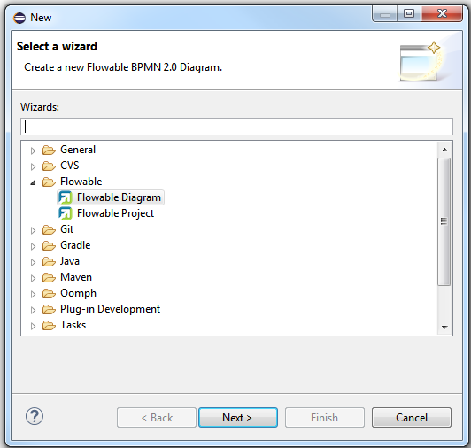

* Flowable Designer在创建新的Flowable流程图时，会创建一个.bpmn文件。当使用Flowable Diagram Editor（Flowable流程图编辑器）视图打开时，将提供图形化的模型画布与画板。这个文件也可以使用XML编辑器打开，将显示流程定义的BPMN 2.0 XML元素。也就是说，Flowable Designer只用一个文件，既是流程图，也是BPMN 2.0 XML。请注意在早期版本中，不支持使用.bpmn扩展名作为流程定义的部署包。可以使用Flowable Designer的"create deployment artifacts（创建部署包）"功能，生成一个BAR文件，其中有一个.bpmn20.xml文件，包含.bpmn文件的内容。也可以方便的自己重命名。请注意，也可以使用Flowable Diagram Editor打开.bpmn20.xml文件。

image::images/designer.bpmn.file.png[align="center"]

* BPMN 2.0 XML文件导入Flowable Designer会自动显示流程图。只需要将BPMN 2.0 XML文件复制到项目中，并使用Flowable Diagram Editor视图打开它。Flowable Designer使用文件中的BPMN DI信息来创建流程图。如果BPMN 2.0 XML文件中没有BPMN DI信息，会使用Flowable BPMN自动布局模块，创建流程图。

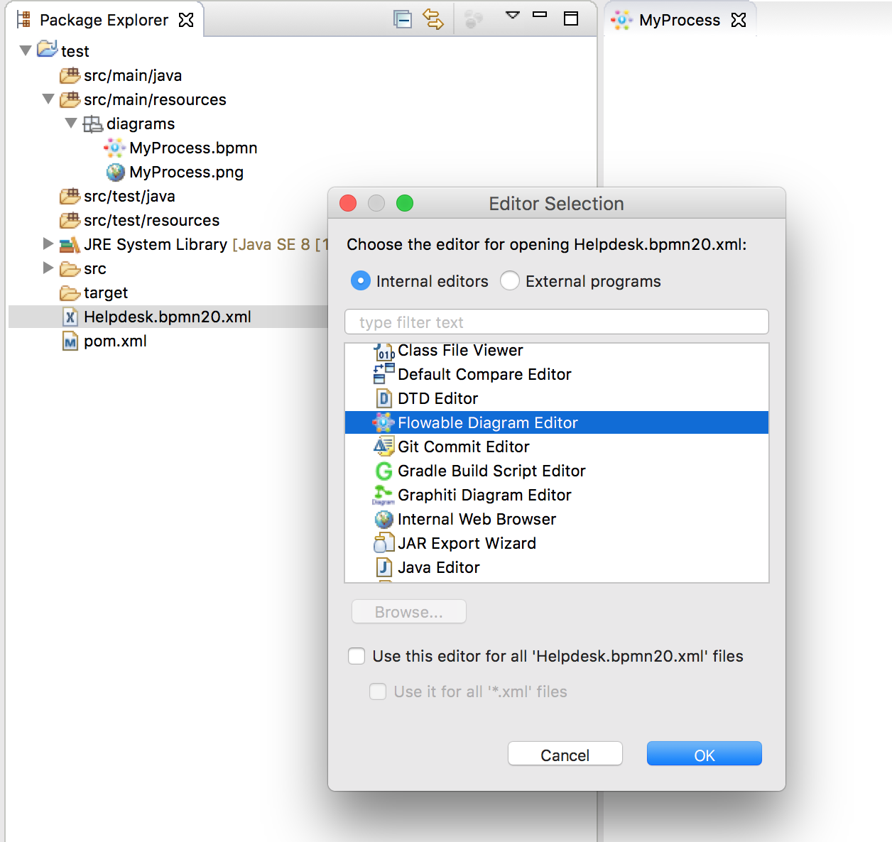

* 可以使用Flowable Designer创建BAR文件或JAR文件进行部署。在包浏览器中的Flowable项目上点击右键，在弹出菜单的下方选择__Create deployment artifacts（创建部署包）__选项。要了解关于Designer部署功能的更多信息，请查看<<eclipseDesignerDeployment,部署>>章节。

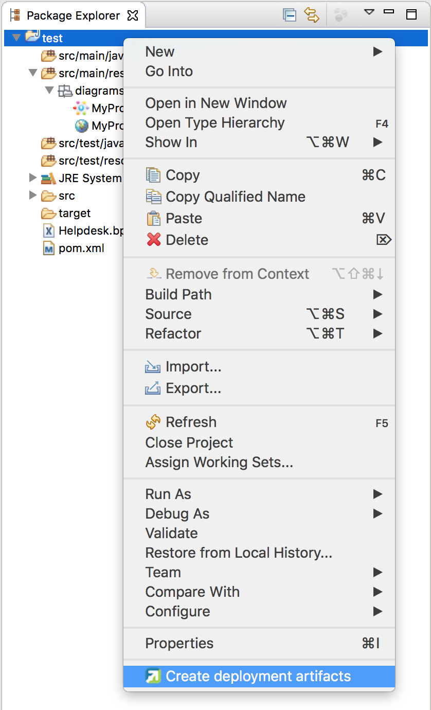

* 生成单元测试（在包浏览器中的BPMN 2.0 XML文件上点击右键，选择__generate unit test 生成单元测试__）。将创建一个单元测试及运行在嵌入式H2数据库上的Flowable配置。这样就可以运行单元测试，来测试你的流程定义。

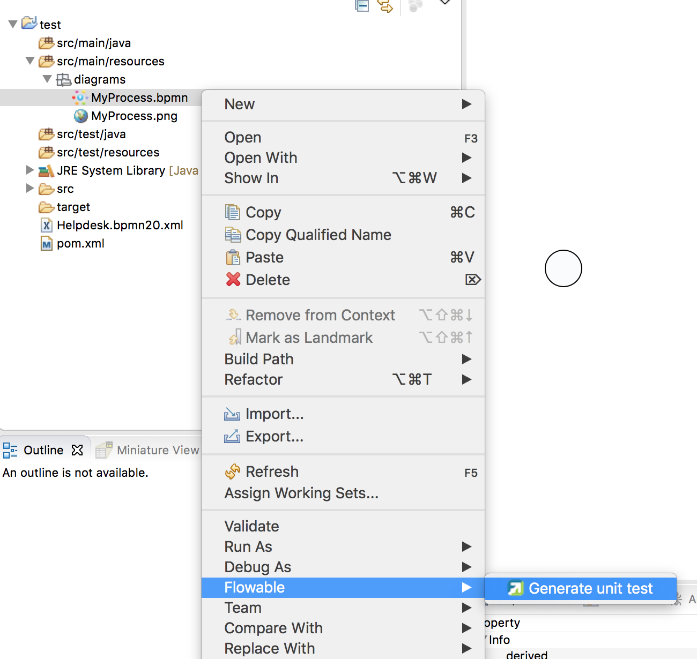

* Flowable项目可以生成为Maven项目。要配置依赖，需要运行__mvn eclipse:eclipse__。请注意在流程设计时不需要Maven依赖。只在运行单元测试时才需要依赖。

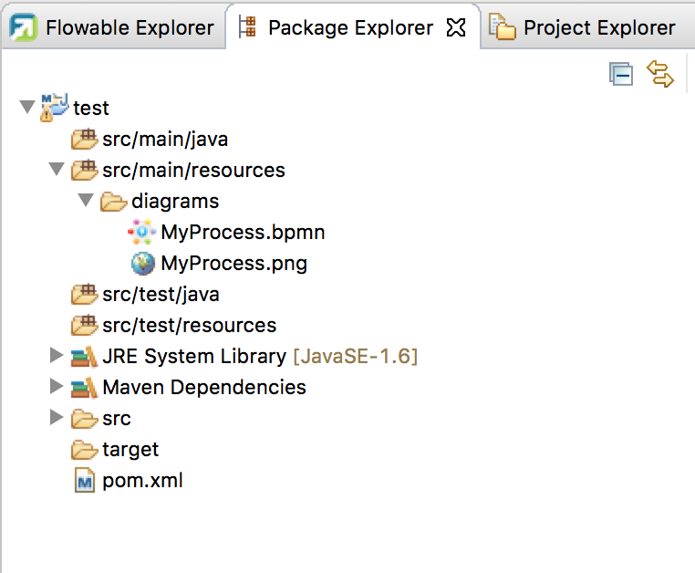

[[eclipseDesignerBPMNFeatures]]

=== Flowable Designer BPMN功能

* 支持空启动事件，错误启动事件，定时器启动事件，空结束事件，错误结束事件，顺序流，并行网关，排他网关，包容网关，事件网关，嵌入式子流程，事件子流程，调用活动，泳池，泳道，脚本任务，用户任务，服务任务，邮件任务，手动任务，业务规则任务，接收任务，定时器边界事件，错误边界事件，信号边界事件，定时器捕获事件，信号捕获事件，信号抛出事件，空抛出事件，以及四个Flowable特殊元素（用户，脚本，邮件任务与启动事件）。

image::images/designer.model.process.png[align="center"]

* 可以在元素上悬停并选择新的任务类型，快速改变任务的类型。

image::images/designer.model.quick.change.png[align="center"]

* 可以在元素上悬停并选择新的元素类型，快速添加新的元素。

image::images/designer.model.quick.new.png[align="center"]

* Java服务任务支持Java类，表达式或代理表达式配置。另外也可以配置字段扩展。

image::images/designer.servicetask.property.png[align="center"]

* 支持泳池与泳道。但由于Flowable会将不同的泳池认作不同的流程定义，因此最好只使用一个泳池。如果使用多个泳池，要小心不要在泳池间画顺序流，否则会在Flowable引擎中部署流程时发生错误。可以在一个泳池中添加任意多的泳道。

image::images/designer.model.poolandlanes.png[align="center"]

* 可以通过填写name参数，为顺序流添加标签。可以决定放置标签的位置，位置将保存为BPMN 2.0 XML DI信息的一部分。

image::images/designer.model.labels.png[align="center"]

* 支持事件子流程。

image::images/designer.model.eventsubprocess.png[align="center"]

* 支持展开嵌入式子流程。也可以在一个嵌入式子流程中加入另一个嵌入式子流程。

image::images/designer.embeddedprocess.canvas.png[align="center"]

* 支持在任务与嵌入式子流程上的定时器边界事件。然而，在Flowable Designer中，在用户任务或嵌入式子流程上使用定时器边界事件最合理。

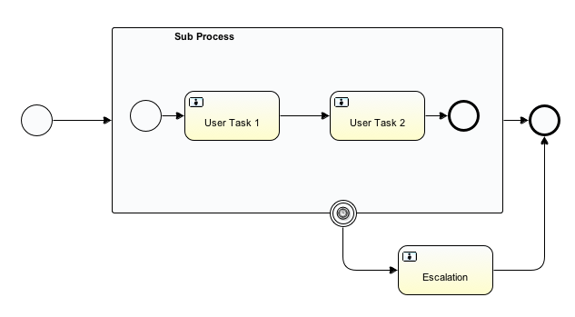

* 支持额外的Flowable扩展，例如邮件任务，用户任务的候选人配置，或脚本任务配置。

image::images/designer.mailtask.property.png[align="center"]

* 支持Flowable执行与任务监听器。也可以为执行监听器添加字段扩展。

image::images/designer.listener.configuration.png[align="center"]

* 支持在顺序流上添加条件。

image::images/designer.sequence.condition.png[align="center"]

[[eclipseDesignerDeployment]]

=== Flowable Designer部署功能

在Flowable引擎上部署流程定义与任务表单并不困难。只需要提供一个包含有流程定义BPMN 2.0 XML文件的BAR文件，与可选的用于在Flowable应用中查看的任务表单和流程图片。在Flowable Designer中，创建BAR文件十分简单。在完成流程实现后，只要在包浏览器中的Flowable项目上点击右键，在弹出菜单下方选择**Create deployment artifacts（创建部署包）**选项。

然后就会创建一个部署目录，包含BAR文件与可能的JAR文件。其中JAR文件包含Flowable项目中的Java类。

image::images/designer.deployment.dir.png[align="center"]

这样就可以在Flowable Admin应用的部署页签中，将这个文件上传至Flowable引擎。

如果项目包含Java类，部署时要多做一些工作。在这种情况下，Flowable Designer的**Create deployment artifacts（创建部署包）**操作也会创建包含编译后类的JAR文件。这个JAR文件必须部署在Flowable Tomcat（或其它容器）安装目录的flowable-XXX/WEB-INF/lib目录下。这样Flowable引擎的classpath就会添加这些类。

[[eclipseDesignerExtending]]

=== 扩展Flowable Designer

可以扩展Flowable Designer提供的默认功能。这段文档介绍了可以使用哪些扩展，如何使用，并提供了一些例子。在建模业务流程时，如果默认功能不能满足需要，需要额外的功能，或有领域专门需求的时候，扩展Flowable Designer就很有用。扩展Flowable Designer分为两个不同领域，扩展画板与扩展输出格式。两者都需要专门的方法，与不同的技术知识。

[NOTE]
====
扩展Flowable Designer需要专业知识，更确切地说，Java编程的知识。取决于你想要创建的扩展类型，你可能需要熟悉Maven，Eclipse，OSGi，Eclipse扩展与SWT。
====

[[eclipseDesignerCustomizingPalette]]

==== 自定义画板

可以自定义为用户建模流程提供的画板。画板是形状的集合，显示在画布的右侧，可以将形状拖放至画布中的流程图上。在默认画板中可以看到，默认形状进行了分组（被称为“抽屉 drawer”），如事件，网关，等等。Flowable Designer提供了两种选择，用于自定义画板中的抽屉与形状：

* 将你自己的形状/节点添加到已有或新建的抽屉
* 禁用Flowable Designer提供的部分或全部BPMN 2.0默认形状，除了连线与选择工具

要自定义画板，需要创建一个JAR文件，并将其加入每一个Flowable Designer的安装目录（后面介绍<<eclipseDesignerApplyingExtension,如何做>>）。这个JAR文件叫做__扩展（extension）__。通过编写扩展中包含的类，就能让Flowable Designer知道需要自定义的形状。为此需要实现特定的接口。Flowable提供了一个集成类库，包含这些接口以及用于扩展的基类。

可以在下列地方找到代码示例：Flowable link:$$https://github.com/flowable/flowable-designer/tree/master/examples$$[源码]，++flowable-designer++仓库下的++examples/money-tasks++目录。

[NOTE]
====
可以使用你喜欢的任何工具设置项目，并使用你选择的构建工具构建JAR。在下面的介绍中，假设使用Eclipse Mars或Neon，并使用Maven（3.x）作为构建工具。但任何设置都可以创建相同的结果。
====

[[_extension_setup_eclipse_maven]]
===== 设置扩展 (Eclipse/Maven)

下载并解压缩link:$$http://www.eclipse.org/downloads$$[Eclipse]（应该可以使用最新版本），与link:$$http://maven.apache.org/download.html$$[Apache Maven]近期的版本（3.x）。如果使用2.x版本的Maven，可能会在构建项目时遇到错误，因此请确保版本是最新的。我们假设你已经熟悉Eclipse中的基本功能以及Java编辑器。可以使用Eclipse的Maven功能，或直接从命令行运行Maven命令。

在Eclipse中创建一个新项目。可以是通用类型项目。在项目的根路径创建一个++pom.xml++文件，以包含Maven项目配置。同时创建++src/main/java++与++src/main/resources++目录，这是Maven约定的Java源文件与资源文件目录。打开++pom.xml++文件并添加下列行：

[source,xml,linenums]
----
<project
  xmlns="http://maven.apache.org/POM/4.0.0"
  xmlns:xsi="http://www.w3.org/2001/XMLSchema-instance"
  xsi:schemaLocation="http://maven.apache.org/POM/4.0.0 http://maven.apache.org/maven-v4_0_0.xsd">

  <modelVersion>4.0.0</modelVersion>

  <groupId>org.acme</groupId>
  <artifactId>money-tasks</artifactId>
  <version>1.0.0</version>
  <packaging>jar</packaging>
  <name>Acme Corporation Money Tasks</name>
...
</project>
----

可以看到，这只是一个基础的pom.xml文件，为项目定义了一个++groupId++、++artifactId++与++version++。我们会创建一个定制项，包含一个money业务要用的自定义节点。

在++pom.xml++文件中为项目添加这些集成库依赖：

[source,xml,linenums]
----
<dependencies>
  <dependency>
    <groupId>org.flowable.designer</groupId>
    <artifactId>org.flowable.designer.integration</artifactId>
    <version>5.22.0</version> <!-- 使用当前的Flowable Designer版本 -->
    <scope>compile</scope>
  </dependency>
</dependencies>
...
<repositories>
  <repository>
      <id>Flowable</id>
   </repository>
</repositories>
----

最后，在++pom.xml++文件中，添加++maven-compiler-plugin++配置，设置Java源码级别为1.5以上（参见下面的代码片段）。要使用注解需要这个配置。也可以为Maven包含用于生成JAR的++MANIFEST.MF++文件。这不是必须的，但可以在这个manifest中使用特定参数，为你的扩展提供名字（这个名字可以在设计器的特定位置显示，主要用于在设计器中有多个扩展时使用）。如果想要这么做，在++pom.xml++中添加下列代码片段：

[source,xml,linenums]
----
<build>
  <plugins>
    <plugin>
      <artifactId>maven-compiler-plugin</artifactId>
      <configuration>
        <source>1.8</source>
        <target>1.8</target>
        <showDeprecation>true</showDeprecation>
        <showWarnings>true</showWarnings>
        <optimize>true</optimize>
      </configuration>
    </plugin>
    <plugin>
      <groupId>org.apache.maven.plugins</groupId>
      <artifactId>maven-jar-plugin</artifactId>
      <version>2.3.2</version>
      <configuration>
        <archive>
          <index>true</index>
          <manifest>
            <addClasspath>false</addClasspath>
            <addDefaultImplementationEntries>true</addDefaultImplementationEntries>
          </manifest>
          <manifestEntries>
            <FlowableDesigner-Extension-Name>Acme Money</FlowableDesigner-Extension-Name>
          </manifestEntries>
        </archive>
      </configuration>
    </plugin>
  </plugins>
</build>
----

扩展的名字使用++FlowableDesigner-Extension-Name++参数描述。现在只剩下让Eclipse按照++pom.xml++的指导设置项目。因此打开命令行，并转到Eclipse工作空间中你项目的根目录。然后执行下列Maven命令：

----
mvn eclipse:eclipse
----

等待构建完成。刷新项目（使用项目上下文菜单（右键点击），并选择++Refresh 刷新++）。现在Eclipse项目中应该已经建立了++src/main/java++与++src/main/resources++源码目录。

[NOTE]
====
当然也可以使用link:$$http://www.eclipse.org/m2e$$[m2eclipse]插件，并简单地在项目的上下文菜单（右键点击）中启用Maven依赖管理。然后在项目的上下文菜单中选择++Maven++ > ++Update project configuration（更新项目配置）++。这也将配置源代码目录。
====

这就完成了配置。现在可以开始为Flowable Designer创建自定义项了！

[[eclipseDesignerApplyingExtension]]

===== 在Flowable Designer中应用你的扩展

你也许想知道如何将你的扩展加入Flowable Designer，以便应用你的自定义项。需要这些步骤：

* 创建扩展JAR（例如，使用Maven构建时，在项目中运行mvn install）后，需要将扩展传递至Flowable Designer安装的计算机；
* 将扩展存储在硬盘上，方便记忆的位置。__请注意：__必须保存在Flowable Designer的Eclipse工作空间之外——将扩展保存在工作空间内，会导致弹出错误消息弹框，扩展将不可用；
* 启动Flowable Designer，从菜单中，选择++Window++ > ++Preferences++，或++Eclipse++ > ++Preferences++
* 在Preferences界面，键入++user++作为关键字。将可以看到在Eclipse中++Java++段落内，++User Libraries++的选项。

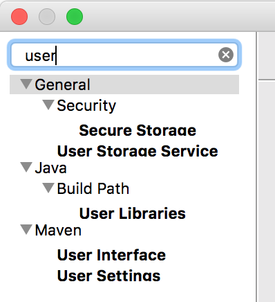

* 选择++User Libraries++选项，将在右侧显示树形界面，可以添加库。应该可以看到一个默认组，可以用于添加Flowable Designer的扩展（根据Eclipse安装不同，也可能看到几个其他的）。

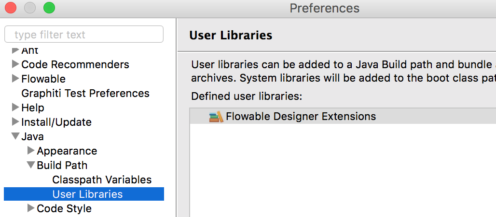

* 选择++Flowable Designer Extensions++组，并点击++Add JARs...++或++Add External JARs...++按钮。跳转至存储扩展的目录，并选择希望添加的扩展文件。完成后，配置界面会将扩展作为++Flowable Designer Extensions++组的成员进行显示，像下面这样。

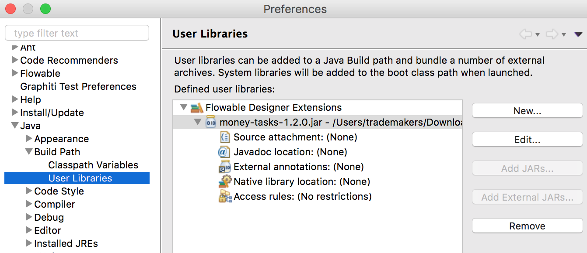

* 点击++OK++按钮保存并关闭配置对话框。++Flowable Designer Extensions++会自动添加至你创建的新Flowable项目。可以在导航条或包管理器的项目树下的用户库条目中看到。如果工作空间中已经有了Flowable项目，也可以看到组中显示了新扩展，像下面这样。

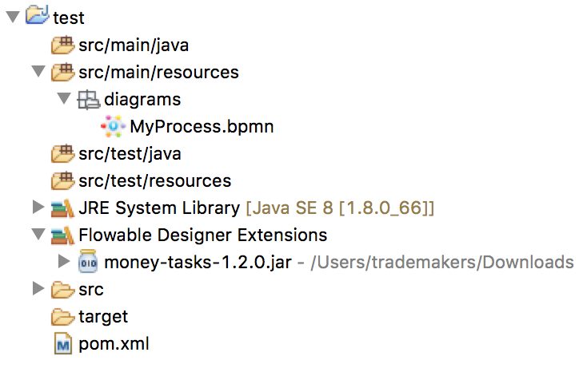

打开的流程图将在其画板上显示新扩展的图形（或者禁用部分图形，取决于扩展中的配置）。如果已经打开了流程图，关闭并重新打开就能在画板上看到变化。

[[_adding_shapes_to_the_palette]]
===== 为画板添加图形

项目配置完后，可以很轻松的为画板添加图形。每个添加的图形都表现为JAR中的一个类。请注意这些类并不是Flowable引擎运行时会使用的类。在扩展中可以为每个图形描述Flowable Designer可用的参数。在这些图形中，也可以定义运行时特性，并将由引擎在流程实例到达该节点时使用。运行时特性可以使用任何Flowable对普通++ServiceTask++支持的选项。查看<<eclipseDesignerConfiguringRuntime,这个章节>>了解更多信息。

图形的类是简单的Java类，加上一些注解。这个类需要实现++CustomServiceTask++接口，但不应该直接实现这个接口，而应该扩展++AbstractCustomServiceTask++基类（目前必须直接扩展这个类，而不能在中间使用abstract类）。在这个类的Javadoc中，可以看到其默认提供的，与需要覆盖的方法介绍。覆盖可以实现很多功能，例如为画板及画布中的图形提供图标（两个可以不一样），或者指定你希望节点实现的基图形（活动，时间，网关）。

[source,java,linenums]
----
/**
 * @author John Doe
 * @version 1
 * @since 1.0.0
 */
public class AcmeMoneyTask extends AbstractCustomServiceTask {
...
}
----

需要实现++getName()++方法，来决定节点在画板上的名字。也可以将节点放在自己的抽屉中，并提供图标，只需要覆盖++AbstractCustomServiceTask++的对应方法就可以。如果希望提供图标，请确保放在JAR的++src/main/resources++包中，需要是16X16像素的JPEG或PNG格式图片。你要提供的路径是到这个目录的相对路径。

可以通过在类中添加成员，并使用++@Property++注解，来为形状添加参数。像这样：

[source,java,linenums]
----
@Property(type = PropertyType.TEXT, displayName = "Account Number")
@Help(displayHelpShort = "提供一个账户编码 Provide an account number", displayHelpLong = HELP_ACCOUNT_NUMBER_LONG)
private String accountNumber;
----

可以使用多种++PropertyType++值，在<<eclipseDesignerPropertyTypes,这个章节>>中详细描述。可以通过将required属性设置为true，将一个字段设为必填。如果用户没有填写这个字段，将会提示消息，背景也会变红。

如果想要调整类中多个参数在参数界面上的显示顺序，需要指定++@Property++注解的order属性。

可以看到有个++@Help++注解，它用于为用户提供一些填写字段的指导。也可以在类本身上使用++@Help++注解——这个信息将在显示给用户的参数表格最上面显示。

下面是++MoneyTask++详细介绍的列表。添加了一个备注字段，也可以看到节点包含了一个图标。

[source,java,linenums]
----
/**
 * @author John Doe
 * @version 1
 * @since 1.0.0
 */
@Runtime(javaDelegateClass = "org.acme.runtime.AcmeMoneyJavaDelegation")
@Help(displayHelpShort = "创建一个新的账户 Creates a new account", displayHelpLong = 
    "使用给定的账户编码，创建一个新的账户 Creates a new account using the account number specified")
public class AcmeMoneyTask extends AbstractCustomServiceTask {

  private static final String HELP_ACCOUNT_NUMBER_LONG = 
      "提供一个可用作账户编码的编码。 Provide a number that is suitable as an account number.";

  @Property(type = PropertyType.TEXT, displayName = "Account Number", required = true)
  @Help(displayHelpShort = "提供一个账户编码 Provide an account number", displayHelpLong = HELP_ACCOUNT_NUMBER_LONG)
  private String accountNumber;

  @Property(type = PropertyType.MULTILINE_TEXT, displayName = "Comments")
  @Help(displayHelpShort = "提供备注 Provide comments", displayHelpLong = 
      "可以为节点添加备注，以提供详细说明。 You can add comments to the node to provide a brief description.")
  private String comments;

  @Override
  public String contributeToPaletteDrawer() {
    return "Acme Corporation";
  }

  @Override
  public String getName() {
    return "Money node";
  }

  @Override
  public String getSmallIconPath() {
    return "icons/coins.png";
  }
}
----

如果使用这个图形扩展Flowable Designer，画板与相应的图形将像是这样：

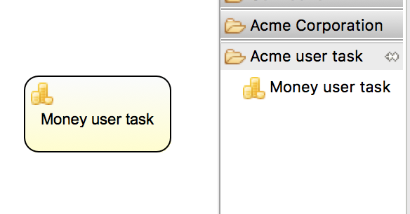

money任务的参数界面在下面显示。请注意++accountNumber++字段的必填信息。

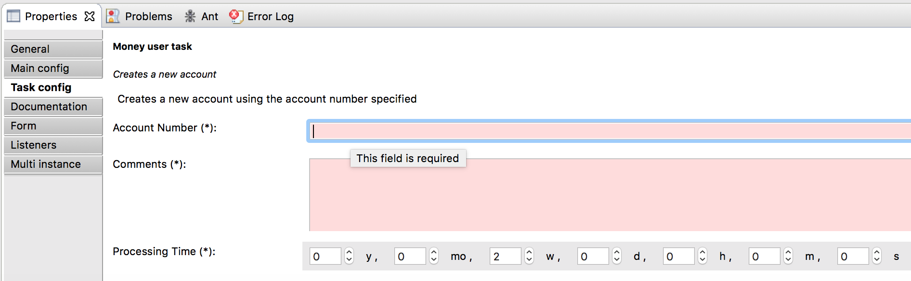

在创建流程图、填写参数字段时，用户可以使用静态文本，或者使用流程变量的表达式（如"This little piggy went to ${piggyLocation}"）。一般来说，用户可以在text字段自由填写任何文本。如果你希望用户使用表达式，并（使用++@Runtime++）为++CustomServiceTask++添加运行时行为，请确保在代理类中使用++Expression++字段，以便表达式可以在运行时正确解析。可以在<<eclipseDesignerConfiguringRuntime,这个章节>>找到更多关于运行时行为的信息。

字段的帮助信息由每个参数右侧的按钮提供。点击该按钮将弹出显示下列内容。

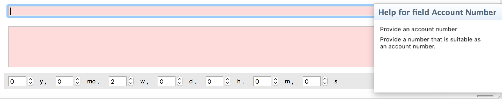

[[eclipseDesignerConfiguringRuntime]]

====== 配置自定义服务任务的运行时执行

当设置好字段，并将扩展应用至Designer后，用户就可以在建模流程时，配置服务任务的这些参数。在大多数情况下，会希望在Flowable执行流程时，使用这些用户配置参数。要做到这一点，必须告诉Flowable，当流程到达你++CustomServiceTask++时，需要使用哪个类。

有一个特别的注解，++@Runtime++，用于指定++CustomServiceTask++的运行时特性。这里有些如何使用的例子：

[source,java,linenums]
----
@Runtime(javaDelegateClass = "org.acme.runtime.AcmeMoneyJavaDelegation")
----

使用时，++CustomServiceTask++将会表现为流程建模BPMN中的一个普通的++ServiceTask++。Flowable提供了<<bpmnJavaServiceTask,多种方法>>定义++ServiceTask++的运行时特性。因此，++@Runtime++可以使用Flowable提供的三个属性中的一个：

* ++javaDelegateClass++在BPMN输出中映射为++flowable:class++。指定一个实现了++JavaDelegate++的类的全限定类名。
* ++expression++在BPMN输出中映射为++flowable:expression++。指定一个需要执行的方法的表达式，例如一个Spring Bean中的方法。当使用这个选项时，__不应__在字段上指定任何++@Property++注解。下面有更详细的说明。
* ++javaDelegateExpression++在BPMN输出中映射为++flowable:delegateExpression++。指定一个实现了++JavaDelegate++的类的表达式。

如果在类中为Flowable提供了可以注入的成员，就可以将用户的参数至注入到运行时类中。名字需要与++CustomServiceTask++的成员名一致。查看用户手册的<<serviceTaskFieldInjection,这个部分>>了解更多信息。请注意从Designer的5.11.0版本开始，可以为动态字段值使用++Expression++接口。这意味着Flowable Designer中参数的值必须要是表达式，并且这个表达式将在之后注入++JavaDelegate++实现类的++Expression++参数中。

[NOTE]
====

可以在++CustomServiceTask++的成员上使用++@Property++注解，但如果使用++@Runtime++的++expression++属性，则++@Property++注解将不会生效。原因是指定的表达式将被Flowable尝试解析为__方法__，而不是类。因此，不会有对类的注入。如果在++@Runtime++注解中使用++expression++，则注解为++@Property++的成员将被Designer忽略。Designer不会将它们渲染为节点参数页面的可编辑字段，也不会为这些参数在流程的BPMN中生成输出。
====

[NOTE]
====
请注意不应该在你的扩展JAR中包括运行时类，因为它与Flowable库是分离的。Flowable需要在运行时能够找到它们，因此需要将其放在Flowable引擎的classpath中。
====

Designer代码树中的示例项目包含了配置++@Runtime++的不同选项的例子。可以从查看money-tasks项目开始。引用代理类的示例在money-delegates项目中。

[[eclipseDesignerPropertyTypes]]

===== 参数类型

这个章节介绍了++CustomServiceTask++能够使用的参数类型，可以将类型设置为++PropertyType++的值。

====== PropertyType.TEXT

创建如下所示的单行文本字段。可以是必填字段，并将验证消息作为提示信息显示。验证失败会将字段的背景变为浅红色。

====== PropertyType.MULTILINE_TEXT

创建如下所示的多行文本字段（高度固定为80像素）。可以是必填字段，并将验证消息作为提示信息显示。验证失败会将字段的背景变为浅红色。

image::images/designer.property.multiline.text.invalid.png[align="center"]

====== PropertyType.PERIOD

创建一个组合编辑框，可以使用转盘控件编辑每一个单位的数量，来指定一段时间长度，结果如下所示。可以是必填字段（含义是不能所有的值都是0，也就是至少有一个部分要有非零值），并将验证消息作为提示信息显示。验证失败会将整个字段的背景变为浅红色。字段的值保存为1y 2mo 3w 4d 5h 6m 7s格式的字符串，代表1年，2月，3周，4天，6分钟及7秒。即使有部分为0，也总是存储整个字符串。

image::images/designer.property.period.png[align="center"]

====== PropertyType.BOOLEAN_CHOICE

创建一个单独的boolean复选框，或者开关选择。请注意可以在++Property++注解上指定++required++属性，但不会生效，不然用户就无法选择是否选中复选框。流程图中存储的值为java.lang.Boolean.toString(boolean)，其结果为"true"或"false"。

image::images/designer.property.boolean.choice.png[align="center"]

====== PropertyType.RADIO_CHOICE

创建如下所示的一组单选按钮。选中任何一个单选按钮都自动排除任何其他的选择（也就是说，单选）。可以是必填字段，并将验证消息作为提示信息显示。验证失败会将组的背景变为浅红色。

这个参数类型需要注解的类成员同时使用++@PropertyItems++注解（例如如下所示）。可以使用这个额外的注解，以字符串数组的方式，指定条目的列表。需要为每一个条目添加两个数组项：第一个，用于显示的标签；第二个，用于存储的值。

[source,java,linenums]
----
@Property(type = PropertyType.RADIO_CHOICE, displayName = "Withdrawl limit", required = true)
@Help(displayHelpShort = "最大每日提款限额 The maximum daily withdrawl amount ", 
    displayHelpLong = "选择从该账户中每日最大能提取的额度。 Choose the maximum daily amount that can be withdrawn from the account.")
@PropertyItems({ LIMIT_LOW_LABEL, LIMIT_LOW_VALUE, LIMIT_MEDIUM_LABEL, LIMIT_MEDIUM_VALUE, 
    LIMIT_HIGH_LABEL, LIMIT_HIGH_VALUE })
private String withdrawlLimit;
----

image::images/designer.property.radio.choice.png[align="center"]

image::images/designer.property.radio.choice.invalid.png[align="center"]

====== PropertyType.COMBOBOX_CHOICE

创建如下所示的，带有固定选项的下拉框。可以是必填字段，并将验证消息作为提示信息显示。验证失败会将下拉框的背景变为浅红色。

这个参数类型需要注解的类成员同时使用++@PropertyItems++注解（例如如下所示）。可以使用这个额外的注解，以字符串数组的方式，指定条目的列表。需要为每一个条目添加两个数组项：第一个，用于显示的标签；第二个，用于存储的值。

[source,java,linenums]
----
@Property(type = PropertyType.COMBOBOX_CHOICE, displayName = "Account type", required = true)
@Help(displayHelpShort = "账户的类型 The type of account", 
    displayHelpLong = "从选项列表中选择账户的类型 Choose a type of account from the list of options")
@PropertyItems({ ACCOUNT_TYPE_SAVINGS_LABEL, ACCOUNT_TYPE_SAVINGS_VALUE, ACCOUNT_TYPE_JUNIOR_LABEL, 
    ACCOUNT_TYPE_JUNIOR_VALUE, ACCOUNT_TYPE_JOINT_LABEL, ACCOUNT_TYPE_JOINT_VALUE, 
    ACCOUNT_TYPE_TRANSACTIONAL_LABEL, ACCOUNT_TYPE_TRANSACTIONAL_VALUE, ACCOUNT_TYPE_STUDENT_LABEL, 
    ACCOUNT_TYPE_STUDENT_VALUE, ACCOUNT_TYPE_SENIOR_LABEL, ACCOUNT_TYPE_SENIOR_VALUE })
private String accountType;
----

image::images/designer.property.combobox.choice.png[align="center"]

====== PropertyType.DATE_PICKER

创建如下所示的日期选择控件。可以是必填字段，并将验证消息作为提示信息显示（请注意，这个控件会自动填入当前系统时间，因此值很难为空）。验证失败会将控件的背景变为浅红色。

这个参数类型需要注解的类成员同时使用++@DatePickerProperty++注解（例如如下所示）。可以使用这个额外的注解，指定在流程图中存储日期时使用的日期格式，以及要用于显示的日期选择类型。这些属性都是可选的，当没有指定时会使用默认值（++DatePickerProperty++注解的静态变量）。++dateTimePattern++属性应该使用++SimpleDateFormat++类支持的格式。当使用++swtStyle++属性时，应该指定++SWT++的++DateTime++控件支持的整形值，因为将使用这个控件渲染这个类型的参数。

[source,java,linenums]
----
@Property(type = PropertyType.DATE_PICKER, displayName = "Expiry date", required = true)
@Help(displayHelpShort = "账户过期的日期 The date the account expires.",
    displayHelpLong = "选择一个日期，如果账户未在该日期前延期，则将过期。Choose the date when the account will expire if not extended before the date.")
@DatePickerProperty(dateTimePattern = "MM-dd-yyyy", swtStyle = 32)
private String expiryDate;
----

image::images/designer.property.date.picker.png[align="center"]

====== PropertyType.DATA_GRID

创建一个如下所示的数据表格控件。数据表格可以让用户输入任意行数据，并为每一行输入固定列数的值（每一组行列的组合代表一个单元格）。用户可以添加与删除行。

这个参数类型需要注解的类成员同时使用++@DataGridProperty++注解（例如如下所示）。可以使用这个额外的注解，指定数据表格的细节属性。需要用++itemClass++属性引用另一个类，来决定表格中有哪些列。Flowable Designer期望其成员类型为++List++。按照约定，可以将++itemClass++属性的类用作其泛型类型。如果，例如，在表格中编辑一个杂货清单，用++GroceryListItem++类定义表格的列。在++CustomServiceTask++中，可以这样引用它：

[source,java,linenums]
----
@Property(type = PropertyType.DATA_GRID, displayName = "Grocery List")
@DataGridProperty(itemClass = GroceryListItem.class)
private List<GroceryListItem> groceryList;
----

与++CustomServiceTask++一样，"itemClass"可以使用相同的注解指定字段类型（除了数据表格）。目前支持++TEXT++，+$$MULTILINE_TEXT$$+ 与++PERIOD++。你会注意到不论其++PropertyType++是什么，表格都会为每个字段创建一个单行文本控件。这是为了表格保持整洁与可读。如果考虑下++PERIOD++这种++PropertyType++的显示模式，就可以想象出它绝不适合在表格的单元格中显示。对于 +$$MULTILINE_TEXT$$+ 与++PERIOD++，会为每个字段添加双击机制，并会为该++PropertyType++弹出更大的编辑器。数值将在用户点击OK后存储至字段，因此可以在表格中显示。

必选属性使用与普通++TEXT++字段类似的方式处理，当任何字段失去焦点时，会验证整个表格。验证失败的单元格，背景色将变为浅红色。

默认情况下，这个组件允许用户添加行，但不能决定行的顺序。如果希望允许排序，需要将++orderable++属性设置为true，这将在每一行末尾启用按钮，以将该行在表格内上移或下移。

[NOTE]
====
目前，这个参数类型不能正确注入运行时类。
====

image::images/designer.property.datagrid.png[align="center"]

[[_disabling_default_shapes_in_the_palette]]
===== 在画板中禁用默认图形

这种自定义需要在你的扩展中引入一个实现了++DefaultPaletteCustomizer++接口的类。不应该直接实现这个接口，而要扩展++AbstractDefaultPaletteCustomizer++基类。目前，这个类不提供任何功能，但++DefaultPaletteCustomizer++未来的版本中会提供更多功能，这样基类将提供更多合理的默认值。因此最好使用它的子类，这样你的扩展将可以兼容未来的版本。

扩展++AbstractDefaultPaletteCustomizer++需要实现一个方法，++disablePaletteEntries()++，并必须返回一个++PaletteEntry++值的list。请注意如果从默认集合中移除图形，导致某个抽屉中没有图形，则该抽屉也会被移除。如果需要禁用所有的默认图形，只需要在结果中添加++PaletteEntry.ALL++。作为例子，下面的代码禁用了画板中的手动任务和脚本任务图形。

[source,java,linenums]
----
public class MyPaletteCustomizer extends AbstractDefaultPaletteCustomizer {

  @Override
  public List<PaletteEntry> disablePaletteEntries() {
    List<PaletteEntry> result = new ArrayList<PaletteEntry>();
    result.add(PaletteEntry.MANUAL_TASK);
    result.add(PaletteEntry.SCRIPT_TASK);
    return result;
  }

}
----

应用这个扩展的结果在下图显示。可以看到，在++Tasks++抽屉中不再显示手动任务与脚本任务图形。

image::images/designer.palette.disable.manual.and.script.png[align="center"]

要禁用所有默认图形，需要使用类似下面的代码。

[source,java,linenums]
----
public class MyPaletteCustomizer extends AbstractDefaultPaletteCustomizer {

  @Override
  public List<PaletteEntry> disablePaletteEntries() {
    List<PaletteEntry> result = new ArrayList<PaletteEntry>();
    result.add(PaletteEntry.ALL);
    return result;
  }

}
----

结果像是这样（请注意画板中不再显示默认图形所在的抽屉）：

image::images/designer.palette.disable.all.png[align="center"]

[[_validating_diagrams_and_exporting_to_custom_output_formats]]
==== 验证流程图与输出为自定义格式

除了自定义画板，也可以为Flowable Designer创建扩展，来进行流程图验证，以及将流程图的信息保存为Eclipse工作空间中的自定义资源。可以通过内建的扩展点实现 ，这个章节将介绍如何做。

[NOTE]
====
保存功能最近正在重构。我们仍在开发验证功能。下面的文档记录的是旧的情况，并将在新功能可用后更新。
====

Flowable Designer可以编写用于验证流程图的扩展。默认情况已经可以在工具中验证BPMN结构，但你也可以添加自己的，如果希望验证额外的条目，例如建模约定，或者++CustomServiceTask++中的参数值。这些扩展被称作++Process Validators++。

也可以自定义配置，在Flowable Designer保存流程图时，发布为其它格式。这些扩展被称作++Export Marshallers++，将在每次用户进行保存操作时，由Flowable Designer自动调用。这个行为可以在Eclipse配置对话框中，为每一种扩展检测出的格式，分别启用或禁用。Designer会根据用户的配置，确保在保存流程图时，调用你的++ExportMarshaller++。

通常，会想要将++ProcessValidator++与++ExportMarshaller++一起使用。例如有一些++CustomServiceTask++，带有一些希望在流程中使用的参数。然而，在生成流程前，希望验证其中一些值。联合使用++ProcessValidator++与++ExportMarshaller++是最佳的方式，Flowable Designer也允许你无缝拼接扩展。

要创建一个++ProcessValidator++或++ExportMarshaller++，需要创建与扩展画板不同的扩展类型。原因很简单：你的代码会需访问比集成库中提供的更多的API。特别是，会需要使用Eclipse的类。因此从一开始，就需要创建一个Eclipse插件（可以使用Eclipse的PDE支持完成），并将其打包为自定义Eclipse产品或特性。解释开发Eclipse插件的所有细节，已经不是本用户手册的范畴，因此下面的介绍仅限于扩展Flowable Designer的功能。

扩展包需要依赖下列库：

* org.eclipse.core.runtime
* org.eclipse.core.resources
* org.flowable.designer.eclipse
* org.flowable.designer.libs
* org.flowable.designer.util

可选的，如果希望在扩展中使用，可以通过Designer使用org.apache.commons.lang包。

++ProcessValidator++与++ExportMarshaller++都是通过扩展基类创建的。这些基类从其父类++AbstractDiagramWorker++继承了一些有用的方法。使用这些方法，可以创建在Eclipse问题视图中显示的提示信息，警告，错误标记，以便用户了解错误与重要的信息。可以以++Resources++与++InputStreams++的格式获取流程图的信息，这些信息由++DiagramWorkerContext++提供，在++AbstractDiagramWorker++中可用。

不论是++ProcessValidator++还是++ExportMarshaller++中，做任何事情前最好调用++clearMarkers()++；这将清除任何已有的标记（标记自动连接至操作，清除一个操作的标记不会影响其他操作的标记）。例如：

[source,java,linenums]
----
// 首先清除流程图的标记 Clear markers for this diagram first
clearMarkersForDiagram();
----

也需要使用（++DiagramWorkerContext++中）提供的进度监控，将你的进度报告给用户，因为验证与保存操作可能花费很多时间，而用户只能等待。报告进度需要了解如何使用Eclipse的功能。查看link:$$http://www.eclipse.org/articles/Article-Progress-Monitors/article.html$$[这篇文章]了解详细概念与用法。

[[_creating_a_processvalidator_extension]]
===== 创建ProcessValidator扩展

在你的++plugin.xml++文件中，创建一个++org.flowable.designer.eclipse.extension.validation.ProcessValidator++扩展点的扩展。这个扩展点需要扩展++AbstractProcessValidator++类。

[source,xml,linenums]
----
<?eclipse version="3.6"?>
<plugin>
  <extension
    point="org.flowable.designer.eclipse.extension.validation.ProcessValidator">
    <ProcessValidator
      class="org.acme.validation.AcmeProcessValidator">
    </ProcessValidator>
  </extension>
</plugin>
----

[source,java,linenums]
----
public class AcmeProcessValidator extends AbstractProcessValidator {
}
----

需要实现一些方法。最重要的是实现++getValidatorId()++，为验证器返回全局唯一ID。这将使你可以在++ExportMarshaller++中调用它，或者允许其他++ExportMarshaller++调用你的验证器。实现++getValidatorName()++，为验证器返回逻辑名字。这个名字将在对话框中显示给用户。++getFormatName()++可以返回这个验证器通常验证的流程图类型。

验证工作通过++validateDiagram()++方法实现。从这里开始，就是你自己的功能代码了。然而，通常你会想从获取流程中的所有节点开始，这样就可以迭代访问，收集、比较与验证数据了。这段代码展示了如何进行这些操作：

[source,java,linenums]
----
final EList<EObject> contents = getResourceForDiagram(diagram).getContents();
for (final EObject object : contents) {
  if (object instanceof StartEvent ) {
  // 验证启动事件 Perform some validations for StartEvents
  }
  // 其它节点类型与验证 Other node types and validations
}
----

别忘了在验证过程中调用++addProblemToDiagram()++与/或++addWarningToDiagram()++等等。确保在结束时返回正确的boolean结果，以指示验证成功还是失败。可以由后续调用的++ExportMarshaller++判断下一步操作。

[[_creating_an_exportmarshaller_extension]]
===== 创建ExportMarshaller扩展

在你的++plugin.xml++文件中，创建一个++org.flowable.designer.eclipse.extension.ExportMarshaller++扩展点的扩展。这个扩展点需要扩展++AbstractExportMarshaller++类。这个基类提供了一些在保存为你自己的格式时有用的方法，但最重要的是提供了将资源保存至工作空间，以及调用验证器的功能。

Designer的示例目录下有一个示例实现。这个示例展示了如何使用基类中的方法完成基本操作，例如访问流程图的++InputStream++，使用其++BpmnModel++，以及将资源保存至工作空间。

[source,xml,linenums]
----
<?eclipse version="3.6"?>
<plugin>
  <extension
    point="org.flowable.designer.eclipse.extension.ExportMarshaller">
    <ExportMarshaller
      class="org.acme.export.AcmeExportMarshaller">
    </ExportMarshaller>
  </extension>
  </plugin>
----

[source,java,linenums]
----
public class AcmeExportMarshaller extends AbstractExportMarshaller {
}
----

需要实现一些方法，例如++getMarshallerName()++与++getFormatName()++。这些方法用来为用户显示选项，并在流程对话框中显示信息，因此请确保你返回的描述反映了正在进行的操作。

大部分工作主要在++doMarshallDiagram()++方法中进行。

如果需要先进行一些验证，可以直接从保存器中调用验证器。从验证器可以获得boolean结果，就可以知道验证是否成功。在大多数情况下，在流程图验证失败时不会想要进行保存，但你也可以选择仍然继续，甚至在验证失败时创建不同的资源。

一旦获取了所有需要的数据，就可以调用++saveResource()++方法创建保存有数据的文件。在一个保存器中，可以调用++saveResource()++任意多次；因此一个验证器可以创建多于一个输出文件。

可以使用++AbstractDiagramWorker++类的++saveResource()++方法构建输出资源的文件名。可以使用一些有用的变量用于创建文件名，例如_original-filename__my-format-name.xml。这些变量在Javadocs中描述，通过++ExportMarshaller++接口定义。如果希望自行解析保存位置，也可以在一个字符串（例如一个路径）上使用++resolvePlaceholders()++。++getURIRelativeToDiagram()++会为你调用它。

应该使用提供的进度监控将你的进度报告给用户。link:$$http://www.eclipse.org/articles/Article-Progress-Monitors/article.html$$[这个文章]描述了如何做。
