[[flowableUIApps]]

== Flowable UI应用

Flowable提供了几个web应用，用于演示及介绍Flowable项目提供的功能：

* Flowable IDM: 身份管理应用。为所有Flowable UI应用提供单点登录认证功能，并且为拥有IDM管理员权限的用户提供了管理用户、组与权限的功能。
* Flowable Modeler: 让具有建模权限的用户可以创建流程模型、表单、选择表与应用定义。
* Flowable Task: 运行时任务应用。提供了启动流程实例、编辑任务表单、完成任务，以及查询流程实例与任务的功能。
* Flowable Admin: 管理应用。让具有管理员权限的用户可以查询BPMN、DMN、Form及Content引擎，并提供了许多选项用于修改流程实例、任务、作业等。管理应用通过REST API连接至引擎，并与Flowable Task应用及Flowable REST应用一同部署。

所有其他的应用都需要Flowable IDM提供认证。每个应用的WAR文件可以部署在相同的servlet容器（如Apache Tomcat）中，也可以部署在不同的容器中。由于每个应用使用相同的cookie进行认证，因此应用需要运行在相同的域名下。

应用基于Spring Boot 2.0。也就是说WAR文件实际上可以作为独立应用直接运行。参见Spring Boot文档中的link:$$https://docs.spring.io/spring-boot/docs/current/reference/html/build-tool-plugins-maven-plugin.html#build-tool-plugins-maven-packaging$$[可执行的Jar]章节。

[[uiAppInstallation]]

=== 安装

如前所述，全部四个UI应用可以部署在同一个Tomcat服务器里，并且作为入门，这大概也是最简单的方式。也可以选择只安装Modeler应用，但是必须也要部署、运行Flowable IDM应用。在这个安装指导中，我们会介绍如何将所有的四个应用安装至Tomcat服务。

1. 下载最新稳定版本的link:$$http://tomcat.apache.org$$[Apache Tomcat]。
2. 下载最新稳定版本的link:$$http://www.flowable.org/downloads.html$$[Flowable 6]。
3. 将Flowable发行包中，__wars__文件夹下的flowable-admin.war、flowable-idm.war、flowable-modeler.war与flowable-task.war文件，复制到Tomcat的webapps文件夹下。
4. 运行bin/startup.sh（在Mac OS或Linux下），或bin/startup.bat（在Windows下）脚本，启动Tomcat服务器。
5. 打开web浏览器，访问link:$$http://localhost:8080/flowable-modeler$$[http://localhost:8080/flowable-modeler]。

这样所有的Flowable UI应用都将运行在H2内存数据库下，并且可以在浏览器中看到如下登录界面：

image::images/flowable_idm_login_screen.png[align="center"]

默认情况下，Flowable IDM应用将创建一个具有访问所有Flowable UI应用所需的权限的admin用户。使用admin/test登录，浏览器会跳转至Flowable Modeler应用：

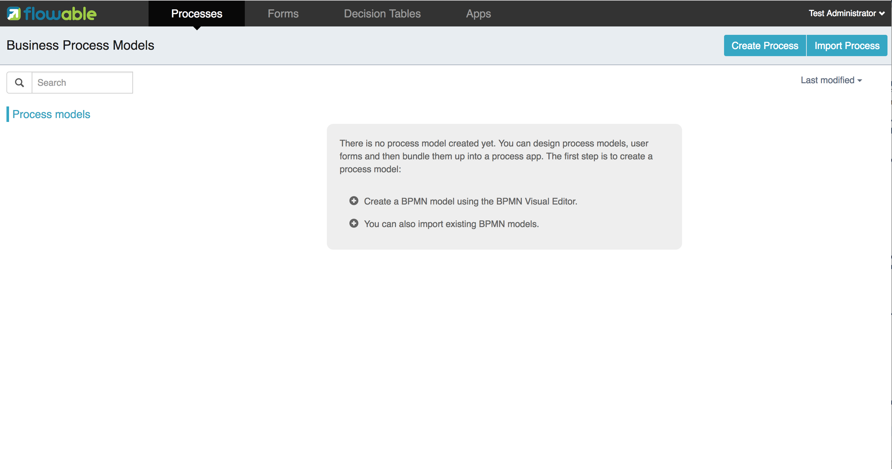

作为可执行的Spring Boot应用，可以直接以独立应用模式运行UI，而不需要应用服务器。
可以像这样启动一个应用：

```
java -jar flowable-idm.war
```

通常会需要将默认的H2内存数据库配置，修改为MySQL或Postgres（或其他持久化数据库）。
可以修改每个应用__WEB-INF/classes/__文件夹下的application.properties。
也可以使用Spring Boot的link:$$https://docs.spring.io/spring-boot/docs/current/reference/html/boot-features-external-config.html$$[显式配置]。
link:$$https://github.com/flowable/flowable-engine/blob/master/modules/flowable-ui-task/flowable-ui-task-app/src/main/resources/application.properties$$[Github]上也提供了配置示例。
要将默认配置修改为MySQL，需要如下修改配置文件：


[source,linenums]
----
spring.datasource.driver-class-name=com.mysql.jdbc.Driver
spring.datasource.url=jdbc:mysql://127.0.0.1:3306/flowable?characterEncoding=UTF-8
spring.datasource.username=flowable
spring.datasource.password=flowable
----

这个配置需要MySQL服务器中有一个flowable数据库，UI应用会自动生成必要的数据库表。对于Postgres，需要做如下修改：

[source,linenums]
----
spring.datasource.driver-class-name=org.postgresql.Driver
spring.datasource.url=jdbc:postgresql://localhost:5432/flowable
spring.datasource.username=flowable
spring.datasource.password=flowable
----

除了修改配置，还需要确保在classpath中有对应的数据库驱动。类似的，可以对每个web应用分别操作，将驱动JAR文件添加到WEB-INF/lib目录下；也可以直接将JAR文件添加到Tomcat的lib目录下。MySQL与Postgres的数据库驱动可以从这里下载：

* MySQL: link:$$https://dev.mysql.com/downloads/connector/j$$[https://dev.mysql.com/downloads/connector/j]
* Postgres: link:$$https://jdbc.postgresql.org/$$[https://jdbc.postgresql.org/]

以独立应用方式运行应用时，可以使用 `loader.path` 参数添加数据库驱动。

```
java -Dloader.path=/location/to/your/driverfolder -jar flowable-idm.war
```

参阅Spring Boot文档link:$$https://docs.spring.io/spring-boot/docs/current/reference/html/executable-jar.html#executable-jar-property-launcher-features$$[`PropertiesLauncher` 功能]介绍了解更多信息。

[[_flowable_ui_applications_configurations]]
=== 配置Flowable UI应用

作为Spring Boot应用，Flowable UI应用可以使用Spring Boot提供的全部参数。
参阅Spring Boot文档的link:$$https://docs.spring.io/spring-boot/docs/current/reference/html/boot-features-external-config.html$$[显式配置]章节，了解如何进行自定义配置。

提示：也可以使用YAML格式的配置文件。

.通用UI应用参数
[cols="4*",options="header"]
|===============
|参数名
|原参数
|默认值
|描述

|flowable.common.app.idm-url
|idm.app.url
|-
|IDM应用的URL，用于获取用户信息与令牌信息的REST GET调用。也用做UI应用重定向的登录页。

|flowable.common.app.idm-redirect-url
|idm.app.redirect.url
|-
|IDM应用的重定向URL，在未设置cookie或cookie失效时，重定向至该页面进行登录。

|flowable.common.app.redirect-on-auth-success
|app.redirect.url.on.authsuccess
|-
|登录成功后需要重定向的页面URL。

|flowable.common.app.role-prefix
|-
|ROLE_
|Spring Security需要的默认角色前缀。

|flowable.common.app.tenant-id
|-
|-
|DefaultTenantProvider所用的静态租户id。modeler用来判断需要将模型存储及发布在哪个租户id下。
 当未设置该值、值为空，或只包含空白时：如果能够获取用户的租户id，则会使用该租户id；否则不使用租户id。

|flowable.common.app.cache-login-tokens.max-age
|cache.login-tokens.max.age
|30
|login token的缓存时间，以秒记。

|flowable.common.app.cache-login-tokens.max-size
|cache.login-tokens.max.size
|2048
|login token缓存的最大尺寸。

|flowable.common.app.cache-login-users.max-age
|cache.login-users.max.age
|30
|login user的缓存时间，以秒记。

|flowable.common.app.cache-login-users.max-size
|cache.login-users.max.size
|2048
|login user缓存的最大尺寸。

|flowable.common.app.cache-users.max-age
|cache.users.max.age
|30
|user的缓存时间，以秒记。

|flowable.common.app.cache-users.max-size
|cache.users.max.size
|2048
|user缓存的最大尺寸。

|flowable.common.app.idm-admin.password
|idm.admin.password
|test
|对IDM REST服务进行REST调用（使用基础认证）的密码。

|flowable.common.app.idm-admin.user
|idm.admin.user
|admin
|对IDM REST服务进行REST调用（使用基础认证）的用户名。

|flowable.rest.app.authentication-mode
|rest.authentication.mode
|verify-privilege
|配置REST API验证用户身份的方式：
 __any-user__ ：用户存在且密码匹配。任何用户都可以进行调用（6.3.0之前的方式）
 __verify-privilege__ :用户存在且密码匹配，并且用户拥有__rest-api__权限
 
|===============

一些旧参数改由Flowable Spring Boot starter（或Spring Boot）进行管理

.由Flowable Spring Boot Starter管理的旧参数
[cols="4*",options="header"]
|===============
|参数名
|原参数
|默认值
|描述

|flowable.async-executor-activate
|engine.process.asyncexecutor.activate
|true
|是否启用异步执行器。

|flowable.database-schema-update
|engine.process.schema.update
|true
|是否执行数据库表结构升级。

|flowable.history-level
|engine.process.history.level
|-
|历史级别。

|flowable.process.servlet.name
|flowable.rest-api-servlet-name
|Flowable BPMN Rest API
|流程servlet的名字。

|flowable.process.servlet.path
|flowable.rest-api-mapping
|/process-api
|流程REST servlet的上下文路径。

|flowable.content.storage.create-root
|contentstorage.fs.create-root
|true
|如果root目录不存在，是否需要创建它？

|flowable.content.storage.root-folder
|contentstorage.fs.root-folder
|-
|存储内容文件（任务附件、表单上传文件等）的root目录。

|flowable.idm.enabled
|flowable.db-identity-used
|true
|是否启动IDM引擎。

|flowable.idm.password-encoder
|security.passwordencoder
|-
|密码加密方式。

|flowable.idm.ldap.base-dn
|ldap.basedn
|-
|查询用户及组的基础DN（__标识名 distinguished name__）。如果用户及组使用不同的基础DN，请改用__user-base-dn__及__group-base-dn__。

|flowable.idm.ldap.enabled
|ldap.enabled
|false
|是否启用LDAP IDM服务。

|flowable.idm.ldap.password
|ldap.password
|-
|连接LDAP系统所用的密码。

|flowable.idm.ldap.port
|ldap.port
|-1
|LDAP系统的端口号。

|flowable.idm.ldap.server
|ldap.server
|-
|LDAP系统所在的服务器地址。例如__ldap://localhost__。

|flowable.idm.ldap.user
|ldap.user
|-
|连接LDAP系统所用的用户ID。

|flowable.idm.ldap.attribute.email
|ldap.attribute.email
|-
|代表用户邮件地址的LDAP属性名。用于查询并将LDAP对象映射至Flowable __org.flowable.idm.api.User__对象。

|flowable.idm.ldap.attribute.first-name
|ldap.attribute.firstname
|-
|代表用户名字的LDAP属性名。用于查询并将LDAP对象映射至Flowable __org.flowable.idm.api.User__对象。

|flowable.idm.ldap.attribute.group-id
|ldap.attribute.groupid
|-
|代表用户组ID的LDAP属性名。用于查询并将LDAP对象映射至Flowable __org.flowable.idm.api.Group__对象。

|flowable.idm.ldap.attribute.group-name
|ldap.attribute.groupname
|-
|代表用户组名称的LDAP属性名。用于查询并将LDAP对象映射至Flowable __org.flowable.idm.api.Group__对象。

|flowable.idm.ldap.attribute.last-name
|ldap.attribute.lastname
|-
|代表用户姓的LDAP属性名。用于查询并将LDAP对象映射至Flowable __org.flowable.idm.api.User__对象。

|flowable.idm.ldap.attribute.user-id
|ldap.attribute.userid
|-
|代表用户ID的LDAP属性名。用于查询并将LDAP对象映射至Flowable __org.flowable.idm.api.User__对象。仅在使用Flowable API查询__org.flowable.idm.api.User__对象时需要设置。

|flowable.idm.ldap.cache.group-size
|ldap.cache.groupsize
|-1
|设置__org.flowable.ldap.LDAPGroupCache__缓存的尺寸。
这是用户所在组的LRU缓存。避免每次需要查询用户所在组时都访问LDAP系统。
若值小于0，则不会启用缓存。默认值为-1，所以不会进行缓存。
请注意组缓存在__org.flowable.ldap.LDAPIdentityServiceImpl__中初始化。
因此，自行实现__org.flowable.ldap.LDAPIdentityServiceImpl__时，请不要忘记添加组缓存功能。

|flowable.idm.ldap.query.all-groups
|ldap.query.groupall
|-
|查询所有组所用的语句。

|flowable.idm.ldap.query.all-users
|ldap.query.userall
|-
|查询所有用户所用的语句。

|flowable.idm.ldap.query.groups-for-user
|ldap.query.groupsforuser
|-
|查询给定用户所在组所用的语句。
 比如：`(&(objectClass=groupOfUniqueNames)(uniqueMember={0}))`
 返回LDAP中所有__groupOfUniqueNames__类、DN为__uniqueMember__的对象。
 上例中，使用{@link java.text.MessageFormat}即__{0}__注入用户ID。
 如果不能通过简单的语句进行查询，可以改用 `org.flowable.ldap.LDAPQueryBuilder` ，进行定制化查询。

|flowable.idm.ldap.query.user-by-full-name-like
|ldap.query.userbyname
|-
|通过全名查询用户所用的语句。
 比如：`(&(objectClass=inetOrgPerson)(\|({0}=**{1}**)({2}={3})))`
 返回LDAP中所有__inetOrgPerson__类、姓或名匹配的对象。
 注入到表达式中的值：{0} : 名字属性名 {1} : 查询文本 {2} : 姓属性名 {3} : 查询文本
 如果不能通过简单的语句进行查询，可以改用 `org.flowable.ldap.LDAPQueryBuilder`，进行定制化查询。

|flowable.idm.ldap.query.user-by-id
|ldap.query.userbyid
|-
|通过ID查询用户所用的语句。
 比如：`(&(objectClass=inetOrgPerson)(uid={0}))`
 返回LDAP中所有__inetOrgPerson__类、__uid__属性值匹配的对象。
 上例中，使用{@link java.text.MessageFormat}即__{0}__注入用户ID。
 如果不能通过简单的语句进行查询，可以改用 `org.flowable.ldap.LDAPQueryBuilder` ，进行定制化查询。

|flowable.mail.server.host
|email.host
|localhost
|邮件服务器地址。

|flowable.mail.server.password
|email.password
|-
|邮件服务器的密码。

|flowable.mail.server.port
|email.port
|1025
|邮件服务器的端口号。

|flowable.mail.server.ssl-port
|email.ssl-port
|1465
|SSL邮件服务器的端口号。

|flowable.mail.server.use-ssl
|email.use-ssl
|false
|是否需要为SMTP协议启用SSL/TLS加密（即SMTPS/POPS）。

|flowable.mail.server.use-tls
|email.use-tls
|false
|是否启用STARTTLS加密。

|flowable.mail.server.username
|email.username
|-
|邮件服务器的用户名。
 为空则不进行认证。

|flowable.process.definition-cache-limit
|flowable.process-definitions.cache.max
|-1
|流程定义缓存的最大数量。
 默认值为-1，即缓存所有流程定义。
|===============

.由Spring Boot管理的旧参数
[cols="4*",options="header"]
|===============
|参数名
|原参数
|默认值
|描述

|spring.datasource.driver-class-name
|datasource.driver
|-
|JDBC驱动的全限定名。默认通过URL自动检测。

|spring.datasource.jndi-name
|datasource.jndi.name
|-
|数据源的JNDI。若设置JNDI，则忽略Class、url、username及password设置。

|spring.datasource.password
|datasource.password
|-
|数据库的登录密码。

|spring.datasource.url
|datasource.url
|-
|数据库的JDBC URL。

|spring.datasource.username
|datasource.username
|-
|数据库的登录用户名

|spring.datasource.hikari.connection-test-query
|datasource.preferred-test-query
|-
|用于验证连接的SQL语句。

|spring.datasource.hikari.connection-timeout
|datasource.connection.timeout
|-
|客户端等待获取连接的最大时间，以毫秒计。如果获取连接超时，会抛出SQLException。

|spring.datasource.hikari.idle-timeout
|datasource.connection.idletimeout
|-
|连接池中连接的最大空闲时间，以毫秒计。
 实际销毁连接前，会多等平均+15秒，最大+30秒的额外时间。
 不会在空闲超时前销毁连接。
 值为0代表连接池不会销毁空闲连接。

|spring.datasource.hikari.max-lifetime
|datasource.connection.maxlifetime
|-
|连接池中连接的最大存活时间。如果连接超过存活时间，即使该连接刚被使用过，也会被连接池销毁。不会销毁正在使用的连接，只会销毁空闲的连接。

|spring.datasource.hikari.maximum-pool-size
|datasource.connection.maxpoolsize
|-
|连接池的最大容量，包括空闲及使用中的连接。这个配置决定了到数据库的实际连接数。如果连接池尺寸到达上限，且没有可用的空闲连接，则getConnection()会等待connectionTimeout设置的时间，然后超时。

|spring.datasource.hikari.minimum-idle
|datasource.connection.minidle
|-
|HikariCP连接池保留的最小空闲连接数量。如果空闲连接数量少于设置，HikariCP会尽最大努力尽快有效地恢复。

|spring.servlet.multipart.max-file-size
|file.upload.max.size
|10MB
|文件的最大尺寸，可以使用“MB”或“KB”后缀。
|===============


.不再使用的旧参数
[cols="2*",options="header"]
|===============
|旧参数
|描述

|datasource.jndi.resource-ref
|Spring Boot不支持配置JNDI resourceRef，而是按名称直接引用。

|email.use-credentials
|如果邮件服务器不使用认证，直接将用户名及密码置空即可。
|===============


[[flowableIDMApp]]

=== Flowable IDM应用

Flowable IDM应用，用于其他三个Flowable web应用的认证与授权。因此如果你想要运行Modeler，Task或者Admin应用，就需要运行IDM应用。Flowable IDM应用是一个简单的身份管理应用，目标是为Flowable web应用提供单点登录能力，并提供定义用户、组与权限的能力。

IDM应用在启动时启动IDM引擎，并按照配置参数中定义的数据源创建IDM引擎所需的身份表。

当Flowable IDM应用部署及启动时，将检查是否在ACT_ID_USER表中有用户。如果没有，将在表中使用 `flowable.common.app.idm-admin.user` 参数创建默认管理员用户。
同时也会为新创建的管理员用户添加Flowable项目中的所有权限：

* access-idm: 提供管理用户、组与权限的权限
* access-admin: 使用户可以登录Flowable Admin应用，管理Flowable引擎，以及访问所有应用的Actuator Endpoint。
* access-modeler: 提供访问Flowable Modeler应用的权限
* access-task: 提供访问Flowable Task应用的权限
* access-rest-api: 提供调用REST API的权限。否则调用会返回403（无权限）HTTP状态码。请注意需要将__flowable.rest.app.authentication-mode__设置为__verify-privilege__，即默认设置。

第一次使用admin/test登录link:$$http://localhost:8080/flowable-idm$$[http://localhost:8080/flowable-idm]时，会显示如下用户总览界面：

image::images/flowable_idm_startup_screen.png[align="center"]

在这个界面中，可以添加、删除与更新用户。组页签用于创建、删除与更新组。在组详情界面中，可以向组添加与删除用户。权限界面为用户与组添加及删除权限：

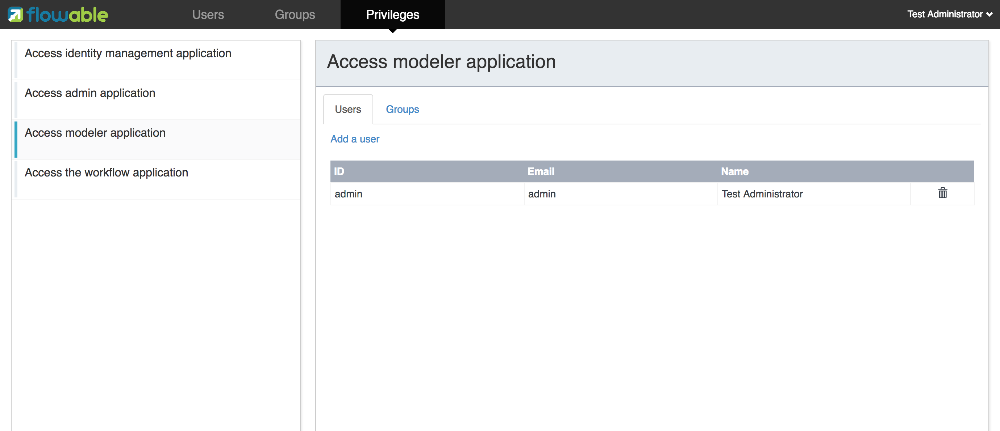

暂时还不能定义新的权限。但是可以为用户与组添加及删除已有的四个权限。

下表是IDM UI应用的专用参数。

.IDM UI应用参数
[cols="4*",options="header"]
|===============
|参数名
|原参数
|默认值
|描述

|flowable.idm.app.bootstrap
|idm.bootstrap.enabled
|true
|是否为IDM应用启用bootstrap。

|flowable.idm.app.rest-enabled
|rest.idm-app.enabled
|true
|启用REST API（指的是使用基础身份认证的API，而不是UI使用的REST API）。

|flowable.idm.app.admin.email
|admin.email
|-
|admin用户的邮箱。

|flowable.idm.app.admin.first-name
|admin.firstname
|-
|admin用户的名字。

|flowable.idm.app.admin.last-name
|admin.lastname
|-
|admin用户的姓。

|flowable.idm.app.admin.password
|admin.password
|-
|admin用户的密码。

|flowable.idm.app.admin.user-id
|admin.userid
|-
|admin用户的ID。

|flowable.idm.app.security.remember-me-key
|security.rememberme.key
|testKey
|Spring Security对密码加密时所用的哈希值。请一定要修改这个参数。

|flowable.idm.app.security.user-validity-period
|cache.users.recheck.period
|30000
|对于可缓存的CustomUserDetailsService服务，缓存用户的时间。

|flowable.idm.app.security.cookie.domain
|security.cookie.domain
|-
|cookie的域。

|flowable.idm.app.security.cookie.max-age
|security.cookie.max-age
|2678400
|cookie的存活时间，以秒记。默认为31天。

|flowable.idm.app.security.cookie.refresh-age
|security.cookie.refresh-age
|86400
|cookie的刷新周期，以秒记。默认为1天。
|===============

除了使用默认的身份表之外，IDM应用也可以使用LDAP服务。
在application.properties文件中（或使用其他配置方式）加入下列配置：

[source,linenums]
----
#
# LDAP
#
flowable.idm.ldap.enabled=true
flowable.idm.ldap.server=ldap://localhost
flowable.idm.ldap.port=10389
flowable.idm.ldap.user=uid=admin, ou=system
flowable.idm.ldap.password=secret
flowable.idm.ldap.base-dn=o=flowable
flowable.idm.ldap.query.user-by-id=(&(objectClass=inetOrgPerson)(uid={0}))
flowable.idm.ldap.query.user-by-full-name-like=(&(objectClass=inetOrgPerson)(|({0}=*{1}*)({2}=*{3}*)))
flowable.idm.ldap.query.all-users=(objectClass=inetOrgPerson)
flowable.idm.ldap.query.groups-for-user=(&(objectClass=groupOfUniqueNames)(uniqueMember={0}))
flowable.idm.ldap.query.all-groups=(objectClass=groupOfUniqueNames)
flowable.idm.ldap.attribute.user-id=uid
flowable.idm.ldap.attribute.first-name=cn
flowable.idm.ldap.attribute.last-name=sn
flowable.idm.ldap.attribute.group-id=cn
flowable.idm.ldap.attribute.group-name=cn
flowable.idm.ldap.cache.group-size=10000
flowable.idm.ldap.cache.group-expiration=180000
----

`flowable.idm.ldap.enabled` 参数设置为true时，需要同时填入其他的LDAP参数。
在这个示例配置中使用Apache Directory的服务器配置 + LDAP查询。
其他LDAP服务器如Active Directory使用不同的配置值。

配置LDAP后将通过LDAP服务器进行认证及从组中获取用户，但仍然从Flowable身份表中获取权限。因此需要确保每一个LDAP用户都在IDM应用中定义了正确的权限。

如果IDM应用配置为使用LDAP，则启动时将检查Flowable身份表中是否存在权限。
（第一次启动时）如果没有权限，则会创建4个默认权限，并为ID为（application.properties或其他配置环境中的） `flowable.common.app.idm-admin.user` 参数的用户赋予这4个权限。
因此请确保 `flowable.common.app.idm-admin.user` 参数设置为有效的LDAP用户，否则将没有人能够登录任何Flowable UI应用。

[[flowableModelerApp]]

=== Flowable Modeler应用

Flowable Modeler用于建模BPMN流程、DMN选择表、表单定义，以及创建应用定义。BPMN Modeler使用与Flowable 5相同的Oryx与Angular架构，只是迁移为独立的Modeler应用中。在使用Flowable Modeler应用时，请确保Flowable IDM应用已经部署并正常运行（用于认证与授权）。

使用自己的账户（或者默认的admin/test用户）登录Modeler应用后(link:$$http://localhost:8080/flowable-modeler$$[http://localhost:8080/flowable-modeler])，可以看到流程总览页面。可以点击Create Process(创建流程)按钮或Import Process(导入流程)按钮，创建新的BPMN流程模型。

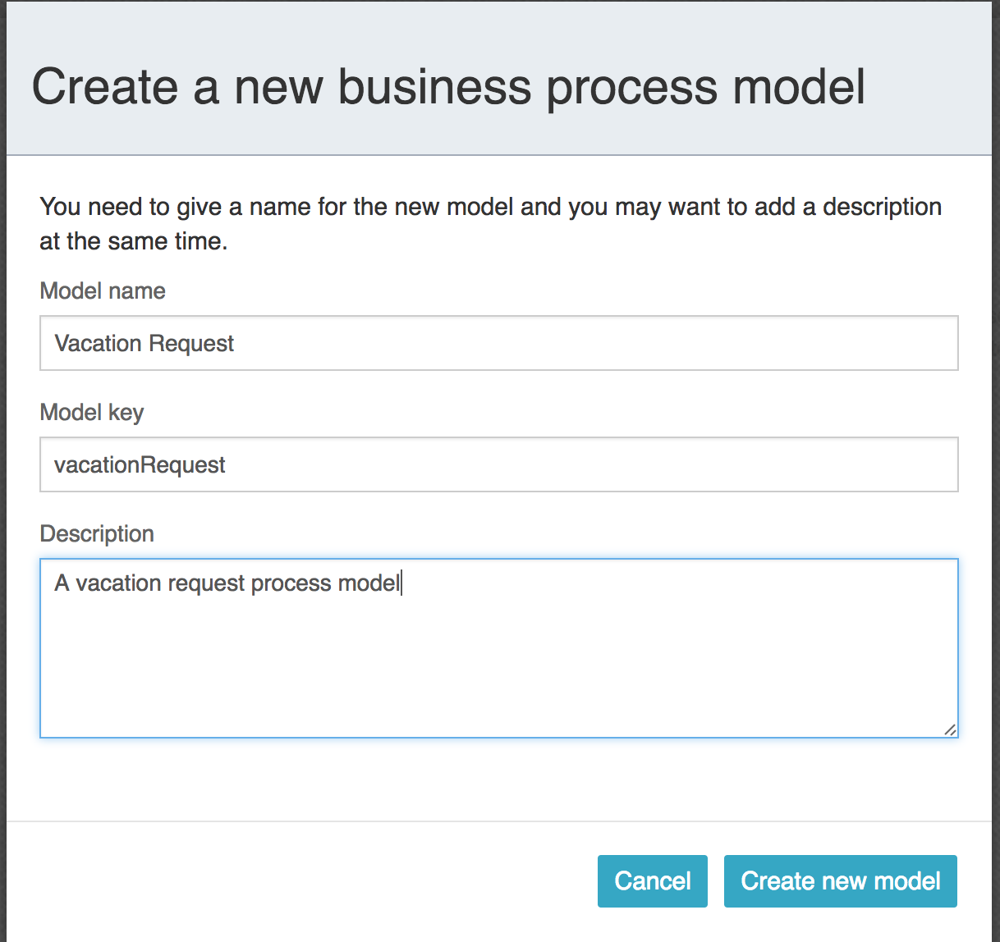

在创建流程模型（以及其他模型）时，需要谨慎选择模型key。模型key是模型仓库中该模型的唯一标识。如果使用了已经存在的模型key，则会显示错误，模型也不会保存。

在弹出窗口中创建模型后，会显示BPMN模型画布。这个BPMN编辑器与Flowable 5中（作为Explorer的组件）的BPMN编辑器十分相像。在设计流程模型时，可以使用Flowable引擎支持的所有BPMN元素。

image::images/flowable_modeler_design_screen.png[align="center"]

BPMN编辑器分为4个部分：

* 画板(Palette): 用于设计流程模型的所有BPMN元素
* 工具条(Toolbar): 修改模型画布的操作。如缩放、布局、保存等
* 模型画布(Model canvas): 在模型画布上拖放BPMN元素，设计流程模型
* 参数面板(Properties panel): 如果没有选择元素，则显示主流程模型的参数；否则显示所选中BPMN元素的参数

用户任务元素的参数面板中有一个__Referenced form(引用表单)__参数。选择这个参数会弹出窗口，使你可以在仓库中选择一个表单定义，或者创建一个新的表单。如果选择创建一个新的表单，会显示一个类似于流程模型创建对话框的弹窗。填入表单名及表单模型key之后，就会打开表单编辑器。

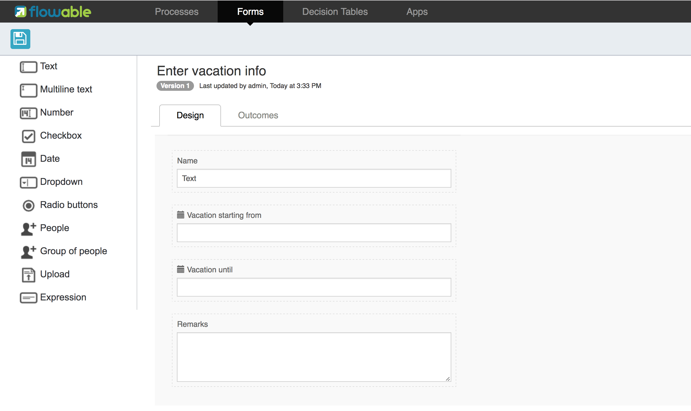

可以从表单画板中将表单字段拖入表单画布。在这个例子中，在表单画布上添加了一个Name（姓名）文本框，两个日期框，以及一个Remarks（说明）多行文本框。在编辑表单字段时，可以配置Label(标签)、Id、Required(是否必填)，以及Placeholder(占位符)。

image::images/flowable_modeler_editfield_popup.png[align="center", width="600"]

id是一个重要的参数。流程使用这个id为表单字段创建流程变量。填写label参数时，会自动为id参数赋值。如果需要的话，也可以选中Override Id?(覆盖Id)复选框，并填入所需的id。

保存表单模型并关闭表单编辑器之后，（如果表单编辑器是从BPMN编辑器打开的话）会自动跳转回流程模型。再次选择用户任务元素，并点击__Referenced form__参数，就可以看到已经将新创建的表单定义附加至用户任务。点击Modeler应用头部的__Form(表单)__页签，也可以看到模型仓库中保存的所有表单定义。

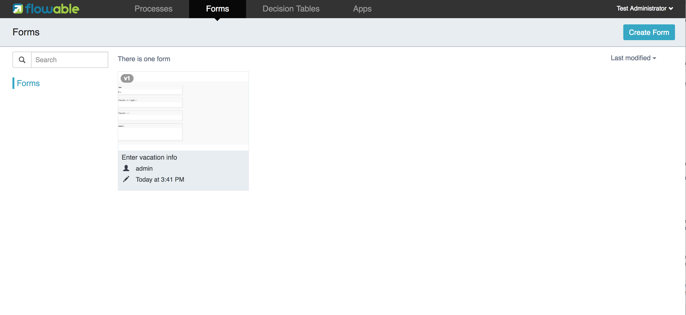

可以打开表单定义的详情界面，查看各表单定义。在详情页面中，可以修改表单名、key及描述，也可以查阅表单模型的修改历史。也可以复制表单定义，创建一个具有相同表单字段的新的表单定义。

接下来，再次打开BPMN编辑器中的vacation request（请假）流程模型，向流程模型中添加一个脚本任务，用于计算假期开始到结束之间的日数。点击__Script form(脚本表单)__参数，填入__groovy__，这样Flowable引擎就会使用Groovy脚本引擎。然后点击__Script(脚本)__参数，并填入用于计算日数的脚本。

image::images/flowable_modeler_script_popup.png[align="center", width="600"]

这样就定义了__amountOfVacationDays__流程变量，接下来可以在流程模型中添加一个选择任务（Decision task）。选择任务用于在Flowable DMN引擎中执行DMN选择表。使用__Decision table reference(引用选择表)__参数，创建一个新的选择表模型，并打开DMN编辑器。

image::images/flowable_modeler_dmneditor_screen.png[align="center"]

DMN编辑器提供了一个列表式的编辑器。包括输入列——使用流程中的流程变量定义输入条件；以及输出列——定义输出变量。在这个简单的例子里，只使用一个输入列，并使用__amountOfVacationDays__变量。如果天数少于10，__managerApprovalNeeded__变量返回值false。否则返回true。可以定义多个输入列，每条规则也可以有多个输入条件。也可以将一个输入列置空，代表其永远为true。也可以定义一个或多个输出变量。

DMN选择表定义的另一个重要部分是命中策略(Hit Policy)。目前，Flowable支持第一(First)与任意(Any)命中策略。对于第一命中策略，DMN会返回第一条计算为true的规则定义的输出变量，并停止计算。对于任意命中策略，会计算所有的规则，并输出计算为true的最后一条规则定义的输出变量。

保存并关闭DMN编辑器后，Modeler应用跳转回BPMN编辑器，并将新创建的DMN选择表附加至选择任务。在BPMN XML中生成如下的选择任务：

[source,xml,linenums]
----
<serviceTask id="decisionTask" name="Is manager approval needed?" flowable:type="dmn">
    <extensionElements>
        <flowable:field name="decisionTableReferenceKey">
            <flowable:string><![CDATA[managerApprovalNeeded]]></flowable:string>
        </flowable:field>
    </extensionElements>
</serviceTask>
----

这样就可以创建带有一个条件顺序流的排他网关，以使用DMN引擎的计算结果，即__managerApprovalNeeded__变量。

image::images/flowable_modeler_sequenceflowcondition_popup.png[align="center", width="500"]

完整的BPMN流程模型为：

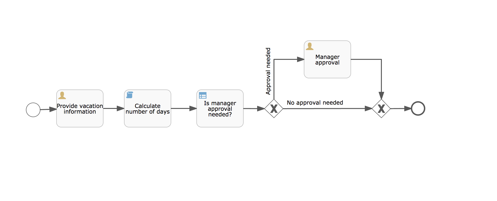

完成流程模型之后，就可以创建应用定义(app definition)，将一个或多个流程模型及关联的模型（如选择表和表单定义）打包为一个整体。应用定义可以导出为BAR文件(zip格式)，并可以在Flowable引擎中部署。创建完成请假应用定义后，应用编辑器将如下显示。

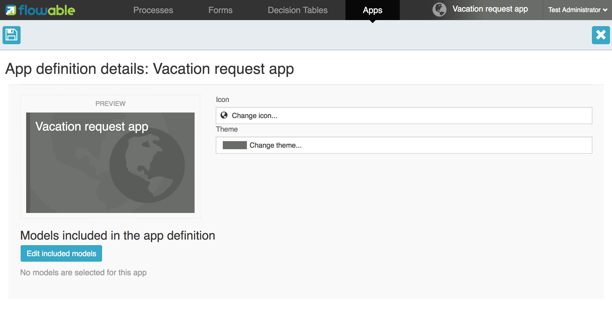

还可以在应用编辑器中选择图标和主题色，调整Flowable Task应用在看板(dashboard)中的显示效果。重点步骤是添加请假流程模型，并通过选择流程模型，自动引入对应的表单定义和DMN选择表。

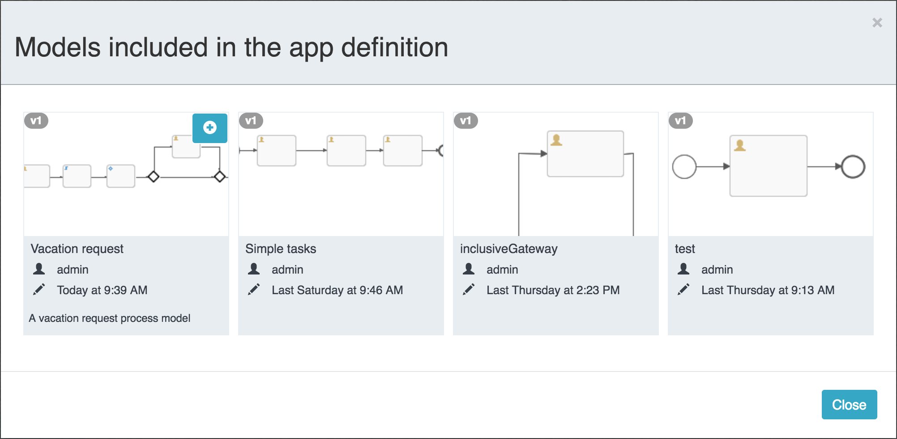

点击预览图选中流程模型。选择一个或多个模型之后，就可以关闭弹窗，保存并关闭应用定义。在详情页面查看新创建的请假应用定义，如下所示：

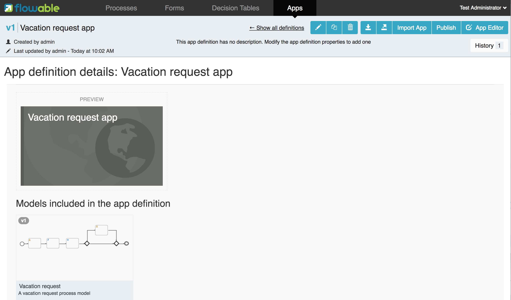

在这个页面中，可以通过两种不同格式下载应用定义。第一个下载按钮（带有下箭头）下载每个模型的JSON格式模型文件，用于在不同的Flowable Modeler应用之间共享应用定义。第二个下载按钮（带有指向右上的箭头）下载应用定义模型的BAR文件，用于在Flowable引擎中部署。在BAR文件中，只包含了可以部署的工件，如BPMN 2.0 XML文件和DMN XML文件，而不会包含JSON模型文件。这是因为在Flowable引擎部署时，BAR文件中的所有文件都会保存在数据库中。因此需要避免将不需要部署的文件放在BAR中。


在应用定义详情页面，也可以直接向Flowable引擎__发布(Publish)__应用定义。Flowable Modeler使用application.properties文件中，__flowable.modeler.app.deployment-api-url__参数设置的URL部署应用定义。默认部署URL配置为Flowable Task应用。但也可以修改，比如改为使用Flowable REST应用。确保Flowable Task应用正在运行，点击__Publish__按钮。这样应用定义就会做为一个BAR文件部署到Flowable Task应用。

下表是Modeler UI应用的专用参数。

.Modeler UI应用参数
[cols="4*",options="header"]
|===============
|参数名
|原参数
|默认值
|描述

|flowable.modeler.app.data-source-prefix
|datasource.prefix
|-
|数据库表名的前缀。

|flowable.modeler.app.deployment-api-url
|deployment.api.url
|http://localhost:8080/flowable-task/process-api
|Flowable引擎REST服务的根URL，Flowable Modeler用来向引擎部署应用定义BAR文件。
 Flowable Task应用的默认URL为 
 http://localhost:8080/flowable-task/process-api

|flowable.modeler.app.rest-enabled
|rest.modeler-app.enabled
|true
|启用REST API（指的是使用基础身份认证的API，而不是UI使用的REST API）。
|===============


[[flowableTaskApp]]

=== Flowable Task应用

Flowable Task应用是Flowable项目的运行时应用，默认包括Flowable BPMN、DMN、Form以及Content引擎。可以使用Flowable Task应用，启动新流程实例、完成任务、渲染任务表单等。在之前的章节中，已经通过Flowable Task应用REST API在Flowable引擎中部署了请假应用定义。在Flowable数据库中可以看到BPMN引擎的ACT_RE_DEPLOYMENT表中已经创建了新的部署实体。DMN引擎的ACT_DMN_DEPLOYMENT，和Form引擎的ACT_FO_FORM_DEPLOYMENT表中也创建了新的实体。

在link:$$http://localhost:8080/flowable-task$$[http://localhost:8080/flowable-task]的看板中，可以看到请假应用及默认的Task应用，和其他已经在Flowable引擎中部署的应用。

image::images/flowable_task_dashboard_screen.png[align="center"]

点击请假应用，会显示当前登录用户的任务列表（现在很可能是空的）。

image::images/flowable_task_tasklist_screen.png[align="center"]

点击打开__Processes(流程)__页签后，可以点击__Start a process(启动流程)__按钮，启动一个新的流程实例。会列表显示当前应用定义上下文中所有可用的流程定义。选择请假流程定义后，可以点击__Start process__按钮，启动一个新的请假流程实例。

Flowable Task应用将自动跳转至流程实例详情页面。可以看到已经激活了__Provide vacation information(提供请假信息)__任务。可以添加备注，或者使用__Show diagram(显示流程图)__按钮，图形化显示流程实例状态。

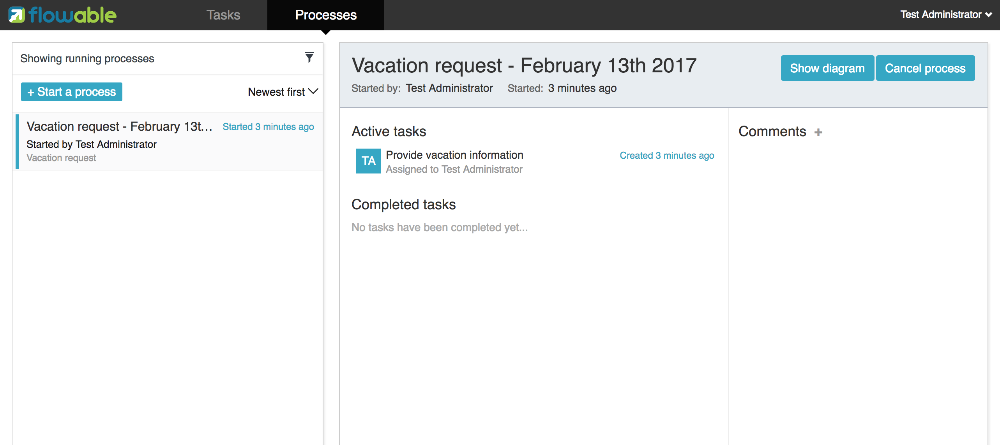

转至任务列表，也可以看到这里也列出了__Provide vacation information__任务。这个界面会显示任务详情及渲染的请假信息表单。也可以点击__Show details(显示详情)__按钮，转至详情页面。在详情页面中，可以添加备注，引入用户，为任务添加附件，或者修改任务的到期时间和办理人。

image::images/flowable_task_taskdetails_screen.png[align="center"]

开始填写表单并完成任务。首先，选择间隔超过10天的开始日期和结束日期。这样就可以生成__Manager approval(经理审批)__任务。请假信息表单填写完毕后，点击__Complete(完成)__按钮，Flowable Task应用就会跳转至__Manager approval__任务界面。直接完成这个任务（不需要填写任务表单），流程实例就结束了。

返回__Processes__页签，点击__Showing running processes(显示运行中的流程)__选项，可以选择__show completed process instances（显示已完成的流程实例）__。这样就会显示已完成的流程实例列表。点击刚才完成的请假流程，可以看到两个完成的任务。

image::images/flowable_task_processhistory_screen.png[align="center"]

每个任务的完成表单（complete form）都存储在Flowable Form引擎的ACT_FO_FORM_INSTANCE表中。因此，在查看完成的任务时，就可以看到每一个完成表单的数据。

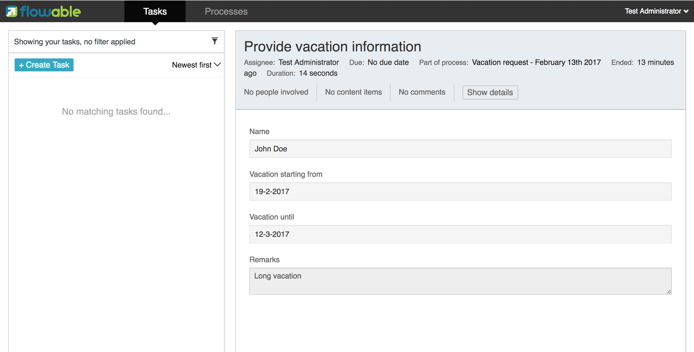

请确保选择回__showing running processes__，否则就不能看到新启动的流程实例。也可以在任务列表界面进行过滤，选择查找任务名、任务状态，特定流程定义的任务，以及指定的办理人。

image::images/flowable_task_taskfilter_screen.png[align="center", width="400"]

默认情况下，办理人过滤设置为__Tasks where I am involved(我参与的任务)__。这样不会显示用户作为候选人而没有指定为办理人的任务。要显示候选任务，可以选择__Tasks where I am one of the candidates(我参与候选的任务)__。

下表是Task UI应用的专用参数。

.Task UI应用参数
[cols="4*",options="header"]
|===============
|参数名
|原参数
|默认值
|描述

|flowable.experimental.debugger.enabled
|debugger.enabled
|false
|是否启用流程调试器。

|flowable.task.app.rest-enabled
|rest.task-app.enabled
|true
|启用REST API（指的是使用基础身份认证的API，而不是UI使用的REST API）。
|===============


[[flowableAdminApp]]

=== Flowable Admin应用

Flowable Admin应用是Flowable项目提供的第四个UI应用。用于查询BPMN、DMN及Form引擎中的部署，也可以显示流程实例的当前状态，包括当前的任务和流程变量。也提供了将任务指派给不同的办理人，以及完成任务的操作。Flowable Admin应用使用REST API与Flowable引擎通信。默认情况下，配置为连接至Flowable Task REST API，但是也可以很容易的修改为连接至Flowable REST应用的REST API。访问link:$$http://localhost:8080/flowable-admin$$[http://localhost:8080/flowable-admin]时会显示配置界面（也可以直接点击Flowable logo右上方的箭头）。

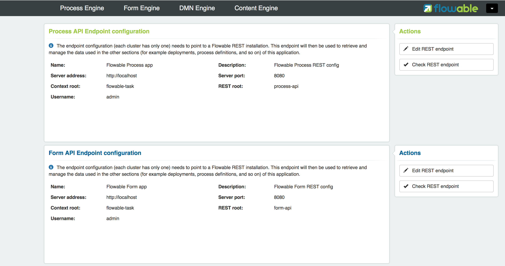

每一个引擎都可以配置REST端点的基本认证。每个引擎需要单独配置，因为有可能会分开部署引擎，比如将DMN引擎与BPMN引擎部署在不同的服务器上。

如果配置正确，就可以选择__Process Engine(流程引擎)__来管理Flowable BPMN引擎。默认情况下，会显示Flowable BPMN引擎的部署情况。

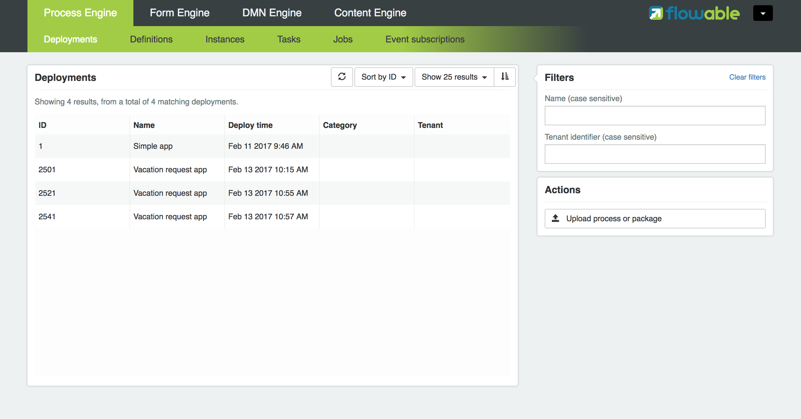

可以使用名字及租户id过滤查找部署。也可以为Flowable引擎部署新的BPMN XML或BAR文件。点击其中一个部署，会显示部署详情界面。

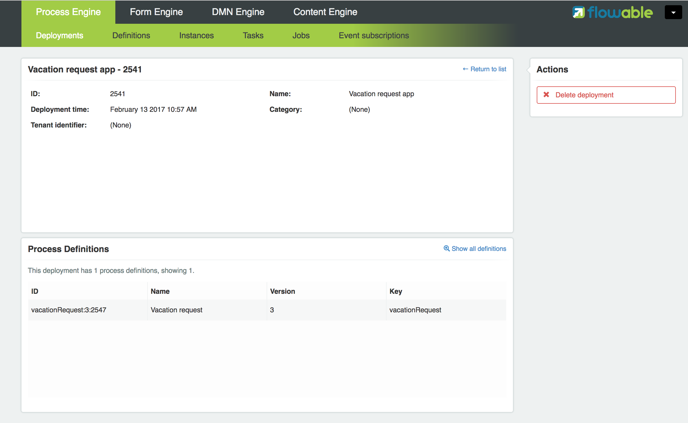

这里会显示部署的详细信息，以及部署中包含的流程定义。也可以删除部署。如果希望删除已部署的应用定义，也可以在Flowable Task应用看板中删除应用定义。点击其中一个流程定义，会显示流程定义详情页面。

image::images/flowable_admin_processdefinitiondetails_screen.png[align="center"]

在流程定义详情页面中，首先显示的是流程实例，以及流程定义中使用的选择表定义和表单定义。请假流程定义有一个关联的选择表，以及一个关联的表单定义。点击选择表定义，就会从Flowable Admin应用跳转至DMN引擎。可以点击__Parent Deployment ID(父部署ID)__链接，返回流程引擎。

除了部署与定义之外，还可以查询流程引擎中的流程实例、任务、作业，以及事件订阅情况。界面与前面介绍的类似。

下表是Admin UI应用的专用参数。

.Admin UI应用参数
[cols="4*",options="header"]
|===============
|参数名
|原参数
|默认值
|描述

|flowable.admin.app.data-source-prefix
|datasource.prefix
|
|数据库表名的前缀。

|flowable.admin.app.security.encryption.credentials-i-v-spec
|security.encryption.credentials-i-v-spec
|-
|创建IvParameterSpec对象所用的bytes。

|flowable.admin.app.security.encryption.credentials-secret-spec
|security.encryption.credentials-secret-spec
|-
|创建SecretKeySpec对象所用的bytes。
|===============

除了这些参数之外，Flowable Admin应用还有一些其他参数。可以在link:{sc-flowable-ui-admin}/flowable-ui-admin-app/src/main/resources/application.properties[Github]查看配置文件的完整内容。这些参数主要用于为不同的引擎定义REST端点的初始值。
Admin应用使用这些配置连接Flowable引擎。可以使用Admin应用的配置界面修改这些值。这些值保存在__ACT_ADM_SERVER_CONFIG__表中。
下面是一个BPMN引擎REST的配置示例：

[source,linenums]
----
flowable.admin.app.server-config.process.app.name=Flowable Process app
flowable.admin.app.server-config.process.description=Flowable Process REST config
flowable.admin.app.server-config.process.server-address=http://localhost
flowable.admin.app.server-config.process.app.port=8080
flowable.admin.app.server-config.process.context-root=flowable-task
flowable.admin.app.server-config.process.rest-root=process-api
flowable.admin.app.server-config.process.app.user=admin
flowable.admin.app.server-config.process.app.password=test
----

在Flowable Task应用（及全部Flowable引擎）由Flowable Admin应用管理时，可以使用这些参数。

.由Spring Boot管理的Admin UI应用参数
[cols="2*",options="header"]
|===============
|原参数
|描述

|message.reloading.enabled
|改为使用Spring Boot MessageSourceAutoConfiguration的 `spring.messages.cache-duration` 设置。
|===============

[[_internationalization]]
=== 国际化

Flowable UI应用支持国际化(internationalization, i18n)。项目组维护英语版本。但也可以使用自己的翻译文件支持其他语言。

link:$$https://github.com/angular-translate/angular-translate[Angular Translate]库会试着基于浏览器的语言代码，从（每一个UI应用的）__i18n__目录下载入对应的语言文件。如果无法加载匹配的语言文件，框架会退回使用英语版本。

也可以（在Angular应用配置中），将多个浏览器语言代码关联至某个翻译文件：


[source,linenums]
----
// 初始化angular-translate
$translateProvider.useStaticFilesLoader({
    prefix: './i18n/',
    suffix: '.json'
})
/*
    将多个浏览器语言代码映射至同一个翻译。
*/
// .registerAvailableLanguageKeys(['en'], {
//     'en-*': 'en'
// })
.useCookieStorage()
.useSanitizeValueStrategy('sanitizeParameters')
.uniformLanguageTag('bcp47')
.determinePreferredLanguage();
----

例如，如果浏览器配置为使用英语（美国）——English (United States)，即语言代码为__en-US__。如果不做映射配置，Angular Translate会尝试获取对应的语言文件__en-US.json__。（如果无法加载，会退回为__en__，并加载__en.json__语言文件）

取消注释__.registerAvailableLanguageKeys__块，就可以将__en-US__（以及所有其他的__en__语言代码）映射至__en.json__语言文件。

[[_production_ready_endpoints]]
=== 生产可用的端点

所有应用都可以使用Spring Boot提供的link:$$https://docs.spring.io/spring-boot/docs/current/reference/html/production-ready-endpoints.html$$[生产可用的端点]。参阅link:$$https://docs.spring.io/spring-boot/docs/current/actuator-api/html/$$[Actuator Web API Documentation]了解所有可用的端点。

默认使用下列配置：

[source,linenums]
-----
# 暴露所有Actuator Endpoint
# 尽管会暴露所有的端点，但非认证用户无法访问，认证用户可以访问/info及/health，只有具有access-admin权限的用户可以访问其他端点
management.endpoints.web.exposure.include=*
# 只有认证用户可以访问完整的健康度信息
management.endpoint.health.show-details=when_authorized
# 只有access-admin角色可以访问完整的健康度信息
management.endpoint.health.roles=access-admin
-----

安全策略配置为：只有认证用户可以访问 `info` 及 `health` 端点。
只有 `access-admin` 角色可以查看 `health` 端点的完整信息。
只有 `access-admin` 角色可以查看其他的任何端点。
