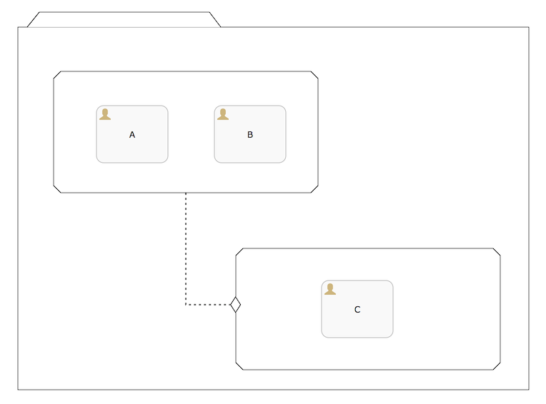

[[chapterApi]]

== The Flowable CMMN API

[[apiEngine]]

=== 流程 CMMN 引擎 API 与服务类

引擎 API 是与 Flowable 交互的最常用方式。核心起点是可以通过<<configuration,配置部分>>中描述的几种方式创建的 ++CMMN 引擎++。从 CMMN 引擎中，您可以获得包含案例/CMMN 方法的各种服务类。CMMN 引擎和其服务类对象是线程安全的，因此您可以为整个服务保留其中一个引用。

[source,java,linenums]
----
CmmnEngine cmmnEngine = CmmnEngineConfiguration.createStandaloneCmmnEngineConfiguration();

CmmnRuntimeService runtimeService = cmmnEngine.getCmmnRuntimeService();
CmmnRepositoryService repositoryService = cmmnEngine.getCmmnRepositoryService();
CmmnTaskService taskService = cmmnEngine.getCmmnTaskService();
CmmnManagementService managementService = cmmnEngine.getCmmnManagementService();
CmmnHistoryService historyService = cmmnEngine.getCmmnHistoryService();
----

+CmmnEngineConfiguration.createStandaloneCmmnEngineConfiguration()+ 将初始化并构建 CMMN 引擎，然后始终返回这个 CMMN 引擎。

CmmnEngineConfiguration 类将扫描所有 +flowable.cmmn.cfg.xml+ 和 +flowable-cmmn-context.xml+ 配置文件。对于所有 +flowable.cmmn.cfg.xml+ 配置文件，CMMN 引擎将以典型的 Flowable 方式构建：+CmmnEngineConfiguration.createCmmnEngineConfigurationFromInputStream(inputStream).buildCmmnEngine()+。对于所有 +flowable-cmmn-context.xml+ 配置文件，CMMN 引擎将以 Spring 方式构建：首先创建 Spring 应用程序上下文，然后 CMMN 引擎会从该应用程序上下文中获取。

所有的服务类均是无状态的。这意味着您可以轻松地在群集中的多个节点上运行Flowable，每个节点都连接同一个数据库，而不必担心哪台机器实际执行了旧的调用。对任何服务类的任何调用都是幂等的，无论它在何处执行。

*CmmnRepositoryService* 可能是 Flowable CMMN 引擎工作时所需的第一个服务类。该服务类提供用于管理和使用++部署文件++和++案例定义++的操作。案例定义是 CMMN 1.1案例的 Java 对应物，它表示案例的每个步骤的结构和行为，这里不再过多介绍。++部署文件++是 Flowable CMMN 引擎中的打包单元。部署文件可以包含多个CMMN 1.1 XML文件和任何其他资源，其中具体包含哪些内容取决于开发人员。它的范围可以从单个流程 CMMN 1.1 XML 文件到整个案例和相关资源的包（例如，部署文件“hr-cases”可能包含与 HR 案例相关的所有内容）。+CmmnRepositoryService+ 可以++发布++这样的包。发布一个部署文件意味着将其上载到引擎，在该引擎中，所有案例在存储到数据库之前都会被检查和解析。从那一刻起，系统会感知到这个部署文件，并且部署文件中包含的任何流程都可以被发起。

此外，这个服务类允许您：

* 查询引擎已知的部署文件和案例定义。
* 检索各种资源，例如部署文件中包含的文件或引擎自动生成的案例图。
* 检索案例定义的 POJO 版本，它可用于使用 Java 而不是 JSON 进行内省。

+CmmnRepositoryService+ 主要与静态信息（数据不会改变，至少不会变很多）有关，而 *CmmnRuntimeService* 恰恰相反，它涉及启动案例定义的新案例实例。如上所述，++案例定义++定义了案例的不同步骤的结构和行为。案例实例是案例定义的一次执行。对于每个案例定义，通常会有许多实例同时运行。CmmnRuntimeService 也是用于检索和存储案例变量的服务类。变量是特定于指定案例实例的数据，并且可以让案例中的各种结构使用（例如，方案的跳转条件通常使用流程变量来确定选择哪个路径来继续流转该案例）。CmmnRuntimeService 还允许您查询案例实例和方案条目。方案条目是 CMMN 1.1的已启用方案条目的表示。最后，无论何时案例实例需要继续流转并等待外部触发时都会使用 CmmnRuntimeService。案例实例可以具有各种等待状态，该服务类包含各种操作来向实例“发信号”并由外部触发器接收，然后案例实例可以继续流转。

需要由系统的操作用户执行的任务是 Flowable 这类 CMMN 引擎的核心。围绕任务的所有内容都分组在 *CmmnTaskService* 中，例如：

* 查询分配给用户或组的任务
* 创建新的独立任务，这些任务与流程实例无关。
* 操作派遣任务的参与人或以某种方式参与任务的用户。
* 签收并完成一个任务。 签收意味着某人决定成为该任务的操作人，这意味着该用户将审批该任务，审批意味着“完成任务”。通常这是填写一种表单。

*CmmnHistoryService* 暴露 Flowable CMMN 引擎收集的所有历史数据。在执行案例时，引擎可以保存大量数据（可以通过配置决定是否启用），例如案例实例开始时间，谁执行哪些任务，审批任务花费多长时间，每个案例实例流经哪条路径等。此服务类主要暴露查询功能以访问此类数据。

*CmmnManagementService* 提供对数据库表低级信息的访问，允许查询不同类型的工作并执行它们。

有关服务操作和引擎 API 的更多详细信息，请参阅link:$$http://www.flowable.org/docs/javadocs/index.html$$[文档]。

=== 异常策略

Flowable 中的基础异常是 +org.flowable.engine.FlowableException+，这是一个未经检查的异常。这种异常可以被 API 随时抛出，其他特定方法中发生的“预期中的”异常被记录在link:$$http://www.flowable.org/docs/javadocs/index.html$$[文档]中。例如 ++CmmnTaskService++ 的摘录：

[source,java,linenums]
----
/**
 * 成功执行任务时调用。
 * @param taskId 要完成的任务的id，不能为空。
 * @throws FlowableObjectNotFoundException 当指定id的任务不存在时抛出。
 */
 void complete(String taskId);
----

在上面的示例中，当传递不存在的任务 id 时，将抛出异常。同样的，由于 Java 文档**明确声明 taskId 不能为 null，因此在传递 +null+ 时将抛出 +FlowableIllegalArgumentException+** 。

尽管我们想要避免一个大的异常层次结构，下列的异常子类仍会在特定情况下被抛出。在流程执行或 API 调用期间发生的所有其他错误都不适合下面可能发生的异常，这些错误将作为常规 ++FlowableExceptions++ 抛出。

* ++FlowableWrongDbException++：当 Flowable 引擎发现数据库 Schema 版本与引擎版本不匹配时抛出。
* ++FlowableOptimisticLockingException++：当由同一数据条目的并发访问引起的数据存储中发生乐观锁问题时抛出。
* ++FlowableClassLoadingException++：当未找到请求加载的类或加载时发生错误时抛出（例如 Java 代理类、任务监听器等）。
* ++FlowableObjectNotFoundException++：当请求或操作的对象不存在时抛出。
* ++FlowableIllegalArgumentException++：这个异常表示在 Flowable API 调用中使用了非法参数、在引擎的配置中配置了非法值。
* ++FlowableTaskAlreadyClaimedException++：当一个任务已经被签收时，再次调用 +taskService.claim(...)+ 时抛出。

[[queryAPI]]

=== 查询 API

有两种方法可以从引擎查询数据：使用查询 API 和本地查询。查询 API 允许您使用流畅的 API 编写完全类型安全的查询。您可以为查询添加各种查询条件（所有条件共同应用逻辑与）与一个排序参数。示例如下：

[source,java,linenums]
----
List<Task> tasks = taskService.createTaskQuery()
    .taskAssignee("kermit")
    .orderByDueDate().asc()
    .list();
----

[[apiVariables]]

=== 变量

每个案例实例都需要并使用数据来执行自身节点来进行流转。在 Flowable 中, 这种数据被称为__变量__, 它们存储在数据库中。变量可以在表达式中使用（例如在哨兵的条件中）、在调用外部服务时的 Java 服务任务中使用（例如提供输入或存储服务调用的结果）等。

案例实例可以包含变量（称为__案例变量__）, 同样的__方案条目实例__和人工任务也可以包含变量。案例实例可以包含任意数量的变量。每个变量都存储在 __ACT_RU_VARIABLE__ 数据库表的一行中。

_createCaseInstanceBuilder_方法具有可选方法，用于通过 _CmmnRuntimeService_ 创建案例实例并启动时提供变量：

[source,java,linenums]
----
CaseInstance caseInstance = runtimeService.createCaseInstanceBuilder().variable("var1", "test").start();
----

在案例执行期间可以添加变量。例如 _CmmnRuntimeService_：

[source,java,linenums]
----
void setVariables(String caseInstanceId, Map<String, ? extends Object> variables);
----

如下所示，变量同样可以被检索。请注意 _CmmnTaskService_ 上存在类似的方法。

[source,java,linenums]
----
Map<String, Object> getVariables(String caseInstanceId);
Object getVariable(String caseInstanceId, String variableName);
----

变量通常用于 Java 服务任务、达式和脚本中等。

[[apiTransientVariables]]

=== 临时变量

临时变量是行为类似于常规变量的变量，但不是持久变量。通常，临时变量用于高级用例。如有疑问，请使用常规案例变量。

以下情况适用于临时变量：

* 临时变量根本不会存储历史记录。
* 与__常规__变量一样，临时变量在设置时会放在__最高级父节点__上。这意味着在方案条目上设置变量时，临时变量实际存储在案例执行实例中。与常规变量一样，如果在特定方案条目或任务上设置变量，则存在方法的__本地__变体。
* 临时变量只能在案例定义中的下一个“等待状态”之前访问。在那之后无法访问。在这里，等待状态表示案例实例中持久化到数据存储的时间点。
* 临时变量只能由 _setTransientVariable(name, value)_ 设置，但在调用 _getVariable(name)_ 时也会返回临时变量（临时变量在 _getTransientVariable(name)_ 中也存在，它只检查瞬态变量）。这样做的原因是使表达式的编写变得容易，并且使用变量的现有逻辑适用于这两种变量类型。
* 临时变量会__优先于__相同名称的持久变量。这意味着当在同一案例实例上设置相同名称的持久变量和临时变量后调用 _getVariable("someVariable")_ 时，将返回临时变量值。

您可以在暴露常规变量的大多数地方设置和获取临时变量：

* 在 _PlanItemJavaDelegate_ 实现中的 _DelegatePlanItemInstance_ 上
* 通过运行时服务类启动案例实例时
* 审批一个任务时

这些方法遵循常规案例变量的命名约定：

[source,java,linenums]
----
CaseInstance caseInstance = runtimeService.createCaseInstanceBuilder().transientVariable("var1", "test").start();
----

[[apiExpressions]]

=== 表达式

Flowable 使用 UEL 进行表达式解析。UEL 即 __Unified Expression Language（统一表达语言）__并且是 Java EE 6规范的一部分（详情参见 link:$$http://docs.oracle.com/javaee/6/tutorial/doc/gjddd.html$$[Java EE6 规范] ）。

表达式可用于例如 Java 服务任务和方案条目流转。虽然有两种类型的表达式：值表达式和方法表达式，但 Flowable 对此进行了抽象，因此它们都可以在需要++表达式++的地方使用。

* *值表达式*：解析为一个值。默认情况下，可以使用所有案例变量。此外，所有 Spring-beans（如果使用 Spring 的话）都可用于表达式。一些例子：

----
${myVar}
${myBean.myProperty}
----

* *方法表达式*：调用带或不带参数的方法。**在调用不带参数的方法时，请确保在方法名称后添加空括号（因为这会将方法表达式与值表达式区分开来）。**传递的参数可以是文本值或自己解析的表达式。例子：

----
${printer.print()}
${myBean.addNewOrder('orderName')}
${myBean.doSomething(myVar, planItemInstance)}
----

请注意，这些表达式支持解析基础数据类型（包括比较它们）、Bean、列表、数组和集合。

除了所有流程变量之外，还有一些可用于表达式的默认对象：

* ++caseInstance++：+DelegateCaseInstance+ 拥有有关正在进行的案例实例的额外信息。
* ++planItemInstance++：+DelegatePlanItemInstance+ 拥有有关当前方案条目的额外信息。

[[cmmnExpressionsFunctions]]

=== 函数表达式

[实验]表达式函数已在6.4.0版中添加。

为了更容易处理案例变量，在 _variables_ 命名空间下可以使用一组开箱即用的函数。

* *variables:get(varName)*：检索变量的值。与直接在表达式中写入变量名称的主要区别在于，当变量不存在时，使用此函数不会抛出异常。例如，如果 myVariable 不存在，_${myVariable == "hello"}_ 将会抛出异常，而 _${var:get(myVariable) == 'hello'}_ 将正常工作。
* *variables:getOrDefault(varName, defaultValue)*：与 _get(varName)_ 类似，但可以选择提供默认值，该值在未设置变量或值为 _null_ 时返回。
* *variables:exists(varName)*：如果变量具有非 null 值，则返回 _true_ 。
* *variables:isEmpty(varName)* （别名 _:empty_）：检查变量值是否为空。 根据变量类型，行为如下：
** 对于 String 变量，如果变量是空字符串，则该变量被视为空。
** 对于 +java.util.Collection+ 变量，如果集合没有元素，则返回 _true_。
** 对于 +ArrayNode+ 变量，如果没有元素，则返回 _true_
** 如果变量是 _null_，则始终返回 _true_
* *variables:isNotEmpty(varName)* （别名 _:notEmpty_）：_isEmpty(varName)_ 的取反操作。
* *variables:equals(varName, value)*（别名_ _:eq_）：检查变量是否等于给定值。这是表达式的简写函数，否则将写为 _${execution.getVariable("varName") != null && execution.getVariable("varName") == value}_。
** 如果变量值为 null，则返回 false（除非与 null 比较）。
* *variables:notEquals(varName, value)*（别名 _:ne_）：_equals(varName, value)_ 的取反操作。
* *variables:contains(varName, value1, value2, ...)*: 检查提供的**所有**值是否包含在变量中。根据变量类型，行为如下：
** 对于 String 变量，传递的值需要全部为变量一部分子字符串
** 对于 +java.util.Collection+ 变量，所有传递的值都需要是集合的元素（常规 _contains_ 语义）。
** 对于 +ArrayNode+ 变量，支持检查 ArrayNode 是否包含作为变量类型支持的类型的 JsonNode
** 当变量值为 null 时，在所有情况下都返回 false。如果变量值不为 null，并且实例类型不是上述类型之一，则将返回 false。
* *variables:containsAny(varName, value1, value2, ...)* ：类似于 _contains_ 函数，但如果**存在**（不需要全部存在）传递的值包含在变量中，则返回 _true_。
* 比较函数：
** *variables:lowerThan(varName, value)*（别名 _:lessThan_ 或 _:lt_）：_${execution.getVariable("varName") != null && execution.getVariable("varName") < value}_ 的简写函数。
** *variables:lowerThanOrEquals(varName, value)*（别名 _:lessThanOrEquals_ 或 _:lte_）：与上面的类似，相当于 _< =_
** *variables:greaterThan(varName, value)* （别名 _:gt_）：与上面的类似，相当于 _>_
** *variables:greaterThanOrEquals(varName, value)* （别名 _:gte_）：与上面的类似，相当于 _> =_

_variables_ 命名空间的别名为 _vars_ 或 _var_。因此 _variables:get(varName)_ 等同于使用 _vars:get(varName)_ 或 _var:get(varName)_。请注意，不需要再次在变量名称周围加上引号：_var:get(varName)_ 等同于 _var:get(\'varName')_ 或 _var:get("varName")_。

另请注意，在上述任何函数中，都不需要将 _planItemInstance_ 或 _caseInstance_ 传递给函数（它们在不使用函数时需要传递）。在调用函数时，引擎将注入适当的变量作用域。这也意味着在 BPMN 流程定义中编写表达式时，可以以完全相同的方式使用这些函数。

这些变量函数的使用在 CMMN 中尤其有用，例如在写入 if 部分的哨兵条件时，采用以下 CMMN 案例定义：

Assume the sentry has an if-part besides the completion event. Right after a case instance is started, this if-part condition will be evaluated (as the stage becomes available). If the condition is of the form _${someVariable == someValue}_, this means the variable needs to be available when starting the case instance. In many cases, this is not possible or the variable comes later (e.g. from a form), which leads to a low-level _PropertyNotFoundException_. Taking the potential nullability in account, the correct expression would have to be:
假设哨兵除了完成事件之外还有一个 if 部分。在启动案例实例后，将评估此 if 部分条件（当此阶段变为可用时）。如果条件的形式为 _${someVariable == someValue}_，则表示该变量在启动案例实例时就将可用。在许多情况下，这是不可能的，或者变量稍后才会出现 （例如来自一个表单），这会导致一个低级的 _PropertyNotFoundException_。考虑到潜在的可空性，正确的表达必须是：

----
${planItemInstance.getVariable('someVariable') != null && planItemInstance.getVariable('someVariable') == someValue}
----

这很长。但是，使用上述功能可以简化为

----
${var:eq(someVariable, someValue)}
----

或者

----
${var:get(someVariable) == someValue}
----

函数实现考虑了变量的可空性（并且在变量为 null 的情况下不抛出异常）并且将正确地处理相等性。

此外，可以注册自定义函数在表达式中使用。有关更多信息，请参阅 +org.flowable.common.engine.api.delegate.FlowableFunctionDelegate+ 接口。

[[apiUnitTesting]]

=== 单元测试

案例是软件项目不可或缺的一部分，它们应该以与测试正常应用程序逻辑相同的方式进行测试：使用单元测试。
由于 Flowable 是一个嵌入式的 Java 引擎，因此为业务案例编写单元测试就像编写常规单元测试一样简单。

Flowable 支持 JUnit 4、JUnit 5 做单元测试。

在 JUnit 5中，需要使用 +org.flowable.cmmn.engine.test.FlowableCmmnTest+ 注解或手动注册 +org.flowable.cmmn.engine.test.FlowableCmmnExtension+。
+FlowableCmmnTest+ 注释是一个元注释，实现了对 +FlowableCmmnExtension+ 的注册（即它实现了 +@ExtendWith(FlowableCmmnExtension.class)+）。
这将使 CmmnEngine 和其服务类可用作测试和生命周期方法的参数（+@BeforeAll+、+@BeforeEach+、+@AfterEach+、+@AfterAll+）。
在每次测试之前，默认会使用类路径上的 +flowable.cmmn.cfg.xml+ 配置文件初始化 CmmnEngine。
为了指定不同的配置文件，需要使用 +org.flowable.cmmn.engine.test.CmmnConfigurationResource+ 注解（参见第二个示例）。
使用相同的配置文件时，CMMN 引擎会在多个单元测试之间静态缓存。

通过使用 +FlowableCmmnExtension+，您可以对测试方法使用 +org.flowable.cmmn.engine.test.CmmnDeployment+ 注解。
当使用有 +@CmmnDeployment+ 注解的测试方法时，在每次测试之前，将会发布在 +CmmnDeployment#resources+ 下定义的 cmmn 文件。
如果没有定义资源，将发布与测试类在同一包中的 +testClassName.testMethod.cmmn+ 形式的资源文件。
在测试结束时，部署文件将会删除，包括所有相关的案例实例、定义等。
有关更多信息，请参阅 ++CmmnDeployment++ 类。

考虑到所有这些，JUnit 5单元测试看起来如下：

.使用默认配置文件的 Junit 5 单元测试
[source,java,linenums]
----
@FlowableCmmnTest
class MyTest {

  private CmmnEngine cmmnEngine;
  private CmmnRuntimeService cmmnRuntimeService;
  private CmmnTaskService cmmnTaskService;

  @BeforeEach
  void setUp(CmmnEngine cmmnEngine) {
    this.cmmnEngine = cmmnEngine;
    this.cmmnRuntimeService = cmmnEngine.getCmmnRuntimeService();
    this.cmmnTaskService = cmmnEngine.getTaskRuntimeService();
  }

  @Test
  @CmmnDeployment
  void testSingleHumanTask() {
    CaseInstance caseInstance = cmmnRuntimeService.createCaseInstanceBuilder()
                    .caseDefinitionKey("myCase")
                    .start();
	assertNotNull(caseInstance);

    Task task = cmmnTaskService.createTaskQuery().caseInstanceId(caseInstance.getId()).singleResult();
    assertEquals("Task 1", task.getName());
    assertEquals("JohnDoe", task.getAssignee());

    cmmnTaskService.complete(task.getId());
    assertEquals(0, cmmnRuntimeService.createCaseInstanceQuery().count());
  }
}
----

-----
使用 JUnit 5，您还可以将部署文件的 ID（使用 org.flowable.cmmn.engine.test.CmmnDeploymentId）注入到测试和生命周期方法中。
-----

.使用自定义配置文件的Junit 5单元测试
[source,java,linenums]
----
@FlowableCmmnTest
@CmmnConfigurationResource("flowable.custom.cmmn.cfg.xml")
class MyTest {

  private CmmnEngine cmmnEngine;
  private CmmnRuntimeService cmmnRuntimeService;
  private CmmnTaskService cmmnTaskService;

  @BeforeEach
  void setUp(CmmnEngine cmmnEngine) {
    this.cmmnEngine = cmmnEngine;
    this.cmmnRuntimeService = cmmnEngine.getCmmnRuntimeService();
    this.cmmnTaskService = cmmnEngine.getTaskRuntimeService();
  }
  @Test
  @CmmnDeployment
  void testSingleHumanTask() {
    CaseInstance caseInstance = cmmnRuntimeService.createCaseInstanceBuilder()
                    .caseDefinitionKey("myCase")
                    .start();
	assertNotNull(caseInstance);

    Task task = cmmnTaskService.createTaskQuery().caseInstanceId(caseInstance.getId()).singleResult();
    assertEquals("Task 1", task.getName());
    assertEquals("JohnDoe", task.getAssignee());

    cmmnTaskService.complete(task.getId());
    assertEquals(0, cmmnRuntimeService.createCaseInstanceQuery().count());
  }
}
----

在 JUnit 4 中，_org.flowable.cmmn.engine.test.FlowableCmmnTestCase_ 可用作父类。它默认使用 _flowable.cmmn.cfg.xml_ 配置文件，如果缺少此类文件，则使用连接 H2 内存数据库的标准 CmmnEngine。
在后台，CmmnTestRunner 用于初始化 CMMN 引擎。请注意下面的示例中如何使用 _@CmmnDeployment_ 注解自动部署案例定义（它将在与测试类相同的文件夹中查找 .cmmn 文件，并期望文件名为<测试类名>.<测试方法名称>.cmmn）。

[source,java,linenums]
----

public class MyTest extends FlowableCmmnTestCase {

  @Test
  @CmmnDeployment
  public void testSingleHumanTask() {
    CaseInstance caseInstance = cmmnRuntimeService.createCaseInstanceBuilder()
                    .caseDefinitionKey("myCase")
                    .start();
	assertNotNull(caseInstance);

    Task task = cmmnTaskService.createTaskQuery().caseInstanceId(caseInstance.getId()).singleResult();
    assertEquals("Task 1", task.getName());
    assertEquals("JohnDoe", task.getAssignee());

    cmmnTaskService.complete(task.getId());
    assertEquals(0, cmmnRuntimeService.createCaseInstanceQuery().count());
  }
}
----

此外，使用 _FlowableCmmnRule_ 并允许设置自定义配置：

.JUnit 4 test with a Rule
.规则相关的 JUnit 4 单元测试
[source,java,linenums]
----
@Rule
public FlowableCmmnRule cmmnRule = new FlowableCmmnRule("org/flowable/custom.cfg.xml")

@Test
@CmmnDeployment
public void testSomething() {
    // ...
    assertThat((String) cmmnRule.getCmmnRuntimeService().getVariable(caseInstance.getId(), "test"), containsString("John"));
    // ...
}
----

