== CMMN 1.1

=== 什么是 CMMN?

案例管理模型和标记法是由link:$$http://www.omg.org/spec/CMMN/$$[对象管理组织(Object Management Group,缩写为OMG)]为了表示案例模型而建立的标准规范.

Flowable 包含:

* 一个基于CMMN1.1的模型设计器用来创建案例模型

* 一个JAVA引擎用来导入并运行CMMN1.1案例模型

* 一个动态前端页面用来执行案例模型,并允许用户查看并完成相关任务和对应表单

=== 基础概念和术语

以下内容展示了一个简单的CMMN1.1图:

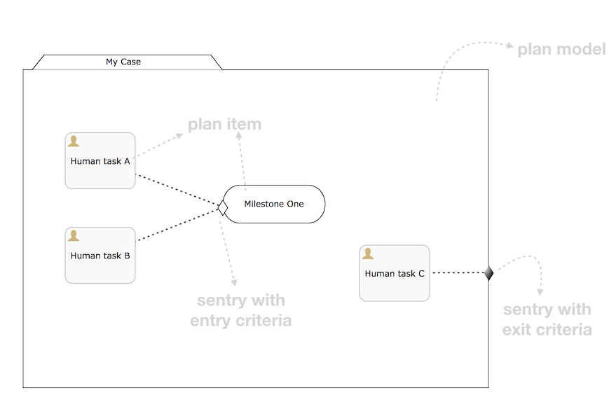

一个 *案例模型* 通常被看作一个包含所有的案例元素的 _文件夹_. 每个案例模型包含一个 *计划模型* ,其他所有的元素放在该计划模型内部.

一个计划模型中所有元素被称为 *计划项*. 每个计划项都一个类型及运行时相关配置项的定义.例如,上图中,有三个人工任务和一个里程碑.其他的计划项分别有 _流程任务、案例任务和阶段_.

当把一个案例模型在Flowable CMMN引擎上部署完成后, 很可能就直接启动一个基于此模型的实例. 其中的定义的计划项同样也会产成运行时的实例并且暴露出来,通过使用Flowable API可以查询得到. *计划项实例* 拥有基于CMMN 1.1规范定义的生命周期状态, 并且是整个引擎工作的核心. 详细内容请查阅 CMMN1.1规范的8.4.2部分.

计划项可以拥有 _哨兵_: 当使用哨兵守卫它的激活, 这个计划项相当于拥有入口凭证.这些凭证明确了触发哨兵需要满足的条件.例如,在上图中,里程碑在一个案例实例启动后为可用状态,但是当人工任务A和人工任务B都完成后,该里程碑状态由可用状态变成活跃状态.注意守卫可以在它的条件中使用不可见的复杂表达式,以便完成更多复杂的功能.同样,也可以拥有多个守卫,只需满足一个哨兵就可以出发状态的转变.

计划项和计划模型也可以拥有退出凭证的哨兵,其明确了从对应计划项退出的条件.在上图中,当人工任务C完成后,整个计划模型(包括此刻所有活跃状态的子元素)将会退出.

CMMN 1.1在XSD中定义作为规范一部分的XML标准格式. 已供参阅, 下面展示的XML代表了上述例子的案例图.

一些结论:

* XML中的四个计划项通过使用 _definitionRef_ 属性关联它们自身的定义. 实际的声明是在底部的 _casePlanModel_ 元素

* 拥有进入或退出凭证的计划项关联一个 _sentry_ 哨兵(而不是反过来)

* XML也包含可见案例图的信息(x 和 y坐标, 宽度和高度等等),在以下展示中已省略. 当使用其他 CMMN 1.1 模型工具用来保存正确的可视化案例图时,这些信息是重要的.

[source,xml,linenums]
----
<?xml version="1.0" encoding="UTF-8"?>
<definitions xmlns="http://www.omg.org/spec/CMMN/20151109/MODEL"
             xmlns:xsi="http://www.w3.org/2001/XMLSchema-instance"
             xmlns:flowable="http://flowable.org/cmmn"
             xmlns:cmmndi="http://www.omg.org/spec/CMMN/20151109/CMMNDI"
             xmlns:dc="http://www.omg.org/spec/CMMN/20151109/DC"
             xmlns:di="http://www.omg.org/spec/CMMN/20151109/DI"
             targetNamespace="http://www.flowable.org/casedef">
  <case id="simpleExample" name="Simple Example">
    <casePlanModel id="casePlanModel" name="My Case">
      <planItem id="planItem1" name="Human task A"
            definitionRef="sid-88199E7C-7655-439C-810B-8849FC52D3EB"></planItem>
      <planItem id="planItem2" name="Milestone One"
            definitionRef="sid-8BF8A774-A8A7-4F1A-95CF-1E0D61EE5A47">
        <entryCriterion id="sid-62CC4A6D-B29B-4129-93EA-460253C45CDF"
            sentryRef="sentry1"></entryCriterion>
      </planItem>
      <planItem id="planItem3" name="Human task B"
            definitionRef="sid-A1FB8733-0DBC-4B38-9830-CBC4D0C4B802"></planItem>
      <planItem id="planItem4" name="Human task C"
            definitionRef="sid-D3970AFC-7391-4BA7-95BA-51C64D2F41E9"></planItem>
      <sentry id="sentry1">
        <planItemOnPart id="sentryOnPart1" sourceRef="planItem1">
          <standardEvent>complete</standardEvent>
        </planItemOnPart>
        <planItemOnPart id="sentryOnPart2" sourceRef="planItem3">
          <standardEvent>complete</standardEvent>
        </planItemOnPart>
      </sentry>
      <sentry id="sentry2">
        <planItemOnPart id="sentryOnPart3" sourceRef="planItem4">
          <standardEvent>complete</standardEvent>
        </planItemOnPart>
      </sentry>
      <humanTask id="sid-88199E7C-7655-439C-810B-8849FC52D3EB"
        name="Human task A"></humanTask>
      <milestone id="sid-8BF8A774-A8A7-4F1A-95CF-1E0D61EE5A47"
        name="Milestone One"></milestone>
      <humanTask id="sid-A1FB8733-0DBC-4B38-9830-CBC4D0C4B802"
        name="Human task B"></humanTask>
      <humanTask id="sid-D3970AFC-7391-4BA7-95BA-51C64D2F41E9"
        name="Human task C"></humanTask>
      <exitCriterion id="sid-422626DB-9B40-49D8-955E-641AB96A5BFA"
        sentryRef="sentry2"></exitCriterion>
    </casePlanModel>
  </case>
  <cmmndi:CMMNDI>
    <cmmndi:CMMNDiagram id="CMMNDiagram_simpleExample">
        ...
    </cmmndi:CMMNDiagram>
  </cmmndi:CMMNDI>
</definitions>
----

=== 程序示例

在这个小节, 我们将会用代码构建并执行一个简单的案例模型, 通过在命令行中调用Flowable CMMN engine的Java API.

在这个案例模型中, 我们将构建一个简化的有两个阶段的 _employee onboarding_ 案例: 两个时期分别在的员工入职前后.第一个阶段,HR部门中的某个人将会完成相关任务;第二个阶段,该员工完成它们.同时,在任何时间,该试用员工可以拒绝这份工作并且停止这个实例.

注意, 只有 stages and human tasks 被用到. 在真实案例模型中, 很可能会有其他类型的计划项,比如里程碑, 嵌套stage, 自动化任务等等.

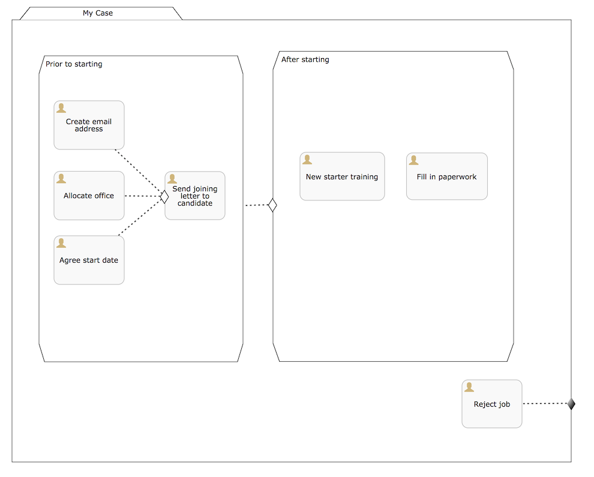

这个案例模型的XML如下所示:

[source,xml,linenums]
----
<?xml version="1.0" encoding="UTF-8"?>
<definitions xmlns="http://www.omg.org/spec/CMMN/20151109/MODEL"
             xmlns:xsi="http://www.w3.org/2001/XMLSchema-instance"
             xmlns:flowable="http://flowable.org/cmmn"
             xmlns:cmmndi="http://www.omg.org/spec/CMMN/20151109/CMMNDI"
             xmlns:dc="http://www.omg.org/spec/CMMN/20151109/DC"
             xmlns:di="http://www.omg.org/spec/CMMN/20151109/DI"
             targetNamespace="http://www.flowable.org/casedef">
  <case id="employeeOnboarding" name="Simple Example">
    <casePlanModel id="casePlanModel" name="My Case">
      <planItem id="planItem5" name="Prior to starting"
            definitionRef="sid-025D29E8-BA9B-403D-A684-8C5B52185642"></planItem>
      <planItem id="planItem8" name="After starting"
            definitionRef="sid-8459EF32-4F4C-4E9B-A6E9-87FDC2299044">
        <entryCriterion id="sid-50B5F12D-FE75-4D05-9148-86574EE6C073"
            sentryRef="sentry2"></entryCriterion>
      </planItem>
      <planItem id="planItem9" name="Reject job"
            definitionRef="sid-134E885A-3D58-417E-81E2-66A3E12334F9"></planItem>
      <sentry id="sentry2">
        <planItemOnPart id="sentryOnPart4" sourceRef="planItem5">
          <standardEvent>complete</standardEvent>
        </planItemOnPart>
      </sentry>
      <sentry id="sentry3">
        <planItemOnPart id="sentryOnPart5" sourceRef="planItem9">
          <standardEvent>complete</standardEvent>
        </planItemOnPart>
      </sentry>
      <stage id="sid-025D29E8-BA9B-403D-A684-8C5B52185642" name="Prior to starting">
        <planItem id="planItem1" name="Create email address"
                definitionRef="sid-EA434DDD-E1BE-4AC1-8520-B19ACE8782D2"></planItem>
        <planItem id="planItem2" name="Allocate office"
                definitionRef="sid-505BA223-131A-4EF0-ABAD-485AEB0F2C96"></planItem>
        <planItem id="planItem3" name="Send joining letter to candidate"
                definitionRef="sid-D28DBAD5-0F5F-45F4-8553-3381199AC45F">
          <entryCriterion id="sid-4D88C79D-8E31-4246-9541-A4F6A5720AC8"
            sentryRef="sentry1"></entryCriterion>
        </planItem>
        <planItem id="planItem4" name="Agree start date"
                definitionRef="sid-97A72C46-C0AD-477F-86DD-85EF643BB97D"></planItem>
        <sentry id="sentry1">
          <planItemOnPart id="sentryOnPart1" sourceRef="planItem1">
            <standardEvent>complete</standardEvent>
          </planItemOnPart>
          <planItemOnPart id="sentryOnPart2" sourceRef="planItem2">
            <standardEvent>complete</standardEvent>
          </planItemOnPart>
          <planItemOnPart id="sentryOnPart3" sourceRef="planItem4">
            <standardEvent>complete</standardEvent>
          </planItemOnPart>
        </sentry>
        <humanTask id="sid-EA434DDD-E1BE-4AC1-8520-B19ACE8782D2"
            name="Create email address"
            flowable:candidateGroups="hr"></humanTask>
        <humanTask id="sid-505BA223-131A-4EF0-ABAD-485AEB0F2C96"
            name="Allocate office"
            flowable:candidateGroups="hr"></humanTask>
        <humanTask id="sid-D28DBAD5-0F5F-45F4-8553-3381199AC45F"
            name="Send joining letter to candidate"
            flowable:candidateGroups="hr"></humanTask>
        <humanTask id="sid-97A72C46-C0AD-477F-86DD-85EF643BB97D"
            name="Agree start date"
            flowable:candidateGroups="hr"></humanTask>
      </stage>
      <stage id="sid-8459EF32-4F4C-4E9B-A6E9-87FDC2299044"
        name="After starting">
        <planItem id="planItem6" name="New starter training"
                definitionRef="sid-DF7B9582-11A6-40B4-B7E5-EC7AC6029387"></planItem>
        <planItem id="planItem7" name="Fill in paperwork"
                definitionRef="sid-7BF2B421-7FA0-479D-A8BD-C22EBD09F599"></planItem>
        <humanTask id="sid-DF7B9582-11A6-40B4-B7E5-EC7AC6029387"
            name="New starter training"
            flowable:assignee="${potentialEmployee}"></humanTask>
        <humanTask id="sid-7BF2B421-7FA0-479D-A8BD-C22EBD09F599"
            name="Fill in paperwork"
            flowable:assignee="${potentialEmployee}"></humanTask>
      </stage>
      <humanTask id="sid-134E885A-3D58-417E-81E2-66A3E12334F9" name="Reject job"
        flowable:assignee="${potentialEmployee}"></humanTask>
      <exitCriterion id="sid-18277F30-E146-4B3E-B3C9-3F1E187EC7A8"
        sentryRef="sentry3"></exitCriterion>
    </casePlanModel>
  </case>
</definitions>
----

首先, 创建一个新的工程, 添加 _flowable-cmmn-engine_ 依赖(这里展示了Maven), H2 数据库依赖也要添加, 后续将会使用 H2 作为内嵌的数据库.

[source,xml,linenums]
----
<dependency>
    <groupId>org.flowable</groupId>
    <artifactId>flowable-cmmn-engine</artifactId>
    <version>${flowable.version}</version>
</dependency>
<dependency>
    <groupId>com.h2database</groupId>
    <artifactId>h2</artifactId>
    <version>${h2.version}</version>
</dependency>
----

The Flowable CMMN API 包括了其他的 Flowable APIs 和相关概念. 同样,熟悉 BPMN 或者 DMN APIs的人很容易上手.和其他引擎一样, 第一行代码是创建一个 Cmmn引擎. 这里,默认的配置将会使用 H2作为内存数据库:

[source,java,linenums]
----
public class Main {
  public static void main(String[] args) {
    CmmnEngine cmmnEngine
        = new StandaloneInMemCmmnEngineConfiguration().buildCmmnEngine();
  }
}
----

注意_CmmnEngineConfiguration_ 提供了很多配置项来调整 CMMN引擎的设置.

把上述 XML 放入一个文件中, 例如 _my-case.cmmn_ (or .cmmn.xml). 对于Maven工程, 应该放在 _src/main/resources_ 文件夹中.

为了使引擎感知当前案例模型, 它首先需要被部署 _deployed_. 这个工作由 the _CmmnRepositoryService_ 完成:

[source,java,linenums]
----
CmmnRepositoryService cmmnRepositoryService = cmmnEngine.getCmmnRepositoryService();
CmmnDeployment cmmnDeployment = cmmnRepositoryService.createDeployment()
    .addClasspathResource("my-case.cmmn")
    .deploy();
----

当部署XML时, 会返回一个 *CmmnDeployment*. 一个 deployment 包含多个案例模型和目标. 一个明确的案例模型定义被存储成一个案例定义 *CaseDefinition*. 这可以通过执行 _CaseDefinitionQuery_ 案例定义查询 来验证:

[source,java,linenums]
----
List<CaseDefinition> caseDefinitions = cmmnRepositoryService.createCaseDefinitionQuery().list();
System.out.println("Found " + caseDefinitions.size() + " case definitions");
----

当在引擎中拥有一个案例定义后, 现在可以启动一个对应 *CaseInstance* 案例实例. 要么使用查询后的结果并传递给下面的代码片段中, 要么直接使用 the case definition的key(如下所示).

注意当启动 *CaseInstance*, 我们也传递了 _potentialEmployee_ 作为一个标记, 这个变量之后会被用作人工任务的指派(see the _assignee="${potentialEmployee}"_ attribute on _human tasks_)

[source,java,linenums]
----
CmmnRuntimeService cmmnRuntimeService = cmmnEngine.getCmmnRuntimeService();
CaseInstance caseInstance = cmmnRuntimeService.createCaseInstanceBuilder()
    .caseDefinitionKey("employeeOnboarding")
    .variable("potentialEmployee", "johnDoe")
    .start();
----

当 *CaseInstance* 启动后, 引擎将决定哪一个计划项应该被激活:

* 第一个阶段没有入口凭证, 所以它会被激活

* 第一个阶段的子人工任务没有入口凭证, 所以它们三个也预计被激活

在运行时, 计划项被当做 *PlanItemInstances*, 可以使用 _CmmnRuntimeService_ 查询获取:

[source,java,linenums]
----
List<PlanItemInstance> planItemInstances = cmmnRuntimeService.createPlanItemInstanceQuery()
    .caseInstanceId(caseInstance.getId())
    .orderByName().asc()
    .list();

for (PlanItemInstance planItemInstance : planItemInstances) {
    System.out.println(planItemInstance.getName());
}
----

打印如下:

----
After starting
Agree start date
Allocate office
Create email address
Prior to starting
Reject job
Send joining letter to candidate
----

上述打印结果中有些事情可能出乎意料:

* stages 也是属于 计划项, 同样被当做 *PlanItemInstance*. 注意当调用 _.getStageInstanceId()_ ,子计划项实例也会拥有stage作为父类.

* _Send joining letter to candidate_ 也在返回结果集中.原因是因为依据 CMMN 1.1 规范, 这个计划项实例是出于可用状态, 而不是处于活跃状态.

进一步, 修改上述代码:

[source,java,linenums]
----
for (PlanItemInstance planItemInstance : planItemInstances) {
    System.out.println(planItemInstance.getName()
        + ", state=" + planItemInstance.getState()
        + ", parent stage=" + planItemInstance.getStageInstanceId());
}
----

现在输出如下:

----
After starting, state=available, parent stage=null
Agree start date, state=active, parent stage=fe37ac97-b016-11e7-b3ad-acde48001122
Allocate office, state=active, parent stage=fe37ac97-b016-11e7-b3ad-acde48001122
Create email address, state=active, parent stage=fe37ac97-b016-11e7-b3ad-acde48001122
Prior to starting, state=active, parent stage=null
Reject job, state=active, parent stage=fe37ac97-b016-11e7-b3ad-acde48001122
Send joining letter to candidate, state=available, parent stage=fe37ac97-b016-11e7-b3ad-acde48001122
----

为了只显示活跃状态的计划项实例, 查询可以调整并增加 _planItemInstanceStateActive()_ 方法:

[source,java,linenums]
----
 List<PlanItemInstance> planItemInstances = cmmnRuntimeService.createPlanItemInstanceQuery()
    .caseInstanceId(caseInstance.getId())
    .planItemInstanceStateActive()
    .orderByName().asc()
    .list();
----

现在输出如下:

----
Agree start date
Allocate office
Create email address
Prior to starting
Reject job
----

当然, *PlanItemInstance* 是 低级别的表示, 但是每个计划项也拥有一个  _plan item definition_  明确其类型. 在这个例子中, 我们只有 _human tasks_.通过使用 计划项实例 来影响整个 案例实例,
(比如, _CmmnRuntimeService.triggerPlanItemInstance(String planItemInstanceId)_).然而, 交互最有可能通过实际计划项定义的结果发生: 比如这里的人工任务.

任务的查询方法和BPMN 引擎一样, (实际上, 任务服务是一个共享的组件, BPMN或者CMMN创建的任务都可以通过各自引擎查询得到):

[source,java,linenums]
----
CmmnTaskService cmmnTaskService = cmmnEngine.getCmmnTaskService();
List<Task> hrTasks = cmmnTaskService.createTaskQuery()
    .taskCandidateGroup("hr")
    .caseInstanceId(caseInstance.getId())
    .orderByTaskName().asc()
    .list();
for (Task task : hrTasks) {
    System.out.println("Task for HR : " + task.getName());
}

List<Task> employeeTasks = cmmnTaskService.createTaskQuery()
    .taskAssignee("johndoe")
    .orderByTaskName().asc()
    .list();
for (Task task : employeeTasks) {
    System.out.println("Task for employee: " + task);
}
----

上述输出:

----
Task for HR : Agree start date
Task for HR : Allocate office
Task for HR : Create email address

Task for employee: Reject job
----

当HR的三个任务都完成, 给求职者发送入职信的任务应该是可用的:

[source,java,linenums]
----
for (Task task : hrTasks) {
    cmmnTaskService.complete(task.getId());
}

hrTasks = cmmnTaskService.createTaskQuery()
    .taskCandidateGroup("hr")
    .caseInstanceId(caseInstance.getId())
    .orderByTaskName().asc()
    .list();

for (Task task : hrTasks) {
    System.out.println("Task for HR : " + task.getName());
}
----

事实上, 预期的任务现在被创建了:

----
Task for HR : Send joining letter to candidate
----

完成这个任务,案例实例将进入第二个阶段, 同时第一阶段的哨兵的条件得到满足. 'Reject job'任务被程序自动创建, 并且指派给员工的两个任务也被创建:

[source,java,linenums]
----
Task for employee: Fill in paperwork
Task for employee: New starter training
Task for employee: Reject job
----

完成所有任务将结束整个案例实例:

----
List<Task> tasks = cmmnTaskService.createTaskQuery().caseInstanceId(caseInstance.getId()).listPage(0, 1);
while (!tasks.isEmpty()) {
    cmmnTaskService.complete(tasks.get(0).getId());
    tasks = cmmnTaskService.createTaskQuery()
        .caseInstanceId(caseInstance.getId())
        .listPage(0, 1);
}
----

当执行案例实例时, 引擎也会保存历史信息, 这可以通过查询API获取:

[source,java,linenums]
----
CmmnHistoryService cmmnHistoryService = cmmnEngine.getCmmnHistoryService();
HistoricCaseInstance historicCaseInstance = cmmnHistoryService.createHistoricCaseInstanceQuery()
    .caseInstanceId(caseInstance.getId())
    .singleResult();

System.out.println("Case instance execution took "
    + (historicCaseInstance.getEndTime().getTime() - historicCaseInstance.getStartTime().getTime()) + " ms");

List<HistoricTaskInstance> historicTaskInstances = cmmnHistoryService.createHistoricTaskInstanceQuery()
    .caseInstanceId(caseInstance.getId())
    .orderByTaskCreateTime().asc()
    .list();

for (HistoricTaskInstance historicTaskInstance : historicTaskInstances) {
    System.out.println("Task completed: " + historicTaskInstance.getName());
}
----

输出如下:

----
Case instance execution took 149 ms
Task completed: Reject job
Task completed: Agree start date
Task completed: Allocate office
Task completed: Create email address
Task completed: Send joining letter to candidate
Task completed: New starter training
Task completed: Fill in paperwork
----

案例执行相关的历史数据以特殊的结构被收集, 比如 Tasks (上面所见的), milestones, cases, variables and 一般的 plan items.
这个数据作为运行时数据被持久化, 但是不会在实例结束后被删除.访问历史数据可以通过 _CmmnHistoryService_ 的相关API

当然, 这只是Flowable CMMN Engine所有可用的APIs中的一小部分,请查阅其他章节了解更多详情

=== CMMN 1.1 Constructs

这个小节 覆盖了 Flowable支持的 CMMN 1.1设计, 同时也是对 CMMN 1.1 标准的拓展

下述设计, 除了哨兵和item 控制, 都是依据 CMMN规范中的计划项作为参考.它们实例执行的历史数据可用通过 _CmmnHistoryService_ 使用 _org.flowable.cmmn.api.history.HistoricPlanItemInstanceQuery_ 方法获取.

==== 阶段

一个 stage 被看作一组计划项的集合, 它通常用于在案例实例中定义"阶段"

一个 stage 本事也是计划项, 也拥有进入和退出凭证. 计划项以及它包含的计划项只有在计入活跃状态才可用, stage 可以内嵌在其他stage中.
A stage is visualized as a rectangle with angled corners:

a stage 可以看作是一个有尖角的矩形

image::images/cmmn.stage.png[align="center"]

==== 任务

一个手动任务, 意味着它将在引擎外部发生.

Properties:

* *name*: 表达式将会在运行时被解析当做任务名称

* *blocking*: 布尔值决定是否任务被阻塞

* *blockingExpression*: 表达式 计算成布尔值决定该任务是否被阻塞

如果一个任务是 非阻塞non-blocking, 引擎将在执行时自动完成它. 如果一个任务被阻塞blocking, 这个任务对应的计划项实例会被保持活跃状态active state,
直到以编程方式触发( _CmmnRuntimeService.triggerPlanItemInstance(String planItemInstanceId)_ 方法).

一个任务看作一个圆角矩形:

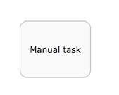

==== 人工任务

一个人工任务用作模型化需要人完成的工作, 比如表单. 当引擎抵达一个人工任务, 被指派的人工或组对应的任务列表就会新增加一项.

一个人工任务也是一个计划项, 这意味着除了人工任务本身之外，还创建了一个 _PlanItemInstance_,并且可以通过 _PlanItemInstanceQuery_ 查询它.

人工任务可以通过 _org.flowable.task.api.TaskQuery_ API 查询.历史数据可以通过 _org.flowable.task.api.history.HistoricTaskInstanceQuery_ 查询.

Properties:

属性:

* *name*: 被用作该人工任务的名称

* *blocking*: 布尔值决定该任务是否被阻塞

* *blockingExpression*: 表达式计算得到布尔值决定任务是否被阻塞

* *assignee* : 表达式(可以是静态文本) 决定该任务的指派人

* *owner* : 表达式(可以是静态文本)决定该任务的拥有者

* *candidateUsers* : 表达式(可以是静态文本)解析成以逗号分隔的字符串,被用作决定该人工任务的候选人列表

* *candidateGroups* : 表达式(可以是静态文本)解析成以逗号分隔的字符串,被用作决定该人工任务的候选组列表

* *form key*: 表达式决定使用表单的key, 后续通过API访问

* *Due date* 过期时间 解析为 java.util.Date or a ISO-8601 date string

* *Priority*: 优先级 解析为整型, 可以用来在 TaskQuery API中筛选任务

一个人工任务看作一个圆角矩形, 左上角有一个用户图标

image::images/cmmn.humantask.png[align="center"]

==== Java 服务任务

服务任务被用作执行自定义逻辑.

自定义逻辑要放在一个实现 _org.flowable.cmmn.api.delegate.PlanItemJavaDelegate_ 接口的类中.

[source,java,linenums]
----
public class MyJavaDelegate implements PlanItemJavaDelegate {

    public void execute(DelegatePlanItemInstance planItemInstance) {
        String value = (String) planItemInstance.getVariable("someVariable");
        ...
    }

}
----

对于一些高级实现,使用 _PlanItemJavaDelegate_ 可能不能覆盖到, _CmmnActivityBehavior_可以被使用(类似于 BPMN 引擎中的 _JavaDelegate_ vs _ActivityBehavior_)

Properties:

属性:

* *name*: 服务任务service task的名称

* *class*: 自定义逻辑的Java实现类

* *class fields*: 调用自定义逻辑时的传递参数

* *Delegate expression*: 表达式解析为一个实现_PlanItemJavaDelegate_接口的类

一个 服务任务service task 看作一个圆角矩形, 左上角有个齿轮图标

image::images/cmmn.servicetask.png[align="center"]

====决策任务

一个决策任务调用外部 DMN 决策表，并在case实例中存储结果变量

Properties:

属性:

* *Decision table reference*: 相关的需要被执行 DMN 决策表.

通过设置'_Throw error if no rules were hit_'属性, 当在 DMN 决策表计算过程中没有命中任何规则时, 可能会抛出错误.

一个 服务任务service task 看作一个圆角矩形, 左上角有个表格图标

image::images/cmmn.decisiontask.png[align="center"]

==== http请求任务

Http Task http请求任务是 _service task_ 一个开箱即用的实现,被用作调用一个http REST 服务.

Http Task http请求任务包含多个参数来自定义请求和响应. 查阅  BPMN http task documentation 了解更多参数设置的细节

一个 服务任务service task 看作一个圆角矩形, 左上角有个火箭图标

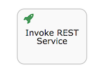

==== 脚本任务

脚本任务类似 BPMN 中脚本任务, 当一个计划项变成活跃状态, 用来执行一个脚本.

Properties:

属性:

* *name*: 表示任务名称

* *type*: 任务属性, 必须是"script", 表示该任务类型

* *scriptFormat*: 拓展属性 表示脚本语言(例如, javascript, groovy)

* *script*: 执行的脚本, 在"script"元素中作为一个string

* *autoStoreVariables*: 可选的任务属性标记 (默认: false) 表示脚本中定义的变量是否保存到计划项实例上下文中 (查看下面注意事项note)

* *resultVariableName*: 可选的任务属性 明确脚本执行结果保存到计划项实例上下文中对应的名称 (查看下面注意事项note)

一个 服务任务service task 看作一个圆角矩形, 左上角有个脚本图标

image::images/cmmn.scripttask.png[align="center"]

[source,xml,linenums]
----
<planItem id="scriptPlanItem" name="Script Plan Item" definitionRef="myScriptTask" />
<task name="My Script Task Item" flowable:type="script" flowable:scriptFormat="JavaScript">
    <documentation>Optional documentation</documentation>
    <extensionElements>
        <flowable:field name="script">
            <string>
                sum = 0;
                for ( i in inputArray ) {
                    sum += i;
                }
            </string>
        </flowable:field>
    </extensionElements>
</task>
----

*Note*: *scriptFormat* 属性值必须符合 link:$$http://jcp.org/en/jsr/detail?id=223$$[JSR-223] (scripting for the Java platform).
默认, JavaScript 包含在每个JDK里, 不需要额外的JAR文件. 如果你想使用另外 (JSR-223 兼容) 脚本引擎, 在classpath中添加对应的Jar文件并使用合适的名称.
例如, Flowable 单元测试 经常使用 Groovy, 因为其语法和 JAVA 相像.

注意Groovy脚本引擎是绑定在groovy-jsr223 JAR, 这样, 必须添加下面的依赖:

[source,xml,linenums]
----
<dependency>
    <groupId>org.codehaus.groovy</groupId>
    <artifactId>groovy-jsr223</artifactId>
    <version>3.x.x<version>
</dependency>
----

在脚本任务中, 所有案例变量 variables 都可以通过 PlanItem 实例在脚本中访问.在下面的例子中, 脚本变量 _'inputArray'_ 实际上是一个案例变量variable(一个整型数组)

[source,xml,linenums]
----
<flowable:field name="script">
    <string>
    sum = 0
    for ( i in inputArray ) {
      sum += i
    }
    </string>
</flowable:field>
----

*Note*: 通过在脚本中调用 _planItemInstance.setVariable("variableName", variableValue)_, 可以设置计划项实例的变量值.默认不会保存任务变量.
通过设置 _autoStoreVariables_属性值为true, 也可以自动保存在脚本中定义的变量(例如, 上述实例中的sum).然而, 最好是不要显示调用 _planItemInstance.setVariable("variableName", variableValue)_
,在某些版本的JDK中, 一些脚本语言自动保存变量会不起作用. 查阅 link:$$http://www.jorambarrez.be/blog/2013/03/25/bug-on-jdk-1-7-0_17-when-using-scripttask-in-activiti/$$[链接] 了解更多细节

[source,xml,linenums]
----
<task name="Script Task" flowable:type="script" flowable:scriptFormat="groovy" flowable:autoStoreVariables="false">
----

The default for this parameter is +false+, meaning that if the parameter is omitted from the script task definition, all the declared variables will only exist during the duration of the script.

该参数默认是false, 意味着在脚本定义中省略, 所有脚本中声明的变量只会存在于脚本执行过程中.

这是一个在脚本中如何设置变量的例子:

[source,xml,linenums]
----
<flowable:field name="script">
    <string>
    def scriptVar = "test123"
    planItemInstance.setVariable("myVar", scriptVar)
    </string>
</flowable:field>
----

以下名称是预留的, 不能被使用: *out, out:print, lang:import, context, elcontext*.

*Note* 脚本任务的返回值可以被分配给一个已经存在或者新的计划项实例变量, 通过在脚本任务定义中设置_'flowable:resultVariable'_ 属性值.任何已经存在的相同名称变量的值会被脚本返回值覆盖.当未明确设置返回结果变量名, 脚本的返回值会被忽略.

[source,xml,linenums]
----
<task name="Script Task" flowable:type="script" flowable:scriptFormat="groovy" flowable:resultVariable="myVar">
    <flowable:field name="script">
        <string>#{echo}</string>
    </flowable:field>
</task>
----

在上述实例中, 当脚本执行结束后, 脚本的返回值( __'#{echo}'__的解析值)会被设置成名称为 __'myVar'__ 的流程变量值.

====  里程碑

里程碑被用作标记到达案例实例中的某个点. 在运行时, 它们被称为 *MilestoneInstances* , 可以通过调用 _CmmnRuntimeService_ 的 *MilestoneInstanceQuery* 查询. 也可以通过 _CmmnHistoryService_ 获取一个历史副本.

里程碑也是计划项, 这意味着除了里程碑条目外, _PlanItemInstance_ 同样会被创建, 通过_PlanItemInstanceQuery_ 可以查询到.

Properties:

属性:

* *name*: 一个表达式或者静态文本, 决定里程碑名称

里程碑被看作一个圆角矩形(比任务更圆一些)

image::images/cmmn.milestone.png[align="center"]

==== 案例任务

用例任务用作在一个案例上下文中启动一个子案例. _CaseInstanceQuery_ 有一些选项查询父类案例.

当一个案例任务被阻塞, _PlanItemInstance_ 将会处于活跃状态, 直到子案例全部完成.如果案例任务是非阻塞, 子案例启动后, 计划项实例自动完成.当子案例实例结束对父类没有影响.

Properties:

属性:

* *name*: 表达式或静态文本, 决定名称

* *blocking*: 布尔值决定任务是否被阻塞

* *blockingExpression*: 表达式计算得到布尔值决定任务是否被阻塞

* *Case reference*: 案例定义的key, 用来启动一个子实例.可以是一个表达式

一个案例任务看作一个圆角矩形, 左上角有一个case 图标

image::images/cmmn.casetask.png[align="center"]

==== 流程任务

流程任务被用作在案例上下文中启动一个流程实例

当流程任务被阻塞, _PlanItemInstance_ 将会一直 活跃_active_状态, 直到 流程实例全部完成. 如果流程任务非阻塞, 流程实例任务启动并且计划项实例自动完成, 当流程实例结束对父类没有任何影响.

Properties:

属性:

* *name*: 表达式或静态文本, 决定名称

* *blocking*: 布尔值决定任务是否被阻塞

* *blockingExpression*: 表达式计算得到布尔值决定任务是否被阻塞

* *Process reference*: 案例定义的key, 用来启动一个子实例.可以是一个表达式

一个流程任务看作一个圆角矩形, 左上角有个箭头图标

image::images/cmmn.processtask.png[align="center"]

流程任务可以配置为具有内部和外部参数，这些参数的形式是_source/sourceExpression_ and _target/targetExpression_.

内部参数在当前案例实例上下文内被解析.

* _source_ value 将把一个case实例变量, 映射成一个流程变量

* 或者, the _sourceExpression_ 允许创建任意值，其中表达式根据case实例解析.

* _target_ 是流程变量的名称, 是被_source_映射

* 或者, _targetExpression_将被解析成一个 *string*, 用作流程实例的变量名称.表达式根据case实例上下文解析.

内部参数在当前流程实例(全局)上下文内被解析.

* The _source_ value will be the process instance variable which value will be mapped to a case variable
* _source_ value 将把一个流程变量值, 映射成一个case变量

* 或者, the _sourceExpression_ 允许创建任意值，其中表达式根据流程实例解析.

* _target_ 是流程变量的名称, 是被_source_映射

* 或者, _targetExpression_将被解析成一个 *string*, 用作case实例的变量名称.表达式根据流程实例(全局)上下文解析.

==== 凭证

=====  入口凭证 (入口哨兵)

进入凭证构成一个计划项实例的哨兵, 它们由两部分组成:

* One or more parts that depend on other plan items: these define dependencies on state transitions of other plan items. For example, one human task can depend on the state transition 'complete' of three other human tasks to become active itself
* 一个或者多个部分依赖其他计划项: 它们依赖其他计划项状态的转变.例如一个人工任务取决于另外三个人工任务的完成,才能变成活跃状态.

* One optional _if part_ or _condition_: this is an expression that allows the definition of a complex condition
*一个可选的如果部分或条件: 允许定义一个复杂条件的表达式

A sentry is satisfied when all its criteria are resolved to _true_. When a criterion evaluates to true, this is stored and remembered for future evaluations. Note that entry criteria of all plan item instances in the _available_ state are evaluated whenever something changes in the case instance.
Multiple sentries are possible on a plan item. However, when one is satisfied, the plan item moves from state _available_ to _active_.

一个哨兵只有所有凭证解析为 _true_, 才会满足条件. 当一个凭证被解析为true, 将会被存储以便后续计算. 注意当case实例中发生更改时，将计算处于可用状态的所有计划项实例的入口条件.
多个哨兵可能会用在一个计划项, 然而当一个哨兵满足条件, 该计划项状态会从可用 _available_ 变成活跃 _active_.

See <<cmmn_sentry_evaluation,the section on sentry evaluation>> for more information.

查阅 <<cmmn_sentry_evaluation,the section on sentry evaluation>>, 了解更多详情.

An entry criterion is visualized as a diamond shape (white color inside) on the border of a plan item:

入口哨兵被看作一个菱形(内部白色),位于计划项边界上:

image::images/cmmn.entrycriteria.png[align="center"]

===== Exit criterion (exit sentry)

===== Exit criterion (exit sentry) 出口凭证 (出口哨兵)

Exit criteria form a sentry for a given plan item instance. They consist of two parts:

进入凭证构成一个计划项实例的哨兵, 它们由两部分组成:

* One or more parts that depend on other plan items: these define dependencies on state transitions of other plan items. For example, one human task can depend on reaching a certain milestone to be automatically terminated
* 一个或者多个部分依赖其他计划项: 它们依赖其他计划项状态的转变.例如一个人工任务取决于另外三个人工任务的完成,才能变成活跃状态.

* One optional _if part_ or _condition_: this is an expression that allows a complex condition to be defined
*一个可选的如果部分或条件: 允许定义一个复杂条件的表达式

A sentry is satisfied when all its criteria are resolved to _true_. When a criterion evaluates to true, this is stored and remembered for future evaluations. Note that exit criteria of all plan item instances in the _active_ state are evaluated whenever something changes in the case instance.
Multiple sentries are possible on a plan item. However, when one is satisfied, the plan item moves from state _active_ to _exit_.

一个哨兵只有所有凭证解析为 _true_, 才会满足条件. 当一个凭证被解析为true, 将会被存储以便后续计算. 注意当case实例中发生更改时，将计算处于可用状态的所有计划项实例的入口条件.
多个哨兵可能会用在一个计划项, 然而当一个哨兵满足条件, 该计划项状态会从活跃 _active_ 变成退出  _exit_.

See <<cmmn_sentry_evaluation,the section on sentry evaluation>> for more information.

查阅 <<cmmn_sentry_evaluation,the section on sentry evaluation>> 了解更多.

An exit criterion is visualized as a diamond shape (white color inside) on the border of a plan item:

出口哨兵被看作一个菱形(内部黑色),位于计划项边界上:

==== Event Listeners

==== Event Listeners 事件监听器

===== Timer Event Listener

===== Timer Event Listener 计时器事件监听器

A timer event listener is used when the passing of time needs to be captured in a case model.

计时器事件监听器在一个case模型中被用作捕获时间的传递.

A timer event listener is not a task and has a simpler plan item lifecycle compared to a _task_: the timer will simply move from _available_ to _completed_ when the event (in this case, the time passing) occurs.

计时器事件监听器不是一个任务, 相比于任务, 拥有更简单的生命周期: 当一个事件(比如, 时间传递)发生时, 计时器简单从可用 _available_ 状态变成完成 _completed_ 状态.

Properties:

属性:

* *Timer expression*: an expression that defines when the timer should occur. The following options are possible:
* *Timer expression*: 表达式定义计时器何时发生. 以下是可能的使用配置:

** An expression resolving to a java.util.Date or org.joda.time.DateTime instance (for example, _${someBean.calculateNextDate(someCaseInstanceVariable)})
** 表达式被解析成 a java.util.Date or org.joda.time.DateTime instance (例如,  _${someBean.calculateNextDate(someCaseInstanceVariable)}_)

** An ISO8601 date
** ISO8601 格式日期

** An ISO8601 duration String (for example, _PT5H_, indicating the timer should fire in 5 hours from instantiation)
** ISO8601 格式 持续String (例如, _PT5H_, 表示计时器应在实例化后5小时启动)

** AN ISO8601 repetition String (for example, R5/PT2H, indicating the timer should fire 5 times, each time waiting 2 hours)
** ISO8601 循环时间周期 (例如, R5/PT2H, 表示总共触发5次, 每次间隔2小时)

** A String containing a cron expression
** cron表达式指定

* *Start trigger plan item/event*: reference to a plan item in the case model that triggers the start of the timer event listener
* *Start trigger plan item/event*: 引用case模型中计划项, 用来触发计时器事件监听器的开始.

Note that setting a _start trigger_ for the timer event listener does not have a visual indicator in the case model, unlike entry/exit criteria on sentries.

注意 设置计时器事件监听器的 _start trigger_ 属性在case 模型中没有可视化指示, 不像入口/出口哨兵的凭证.

A timer event listener is visualized as circle with a clock icon inside:

计时器事件监听器看作一个圆, 里面有一个钟表图标:

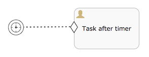

===== User Event Listener

===== User Event Listener 用户事件监听器

A user event listener can be used when needing to capture a user interaction that directly influences a case state,
instead of indirectly via impacting variables or information in the case.
A typical use case for a user event listener are buttons in a UI that a user can click to drive the state of the case instance.
When the event is triggered an _Occur_ event is thrown to which sentries can listener to.
Like timer event listeners, it has a much simpler lifecycle that a _task_.

一个用户事件监听器被用作捕获一个直接影响案例状态而不是间接影响变量或者案例信息的用户交互. 一个典型的例子就是界面的按钮,用户点击后改变case实例的状态.
当 事件被触发, _Occur_ event会被抛出, 并且被哨兵所捕获. 类似计时器事件监听器, 相比任务,它也有一个更为简单的生命周期.

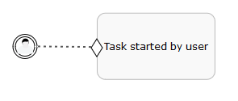

User event listeners can be queried using the _org.flowable.cmmn.api.runtime.UserEventListenerInstanceQuery_. Such a query can be created by calling the _cmmnRuntimeService.createUserEventListenerInstanceQuery()_ method. Note that a user event listener is also a plan item instance, which means it can also be queried through the _org.flowable.cmmn.api.runtime.PlanItemInstanceQuery_ API.

用户事件监听器可以使用 _org.flowable.cmmn.api.runtime.UserEventListenerInstanceQuery_ 查询. 类似调用 the _cmmnRuntimeService.createUserEventListenerInstanceQuery()_ 方法.
注意:也是一个计划项实例, 意味着也可以通过 the _org.flowable.cmmn.api.runtime.PlanItemInstanceQuery_ API 查询.

A user event listener can be completed by calling the _cmmnRuntimeService.completeUserEventListenerInstance(id)_ method.

用户事件监听器可以通过调用 _cmmnRuntimeService.completeUserEventListenerInstance(id)_ 方法来完成.

===== Generic Event Listener

===== Generic Event Listener 一般事件监听器

A generic event listener is used to typically model a programmatic interaction (e.g. a external system that calls out to change something in a case instance).

一般事件监听器通常被用作编程交互建模(例如, 一个外部系统在一个case实例中调用来更改某些东西)

image::images/cmmn.generic-event-listener.png[align="center"]

The API to retrieve and complete these event listeners is on the _CmmnRuntimeService_:

通过 _CmmnRuntimeService_ 来获取和完成这些事件监听器

[source,java,linenums]
----
GenericEventListenerInstanceQuery createGenericEventListenerInstanceQuery();
void completeGenericEventListenerInstance(String genericEventListenerInstanceId);
----

Similar to _user event listeners_, this API is a wrapper on top of the _PlanItemInstance_ queries and operations. This means that the data can also be retrieved through the regular _PlanItemInstanceQuery_

和  _user event listeners_ 类似, 这个 API 是 _PlanItemInstance_ 查询和操作顶部的包装. 这意味着数据也可以从  _PlanItemInstanceQuery_ 获取.

Note that generic event listeners are not part of the CMMN specification, but are a Flowable-specific addition.

注意 一般事件监听器不是 CMMN 规范的内容, 而是 Flowable-规范 的补充

===== Automatic removal of event listeners

===== Automatic removal of event listeners 自动移除事件监听器

The engine will automatically detect when event listeners (user or timer) are not useful anymore.
Take for example the following case definition:

引擎会自动监测不再使用的事件监听器(用户或者定时器), 例如下面的case定义:

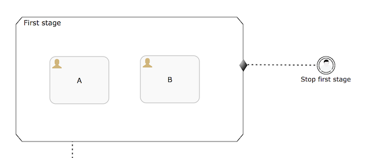

Here, the _First stage_ contains two human tasks (A and B) and it can be exited by a user when the _Stop first stage_ user event is triggered.
However, when both tasks A and B are completed, the stage will also complete. If now the user event listener would be triggered, there is nothing that listens to this event anymore.
The engine will detect this and terminate the user event automatically.

这里, 第一个阶段,包含两个人工任务(A 和 B), 并且当停止第一个阶段事件被触发, 该阶段会被终止. 然而, 当 A 和 B 都完成后, 该阶段stage 也会完成.
如果这个时候触发用户事件监听器, 将会不起任何作用. 此时引擎将会检测到,并自动决定该用户事件.

The same mechanism also works for event listeners that are referenced by entry sentries:

相同的原理, 适用于两个入口哨兵的监听器场景:

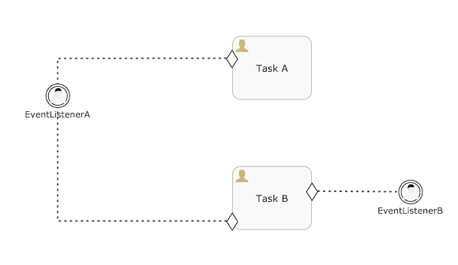

In this case, in the case that _EventListenerA_ would be triggered, _EventListenerB_ is terminated (as nothing is listening to its occurrence anymore).

在这种场景, 如果  _EventListenerA_ 被触发, _EventListenerB_ 会终止(因为没有任何在监听B的发生)

Or, when timer and user event listeners are mixed, the one that is triggered first will also cause the removal of others (when they are not referenced somewhere else):

或者, 当定时器和用户事件监听器被混合使用, 首先被触发的一个会造成其他的移除(当他们没有被别的地方引用)

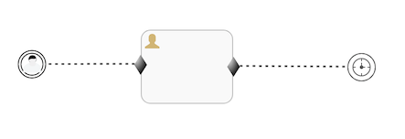

Here, the timer will be removed in case the user event is triggered first (and vice versa).

这里, 定时器会被移除, 如果用户件事监听首先被触发.(反之亦然)

The detection also takes in account plan items that have not yet been created. Take for example the following case definition:

检测还考虑到尚未创建的计划项.如下图所示:

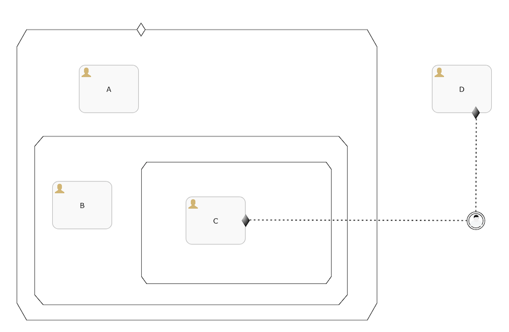

Here, human task _C_ is not yet created when a case instance is started for this case definition. The user event listener will not be removed as long that _C_ has a parent stage that is in a non-terminal state, as this means that the event could still be listened to in the future.

这里, 当case 实例启动后, 人工任务C还未被创建. 只要C具有处于非终止 non-terminal 状态的父级，就不会删除用户事件监听器.这意味着该事件可以在未来依然被监听

===== Available condition
===== Available condition 可用条件

All types of event listeners can be configured to have a *available condition*: an expressions that will guard the available state of the event listener. To explain the use case, take the following case definition:

所有类型的事件监听器都拥有一个 *available condition*: 一个表达式用来维护事件监听器的可用状态.

image::images/cmmn.create-condition.png[align="center"]

When the case instance is started, Stage 1 (as it has no entry criteria) will be moving immediately from _available_ to _active_. Similar story for human task A. Human task B will move from _available_ to _enabled_ as it's manually activated.

当 case实例启动后, stage 1 (没有入口凭证)将立即从可用状态变成活跃状态. 人工任务A类似. 手动激活人工任务B, 它的状态从 _available_ to _enabled_.

Normally, also the event listener would become _available_. The life cycle of event listeners is simpler than that of plan items such as human tasks: an event listener stays in the _available_ state until the event happens. There's no _active_ state like for other plan items.
This means that a user could trigger it after start and the stage would be exited.

正常来讲, 事件监听器状态也会变成 _available_. 事件监听器的生命周期比其他计划项(比如人工任务)简单: 事件监听器保持可用状态, 直到事件发生. 这里没有类似其他计划项一样拥有活跃状态,
这意味着 一个用户可以在开始之后触发它, 然后stage将会退出.

In some use case however, the event listener shouldn't be _available_ for the user to interact with (or a timer shouldn't start, when using a timer event listener) unless a certain condition is true.

在一些场景中,除非一个明确满足true的条件, 否则事件监听器不应该可供用户交互(或者当使用定时器监听时, 一个定时器不应该开始) .

In the example above, we want to only create it when the stage doesn't have any active children (or required) anymore. Setting the *availableCondition* to *${cmmn:isStageCompletable()}* will allow the event listener to be created which makes it move immediately to _available_. Concretely in this model, when human task A is completed Stage 1 becomes _completable_ (as human task B is manually activated and non-required). This makes the _availableCondition_ of the event listener _true_ and the event listener is now available for a user to decide to exit the stage.

在上述例子中, 我们想要只在该阶段没有任何活跃元素时创建它. 设置 *availableCondition* to *${cmmn:isStageCompletable()}* 将允许事件监听器被创建, 使得它状态立即变成可用.
在这个模型中具体讲, 当人工任务 A 完成, stage 1 变成可完成(因为人工任务B是手动激活的，并且不是必需的)。这使得事件监听器的可用条件变为true, 同时用户也可以决定是否退出该阶段.

Note: this is a Flowable specific addition to the CMMN specification. Without this addition, the event listener would have to be nested within a substage which is protected with entry criteria that listens to the completion of task A.

注意: 这是一个 Flowable 规范对CMMN规范的特定添加.如果没有此添加，则事件监听器将必须嵌套在子阶段中，该子阶段受入口凭证监听任务 A 完成的保护。

Note: if this were an autocompletable stage, the engine would complete the stage automatically when A completes.

注意: 如果是一个可以自动完成的阶段stage, 引擎在A完成时, 自动完成该阶段stage.

==== Item control: Repetition Rule

==== Item control: Repetition Rule 条目控制: 重复规则

Plan items on the case model can have a _repetition rule_: an expression that can be used to indicate a certain plan item needs to be repeated.
When no expression is set, but the repetition is enabled (for example, the checkbox is checked in the Flowable Modeler) or the expression is empty, a _true_ value is assumed by default.

案例模型中的计划项可以具有重复规则 _repetition rule_ ：一个表达式，可用于指示某个计划项目需要重复。
如果未设置表达式，但启用了重复（例如，在 _Flowable Modeler_ 模型设计器中勾选了复选框）或表达式为空，则默认为 _true_。

An optional _repetition counter variable_ can be set, which holds the index (one-based) of the instance. If not set, the default variable name is _repeitionCounter_.

可以设置一个可选的 _repetition counter variable_属性，它将保存一个实例对应的索引(从1开始). 如果未设置,默认的变量名为 _repeitionCounter_.

If the plan item does not have any entry criteria, the repetition rule expression is evaluated when the plan item is completed or terminated. If the expression resolved to _true_, a new instance is created. For example, a human task with a repetition rule expression _${repetitionCounter < 3}_, will create three sequential human tasks.

如果一个计划项没有设置入口凭证, 当它完成或则停止时,重复准则表达式都会计算. 如果解析为true, 则创建一个新的实例. 例如, 一个人工人有表达式 _${repetitionCounter < 3}_, 将会创建3个有序的人工任务.

If the plan item has entry criteria, the behavior is different. The repetition rule is not evaluated on completion or termination, but when a sentry of the plan item is satisfied. If both the sentry is satisfied and the repetition rule evaluates to true, a new instance is created.

如果计划项有设置入口凭证, 表现是不同的. 当完成或中止时, 重复规则不会计算. 只有满足哨兵的条件才会计算.如果同时满足哨兵条件并且重复准则计算为true, 一个新的实例才会被创建.

Take, for example, the following timer event listener followed by a human task. The sentry has one entry criterion for the _occur_ event of the timer event listener. Note that enabling and setting the repetition rule on the task has a visual indicator at the bottom of the rectangle.

例如，下面的计时器事件监听器后面跟着一个人工任务。哨兵对于计时器事件监听器的发生事件有一个入口凭证。注意，在任务上启用和设置重复规则都会在矩形底部有一个可视指示器。

image::images/cmmn.repeatingtimereventlistener.png[align="center"]

If the timer event listener is repeating (for example, _R/PT1H_), the _occur_ event will be fired every hour. When the repetition rule expression of the human task evaluates to true, a new human task instance will be created each hour.

如果定时器事件监听器是可重复的(例如, _R/PT1H_), 每间隔1小时,发生事件 _occur_ event 会被触发. 当人工任务的重复准则计算为true, 每隔1小时,一个新的人工任务实例会被创建.

Note that Flowable allows to have repeating user and generic event listeners. This is contrary to the CMMN specification (which disallows it), but we believe it is needed for having a more flexible way of using event listeners (for example to model a case where a user might multiple times trigger an action that leads to the creation of tasks).

注意, Flowable 允许拥有可重复的用户和一般事件监听器. 这和 CMMN 准则是相反的. 但是我们相信拥有一个更加灵活的方式使用时间监听器是需要的(例如在一个用户需要多次触发一个动作来创建人物的案例模型)

==== Item control: Manual Activation Rule

==== Item control: Manual Activation Rule 条目控制: 手动激活准则

Plan items on the case model can have a _manual activation rule_: an expression that can be used to indicate a certain plan item needs to be _manually activated by an end-user_.
When no expression is set, but the manual activation is enabled (for example, the checkbox is checked in the Flowable Modeler) or the expression is empty, a _true_ value is assumed by default.

案例模型中的计划项可以拥有一个手动激活准则: 一个表达式被提供给终端用户手动激活一个确定的计划项. 当未设置任何表达式, 但是启用了手动激活(例如, Flowable Modeler 中的复选框被选中)
或者表达式为空, 默认值为true.

Stages and all task types can be marked for manual activation. Visually, the task or stage will get a 'play' icon (small triangle pointing to the right) to indicate an end-user will have to manually activate it:

阶段stage 和所有类型任务都可以设置手动激活. 可视化地, 任务或者阶段stage 将会有一个 播放图标 'play' icon(一个指向右侧的小三角形),指明用户需要手动去激活它.

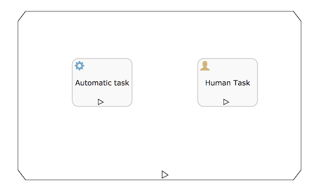

Normally, when a sentry for a plan item is satisfied (or the plan item doesn't have any sentries) the plan item instance is automatically moved to the _ACTIVE_ state. When a manual activation is set though, and it evaluates to true, the plan item instance now becomes _ENABLED_ instead of _ACTIVE_. As the name implies, the idea behind this is that end-users manually have to activate the plan item instance. A typical use case is showing a list of buttons of potential plan item instances that can currently be started by the end user.

正常来讲, 当一个计划项的哨兵条件得到满足(或者没有任何哨兵), 计划项将自动转为活跃状态 _ACTIVE_. 当设置了手动激活,并且计算结果为true,计划项从活跃状态 _ACTIVE_ 变为已启用状态 _ENABLED_. 正如名称所示, 背后的想法就是指终端用户需要手动激活计划项.
一个典型的用例就是一个潜在计划项实例的按钮列表.而这些按钮目前可以由最终用户启动.

为了启动一个可启动的计划项实例,  可以使用 _CmmnRuntimeService_ 的 _startPlanItemInstance_ 方法:

[source,java,linenums]
----
List<PlanItemInstance> enabledPlanItemInstances = cmmnRuntimeService.createPlanItemInstanceQuery()
    .caseInstanceId(caseInstance.getId())
    .planItemInstanceStateEnabled()
    .list();

// ...

cmmnRuntimeService.startPlanItemInstance(planItemInstance.getId());
----

注意,任务的行为只在计划项实例进入活动状态时被执行。例如，对于人工任务，只有在调用 _startPlanItemInstance_ 方法之后才会创建用户任务。

已启动的计划项实例可以转变为 禁用状态 _DISABLED_:

[source,java,linenums]
----
cmmnRuntimeService.disablePlanItemInstance(planItemInstance.getId());
----

Disabled plan item instances can be enabled again:

禁用的计划项也可以重新被启动:

[source,java,linenums]
----
cmmnRuntimeService.enablePlanItemInstance(planItemInstance.getId());
----

注意, 在决定阶段或案例实例终止时，禁用状态 _DISABLED_ 被视为“终端”状态. 这意味着当只有禁用的计划项实例存在，案例实例将终止.

==== Item control: Required Rule

案例模型中的计划项可以拥有一个要求准则 _required rule_: 一个表达式被用作被外部stage 或者案例模型要求执行的一个计划项.这可以用来表明案例模型中的计划项哪些是必须的,哪些是可选的.

当未设置任何表达式, 但是启用了 _required rule_ (例如, Flowable Modeler 中的复选框被选中)或者表达式为空, 默认值为true.

_required rule_ 与 父类 stage的 _autoComplete_ 属性一起使用:
* 如果 _autoComplete_ 为 _false_, 这个也是默认值, *all* 所有子计划项实例必须处于最终状态(完成、终止，等等), 以便由引擎完成阶段计划项实例.

* 如果 _autoComplete_ 为 _true_, 需要所有要求准则计算为true的子计划项实例进入最终状态. 如果这没有其他处于活跃状态的子元素, 父类阶段 stage 将自动完成.

阶段stage 拥有一个 *completeable* 属性来用作表示当前条件是否得到满足来完成该stage. 例如, 下面的简单阶段stage, 假设一个哨兵的条件为true, 另一个为false, 则意味着
左边的计划项实例将进入活跃状态, 右侧的将进入可用状态.

image::images/cmmn.completeable-stage.png[align="center"]

调用 _cmmnRuntimeService.completeStagePlanItemInstance(String stagePlanItemInstanceId)_ 完成当前stage是不可能的(抛出异常),
因为有一个活跃状态的子元素存在. 当左侧的用户任务完成, 因为当前没有子元素活跃, _completeStagePlanItemInstance_ 会被调用.
但是对于它自身, 阶段stage 不会自动完成, 因为右边的用户任务还处于可用状态.

如果上面的阶段stage 设置为 *autoCompleteable* (在底部有一个黑色的小矩形), 右边的计划项设置为必须的(有一个可见的感叹号标记), 表现会不同:

image::images/cmmn.completeable-stage02.png[align="center"]

* 如果左边计划项实例是活跃(哨兵为true), 右边不是(哨兵为false). 这种情况下, 当左边任务完成后, stage 实例将会自动完成并且所有必须的计划项实例进入最终状态.

* 如果左右俩个任务都是活跃状态(哨兵都为true)

** 当左边任务完成后, 因为右边实例还处于活跃zhuangt, 当前阶段stage 不会自动完成.

** 当右边任务完成后, 因为左边必须的任务不是出于最终状态(活跃), 当前阶段 stage不会自动完成.

* 如果左边任务不是活跃状态, 右边出于活跃. 这种情况下, 当右边任务完成后, 当前阶段stage 不会自动完成, 因为左边必须的任务不是出于一个最终状态. 只有左边任务出于活跃并且完成后, 才能完成当前阶段 stage.

注意, 手动激活规则独立于要求准则. 例如, 以下阶段stage:

image::images/cmmn.completeable-stage03.png[align="center"]

这里, 用户任务D是必须的, 任务B是需要手动激活.

* 如果D完成, 当前stage将自动完成. 因为B不是必须的并且不是活跃状态.

* 如果B也是必须的, 即使D已经完成, 还是需要手动激活B(调用 _cmmnRuntimeService.startPlanItemInstance(String planItemInstanceId)_), 然后当前阶段stage 才能自动完成.

==== Item control: Completion Neutral Rule

案例模型中的计划项可以拥有一个中立完成准则 _completion neutral rule_: 一个表达式被用作对于完成父类stage 或者案例模型, 一个计划项是中立的(非必须).
这可以用来表明案例模型中的计划项哪些是必须的,哪些是可选的. 相比在某些时候使用 required rule 和 autoComplete, 会更加灵活.

注意,  中立完成准则 _Completion Neutral Rule_ 不是 CMMN 1.1规范, 是 Flowable 规范的补充.

依照规范, 出于 *AVAILABLE* 可用状态的阶段 stage 不能被完成, 除非 _autoComplete_ 属性为true, 并且计划项不是必须的. 例如, 一个计划项保持可用 *AVAILABLE* 状态, 哨兵条件未满足. 这意味
除非计划项被标记为非必须,并且 父类 stage 设置 _autoComplete_, 否则 父类stage 不会完成. 缺点是, 一旦一个阶段被标记为自动完成，所有子计划项目都需要为所需的规则进行配置, 这在某些用例中是冗长和繁重的工作

中立完成准则 _Completion Neutral Rule_, 与 autoComplete-required 机制相反，完成中立规则从“自底向上”工作:一个计划项目可以单独标记为中立,而无需标记任何其他计划项目.

当计划项都计算为true, _Required Rule_ 优先.

To summarize:
总结:

* 一个计划项设置为 _"completion neutral"_, 如果他出于活跃 *AVAILABLE* 状态(等待一个入口哨兵凭证), 将允许 父类stage 自动完成. 这意味着一个计划项目相对于它的父阶段完成评估是中立的.

* 在以下条件中, 一个 stage 会保持活跃 *ACTIVE* 状态:

    1. 它拥有至少一个出于活跃状态的计划项
    2. 它拥有至少一个带有 _requiredRule_ , 处于可用 *AVAILABLE* 或者 启用 *ENABLE* 状态的计划项.
    3. 它没有被标记为 _autoComplete_, 拥有至少一个 计划项处于 启用 *ENABLED* 状态 (不管 必须准则 _requiredRule_)
    4. 它没有被标记为 _autoComplete_, 拥有至少一个 计划项处于 可用 *AVAILABLE* 状态并且 不是 完成中立 _completionNeutral_

* 一个阶段 将会完成:

    1. 它不包含子元素, 或者所有子计划项 都是处于 一个 终止 _Terminal_ 或者 半终止 _Semi-terminal_ 状态 (关闭, 完成, 禁用, 失败)
    2. 它没有标记为 _autoComplete_ 且所有存在的子计划项处于 可用 *AVAILABLE* 状态, 并且是 完成中立 _completionNeutral_ ,而不是必须的
    3. 它标记为 _autoComplete_ 且所有子计划项非必须 _not required_, 处于 已启用 *ENABLED* 或者 可用 *AVAILABLE* 状态. (不管 完成中立 _completionNeutral_, 要求准则优先)

[[cmmn_sentry_evaluation]]
=== Sentry evaluation

=== 哨兵计算

在任何案例定义中, 哨兵扮演一个重要的角色. 它们提供了一个强大的声明式配置方式来激活正确的计划项或者自动停止.因此，Flowable CMMN 引擎核心逻辑最重要的部分之一是计算哨兵，以查看在一个案例实例中发生了什么状态更改。

==== 什么时候计算哨兵?

在任何状态发生改变或者新事件发生,具体地说，这意味着:

* 当一个案例实例启动.

* 当一个等待状态的计划项被触发继续.(比如人工任务)

* 当案例实例相关变量发生改变(新增, 修改, 或删除)

*当计划项实例状态改变(比如 通过 RuntimeService 停止, 一个手动计划项启动,等等)

* 当RuntimeService#evaluateCriteria 方法手动触发.

伴随着状态改变的进行, 引擎会有计划地一直对当前活跃的哨兵进行计算.例如，假设一个人工任务的完成满足另一个人工任务的出口哨兵。第二个人工任务的状态更改将再次使用此新信息对所有活动哨兵进行新的评估。当最后一次评估没有发生变化时，引擎认为状态稳定，停止计算.

==== Concepts 概念

哨兵包含两部分:

- 与其他计划项生命周期相关的一个或者多个 _onParts_
- 零个或者一个 if条件

注意以下案例定义:

image::images/cmmn.sentry-eval-01.png[align="center"]

假设(上图中未展示出来)

* 任务C的入口哨兵监听任务 A和B的完成 _complete_ 事件
* 出口哨兵监听 用户事件监听器的发生 _occur_ 事件 _'Stop  C'_
* 入口哨兵有个表达式设置为 _${var:eq(myVar, 'hello world')}_

在这个简单例子中, 入口哨兵 有两个 onParts 和 一个 ifPart. 退出哨兵只有一个 onPart.

当案例实例启动后, 人工任务A和B被创建(他们没有入口哨兵), 很快进入活跃 _active_ 状态. C因为入口哨兵条件不满足, 处于可用 _available_ 状态. 用户事件监听器“Stop C”从一开始就可用，因此可以被触发.

当任务A和B都完成并且变量 _myVar_ 设置为 _'hello world'_, 入口哨兵条件满足并且触发. C后面的计划项实例被移动到active状态, 同时,人工任务C被创建(例如，现在可以通过 _TaskService_ 查询它).
当'Stop C'被触发(通过 _CmmnRuntimeService#completeUserEventListenerInstance_ 方法),出口哨兵条件满足, C被中止.

如果 _'Stop C'_ 在 C变成活跃 _active_ 状态前被触发, 它的计划项实例将被中止, 出口哨兵也将不再监听任何.

==== 默认行为

当一个案例实例启动后

----
CaseInstance caseInstance = cmmnRuntimeService.createCaseInstanceBuilder()
    .caseDefinitionKey("myCase")
    .start();
----

入口哨兵条件会立即被计算, 因此当案例实例启动会有一个有序的循环计算.

注意, 如果使用像_${myVar == 'hello world'}_ 条件表达式不会起作用. 引擎会抛出 PropertyNotFound 异常, 因为它不知道 变量myVar.

为了解决上述问题:

 * 在启动时传一个 _myVar_ 变量
 * 做一个非空校验, 类似 _${planItemInstance.getVariable('myVar') != null && planItemInstance.getVariable('myVar') == 'hello world'}_
 * 或者更简单地, 使用 表达式函数 <<cmmnExpressionsFunctions,expression functions>> , 类似 _${var:eq(myVar, 'hello world')}_ 考虑到变量可能不存在的情况

*默认的计算逻辑有“缓存”，这意味着当哨兵的一部分条件得到满足时，引擎将存储并在随后的计算中并"记住"这个值.*

这意味着, 从某一部分(onPart或ifPart of the sentry)得到满足的那一刻起, 该特定部分在下一次评估中不再被评估, 而是被认为是正确的.

在上述例子中,这是任务A相对于B通常会在另一个时间点完成。例如,如果任务A完成后,任务C哨兵的一部分说“我监听任务A完成“得到满意,这事实上为将来被缓存。如果现在B完成了,
它也被存储。如果 _myVar_ 变量得到正确的值，ifPart也会触发，整个岗兵和任务C也会被激活。当然，也可以先满足变量值，然后再满足任务. 关键是这并不重要,因为引擎会保存之前满足的部分条件

这是流程引擎的默认行为, 可以设置 哨兵 _triggerMode_ 为 *default* 覆盖. 在Flowable Modeler 中增加一个新计划项时自动被设置.
当不设置(例如从另一个工具导入模型)时, _triggerMode_ 默认是 *default*.

==== Trigger mode "onEvent" 事件触发模式

默认行为(查看前面部分)是保存先前被满足的部分. 这是最常用和最安全的方法(也是对哨兵进行推理时通常期望的方法).

另一种哨兵触发模式称为“onEvent”。在这种模式下，引擎将有关于哨兵的部分保存，不会保存*not remember*过去满足的任何部分。这在高级用例中有时是需要的。以下面的例子为例:

image::images/cmmn.sentry-eval-02.png[align="center"]

这里, 案例模型是一个有三个子阶段stage. 所有子阶段都可以重复. 子阶段B和C有一个入口哨兵用来等待阶段A的完成. 同理(未展示出来), 两个哨兵都有一个变量的依赖条件.

在高级用例中, 可能想要或需要哨兵部分(特别是包含条件的ifPart)仅在相关计划项的生命周期事件发生时才进行计算。在本例中，正是Stage A的完成事件。
对于这些用例，可以将哨兵的 _triggerMode_ 设置为onEvent。顾名思义，这意味着哨兵的计算只在引用事件发生时发生，而不考虑对过去事件的缓存。

具体地说, 在这里的例子中，只有在阶段A完成时(而不是在其他时刻)才会计算入口哨兵的情况. 这与一般的评价规则有很大的不同.
在这个特殊的例子中,它确实使管理变量变得更容易, 因为条件只在一个精确的时刻进行评估，并且不需要担心由于某个变量在某个时间点的具体值而触发某个哨兵的部分.
特别是在本例中，所有子阶段都在重复，这需要做很多工作。这是一种功能强大的机制，但对于高级建模人员来说，这意味着他们对案例模型和这种 _triggerMode_ 的语义具有内在的知识.

注意，在计算哨兵时，引擎认为所有的事件都是同时发生的。以下面的案例定义为例:

image::images/cmmn.sentry-eval-03.png[align="center"]

假设所有的哨兵使用 _triggerMode onEvent_ 的设置. 如果任务A完成, 这会使任务B退出, 任务C也会退出. 所以,即使有两种截然不同的生命周期事件(A被完成和B被退出),人们可能会认为 _onEvent_ 的字面意思是,
有两种截然不同的计算发生, 而另一部分C的退出哨兵的缓存被忘记.引擎足够聪明地看到,他们是相同的计算周期且任务C也将退出.

从技术上讲: _onEvent_ 哨兵存在缓存，更具体地说，是用于在同一API调用(或事务，简单地说)期间发生的计算.

*Important* onEvent是一种功能强大的机制，只有当很好地理解语义时才应该使用它。如果不仔细检查用例，可能会创建由于没有正确的配置哨兵而卡住的用例模型。

(例如, 假设一个哨兵有一个onPart监听一个计划项的完成情况，还有一个带有条件的ifPart。如果计划项完成, 从而触发onPart, 但是由于某种原因缺少了条件中使用的变量…… ifPart将永远不会触发，case实例可能会陷在一个不想要的状态).