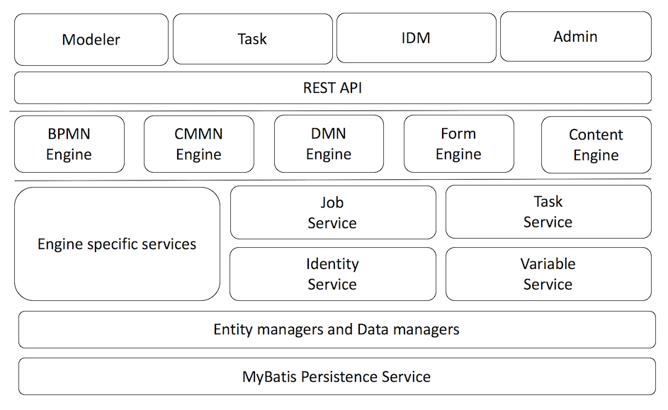

== 体系结构

[[architecture]]

本章从高层次的角度简要介绍了CMMN引擎的内部结构。当然，由于CMMN引擎代码是开源的，因此可以通过深入了解源代码来找到实际的实现细节。

如下图所示，CMMN引擎是Flowable引擎生态系统的一部分，其设计方式与其他引擎类似。CMMN引擎基于CMMN特定服务和共享服务构建：任务，变量，身份和作业服务，它们独立于引擎。 在较低级别，实体和数据管理器层负责低级别持久性，相当于其他引擎。



通过使用共享服务，这也意味着例如来自BPMN和CMMN引擎的任务将最终结合在一起，并且可以通过相同的API查询和管理。类似地，对于异步执行器：定时器和异步作业使用相同的逻辑，甚至可以由中央执行器管理。

共享服务架构有第二个好处。通常情况下，当引擎一起使用时，引擎将尽可能共享资源，数据库事务将跨越多个引擎操作的调用，查找缓存是常见的，并且持久性是独立于引擎本身处理的。

CMMN引擎的设计原理与Flowable项目的其他引擎相同。下图给出了使用CMMN引擎时涉及的不同组件的高级概述：

image::images/cmmn.api-call-flow.png[align="center"]

从高层次来看：

一个**CmmnEngine**实例是从**CmmnEngineConfiguration**创建的。可以从配置文件或以编程方式创建配置实例。

__CmmnEngine__以服务的形式提供对Flowable CMMN API的访问：**CmmnRepositoryService**、**CmmnRuntimeService**、**CmmnTaskService**、**CmmnHistoryService**、**CmmnManagementService**。服务的命名及其职责与其他引擎类似。

每个API方法都转换为**Command**实例，此__Command__实例传递给**CommandExecutor**，其中包括使一些**CommandInterceptors**。这些拦截器具有各种职责，包括处理事务。

最终，__Command__通常（除非是纯数据修改__Command__）在**CmmnEngineAgenda**上计划**CmmnOperation**。

操作将从__CmmnEngineAgenda__中获取，直到不再进行操作为止。通常，操作将计划新操作作为其逻辑的一部分。

操作中的逻辑将调用较低级别的服务和/或实体管理器。

BPMN和CMMN引擎之间的一个很大区别是BPMN引擎通常是“本地的”：引擎查看当前状态，检查进程中的前面的信息并继续（当然这是一个简化，这有很多不适用的操作，但从概念上做出区分，这是正确的）。CMMN引擎的工作方式不同：在CMMN中，数据起着重要作用，数据的更改可以在案例定义中的各个位置触发很多事情。因此，只要发生更改，就会经常计划和执行**EvaluateCriteriaOperation**。当检测到重复或无用的评估时，引擎会对这些评估进行优化。

CMMN引擎工作的核心是计划项目实例的概念，表示当前在案例中存在哪些**计划实例项**以及它们具有哪种状态。与BPMN完全不同，CMMN为__计划项__定义了严格的状态__生命周期__。这在__CmmnRuntimeService__方法，查询API和**PlanItemInstance**对象的数据字段部分中表示。

可以通过将日志记录设置为议程包的调试来检查议程的工作，操作以及如何处理计划项实例。例如，使用log4j时：

```
log4j.logger.org.flowable.cmmn.engine.impl.agenda=DEBUG
```

这样记录的信息如下：

```
Planned [Init Plan Model] initializing plan model for case instance bfaf0e64-eaf4-11e7-b9d0-acde48001122
Planned [Change PlanItem state] Task A (id: planItemTaskA), new state: [available] with transition [create]
Planned [Change PlanItem state] PlanItem Milestone One (id: planItemMileStoneOne), new state: [available] with transition [create]
Planned [Change PlanItem state] Task B (id: planItemTaskB), new state: [available] with transition [create]
Planned [Change PlanItem state] PlanItem Milestone Two (id: planItemMileStoneTwo), new state: [available] with transition [create]
Planned [Evaluate Criteria] case instance bfaf0e64-eaf4-11e7-b9d0-acde48001122
Planned [Evaluate Criteria] case instance bfaf0e64-eaf4-11e7-b9d0-acde48001122 with transition 'create' having fired for plan item planItemTaskA (Task A)
Planned [Evaluate Criteria] case instance bfaf0e64-eaf4-11e7-b9d0-acde48001122 with transition 'create' having fired for plan item planItemMileStoneOne (PlanItem Milestone One)
Planned [Evaluate Criteria] case instance bfaf0e64-eaf4-11e7-b9d0-acde48001122 with transition 'create' having fired for plan item planItemTaskB (Task B)
Planned [Evaluate Criteria] case instance bfaf0e64-eaf4-11e7-b9d0-acde48001122 with transition 'create' having fired for plan item planItemMileStoneTwo (PlanItem Milestone Two)
Planned [Activate PlanItem] Task A (planItemTaskA)
Planned [Change PlanItem state] Task A (id: planItemTaskA), new state: [active] with transition [start]
Planned [Evaluate Criteria] case instance bfaf0e64-eaf4-11e7-b9d0-acde48001122 with transition 'start' having fired for plan item planItemTaskA (Task A)
Planned [Change PlanItem state] Task A (id: planItemTaskA), new state: [completed] with transition [complete]
Planned [Evaluate Criteria] case instance bfaf0e64-eaf4-11e7-b9d0-acde48001122 with transition 'complete' having fired for plan item planItemTaskA (Task A)
Planned [Activate PlanItem] PlanItem Milestone One (planItemMileStoneOne)
Planned [Change PlanItem state] PlanItem Milestone One (id: planItemMileStoneOne), new state: [active] with transition [start]
Planned [Evaluate Criteria] case instance bfaf0e64-eaf4-11e7-b9d0-acde48001122 with transition 'start' having fired for plan item planItemMileStoneOne (PlanItem Milestone One)
Planned [Change PlanItem state] PlanItem Milestone One (id: planItemMileStoneOne), new state: [completed] with transition [occur]
Planned [Evaluate Criteria] case instance bfaf0e64-eaf4-11e7-b9d0-acde48001122 with transition 'occur' having fired for plan item planItemMileStoneOne (PlanItem Milestone One)
Planned [Activate PlanItem] Task B (planItemTaskB)
Planned [Change PlanItem state] Task B (id: planItemTaskB), new state: [active] with transition [start]
Planned [Evaluate Criteria] case instance bfaf0e64-eaf4-11e7-b9d0-acde48001122 with transition 'start' having fired for plan item planItemTaskB (Task B)
Planned [Change PlanItem state] Task B (id: planItemTaskB), new state: [completed] with transition [complete]
Planned [Evaluate Criteria] case instance bfaf0e64-eaf4-11e7-b9d0-acde48001122 with transition 'complete' having fired for plan item planItemTaskB (Task B)
Planned [Activate PlanItem] PlanItem Milestone Two (planItemMileStoneTwo)
Planned [Change PlanItem state] PlanItem Milestone Two (id: planItemMileStoneTwo), new state: [active] with transition [start]
Planned [Evaluate Criteria] case instance bfaf0e64-eaf4-11e7-b9d0-acde48001122 with transition 'start' having fired for plan item planItemMileStoneTwo (PlanItem Milestone Two)
Planned [Change PlanItem state] PlanItem Milestone Two (id: planItemMileStoneTwo), new state: [completed] with transition [occur]
Planned [Evaluate Criteria] case instance bfaf0e64-eaf4-11e7-b9d0-acde48001122 with transition 'occur' having fired for plan item planItemMileStoneTwo (PlanItem Milestone Two)
Planned [Evaluate Criteria] case instance bfaf0e64-eaf4-11e7-b9d0-acde48001122
No active plan items found for plan model, completing case instance
Planned [Complete case instance] case instance bfaf0e64-eaf4-11e7-b9d0-acde48001122
```
