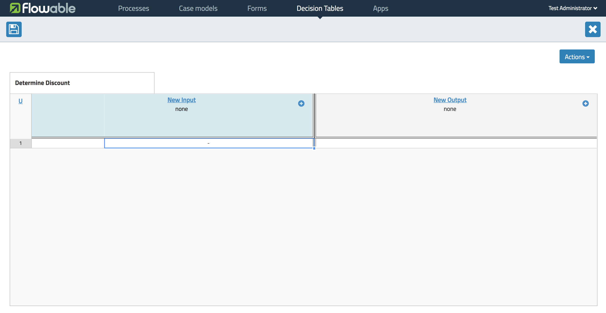
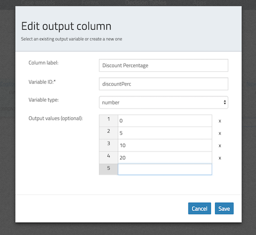
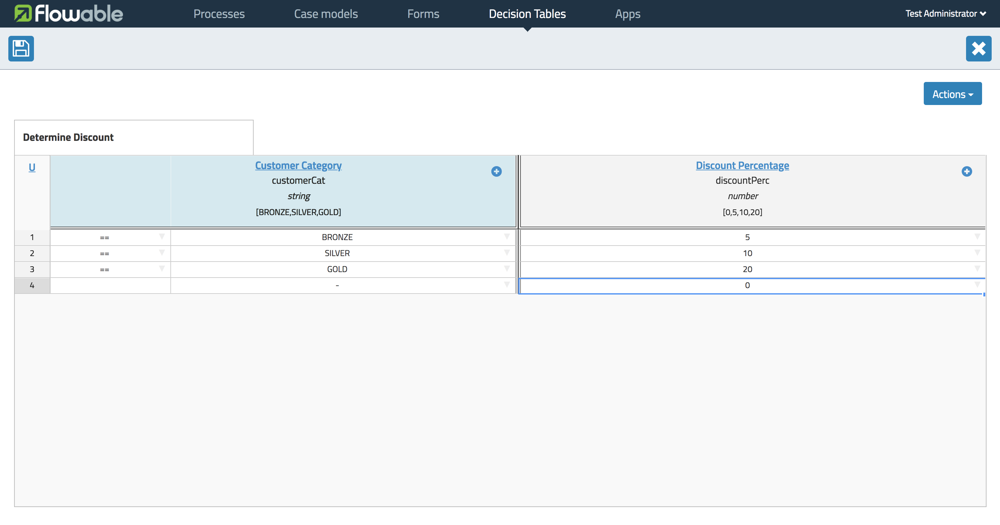
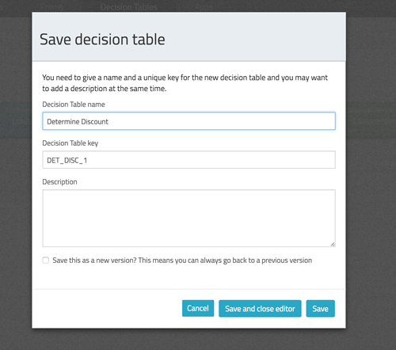
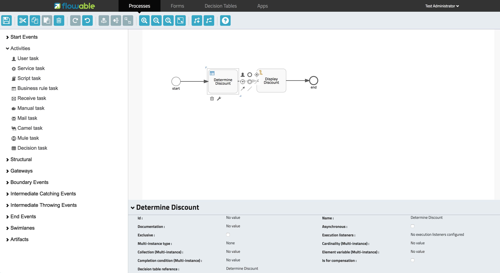

[[bpmn20]]

== DMN 1.1 入门

[[whatIsDmn]]

=== 什么是DMN？

Decision Model & Notation(DMN)是由link:$$http://www.omg.org/spec/DMN/1.1$$[对象管理组（OMG）]发布的标准。它是描述和构建组织内可重复决策的标准方法，以确保决策模型在各组织之间是通用的。

[[dmnDefiningDecision]]

=== 什么是DMN定义？

DMN 1.1模式的根元素是**definitions**。在这个项目中可以定义多个决策定义(尽管我们建议每个文件中只有一个决策定义，这可以简化开发过程的后期维护)。每个决策可以定义一个表达式。目前，Flowable支持几种表达式类型中的**决策表**。

[source,xml,linenums]
----
<definitions xmlns="http://www.omg.org/spec/DMN/20151101"
  namespace="http://www.flowable.org/dmn"
  name="DetermineDiscount">

  <decision id="DET_DISC_1" name="DetermineDiscount">

    <decisionTable id="determineDiscountTable1" hitPolicy="FIRST">
      ..
    </decisionTable>

  </decision>

</definitions>
----

=== 创建DMN定义

虽然使用纯文本编辑器创建DMN定义是可行的，但是对于此示例，我们将首先使用Flowable建模器的决策表编辑器。

接下来，我们将实现一个非常简单的用例：根据客户类别确定折扣百分比。

首先打开Flowable建模器中的决策表部分。

image::images/decision_tables_1.png[align="center"]

选择**Create Decision Table**。

image::images/decision_tables_2.png[align="center"]

填写决策表名称和决策表唯一键，然后选择**Create new decision table**。

现在就可以定义决策表了。接下来我们对编辑器做个说明。

==== Hit Policy 命中策略

我们可以在左上角选择**hit policy**。

可以看到，有7个命中策略可用。

*单一命中*

* **F**IRST: 可以匹配多个（重叠）具有不同输出条目的规则。返回规则顺序中的第一次命中（返回后停止评估）。

* **U**NIQUE: 没有重叠的可能，所有规则都是互斥的。只能匹配到一条规则。

* **A**NY: 可能会有重叠，但如果所有匹配规则显示每个输出的输出条目相等，就可以使用任何匹配。如果输出条目不相等，则命中策略不正确，结果将为空并标记为failed。当禁用link:$$#strictMode$$[strict mode]时，结果是最后一个有效规则。(违规将以验证消息的形式出现)

* **P**RIORITY: 具有不同的输出条目的多个规则可以匹配。此策略返回具有最高输出优先级的匹配规则。输出优先级在输出值的有序列表中按优先级递减的顺序指定。当禁用link:$$#strictMode$$[strict mode]且未定义输出值时，结果是最后一个有效规则。(违规将以验证消息的形式出现)

*多重命中*

* **O**UTPUT ORDER: 按输出优先级递减的顺序返回所有命中规则。输出优先级在输出值的有序列表中按优先级递减的顺序指定。

* **R**ULE ORDER: 按规则顺序返回所有命中。

* **C**OLLECT: 以任意顺序返回所有命中。我们可以添加运算符（'+'，'<'，'>'，'＃'）来将一个简单函数应用于输出。如果没有运算符，则结果是所有输出条目的列表。

** + (sum): 决策表的结果是所有不同输出的总和。
** < (min): 决策表的结果是所有输出的最小值。
** > (max): 决策表的结果是所有输出的最大值。
** # (count): 决策表的结果是所有不同输出的总数。

==== 输入和输出表达式

决策表本身的表头分为两部分;蓝色和绿色。蓝色部分是**input expressions**（输入表达式）;绿色的是**output expressions**（输出表达式）。

image::images/decision_tables_4.png[align="center"]

在输入表达式中，我们可以定义将在规则输入条目的表达式中使用的变量(下面解释)。还可以通过选择**Add Input**(右键单击option菜单或单击plus图标)来定义多个输入表达式。

在输出表达式中，我们可以定义将创建什么变量来构成决策表执行的结果(变量的值将由输出条目表达式决定，下面解释)。还可以通过选择**Add Output**(右键单击option菜单或单击plus图标)来定义多个输出表达式。

==== 规则

每个规则由一个或多个输入项和一个或多个输出项组成。输入项是一个表达式，它将根据输入的变量(该“列”的值)求值。当所有输入项都为true时，就认为整个规则是true，开始计算输出项。

[NOTE]
====

DMN规范定义了一种表达式语言：(S)-FEEL。目前，我们不支持这部分规范。 在Flowable DMN中，我们使用JUEL作为表达式语言。
====

image::images/decision_tables_6.png[align="center"]

我们可以双击相应的单元格输入表达式。在此示例中，输入表达式== BRONZE。结合相应输入表达式（列标题）中定义的变量，将在运行时生成完整的表达式customerCat == "BRONZE"。

image::images/decision_tables_7.png[align="center"]

然后双击相应的单元格输出表达式。这实际上更像是一个隐式赋值。
在此示例中，输入表达式5。

然后，我们可以通过添加更多规则（通过选择添加规则）继续完成决策表。

在我们的示例中，规则4有一个空的输入条目，引擎将会把这个空输入条目评估为true。那么如果其他规则都无效，则规则4的结果将是该决策表的输出。在这种情况下，变量**discountPerc**的值为**0**。

现在我们可以保存决策表。填入决策表唯一键。

=== BPMN2.0流程中的应用

通过包含**Decision task**并选择**Decision table reference**，可以在BPMN2.0流程中使用新创建的决策表。

上面定义的流程中，该流程有一个启动表单，它将**customer category**（客户类别）提供给流程实例（从而提供给决策表）。**Display Discount**（显示折扣）用户任务使用表达式表单字段显示决策表的结果;${discountperc}。

=== DMN 1.1 xml文件

上面示例的完整DMN 1.1 xml文件。

[source,xml,linenums]
----
<definitions xmlns="http://www.omg.org/spec/DMN/20151101" id="definition_78d09dd7-374c-11e8-b5d8-0242ac120005" name="Determine Discount" namespace="http://www.flowable.org/dmn">
  <decision id="DET_DISC_1" name="Determine Discount">
    <decisionTable id="decisionTable_78d09dd7-374c-11e8-b5d8-0242ac120005" hitPolicy="UNIQUE">
      <input label="Customer Category">
        <inputExpression id="inputExpression_1" typeRef="string">
          <text>customerCat</text>
        </inputExpression>
        <inputValues>
          <text>"BRONZE","SILVER","GOLD"</text>
        </inputValues>
      </input>
      <output id="outputExpression_2" label="Discount Percentage" name="discountPerc" typeRef="number">
        <outputValues>
          <text>"0","5","10","20"</text>
        </outputValues>
      </output>
      <rule>
        <inputEntry id="inputEntry_1_1">
          <text><![CDATA[== "BRONZE"]]></text>
        </inputEntry>
        <outputEntry id="outputEntry_2_1">
          <text><![CDATA[5]]></text>
        </outputEntry>
      </rule>
      <rule>
        <inputEntry id="inputEntry_1_2">
          <text><![CDATA[== "SILVER"]]></text>
        </inputEntry>
        <outputEntry id="outputEntry_2_2">
          <text><![CDATA[10]]></text>
        </outputEntry>
      </rule>
      <rule>
        <inputEntry id="inputEntry_1_3">
          <text><![CDATA[== "GOLD"]]></text>
        </inputEntry>
        <outputEntry id="outputEntry_2_3">
          <text><![CDATA[20]]></text>
        </outputEntry>
      </rule>
      <rule>
        <inputEntry id="inputEntry_1_4">
          <text><![CDATA[-]]></text>
        </inputEntry>
        <outputEntry id="outputEntry_2_4">
          <text><![CDATA[0]]></text>
        </outputEntry>
      </rule>
    </decisionTable>
  </decision>
</definitions>
----

* 此处需要重点强调的是，在Flowable中使用的决策表键是DMN xml文件中的决策ID。