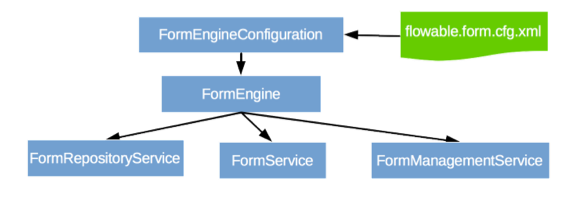

[[chapterApi]]

== Flowable 表单 API

[[apiEngine]]

=== 表单引擎 API 与服务类

表单引擎 API 是与 Flowable 表单交互的最常用方式。核心起点是可以通过 <<configuration,配置部分>> 中描述的几种方式创建的++表单引擎++。从表单引擎中，您能够获得各种其他服务类。

表单引擎和其服务类对象是线程安全的，因此您可以为整个服务保留其中一个引用。

[source,java,linenums]
----
FormEngine formEngine = FormEngines.getDefaultFormEngine();
FormRuleService formRuleService = formEngine.getFormRuleService();
FormRepositoryService formRepositoryService = formEngine.getFormRepositoryService();
FormService formService = formEngine.getFormService();
FormManagementService formManagementService = formEngine.getFormManagementService();
----

++FormEngines.getDefaultFormEngine()++ 将在第一次调用时初始化并构建一个表单引擎，之后调用总是返回相同的表单引擎。使用 +FormEngines.init()+ 和 +FormEngines.destroy()+ 可以正确创建和关闭所有表单引擎。

FormEngines类将扫描所有 +flowable.form.cfg.xml+ 和 +flowable-form-context.xml+ 配置文件。对于所有 +flowable.form.cfg.xml+ 配置文件，表单引擎将以典型的Flowable方式构建：+FormEngineConfiguration.createFormEngineConfigurationFromInputStream(inputStream).buildFormEngine()+。对于所有 +flowable-form-context.xml+ 配置文件，表单引擎将以Spring方式构建：首先创建Spring应用程序上下文，然后表单引擎会从该应用程序上下文中获取。

所有的服务类均是无状态的。这意味着您可以轻松地在群集中的多个节点上运行Flowable表单模块，每个节点都连接同一个数据库，而不必担心哪台机器实际执行了旧的调用。对任何服务类的任何调用都是幂等的，无论它在何处执行。

*FormRepositoryService* 可能是Flowable表单引擎工作时所需的第一个服务类。该服务类提供用于管理和使用++部署文件++和++表单定义++的操作。表单定义是表单模型的根本概念（表单定义的主要概念在 <<form-introduction,表单介绍部分>>中进行了解释）。

++部署文件++是 Flowable 表单引擎中的打包最小单元。一个部署文件中可以包含多个表单定义的JSON 文件。发布一个部署文件意味着将其部署到引擎相关表中，在该引擎中，所有表单定义在存储到数据库之前都会被校验和解析。从那一刻起，系统会感知到这个部署文件，并且部署文件中包含的任何表单都可以被执行。

此外，这个服务类允许您：

* 查询引擎已知的表单定义的部署文件。
* 检索表单定义的POJO类，它可用于使用Java中而不是JSON数据结构。

*FormService* 提供了使用用户为特定表单定义填写的值来创建表单实例的方法。它也可以被用于查询表单实例。

使用 Flowable 表单模块编写自定义应用程序时，通常不需要 *FormManagementService* 。它允许您检索有关引擎版本，数据库表和表元数据的信息。

=== 异常策略

Flowable中的基础异常是 +org.flowable.engine.FlowableException+，这是一个未经检查的异常。这种异常可以被API随时抛出，其他特定方法中发生的“预期中的”异常被记录在link:$$http://www.flowable.org/docs/javadocs/index.html$$[文档]中。例如 ++FormRuleService++ 的摘录：

尽管我们想要避免一个大的异常层次结构，下列的异常子类仍会在特定情况下被抛出。在流程执行或 API 调用期间发生的所有其他错误都不适合下面可能发生的异常，这些错误将作为常规 ++FlowableExceptions++ 抛出。

* ++FlowableOptimisticLockingException++：当由同一数据条目的并发访问引起的数据存储中发生乐观锁问题时抛出。
* ++FlowableClassLoadingException++：当未找到请求加载的类或加载时发生错误时抛出。
* ++FlowableObjectNotFoundException++：当请求或操作的对象不存在时抛出。
* ++FlowableIllegalArgumentException++：这个异常表示在Flowable 表单 API调用中使用了非法参数、在引擎的配置中配置了非法值或者提供了非法值。

[[queryAPI]]

=== 查询 API

有两种方法可以从引擎查询数据：使用查询 API 和本地查询。查询 API 允许您使用流畅的 API 编写完全类型安全的查询。您可以为查询添加各种查询条件（所有条件共同应用逻辑与）与一个排序参数。示例如下：

[source,java,linenums]
----
List<FormDeployment> formDeployments = formRepositoryService.createDeploymentQuery()
    .deploymentNameLike("deployment%")
    .orderByDeployTime()
    .list();
----

有时您需要更强大的查询操作，例如，使用或运算符或使用查询 API 无法表达的查询。对于这些情况，我们引入了本地查询，允许您编写自己的 SQL 语句进行查询。返回类型由您使用的查询对象定义，数据会映射到正确的对象，例如 Deployment、FormInstance 等。由于查询将在数据库中触发，因此必须使用在数据库中定义的表名和列名，这需要一些有关内部数据结构的知识，建议谨慎使用本机查询。表名可以通过 API 进行检索，以使依赖尽可能小。

[source,java,linenums]
----

long count = formRepositoryService.createNativeDeploymentQuery()
    .sql("SELECT count(*) FROM " + formManagementService.getTableName(FormDeploymentEntity.class) + " D1, "
        + formManagementService.getTableName(FormDefinitionEntity.class) + " D2 "
        + "WHERE D1.ID_ = D2.DEPLOYMENT_ID_ "
        + "AND D1.ID_ = #{deploymentId}")
    .parameter("deploymentId", deployment.getId())
    .count();
----

[[apiUnitTesting]]

=== 单元测试

由于 Flowable 表单模块是一个嵌入式的 Java 引擎，因此为表单定义编写单元测试就像编写常规单元测试一样简单。

Flowable 支持 JUnit 4、JUnit 5 做单元测试。

在编写JUnit 5单元测试时，可以使用 +org.flowable.form.engine.test.FlowableFormExtension+。
通过此扩展，表单引擎和服务类可用作测试和生命周期方法的参数。
使用此++拓展++将启用 +org.flowable.form.engine.test.FormDeploymentAnnotation+ 注解（请参阅下面有关其使用和配置的说明），它将在类路径中查找默认配置文件。
使用相同的配置文件时，表单引擎会在多个单元测试中静态缓存。

当使用 +@FormDeploymentAnnotation+ 注解测试方法时，在每次测试之前，将发布在+ FormDeploymentAnnotation＃resources +中定义的表单文件。
如果没有定义资源，将发布与测试类在同一包中的 ++testClassName.testMethod.form++ 形式的资源文件。
在测试结束时，部署文件将会删除，包括所有相关的表单实例、定义等。
有关更多信息，请参阅 ++FormDeploymentAnnotation++ 类。

在编写JUnit 4单元测试时，可以使用 +org.flowable.form.engine.test.FlowableFormRule+ 规则。通过这个规则，表单引擎和服务类可以通过 getter 方法获得。包括这个++规则++将允许使用 +org.flowable.form.engine.test.FormDeploymentAnnotation+ 注解（参见上面有关其使用和配置的说明），它将在类路径上查找默认配置文件。使用相同的配置文件时，表单引擎会在多个单元测试中静态缓存。
也可以为规则提供自定义的引擎配置。

以下代码片段显示了使用 JUnit 5单元测试的示例。

.JUnit 5 test
[source,java,linenums]
----
@ExtendWith(FlowableFormExtension.class)
// 如果需要自定义表单配置，则应取消注释下面的部分
//@FormConfigurationResource("custom1.flowable.form.cfg.xml")
class MyFormDefinitionTest {

  private FormEngine formEngine;

  @BeforeEach
  void setUp(FormEngine formEngine) {
    this.formEngine = formEngine;
  }

  @Test
  @FormDeploymentAnnotation
  void formUsageExample() {
    FormService formService = formEngine.getFormService();

    FormInstance result = formService.getFormInstanceModelById(
        "f7689f79-f1cc-11e6-8549-acde48001122", null);

    Assertions.assertNotNull(result);
  }
}
----

以下代码片段显示了使用 JUnit 4单元测试和 +FlowableFormRule+ （传递可选的自定义配置）的示例。

.JUnit 4 test
[source,java,linenums]
----
public class MyFormDefinitionTest {

  @Rule
  public FlowableFormRule flowableFormRule = new FlowableFormRule("custom1.flowable.form.cfg.xml");

  @Test
  @FormDeploymentAnnotation
  public void formUsageExample() {
    FormEngine formEngine = flowableFormRule.getFormEngine();
    FormService formService = dmnEngine.getFormService();

    FormInstance result = formService.getFormInstanceModelById(
        "f7689f79-f1cc-11e6-8549-acde48001122", null);

    Assert.assertNotNull(result));
  }
}
----

[[apiFormEngineInWebApp]]

=== Web 应用程序中的表单引擎

+FormEngine+ 是一个线程安全的类，可以很容易地在多个线程之间共享。在 Web 应用程序中，这意味着可以在容器启动时创建一次表单引擎，并在容器关闭时关闭引擎。

以下代码片段显示了如何在普通的 Servlet 环境中编写一个简单的 +ServletContextListener+ 来初始化和销毁表单引擎：

[source,java,linenums]
----
public class FormEnginesServletContextListener implements ServletContextListener {

  public void contextInitialized(ServletContextEvent servletContextEvent) {
    FormEngines.init();
  }

  public void contextDestroyed(ServletContextEvent servletContextEvent) {
    FormEngines.destroy();
  }

}
----

+contextInitialized+ 方法将委托给 +FormEngines.init()+。将在类路径中查找 +flowable.form.cfg.xml+ 配置文件，并为给定的配置创建 +FormEngine+ （例如，带有配置文件的多个JAR）。如果类路径上有多个这样的配置文件，请确保它们都有不同的名称。当需要 Form 引擎时，可以使用以下命令获取它：

[source,java,linenums]
----
FormEngines.getDefaultFormEngine()
----

或者

[source,java,linenums]
----
FormEngines.getFormEngine("myName");
----

当然，也可以如 <<configuration,配置部分>> 所述，使用创建表单引擎的任何变体。

上下文监听器的 ++contextDestroyed++ 方法委托给++FormEngines.destroy()++。这将正确关闭所有初始化的表单引擎。
