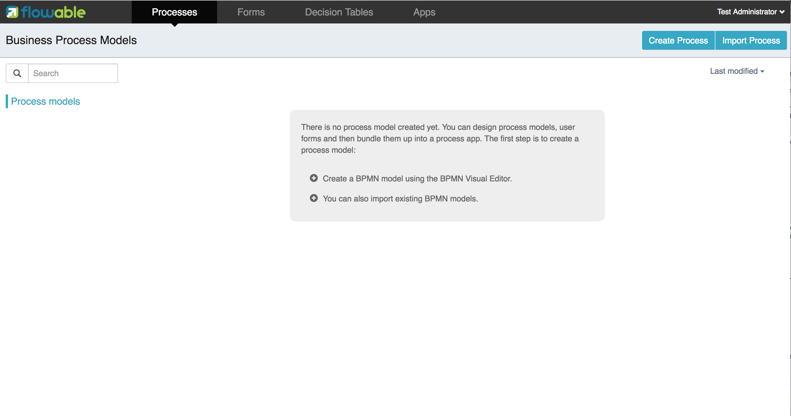
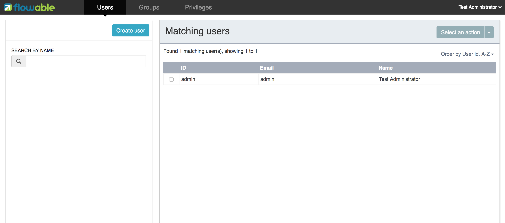

[[flowableUIApps]]

== Flowable UI applications

Flowable provides several web applications to demonstrate and leverage the functionality provided by the Flowable project:

* Flowable IDM: the identity management application that provides single-sign-on authentication functionality for all the Flowable UI applicatons and for users with the idm admin privilege it also provides functionality to manage users, groups and privileges.
* Flowable Modeler: the modeler application that allows for modeling processes, forms, decision tables and application definitions.
* Flowable Task: the runtime task application that provides functionality to start process instances, edit task forms, complete tasks and query on tasks and process instances.
* Flowable Admin: an admin application that allows for querying the BPMN, DMN, form and content engines and provides several options to change process instances, tasks and jobs etc. The admin application connects to the engines through the REST API that is deployed together with the Flowable Task app and the Flowable REST app.

The Flowable IDM is required to be present for all other apps to be able to authenticate. The WAR files for each app can be deployed to the same servlet container (like Apache Tomcat), but can also be deployed on different servlet containers. Because the same cookie is used for authentication for each app, the apps need to run on the same domain.

[[uiAppInstallation]]

=== Installation

Like mentioned before, all four UI apps can be deployed together on the same Tomcat server and to get started this is probably the easiest approach. You can also choose to only install the Modeler app for example, but make sure the Flowable IDM app is always running/deployed as well. For this installation guide we'll describe the installation of all four apps to a Tomcat server.

1. Download a recent stable version of link:$$http://tomcat.apache.org$$[Apache Tomcat].
2. Download the latest stable link:$$http://www.flowable.org/downloads.html$$[Flowable 6 version].
3. Copy the flowable-admin.war, flowable-idm.war, flowable-modeler.war and flowable-task.war files from the Flowable distribution __wars__ folder to the Tomcat webapps folder.
4. Startup the Tomcat server by running the bin/startup.sh (Mac OS and Linux) or bin/startup.bat (Windows) script.
5. Open a web browser and go to link:$$http://localhost:8080/flowable-modeler$$[http://localhost:8080/flowable-modeler].

All Flowable UI apps are now running with an H2 in-memory database and the following login screen should be shown in your web browser:

image::images/flowable_idm_login_screen.png[align="center"]

By default, the Flowable IDM application will create an admin user that has privileges to all the Flowable UI apps. You can login with admin/test and the browser should be redirected to the Flowable Modeler application:

Often, you would like to change the default H2 in-memory database configuration to a MySQL or Postgres (or other persistent database) configuration. You can do this per app by changing the flowable-ui-app.properties file in the WEB-INF/classes/META-INF directory of each app. But it's easier to copy the flowable-ui-app.properties file from one of the apps or get it from link:$$https://github.com/flowable/flowable-engine/blob/master/modules/flowable-ui-task/flowable-ui-task-app/src/main/resources/META-INF/flowable-ui-app/flowable-ui-app.properties$$[Github], and put it in the Tomcat lib folder. The UI applications will first look at a flowable-ui-app.properties file available on the classpath directly and this configuration will have precedence over the configuration file in the WAR. To change the default configuration to MySQL the following changes are needed to the properties file:

[source,linenums]
----
datasource.driver=com.mysql.jdbc.Driver
datasource.url=jdbc:mysql://127.0.0.1:3306/flowable?characterEncoding=UTF-8
datasource.username=flowable
datasource.password=flowable
----

This configuration will expect a flowable database to be present in the MySQL server and the UI apps will automatically generate the necessary database tables. For Postgres the following changes are necessary:

[source,linenums]
----
datasource.driver=org.postgresql.Driver
datasource.url=jdbc:postgresql://localhost:5432/flowable
datasource.username=flowable
datasource.password=flowable
----

In addition to changing the configuration, make sure the database driver is available on the classpath. Again, you could do this for every web application separately by adding the driver JAR file to the WEB-INF/lib folder, but you can also copy the JAR file once to the Tomcat lib folder. For MySQL and Postgres the database drivers can be downloaded from:

* MySQL: link:$$https://dev.mysql.com/downloads/connector/j$$[https://dev.mysql.com/downloads/connector/j]
* Postgres: link:$$https://jdbc.postgresql.org/$$[https://jdbc.postgresql.org/]

The additional configuration options are described in the table below:

[options="header"]
|===============
|Property name|Description
|security.rememberme.key|The hash key that is used by Spring Security to hash the password values in the applications. Make sure that you change the value of this property.
|datasource.jndi.name|JNDI name of the data source, to be used when the datasource is configured in the servlet container instead of defining the datasource url and driver in this configuration file
|datasource.jndi.resourceRef|Set whether the lookup occurs in a J2EE container, i.e. if the prefix "java:comp/env/" needs to be added if the JNDI name doesn't already contain it. Default is "true".
|datasource.driver|The JDBC driver class name
|datasource.url|The JDBC driver url
|datasource.username|The username to be used for the JDBC connection
|datasource.password|The password to be used for the JDBC connection
|datasource.min-pool-size|The minimum datasource pool size
|datasource.max-pool-size|The maximum datasource pool size
|datasource.acquire-increment|Determines how many connections at a time c3p0 will try to acquire when the pool is exhausted
|datasource.preferred-test-query|Defines the query that will be executed for all connection tests
|datasource.test-connection-on-checkin|Test the connection when checking in in the pool
|datasource.test-connection-on-checkout|Test the connection on checkout from the pool
|datasource.max-idle-time|Seconds a Connection can remain pooled but unused before being discarded. Zero means idle connections never expire
|datasource.max-idle-time-excess-connections|Number of seconds that Connections in excess of minPoolSize should be permitted to remain idle in the pool before being culled
|email.host|Hostname of the email server for the Flowable Task application email service task
|email.port|Port of the email server
|email.useCredentials|Does the email server require authentication
|email.username|Username for the email server connection
|email.password|Password for the email server connection
|flowable.process-definitions.cache.max|Defines the maximum amount of process definitions available in the process definition cache
|admin.email|Username of the default administrator user for the Flowable IDM application. Default is admin.
|admin.password|Password of the default administrator user for the Flowable IDM application. Default is test.
|admin.firstname|Firstname of the default administrator user for the Flowable IDM application. Default is Test.
|admin.lastname|Lastname of the default administrator user for the Flowable IDM application. Default is Administrator.
|file.upload.max.size|Maxmimum size of file uploads like attachments and model files
|contentstorage.fs.rootFolder|Root folder location where content files will be stored like task attachments or form file uploads
|contentstorage.fs.createRoot|If the root folder doesn't exist, should the Flowable Task application create it?
|idm.app.url|The url to the IDM application, used for the login redirect when the cookie isn't set or is invalid, and for the user info and token info REST GET calls.
|idm.admin.user|The username used for executing the REST calls (with basic auth) to the IDM REST services. Default is admin.
|idm.admin.password|The password used for executing the REST calls (with basic auth) to the IDM REST services. Default is test.
|deployment.api.url|The root URI to th REST services of the Flowable Engine, used by the Flowable Modeler application to deploy the application definition BAR file to the Engine. Default url for the Flowable Task application is http://localhost:8080/flowable-task/process-api

|===============

In addition to these properties that are used by multiple Flowable web applications, the Flowable admin application has a few more properties. The full content of the properties file can be view on link:$$https://github.com/flowable/flowable-engine/blob/master/modules/flowable-ui-admin/src/main/resources/META-INF/flowable-ui-app/flowable-ui-app.properties$$[Github]. The additional properties are mainly used for defining the initial values for the REST endpoints for the different Engines. The Admin application uses the initial values to make a connection to the Flowable Engines, but the values can be overriden in the Admin application configuration view and these values are stored in the __ACT\_ADM\_SERVER\_CONFIG__ table. An example of the BPMN Engine REST properties is shown below:

[source,linenums]
----
rest.process.app.name=Flowable Process app
rest.process.app.description=Flowable Process REST config
rest.process.app.host=http://localhost
rest.process.app.port=8080
rest.process.app.contextroot=flowable-task
rest.process.app.restroot=process-api
rest.process.app.user=admin
rest.process.app.password=test
----

These values can be used when the Flowable Task app (with all the Flowable Engines included) is managed by the Flowable Admin application.

[[flowableIDMApp]]

=== Flowable IDM application

The Flowable IDM application is used by all other three Flowable web applications for authentication and authorization and is therefore required to be available when you want to run the Modeler, Task or Admin application. The Flowable IDM application is a simple identity management application and is targeted at the purpose of providing single-sign-on capabilities to the Flowable web applications and have a central place to define users, groups and privileges.

The IDM application boots the IDM engine at startup and will create the identity tables as defined in the IDM engine in the datasource defined in the properties configuration.

When the Flowable IDM application is deployed and started, it will check if there's a user available in the __ACT\_ID\_USER table, and if not it will use the admin.email property to create a new default admin user in this table. It will also add all available privileges in the Flowable project to the newly created admin user:

* access-idm: provides the privilege to manage users, groups and privileges
* access-admin: allows the user to login to the Flowable Admin application and manage the Flowable engines
* access-modeler: allows for access to the Flowable Modeler application
* access-task: provides the privilege to login to the Flowable Task application

When logging in to link:$$http://localhost:8080/flowable-idm$$[http://localhost:8080/flowable-idm] with admin/test for the first time the following user overview screen is shown:

In this screen users can be added, removed and updated. The groups section can be used to create, delete and update groups. In the group details view you can also add and remove users to and from the group. The privilege screen allows you to add and remove privileges from users and groups:

image::images/flowable_idm_privilege_screen.png[align="center"]

There's no option to define new privileges yet, so you can only add and remove users and groups from the existing four privileges.

[[flowableModelerApp]]

=== Flowable Modeler application

The Flowable Modeler application can be used to model BPMN processes, DMN decision table, Form definitions and create app definitions. The BPMN modeler is using the same Oryx and Angular foundation like in Flowable 5, but the functionality is now separated in a Modeler application. When using the Flowable Modeler application, make sure the Flowable IDM application is deployed and running as well (for authentication and authorization purpose).

When you login to the Modeler application with your user (or the default admin/test user), you will see the process overview screen. From here you can start creating new BPMN process models by clicking on the Create Process or Import Process button.

